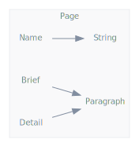

<!DOCTYPE html>
<html>
<head>
</head>
<body>

<h1>Design tests</h1>

<a href="https://github.com/CharlesCarley/MdDox">~</a>
<a href="indexpage.md#main">Main</a>
/
<a href="index.md#index">Index</a>
/
<b>Design</b>
 
 

<h2>Formatting</h2>
<b>Output Tests:</b>
 

 Output test for the special commands. In order of 
<code class="typewriter">\b</code>
, 
<code class="typewriter">\e</code>
, 
<code class="typewriter">\c</code>
.
<ul>
<li>This text should be 
<b>bold</b>
.
</li>
<li>This text should be 
<i>italic</i>
.
</li>
<li>This text should be in 
<code class="typewriter">typewriter</code>
 font.
</li>
</ul>

<h2>Paragraph</h2>
<b>Paragraph Test:</b>
 

 This text is a large block of text to inform you about something that is useful. However, for this block, the content is meant to be meaningless filler. Its sole purpose is to be nothing more than a long-winded block of over-stated, over-emphasized text to give the document a much fuller body. At first glance, it provides the feeling as if this content is saying something 
<b>important!</b>
 Although, while this text may appear to be saying something important; which it is not. That appearance in itself is the real meaning of it, which from a design perspective allows viewing how a large block of text will be output in the final markdown document. 
 

<h2>BlockQuote</h2>

<h3>Block quote test</h3>
<blockquote>
This is a markdown style quote... 
<blockquote>
This is a nested markdown style quote... 
<blockquote>
This is another nested markdown style quote... 
</blockquote>
</blockquote>
</blockquote>
 

<h3>HTML Block Quote Tests</h3>
<blockquote>
<b>Output Tests:</b>
 

 Output test for the special commands. In order of 
<code class="typewriter">\b</code>
, 
<code class="typewriter">\e</code>
, 
<code class="typewriter">\c</code>
.
<ul>
<li>This text should be 
<b>bold</b>
.
</li>
<li>This text should be 
<i>italic</i>
.
</li>
<li>This text should be in 
<code class="typewriter">typewriter</code>
 font. 
</li>
</ul>
</blockquote>

<h4>h4 Paragraph Test</h4>
This text is a large block of text to inform you about something that is useful. However, for this block, the content is meant to be meaningless filler. Its sole purpose is to be nothing more than a long-winded block of over-stated, over-emphasized text to give the document a much fuller body. At first glance, it provides the feeling as if this content is saying something 
<b>important!</b>
 Although, while this text may appear to be saying something important; which it is not. That appearance in itself is the real meaning of it, which from a design perspective allows viewing how a large block of text will be output in the final markdown document.

<h2>ImageTest</h2>

<h3>Image Tests:</h3>
In order to implement custom dot diagrams the source needs to: 
 
<ul>
<li>Process dot source, and push it to a list in the site builder.
</li>
<li>Write the final image link as if it already exists.
</li>
<li>After all pages have been processed, the site builder needs to invoke the dot executable for each source and write the output to SVG.
</li>
<li><i>This is a pre-generated dot file, but it should be possible to do this on the fly!.</i>
 
</li>
</ul>
 
<blockquote>
The following sources were used to generate this page.
 
<a href="../xml/Design.xml#L1" class="icon-list-item">Design.xml
</a>

 
<a href="../xml/compound.xsd#L1" class="icon-list-item">compound.xsd
</a>

</blockquote>

</body>
</html>
