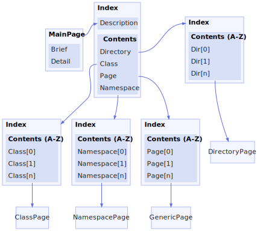

<h1>Site Layout</h1>

<a href="https://github.com/CharlesCarley/MdDox#~">~</a>
<a href="indexpage.md#mddox">MdDox</a>
/
<a href="index.md#index">Index</a>
/
<b>Site</b>
 
 
 

<h2>Details</h2>

<h3>Main Page</h3>
Main page is generated by Doxygen as indexpage.xml. It needs to be defined somewhere in the project&apos;s source code 
<code class="typewriter">\mainpage</code>

<h3>Index</h3>
Index implements a project wide table of contents. It is sorted by pages, directories, namespaces, and classes.

<h3>Namespace Index</h3>
The namespace index is defined in 
<code class="typewriter">namespace_index</code>
. It contains a List of all namespaces defined in the current index.xml.

<h3>Class Index</h3>
The class index is defined in 
<code class="typewriter">class_index</code>
. It contains a List of all classes defined in the current index.xml.

<h3>Page Index</h3>
The page index is defined in 
<code class="typewriter">page_index</code>
. It contains a List of all pages defined in the current index.xml.

<h3>Directory Index</h3>
The directory index is defined in 
<code class="typewriter">directory_index</code>
. It contains a List of all top level directories in the current project.
 
 
<i>project refers to the current index.xml file.</i>

</body>
</html>
