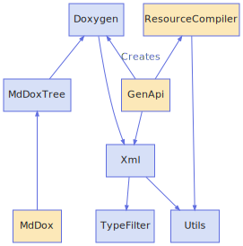

<h1>Site Layout</h1>

<a href="https://github.com/CharlesCarley/MdDox">~</a>
<a href="indexpage.md#main">Main</a>
/
<a href="index.md#index">Index</a>
/
<b>Site</b>
 
 
The following describes the overall layout of a generated site. 
 

<h2>Contents</h2>
<ul>
<li><a href="#details">Details</a>
</li>
<li><a href="#mainpage">MainPage</a>
</li>
<li><a href="#index">Index</a>
</li>
<li><a href="#namespaceindex">NamespaceIndex</a>
</li>
<li><a href="#directoryindex">DirectoryIndex</a>
</li>
<li><a href="#classindex">ClassIndex</a>
</li>
<li><a href="#pageindex">PageIndex</a>
</li>
</ul>

<h2>Details</h2>
 
 

<h3>MainPage</h3>
Main page is generated by Doxygen as indexpage.xml. It needs to be defined somewhere in the project&apos;s source code 
<code class="typewriter">\mainpage</code>
.
 

<h3>Index</h3>
The index implements a project wide table of contents. It is sorted by directories, namespaces, and classes.
 

<h3>NamespaceIndex</h3>
 

<h3>ClassIndex</h3>
 

<h3>PageIndex</h3>
 

<h3>DirectoryIndex</h3>
 

</body>
</html>
