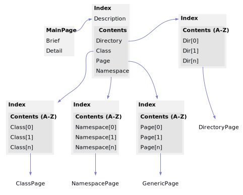

<!DOCTYPE html>
<html>
<head>
<meta http-equiv="Content-Type" content="text/xhtml;charset=UTF-8"/>
<meta http-equiv="X-UA-Compatible" content="IE=9" />
<meta http-equiv="Content-Type" content="text/xhtml;charset=UTF-8"/>
<meta name="robots" content="noindex" />
<meta name="generator" content="MdDox"/>
<meta name="viewport" content="width=device-width, initial-scale=1"/>
<link href="style.css" rel="stylesheet" type="text/css"/>
<title>Site Layout</title>
</head>
<body>

<h1>Site Layout</h1>

<a href="https://github.com/CharlesCarley/MdDoc">~</a>
<a href="indexpage.md#main">Main</a>
/
<a href="indexpage.md#index">Index</a>
/
<b>Site</b>
 
 
The following model describes the overall layout of the site. 
 

<h2>Contents</h2>
<ul>
<li><a href="#details">Details</a>
</li>
<li><a href="#mainpage">MainPage</a>
</li>
<li><a href="#index">Index</a>
</li>
<li><a href="#namespaceindex">NamespaceIndex</a>
</li>
<li><a href="#directoryindex">DirectoryIndex</a>
</li>
<li><a href="#classindex">ClassIndex</a>
</li>
<li><a href="#pageindex">PageIndex</a>
</li>
</ul>

<h2>Details</h2>
 
 

<h3>MainPage</h3>
Main page is generated by Doxygen as indexpage.xml. It needs to be defined somewhere in the project&apos;s source code comments as 
<code class="typewriter">\mainpage</code>
.
In this implementation its use is required. The reason for this is it keeps things simple and customizable because it allows descriptions to lead into key areas first, before presenting the index.
 

<h3>Index</h3>
 

<h3>NamespaceIndex</h3>
 

<h3>ClassIndex</h3>
 

<h3>PageIndex</h3>
 

<h3>DirectoryIndex</h3>
 
 
<blockquote>
The following sources were used to generate this page.
 
<a href="../xml/Site.xml#L1" class="icon-list-item">Site.xml
</a>

 
<a href="../xml/compound.xsd#L1" class="icon-list-item">compound.xsd
</a>

</blockquote>

</body>
</html>
