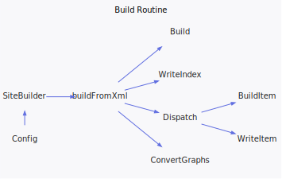

<h1>Application</h1>

<a href="https://github.com/CharlesCarley/MdDox#~">~</a>
<a href="index.md#index">MdDox</a>
/
<a href="a00986.md#mddox">MdDox</a>
::
<b>Application</b>
 
 
<a href="a01003.md#application">Application</a>
 is the entry point of this project. 
 
 
Its primary responsibility is to collect just enough information to instantiate a 
<a href="a01167.md#sitebuilder">MdDox::SiteBuilder</a>
. 
 
 
<b>The site builder</b>
 handles setting up and running the main loop. It stores references to other pages and general configuration properties to control the final output. 
 
 

 The following diagram outlines its main routine. 
 
 
 
 
 

 It needs to have all configuration parameters set before running. From there, it needs to load Doxygen&apos;s index file. With the input, it writes a primary index, class index, page index, namespace index, and directory index.
The application will then branch off and iterate over all individual elements which will invoke writers for each element. 
 

<h2>Private Members</h2>
<a href="#_config" class="icon-list-item">_config
</a>

 
<a href="#_indexfile" class="icon-list-item">_indexFile
</a>

 
<a href="#_outdir" class="icon-list-item">_outDir
</a>

 
<a href="#_writer" class="icon-list-item">_writer
</a>

 

<h2>Public Methods</h2>
<a href="#application" class="icon-list-item">Application
</a>

 
<a href="#~application" class="icon-list-item">~Application
</a>

 
<a href="#go" class="icon-list-item">go
</a>

 
<a href="#parse" class="icon-list-item">parse
</a>

 

<h4>Defined in</h4>
<a href="https://github.com/CharlesCarley/MdDox/blob/master/Source/MdDox/Main.cpp#L124" class="icon-list-item">Main.cpp
</a>

 
<a href="#application" class="icon-list-item">top
</a>

<h2>_config</h2>
<a href="a00986.md#string">String</a>
<b>_config</b>
 

<h4>Defined in</h4>
<a href="https://github.com/CharlesCarley/MdDox/blob/master/Source/MdDox/Main.cpp#L129" class="icon-list-item">Main.cpp
</a>

 
<a href="#application" class="icon-list-item">top
</a>

 

<h2>_indexFile</h2>
<a href="a01239.md#pathutil">PathUtil</a>
<b>_indexFile</b>
 

<h4>Defined in</h4>
<a href="https://github.com/CharlesCarley/MdDox/blob/master/Source/MdDox/Main.cpp#L127" class="icon-list-item">Main.cpp
</a>

 
<a href="#application" class="icon-list-item">top
</a>

 

<h2>_outDir</h2>
<a href="a01239.md#pathutil">PathUtil</a>
<b>_outDir</b>
 

<h4>Defined in</h4>
<a href="https://github.com/CharlesCarley/MdDox/blob/master/Source/MdDox/Main.cpp#L128" class="icon-list-item">Main.cpp
</a>

 
<a href="#application" class="icon-list-item">top
</a>

 

<h2>_writer</h2>
<a href="a01019.md#documentwriter">DocumentWriter</a>
 *
<b>_writer</b>
 

<h4>Defined in</h4>
<a href="https://github.com/CharlesCarley/MdDox/blob/master/Source/MdDox/Main.cpp#L126" class="icon-list-item">Main.cpp
</a>

 
<a href="#application" class="icon-list-item">top
</a>

 

<h2>Application</h2>
<b>Application</b>
<i>(</i>
<i>)</i>

<h4>Defined in</h4>
<a href="https://github.com/CharlesCarley/MdDox/blob/master/Source/MdDox/Main.cpp#L132" class="icon-list-item">Main.cpp
</a>

 
<a href="#application" class="icon-list-item">top
</a>

 

<h2>~Application</h2>
<b>~Application</b>
<i>(</i>
<i>)</i>

<h4>Defined in</h4>
<a href="https://github.com/CharlesCarley/MdDox/blob/master/Source/MdDox/Main.cpp#L137" class="icon-list-item">Main.cpp
</a>

 
<a href="#application" class="icon-list-item">top
</a>

 

<h2>go</h2>
int
<b>go</b>
<i>(</i>
<i>)</i>
 
 
Is the primary application routine. 
 

<h4>Returns</h4>
Zero on success or not at all if an internal exception is raised. 
 

<h4>References</h4>

<a href="a01167.md#loadconfig">loadConfig</a>

<a href="a01167.md#backendtype">backendType</a>

<a href="a00986.md#backendmarkdown">BackendMarkdown</a>

<a href="a00986.md#backendhtml">BackendHtml</a>

<a href="a01167.md#buildfromxml">buildFromXml</a>

<a href="a01239.md#fullpath">fullPath</a>

<h4>Defined in</h4>
<a href="https://github.com/CharlesCarley/MdDox/blob/master/Source/MdDox/Main.cpp#L170" class="icon-list-item">Main.cpp
</a>

 
<a href="#application" class="icon-list-item">top
</a>

 

<h2>parse</h2>
bool
<b>parse</b>
<i>(</i>

const int
argc

char **
argv

<i>)</i>
 
 
Interprets the supplied command line variables. 
 

<h4>Returns</h4>
True on success, otherwise, false if the parser fails to parse the arguments. 
 

<h4>See</h4>
<a href="a00992.md#commandline">MdDox::CommandLine</a>
 

<h4>References</h4>

<a href="a01183.md#parse">parse</a>

<a href="a00986.md#switches">Switches</a>

<a href="a00986.md#opmax">OpMax</a>

<a href="a01183.md#string">string</a>

<a href="a00986.md#optoutputdirectory">OptOutputDirectory</a>

<a href="a00986.md#optindexfile">OptIndexFile</a>

<a href="a00986.md#optconfigfile">OptConfigFile</a>

<a href="a01239.md#empty">empty</a>

<a href="a01183.md#usage">usage</a>

<h4>Defined in</h4>
<a href="https://github.com/CharlesCarley/MdDox/blob/master/Source/MdDox/Main.cpp#L147" class="icon-list-item">Main.cpp
</a>

 
<a href="#application" class="icon-list-item">top
</a>

 

</body>
</html>
