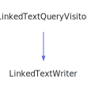

<h1>LinkedTextWriter</h1>

<a href="https://github.com/CharlesCarley/MdDox#~">~</a>
<a href="index.md#index">MdDox</a>
/
<a href="a00986.md#mddox">MdDox</a>
::
<b>LinkedTextWriter</b>
 
 

<h4>Derived From</h4>

<a href="a01555.md#linkedtextqueryvisitor">MdDox::Doxygen::Visitors::LinkedTextQueryVisitor</a>

 

<h2>Private Members</h2>
<a href="#_out" class="icon-list-item">_out
</a>

 
<a href="#_stream" class="icon-list-item">_stream
</a>

 
<a href="#_writer" class="icon-list-item">_writer
</a>

 

<h2>Private Methods</h2>
<a href="#visitedref" class="icon-list-item">visitedRef
</a>

 
<a href="#visitedtext" class="icon-list-item">visitedText
</a>

 

<h2>Public Methods</h2>
<a href="#linkedtextwriter" class="icon-list-item">LinkedTextWriter
</a>

 
<a href="#write" class="icon-list-item">write
</a>

 

<h4>Defined in</h4>
<a href="https://github.com/CharlesCarley/MdDox/blob/master/Source/MdDoxTree/LinkedTextWriter.h#L31" class="icon-list-item">LinkedTextWriter.h
</a>

 
<a href="#linkedtextwriter" class="icon-list-item">top
</a>

<h2>_out</h2>
<a href="a00986.md#outputstringstream">OutputStringStream</a>
<b>_out</b>
 

<h4>Defined in</h4>
<a href="https://github.com/CharlesCarley/MdDox/blob/master/Source/MdDoxTree/LinkedTextWriter.h#L35" class="icon-list-item">LinkedTextWriter.h
</a>

 
<a href="#linkedtextwriter" class="icon-list-item">top
</a>

 

<h2>_stream</h2>
<a href="a00986.md#ostream">OStream</a>
 *
<b>_stream</b>
 

<h4>Defined in</h4>
<a href="https://github.com/CharlesCarley/MdDox/blob/master/Source/MdDoxTree/LinkedTextWriter.h#L34" class="icon-list-item">LinkedTextWriter.h
</a>

 
<a href="#linkedtextwriter" class="icon-list-item">top
</a>

 

<h2>_writer</h2>
<a href="a01019.md#documentwriter">DocumentWriter</a>
 *
<b>_writer</b>
 

<h4>Defined in</h4>
<a href="https://github.com/CharlesCarley/MdDox/blob/master/Source/MdDoxTree/LinkedTextWriter.h#L33" class="icon-list-item">LinkedTextWriter.h
</a>

 
<a href="#linkedtextwriter" class="icon-list-item">top
</a>

 

<h2>visitedRef</h2>
void
<b>visitedRef</b>
<i>(</i>

const 
<a href="a01707.md#reftextquery">Doxygen::RefTextQuery</a>
 &amp;
query

<i>)</i>
 
 
Called when the element 
<b>ref</b>
 is found. 
 
 
<ul>
<li><i>query</i>
: 
Const reference to the RefTextQuery class. 
</li>
</ul>

<h4>Defined in</h4>
<a href="https://github.com/CharlesCarley/MdDox/blob/master/Source/MdDoxTree/LinkedTextWriter.h#L38" class="icon-list-item">LinkedTextWriter.h
</a>

 
<a href="https://github.com/CharlesCarley/MdDox/blob/master/Source/MdDoxTree/LinkedTextWriter.cpp#L41" class="icon-list-item">LinkedTextWriter.cpp
</a>

 
<a href="#linkedtextwriter" class="icon-list-item">top
</a>

 

<h2>visitedText</h2>
void
<b>visitedText</b>
<i>(</i>

const 
<a href="a00986.md#string">String</a>
 &amp;

<i>)</i>
 
 
Callback for every _text_node. 
 

<h4>Defined in</h4>
<a href="https://github.com/CharlesCarley/MdDox/blob/master/Source/MdDoxTree/LinkedTextWriter.h#L37" class="icon-list-item">LinkedTextWriter.h
</a>

 
<a href="https://github.com/CharlesCarley/MdDox/blob/master/Source/MdDoxTree/LinkedTextWriter.cpp#L36" class="icon-list-item">LinkedTextWriter.cpp
</a>

 
<a href="#linkedtextwriter" class="icon-list-item">top
</a>

 

<h2>LinkedTextWriter</h2>
<b>LinkedTextWriter</b>
<i>(</i>

<a href="a01019.md#documentwriter">DocumentWriter</a>
 *
writer

<a href="a00986.md#ostream">OStream</a>
 *
out

<i>)</i>

<h4>Defined in</h4>
<a href="https://github.com/CharlesCarley/MdDox/blob/master/Source/MdDoxTree/LinkedTextWriter.h#L41" class="icon-list-item">LinkedTextWriter.h
</a>

 
<a href="https://github.com/CharlesCarley/MdDox/blob/master/Source/MdDoxTree/LinkedTextWriter.cpp#L30" class="icon-list-item">LinkedTextWriter.cpp
</a>

 
<a href="#linkedtextwriter" class="icon-list-item">top
</a>

 

<h2>write</h2>
bool
<b>write</b>
<i>(</i>

const 
<a href="a01559.md#linkedtextquery">Doxygen::LinkedTextQuery</a>
 &amp;
query

<i>)</i>

<h4>References</h4>

<a href="a01415.md#isvalid">isValid</a>

<a href="a01559.md#visit">visit</a>

<a href="a00986.md#syncstream">syncStream</a>

<h4>Defined in</h4>
<a href="https://github.com/CharlesCarley/MdDox/blob/master/Source/MdDoxTree/LinkedTextWriter.h#L43" class="icon-list-item">LinkedTextWriter.h
</a>

 
<a href="https://github.com/CharlesCarley/MdDox/blob/master/Source/MdDoxTree/LinkedTextWriter.cpp#L58" class="icon-list-item">LinkedTextWriter.cpp
</a>

 
<a href="#linkedtextwriter" class="icon-list-item">top
</a>

 

</body>
</html>
