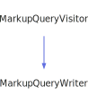

<h1>MarkupQueryWriter</h1>

<a href="https://github.com/CharlesCarley/MdDox#~">~</a>
<a href="index.md#index">MdDox</a>
/
<a href="a00986.md#mddox">MdDox</a>
::
<b>MarkupQueryWriter</b>
 
 

<h4>Derived From</h4>

<a href="a01603.md#markupqueryvisitor">MdDox::Doxygen::Visitors::MarkupQueryVisitor</a>

 

<h2>Private Members</h2>
<a href="#_out" class="icon-list-item">_out
</a>

 
<a href="#_stream" class="icon-list-item">_stream
</a>

 
<a href="#_writer" class="icon-list-item">_writer
</a>

 

<h2>Private Methods</h2>
<a href="#visitedref" class="icon-list-item">visitedRef
</a>

 

<h2>Public Methods</h2>
<a href="#markupquerywriter" class="icon-list-item">MarkupQueryWriter
</a>

 
<a href="#write" class="icon-list-item">write
</a>

 

<h4>Defined in</h4>
<a href="https://github.com/CharlesCarley/MdDox/blob/master/Source/MdDoxTree/MarkupQueryWriter.h#L31" class="icon-list-item">MarkupQueryWriter.h
</a>

 
 
<a href="#markupquerywriter" class="icon-list-item">top
</a>

<h2>_out</h2>
<a href="a00986.md#outputstringstream">OutputStringStream</a>
<b>_out</b>
 

<h4>Defined in</h4>
<a href="https://github.com/CharlesCarley/MdDox/blob/master/Source/MdDoxTree/MarkupQueryWriter.h#L35" class="icon-list-item">MarkupQueryWriter.h
</a>

 
 
<a href="#markupquerywriter" class="icon-list-item">top
</a>

 

<h2>_stream</h2>
<a href="a00986.md#ostream">OStream</a>
 *
<b>_stream</b>
 

<h4>Defined in</h4>
<a href="https://github.com/CharlesCarley/MdDox/blob/master/Source/MdDoxTree/MarkupQueryWriter.h#L34" class="icon-list-item">MarkupQueryWriter.h
</a>

 
 
<a href="#markupquerywriter" class="icon-list-item">top
</a>

 

<h2>_writer</h2>
<a href="a01019.md#documentwriter">DocumentWriter</a>
 *
<b>_writer</b>
 

<h4>Defined in</h4>
<a href="https://github.com/CharlesCarley/MdDox/blob/master/Source/MdDoxTree/MarkupQueryWriter.h#L33" class="icon-list-item">MarkupQueryWriter.h
</a>

 
 
<a href="#markupquerywriter" class="icon-list-item">top
</a>

 

<h2>visitedRef</h2>
void
<b>visitedRef</b>
<i>(</i>

const 
<a href="a01707.md#reftextquery">Doxygen::RefTextQuery</a>
 &amp;
query

<i>)</i>

<h4>Details</h4>
Called when the element 
<b>ref</b>
 is found. 
 
 
<ul>
<li><b>query</b>
 - 
Const reference to the RefTextQuery class. 
</li>
</ul>
 

<h4>Defined in</h4>
<a href="https://github.com/CharlesCarley/MdDox/blob/master/Source/MdDoxTree/MarkupQueryWriter.h#L37" class="icon-list-item">MarkupQueryWriter.h
</a>

 
<a href="https://github.com/CharlesCarley/MdDox/blob/master/Source/MdDoxTree/MarkupQueryWriter.cpp#L44" class="icon-list-item">MarkupQueryWriter.cpp
</a>

 
 
<a href="#markupquerywriter" class="icon-list-item">top
</a>

 

<h2>MarkupQueryWriter</h2>
<b>MarkupQueryWriter</b>
<i>(</i>

<a href="a01019.md#documentwriter">DocumentWriter</a>
 *
writer

<a href="a00986.md#ostream">OStream</a>
 *
out

<i>)</i>

<h4>Defined in</h4>
<a href="https://github.com/CharlesCarley/MdDox/blob/master/Source/MdDoxTree/MarkupQueryWriter.h#L40" class="icon-list-item">MarkupQueryWriter.h
</a>

 
<a href="https://github.com/CharlesCarley/MdDox/blob/master/Source/MdDoxTree/MarkupQueryWriter.cpp#L32" class="icon-list-item">MarkupQueryWriter.cpp
</a>

 
 
<a href="#markupquerywriter" class="icon-list-item">top
</a>

 

<h2>write</h2>
void
<b>write</b>
<i>(</i>

const 
<a href="a01607.md#markupquery">Doxygen::MarkupQuery</a>
 &amp;
paragraph

<i>)</i>

<h4>References</h4>

<a href="a00986.md#syncstream">syncStream</a>

<h4>Defined in</h4>
<a href="https://github.com/CharlesCarley/MdDox/blob/master/Source/MdDoxTree/MarkupQueryWriter.h#L42" class="icon-list-item">MarkupQueryWriter.h
</a>

 
<a href="https://github.com/CharlesCarley/MdDox/blob/master/Source/MdDoxTree/MarkupQueryWriter.cpp#L38" class="icon-list-item">MarkupQueryWriter.cpp
</a>

 
 
<a href="#markupquerywriter" class="icon-list-item">top
</a>

 

</body>
</html>
