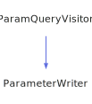

<h1>PageWriter</h1>

<a href="https://github.com/CharlesCarley/MdDox#~">~</a>
<a href="index.md#index">MdDox</a>
/
<a href="a00986.md#mddox">MdDox</a>
::
<b>PageWriter</b>
 
 

<h4>Derived From</h4>

<a href="a01307.md#compounddefqueryvisitor">MdDox::Doxygen::Visitors::CompoundDefQueryVisitor</a>

<h4>Derived By</h4>

<a href="a01007.md#classpagewriter">MdDox::ClassPageWriter</a>

<a href="a01015.md#directorypagewriter">MdDox::DirectoryPageWriter</a>

<a href="a01039.md#genericpagewriter">MdDox::GenericPageWriter</a>

<a href="a01099.md#namespacepagewriter">MdDox::NamespacePageWriter</a>

 

<h2>Protected Members</h2>
<a href="#_indir" class="icon-list-item">_inDir
</a>

 
<a href="#_out" class="icon-list-item">_out
</a>

 
<a href="#_outdir" class="icon-list-item">_outDir
</a>

 
<a href="#_ref" class="icon-list-item">_ref
</a>

 
<a href="#_sections" class="icon-list-item">_sections
</a>

 
<a href="#_writer" class="icon-list-item">_writer
</a>

 

<h2>Private Methods</h2>
<a href="#begindocument" class="icon-list-item">beginDocument
</a>

 
<a href="#enddocument" class="icon-list-item">endDocument
</a>

 
<a href="#writedescription" class="icon-list-item">writeDescription
</a>

 

<h2>Protected Methods</h2>
<a href="#notifybriefdescription" class="icon-list-item">notifyBriefDescription
</a>

 
<a href="#notifydetaildescription" class="icon-list-item">notifyDetailDescription
</a>

 
<a href="#notifydetaildescriptionheading" class="icon-list-item">notifyDetailDescriptionHeading
</a>

 
<a href="#presortquery" class="icon-list-item">preSortQuery
</a>

 
<a href="#visitedbriefdescription" class="icon-list-item">visitedBriefDescription
</a>

 
<a href="#visiteddetaileddescription" class="icon-list-item">visitedDetailedDescription
</a>

 
<a href="#visitedsectiondef" class="icon-list-item">visitedSectionDef
</a>

 
<a href="#writedetails" class="icon-list-item">writeDetails
</a>

 

<h2>Public Methods</h2>
<a href="#pagewriter" class="icon-list-item">PageWriter
</a>

 
<a href="#~pagewriter" class="icon-list-item">~PageWriter
</a>

 
<a href="#exec" class="icon-list-item">exec
</a>

 

<h4>Defined in</h4>
<a href="https://github.com/CharlesCarley/MdDox/blob/master/Source/MdDoxTree/PageWriter.h#L33" class="icon-list-item">PageWriter.h
</a>

 
 
<a href="#pagewriter" class="icon-list-item">top
</a>

<h2>_inDir</h2>
<a href="a01239.md#pathutil">PathUtil</a>
<b>_inDir</b>
 

<h4>Defined in</h4>
<a href="https://github.com/CharlesCarley/MdDox/blob/master/Source/MdDoxTree/PageWriter.h#L39" class="icon-list-item">PageWriter.h
</a>

 
 
<a href="#pagewriter" class="icon-list-item">top
</a>

 

<h2>_out</h2>
<a href="a00986.md#outputfilestream">OutputFileStream</a>
<b>_out</b>
 

<h4>Defined in</h4>
<a href="https://github.com/CharlesCarley/MdDox/blob/master/Source/MdDoxTree/PageWriter.h#L37" class="icon-list-item">PageWriter.h
</a>

 
 
<a href="#pagewriter" class="icon-list-item">top
</a>

 

<h2>_outDir</h2>
<a href="a01239.md#pathutil">PathUtil</a>
<b>_outDir</b>
 

<h4>Defined in</h4>
<a href="https://github.com/CharlesCarley/MdDox/blob/master/Source/MdDoxTree/PageWriter.h#L38" class="icon-list-item">PageWriter.h
</a>

 
 
<a href="#pagewriter" class="icon-list-item">top
</a>

 

<h2>_ref</h2>
<a href="a01127.md#reference">Reference</a>
<b>_ref</b>
 

<h4>Defined in</h4>
<a href="https://github.com/CharlesCarley/MdDox/blob/master/Source/MdDoxTree/PageWriter.h#L36" class="icon-list-item">PageWriter.h
</a>

 
 
<a href="#pagewriter" class="icon-list-item">top
</a>

 

<h2>_sections</h2>
<a href="a00994.md#nodearray">Xml::NodeArray</a>
<b>_sections</b>
 

<h4>Defined in</h4>
<a href="https://github.com/CharlesCarley/MdDox/blob/master/Source/MdDoxTree/PageWriter.h#L41" class="icon-list-item">PageWriter.h
</a>

 
 
<a href="#pagewriter" class="icon-list-item">top
</a>

 

<h2>_writer</h2>
<a href="a01019.md#documentwriter">DocumentWriter</a>
 *
<b>_writer</b>
 

<h4>Defined in</h4>
<a href="https://github.com/CharlesCarley/MdDox/blob/master/Source/MdDoxTree/PageWriter.h#L35" class="icon-list-item">PageWriter.h
</a>

 
 
<a href="#pagewriter" class="icon-list-item">top
</a>

 

<h2>beginDocument</h2>
void
<b>beginDocument</b>
<i>(</i>

const 
<a href="a01311.md#compounddefquery">Doxygen::CompoundDefQuery</a>
 &amp;
query

<i>)</i>

<h4>Defined in</h4>
<a href="https://github.com/CharlesCarley/MdDox/blob/master/Source/MdDoxTree/PageWriter.h#L46" class="icon-list-item">PageWriter.h
</a>

 
<a href="https://github.com/CharlesCarley/MdDox/blob/master/Source/MdDoxTree/PageWriter.cpp#L70" class="icon-list-item">PageWriter.cpp
</a>

 
 
<a href="#pagewriter" class="icon-list-item">top
</a>

 

<h2>endDocument</h2>
void
<b>endDocument</b>
<i>(</i>

const 
<a href="a01311.md#compounddefquery">Doxygen::CompoundDefQuery</a>
 &amp;
query

<i>)</i>

<h4>Defined in</h4>
<a href="https://github.com/CharlesCarley/MdDox/blob/master/Source/MdDoxTree/PageWriter.h#L48" class="icon-list-item">PageWriter.h
</a>

 
<a href="https://github.com/CharlesCarley/MdDox/blob/master/Source/MdDoxTree/PageWriter.cpp#L92" class="icon-list-item">PageWriter.cpp
</a>

 
 
<a href="#pagewriter" class="icon-list-item">top
</a>

 

<h2>writeDescription</h2>
bool
<b>writeDescription</b>
<i>(</i>

const 
<a href="a01339.md#descriptionquery">Doxygen::DescriptionQuery</a>
 &amp;
query

<i>)</i>

<h4>Defined in</h4>
<a href="https://github.com/CharlesCarley/MdDox/blob/master/Source/MdDoxTree/PageWriter.h#L44" class="icon-list-item">PageWriter.h
</a>

 
<a href="https://github.com/CharlesCarley/MdDox/blob/master/Source/MdDoxTree/PageWriter.cpp#L62" class="icon-list-item">PageWriter.cpp
</a>

 
 
<a href="#pagewriter" class="icon-list-item">top
</a>

 

<h2>notifyBriefDescription</h2>
void
<b>notifyBriefDescription</b>
<i>(</i>

const 
<a href="a01339.md#descriptionquery">Doxygen::DescriptionQuery</a>
 &amp;
query

<i>)</i>

<h4>Defined in</h4>
<a href="https://github.com/CharlesCarley/MdDox/blob/master/Source/MdDoxTree/PageWriter.h#L59" class="icon-list-item">PageWriter.h
</a>

 
 
<a href="#pagewriter" class="icon-list-item">top
</a>

 

<h2>notifyDetailDescription</h2>
void
<b>notifyDetailDescription</b>
<i>(</i>

const 
<a href="a01339.md#descriptionquery">Doxygen::DescriptionQuery</a>
 &amp;
query

<i>)</i>

<h4>Defined in</h4>
<a href="https://github.com/CharlesCarley/MdDox/blob/master/Source/MdDoxTree/PageWriter.h#L63" class="icon-list-item">PageWriter.h
</a>

 
 
<a href="#pagewriter" class="icon-list-item">top
</a>

 

<h2>notifyDetailDescriptionHeading</h2>
void
<b>notifyDetailDescriptionHeading</b>
<i>(</i>

const 
<a href="a01339.md#descriptionquery">Doxygen::DescriptionQuery</a>
 &amp;
query

<i>)</i>

<h4>Defined in</h4>
<a href="https://github.com/CharlesCarley/MdDox/blob/master/Source/MdDoxTree/PageWriter.h#L61" class="icon-list-item">PageWriter.h
</a>

 
 
<a href="#pagewriter" class="icon-list-item">top
</a>

 

<h2>preSortQuery</h2>
void
<b>preSortQuery</b>
<i>(</i>

const 
<a href="a01311.md#compounddefquery">Doxygen::CompoundDefQuery</a>
 &amp;
query

<i>)</i>

<h4>Defined in</h4>
<a href="https://github.com/CharlesCarley/MdDox/blob/master/Source/MdDoxTree/PageWriter.h#L57" class="icon-list-item">PageWriter.h
</a>

 
 
<a href="#pagewriter" class="icon-list-item">top
</a>

 

<h2>visitedBriefDescription</h2>
void
<b>visitedBriefDescription</b>
<i>(</i>

const 
<a href="a01339.md#descriptionquery">Doxygen::DescriptionQuery</a>
 &amp;
query

<i>)</i>

<h4>Details</h4>
Called when the element 
<b>briefdescription</b>
 is found. 
 
 
<ul>
<li><b>query</b>
 - 
Const reference to the DescriptionQuery class. 
</li>
</ul>
 

<h4>References</h4>

<a href="a01103.md#notifybriefdescription">notifyBriefDescription</a>

<h4>Defined in</h4>
<a href="https://github.com/CharlesCarley/MdDox/blob/master/Source/MdDoxTree/PageWriter.h#L53" class="icon-list-item">PageWriter.h
</a>

 
<a href="https://github.com/CharlesCarley/MdDox/blob/master/Source/MdDoxTree/PageWriter.cpp#L48" class="icon-list-item">PageWriter.cpp
</a>

 
 
<a href="#pagewriter" class="icon-list-item">top
</a>

 

<h2>visitedDetailedDescription</h2>
void
<b>visitedDetailedDescription</b>
<i>(</i>

const 
<a href="a01339.md#descriptionquery">Doxygen::DescriptionQuery</a>
 &amp;
query

<i>)</i>

<h4>Details</h4>
Called when the element 
<b>detaileddescription</b>
 is found. 
 
 
<ul>
<li><b>query</b>
 - 
Const reference to the DescriptionQuery class. 
</li>
</ul>
 

<h4>References</h4>

<a href="a01415.md#empty">empty</a>

<a href="a01103.md#notifydetaildescriptionheading">notifyDetailDescriptionHeading</a>

<a href="a01103.md#notifydetaildescription">notifyDetailDescription</a>

<h4>Defined in</h4>
<a href="https://github.com/CharlesCarley/MdDox/blob/master/Source/MdDoxTree/PageWriter.h#L55" class="icon-list-item">PageWriter.h
</a>

 
<a href="https://github.com/CharlesCarley/MdDox/blob/master/Source/MdDoxTree/PageWriter.cpp#L54" class="icon-list-item">PageWriter.cpp
</a>

 
 
<a href="#pagewriter" class="icon-list-item">top
</a>

 

<h2>visitedSectionDef</h2>
void
<b>visitedSectionDef</b>
<i>(</i>

const 
<a href="a01759.md#sectiondefquery">Doxygen::SectionDefQuery</a>
 &amp;
query

<i>)</i>

<h4>Details</h4>
Called when the element 
<b>sectiondef</b>
 is found. 
 
 
<ul>
<li><b>query</b>
 - 
Const reference to the SectionDefQuery class. 
</li>
</ul>
 

<h4>References</h4>

<a href="a01103.md#_writer">_writer</a>

<a href="a01103.md#_out">_out</a>

<a href="a01159.md#setdepth">setDepth</a>

<a href="a01159.md#write">write</a>

<a href="a01103.md#_sections">_sections</a>

<a href="a01415.md#node">node</a>

<h4>Defined in</h4>
<a href="https://github.com/CharlesCarley/MdDox/blob/master/Source/MdDoxTree/PageWriter.h#L51" class="icon-list-item">PageWriter.h
</a>

 
<a href="https://github.com/CharlesCarley/MdDox/blob/master/Source/MdDoxTree/PageWriter.cpp#L97" class="icon-list-item">PageWriter.cpp
</a>

 
 
<a href="#pagewriter" class="icon-list-item">top
</a>

 

<h2>writeDetails</h2>
void
<b>writeDetails</b>
<i>(</i>
<i>)</i>

<h4>References</h4>

<a href="a01103.md#_sections">_sections</a>

<a href="a01103.md#_writer">_writer</a>

<a href="a01103.md#_out">_out</a>

<a href="a01163.md#write">write</a>

<h4>Defined in</h4>
<a href="https://github.com/CharlesCarley/MdDox/blob/master/Source/MdDoxTree/PageWriter.h#L65" class="icon-list-item">PageWriter.h
</a>

 
<a href="https://github.com/CharlesCarley/MdDox/blob/master/Source/MdDoxTree/PageWriter.cpp#L106" class="icon-list-item">PageWriter.cpp
</a>

 
 
<a href="#pagewriter" class="icon-list-item">top
</a>

 

<h2>PageWriter</h2>
<b>PageWriter</b>
<i>(</i>

<a href="a01019.md#documentwriter">DocumentWriter</a>
 *
writer

const 
<a href="a01127.md#reference">Reference</a>
 &amp;
ref

const 
<a href="a01239.md#pathutil">PathUtil</a>
 &amp;
out

<i>)</i>

<h4>References</h4>

<a href="a01103.md#_indir">_inDir</a>

<a href="a01103.md#_outdir">_outDir</a>

<a href="a01239.md#parentdir">parentDir</a>

<a href="a01239.md#appenddirectory">appendDirectory</a>

<h4>Defined in</h4>
<a href="https://github.com/CharlesCarley/MdDox/blob/master/Source/MdDoxTree/PageWriter.h#L68" class="icon-list-item">PageWriter.h
</a>

 
<a href="https://github.com/CharlesCarley/MdDox/blob/master/Source/MdDoxTree/PageWriter.cpp#L36" class="icon-list-item">PageWriter.cpp
</a>

 
 
<a href="#pagewriter" class="icon-list-item">top
</a>

 

<h2>~PageWriter</h2>
<b>~PageWriter</b>
<i>(</i>
<i>)</i>

<h4>Defined in</h4>
<a href="https://github.com/CharlesCarley/MdDox/blob/master/Source/MdDoxTree/PageWriter.h#L69" class="icon-list-item">PageWriter.h
</a>

 
 
<a href="#pagewriter" class="icon-list-item">top
</a>

 

<h2>exec</h2>
void
<b>exec</b>
<i>(</i>

const 
<a href="a01431.md#doxygenquery">Doxygen::DoxygenQuery</a>
 &amp;
doxygen

<i>)</i>

<h4>References</h4>

<a href="a01103.md#_out">_out</a>

<a href="a01103.md#_outdir">_outDir</a>

<a href="a01239.md#filename">fileName</a>

<a href="a00986.md#stringcombine">StringCombine</a>

<a href="a01103.md#_ref">_ref</a>

<a href="a01127.md#getid">getId</a>

<a href="a01167.md#get">get</a>

<a href="a01167.md#outputfileext">outputFileExt</a>

<a href="a01239.md#fullpath">fullPath</a>

<a href="a01415.md#node">node</a>

<a href="a01259.md#getfirstchild">getFirstChild</a>

<a href="a00991.md#doxcompounddef">DoxCompoundDef</a>

<a href="a01103.md#writedetails">writeDetails</a>

<h4>Defined in</h4>
<a href="https://github.com/CharlesCarley/MdDox/blob/master/Source/MdDoxTree/PageWriter.h#L71" class="icon-list-item">PageWriter.h
</a>

 
<a href="https://github.com/CharlesCarley/MdDox/blob/master/Source/MdDoxTree/PageWriter.cpp#L115" class="icon-list-item">PageWriter.cpp
</a>

 
 
<a href="#pagewriter" class="icon-list-item">top
</a>

 

</body>
</html>
