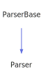

<a id="parser"></a>
<h1>Parser</h1>
<a id="a01263"></a>
<a href="https://github.com/CharlesCarley/MdDox#~">~</a>
<a href="index.md#index">MdDox</a>
<span class="inline-text">/</span>
<a href="a00986.md#mddox">MdDox</a>
<span class="inline-text">::</span>
<a href="a00994.md#xml">Xml</a>
<span class="inline-text">::</span>
<span class="bold-text"><b>Parser</b></span>
<br/>
<br/>
<a href="a01263.md#parser">Parser</a>
<span class="inline-text"> is the XML based implementation of the ParseBase base class. </span>
<br/>
<br/>
<span class="inline-text">It&apos;s primary responsibility is to manage the </span>
<a href="a01267.md#scanner">Scanner</a>
<span class="inline-text"> and build the </span>
<a href="a01259.md#node">Node</a>
<span class="inline-text"> tree.</span>
<span class="inline-text">It uses the following grammar to define an XML document.</span>

```txt
<Document> ::=  <XmlRoot> 
             |  <ObjectList>
             |

<XmlRoot> ::= '<?xml' <AttributeList> '?>' <Object>

<ObjectList> ::= <Object> <ObjectList>
               | <Object>

<Content> ::= <ObjectList>
            | <Text> <Content>
            |

<Object> ::= <StartObject>  <Content> <EndObject>

<StartObject>  ::= '<' Identifier <AttributeList> '>'
                 | '<' Identifier <AttributeList> '/' '>'

<EndObject>    ::= '<' '/' Identifier '>'

<AttributeList> ::= <Attribute> <AttributeList>
                  |

<Attribute> ::=  <AttributeName> '=' String
<AttributeName> ::= Identifier
                  | Identifier ':' Identifier
<Text> ::= Content
         | String
         | Identifier
```
<br/>
<a id="derived-from"></a>
<h4>Derived From</h4>
<div class="icon-link">
<a href="a01227.md#parserbase">MdDox::ParserBase</a>
</div>
<br/>
<a id="private-members"></a>
<h2>Private Members</h2>
<span class="icon-list-item"><a href="#_filter" class="icon-list-item"><span class="icon-list-item">_filter</span>
</a>
</span>
<br/>
<span class="icon-list-item"><a href="#_labels" class="icon-list-item"><span class="icon-list-item">_labels</span>
</a>
</span>
<br/>
<span class="icon-list-item"><a href="#_root" class="icon-list-item"><span class="icon-list-item">_root</span>
</a>
</span>
<br/>
<span class="icon-list-item"><a href="#_stack" class="icon-list-item"><span class="icon-list-item">_stack</span>
</a>
</span>
<br/>
<a id="private-methods"></a>
<h2>Private Methods</h2>
<span class="icon-list-item"><a href="#createtag" class="icon-list-item"><span class="icon-list-item">createTag</span>
</a>
</span>
<br/>
<span class="icon-list-item"><a href="#droprule" class="icon-list-item"><span class="icon-list-item">dropRule</span>
</a>
</span>
<br/>
<span class="icon-list-item"><a href="#parseerrormessageimpl" class="icon-list-item"><span class="icon-list-item">parseErrorMessageImpl</span>
</a>
</span>
<br/>
<span class="icon-list-item"><a href="#parseimpl" class="icon-list-item"><span class="icon-list-item">parseImpl</span>
</a>
</span>
<br/>
<span class="icon-list-item"><a href="#reducerule" class="icon-list-item"><span class="icon-list-item">reduceRule</span>
</a>
</span>
<br/>
<span class="icon-list-item"><a href="#ruleattribute" class="icon-list-item"><span class="icon-list-item">ruleAttribute</span>
</a>
</span>
<br/>
<span class="icon-list-item"><a href="#ruleattributelist" class="icon-list-item"><span class="icon-list-item">ruleAttributeList</span>
</a>
</span>
<br/>
<span class="icon-list-item"><a href="#rulecontent" class="icon-list-item"><span class="icon-list-item">ruleContent</span>
</a>
</span>
<br/>
<span class="icon-list-item"><a href="#ruleendtag" class="icon-list-item"><span class="icon-list-item">ruleEndTag</span>
</a>
</span>
<br/>
<span class="icon-list-item"><a href="#ruleobject" class="icon-list-item"><span class="icon-list-item">ruleObject</span>
</a>
</span>
<br/>
<span class="icon-list-item"><a href="#ruleobjectlist" class="icon-list-item"><span class="icon-list-item">ruleObjectList</span>
</a>
</span>
<br/>
<span class="icon-list-item"><a href="#rulestarttag" class="icon-list-item"><span class="icon-list-item">ruleStartTag</span>
</a>
</span>
<br/>
<span class="icon-list-item"><a href="#rulexmlroot" class="icon-list-item"><span class="icon-list-item">ruleXmlRoot</span>
</a>
</span>
<br/>
<span class="icon-list-item"><a href="#top" class="icon-list-item"><span class="icon-list-item">top</span>
</a>
</span>
<br/>
<span class="icon-list-item"><a href="#writeimpl" class="icon-list-item"><span class="icon-list-item">writeImpl</span>
</a>
</span>
<br/>
<a id="public-methods"></a>
<h2>Public Methods</h2>
<span class="icon-list-item"><a href="#parser" class="icon-list-item"><span class="icon-list-item">Parser</span>
</a>
</span>
<br/>
<span class="icon-list-item"><a href="#~parser" class="icon-list-item"><span class="icon-list-item">~Parser</span>
</a>
</span>
<br/>
<span class="icon-list-item"><a href="#applyfilter" class="icon-list-item"><span class="icon-list-item">applyFilter</span>
</a>
</span>
<br/>
<span class="icon-list-item"><a href="#root" class="icon-list-item"><span class="icon-list-item">root</span>
</a>
</span>
<br/>
<a id="defined-in"></a>
<h4>Defined in</h4>
<span class="icon-list-item"><a href="https://github.com/CharlesCarley/MdDox/blob/master/Source/Xml/Parser.h#L117" class="icon-list-item"><span class="icon-list-item">Parser.h</span>
</a>
</span>
<br/>
<span class="icon-list-item"><a href="#parser" class="icon-list-item"><span class="icon-list-item">top</span>
</a>
</span>
<a id="_filter"></a>
<h2>_filter</h2>
<a href="a00986.md#typefiltermap">TypeFilterMap</a>
<span class="bold-text"><b>_filter</b></span>
<br/>
<a id="defined-in"></a>
<h4>Defined in</h4>
<span class="icon-list-item"><a href="https://github.com/CharlesCarley/MdDox/blob/master/Source/Xml/Parser.h#L122" class="icon-list-item"><span class="icon-list-item">Parser.h</span>
</a>
</span>
<br/>
<span class="icon-list-item"><a href="#parser" class="icon-list-item"><span class="icon-list-item">top</span>
</a>
</span>
<br/>
<a id="_labels"></a>
<h2>_labels</h2>
<a href="a00994.md#stringcache">StringCache</a>
<span class="bold-text"><b>_labels</b></span>
<br/>
<a id="defined-in"></a>
<h4>Defined in</h4>
<span class="icon-list-item"><a href="https://github.com/CharlesCarley/MdDox/blob/master/Source/Xml/Parser.h#L119" class="icon-list-item"><span class="icon-list-item">Parser.h</span>
</a>
</span>
<br/>
<span class="icon-list-item"><a href="#parser" class="icon-list-item"><span class="icon-list-item">top</span>
</a>
</span>
<br/>
<a id="_root"></a>
<h2>_root</h2>
<a href="a01259.md#node">Node</a>
<span class="inline-text"> *</span>
<span class="bold-text"><b>_root</b></span>
<br/>
<a id="defined-in"></a>
<h4>Defined in</h4>
<span class="icon-list-item"><a href="https://github.com/CharlesCarley/MdDox/blob/master/Source/Xml/Parser.h#L120" class="icon-list-item"><span class="icon-list-item">Parser.h</span>
</a>
</span>
<br/>
<span class="icon-list-item"><a href="#parser" class="icon-list-item"><span class="icon-list-item">top</span>
</a>
</span>
<br/>
<a id="_stack"></a>
<h2>_stack</h2>
<a href="a00994.md#nodestack">NodeStack</a>
<span class="bold-text"><b>_stack</b></span>
<br/>
<a id="defined-in"></a>
<h4>Defined in</h4>
<span class="icon-list-item"><a href="https://github.com/CharlesCarley/MdDox/blob/master/Source/Xml/Parser.h#L121" class="icon-list-item"><span class="icon-list-item">Parser.h</span>
</a>
</span>
<br/>
<span class="icon-list-item"><a href="#parser" class="icon-list-item"><span class="icon-list-item">top</span>
</a>
</span>
<br/>
<a id="createtag"></a>
<h2>createTag</h2>
<a href="a01259.md#node">Node</a>
<span class="inline-text"> *</span>
<span class="bold-text"><b>createTag</b></span>
<span class="italic-text"><i>(</i></span>
<div class="paragraph">
<span class="paragraph"><span class="inline-text">const </span>
<a href="a00986.md#string">String</a>
<span class="inline-text"> &amp;</span>
<span class="inline-text">name</span>
</span>
</div>
<span class="italic-text"><i>)</i></span>
<a id="defined-in"></a>
<h4>Defined in</h4>
<span class="icon-list-item"><a href="https://github.com/CharlesCarley/MdDox/blob/master/Source/Xml/Parser.h#L154" class="icon-list-item"><span class="icon-list-item">Parser.h</span>
</a>
</span>
<br/>
<span class="icon-list-item"><a href="https://github.com/CharlesCarley/MdDox/blob/master/Source/Xml/Parser.cpp#L68" class="icon-list-item"><span class="icon-list-item">Parser.cpp</span>
</a>
</span>
<br/>
<span class="icon-list-item"><a href="#parser" class="icon-list-item"><span class="icon-list-item">top</span>
</a>
</span>
<br/>
<a id="droprule"></a>
<h2>dropRule</h2>
<span class="inline-text">void</span>
<span class="bold-text"><b>dropRule</b></span>
<span class="italic-text"><i>(</i></span>
<span class="italic-text"><i>)</i></span>
<a id="defined-in"></a>
<h4>Defined in</h4>
<span class="icon-list-item"><a href="https://github.com/CharlesCarley/MdDox/blob/master/Source/Xml/Parser.h#L158" class="icon-list-item"><span class="icon-list-item">Parser.h</span>
</a>
</span>
<br/>
<span class="icon-list-item"><a href="https://github.com/CharlesCarley/MdDox/blob/master/Source/Xml/Parser.cpp#L117" class="icon-list-item"><span class="icon-list-item">Parser.cpp</span>
</a>
</span>
<br/>
<span class="icon-list-item"><a href="#parser" class="icon-list-item"><span class="icon-list-item">top</span>
</a>
</span>
<br/>
<a id="parseerrormessageimpl"></a>
<h2>parseErrorMessageImpl</h2>
<span class="inline-text">void</span>
<span class="bold-text"><b>parseErrorMessageImpl</b></span>
<span class="italic-text"><i>(</i></span>
<div class="paragraph">
<span class="paragraph"><a href="a00986.md#string">String</a>
<span class="inline-text"> &amp;</span>
<span class="inline-text">dest</span>
</span>
</div>
<div class="paragraph">
<span class="paragraph"><span class="inline-text">const </span>
<a href="a00986.md#string">String</a>
<span class="inline-text"> &amp;</span>
<span class="inline-text">message</span>
</span>
</div>
<span class="italic-text"><i>)</i></span>
<a id="defined-in"></a>
<h4>Defined in</h4>
<span class="icon-list-item"><a href="https://github.com/CharlesCarley/MdDox/blob/master/Source/Xml/Parser.h#L162" class="icon-list-item"><span class="icon-list-item">Parser.h</span>
</a>
</span>
<br/>
<span class="icon-list-item"><a href="https://github.com/CharlesCarley/MdDox/blob/master/Source/Xml/Parser.cpp#L51" class="icon-list-item"><span class="icon-list-item">Parser.cpp</span>
</a>
</span>
<br/>
<span class="icon-list-item"><a href="#parser" class="icon-list-item"><span class="icon-list-item">top</span>
</a>
</span>
<br/>
<a id="parseimpl"></a>
<h2>parseImpl</h2>
<span class="inline-text">void</span>
<span class="bold-text"><b>parseImpl</b></span>
<span class="italic-text"><i>(</i></span>
<div class="paragraph">
<span class="paragraph"><a href="a00986.md#istream">IStream</a>
<span class="inline-text"> &amp;</span>
<span class="inline-text">input</span>
</span>
</div>
<span class="italic-text"><i>)</i></span>
<br/>
<br/>
<span class="inline-text">Implements the actual parse loop. </span>
<br/>
<br/>
<ul>
<li><span class="italic-text"><i>input</i></span>
<span class="inline-text">: </span>
<span class="inline-text">The input stream to read from. </span>
</li>
</ul>
<a id="defined-in"></a>
<h4>Defined in</h4>
<span class="icon-list-item"><a href="https://github.com/CharlesCarley/MdDox/blob/master/Source/Xml/Parser.h#L129" class="icon-list-item"><span class="icon-list-item">Parser.h</span>
</a>
</span>
<br/>
<span class="icon-list-item"><a href="https://github.com/CharlesCarley/MdDox/blob/master/Source/Xml/Parser.cpp#L341" class="icon-list-item"><span class="icon-list-item">Parser.cpp</span>
</a>
</span>
<br/>
<span class="icon-list-item"><a href="#parser" class="icon-list-item"><span class="icon-list-item">top</span>
</a>
</span>
<br/>
<a id="reducerule"></a>
<h2>reduceRule</h2>
<span class="inline-text">void</span>
<span class="bold-text"><b>reduceRule</b></span>
<span class="italic-text"><i>(</i></span>
<span class="italic-text"><i>)</i></span>
<a id="defined-in"></a>
<h4>Defined in</h4>
<span class="icon-list-item"><a href="https://github.com/CharlesCarley/MdDox/blob/master/Source/Xml/Parser.h#L156" class="icon-list-item"><span class="icon-list-item">Parser.h</span>
</a>
</span>
<br/>
<span class="icon-list-item"><a href="https://github.com/CharlesCarley/MdDox/blob/master/Source/Xml/Parser.cpp#L89" class="icon-list-item"><span class="icon-list-item">Parser.cpp</span>
</a>
</span>
<br/>
<span class="icon-list-item"><a href="#parser" class="icon-list-item"><span class="icon-list-item">top</span>
</a>
</span>
<br/>
<a id="ruleattribute"></a>
<h2>ruleAttribute</h2>
<span class="inline-text">void</span>
<span class="bold-text"><b>ruleAttribute</b></span>
<span class="italic-text"><i>(</i></span>
<span class="italic-text"><i>)</i></span>
<a id="defined-in"></a>
<h4>Defined in</h4>
<span class="icon-list-item"><a href="https://github.com/CharlesCarley/MdDox/blob/master/Source/Xml/Parser.h#L140" class="icon-list-item"><span class="icon-list-item">Parser.h</span>
</a>
</span>
<br/>
<span class="icon-list-item"><a href="https://github.com/CharlesCarley/MdDox/blob/master/Source/Xml/Parser.cpp#L145" class="icon-list-item"><span class="icon-list-item">Parser.cpp</span>
</a>
</span>
<br/>
<span class="icon-list-item"><a href="#parser" class="icon-list-item"><span class="icon-list-item">top</span>
</a>
</span>
<br/>
<a id="ruleattributelist"></a>
<h2>ruleAttributeList</h2>
<span class="inline-text">void</span>
<span class="bold-text"><b>ruleAttributeList</b></span>
<span class="italic-text"><i>(</i></span>
<span class="italic-text"><i>)</i></span>
<a id="defined-in"></a>
<h4>Defined in</h4>
<span class="icon-list-item"><a href="https://github.com/CharlesCarley/MdDox/blob/master/Source/Xml/Parser.h#L138" class="icon-list-item"><span class="icon-list-item">Parser.h</span>
</a>
</span>
<br/>
<span class="icon-list-item"><a href="https://github.com/CharlesCarley/MdDox/blob/master/Source/Xml/Parser.cpp#L127" class="icon-list-item"><span class="icon-list-item">Parser.cpp</span>
</a>
</span>
<br/>
<span class="icon-list-item"><a href="#parser" class="icon-list-item"><span class="icon-list-item">top</span>
</a>
</span>
<br/>
<a id="rulecontent"></a>
<h2>ruleContent</h2>
<span class="inline-text">void</span>
<span class="bold-text"><b>ruleContent</b></span>
<span class="italic-text"><i>(</i></span>
<span class="italic-text"><i>)</i></span>
<a id="defined-in"></a>
<h4>Defined in</h4>
<span class="icon-list-item"><a href="https://github.com/CharlesCarley/MdDox/blob/master/Source/Xml/Parser.h#L146" class="icon-list-item"><span class="icon-list-item">Parser.h</span>
</a>
</span>
<br/>
<span class="icon-list-item"><a href="https://github.com/CharlesCarley/MdDox/blob/master/Source/Xml/Parser.cpp#L246" class="icon-list-item"><span class="icon-list-item">Parser.cpp</span>
</a>
</span>
<br/>
<span class="icon-list-item"><a href="#parser" class="icon-list-item"><span class="icon-list-item">top</span>
</a>
</span>
<br/>
<a id="ruleendtag"></a>
<h2>ruleEndTag</h2>
<span class="inline-text">void</span>
<span class="bold-text"><b>ruleEndTag</b></span>
<span class="italic-text"><i>(</i></span>
<span class="italic-text"><i>)</i></span>
<a id="defined-in"></a>
<h4>Defined in</h4>
<span class="icon-list-item"><a href="https://github.com/CharlesCarley/MdDox/blob/master/Source/Xml/Parser.h#L148" class="icon-list-item"><span class="icon-list-item">Parser.h</span>
</a>
</span>
<br/>
<span class="icon-list-item"><a href="https://github.com/CharlesCarley/MdDox/blob/master/Source/Xml/Parser.cpp#L269" class="icon-list-item"><span class="icon-list-item">Parser.cpp</span>
</a>
</span>
<br/>
<span class="icon-list-item"><a href="#parser" class="icon-list-item"><span class="icon-list-item">top</span>
</a>
</span>
<br/>
<a id="ruleobject"></a>
<h2>ruleObject</h2>
<span class="inline-text">void</span>
<span class="bold-text"><b>ruleObject</b></span>
<span class="italic-text"><i>(</i></span>
<span class="italic-text"><i>)</i></span>
<a id="defined-in"></a>
<h4>Defined in</h4>
<span class="icon-list-item"><a href="https://github.com/CharlesCarley/MdDox/blob/master/Source/Xml/Parser.h#L142" class="icon-list-item"><span class="icon-list-item">Parser.h</span>
</a>
</span>
<br/>
<span class="icon-list-item"><a href="https://github.com/CharlesCarley/MdDox/blob/master/Source/Xml/Parser.cpp#L306" class="icon-list-item"><span class="icon-list-item">Parser.cpp</span>
</a>
</span>
<br/>
<span class="icon-list-item"><a href="#parser" class="icon-list-item"><span class="icon-list-item">top</span>
</a>
</span>
<br/>
<a id="ruleobjectlist"></a>
<h2>ruleObjectList</h2>
<span class="inline-text">void</span>
<span class="bold-text"><b>ruleObjectList</b></span>
<span class="italic-text"><i>(</i></span>
<span class="italic-text"><i>)</i></span>
<a id="defined-in"></a>
<h4>Defined in</h4>
<span class="icon-list-item"><a href="https://github.com/CharlesCarley/MdDox/blob/master/Source/Xml/Parser.h#L152" class="icon-list-item"><span class="icon-list-item">Parser.h</span>
</a>
</span>
<br/>
<span class="icon-list-item"><a href="https://github.com/CharlesCarley/MdDox/blob/master/Source/Xml/Parser.cpp#L320" class="icon-list-item"><span class="icon-list-item">Parser.cpp</span>
</a>
</span>
<br/>
<span class="icon-list-item"><a href="#parser" class="icon-list-item"><span class="icon-list-item">top</span>
</a>
</span>
<br/>
<a id="rulestarttag"></a>
<h2>ruleStartTag</h2>
<span class="inline-text">void</span>
<span class="bold-text"><b>ruleStartTag</b></span>
<span class="italic-text"><i>(</i></span>
<span class="italic-text"><i>)</i></span>
<a id="defined-in"></a>
<h4>Defined in</h4>
<span class="icon-list-item"><a href="https://github.com/CharlesCarley/MdDox/blob/master/Source/Xml/Parser.h#L144" class="icon-list-item"><span class="icon-list-item">Parser.h</span>
</a>
</span>
<br/>
<span class="icon-list-item"><a href="https://github.com/CharlesCarley/MdDox/blob/master/Source/Xml/Parser.cpp#L204" class="icon-list-item"><span class="icon-list-item">Parser.cpp</span>
</a>
</span>
<br/>
<span class="icon-list-item"><a href="#parser" class="icon-list-item"><span class="icon-list-item">top</span>
</a>
</span>
<br/>
<a id="rulexmlroot"></a>
<h2>ruleXmlRoot</h2>
<span class="inline-text">void</span>
<span class="bold-text"><b>ruleXmlRoot</b></span>
<span class="italic-text"><i>(</i></span>
<span class="italic-text"><i>)</i></span>
<a id="defined-in"></a>
<h4>Defined in</h4>
<span class="icon-list-item"><a href="https://github.com/CharlesCarley/MdDox/blob/master/Source/Xml/Parser.h#L150" class="icon-list-item"><span class="icon-list-item">Parser.h</span>
</a>
</span>
<br/>
<span class="icon-list-item"><a href="https://github.com/CharlesCarley/MdDox/blob/master/Source/Xml/Parser.cpp#L173" class="icon-list-item"><span class="icon-list-item">Parser.cpp</span>
</a>
</span>
<br/>
<span class="icon-list-item"><a href="#parser" class="icon-list-item"><span class="icon-list-item">top</span>
</a>
</span>
<br/>
<a id="top"></a>
<h2>top</h2>
<a href="a01259.md#node">Node</a>
<span class="inline-text"> &amp;</span>
<span class="bold-text"><b>top</b></span>
<span class="italic-text"><i>(</i></span>
<span class="italic-text"><i>)</i></span>
<a id="defined-in"></a>
<h4>Defined in</h4>
<span class="icon-list-item"><a href="https://github.com/CharlesCarley/MdDox/blob/master/Source/Xml/Parser.h#L160" class="icon-list-item"><span class="icon-list-item">Parser.h</span>
</a>
</span>
<br/>
<span class="icon-list-item"><a href="https://github.com/CharlesCarley/MdDox/blob/master/Source/Xml/Parser.cpp#L75" class="icon-list-item"><span class="icon-list-item">Parser.cpp</span>
</a>
</span>
<br/>
<span class="icon-list-item"><a href="#parser" class="icon-list-item"><span class="icon-list-item">top</span>
</a>
</span>
<br/>
<a id="writeimpl"></a>
<h2>writeImpl</h2>
<span class="inline-text">void</span>
<span class="bold-text"><b>writeImpl</b></span>
<span class="italic-text"><i>(</i></span>
<div class="paragraph">
<span class="paragraph"><a href="a00986.md#ostream">OStream</a>
<span class="inline-text"> &amp;</span>
<span class="inline-text">output</span>
</span>
</div>
<div class="paragraph">
<span class="paragraph"><span class="inline-text">int</span>
<span class="inline-text">format</span>
<span class="inline-text"> = </span>
<span class="inline-text">0</span>
</span>
</div>
<span class="italic-text"><i>)</i></span>
<br/>
<br/>
<span class="inline-text">Implements a write method to write the node tree to file. </span>
<br/>
<br/>
<ul>
<li><span class="italic-text"><i>output</i></span>
<span class="inline-text">: </span>
<span class="inline-text">The output stream to write to. </span>
</li>
<li><span class="italic-text"><i>format</i></span>
<span class="inline-text">: </span>
<span class="inline-text">Provides a custom format argument to pass down to the implementation. </span>
</li>
</ul>
<a id="defined-in"></a>
<h4>Defined in</h4>
<span class="icon-list-item"><a href="https://github.com/CharlesCarley/MdDox/blob/master/Source/Xml/Parser.h#L136" class="icon-list-item"><span class="icon-list-item">Parser.h</span>
</a>
</span>
<br/>
<span class="icon-list-item"><a href="https://github.com/CharlesCarley/MdDox/blob/master/Source/Xml/Parser.cpp#L367" class="icon-list-item"><span class="icon-list-item">Parser.cpp</span>
</a>
</span>
<br/>
<span class="icon-list-item"><a href="#parser" class="icon-list-item"><span class="icon-list-item">top</span>
</a>
</span>
<br/>
<a id="parser"></a>
<h2>Parser</h2>
<span class="bold-text"><b>Parser</b></span>
<span class="italic-text"><i>(</i></span>
<span class="italic-text"><i>)</i></span>
<a id="references"></a>
<h4>References</h4>
<div class="paragraph">
<span class="paragraph"><a href="a01227.md#_scanner">_scanner</a>
</span>
</div>
<a id="defined-in"></a>
<h4>Defined in</h4>
<span class="icon-list-item"><a href="https://github.com/CharlesCarley/MdDox/blob/master/Source/Xml/Parser.h#L165" class="icon-list-item"><span class="icon-list-item">Parser.h</span>
</a>
</span>
<br/>
<span class="icon-list-item"><a href="https://github.com/CharlesCarley/MdDox/blob/master/Source/Xml/Parser.cpp#L31" class="icon-list-item"><span class="icon-list-item">Parser.cpp</span>
</a>
</span>
<br/>
<span class="icon-list-item"><a href="#parser" class="icon-list-item"><span class="icon-list-item">top</span>
</a>
</span>
<br/>
<a id="~parser"></a>
<h2>~Parser</h2>
<span class="bold-text"><b>~Parser</b></span>
<span class="italic-text"><i>(</i></span>
<span class="italic-text"><i>)</i></span>
<a id="references"></a>
<h4>References</h4>
<div class="paragraph">
<span class="paragraph"><a href="a01227.md#_scanner">_scanner</a>
</span>
</div>
<a id="defined-in"></a>
<h4>Defined in</h4>
<span class="icon-list-item"><a href="https://github.com/CharlesCarley/MdDox/blob/master/Source/Xml/Parser.h#L166" class="icon-list-item"><span class="icon-list-item">Parser.h</span>
</a>
</span>
<br/>
<span class="icon-list-item"><a href="https://github.com/CharlesCarley/MdDox/blob/master/Source/Xml/Parser.cpp#L37" class="icon-list-item"><span class="icon-list-item">Parser.cpp</span>
</a>
</span>
<br/>
<span class="icon-list-item"><a href="#parser" class="icon-list-item"><span class="icon-list-item">top</span>
</a>
</span>
<br/>
<a id="applyfilter"></a>
<h2>applyFilter</h2>
<span class="inline-text">void</span>
<span class="bold-text"><b>applyFilter</b></span>
<span class="italic-text"><i>(</i></span>
<div class="paragraph">
<span class="paragraph"><span class="inline-text">const </span>
<a href="a01251.md#typefilter">TypeFilter</a>
<span class="inline-text"> *</span>
<span class="inline-text"> = </span>
<span class="inline-text">filter</span>
</span>
</div>
<div class="paragraph">
<span class="paragraph"><span class="inline-text">size_t</span>
<span class="inline-text">filterSize</span>
</span>
</div>
<span class="italic-text"><i>)</i></span>
<a id="references"></a>
<h4>References</h4>
<div class="paragraph">
<span class="paragraph"><a href="a00986.md#maketypefilter">makeTypeFilter</a>
</span>
</div>
<a id="defined-in"></a>
<h4>Defined in</h4>
<span class="icon-list-item"><a href="https://github.com/CharlesCarley/MdDox/blob/master/Source/Xml/Parser.h#L168" class="icon-list-item"><span class="icon-list-item">Parser.h</span>
</a>
</span>
<br/>
<span class="icon-list-item"><a href="https://github.com/CharlesCarley/MdDox/blob/master/Source/Xml/Parser.cpp#L46" class="icon-list-item"><span class="icon-list-item">Parser.cpp</span>
</a>
</span>
<br/>
<span class="icon-list-item"><a href="#parser" class="icon-list-item"><span class="icon-list-item">top</span>
</a>
</span>
<br/>
<a id="root"></a>
<h2>root</h2>
<a href="a01259.md#node">Node</a>
<span class="inline-text"> *</span>
<span class="bold-text"><b>root</b></span>
<span class="italic-text"><i>(</i></span>
<span class="italic-text"><i>)</i></span>
<br/>
<br/>
<span class="inline-text">Provides access to the root of the node tree. </span>
<br/>
<a id="defined-in"></a>
<h4>Defined in</h4>
<span class="icon-list-item"><a href="https://github.com/CharlesCarley/MdDox/blob/master/Source/Xml/Parser.h#L172" class="icon-list-item"><span class="icon-list-item">Parser.h</span>
</a>
</span>
<br/>
<span class="icon-list-item"><a href="https://github.com/CharlesCarley/MdDox/blob/master/Source/Xml/Parser.cpp#L82" class="icon-list-item"><span class="icon-list-item">Parser.cpp</span>
</a>
</span>
<br/>
<span class="icon-list-item"><a href="#parser" class="icon-list-item"><span class="icon-list-item">top</span>
</a>
</span>
<br/>
</div>
</div>
</body>
</html>
