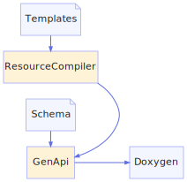

<h1>Scanner</h1>

<a href="https://github.com/CharlesCarley/MdDox#~">~</a>
<a href="index.md#index">MdDox</a>
/
<a href="a00986.md#mddox">MdDox</a>
::
<a href="a00994.md#xml">Xml</a>
::
<b>Scanner</b>
 
 

<h4>Derived From</h4>

<a href="a01231.md#scannerbase">MdDox::ScannerBase</a>

 

<h2>Private Members</h2>
<a href="#_code" class="icon-list-item">_code
</a>

 
<a href="#_defaultstate" class="icon-list-item">_defaultState
</a>

 

<h2>Private Methods</h2>
<a href="#scanstring" class="icon-list-item">scanString
</a>

 
<a href="#scansymbol" class="icon-list-item">scanSymbol
</a>

 

<h2>Public Methods</h2>
<a href="#scanner" class="icon-list-item">Scanner
</a>

 
<a href="#getcode" class="icon-list-item">getCode
</a>

 
<a href="#scan" class="icon-list-item">scan
</a>

 

<h4>Defined in</h4>
<a href="https://github.com/CharlesCarley/MdDox/blob/master/Source/Xml/Scanner.h#L31" class="icon-list-item">Scanner.h
</a>

 
 
<a href="#scanner" class="icon-list-item">top
</a>

<h2>_code</h2>
<a href="a00994.md#codecache">CodeCache</a>
<b>_code</b>
 

<h4>Defined in</h4>
<a href="https://github.com/CharlesCarley/MdDox/blob/master/Source/Xml/Scanner.h#L33" class="icon-list-item">Scanner.h
</a>

 
 
<a href="#scanner" class="icon-list-item">top
</a>

 

<h2>_defaultState</h2>
bool
<b>_defaultState</b>
 

<h4>Defined in</h4>
<a href="https://github.com/CharlesCarley/MdDox/blob/master/Source/Xml/Scanner.h#L35" class="icon-list-item">Scanner.h
</a>

 
 
<a href="#scanner" class="icon-list-item">top
</a>

 

<h2>scanString</h2>
void
<b>scanString</b>
<i>(</i>

<a href="a00994.md#token">Token</a>
 &amp;
tok

<i>)</i>

<h4>Defined in</h4>
<a href="https://github.com/CharlesCarley/MdDox/blob/master/Source/Xml/Scanner.h#L39" class="icon-list-item">Scanner.h
</a>

 
<a href="https://github.com/CharlesCarley/MdDox/blob/master/Source/Xml/Scanner.cpp#L60" class="icon-list-item">Scanner.cpp
</a>

 
 
<a href="#scanner" class="icon-list-item">top
</a>

 

<h2>scanSymbol</h2>
void
<b>scanSymbol</b>
<i>(</i>

<a href="a00994.md#token">Token</a>
 &amp;
tok

<i>)</i>

<h4>Defined in</h4>
<a href="https://github.com/CharlesCarley/MdDox/blob/master/Source/Xml/Scanner.h#L37" class="icon-list-item">Scanner.h
</a>

 
<a href="https://github.com/CharlesCarley/MdDox/blob/master/Source/Xml/Scanner.cpp#L81" class="icon-list-item">Scanner.cpp
</a>

 
 
<a href="#scanner" class="icon-list-item">top
</a>

 

<h2>Scanner</h2>
<b>Scanner</b>
<i>(</i>
<i>)</i>

<h4>Defined in</h4>
<a href="https://github.com/CharlesCarley/MdDox/blob/master/Source/Xml/Scanner.h#L42" class="icon-list-item">Scanner.h
</a>

 
<a href="https://github.com/CharlesCarley/MdDox/blob/master/Source/Xml/Scanner.cpp#L28" class="icon-list-item">Scanner.cpp
</a>

 
 
<a href="#scanner" class="icon-list-item">top
</a>

 

<h2>getCode</h2>
void
<b>getCode</b>
<i>(</i>

<a href="a00986.md#string">String</a>
 &amp;
dest

const size_t &amp;
idx

<i>)</i>

<h4>References</h4>

<a href="a01231.md#syntaxerror">syntaxError</a>

<h4>Defined in</h4>
<a href="https://github.com/CharlesCarley/MdDox/blob/master/Source/Xml/Scanner.h#L46" class="icon-list-item">Scanner.h
</a>

 
<a href="https://github.com/CharlesCarley/MdDox/blob/master/Source/Xml/Scanner.cpp#L52" class="icon-list-item">Scanner.cpp
</a>

 
 
<a href="#scanner" class="icon-list-item">top
</a>

 

<h2>scan</h2>
void
<b>scan</b>
<i>(</i>

<a href="a00994.md#token">Token</a>
 &amp;
tok

<i>)</i>

<h4>Details</h4>
Abstract method, derived scanners should implement their own scan loop. 
 
 
<ul>
<li><b>tok</b>
 - 
A reference to a temporary storage token. 
</li>
</ul>
 

<h4>References</h4>

<a href="a01231.md#_stream">_stream</a>

<a href="a01231.md#syntaxerror">syntaxError</a>

<a href="a01235.md#clear">clear</a>

<a href="a01235.md#setline">setLine</a>

<a href="a01231.md#_line">_line</a>

<a href="a01231.md#scanmultilinecomment">scanMultiLineComment</a>

<a href="a01235.md#settype">setType</a>

<a href="a00994.md#tok_st_tag">TOK_ST_TAG</a>

<a href="a00994.md#tok_equals">TOK_EQUALS</a>

<a href="a00994.md#tok_en_tag">TOK_EN_TAG</a>

<a href="a00994.md#tok_slash">TOK_SLASH</a>

<a href="a00994.md#tok_question">TOK_QUESTION</a>

<a href="a01231.md#scanwhitespace">scanWhiteSpace</a>

<a href="a01171.md#tohexstring">toHexString</a>

<a href="a00986.md#iswhitespace">isWhiteSpace</a>

<a href="a01235.md#setindex">setIndex</a>

<a href="a00994.md#tok_text">TOK_TEXT</a>

<a href="a00994.md#tok_eof">TOK_EOF</a>

<h4>Defined in</h4>
<a href="https://github.com/CharlesCarley/MdDox/blob/master/Source/Xml/Scanner.h#L44" class="icon-list-item">Scanner.h
</a>

 
<a href="https://github.com/CharlesCarley/MdDox/blob/master/Source/Xml/Scanner.cpp#L109" class="icon-list-item">Scanner.cpp
</a>

 
 
<a href="#scanner" class="icon-list-item">top
</a>

 

</body>
</html>
