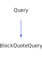

<a id="blockquotequery"></a>
<h1>BlockQuoteQuery</h1>
<a id="a01283"></a>
<a href="https://github.com/CharlesCarley/MdDox#~">~</a>
<a href="index.md#index">MdDox</a>
<span class="inline-text">/</span>
<a href="a00986.md#mddox">MdDox</a>
<span class="inline-text">::</span>
<a href="a00991.md#doxygen">Doxygen</a>
<span class="inline-text">::</span>
<span class="bold-text"><b>BlockQuoteQuery</b></span>
<br/>
<br/>
<span class="inline-text">Implements the </span>
<code class="typewriter">docBlockQuoteType</code>
<span class="inline-text"> scaffolding. </span>
<br/>
<br/>
<span class="inline-text">The following xml provides the source for the </span>
<span class="bold-text"><b>docBlockQuoteType</b></span>
<span class="inline-text"> scaffolding. </span>
<br/>
<br/>

```xml
<xsd:complexType name="docBlockQuoteType">
  <xsd:sequence>
    <xsd:element minOccurs="0" name="para" type="docParaType" maxOccurs="unbounded"/>
  </xsd:sequence>
</xsd:complexType>
```
<br/>
<a id="derived-from"></a>
<h4>Derived From</h4>
<div class="icon-link">
<a href="a01415.md#query">MdDox::Doxygen::Query</a>
</div>
<br/>
<a id="public-methods"></a>
<h2>Public Methods</h2>
<span class="icon-list-item"><a href="#blockquotequery" class="icon-list-item"><span class="icon-list-item">BlockQuoteQuery</span>
</a>
</span>
<br/>
<span class="icon-list-item"><a href="#blockquotequery" class="icon-list-item"><span class="icon-list-item">BlockQuoteQuery</span>
</a>
</span>
<br/>
<span class="icon-list-item"><a href="#blockquotequery" class="icon-list-item"><span class="icon-list-item">BlockQuoteQuery</span>
</a>
</span>
<br/>
<span class="icon-list-item"><a href="#foreachparagraph" class="icon-list-item"><span class="icon-list-item">foreachParagraph</span>
</a>
</span>
<br/>
<span class="icon-list-item"><a href="#visit" class="icon-list-item"><span class="icon-list-item">visit</span>
</a>
</span>
<br/>
<a id="defined-in"></a>
<h4>Defined in</h4>
<span class="icon-list-item"><a href="https://github.com/CharlesCarley/MdDox/blob/master/Tools/Doxygen/BlockQuoteQuery.h#L62" class="icon-list-item"><span class="icon-list-item">BlockQuoteQuery.h</span>
</a>
</span>
<br/>
<br/>
<span class="icon-list-item"><a href="#blockquotequery" class="icon-list-item"><span class="icon-list-item">top</span>
</a>
</span>
<a id="blockquotequery"></a>
<h2>BlockQuoteQuery</h2>
<span class="bold-text"><b>BlockQuoteQuery</b></span>
<span class="italic-text"><i>(</i></span>
<span class="italic-text"><i>)</i></span>
<a id="defined-in"></a>
<h4>Defined in</h4>
<span class="icon-list-item"><a href="https://github.com/CharlesCarley/MdDox/blob/master/Tools/Doxygen/BlockQuoteQuery.h#L64" class="icon-list-item"><span class="icon-list-item">BlockQuoteQuery.h</span>
</a>
</span>
<br/>
<br/>
<span class="icon-list-item"><a href="#blockquotequery" class="icon-list-item"><span class="icon-list-item">top</span>
</a>
</span>
<br/>
<a id="blockquotequery"></a>
<h2>BlockQuoteQuery</h2>
<span class="bold-text"><b>BlockQuoteQuery</b></span>
<span class="italic-text"><i>(</i></span>
<div class="paragraph">
<span class="paragraph"><span class="inline-text">const </span>
<a href="a01283.md#blockquotequery">BlockQuoteQuery</a>
<span class="inline-text"> &amp;</span>
<span class="inline-text">other</span>
</span>
</div>
<span class="italic-text"><i>)</i></span>
<a id="defined-in"></a>
<h4>Defined in</h4>
<span class="icon-list-item"><a href="https://github.com/CharlesCarley/MdDox/blob/master/Tools/Doxygen/BlockQuoteQuery.h#L65" class="icon-list-item"><span class="icon-list-item">BlockQuoteQuery.h</span>
</a>
</span>
<br/>
<br/>
<span class="icon-list-item"><a href="#blockquotequery" class="icon-list-item"><span class="icon-list-item">top</span>
</a>
</span>
<br/>
<a id="blockquotequery"></a>
<h2>BlockQuoteQuery</h2>
<span class="bold-text"><b>BlockQuoteQuery</b></span>
<span class="italic-text"><i>(</i></span>
<div class="paragraph">
<span class="paragraph"><a href="a01259.md#node">Xml::Node</a>
<span class="inline-text"> *</span>
<span class="inline-text">node</span>
</span>
</div>
<span class="italic-text"><i>)</i></span>
<a id="defined-in"></a>
<h4>Defined in</h4>
<span class="icon-list-item"><a href="https://github.com/CharlesCarley/MdDox/blob/master/Tools/Doxygen/BlockQuoteQuery.h#L67" class="icon-list-item"><span class="icon-list-item">BlockQuoteQuery.h</span>
</a>
</span>
<br/>
<br/>
<span class="icon-list-item"><a href="#blockquotequery" class="icon-list-item"><span class="icon-list-item">top</span>
</a>
</span>
<br/>
<a id="foreachparagraph"></a>
<h2>foreachParagraph</h2>
<span class="inline-text">void</span>
<span class="bold-text"><b>foreachParagraph</b></span>
<span class="italic-text"><i>(</i></span>
<div class="paragraph">
<span class="paragraph"><span class="inline-text">const </span>
<a href="a00991.md#paraqueryfunction">ParaQueryFunction</a>
<span class="inline-text"> &amp;</span>
<span class="inline-text">invoke</span>
</span>
</div>
<span class="italic-text"><i>)</i></span>
<a id="details"></a>
<h4>Details</h4>
<span class="inline-text">Invokes the supplied callback on </span>
<span class="bold-text"><b>para</b></span>
<span class="inline-text"> elements. </span>
<br/>
<br/>
<a id="references"></a>
<h4>References</h4>
<div class="paragraph">
<span class="paragraph"><a href="a01415.md#_node">_node</a>
</span>
</div>
<a id="defined-in"></a>
<h4>Defined in</h4>
<span class="icon-list-item"><a href="https://github.com/CharlesCarley/MdDox/blob/master/Tools/Doxygen/BlockQuoteQuery.h#L76" class="icon-list-item"><span class="icon-list-item">BlockQuoteQuery.h</span>
</a>
</span>
<br/>
<span class="icon-list-item"><a href="https://github.com/CharlesCarley/MdDox/blob/master/Tools/Doxygen/BlockQuoteQuery.cpp#L49" class="icon-list-item"><span class="icon-list-item">BlockQuoteQuery.cpp</span>
</a>
</span>
<br/>
<br/>
<span class="icon-list-item"><a href="#blockquotequery" class="icon-list-item"><span class="icon-list-item">top</span>
</a>
</span>
<br/>
<a id="visit"></a>
<h2>visit</h2>
<span class="inline-text">void</span>
<span class="bold-text"><b>visit</b></span>
<span class="italic-text"><i>(</i></span>
<div class="paragraph">
<span class="paragraph"><a href="a01279.md#blockquotequeryvisitor">Visitors::BlockQuoteQueryVisitor</a>
<span class="inline-text"> *</span>
<span class="inline-text"> = </span>
<span class="inline-text">visitor</span>
</span>
</div>
<span class="italic-text"><i>)</i></span>
<a id="references"></a>
<h4>References</h4>
<div class="paragraph">
<span class="paragraph"><a href="a01415.md#_node">_node</a>
</span>
</div>
<div class="paragraph">
<span class="paragraph"><a href="a01259.md#children">children</a>
</span>
</div>
<div class="paragraph">
<span class="paragraph"><a href="a00991.md#doxtextnode">DoxTextNode</a>
</span>
</div>
<div class="paragraph">
<span class="paragraph"><a href="a01279.md#visitedtext">visitedText</a>
</span>
</div>
<div class="paragraph">
<span class="paragraph"><a href="a01279.md#visitedparagraph">visitedParagraph</a>
</span>
</div>
<a id="defined-in"></a>
<h4>Defined in</h4>
<span class="icon-list-item"><a href="https://github.com/CharlesCarley/MdDox/blob/master/Tools/Doxygen/BlockQuoteQuery.h#L72" class="icon-list-item"><span class="icon-list-item">BlockQuoteQuery.h</span>
</a>
</span>
<br/>
<span class="icon-list-item"><a href="https://github.com/CharlesCarley/MdDox/blob/master/Tools/Doxygen/BlockQuoteQuery.cpp#L29" class="icon-list-item"><span class="icon-list-item">BlockQuoteQuery.cpp</span>
</a>
</span>
<br/>
<br/>
<span class="icon-list-item"><a href="#blockquotequery" class="icon-list-item"><span class="icon-list-item">top</span>
</a>
</span>
<br/>
</div>
</div>
</body>
</html>
