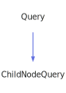

<a id="childnodequery"></a>
<h1>ChildNodeQuery</h1>
<a id="a01295"></a>
<a href="https://github.com/CharlesCarley/MdDox#~">~</a>
<a href="index.md#index">MdDox</a>
<span class="inline-text">/</span>
<a href="a00986.md#mddox">MdDox</a>
<span class="inline-text">::</span>
<a href="a00991.md#doxygen">Doxygen</a>
<span class="inline-text">::</span>
<span class="bold-text"><b>ChildNodeQuery</b></span>
<br/>
<br/>
<span class="inline-text">Implements the </span>
<code class="typewriter">childnodeType</code>
<span class="inline-text"> scaffolding. </span>
<br/>
<br/>
<span class="inline-text">The following xml provides the source for the </span>
<span class="bold-text"><b>childnodeType</b></span>
<span class="inline-text"> scaffolding. </span>
<br/>
<br/>

```xml
<xsd:complexType name="childnodeType">
  <xsd:sequence>
    <xsd:element minOccurs="0" name="edgelabel" maxOccurs="unbounded"/>
  </xsd:sequence>
  <xsd:attribute name="refid" type="xsd:string"/>
  <xsd:attribute name="relation" type="DoxGraphRelation"/>
</xsd:complexType>
```
<br/>
<a id="derived-from"></a>
<h4>Derived From</h4>
<div class="icon-link">
<a href="a01415.md#query">MdDox::Doxygen::Query</a>
</div>
<br/>
<a id="public-methods"></a>
<h2>Public Methods</h2>
<span class="icon-list-item"><a href="#childnodequery" class="icon-list-item"><span class="icon-list-item">ChildNodeQuery</span>
</a>
</span>
<br/>
<span class="icon-list-item"><a href="#childnodequery" class="icon-list-item"><span class="icon-list-item">ChildNodeQuery</span>
</a>
</span>
<br/>
<span class="icon-list-item"><a href="#childnodequery" class="icon-list-item"><span class="icon-list-item">ChildNodeQuery</span>
</a>
</span>
<br/>
<span class="icon-list-item"><a href="#getedgelabel" class="icon-list-item"><span class="icon-list-item">getEdgeLabel</span>
</a>
</span>
<br/>
<span class="icon-list-item"><a href="#getrefid" class="icon-list-item"><span class="icon-list-item">getRefId</span>
</a>
</span>
<br/>
<span class="icon-list-item"><a href="#getrelation" class="icon-list-item"><span class="icon-list-item">getRelation</span>
</a>
</span>
<br/>
<a id="defined-in"></a>
<h4>Defined in</h4>
<span class="icon-list-item"><a href="https://github.com/CharlesCarley/MdDox/blob/master/Tools/Doxygen/ChildNodeQuery.h#L47" class="icon-list-item"><span class="icon-list-item">ChildNodeQuery.h</span>
</a>
</span>
<br/>
<br/>
<span class="icon-list-item"><a href="#childnodequery" class="icon-list-item"><span class="icon-list-item">top</span>
</a>
</span>
<a id="childnodequery"></a>
<h2>ChildNodeQuery</h2>
<span class="bold-text"><b>ChildNodeQuery</b></span>
<span class="italic-text"><i>(</i></span>
<span class="italic-text"><i>)</i></span>
<a id="defined-in"></a>
<h4>Defined in</h4>
<span class="icon-list-item"><a href="https://github.com/CharlesCarley/MdDox/blob/master/Tools/Doxygen/ChildNodeQuery.h#L49" class="icon-list-item"><span class="icon-list-item">ChildNodeQuery.h</span>
</a>
</span>
<br/>
<br/>
<span class="icon-list-item"><a href="#childnodequery" class="icon-list-item"><span class="icon-list-item">top</span>
</a>
</span>
<br/>
<a id="childnodequery"></a>
<h2>ChildNodeQuery</h2>
<span class="bold-text"><b>ChildNodeQuery</b></span>
<span class="italic-text"><i>(</i></span>
<div class="paragraph">
<span class="paragraph"><span class="inline-text">const </span>
<a href="a01295.md#childnodequery">ChildNodeQuery</a>
<span class="inline-text"> &amp;</span>
<span class="inline-text">other</span>
</span>
</div>
<span class="italic-text"><i>)</i></span>
<a id="defined-in"></a>
<h4>Defined in</h4>
<span class="icon-list-item"><a href="https://github.com/CharlesCarley/MdDox/blob/master/Tools/Doxygen/ChildNodeQuery.h#L50" class="icon-list-item"><span class="icon-list-item">ChildNodeQuery.h</span>
</a>
</span>
<br/>
<br/>
<span class="icon-list-item"><a href="#childnodequery" class="icon-list-item"><span class="icon-list-item">top</span>
</a>
</span>
<br/>
<a id="childnodequery"></a>
<h2>ChildNodeQuery</h2>
<span class="bold-text"><b>ChildNodeQuery</b></span>
<span class="italic-text"><i>(</i></span>
<div class="paragraph">
<span class="paragraph"><a href="a01259.md#node">Xml::Node</a>
<span class="inline-text"> *</span>
<span class="inline-text">node</span>
</span>
</div>
<span class="italic-text"><i>)</i></span>
<a id="defined-in"></a>
<h4>Defined in</h4>
<span class="icon-list-item"><a href="https://github.com/CharlesCarley/MdDox/blob/master/Tools/Doxygen/ChildNodeQuery.h#L52" class="icon-list-item"><span class="icon-list-item">ChildNodeQuery.h</span>
</a>
</span>
<br/>
<br/>
<span class="icon-list-item"><a href="#childnodequery" class="icon-list-item"><span class="icon-list-item">top</span>
</a>
</span>
<br/>
<a id="getedgelabel"></a>
<h2>getEdgeLabel</h2>
<span class="inline-text">const </span>
<a href="a00986.md#string">String</a>
<span class="inline-text"> &amp;</span>
<span class="bold-text"><b>getEdgeLabel</b></span>
<span class="italic-text"><i>(</i></span>
<div class="paragraph">
<span class="paragraph"><span class="inline-text">const </span>
<a href="a00986.md#string">String</a>
<span class="inline-text"> &amp;</span>
<span class="inline-text">notFound</span>
<span class="inline-text"> = </span>
<span class="inline-text">&quot;&quot;</span>
</span>
</div>
<span class="italic-text"><i>)</i></span>
<a id="details"></a>
<h4>Details</h4>
<span class="inline-text">Provides access to the </span>
<span class="bold-text"><b>edgelabel</b></span>
<span class="inline-text"> tag&apos;s inner text. </span>
<br/>
<br/>
<a id="returns"></a>
<h4>Returns</h4>
<span class="inline-text">The </span>
<span class="bold-text"><b>edgelabel&apos;s</b></span>
<span class="inline-text"> text or the default value if the node is invalid. </span>
<br/>
<br/>
<a id="references"></a>
<h4>References</h4>
<div class="paragraph">
<span class="paragraph"><a href="a01415.md#_node">_node</a>
</span>
</div>
<div class="paragraph">
<span class="paragraph"><a href="a01415.md#node">node</a>
</span>
</div>
<div class="paragraph">
<span class="paragraph"><a href="a01259.md#firstchildof">firstChildOf</a>
</span>
</div>
<div class="paragraph">
<span class="paragraph"><a href="a01259.md#text">text</a>
</span>
</div>
<a id="defined-in"></a>
<h4>Defined in</h4>
<span class="icon-list-item"><a href="https://github.com/CharlesCarley/MdDox/blob/master/Tools/Doxygen/ChildNodeQuery.h#L76" class="icon-list-item"><span class="icon-list-item">ChildNodeQuery.h</span>
</a>
</span>
<br/>
<span class="icon-list-item"><a href="https://github.com/CharlesCarley/MdDox/blob/master/Tools/Doxygen/ChildNodeQuery.cpp#L42" class="icon-list-item"><span class="icon-list-item">ChildNodeQuery.cpp</span>
</a>
</span>
<br/>
<br/>
<span class="icon-list-item"><a href="#childnodequery" class="icon-list-item"><span class="icon-list-item">top</span>
</a>
</span>
<br/>
<a id="getrefid"></a>
<h2>getRefId</h2>
<span class="inline-text">const </span>
<a href="a00986.md#string">String</a>
<span class="inline-text"> &amp;</span>
<span class="bold-text"><b>getRefId</b></span>
<span class="italic-text"><i>(</i></span>
<div class="paragraph">
<span class="paragraph"><span class="inline-text">const </span>
<a href="a00986.md#string">String</a>
<span class="inline-text"> &amp;</span>
<span class="inline-text">notFound</span>
<span class="inline-text"> = </span>
<span class="inline-text">&quot;&quot;</span>
</span>
</div>
<span class="italic-text"><i>)</i></span>
<a id="details"></a>
<h4>Details</h4>
<span class="inline-text">Provides access to the </span>
<span class="bold-text"><b>refid</b></span>
<span class="inline-text"> attribute. </span>
<br/>
<br/>
<a id="returns"></a>
<h4>Returns</h4>
<span class="inline-text">The </span>
<span class="bold-text"><b>refid</b></span>
<span class="inline-text"> enumerated value or an empty string the value is not found. </span>
<br/>
<br/>
<a id="references"></a>
<h4>References</h4>
<div class="paragraph">
<span class="paragraph"><a href="a01415.md#_node">_node</a>
</span>
</div>
<div class="paragraph">
<span class="paragraph"><a href="a01259.md#attribute">attribute</a>
</span>
</div>
<a id="defined-in"></a>
<h4>Defined in</h4>
<span class="icon-list-item"><a href="https://github.com/CharlesCarley/MdDox/blob/master/Tools/Doxygen/ChildNodeQuery.h#L69" class="icon-list-item"><span class="icon-list-item">ChildNodeQuery.h</span>
</a>
</span>
<br/>
<span class="icon-list-item"><a href="https://github.com/CharlesCarley/MdDox/blob/master/Tools/Doxygen/ChildNodeQuery.cpp#L28" class="icon-list-item"><span class="icon-list-item">ChildNodeQuery.cpp</span>
</a>
</span>
<br/>
<br/>
<span class="icon-list-item"><a href="#childnodequery" class="icon-list-item"><span class="icon-list-item">top</span>
</a>
</span>
<br/>
<a id="getrelation"></a>
<h2>getRelation</h2>
<a href="a00991.md#doxgraphrelationenum">DoxGraphRelationEnum</a>
<span class="bold-text"><b>getRelation</b></span>
<span class="italic-text"><i>(</i></span>
<span class="italic-text"><i>)</i></span>
<a id="details"></a>
<h4>Details</h4>
<span class="inline-text">Provides access to the </span>
<span class="bold-text"><b>relation</b></span>
<span class="inline-text"> element. </span>
<br/>
<br/>
<a id="returns"></a>
<h4>Returns</h4>
<span class="inline-text">The </span>
<span class="bold-text"><b>relation</b></span>
<span class="inline-text"> enumerated value or -1 if the value is not found. </span>
<br/>
<br/>
<a id="references"></a>
<h4>References</h4>
<div class="paragraph">
<span class="paragraph"><a href="a01415.md#_node">_node</a>
</span>
</div>
<div class="paragraph">
<span class="paragraph"><a href="a01359.md#get">get</a>
</span>
</div>
<div class="paragraph">
<span class="paragraph"><a href="a01259.md#attribute">attribute</a>
</span>
</div>
<a id="defined-in"></a>
<h4>Defined in</h4>
<span class="icon-list-item"><a href="https://github.com/CharlesCarley/MdDox/blob/master/Tools/Doxygen/ChildNodeQuery.h#L61" class="icon-list-item"><span class="icon-list-item">ChildNodeQuery.h</span>
</a>
</span>
<br/>
<span class="icon-list-item"><a href="https://github.com/CharlesCarley/MdDox/blob/master/Tools/Doxygen/ChildNodeQuery.cpp#L35" class="icon-list-item"><span class="icon-list-item">ChildNodeQuery.cpp</span>
</a>
</span>
<br/>
<br/>
<span class="icon-list-item"><a href="#childnodequery" class="icon-list-item"><span class="icon-list-item">top</span>
</a>
</span>
<br/>
</div>
</div>
</body>
</html>
