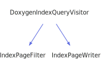

<h1>DoxygenIndexQueryVisitor</h1>

<a href="https://github.com/CharlesCarley/MdDox#~">~</a>
<a href="index.md#index">MdDox</a>
/
<a href="a00986.md#mddox">MdDox</a>
::
<a href="a00991.md#doxygen">Doxygen</a>
::
<a href="a00995.md#visitors">Visitors</a>
::
<b>DoxygenIndexQueryVisitor</b>
 
 

<h4>Derived By</h4>

<a href="a01063.md#indexpagefilter">MdDox::IndexPageFilter</a>

<a href="a01067.md#indexpagewriter">MdDox::IndexPageWriter</a>

 

<h2>Public Methods</h2>
<a href="#~doxygenindexqueryvisitor" class="icon-list-item">~DoxygenIndexQueryVisitor
</a>

 
<a href="#visitedcompound" class="icon-list-item">visitedCompound
</a>

 
<a href="#visitedtext" class="icon-list-item">visitedText
</a>

 

<h4>Defined in</h4>
<a href="https://github.com/CharlesCarley/MdDox/blob/master/Tools/Doxygen/DoxygenIndexQuery.h#L31" class="icon-list-item">DoxygenIndexQuery.h
</a>

 
<a href="#doxygenindexqueryvisitor" class="icon-list-item">top
</a>

<h2>~DoxygenIndexQueryVisitor</h2>
<b>~DoxygenIndexQueryVisitor</b>
<i>(</i>
<i>)</i>

<h4>Defined in</h4>
<a href="https://github.com/CharlesCarley/MdDox/blob/master/Tools/Doxygen/DoxygenIndexQuery.h#L33" class="icon-list-item">DoxygenIndexQuery.h
</a>

 
<a href="#doxygenindexqueryvisitor" class="icon-list-item">top
</a>

 

<h2>visitedCompound</h2>
void
<b>visitedCompound</b>
<i>(</i>

const 
<a href="a01319.md#compoundindexquery">CompoundIndexQuery</a>
 &amp;
query

<i>)</i>
 
 
Called when the element 
<b>compound</b>
 is found. 
 
 
<ul>
<li><i>query</i>
: 
Const reference to the 
<a href="a01319.md#compoundindexquery">CompoundIndexQuery</a>
 class. 
</li>
</ul>

<h4>Defined in</h4>
<a href="https://github.com/CharlesCarley/MdDox/blob/master/Tools/Doxygen/DoxygenIndexQuery.h#L43" class="icon-list-item">DoxygenIndexQuery.h
</a>

 
<a href="#doxygenindexqueryvisitor" class="icon-list-item">top
</a>

 

<h2>visitedText</h2>
void
<b>visitedText</b>
<i>(</i>

const 
<a href="a00986.md#string">String</a>
 &amp;

<i>)</i>
 
 
Callback for every _text_node. 
 

<h4>Defined in</h4>
<a href="https://github.com/CharlesCarley/MdDox/blob/master/Tools/Doxygen/DoxygenIndexQuery.h#L38" class="icon-list-item">DoxygenIndexQuery.h
</a>

 
<a href="#doxygenindexqueryvisitor" class="icon-list-item">top
</a>

 

</body>
</html>
