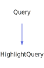

<a id="highlightquery"></a>
<h1>HighlightQuery</h1>
<a id="a01487"></a>
<a href="https://github.com/CharlesCarley/MdDox#~">~</a>
<a href="index.md#index">MdDox</a>
<span class="inline-text">/</span>
<a href="a00986.md#mddox">MdDox</a>
<span class="inline-text">::</span>
<a href="a00991.md#doxygen">Doxygen</a>
<span class="inline-text">::</span>
<span class="bold-text"><b>HighlightQuery</b></span>
<br/>
<br/>
<span class="inline-text">Implements the </span>
<code class="typewriter">highlightType</code>
<span class="inline-text"> scaffolding. </span>
<br/>
<br/>
<span class="inline-text">The following xml provides the source for the </span>
<span class="bold-text"><b>highlightType</b></span>
<span class="inline-text"> scaffolding. </span>
<br/>
<br/>

```xml
<xsd:complexType name="highlightType" mixed="true">
  <xsd:choice minOccurs="0" maxOccurs="unbounded">
    <xsd:element name="sp" type="spType"/>
    <xsd:element name="ref" type="refTextType"/>
  </xsd:choice>
  <xsd:attribute name="class" type="DoxHighlightClass"/>
</xsd:complexType>
```
<br/>
<a id="derived-from"></a>
<h4>Derived From</h4>
<div class="icon-link">
<a href="a01415.md#query">MdDox::Doxygen::Query</a>
</div>
<br/>
<a id="public-methods"></a>
<h2>Public Methods</h2>
<span class="icon-list-item"><a href="#highlightquery" class="icon-list-item"><span class="icon-list-item">HighlightQuery</span>
</a>
</span>
<br/>
<span class="icon-list-item"><a href="#highlightquery" class="icon-list-item"><span class="icon-list-item">HighlightQuery</span>
</a>
</span>
<br/>
<span class="icon-list-item"><a href="#highlightquery" class="icon-list-item"><span class="icon-list-item">HighlightQuery</span>
</a>
</span>
<br/>
<span class="icon-list-item"><a href="#getclass" class="icon-list-item"><span class="icon-list-item">getClass</span>
</a>
</span>
<br/>
<span class="icon-list-item"><a href="#getref" class="icon-list-item"><span class="icon-list-item">getRef</span>
</a>
</span>
<br/>
<span class="icon-list-item"><a href="#getref" class="icon-list-item"><span class="icon-list-item">getRef</span>
</a>
</span>
<br/>
<span class="icon-list-item"><a href="#getsp" class="icon-list-item"><span class="icon-list-item">getSp</span>
</a>
</span>
<br/>
<span class="icon-list-item"><a href="#getsp" class="icon-list-item"><span class="icon-list-item">getSp</span>
</a>
</span>
<br/>
<span class="icon-list-item"><a href="#visit" class="icon-list-item"><span class="icon-list-item">visit</span>
</a>
</span>
<br/>
<a id="defined-in"></a>
<h4>Defined in</h4>
<span class="icon-list-item"><a href="https://github.com/CharlesCarley/MdDox/blob/master/Tools/Doxygen/HighlightQuery.h#L70" class="icon-list-item"><span class="icon-list-item">HighlightQuery.h</span>
</a>
</span>
<br/>
<br/>
<span class="icon-list-item"><a href="#highlightquery" class="icon-list-item"><span class="icon-list-item">top</span>
</a>
</span>
<a id="highlightquery"></a>
<h2>HighlightQuery</h2>
<span class="bold-text"><b>HighlightQuery</b></span>
<span class="italic-text"><i>(</i></span>
<span class="italic-text"><i>)</i></span>
<a id="defined-in"></a>
<h4>Defined in</h4>
<span class="icon-list-item"><a href="https://github.com/CharlesCarley/MdDox/blob/master/Tools/Doxygen/HighlightQuery.h#L72" class="icon-list-item"><span class="icon-list-item">HighlightQuery.h</span>
</a>
</span>
<br/>
<br/>
<span class="icon-list-item"><a href="#highlightquery" class="icon-list-item"><span class="icon-list-item">top</span>
</a>
</span>
<br/>
<a id="highlightquery"></a>
<h2>HighlightQuery</h2>
<span class="bold-text"><b>HighlightQuery</b></span>
<span class="italic-text"><i>(</i></span>
<div class="paragraph">
<span class="paragraph"><span class="inline-text">const </span>
<a href="a01487.md#highlightquery">HighlightQuery</a>
<span class="inline-text"> &amp;</span>
<span class="inline-text">other</span>
</span>
</div>
<span class="italic-text"><i>)</i></span>
<a id="defined-in"></a>
<h4>Defined in</h4>
<span class="icon-list-item"><a href="https://github.com/CharlesCarley/MdDox/blob/master/Tools/Doxygen/HighlightQuery.h#L73" class="icon-list-item"><span class="icon-list-item">HighlightQuery.h</span>
</a>
</span>
<br/>
<br/>
<span class="icon-list-item"><a href="#highlightquery" class="icon-list-item"><span class="icon-list-item">top</span>
</a>
</span>
<br/>
<a id="highlightquery"></a>
<h2>HighlightQuery</h2>
<span class="bold-text"><b>HighlightQuery</b></span>
<span class="italic-text"><i>(</i></span>
<div class="paragraph">
<span class="paragraph"><a href="a01259.md#node">Xml::Node</a>
<span class="inline-text"> *</span>
<span class="inline-text">node</span>
</span>
</div>
<span class="italic-text"><i>)</i></span>
<a id="defined-in"></a>
<h4>Defined in</h4>
<span class="icon-list-item"><a href="https://github.com/CharlesCarley/MdDox/blob/master/Tools/Doxygen/HighlightQuery.h#L75" class="icon-list-item"><span class="icon-list-item">HighlightQuery.h</span>
</a>
</span>
<br/>
<br/>
<span class="icon-list-item"><a href="#highlightquery" class="icon-list-item"><span class="icon-list-item">top</span>
</a>
</span>
<br/>
<a id="getclass"></a>
<h2>getClass</h2>
<a href="a00991.md#doxhighlightclassenum">DoxHighlightClassEnum</a>
<span class="bold-text"><b>getClass</b></span>
<span class="italic-text"><i>(</i></span>
<span class="italic-text"><i>)</i></span>
<a id="details"></a>
<h4>Details</h4>
<span class="inline-text">Provides access to the </span>
<span class="bold-text"><b>class</b></span>
<span class="inline-text"> element. </span>
<br/>
<br/>
<a id="returns"></a>
<h4>Returns</h4>
<span class="inline-text">The </span>
<span class="bold-text"><b>class</b></span>
<span class="inline-text"> enumerated value or -1 if the value is not found. </span>
<br/>
<br/>
<a id="references"></a>
<h4>References</h4>
<div class="paragraph">
<span class="paragraph"><a href="a01415.md#_node">_node</a>
</span>
</div>
<div class="paragraph">
<span class="paragraph"><a href="a01363.md#get">get</a>
</span>
</div>
<div class="paragraph">
<span class="paragraph"><a href="a01259.md#attribute">attribute</a>
</span>
</div>
<a id="defined-in"></a>
<h4>Defined in</h4>
<span class="icon-list-item"><a href="https://github.com/CharlesCarley/MdDox/blob/master/Tools/Doxygen/HighlightQuery.h#L86" class="icon-list-item"><span class="icon-list-item">HighlightQuery.h</span>
</a>
</span>
<br/>
<span class="icon-list-item"><a href="https://github.com/CharlesCarley/MdDox/blob/master/Tools/Doxygen/HighlightQuery.cpp#L53" class="icon-list-item"><span class="icon-list-item">HighlightQuery.cpp</span>
</a>
</span>
<br/>
<br/>
<span class="icon-list-item"><a href="#highlightquery" class="icon-list-item"><span class="icon-list-item">top</span>
</a>
</span>
<br/>
<a id="getref"></a>
<h2>getRef</h2>
<span class="inline-text">void</span>
<span class="bold-text"><b>getRef</b></span>
<span class="italic-text"><i>(</i></span>
<div class="paragraph">
<span class="paragraph"><a href="a01707.md#reftextquery">RefTextQuery</a>
<span class="inline-text"> &amp;</span>
<span class="inline-text">dest</span>
</span>
</div>
<span class="italic-text"><i>)</i></span>
<a id="details"></a>
<h4>Details</h4>
<span class="inline-text">Provides access to the </span>
<span class="bold-text"><b>ref</b></span>
<span class="inline-text"> attribute. </span>
<br/>
<br/>
<a id="references"></a>
<h4>References</h4>
<div class="paragraph">
<span class="paragraph"><a href="a01415.md#_node">_node</a>
</span>
</div>
<div class="paragraph">
<span class="paragraph"><a href="a01415.md#node">node</a>
</span>
</div>
<div class="paragraph">
<span class="paragraph"><a href="a01259.md#firstchildof">firstChildOf</a>
</span>
</div>
<div class="paragraph">
<span class="paragraph"><a href="a01415.md#reset">reset</a>
</span>
</div>
<a id="defined-in"></a>
<h4>Defined in</h4>
<span class="icon-list-item"><a href="https://github.com/CharlesCarley/MdDox/blob/master/Tools/Doxygen/HighlightQuery.h#L101" class="icon-list-item"><span class="icon-list-item">HighlightQuery.h</span>
</a>
</span>
<br/>
<span class="icon-list-item"><a href="https://github.com/CharlesCarley/MdDox/blob/master/Tools/Doxygen/HighlightQuery.cpp#L78" class="icon-list-item"><span class="icon-list-item">HighlightQuery.cpp</span>
</a>
</span>
<br/>
<br/>
<span class="icon-list-item"><a href="#highlightquery" class="icon-list-item"><span class="icon-list-item">top</span>
</a>
</span>
<br/>
<a id="getref"></a>
<h2>getRef</h2>
<a href="a01707.md#reftextquery">RefTextQuery</a>
<span class="bold-text"><b>getRef</b></span>
<span class="italic-text"><i>(</i></span>
<span class="italic-text"><i>)</i></span>
<a id="details"></a>
<h4>Details</h4>
<span class="inline-text">Provides access to the </span>
<span class="bold-text"><b>ref</b></span>
<span class="inline-text"> attribute. </span>
<br/>
<br/>
<a id="defined-in"></a>
<h4>Defined in</h4>
<span class="icon-list-item"><a href="https://github.com/CharlesCarley/MdDox/blob/master/Tools/Doxygen/HighlightQuery.h#L106" class="icon-list-item"><span class="icon-list-item">HighlightQuery.h</span>
</a>
</span>
<br/>
<span class="icon-list-item"><a href="https://github.com/CharlesCarley/MdDox/blob/master/Tools/Doxygen/HighlightQuery.cpp#L89" class="icon-list-item"><span class="icon-list-item">HighlightQuery.cpp</span>
</a>
</span>
<br/>
<br/>
<span class="icon-list-item"><a href="#highlightquery" class="icon-list-item"><span class="icon-list-item">top</span>
</a>
</span>
<br/>
<a id="getsp"></a>
<h2>getSp</h2>
<span class="inline-text">void</span>
<span class="bold-text"><b>getSp</b></span>
<span class="italic-text"><i>(</i></span>
<div class="paragraph">
<span class="paragraph"><a href="a01771.md#spquery">SpQuery</a>
<span class="inline-text"> &amp;</span>
<span class="inline-text">dest</span>
</span>
</div>
<span class="italic-text"><i>)</i></span>
<a id="details"></a>
<h4>Details</h4>
<span class="inline-text">Provides access to the </span>
<span class="bold-text"><b>sp</b></span>
<span class="inline-text"> attribute. </span>
<br/>
<br/>
<a id="references"></a>
<h4>References</h4>
<div class="paragraph">
<span class="paragraph"><a href="a01415.md#_node">_node</a>
</span>
</div>
<div class="paragraph">
<span class="paragraph"><a href="a01415.md#node">node</a>
</span>
</div>
<div class="paragraph">
<span class="paragraph"><a href="a01259.md#firstchildof">firstChildOf</a>
</span>
</div>
<div class="paragraph">
<span class="paragraph"><a href="a01415.md#reset">reset</a>
</span>
</div>
<a id="defined-in"></a>
<h4>Defined in</h4>
<span class="icon-list-item"><a href="https://github.com/CharlesCarley/MdDox/blob/master/Tools/Doxygen/HighlightQuery.h#L91" class="icon-list-item"><span class="icon-list-item">HighlightQuery.h</span>
</a>
</span>
<br/>
<span class="icon-list-item"><a href="https://github.com/CharlesCarley/MdDox/blob/master/Tools/Doxygen/HighlightQuery.cpp#L60" class="icon-list-item"><span class="icon-list-item">HighlightQuery.cpp</span>
</a>
</span>
<br/>
<br/>
<span class="icon-list-item"><a href="#highlightquery" class="icon-list-item"><span class="icon-list-item">top</span>
</a>
</span>
<br/>
<a id="getsp"></a>
<h2>getSp</h2>
<a href="a01771.md#spquery">SpQuery</a>
<span class="bold-text"><b>getSp</b></span>
<span class="italic-text"><i>(</i></span>
<span class="italic-text"><i>)</i></span>
<a id="details"></a>
<h4>Details</h4>
<span class="inline-text">Provides access to the </span>
<span class="bold-text"><b>sp</b></span>
<span class="inline-text"> attribute. </span>
<br/>
<br/>
<a id="defined-in"></a>
<h4>Defined in</h4>
<span class="icon-list-item"><a href="https://github.com/CharlesCarley/MdDox/blob/master/Tools/Doxygen/HighlightQuery.h#L96" class="icon-list-item"><span class="icon-list-item">HighlightQuery.h</span>
</a>
</span>
<br/>
<span class="icon-list-item"><a href="https://github.com/CharlesCarley/MdDox/blob/master/Tools/Doxygen/HighlightQuery.cpp#L71" class="icon-list-item"><span class="icon-list-item">HighlightQuery.cpp</span>
</a>
</span>
<br/>
<br/>
<span class="icon-list-item"><a href="#highlightquery" class="icon-list-item"><span class="icon-list-item">top</span>
</a>
</span>
<br/>
<a id="visit"></a>
<h2>visit</h2>
<span class="inline-text">void</span>
<span class="bold-text"><b>visit</b></span>
<span class="italic-text"><i>(</i></span>
<div class="paragraph">
<span class="paragraph"><a href="a01483.md#highlightqueryvisitor">Visitors::HighlightQueryVisitor</a>
<span class="inline-text"> *</span>
<span class="inline-text"> = </span>
<span class="inline-text">visitor</span>
</span>
</div>
<span class="italic-text"><i>)</i></span>
<a id="references"></a>
<h4>References</h4>
<div class="paragraph">
<span class="paragraph"><a href="a01415.md#_node">_node</a>
</span>
</div>
<div class="paragraph">
<span class="paragraph"><a href="a01259.md#children">children</a>
</span>
</div>
<div class="paragraph">
<span class="paragraph"><a href="a00991.md#doxtextnode">DoxTextNode</a>
</span>
</div>
<div class="paragraph">
<span class="paragraph"><a href="a01483.md#visitedtext">visitedText</a>
</span>
</div>
<div class="paragraph">
<span class="paragraph"><a href="a01483.md#visitedsp">visitedSp</a>
</span>
</div>
<div class="paragraph">
<span class="paragraph"><a href="a01483.md#visitedref">visitedRef</a>
</span>
</div>
<a id="defined-in"></a>
<h4>Defined in</h4>
<span class="icon-list-item"><a href="https://github.com/CharlesCarley/MdDox/blob/master/Tools/Doxygen/HighlightQuery.h#L80" class="icon-list-item"><span class="icon-list-item">HighlightQuery.h</span>
</a>
</span>
<br/>
<span class="icon-list-item"><a href="https://github.com/CharlesCarley/MdDox/blob/master/Tools/Doxygen/HighlightQuery.cpp#L30" class="icon-list-item"><span class="icon-list-item">HighlightQuery.cpp</span>
</a>
</span>
<br/>
<br/>
<span class="icon-list-item"><a href="#highlightquery" class="icon-list-item"><span class="icon-list-item">top</span>
</a>
</span>
<br/>
</div>
</div>
</body>
</html>
