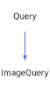

<a id="imagequery"></a>
<h1>ImageQuery</h1>
<a id="a01495"></a>
<a href="https://github.com/CharlesCarley/MdDox#~">~</a>
<a href="index.md#index">MdDox</a>
<span class="inline-text">/</span>
<a href="a00986.md#mddox">MdDox</a>
<span class="inline-text">::</span>
<a href="a00991.md#doxygen">Doxygen</a>
<span class="inline-text">::</span>
<span class="bold-text"><b>ImageQuery</b></span>
<br/>
<br/>
<span class="inline-text">Implements the </span>
<code class="typewriter">docImageType</code>
<span class="inline-text"> scaffolding. </span>
<br/>
<br/>
<span class="inline-text">The following xml provides the source for the </span>
<span class="bold-text"><b>docImageType</b></span>
<span class="inline-text"> scaffolding. </span>
<br/>
<br/>

```xml
<xsd:complexType name="docImageType" mixed="true">
  <xsd:group ref="docTitleCmdGroup" minOccurs="0" maxOccurs="unbounded"/>
  <xsd:attribute name="type" type="DoxImageKind"/>
  <xsd:attribute name="name" type="xsd:string"/>
  <xsd:attribute name="width" type="xsd:string"/>
  <xsd:attribute name="height" type="xsd:string"/>
</xsd:complexType>
```
<br/>
<a id="derived-from"></a>
<h4>Derived From</h4>
<div class="icon-link">
<a href="a01415.md#query">MdDox::Doxygen::Query</a>
</div>
<br/>
<a id="public-methods"></a>
<h2>Public Methods</h2>
<span class="icon-list-item"><a href="#imagequery" class="icon-list-item"><span class="icon-list-item">ImageQuery</span>
</a>
</span>
<br/>
<span class="icon-list-item"><a href="#imagequery" class="icon-list-item"><span class="icon-list-item">ImageQuery</span>
</a>
</span>
<br/>
<span class="icon-list-item"><a href="#imagequery" class="icon-list-item"><span class="icon-list-item">ImageQuery</span>
</a>
</span>
<br/>
<span class="icon-list-item"><a href="#getanchor" class="icon-list-item"><span class="icon-list-item">getAnchor</span>
</a>
</span>
<br/>
<span class="icon-list-item"><a href="#getanchor" class="icon-list-item"><span class="icon-list-item">getAnchor</span>
</a>
</span>
<br/>
<span class="icon-list-item"><a href="#getbold" class="icon-list-item"><span class="icon-list-item">getBold</span>
</a>
</span>
<br/>
<span class="icon-list-item"><a href="#getbold" class="icon-list-item"><span class="icon-list-item">getBold</span>
</a>
</span>
<br/>
<span class="icon-list-item"><a href="#getcenter" class="icon-list-item"><span class="icon-list-item">getCenter</span>
</a>
</span>
<br/>
<span class="icon-list-item"><a href="#getcenter" class="icon-list-item"><span class="icon-list-item">getCenter</span>
</a>
</span>
<br/>
<span class="icon-list-item"><a href="#getcomputeroutput" class="icon-list-item"><span class="icon-list-item">getComputerOutput</span>
</a>
</span>
<br/>
<span class="icon-list-item"><a href="#getcomputeroutput" class="icon-list-item"><span class="icon-list-item">getComputerOutput</span>
</a>
</span>
<br/>
<span class="icon-list-item"><a href="#getdot" class="icon-list-item"><span class="icon-list-item">getDot</span>
</a>
</span>
<br/>
<span class="icon-list-item"><a href="#getemphasis" class="icon-list-item"><span class="icon-list-item">getEmphasis</span>
</a>
</span>
<br/>
<span class="icon-list-item"><a href="#getemphasis" class="icon-list-item"><span class="icon-list-item">getEmphasis</span>
</a>
</span>
<br/>
<span class="icon-list-item"><a href="#getheight" class="icon-list-item"><span class="icon-list-item">getHeight</span>
</a>
</span>
<br/>
<span class="icon-list-item"><a href="#getlang" class="icon-list-item"><span class="icon-list-item">getLang</span>
</a>
</span>
<br/>
<span class="icon-list-item"><a href="#getlang" class="icon-list-item"><span class="icon-list-item">getLang</span>
</a>
</span>
<br/>
<span class="icon-list-item"><a href="#getname" class="icon-list-item"><span class="icon-list-item">getName</span>
</a>
</span>
<br/>
<span class="icon-list-item"><a href="#getparagraph" class="icon-list-item"><span class="icon-list-item">getParagraph</span>
</a>
</span>
<br/>
<span class="icon-list-item"><a href="#getparagraph" class="icon-list-item"><span class="icon-list-item">getParagraph</span>
</a>
</span>
<br/>
<span class="icon-list-item"><a href="#getpart" class="icon-list-item"><span class="icon-list-item">getPart</span>
</a>
</span>
<br/>
<span class="icon-list-item"><a href="#getpart" class="icon-list-item"><span class="icon-list-item">getPart</span>
</a>
</span>
<br/>
<span class="icon-list-item"><a href="#getprop" class="icon-list-item"><span class="icon-list-item">getProp</span>
</a>
</span>
<br/>
<span class="icon-list-item"><a href="#getprop" class="icon-list-item"><span class="icon-list-item">getProp</span>
</a>
</span>
<br/>
<span class="icon-list-item"><a href="#getref" class="icon-list-item"><span class="icon-list-item">getRef</span>
</a>
</span>
<br/>
<span class="icon-list-item"><a href="#getref" class="icon-list-item"><span class="icon-list-item">getRef</span>
</a>
</span>
<br/>
<span class="icon-list-item"><a href="#getregistered" class="icon-list-item"><span class="icon-list-item">getRegistered</span>
</a>
</span>
<br/>
<span class="icon-list-item"><a href="#getregistered" class="icon-list-item"><span class="icon-list-item">getRegistered</span>
</a>
</span>
<br/>
<span class="icon-list-item"><a href="#getsect" class="icon-list-item"><span class="icon-list-item">getSect</span>
</a>
</span>
<br/>
<span class="icon-list-item"><a href="#getsect" class="icon-list-item"><span class="icon-list-item">getSect</span>
</a>
</span>
<br/>
<span class="icon-list-item"><a href="#getsmall" class="icon-list-item"><span class="icon-list-item">getSmall</span>
</a>
</span>
<br/>
<span class="icon-list-item"><a href="#getsmall" class="icon-list-item"><span class="icon-list-item">getSmall</span>
</a>
</span>
<br/>
<span class="icon-list-item"><a href="#gettype" class="icon-list-item"><span class="icon-list-item">getType</span>
</a>
</span>
<br/>
<span class="icon-list-item"><a href="#getulink" class="icon-list-item"><span class="icon-list-item">getULink</span>
</a>
</span>
<br/>
<span class="icon-list-item"><a href="#getulink" class="icon-list-item"><span class="icon-list-item">getULink</span>
</a>
</span>
<br/>
<span class="icon-list-item"><a href="#getwidth" class="icon-list-item"><span class="icon-list-item">getWidth</span>
</a>
</span>
<br/>
<span class="icon-list-item"><a href="#visit" class="icon-list-item"><span class="icon-list-item">visit</span>
</a>
</span>
<br/>
<a id="defined-in"></a>
<h4>Defined in</h4>
<span class="icon-list-item"><a href="https://github.com/CharlesCarley/MdDox/blob/master/Tools/Doxygen/ImageQuery.h#L135" class="icon-list-item"><span class="icon-list-item">ImageQuery.h</span>
</a>
</span>
<br/>
<span class="icon-list-item"><a href="#imagequery" class="icon-list-item"><span class="icon-list-item">top</span>
</a>
</span>
<a id="imagequery"></a>
<h2>ImageQuery</h2>
<span class="bold-text"><b>ImageQuery</b></span>
<span class="italic-text"><i>(</i></span>
<span class="italic-text"><i>)</i></span>
<a id="defined-in"></a>
<h4>Defined in</h4>
<span class="icon-list-item"><a href="https://github.com/CharlesCarley/MdDox/blob/master/Tools/Doxygen/ImageQuery.h#L137" class="icon-list-item"><span class="icon-list-item">ImageQuery.h</span>
</a>
</span>
<br/>
<span class="icon-list-item"><a href="#imagequery" class="icon-list-item"><span class="icon-list-item">top</span>
</a>
</span>
<br/>
<a id="imagequery"></a>
<h2>ImageQuery</h2>
<span class="bold-text"><b>ImageQuery</b></span>
<span class="italic-text"><i>(</i></span>
<div class="paragraph">
<span class="paragraph"><span class="inline-text">const </span>
<a href="a01495.md#imagequery">ImageQuery</a>
<span class="inline-text"> &amp;</span>
<span class="inline-text">other</span>
</span>
</div>
<span class="italic-text"><i>)</i></span>
<a id="defined-in"></a>
<h4>Defined in</h4>
<span class="icon-list-item"><a href="https://github.com/CharlesCarley/MdDox/blob/master/Tools/Doxygen/ImageQuery.h#L138" class="icon-list-item"><span class="icon-list-item">ImageQuery.h</span>
</a>
</span>
<br/>
<span class="icon-list-item"><a href="#imagequery" class="icon-list-item"><span class="icon-list-item">top</span>
</a>
</span>
<br/>
<a id="imagequery"></a>
<h2>ImageQuery</h2>
<span class="bold-text"><b>ImageQuery</b></span>
<span class="italic-text"><i>(</i></span>
<div class="paragraph">
<span class="paragraph"><a href="a01259.md#node">Xml::Node</a>
<span class="inline-text"> *</span>
<span class="inline-text">node</span>
</span>
</div>
<span class="italic-text"><i>)</i></span>
<a id="defined-in"></a>
<h4>Defined in</h4>
<span class="icon-list-item"><a href="https://github.com/CharlesCarley/MdDox/blob/master/Tools/Doxygen/ImageQuery.h#L140" class="icon-list-item"><span class="icon-list-item">ImageQuery.h</span>
</a>
</span>
<br/>
<span class="icon-list-item"><a href="#imagequery" class="icon-list-item"><span class="icon-list-item">top</span>
</a>
</span>
<br/>
<a id="getanchor"></a>
<h2>getAnchor</h2>
<span class="inline-text">void</span>
<span class="bold-text"><b>getAnchor</b></span>
<span class="italic-text"><i>(</i></span>
<div class="paragraph">
<span class="paragraph"><a href="a01275.md#anchorquery">AnchorQuery</a>
<span class="inline-text"> &amp;</span>
<span class="inline-text">dest</span>
</span>
</div>
<span class="italic-text"><i>)</i></span>
<br/>
<br/>
<span class="inline-text">Provides access to the </span>
<span class="bold-text"><b>anchor</b></span>
<span class="inline-text"> attribute. </span>
<br/>
<a id="references"></a>
<h4>References</h4>
<div class="paragraph">
<span class="paragraph"><a href="a01415.md#_node">_node</a>
</span>
</div>
<div class="paragraph">
<span class="paragraph"><a href="a01415.md#node">node</a>
</span>
</div>
<div class="paragraph">
<span class="paragraph"><a href="a01259.md#firstchildof">firstChildOf</a>
</span>
</div>
<div class="paragraph">
<span class="paragraph"><a href="a01415.md#reset">reset</a>
</span>
</div>
<a id="defined-in"></a>
<h4>Defined in</h4>
<span class="icon-list-item"><a href="https://github.com/CharlesCarley/MdDox/blob/master/Tools/Doxygen/ImageQuery.h#L247" class="icon-list-item"><span class="icon-list-item">ImageQuery.h</span>
</a>
</span>
<br/>
<span class="icon-list-item"><a href="https://github.com/CharlesCarley/MdDox/blob/master/Tools/Doxygen/ImageQuery.cpp#L241" class="icon-list-item"><span class="icon-list-item">ImageQuery.cpp</span>
</a>
</span>
<br/>
<span class="icon-list-item"><a href="#imagequery" class="icon-list-item"><span class="icon-list-item">top</span>
</a>
</span>
<br/>
<a id="getanchor"></a>
<h2>getAnchor</h2>
<a href="a01275.md#anchorquery">AnchorQuery</a>
<span class="bold-text"><b>getAnchor</b></span>
<span class="italic-text"><i>(</i></span>
<span class="italic-text"><i>)</i></span>
<br/>
<br/>
<span class="inline-text">Provides access to the </span>
<span class="bold-text"><b>anchor</b></span>
<span class="inline-text"> attribute. </span>
<br/>
<a id="defined-in"></a>
<h4>Defined in</h4>
<span class="icon-list-item"><a href="https://github.com/CharlesCarley/MdDox/blob/master/Tools/Doxygen/ImageQuery.h#L252" class="icon-list-item"><span class="icon-list-item">ImageQuery.h</span>
</a>
</span>
<br/>
<span class="icon-list-item"><a href="https://github.com/CharlesCarley/MdDox/blob/master/Tools/Doxygen/ImageQuery.cpp#L252" class="icon-list-item"><span class="icon-list-item">ImageQuery.cpp</span>
</a>
</span>
<br/>
<span class="icon-list-item"><a href="#imagequery" class="icon-list-item"><span class="icon-list-item">top</span>
</a>
</span>
<br/>
<a id="getbold"></a>
<h2>getBold</h2>
<span class="inline-text">void</span>
<span class="bold-text"><b>getBold</b></span>
<span class="italic-text"><i>(</i></span>
<div class="paragraph">
<span class="paragraph"><a href="a01607.md#markupquery">MarkupQuery</a>
<span class="inline-text"> &amp;</span>
<span class="inline-text">dest</span>
</span>
</div>
<span class="italic-text"><i>)</i></span>
<br/>
<br/>
<span class="inline-text">Provides access to the </span>
<span class="bold-text"><b>bold</b></span>
<span class="inline-text"> attribute. </span>
<br/>
<a id="references"></a>
<h4>References</h4>
<div class="paragraph">
<span class="paragraph"><a href="a01415.md#_node">_node</a>
</span>
</div>
<div class="paragraph">
<span class="paragraph"><a href="a01415.md#node">node</a>
</span>
</div>
<div class="paragraph">
<span class="paragraph"><a href="a01259.md#firstchildof">firstChildOf</a>
</span>
</div>
<div class="paragraph">
<span class="paragraph"><a href="a01415.md#reset">reset</a>
</span>
</div>
<a id="defined-in"></a>
<h4>Defined in</h4>
<span class="icon-list-item"><a href="https://github.com/CharlesCarley/MdDox/blob/master/Tools/Doxygen/ImageQuery.h#L197" class="icon-list-item"><span class="icon-list-item">ImageQuery.h</span>
</a>
</span>
<br/>
<span class="icon-list-item"><a href="https://github.com/CharlesCarley/MdDox/blob/master/Tools/Doxygen/ImageQuery.cpp#L151" class="icon-list-item"><span class="icon-list-item">ImageQuery.cpp</span>
</a>
</span>
<br/>
<span class="icon-list-item"><a href="#imagequery" class="icon-list-item"><span class="icon-list-item">top</span>
</a>
</span>
<br/>
<a id="getbold"></a>
<h2>getBold</h2>
<a href="a01607.md#markupquery">MarkupQuery</a>
<span class="bold-text"><b>getBold</b></span>
<span class="italic-text"><i>(</i></span>
<span class="italic-text"><i>)</i></span>
<br/>
<br/>
<span class="inline-text">Provides access to the </span>
<span class="bold-text"><b>bold</b></span>
<span class="inline-text"> attribute. </span>
<br/>
<a id="defined-in"></a>
<h4>Defined in</h4>
<span class="icon-list-item"><a href="https://github.com/CharlesCarley/MdDox/blob/master/Tools/Doxygen/ImageQuery.h#L202" class="icon-list-item"><span class="icon-list-item">ImageQuery.h</span>
</a>
</span>
<br/>
<span class="icon-list-item"><a href="https://github.com/CharlesCarley/MdDox/blob/master/Tools/Doxygen/ImageQuery.cpp#L162" class="icon-list-item"><span class="icon-list-item">ImageQuery.cpp</span>
</a>
</span>
<br/>
<span class="icon-list-item"><a href="#imagequery" class="icon-list-item"><span class="icon-list-item">top</span>
</a>
</span>
<br/>
<a id="getcenter"></a>
<h2>getCenter</h2>
<span class="inline-text">void</span>
<span class="bold-text"><b>getCenter</b></span>
<span class="italic-text"><i>(</i></span>
<div class="paragraph">
<span class="paragraph"><a href="a01607.md#markupquery">MarkupQuery</a>
<span class="inline-text"> &amp;</span>
<span class="inline-text">dest</span>
</span>
</div>
<span class="italic-text"><i>)</i></span>
<br/>
<br/>
<span class="inline-text">Provides access to the </span>
<span class="bold-text"><b>center</b></span>
<span class="inline-text"> attribute. </span>
<br/>
<a id="references"></a>
<h4>References</h4>
<div class="paragraph">
<span class="paragraph"><a href="a01415.md#_node">_node</a>
</span>
</div>
<div class="paragraph">
<span class="paragraph"><a href="a01415.md#node">node</a>
</span>
</div>
<div class="paragraph">
<span class="paragraph"><a href="a01259.md#firstchildof">firstChildOf</a>
</span>
</div>
<div class="paragraph">
<span class="paragraph"><a href="a01415.md#reset">reset</a>
</span>
</div>
<a id="defined-in"></a>
<h4>Defined in</h4>
<span class="icon-list-item"><a href="https://github.com/CharlesCarley/MdDox/blob/master/Tools/Doxygen/ImageQuery.h#L227" class="icon-list-item"><span class="icon-list-item">ImageQuery.h</span>
</a>
</span>
<br/>
<span class="icon-list-item"><a href="https://github.com/CharlesCarley/MdDox/blob/master/Tools/Doxygen/ImageQuery.cpp#L205" class="icon-list-item"><span class="icon-list-item">ImageQuery.cpp</span>
</a>
</span>
<br/>
<span class="icon-list-item"><a href="#imagequery" class="icon-list-item"><span class="icon-list-item">top</span>
</a>
</span>
<br/>
<a id="getcenter"></a>
<h2>getCenter</h2>
<a href="a01607.md#markupquery">MarkupQuery</a>
<span class="bold-text"><b>getCenter</b></span>
<span class="italic-text"><i>(</i></span>
<span class="italic-text"><i>)</i></span>
<br/>
<br/>
<span class="inline-text">Provides access to the </span>
<span class="bold-text"><b>center</b></span>
<span class="inline-text"> attribute. </span>
<br/>
<a id="defined-in"></a>
<h4>Defined in</h4>
<span class="icon-list-item"><a href="https://github.com/CharlesCarley/MdDox/blob/master/Tools/Doxygen/ImageQuery.h#L232" class="icon-list-item"><span class="icon-list-item">ImageQuery.h</span>
</a>
</span>
<br/>
<span class="icon-list-item"><a href="https://github.com/CharlesCarley/MdDox/blob/master/Tools/Doxygen/ImageQuery.cpp#L216" class="icon-list-item"><span class="icon-list-item">ImageQuery.cpp</span>
</a>
</span>
<br/>
<span class="icon-list-item"><a href="#imagequery" class="icon-list-item"><span class="icon-list-item">top</span>
</a>
</span>
<br/>
<a id="getcomputeroutput"></a>
<h2>getComputerOutput</h2>
<span class="inline-text">void</span>
<span class="bold-text"><b>getComputerOutput</b></span>
<span class="italic-text"><i>(</i></span>
<div class="paragraph">
<span class="paragraph"><a href="a01607.md#markupquery">MarkupQuery</a>
<span class="inline-text"> &amp;</span>
<span class="inline-text">dest</span>
</span>
</div>
<span class="italic-text"><i>)</i></span>
<br/>
<br/>
<span class="inline-text">Provides access to the </span>
<span class="bold-text"><b>computeroutput</b></span>
<span class="inline-text"> attribute. </span>
<br/>
<a id="references"></a>
<h4>References</h4>
<div class="paragraph">
<span class="paragraph"><a href="a01415.md#_node">_node</a>
</span>
</div>
<div class="paragraph">
<span class="paragraph"><a href="a01415.md#node">node</a>
</span>
</div>
<div class="paragraph">
<span class="paragraph"><a href="a01259.md#firstchildof">firstChildOf</a>
</span>
</div>
<div class="paragraph">
<span class="paragraph"><a href="a01415.md#reset">reset</a>
</span>
</div>
<a id="defined-in"></a>
<h4>Defined in</h4>
<span class="icon-list-item"><a href="https://github.com/CharlesCarley/MdDox/blob/master/Tools/Doxygen/ImageQuery.h#L217" class="icon-list-item"><span class="icon-list-item">ImageQuery.h</span>
</a>
</span>
<br/>
<span class="icon-list-item"><a href="https://github.com/CharlesCarley/MdDox/blob/master/Tools/Doxygen/ImageQuery.cpp#L187" class="icon-list-item"><span class="icon-list-item">ImageQuery.cpp</span>
</a>
</span>
<br/>
<span class="icon-list-item"><a href="#imagequery" class="icon-list-item"><span class="icon-list-item">top</span>
</a>
</span>
<br/>
<a id="getcomputeroutput"></a>
<h2>getComputerOutput</h2>
<a href="a01607.md#markupquery">MarkupQuery</a>
<span class="bold-text"><b>getComputerOutput</b></span>
<span class="italic-text"><i>(</i></span>
<span class="italic-text"><i>)</i></span>
<br/>
<br/>
<span class="inline-text">Provides access to the </span>
<span class="bold-text"><b>computeroutput</b></span>
<span class="inline-text"> attribute. </span>
<br/>
<a id="defined-in"></a>
<h4>Defined in</h4>
<span class="icon-list-item"><a href="https://github.com/CharlesCarley/MdDox/blob/master/Tools/Doxygen/ImageQuery.h#L222" class="icon-list-item"><span class="icon-list-item">ImageQuery.h</span>
</a>
</span>
<br/>
<span class="icon-list-item"><a href="https://github.com/CharlesCarley/MdDox/blob/master/Tools/Doxygen/ImageQuery.cpp#L198" class="icon-list-item"><span class="icon-list-item">ImageQuery.cpp</span>
</a>
</span>
<br/>
<span class="icon-list-item"><a href="#imagequery" class="icon-list-item"><span class="icon-list-item">top</span>
</a>
</span>
<br/>
<a id="getdot"></a>
<h2>getDot</h2>
<span class="inline-text">const </span>
<a href="a00986.md#string">String</a>
<span class="inline-text"> &amp;</span>
<span class="bold-text"><b>getDot</b></span>
<span class="italic-text"><i>(</i></span>
<div class="paragraph">
<span class="paragraph"><span class="inline-text">const </span>
<a href="a00986.md#string">String</a>
<span class="inline-text"> &amp;</span>
<span class="inline-text">notFound</span>
<span class="inline-text"> = </span>
<span class="inline-text">&quot;&quot;</span>
</span>
</div>
<span class="italic-text"><i>)</i></span>
<br/>
<br/>
<span class="inline-text">Provides access to the </span>
<span class="bold-text"><b>dot</b></span>
<span class="inline-text"> tag&apos;s inner text. </span>
<br/>
<a id="returns"></a>
<h4>Returns</h4>
<span class="inline-text">The </span>
<span class="bold-text"><b>dot&apos;s</b></span>
<span class="inline-text"> text or the default value if the node is invalid. </span>
<br/>
<a id="references"></a>
<h4>References</h4>
<div class="paragraph">
<span class="paragraph"><a href="a01415.md#_node">_node</a>
</span>
</div>
<div class="paragraph">
<span class="paragraph"><a href="a01415.md#node">node</a>
</span>
</div>
<div class="paragraph">
<span class="paragraph"><a href="a01259.md#firstchildof">firstChildOf</a>
</span>
</div>
<div class="paragraph">
<span class="paragraph"><a href="a01259.md#text">text</a>
</span>
</div>
<a id="defined-in"></a>
<h4>Defined in</h4>
<span class="icon-list-item"><a href="https://github.com/CharlesCarley/MdDox/blob/master/Tools/Doxygen/ImageQuery.h#L182" class="icon-list-item"><span class="icon-list-item">ImageQuery.h</span>
</a>
</span>
<br/>
<span class="icon-list-item"><a href="https://github.com/CharlesCarley/MdDox/blob/master/Tools/Doxygen/ImageQuery.cpp#L124" class="icon-list-item"><span class="icon-list-item">ImageQuery.cpp</span>
</a>
</span>
<br/>
<span class="icon-list-item"><a href="#imagequery" class="icon-list-item"><span class="icon-list-item">top</span>
</a>
</span>
<br/>
<a id="getemphasis"></a>
<h2>getEmphasis</h2>
<span class="inline-text">void</span>
<span class="bold-text"><b>getEmphasis</b></span>
<span class="italic-text"><i>(</i></span>
<div class="paragraph">
<span class="paragraph"><a href="a01607.md#markupquery">MarkupQuery</a>
<span class="inline-text"> &amp;</span>
<span class="inline-text">dest</span>
</span>
</div>
<span class="italic-text"><i>)</i></span>
<br/>
<br/>
<span class="inline-text">Provides access to the </span>
<span class="bold-text"><b>emphasis</b></span>
<span class="inline-text"> attribute. </span>
<br/>
<a id="references"></a>
<h4>References</h4>
<div class="paragraph">
<span class="paragraph"><a href="a01415.md#_node">_node</a>
</span>
</div>
<div class="paragraph">
<span class="paragraph"><a href="a01415.md#node">node</a>
</span>
</div>
<div class="paragraph">
<span class="paragraph"><a href="a01259.md#firstchildof">firstChildOf</a>
</span>
</div>
<div class="paragraph">
<span class="paragraph"><a href="a01415.md#reset">reset</a>
</span>
</div>
<a id="defined-in"></a>
<h4>Defined in</h4>
<span class="icon-list-item"><a href="https://github.com/CharlesCarley/MdDox/blob/master/Tools/Doxygen/ImageQuery.h#L207" class="icon-list-item"><span class="icon-list-item">ImageQuery.h</span>
</a>
</span>
<br/>
<span class="icon-list-item"><a href="https://github.com/CharlesCarley/MdDox/blob/master/Tools/Doxygen/ImageQuery.cpp#L169" class="icon-list-item"><span class="icon-list-item">ImageQuery.cpp</span>
</a>
</span>
<br/>
<span class="icon-list-item"><a href="#imagequery" class="icon-list-item"><span class="icon-list-item">top</span>
</a>
</span>
<br/>
<a id="getemphasis"></a>
<h2>getEmphasis</h2>
<a href="a01607.md#markupquery">MarkupQuery</a>
<span class="bold-text"><b>getEmphasis</b></span>
<span class="italic-text"><i>(</i></span>
<span class="italic-text"><i>)</i></span>
<br/>
<br/>
<span class="inline-text">Provides access to the </span>
<span class="bold-text"><b>emphasis</b></span>
<span class="inline-text"> attribute. </span>
<br/>
<a id="defined-in"></a>
<h4>Defined in</h4>
<span class="icon-list-item"><a href="https://github.com/CharlesCarley/MdDox/blob/master/Tools/Doxygen/ImageQuery.h#L212" class="icon-list-item"><span class="icon-list-item">ImageQuery.h</span>
</a>
</span>
<br/>
<span class="icon-list-item"><a href="https://github.com/CharlesCarley/MdDox/blob/master/Tools/Doxygen/ImageQuery.cpp#L180" class="icon-list-item"><span class="icon-list-item">ImageQuery.cpp</span>
</a>
</span>
<br/>
<span class="icon-list-item"><a href="#imagequery" class="icon-list-item"><span class="icon-list-item">top</span>
</a>
</span>
<br/>
<a id="getheight"></a>
<h2>getHeight</h2>
<span class="inline-text">const </span>
<a href="a00986.md#string">String</a>
<span class="inline-text"> &amp;</span>
<span class="bold-text"><b>getHeight</b></span>
<span class="italic-text"><i>(</i></span>
<div class="paragraph">
<span class="paragraph"><span class="inline-text">const </span>
<a href="a00986.md#string">String</a>
<span class="inline-text"> &amp;</span>
<span class="inline-text">notFound</span>
<span class="inline-text"> = </span>
<span class="inline-text">&quot;&quot;</span>
</span>
</div>
<span class="italic-text"><i>)</i></span>
<br/>
<br/>
<span class="inline-text">Provides access to the </span>
<span class="bold-text"><b>height</b></span>
<span class="inline-text"> attribute. </span>
<br/>
<a id="returns"></a>
<h4>Returns</h4>
<span class="inline-text">The </span>
<span class="bold-text"><b>height</b></span>
<span class="inline-text"> enumerated value or an empty string the value is not found. </span>
<br/>
<a id="references"></a>
<h4>References</h4>
<div class="paragraph">
<span class="paragraph"><a href="a01415.md#_node">_node</a>
</span>
</div>
<div class="paragraph">
<span class="paragraph"><a href="a01259.md#attribute">attribute</a>
</span>
</div>
<a id="defined-in"></a>
<h4>Defined in</h4>
<span class="icon-list-item"><a href="https://github.com/CharlesCarley/MdDox/blob/master/Tools/Doxygen/ImageQuery.h#L175" class="icon-list-item"><span class="icon-list-item">ImageQuery.h</span>
</a>
</span>
<br/>
<span class="icon-list-item"><a href="https://github.com/CharlesCarley/MdDox/blob/master/Tools/Doxygen/ImageQuery.cpp#L110" class="icon-list-item"><span class="icon-list-item">ImageQuery.cpp</span>
</a>
</span>
<br/>
<span class="icon-list-item"><a href="#imagequery" class="icon-list-item"><span class="icon-list-item">top</span>
</a>
</span>
<br/>
<a id="getlang"></a>
<h2>getLang</h2>
<span class="inline-text">void</span>
<span class="bold-text"><b>getLang</b></span>
<span class="italic-text"><i>(</i></span>
<div class="paragraph">
<span class="paragraph"><a href="a01435.md#emptyquery">EmptyQuery</a>
<span class="inline-text"> &amp;</span>
<span class="inline-text">dest</span>
</span>
</div>
<span class="italic-text"><i>)</i></span>
<br/>
<br/>
<span class="inline-text">Provides access to the </span>
<span class="bold-text"><b>lang</b></span>
<span class="inline-text"> attribute. </span>
<br/>
<a id="references"></a>
<h4>References</h4>
<div class="paragraph">
<span class="paragraph"><a href="a01415.md#_node">_node</a>
</span>
</div>
<div class="paragraph">
<span class="paragraph"><a href="a01415.md#node">node</a>
</span>
</div>
<div class="paragraph">
<span class="paragraph"><a href="a01259.md#firstchildof">firstChildOf</a>
</span>
</div>
<div class="paragraph">
<span class="paragraph"><a href="a01415.md#reset">reset</a>
</span>
</div>
<a id="defined-in"></a>
<h4>Defined in</h4>
<span class="icon-list-item"><a href="https://github.com/CharlesCarley/MdDox/blob/master/Tools/Doxygen/ImageQuery.h#L317" class="icon-list-item"><span class="icon-list-item">ImageQuery.h</span>
</a>
</span>
<br/>
<span class="icon-list-item"><a href="https://github.com/CharlesCarley/MdDox/blob/master/Tools/Doxygen/ImageQuery.cpp#L367" class="icon-list-item"><span class="icon-list-item">ImageQuery.cpp</span>
</a>
</span>
<br/>
<span class="icon-list-item"><a href="#imagequery" class="icon-list-item"><span class="icon-list-item">top</span>
</a>
</span>
<br/>
<a id="getlang"></a>
<h2>getLang</h2>
<a href="a01435.md#emptyquery">EmptyQuery</a>
<span class="bold-text"><b>getLang</b></span>
<span class="italic-text"><i>(</i></span>
<span class="italic-text"><i>)</i></span>
<br/>
<br/>
<span class="inline-text">Provides access to the </span>
<span class="bold-text"><b>lang</b></span>
<span class="inline-text"> attribute. </span>
<br/>
<a id="defined-in"></a>
<h4>Defined in</h4>
<span class="icon-list-item"><a href="https://github.com/CharlesCarley/MdDox/blob/master/Tools/Doxygen/ImageQuery.h#L322" class="icon-list-item"><span class="icon-list-item">ImageQuery.h</span>
</a>
</span>
<br/>
<span class="icon-list-item"><a href="https://github.com/CharlesCarley/MdDox/blob/master/Tools/Doxygen/ImageQuery.cpp#L378" class="icon-list-item"><span class="icon-list-item">ImageQuery.cpp</span>
</a>
</span>
<br/>
<span class="icon-list-item"><a href="#imagequery" class="icon-list-item"><span class="icon-list-item">top</span>
</a>
</span>
<br/>
<a id="getname"></a>
<h2>getName</h2>
<span class="inline-text">const </span>
<a href="a00986.md#string">String</a>
<span class="inline-text"> &amp;</span>
<span class="bold-text"><b>getName</b></span>
<span class="italic-text"><i>(</i></span>
<div class="paragraph">
<span class="paragraph"><span class="inline-text">const </span>
<a href="a00986.md#string">String</a>
<span class="inline-text"> &amp;</span>
<span class="inline-text">notFound</span>
<span class="inline-text"> = </span>
<span class="inline-text">&quot;&quot;</span>
</span>
</div>
<span class="italic-text"><i>)</i></span>
<br/>
<br/>
<span class="inline-text">Provides access to the </span>
<span class="bold-text"><b>name</b></span>
<span class="inline-text"> attribute. </span>
<br/>
<a id="returns"></a>
<h4>Returns</h4>
<span class="inline-text">The </span>
<span class="bold-text"><b>name</b></span>
<span class="inline-text"> enumerated value or an empty string the value is not found. </span>
<br/>
<a id="references"></a>
<h4>References</h4>
<div class="paragraph">
<span class="paragraph"><a href="a01415.md#_node">_node</a>
</span>
</div>
<div class="paragraph">
<span class="paragraph"><a href="a01259.md#attribute">attribute</a>
</span>
</div>
<a id="defined-in"></a>
<h4>Defined in</h4>
<span class="icon-list-item"><a href="https://github.com/CharlesCarley/MdDox/blob/master/Tools/Doxygen/ImageQuery.h#L159" class="icon-list-item"><span class="icon-list-item">ImageQuery.h</span>
</a>
</span>
<br/>
<span class="icon-list-item"><a href="https://github.com/CharlesCarley/MdDox/blob/master/Tools/Doxygen/ImageQuery.cpp#L96" class="icon-list-item"><span class="icon-list-item">ImageQuery.cpp</span>
</a>
</span>
<br/>
<span class="icon-list-item"><a href="#imagequery" class="icon-list-item"><span class="icon-list-item">top</span>
</a>
</span>
<br/>
<a id="getparagraph"></a>
<h2>getParagraph</h2>
<span class="inline-text">void</span>
<span class="bold-text"><b>getParagraph</b></span>
<span class="italic-text"><i>(</i></span>
<div class="paragraph">
<span class="paragraph"><a href="a01687.md#paraquery">ParaQuery</a>
<span class="inline-text"> &amp;</span>
<span class="inline-text">dest</span>
</span>
</div>
<span class="italic-text"><i>)</i></span>
<br/>
<br/>
<span class="inline-text">Provides access to the </span>
<span class="bold-text"><b>para</b></span>
<span class="inline-text"> attribute. </span>
<br/>
<a id="references"></a>
<h4>References</h4>
<div class="paragraph">
<span class="paragraph"><a href="a01415.md#_node">_node</a>
</span>
</div>
<div class="paragraph">
<span class="paragraph"><a href="a01415.md#node">node</a>
</span>
</div>
<div class="paragraph">
<span class="paragraph"><a href="a01259.md#firstchildof">firstChildOf</a>
</span>
</div>
<div class="paragraph">
<span class="paragraph"><a href="a01415.md#reset">reset</a>
</span>
</div>
<a id="defined-in"></a>
<h4>Defined in</h4>
<span class="icon-list-item"><a href="https://github.com/CharlesCarley/MdDox/blob/master/Tools/Doxygen/ImageQuery.h#L287" class="icon-list-item"><span class="icon-list-item">ImageQuery.h</span>
</a>
</span>
<br/>
<span class="icon-list-item"><a href="https://github.com/CharlesCarley/MdDox/blob/master/Tools/Doxygen/ImageQuery.cpp#L313" class="icon-list-item"><span class="icon-list-item">ImageQuery.cpp</span>
</a>
</span>
<br/>
<span class="icon-list-item"><a href="#imagequery" class="icon-list-item"><span class="icon-list-item">top</span>
</a>
</span>
<br/>
<a id="getparagraph"></a>
<h2>getParagraph</h2>
<a href="a01687.md#paraquery">ParaQuery</a>
<span class="bold-text"><b>getParagraph</b></span>
<span class="italic-text"><i>(</i></span>
<span class="italic-text"><i>)</i></span>
<br/>
<br/>
<span class="inline-text">Provides access to the </span>
<span class="bold-text"><b>para</b></span>
<span class="inline-text"> attribute. </span>
<br/>
<a id="defined-in"></a>
<h4>Defined in</h4>
<span class="icon-list-item"><a href="https://github.com/CharlesCarley/MdDox/blob/master/Tools/Doxygen/ImageQuery.h#L292" class="icon-list-item"><span class="icon-list-item">ImageQuery.h</span>
</a>
</span>
<br/>
<span class="icon-list-item"><a href="https://github.com/CharlesCarley/MdDox/blob/master/Tools/Doxygen/ImageQuery.cpp#L324" class="icon-list-item"><span class="icon-list-item">ImageQuery.cpp</span>
</a>
</span>
<br/>
<span class="icon-list-item"><a href="#imagequery" class="icon-list-item"><span class="icon-list-item">top</span>
</a>
</span>
<br/>
<a id="getpart"></a>
<h2>getPart</h2>
<span class="inline-text">void</span>
<span class="bold-text"><b>getPart</b></span>
<span class="italic-text"><i>(</i></span>
<div class="paragraph">
<span class="paragraph"><a href="a01435.md#emptyquery">EmptyQuery</a>
<span class="inline-text"> &amp;</span>
<span class="inline-text">dest</span>
</span>
</div>
<span class="italic-text"><i>)</i></span>
<br/>
<br/>
<span class="inline-text">Provides access to the </span>
<span class="bold-text"><b>part</b></span>
<span class="inline-text"> attribute. </span>
<br/>
<a id="references"></a>
<h4>References</h4>
<div class="paragraph">
<span class="paragraph"><a href="a01415.md#_node">_node</a>
</span>
</div>
<div class="paragraph">
<span class="paragraph"><a href="a01415.md#node">node</a>
</span>
</div>
<div class="paragraph">
<span class="paragraph"><a href="a01259.md#firstchildof">firstChildOf</a>
</span>
</div>
<div class="paragraph">
<span class="paragraph"><a href="a01415.md#reset">reset</a>
</span>
</div>
<a id="defined-in"></a>
<h4>Defined in</h4>
<span class="icon-list-item"><a href="https://github.com/CharlesCarley/MdDox/blob/master/Tools/Doxygen/ImageQuery.h#L297" class="icon-list-item"><span class="icon-list-item">ImageQuery.h</span>
</a>
</span>
<br/>
<span class="icon-list-item"><a href="https://github.com/CharlesCarley/MdDox/blob/master/Tools/Doxygen/ImageQuery.cpp#L331" class="icon-list-item"><span class="icon-list-item">ImageQuery.cpp</span>
</a>
</span>
<br/>
<span class="icon-list-item"><a href="#imagequery" class="icon-list-item"><span class="icon-list-item">top</span>
</a>
</span>
<br/>
<a id="getpart"></a>
<h2>getPart</h2>
<a href="a01435.md#emptyquery">EmptyQuery</a>
<span class="bold-text"><b>getPart</b></span>
<span class="italic-text"><i>(</i></span>
<span class="italic-text"><i>)</i></span>
<br/>
<br/>
<span class="inline-text">Provides access to the </span>
<span class="bold-text"><b>part</b></span>
<span class="inline-text"> attribute. </span>
<br/>
<a id="defined-in"></a>
<h4>Defined in</h4>
<span class="icon-list-item"><a href="https://github.com/CharlesCarley/MdDox/blob/master/Tools/Doxygen/ImageQuery.h#L302" class="icon-list-item"><span class="icon-list-item">ImageQuery.h</span>
</a>
</span>
<br/>
<span class="icon-list-item"><a href="https://github.com/CharlesCarley/MdDox/blob/master/Tools/Doxygen/ImageQuery.cpp#L342" class="icon-list-item"><span class="icon-list-item">ImageQuery.cpp</span>
</a>
</span>
<br/>
<span class="icon-list-item"><a href="#imagequery" class="icon-list-item"><span class="icon-list-item">top</span>
</a>
</span>
<br/>
<a id="getprop"></a>
<h2>getProp</h2>
<span class="inline-text">void</span>
<span class="bold-text"><b>getProp</b></span>
<span class="italic-text"><i>(</i></span>
<div class="paragraph">
<span class="paragraph"><a href="a01435.md#emptyquery">EmptyQuery</a>
<span class="inline-text"> &amp;</span>
<span class="inline-text">dest</span>
</span>
</div>
<span class="italic-text"><i>)</i></span>
<br/>
<br/>
<span class="inline-text">Provides access to the </span>
<span class="bold-text"><b>prop</b></span>
<span class="inline-text"> attribute. </span>
<br/>
<a id="references"></a>
<h4>References</h4>
<div class="paragraph">
<span class="paragraph"><a href="a01415.md#_node">_node</a>
</span>
</div>
<div class="paragraph">
<span class="paragraph"><a href="a01415.md#node">node</a>
</span>
</div>
<div class="paragraph">
<span class="paragraph"><a href="a01259.md#firstchildof">firstChildOf</a>
</span>
</div>
<div class="paragraph">
<span class="paragraph"><a href="a01415.md#reset">reset</a>
</span>
</div>
<a id="defined-in"></a>
<h4>Defined in</h4>
<span class="icon-list-item"><a href="https://github.com/CharlesCarley/MdDox/blob/master/Tools/Doxygen/ImageQuery.h#L307" class="icon-list-item"><span class="icon-list-item">ImageQuery.h</span>
</a>
</span>
<br/>
<span class="icon-list-item"><a href="https://github.com/CharlesCarley/MdDox/blob/master/Tools/Doxygen/ImageQuery.cpp#L349" class="icon-list-item"><span class="icon-list-item">ImageQuery.cpp</span>
</a>
</span>
<br/>
<span class="icon-list-item"><a href="#imagequery" class="icon-list-item"><span class="icon-list-item">top</span>
</a>
</span>
<br/>
<a id="getprop"></a>
<h2>getProp</h2>
<a href="a01435.md#emptyquery">EmptyQuery</a>
<span class="bold-text"><b>getProp</b></span>
<span class="italic-text"><i>(</i></span>
<span class="italic-text"><i>)</i></span>
<br/>
<br/>
<span class="inline-text">Provides access to the </span>
<span class="bold-text"><b>prop</b></span>
<span class="inline-text"> attribute. </span>
<br/>
<a id="defined-in"></a>
<h4>Defined in</h4>
<span class="icon-list-item"><a href="https://github.com/CharlesCarley/MdDox/blob/master/Tools/Doxygen/ImageQuery.h#L312" class="icon-list-item"><span class="icon-list-item">ImageQuery.h</span>
</a>
</span>
<br/>
<span class="icon-list-item"><a href="https://github.com/CharlesCarley/MdDox/blob/master/Tools/Doxygen/ImageQuery.cpp#L360" class="icon-list-item"><span class="icon-list-item">ImageQuery.cpp</span>
</a>
</span>
<br/>
<span class="icon-list-item"><a href="#imagequery" class="icon-list-item"><span class="icon-list-item">top</span>
</a>
</span>
<br/>
<a id="getref"></a>
<h2>getRef</h2>
<span class="inline-text">void</span>
<span class="bold-text"><b>getRef</b></span>
<span class="italic-text"><i>(</i></span>
<div class="paragraph">
<span class="paragraph"><a href="a01707.md#reftextquery">RefTextQuery</a>
<span class="inline-text"> &amp;</span>
<span class="inline-text">dest</span>
</span>
</div>
<span class="italic-text"><i>)</i></span>
<br/>
<br/>
<span class="inline-text">Provides access to the </span>
<span class="bold-text"><b>ref</b></span>
<span class="inline-text"> attribute. </span>
<br/>
<a id="references"></a>
<h4>References</h4>
<div class="paragraph">
<span class="paragraph"><a href="a01415.md#_node">_node</a>
</span>
</div>
<div class="paragraph">
<span class="paragraph"><a href="a01415.md#node">node</a>
</span>
</div>
<div class="paragraph">
<span class="paragraph"><a href="a01259.md#firstchildof">firstChildOf</a>
</span>
</div>
<div class="paragraph">
<span class="paragraph"><a href="a01415.md#reset">reset</a>
</span>
</div>
<a id="defined-in"></a>
<h4>Defined in</h4>
<span class="icon-list-item"><a href="https://github.com/CharlesCarley/MdDox/blob/master/Tools/Doxygen/ImageQuery.h#L257" class="icon-list-item"><span class="icon-list-item">ImageQuery.h</span>
</a>
</span>
<br/>
<span class="icon-list-item"><a href="https://github.com/CharlesCarley/MdDox/blob/master/Tools/Doxygen/ImageQuery.cpp#L259" class="icon-list-item"><span class="icon-list-item">ImageQuery.cpp</span>
</a>
</span>
<br/>
<span class="icon-list-item"><a href="#imagequery" class="icon-list-item"><span class="icon-list-item">top</span>
</a>
</span>
<br/>
<a id="getref"></a>
<h2>getRef</h2>
<a href="a01707.md#reftextquery">RefTextQuery</a>
<span class="bold-text"><b>getRef</b></span>
<span class="italic-text"><i>(</i></span>
<span class="italic-text"><i>)</i></span>
<br/>
<br/>
<span class="inline-text">Provides access to the </span>
<span class="bold-text"><b>ref</b></span>
<span class="inline-text"> attribute. </span>
<br/>
<a id="defined-in"></a>
<h4>Defined in</h4>
<span class="icon-list-item"><a href="https://github.com/CharlesCarley/MdDox/blob/master/Tools/Doxygen/ImageQuery.h#L262" class="icon-list-item"><span class="icon-list-item">ImageQuery.h</span>
</a>
</span>
<br/>
<span class="icon-list-item"><a href="https://github.com/CharlesCarley/MdDox/blob/master/Tools/Doxygen/ImageQuery.cpp#L270" class="icon-list-item"><span class="icon-list-item">ImageQuery.cpp</span>
</a>
</span>
<br/>
<span class="icon-list-item"><a href="#imagequery" class="icon-list-item"><span class="icon-list-item">top</span>
</a>
</span>
<br/>
<a id="getregistered"></a>
<h2>getRegistered</h2>
<span class="inline-text">void</span>
<span class="bold-text"><b>getRegistered</b></span>
<span class="italic-text"><i>(</i></span>
<div class="paragraph">
<span class="paragraph"><a href="a01435.md#emptyquery">EmptyQuery</a>
<span class="inline-text"> &amp;</span>
<span class="inline-text">dest</span>
</span>
</div>
<span class="italic-text"><i>)</i></span>
<br/>
<br/>
<span class="inline-text">Provides access to the </span>
<span class="bold-text"><b>registered</b></span>
<span class="inline-text"> attribute. </span>
<br/>
<a id="references"></a>
<h4>References</h4>
<div class="paragraph">
<span class="paragraph"><a href="a01415.md#_node">_node</a>
</span>
</div>
<div class="paragraph">
<span class="paragraph"><a href="a01415.md#node">node</a>
</span>
</div>
<div class="paragraph">
<span class="paragraph"><a href="a01259.md#firstchildof">firstChildOf</a>
</span>
</div>
<div class="paragraph">
<span class="paragraph"><a href="a01415.md#reset">reset</a>
</span>
</div>
<a id="defined-in"></a>
<h4>Defined in</h4>
<span class="icon-list-item"><a href="https://github.com/CharlesCarley/MdDox/blob/master/Tools/Doxygen/ImageQuery.h#L277" class="icon-list-item"><span class="icon-list-item">ImageQuery.h</span>
</a>
</span>
<br/>
<span class="icon-list-item"><a href="https://github.com/CharlesCarley/MdDox/blob/master/Tools/Doxygen/ImageQuery.cpp#L295" class="icon-list-item"><span class="icon-list-item">ImageQuery.cpp</span>
</a>
</span>
<br/>
<span class="icon-list-item"><a href="#imagequery" class="icon-list-item"><span class="icon-list-item">top</span>
</a>
</span>
<br/>
<a id="getregistered"></a>
<h2>getRegistered</h2>
<a href="a01435.md#emptyquery">EmptyQuery</a>
<span class="bold-text"><b>getRegistered</b></span>
<span class="italic-text"><i>(</i></span>
<span class="italic-text"><i>)</i></span>
<br/>
<br/>
<span class="inline-text">Provides access to the </span>
<span class="bold-text"><b>registered</b></span>
<span class="inline-text"> attribute. </span>
<br/>
<a id="defined-in"></a>
<h4>Defined in</h4>
<span class="icon-list-item"><a href="https://github.com/CharlesCarley/MdDox/blob/master/Tools/Doxygen/ImageQuery.h#L282" class="icon-list-item"><span class="icon-list-item">ImageQuery.h</span>
</a>
</span>
<br/>
<span class="icon-list-item"><a href="https://github.com/CharlesCarley/MdDox/blob/master/Tools/Doxygen/ImageQuery.cpp#L306" class="icon-list-item"><span class="icon-list-item">ImageQuery.cpp</span>
</a>
</span>
<br/>
<span class="icon-list-item"><a href="#imagequery" class="icon-list-item"><span class="icon-list-item">top</span>
</a>
</span>
<br/>
<a id="getsect"></a>
<h2>getSect</h2>
<span class="inline-text">void</span>
<span class="bold-text"><b>getSect</b></span>
<span class="italic-text"><i>(</i></span>
<div class="paragraph">
<span class="paragraph"><a href="a01435.md#emptyquery">EmptyQuery</a>
<span class="inline-text"> &amp;</span>
<span class="inline-text">dest</span>
</span>
</div>
<span class="italic-text"><i>)</i></span>
<br/>
<br/>
<span class="inline-text">Provides access to the </span>
<span class="bold-text"><b>sect</b></span>
<span class="inline-text"> attribute. </span>
<br/>
<a id="references"></a>
<h4>References</h4>
<div class="paragraph">
<span class="paragraph"><a href="a01415.md#_node">_node</a>
</span>
</div>
<div class="paragraph">
<span class="paragraph"><a href="a01415.md#node">node</a>
</span>
</div>
<div class="paragraph">
<span class="paragraph"><a href="a01259.md#firstchildof">firstChildOf</a>
</span>
</div>
<div class="paragraph">
<span class="paragraph"><a href="a01415.md#reset">reset</a>
</span>
</div>
<a id="defined-in"></a>
<h4>Defined in</h4>
<span class="icon-list-item"><a href="https://github.com/CharlesCarley/MdDox/blob/master/Tools/Doxygen/ImageQuery.h#L267" class="icon-list-item"><span class="icon-list-item">ImageQuery.h</span>
</a>
</span>
<br/>
<span class="icon-list-item"><a href="https://github.com/CharlesCarley/MdDox/blob/master/Tools/Doxygen/ImageQuery.cpp#L277" class="icon-list-item"><span class="icon-list-item">ImageQuery.cpp</span>
</a>
</span>
<br/>
<span class="icon-list-item"><a href="#imagequery" class="icon-list-item"><span class="icon-list-item">top</span>
</a>
</span>
<br/>
<a id="getsect"></a>
<h2>getSect</h2>
<a href="a01435.md#emptyquery">EmptyQuery</a>
<span class="bold-text"><b>getSect</b></span>
<span class="italic-text"><i>(</i></span>
<span class="italic-text"><i>)</i></span>
<br/>
<br/>
<span class="inline-text">Provides access to the </span>
<span class="bold-text"><b>sect</b></span>
<span class="inline-text"> attribute. </span>
<br/>
<a id="defined-in"></a>
<h4>Defined in</h4>
<span class="icon-list-item"><a href="https://github.com/CharlesCarley/MdDox/blob/master/Tools/Doxygen/ImageQuery.h#L272" class="icon-list-item"><span class="icon-list-item">ImageQuery.h</span>
</a>
</span>
<br/>
<span class="icon-list-item"><a href="https://github.com/CharlesCarley/MdDox/blob/master/Tools/Doxygen/ImageQuery.cpp#L288" class="icon-list-item"><span class="icon-list-item">ImageQuery.cpp</span>
</a>
</span>
<br/>
<span class="icon-list-item"><a href="#imagequery" class="icon-list-item"><span class="icon-list-item">top</span>
</a>
</span>
<br/>
<a id="getsmall"></a>
<h2>getSmall</h2>
<span class="inline-text">void</span>
<span class="bold-text"><b>getSmall</b></span>
<span class="italic-text"><i>(</i></span>
<div class="paragraph">
<span class="paragraph"><a href="a01607.md#markupquery">MarkupQuery</a>
<span class="inline-text"> &amp;</span>
<span class="inline-text">dest</span>
</span>
</div>
<span class="italic-text"><i>)</i></span>
<br/>
<br/>
<span class="inline-text">Provides access to the </span>
<span class="bold-text"><b>small</b></span>
<span class="inline-text"> attribute. </span>
<br/>
<a id="references"></a>
<h4>References</h4>
<div class="paragraph">
<span class="paragraph"><a href="a01415.md#_node">_node</a>
</span>
</div>
<div class="paragraph">
<span class="paragraph"><a href="a01415.md#node">node</a>
</span>
</div>
<div class="paragraph">
<span class="paragraph"><a href="a01259.md#firstchildof">firstChildOf</a>
</span>
</div>
<div class="paragraph">
<span class="paragraph"><a href="a01415.md#reset">reset</a>
</span>
</div>
<a id="defined-in"></a>
<h4>Defined in</h4>
<span class="icon-list-item"><a href="https://github.com/CharlesCarley/MdDox/blob/master/Tools/Doxygen/ImageQuery.h#L237" class="icon-list-item"><span class="icon-list-item">ImageQuery.h</span>
</a>
</span>
<br/>
<span class="icon-list-item"><a href="https://github.com/CharlesCarley/MdDox/blob/master/Tools/Doxygen/ImageQuery.cpp#L223" class="icon-list-item"><span class="icon-list-item">ImageQuery.cpp</span>
</a>
</span>
<br/>
<span class="icon-list-item"><a href="#imagequery" class="icon-list-item"><span class="icon-list-item">top</span>
</a>
</span>
<br/>
<a id="getsmall"></a>
<h2>getSmall</h2>
<a href="a01607.md#markupquery">MarkupQuery</a>
<span class="bold-text"><b>getSmall</b></span>
<span class="italic-text"><i>(</i></span>
<span class="italic-text"><i>)</i></span>
<br/>
<br/>
<span class="inline-text">Provides access to the </span>
<span class="bold-text"><b>small</b></span>
<span class="inline-text"> attribute. </span>
<br/>
<a id="defined-in"></a>
<h4>Defined in</h4>
<span class="icon-list-item"><a href="https://github.com/CharlesCarley/MdDox/blob/master/Tools/Doxygen/ImageQuery.h#L242" class="icon-list-item"><span class="icon-list-item">ImageQuery.h</span>
</a>
</span>
<br/>
<span class="icon-list-item"><a href="https://github.com/CharlesCarley/MdDox/blob/master/Tools/Doxygen/ImageQuery.cpp#L234" class="icon-list-item"><span class="icon-list-item">ImageQuery.cpp</span>
</a>
</span>
<br/>
<span class="icon-list-item"><a href="#imagequery" class="icon-list-item"><span class="icon-list-item">top</span>
</a>
</span>
<br/>
<a id="gettype"></a>
<h2>getType</h2>
<a href="a00991.md#doximagekindenum">DoxImageKindEnum</a>
<span class="bold-text"><b>getType</b></span>
<span class="italic-text"><i>(</i></span>
<span class="italic-text"><i>)</i></span>
<br/>
<br/>
<span class="inline-text">Provides access to the </span>
<span class="bold-text"><b>type</b></span>
<span class="inline-text"> element. </span>
<br/>
<a id="returns"></a>
<h4>Returns</h4>
<span class="inline-text">The </span>
<span class="bold-text"><b>type</b></span>
<span class="inline-text"> enumerated value or -1 if the value is not found. </span>
<br/>
<a id="references"></a>
<h4>References</h4>
<div class="paragraph">
<span class="paragraph"><a href="a01415.md#_node">_node</a>
</span>
</div>
<div class="paragraph">
<span class="paragraph"><a href="a01367.md#get">get</a>
</span>
</div>
<div class="paragraph">
<span class="paragraph"><a href="a01259.md#attribute">attribute</a>
</span>
</div>
<a id="defined-in"></a>
<h4>Defined in</h4>
<span class="icon-list-item"><a href="https://github.com/CharlesCarley/MdDox/blob/master/Tools/Doxygen/ImageQuery.h#L151" class="icon-list-item"><span class="icon-list-item">ImageQuery.h</span>
</a>
</span>
<br/>
<span class="icon-list-item"><a href="https://github.com/CharlesCarley/MdDox/blob/master/Tools/Doxygen/ImageQuery.cpp#L117" class="icon-list-item"><span class="icon-list-item">ImageQuery.cpp</span>
</a>
</span>
<br/>
<span class="icon-list-item"><a href="#imagequery" class="icon-list-item"><span class="icon-list-item">top</span>
</a>
</span>
<br/>
<a id="getulink"></a>
<h2>getULink</h2>
<span class="inline-text">void</span>
<span class="bold-text"><b>getULink</b></span>
<span class="italic-text"><i>(</i></span>
<div class="paragraph">
<span class="paragraph"><a href="a01819.md#urllinkquery">UrlLinkQuery</a>
<span class="inline-text"> &amp;</span>
<span class="inline-text">dest</span>
</span>
</div>
<span class="italic-text"><i>)</i></span>
<br/>
<br/>
<span class="inline-text">Provides access to the </span>
<span class="bold-text"><b>ulink</b></span>
<span class="inline-text"> attribute. </span>
<br/>
<a id="references"></a>
<h4>References</h4>
<div class="paragraph">
<span class="paragraph"><a href="a01415.md#_node">_node</a>
</span>
</div>
<div class="paragraph">
<span class="paragraph"><a href="a01415.md#node">node</a>
</span>
</div>
<div class="paragraph">
<span class="paragraph"><a href="a01259.md#firstchildof">firstChildOf</a>
</span>
</div>
<div class="paragraph">
<span class="paragraph"><a href="a01415.md#reset">reset</a>
</span>
</div>
<a id="defined-in"></a>
<h4>Defined in</h4>
<span class="icon-list-item"><a href="https://github.com/CharlesCarley/MdDox/blob/master/Tools/Doxygen/ImageQuery.h#L187" class="icon-list-item"><span class="icon-list-item">ImageQuery.h</span>
</a>
</span>
<br/>
<span class="icon-list-item"><a href="https://github.com/CharlesCarley/MdDox/blob/master/Tools/Doxygen/ImageQuery.cpp#L133" class="icon-list-item"><span class="icon-list-item">ImageQuery.cpp</span>
</a>
</span>
<br/>
<span class="icon-list-item"><a href="#imagequery" class="icon-list-item"><span class="icon-list-item">top</span>
</a>
</span>
<br/>
<a id="getulink"></a>
<h2>getULink</h2>
<a href="a01819.md#urllinkquery">UrlLinkQuery</a>
<span class="bold-text"><b>getULink</b></span>
<span class="italic-text"><i>(</i></span>
<span class="italic-text"><i>)</i></span>
<br/>
<br/>
<span class="inline-text">Provides access to the </span>
<span class="bold-text"><b>ulink</b></span>
<span class="inline-text"> attribute. </span>
<br/>
<a id="defined-in"></a>
<h4>Defined in</h4>
<span class="icon-list-item"><a href="https://github.com/CharlesCarley/MdDox/blob/master/Tools/Doxygen/ImageQuery.h#L192" class="icon-list-item"><span class="icon-list-item">ImageQuery.h</span>
</a>
</span>
<br/>
<span class="icon-list-item"><a href="https://github.com/CharlesCarley/MdDox/blob/master/Tools/Doxygen/ImageQuery.cpp#L144" class="icon-list-item"><span class="icon-list-item">ImageQuery.cpp</span>
</a>
</span>
<br/>
<span class="icon-list-item"><a href="#imagequery" class="icon-list-item"><span class="icon-list-item">top</span>
</a>
</span>
<br/>
<a id="getwidth"></a>
<h2>getWidth</h2>
<span class="inline-text">const </span>
<a href="a00986.md#string">String</a>
<span class="inline-text"> &amp;</span>
<span class="bold-text"><b>getWidth</b></span>
<span class="italic-text"><i>(</i></span>
<div class="paragraph">
<span class="paragraph"><span class="inline-text">const </span>
<a href="a00986.md#string">String</a>
<span class="inline-text"> &amp;</span>
<span class="inline-text">notFound</span>
<span class="inline-text"> = </span>
<span class="inline-text">&quot;&quot;</span>
</span>
</div>
<span class="italic-text"><i>)</i></span>
<br/>
<br/>
<span class="inline-text">Provides access to the </span>
<span class="bold-text"><b>width</b></span>
<span class="inline-text"> attribute. </span>
<br/>
<a id="returns"></a>
<h4>Returns</h4>
<span class="inline-text">The </span>
<span class="bold-text"><b>width</b></span>
<span class="inline-text"> enumerated value or an empty string the value is not found. </span>
<br/>
<a id="references"></a>
<h4>References</h4>
<div class="paragraph">
<span class="paragraph"><a href="a01415.md#_node">_node</a>
</span>
</div>
<div class="paragraph">
<span class="paragraph"><a href="a01259.md#attribute">attribute</a>
</span>
</div>
<a id="defined-in"></a>
<h4>Defined in</h4>
<span class="icon-list-item"><a href="https://github.com/CharlesCarley/MdDox/blob/master/Tools/Doxygen/ImageQuery.h#L167" class="icon-list-item"><span class="icon-list-item">ImageQuery.h</span>
</a>
</span>
<br/>
<span class="icon-list-item"><a href="https://github.com/CharlesCarley/MdDox/blob/master/Tools/Doxygen/ImageQuery.cpp#L103" class="icon-list-item"><span class="icon-list-item">ImageQuery.cpp</span>
</a>
</span>
<br/>
<span class="icon-list-item"><a href="#imagequery" class="icon-list-item"><span class="icon-list-item">top</span>
</a>
</span>
<br/>
<a id="visit"></a>
<h2>visit</h2>
<span class="inline-text">void</span>
<span class="bold-text"><b>visit</b></span>
<span class="italic-text"><i>(</i></span>
<div class="paragraph">
<span class="paragraph"><a href="a01491.md#imagequeryvisitor">Visitors::ImageQueryVisitor</a>
<span class="inline-text"> *</span>
<span class="inline-text"> = </span>
<span class="inline-text">visitor</span>
</span>
</div>
<span class="italic-text"><i>)</i></span>
<a id="references"></a>
<h4>References</h4>
<div class="paragraph">
<span class="paragraph"><a href="a01415.md#_node">_node</a>
</span>
</div>
<div class="paragraph">
<span class="paragraph"><a href="a01259.md#children">children</a>
</span>
</div>
<div class="paragraph">
<span class="paragraph"><a href="a00991.md#doxtextnode">DoxTextNode</a>
</span>
</div>
<div class="paragraph">
<span class="paragraph"><a href="a01491.md#visitedtext">visitedText</a>
</span>
</div>
<div class="paragraph">
<span class="paragraph"><a href="a01491.md#visitedulink">visitedULink</a>
</span>
</div>
<div class="paragraph">
<span class="paragraph"><a href="a01491.md#visitedbold">visitedBold</a>
</span>
</div>
<div class="paragraph">
<span class="paragraph"><a href="a01491.md#visitedemphasis">visitedEmphasis</a>
</span>
</div>
<div class="paragraph">
<span class="paragraph"><a href="a01491.md#visitedcomputeroutput">visitedComputerOutput</a>
</span>
</div>
<div class="paragraph">
<span class="paragraph"><a href="a01491.md#visitedcenter">visitedCenter</a>
</span>
</div>
<div class="paragraph">
<span class="paragraph"><a href="a01491.md#visitedsmall">visitedSmall</a>
</span>
</div>
<div class="paragraph">
<span class="paragraph"><a href="a01491.md#visitedanchor">visitedAnchor</a>
</span>
</div>
<div class="paragraph">
<span class="paragraph"><a href="a01491.md#visitedref">visitedRef</a>
</span>
</div>
<div class="paragraph">
<span class="paragraph"><a href="a01491.md#visitedsect">visitedSect</a>
</span>
</div>
<div class="paragraph">
<span class="paragraph"><a href="a01491.md#visitedregistered">visitedRegistered</a>
</span>
</div>
<div class="paragraph">
<span class="paragraph"><a href="a01491.md#visitedparagraph">visitedParagraph</a>
</span>
</div>
<div class="paragraph">
<span class="paragraph"><a href="a01491.md#visitedpart">visitedPart</a>
</span>
</div>
<div class="paragraph">
<span class="paragraph"><a href="a01491.md#visitedprop">visitedProp</a>
</span>
</div>
<div class="paragraph">
<span class="paragraph"><a href="a01491.md#visitedlang">visitedLang</a>
</span>
</div>
<div class="paragraph">
<span class="paragraph"><a href="a01491.md#visiteddot">visitedDot</a>
</span>
</div>
<a id="defined-in"></a>
<h4>Defined in</h4>
<span class="icon-list-item"><a href="https://github.com/CharlesCarley/MdDox/blob/master/Tools/Doxygen/ImageQuery.h#L145" class="icon-list-item"><span class="icon-list-item">ImageQuery.h</span>
</a>
</span>
<br/>
<span class="icon-list-item"><a href="https://github.com/CharlesCarley/MdDox/blob/master/Tools/Doxygen/ImageQuery.cpp#L34" class="icon-list-item"><span class="icon-list-item">ImageQuery.cpp</span>
</a>
</span>
<br/>
<span class="icon-list-item"><a href="#imagequery" class="icon-list-item"><span class="icon-list-item">top</span>
</a>
</span>
<br/>
</div>
</div>
</body>
</html>
