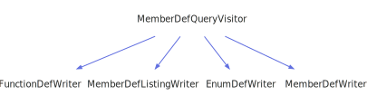

<h1>MemberDefQueryVisitor</h1>

<a href="https://github.com/CharlesCarley/MdDox#~">~</a>
<a href="index.md#index">MdDox</a>
/
<a href="a00986.md#mddox">MdDox</a>
::
<a href="a00991.md#doxygen">Doxygen</a>
::
<a href="a00995.md#visitors">Visitors</a>
::
<b>MemberDefQueryVisitor</b>
 
 

<h4>Derived By</h4>

<a href="a01031.md#enumdefwriter">MdDox::EnumDefWriter</a>

<a href="a01035.md#functiondefwriter">MdDox::FunctionDefWriter</a>

<a href="a01087.md#memberdeflistingwriter">MdDox::MemberDefListingWriter</a>

<a href="a01091.md#memberdefwriter">MdDox::MemberDefWriter</a>

 

<h2>Public Methods</h2>
<a href="#~memberdefqueryvisitor" class="icon-list-item">~MemberDefQueryVisitor
</a>

 
<a href="#visitedargsstring" class="icon-list-item">visitedArgsString
</a>

 
<a href="#visitedbriefdescription" class="icon-list-item">visitedBriefDescription
</a>

 
<a href="#visiteddefinition" class="icon-list-item">visitedDefinition
</a>

 
<a href="#visiteddetaileddescription" class="icon-list-item">visitedDetailedDescription
</a>

 
<a href="#visitedenumvalue" class="icon-list-item">visitedEnumValue
</a>

 
<a href="#visitedexceptions" class="icon-list-item">visitedExceptions
</a>

 
<a href="#visitedinbodydescription" class="icon-list-item">visitedInBodyDescription
</a>

 
<a href="#visitedinitializer" class="icon-list-item">visitedInitializer
</a>

 
<a href="#visitedlocation" class="icon-list-item">visitedLocation
</a>

 
<a href="#visitedname" class="icon-list-item">visitedName
</a>

 
<a href="#visitedparameter" class="icon-list-item">visitedParameter
</a>

 
<a href="#visitedreferencedby" class="icon-list-item">visitedReferencedBy
</a>

 
<a href="#visitedreferences" class="icon-list-item">visitedReferences
</a>

 
<a href="#visitedreimplementedby" class="icon-list-item">visitedReImplementedBy
</a>

 
<a href="#visitedreimplements" class="icon-list-item">visitedReImplements
</a>

 
<a href="#visitedtemplateparamlist" class="icon-list-item">visitedTemplateParamList
</a>

 
<a href="#visitedtext" class="icon-list-item">visitedText
</a>

 
<a href="#visitedtype" class="icon-list-item">visitedType
</a>

 
<a href="#visitedwrite" class="icon-list-item">visitedWrite
</a>

 

<h4>Defined in</h4>
<a href="https://github.com/CharlesCarley/MdDox/blob/master/Tools/Doxygen/MemberDefQuery.h#L37" class="icon-list-item">MemberDefQuery.h
</a>

 
<a href="#memberdefqueryvisitor" class="icon-list-item">top
</a>

<h2>~MemberDefQueryVisitor</h2>
<b>~MemberDefQueryVisitor</b>
<i>(</i>
<i>)</i>

<h4>Defined in</h4>
<a href="https://github.com/CharlesCarley/MdDox/blob/master/Tools/Doxygen/MemberDefQuery.h#L39" class="icon-list-item">MemberDefQuery.h
</a>

 
<a href="#memberdefqueryvisitor" class="icon-list-item">top
</a>

 

<h2>visitedArgsString</h2>
void
<b>visitedArgsString</b>
<i>(</i>

const 
<a href="a00986.md#string">String</a>
 &amp;
text

<i>)</i>
 
 
Called when the element 
<b>argsstring</b>
 is found. 
 
 
<ul>
<li><i>text</i>
: 
Const reference to the internal text. 
</li>
</ul>

<h4>Defined in</h4>
<a href="https://github.com/CharlesCarley/MdDox/blob/master/Tools/Doxygen/MemberDefQuery.h#L124" class="icon-list-item">MemberDefQuery.h
</a>

 
<a href="#memberdefqueryvisitor" class="icon-list-item">top
</a>

 

<h2>visitedBriefDescription</h2>
void
<b>visitedBriefDescription</b>
<i>(</i>

const 
<a href="a01339.md#descriptionquery">DescriptionQuery</a>
 &amp;
query

<i>)</i>
 
 
Called when the element 
<b>briefdescription</b>
 is found. 
 
 
<ul>
<li><i>query</i>
: 
Const reference to the 
<a href="a01339.md#descriptionquery">DescriptionQuery</a>
 class. 
</li>
</ul>

<h4>Defined in</h4>
<a href="https://github.com/CharlesCarley/MdDox/blob/master/Tools/Doxygen/MemberDefQuery.h#L99" class="icon-list-item">MemberDefQuery.h
</a>

 
<a href="#memberdefqueryvisitor" class="icon-list-item">top
</a>

 

<h2>visitedDefinition</h2>
void
<b>visitedDefinition</b>
<i>(</i>

const 
<a href="a00986.md#string">String</a>
 &amp;
text

<i>)</i>
 
 
Called when the element 
<b>definition</b>
 is found. 
 
 
<ul>
<li><i>text</i>
: 
Const reference to the internal text. 
</li>
</ul>

<h4>Defined in</h4>
<a href="https://github.com/CharlesCarley/MdDox/blob/master/Tools/Doxygen/MemberDefQuery.h#L119" class="icon-list-item">MemberDefQuery.h
</a>

 
<a href="#memberdefqueryvisitor" class="icon-list-item">top
</a>

 

<h2>visitedDetailedDescription</h2>
void
<b>visitedDetailedDescription</b>
<i>(</i>

const 
<a href="a01339.md#descriptionquery">DescriptionQuery</a>
 &amp;
query

<i>)</i>
 
 
Called when the element 
<b>detaileddescription</b>
 is found. 
 
 
<ul>
<li><i>query</i>
: 
Const reference to the 
<a href="a01339.md#descriptionquery">DescriptionQuery</a>
 class. 
</li>
</ul>

<h4>Defined in</h4>
<a href="https://github.com/CharlesCarley/MdDox/blob/master/Tools/Doxygen/MemberDefQuery.h#L104" class="icon-list-item">MemberDefQuery.h
</a>

 
<a href="#memberdefqueryvisitor" class="icon-list-item">top
</a>

 

<h2>visitedEnumValue</h2>
void
<b>visitedEnumValue</b>
<i>(</i>

const 
<a href="a01451.md#enumvaluequery">EnumValueQuery</a>
 &amp;
query

<i>)</i>
 
 
Called when the element 
<b>enumvalue</b>
 is found. 
 
 
<ul>
<li><i>query</i>
: 
Const reference to the 
<a href="a01451.md#enumvaluequery">EnumValueQuery</a>
 class. 
</li>
</ul>

<h4>Defined in</h4>
<a href="https://github.com/CharlesCarley/MdDox/blob/master/Tools/Doxygen/MemberDefQuery.h#L64" class="icon-list-item">MemberDefQuery.h
</a>

 
<a href="#memberdefqueryvisitor" class="icon-list-item">top
</a>

 

<h2>visitedExceptions</h2>
void
<b>visitedExceptions</b>
<i>(</i>

const 
<a href="a01559.md#linkedtextquery">LinkedTextQuery</a>
 &amp;
query

<i>)</i>
 
 
Called when the element 
<b>exceptions</b>
 is found. 
 
 
<ul>
<li><i>query</i>
: 
Const reference to the 
<a href="a01559.md#linkedtextquery">LinkedTextQuery</a>
 class. 
</li>
</ul>

<h4>Defined in</h4>
<a href="https://github.com/CharlesCarley/MdDox/blob/master/Tools/Doxygen/MemberDefQuery.h#L94" class="icon-list-item">MemberDefQuery.h
</a>

 
<a href="#memberdefqueryvisitor" class="icon-list-item">top
</a>

 

<h2>visitedInBodyDescription</h2>
void
<b>visitedInBodyDescription</b>
<i>(</i>

const 
<a href="a01339.md#descriptionquery">DescriptionQuery</a>
 &amp;
query

<i>)</i>
 
 
Called when the element 
<b>inbodydescription</b>
 is found. 
 
 
<ul>
<li><i>query</i>
: 
Const reference to the 
<a href="a01339.md#descriptionquery">DescriptionQuery</a>
 class. 
</li>
</ul>

<h4>Defined in</h4>
<a href="https://github.com/CharlesCarley/MdDox/blob/master/Tools/Doxygen/MemberDefQuery.h#L109" class="icon-list-item">MemberDefQuery.h
</a>

 
<a href="#memberdefqueryvisitor" class="icon-list-item">top
</a>

 

<h2>visitedInitializer</h2>
void
<b>visitedInitializer</b>
<i>(</i>

const 
<a href="a01559.md#linkedtextquery">LinkedTextQuery</a>
 &amp;
query

<i>)</i>
 
 
Called when the element 
<b>initializer</b>
 is found. 
 
 
<ul>
<li><i>query</i>
: 
Const reference to the 
<a href="a01559.md#linkedtextquery">LinkedTextQuery</a>
 class. 
</li>
</ul>

<h4>Defined in</h4>
<a href="https://github.com/CharlesCarley/MdDox/blob/master/Tools/Doxygen/MemberDefQuery.h#L89" class="icon-list-item">MemberDefQuery.h
</a>

 
<a href="#memberdefqueryvisitor" class="icon-list-item">top
</a>

 

<h2>visitedLocation</h2>
void
<b>visitedLocation</b>
<i>(</i>

const 
<a href="a01599.md#locationquery">LocationQuery</a>
 &amp;
query

<i>)</i>
 
 
Called when the element 
<b>location</b>
 is found. 
 
 
<ul>
<li><i>query</i>
: 
Const reference to the 
<a href="a01599.md#locationquery">LocationQuery</a>
 class. 
</li>
</ul>

<h4>Defined in</h4>
<a href="https://github.com/CharlesCarley/MdDox/blob/master/Tools/Doxygen/MemberDefQuery.h#L114" class="icon-list-item">MemberDefQuery.h
</a>

 
<a href="#memberdefqueryvisitor" class="icon-list-item">top
</a>

 

<h2>visitedName</h2>
void
<b>visitedName</b>
<i>(</i>

const 
<a href="a00986.md#string">String</a>
 &amp;
text

<i>)</i>
 
 
Called when the element 
<b>name</b>
 is found. 
 
 
<ul>
<li><i>text</i>
: 
Const reference to the internal text. 
</li>
</ul>

<h4>Defined in</h4>
<a href="https://github.com/CharlesCarley/MdDox/blob/master/Tools/Doxygen/MemberDefQuery.h#L129" class="icon-list-item">MemberDefQuery.h
</a>

 
<a href="#memberdefqueryvisitor" class="icon-list-item">top
</a>

 

<h2>visitedParameter</h2>
void
<b>visitedParameter</b>
<i>(</i>

const 
<a href="a01671.md#paramquery">ParamQuery</a>
 &amp;
query

<i>)</i>
 
 
Called when the element 
<b>param</b>
 is found. 
 
 
<ul>
<li><i>query</i>
: 
Const reference to the 
<a href="a01671.md#paramquery">ParamQuery</a>
 class. 
</li>
</ul>

<h4>Defined in</h4>
<a href="https://github.com/CharlesCarley/MdDox/blob/master/Tools/Doxygen/MemberDefQuery.h#L59" class="icon-list-item">MemberDefQuery.h
</a>

 
<a href="#memberdefqueryvisitor" class="icon-list-item">top
</a>

 

<h2>visitedReferencedBy</h2>
void
<b>visitedReferencedBy</b>
<i>(</i>

const 
<a href="a01699.md#referencequery">ReferenceQuery</a>
 &amp;
query

<i>)</i>
 
 
Called when the element 
<b>referencedby</b>
 is found. 
 
 
<ul>
<li><i>query</i>
: 
Const reference to the 
<a href="a01699.md#referencequery">ReferenceQuery</a>
 class. 
</li>
</ul>

<h4>Defined in</h4>
<a href="https://github.com/CharlesCarley/MdDox/blob/master/Tools/Doxygen/MemberDefQuery.h#L74" class="icon-list-item">MemberDefQuery.h
</a>

 
<a href="#memberdefqueryvisitor" class="icon-list-item">top
</a>

 

<h2>visitedReferences</h2>
void
<b>visitedReferences</b>
<i>(</i>

const 
<a href="a01699.md#referencequery">ReferenceQuery</a>
 &amp;
query

<i>)</i>
 
 
Called when the element 
<b>references</b>
 is found. 
 
 
<ul>
<li><i>query</i>
: 
Const reference to the 
<a href="a01699.md#referencequery">ReferenceQuery</a>
 class. 
</li>
</ul>

<h4>Defined in</h4>
<a href="https://github.com/CharlesCarley/MdDox/blob/master/Tools/Doxygen/MemberDefQuery.h#L69" class="icon-list-item">MemberDefQuery.h
</a>

 
<a href="#memberdefqueryvisitor" class="icon-list-item">top
</a>

 

<h2>visitedReImplementedBy</h2>
void
<b>visitedReImplementedBy</b>
<i>(</i>

const 
<a href="a01711.md#reimplementquery">ReimplementQuery</a>
 &amp;
query

<i>)</i>
 
 
Called when the element 
<b>reimplementedby</b>
 is found. 
 
 
<ul>
<li><i>query</i>
: 
Const reference to the 
<a href="a01711.md#reimplementquery">ReimplementQuery</a>
 class. 
</li>
</ul>

<h4>Defined in</h4>
<a href="https://github.com/CharlesCarley/MdDox/blob/master/Tools/Doxygen/MemberDefQuery.h#L54" class="icon-list-item">MemberDefQuery.h
</a>

 
<a href="#memberdefqueryvisitor" class="icon-list-item">top
</a>

 

<h2>visitedReImplements</h2>
void
<b>visitedReImplements</b>
<i>(</i>

const 
<a href="a01711.md#reimplementquery">ReimplementQuery</a>
 &amp;
query

<i>)</i>
 
 
Called when the element 
<b>reimplements</b>
 is found. 
 
 
<ul>
<li><i>query</i>
: 
Const reference to the 
<a href="a01711.md#reimplementquery">ReimplementQuery</a>
 class. 
</li>
</ul>

<h4>Defined in</h4>
<a href="https://github.com/CharlesCarley/MdDox/blob/master/Tools/Doxygen/MemberDefQuery.h#L49" class="icon-list-item">MemberDefQuery.h
</a>

 
<a href="#memberdefqueryvisitor" class="icon-list-item">top
</a>

 

<h2>visitedTemplateParamList</h2>
void
<b>visitedTemplateParamList</b>
<i>(</i>

const 
<a href="a01787.md#templateparamlistquery">TemplateParamListQuery</a>
 &amp;
query

<i>)</i>
 
 
Called when the element 
<b>templateparamlist</b>
 is found. 
 
 
<ul>
<li><i>query</i>
: 
Const reference to the 
<a href="a01787.md#templateparamlistquery">TemplateParamListQuery</a>
 class. 
</li>
</ul>

<h4>Defined in</h4>
<a href="https://github.com/CharlesCarley/MdDox/blob/master/Tools/Doxygen/MemberDefQuery.h#L79" class="icon-list-item">MemberDefQuery.h
</a>

 
<a href="#memberdefqueryvisitor" class="icon-list-item">top
</a>

 

<h2>visitedText</h2>
void
<b>visitedText</b>
<i>(</i>

const 
<a href="a00986.md#string">String</a>
 &amp;

<i>)</i>
 
 
Callback for every _text_node. 
 

<h4>Defined in</h4>
<a href="https://github.com/CharlesCarley/MdDox/blob/master/Tools/Doxygen/MemberDefQuery.h#L44" class="icon-list-item">MemberDefQuery.h
</a>

 
<a href="#memberdefqueryvisitor" class="icon-list-item">top
</a>

 

<h2>visitedType</h2>
void
<b>visitedType</b>
<i>(</i>

const 
<a href="a01559.md#linkedtextquery">LinkedTextQuery</a>
 &amp;
query

<i>)</i>
 
 
Called when the element 
<b>type</b>
 is found. 
 
 
<ul>
<li><i>query</i>
: 
Const reference to the 
<a href="a01559.md#linkedtextquery">LinkedTextQuery</a>
 class. 
</li>
</ul>

<h4>Defined in</h4>
<a href="https://github.com/CharlesCarley/MdDox/blob/master/Tools/Doxygen/MemberDefQuery.h#L84" class="icon-list-item">MemberDefQuery.h
</a>

 
<a href="#memberdefqueryvisitor" class="icon-list-item">top
</a>

 

<h2>visitedWrite</h2>
void
<b>visitedWrite</b>
<i>(</i>

const 
<a href="a00986.md#string">String</a>
 &amp;
text

<i>)</i>
 
 
Called when the element 
<b>write</b>
 is found. 
 
 
<ul>
<li><i>text</i>
: 
Const reference to the internal text. 
</li>
</ul>

<h4>Defined in</h4>
<a href="https://github.com/CharlesCarley/MdDox/blob/master/Tools/Doxygen/MemberDefQuery.h#L134" class="icon-list-item">MemberDefQuery.h
</a>

 
<a href="#memberdefqueryvisitor" class="icon-list-item">top
</a>

 

</body>
</html>
