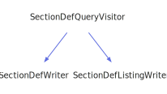

<h1>SectionDefQueryVisitor</h1>

<a href="https://github.com/CharlesCarley/MdDox#~">~</a>
<a href="index.md#index">MdDox</a>
/
<a href="a00986.md#mddox">MdDox</a>
::
<a href="a00991.md#doxygen">Doxygen</a>
::
<a href="a00995.md#visitors">Visitors</a>
::
<b>SectionDefQueryVisitor</b>
 
 

<h4>Derived By</h4>

<a href="a01159.md#sectiondeflistingwriter">MdDox::SectionDefListingWriter</a>

<a href="a01163.md#sectiondefwriter">MdDox::SectionDefWriter</a>

 

<h2>Public Methods</h2>
<a href="#~sectiondefqueryvisitor" class="icon-list-item">~SectionDefQueryVisitor
</a>

 
<a href="#visiteddescription" class="icon-list-item">visitedDescription
</a>

 
<a href="#visitedheader" class="icon-list-item">visitedHeader
</a>

 
<a href="#visitedmemberdef" class="icon-list-item">visitedMemberDef
</a>

 
<a href="#visitedtext" class="icon-list-item">visitedText
</a>

 

<h4>Defined in</h4>
<a href="https://github.com/CharlesCarley/MdDox/blob/master/Tools/Doxygen/SectionDefQuery.h#L32" class="icon-list-item">SectionDefQuery.h
</a>

 
<a href="#sectiondefqueryvisitor" class="icon-list-item">top
</a>

<h2>~SectionDefQueryVisitor</h2>
<b>~SectionDefQueryVisitor</b>
<i>(</i>
<i>)</i>

<h4>Defined in</h4>
<a href="https://github.com/CharlesCarley/MdDox/blob/master/Tools/Doxygen/SectionDefQuery.h#L34" class="icon-list-item">SectionDefQuery.h
</a>

 
<a href="#sectiondefqueryvisitor" class="icon-list-item">top
</a>

 

<h2>visitedDescription</h2>
void
<b>visitedDescription</b>
<i>(</i>

const 
<a href="a01339.md#descriptionquery">DescriptionQuery</a>
 &amp;
query

<i>)</i>
 
 
Called when the element 
<b>description</b>
 is found. 
 
 
<ul>
<li><i>query</i>
: 
Const reference to the 
<a href="a01339.md#descriptionquery">DescriptionQuery</a>
 class. 
</li>
</ul>

<h4>Defined in</h4>
<a href="https://github.com/CharlesCarley/MdDox/blob/master/Tools/Doxygen/SectionDefQuery.h#L49" class="icon-list-item">SectionDefQuery.h
</a>

 
<a href="#sectiondefqueryvisitor" class="icon-list-item">top
</a>

 

<h2>visitedHeader</h2>
void
<b>visitedHeader</b>
<i>(</i>

const 
<a href="a00986.md#string">String</a>
 &amp;
text

<i>)</i>
 
 
Called when the element 
<b>header</b>
 is found. 
 
 
<ul>
<li><i>text</i>
: 
Const reference to the internal text. 
</li>
</ul>

<h4>Defined in</h4>
<a href="https://github.com/CharlesCarley/MdDox/blob/master/Tools/Doxygen/SectionDefQuery.h#L54" class="icon-list-item">SectionDefQuery.h
</a>

 
<a href="#sectiondefqueryvisitor" class="icon-list-item">top
</a>

 

<h2>visitedMemberDef</h2>
void
<b>visitedMemberDef</b>
<i>(</i>

const 
<a href="a01615.md#memberdefquery">MemberDefQuery</a>
 &amp;
query

<i>)</i>
 
 
Called when the element 
<b>memberdef</b>
 is found. 
 
 
<ul>
<li><i>query</i>
: 
Const reference to the 
<a href="a01615.md#memberdefquery">MemberDefQuery</a>
 class. 
</li>
</ul>

<h4>Defined in</h4>
<a href="https://github.com/CharlesCarley/MdDox/blob/master/Tools/Doxygen/SectionDefQuery.h#L44" class="icon-list-item">SectionDefQuery.h
</a>

 
<a href="#sectiondefqueryvisitor" class="icon-list-item">top
</a>

 

<h2>visitedText</h2>
void
<b>visitedText</b>
<i>(</i>

const 
<a href="a00986.md#string">String</a>
 &amp;

<i>)</i>
 
 
Callback for every _text_node. 
 

<h4>Defined in</h4>
<a href="https://github.com/CharlesCarley/MdDox/blob/master/Tools/Doxygen/SectionDefQuery.h#L39" class="icon-list-item">SectionDefQuery.h
</a>

 
<a href="#sectiondefqueryvisitor" class="icon-list-item">top
</a>

 

</body>
</html>
