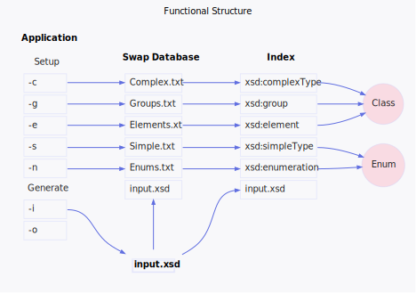

<a id="genapi"></a>
<h1>GenApi</h1>
<a id="a01848"></a>
<a href="https://github.com/CharlesCarley/MdDox#~">~</a>
<a href="index.md#index">MdDox</a>
<span class="inline-text">/</span>
<a href="a01838.md#mddox">MdDox</a>
<span class="inline-text">::</span>
<span class="bold-text"><b>GenApi</b></span>
<br/>
<br/>
<a href="a01848.md#genapi">GenApi</a>
<span class="inline-text"> is used to generate a static scaffolding library. </span>
<br/>
<br/>
<span class="inline-text">The main idea for this library is to provide the means to place a node inside a shell or scaffolding. The GenApi namespace allows this by generating a source library off of the compound schema file provided by Doxygen. </span>
<br/>
<br/>
<span class="inline-text">
 By design, the program will not work out of the box. It needs to be flexible enough to allow the renaming of types in the schema without modifying the actual element names. In order to do this, it needs to output a few extra files before generating the API. </span>
<br/>
<br/>
<span class="inline-text">
 The command line provides the means to extract a 1:1 mapping of all the names. It stores the names in individual resource files that the program uses during runtime. </span>
<br/>
<br/>
<br/>
<br/>
<br/>
<span class="inline-text">
 For instance, The following xml provides the source for the </span>
<span class="bold-text"><b>compounddefType</b></span>
<span class="inline-text"> scaffolding. </span>
<br/>
<br/>

```xml
<xsd:complexType name="compounddefType">
  <xsd:sequence>
    <xsd:element name="compoundname" type="xsd:string"/>
    <xsd:element minOccurs="0" name="title" type="xsd:string"/>
    <xsd:element minOccurs="0" name="basecompoundref" type="compoundRefType" maxOccurs="unbounded"/>
    <xsd:element minOccurs="0" name="derivedcompoundref" type="compoundRefType" maxOccurs="unbounded"/>
    <xsd:element minOccurs="0" name="includes" type="incType" maxOccurs="unbounded"/>
    <xsd:element minOccurs="0" name="includedby" type="incType" maxOccurs="unbounded"/>
    <xsd:element minOccurs="0" name="incdepgraph" type="graphType"/>
    <xsd:element minOccurs="0" name="invincdepgraph" type="graphType"/>
    <xsd:element minOccurs="0" name="innerdir" type="refType" maxOccurs="unbounded"/>
    <xsd:element minOccurs="0" name="innerfile" type="refType" maxOccurs="unbounded"/>
    <xsd:element minOccurs="0" name="innerclass" type="refType" maxOccurs="unbounded"/>
    <xsd:element minOccurs="0" name="innernamespace" type="refType" maxOccurs="unbounded"/>
    <xsd:element minOccurs="0" name="innerpage" type="refType" maxOccurs="unbounded"/>
    <xsd:element minOccurs="0" name="innergroup" type="refType" maxOccurs="unbounded"/>
    <xsd:element minOccurs="0" name="templateparamlist" type="templateparamlistType"/>
    <xsd:element minOccurs="0" name="sectiondef" type="sectiondefType" maxOccurs="unbounded"/>
    <xsd:element minOccurs="0" name="tableofcontents" maxOccurs="1"/>
    <xsd:element minOccurs="0" name="briefdescription" type="descriptionType"/>
    <xsd:element minOccurs="0" name="detaileddescription" type="descriptionType"/>
    <xsd:element minOccurs="0" name="inheritancegraph" type="graphType"/>
    <xsd:element minOccurs="0" name="collaborationgraph" type="graphType"/>
    <xsd:element minOccurs="0" name="programlisting" type="listingType"/>
    <xsd:element minOccurs="0" name="location" type="locationType"/>
    <xsd:element minOccurs="0" name="listofallmembers" type="listofallmembersType"/>
  </xsd:sequence>
  <xsd:attribute name="id" type="xsd:string"/>
  <xsd:attribute name="kind" type="DoxCompoundKind"/>
  <xsd:attribute name="language" type="DoxLanguage" use="optional"/>
  <xsd:attribute name="prot" type="DoxProtectionKind"/>
  <xsd:attribute name="final" type="DoxBool" use="optional"/>
  <xsd:attribute name="sealed" type="DoxBool" use="optional"/>
  <xsd:attribute name="abstract" type="DoxBool" use="optional"/>
</xsd:complexType>
```
<span class="inline-text">The name attributes are substituted through the respective swap file. The application will use the substitutions to produce the class </span>
<a href="a02163.md#compounddefquery">Doxygen::CompoundDefQuery</a>
<a id="namespaces"></a>
<h2>Namespaces</h2>
<div class="icon-link">
<a href="a01849.md#resources">Resources</a>
</div>
<a id="classes"></a>
<h2>Classes</h2>
<div class="icon-link">
<a href="a02711.md#application">Application</a>
</div>
<div class="icon-link">
<a href="a02731.md#attribute">Attribute</a>
</div>
<div class="icon-link">
<a href="a02687.md#common">Common</a>
</div>
<div class="icon-link">
<a href="a02691.md#complex">Complex</a>
</div>
<div class="icon-link">
<a href="a02695.md#database">Database</a>
</div>
<div class="icon-link">
<a href="a02727.md#element">Element</a>
</div>
<div class="icon-link">
<a href="a02703.md#generator">Generator</a>
</div>
<div class="icon-link">
<a href="a02699.md#generatorimpl">GeneratorImpl</a>
</div>
<div class="icon-link">
<a href="a02707.md#group">Group</a>
</div>
<div class="icon-link">
<a href="a02715.md#object">Object</a>
</div>
<div class="icon-link">
<a href="a02723.md#simple">Simple</a>
</div>
<div class="icon-link">
<a href="a02735.md#writer">Writer</a>
</div>
<a id="enums"></a>
<h2>Enums</h2>
<span class="icon-list-item"><a href="#elementtype" class="icon-list-item"><span class="icon-list-item">ElementType</span>
</a>
</span>
<br/>
<span class="icon-list-item"><a href="#options" class="icon-list-item"><span class="icon-list-item">Options</span>
</a>
</span>
<br/>
<a id="typedefs"></a>
<h2>Typedefs</h2>
<span class="icon-list-item"><a href="#allocarray" class="icon-list-item"><span class="icon-list-item">AllocArray</span>
</a>
</span>
<br/>
<span class="icon-list-item"><a href="#attributearray" class="icon-list-item"><span class="icon-list-item">AttributeArray</span>
</a>
</span>
<br/>
<span class="icon-list-item"><a href="#attributemap" class="icon-list-item"><span class="icon-list-item">AttributeMap</span>
</a>
</span>
<br/>
<span class="icon-list-item"><a href="#complexmap" class="icon-list-item"><span class="icon-list-item">ComplexMap</span>
</a>
</span>
<br/>
<span class="icon-list-item"><a href="#elementarray" class="icon-list-item"><span class="icon-list-item">ElementArray</span>
</a>
</span>
<br/>
<span class="icon-list-item"><a href="#grouparray" class="icon-list-item"><span class="icon-list-item">GroupArray</span>
</a>
</span>
<br/>
<span class="icon-list-item"><a href="#groupmap" class="icon-list-item"><span class="icon-list-item">GroupMap</span>
</a>
</span>
<br/>
<span class="icon-list-item"><a href="#nodemap" class="icon-list-item"><span class="icon-list-item">NodeMap</span>
</a>
</span>
<br/>
<span class="icon-list-item"><a href="#objectmap" class="icon-list-item"><span class="icon-list-item">ObjectMap</span>
</a>
</span>
<br/>
<a id="variables"></a>
<h2>Variables</h2>
<span class="icon-list-item"><a href="#switches" class="icon-list-item"><span class="icon-list-item">Switches</span>
</a>
</span>
<br/>
<a id="defined-in"></a>
<h4>Defined in</h4>
<span class="icon-list-item"><a href="https://github.com/CharlesCarley/MdDox/blob/master/Tools/GenApi/Common.cpp#L29" class="icon-list-item"><span class="icon-list-item">Common.cpp</span>
</a>
</span>
<br/>
<span class="icon-list-item"><a href="#genapi" class="icon-list-item"><span class="icon-list-item">top</span>
</a>
</span>
<a id="elementtype"></a>
<h2>ElementType</h2>
<span class="bold-text"><b>ElementType</b></span>
<br/>
<a id="base_type"></a>
<div class="paragraph">
<span class="paragraph"><span class="inline-text">BASE_TYPE</span>
</span>
</div>
<a id="simple_type"></a>
<div class="paragraph">
<span class="paragraph"><span class="inline-text">SIMPLE_TYPE</span>
</span>
</div>
<a id="complex_type"></a>
<div class="paragraph">
<span class="paragraph"><span class="inline-text">COMPLEX_TYPE</span>
</span>
</div>
<a id="group_type"></a>
<div class="paragraph">
<span class="paragraph"><span class="inline-text">GROUP_TYPE</span>
</span>
</div>
<a id="base_type"></a>
<a id="simple_type"></a>
<a id="complex_type"></a>
<a id="group_type"></a>
<a id="defined-in"></a>
<h4>Defined in</h4>
<span class="icon-list-item"><a href="https://github.com/CharlesCarley/MdDox/blob/master/Tools/GenApi/Types.h#L30" class="icon-list-item"><span class="icon-list-item">Types.h</span>
</a>
</span>
<br/>
<span class="icon-list-item"><a href="#genapi" class="icon-list-item"><span class="icon-list-item">top</span>
</a>
</span>
<br/>
<a id="options"></a>
<h2>Options</h2>
<span class="bold-text"><b>Options</b></span>
<br/>
<span class="inline-text">Document. </span>
<br/>
<br/>
<a id="optinputfile"></a>
<div class="paragraph">
<span class="paragraph"><span class="inline-text">OptInputFile</span>
</span>
</div>
<a id="optoutdir"></a>
<div class="paragraph">
<span class="paragraph"><span class="inline-text">OptOutDir</span>
</span>
</div>
<a id="optlogcomplextypes"></a>
<div class="paragraph">
<span class="paragraph"><span class="inline-text">OptLogComplexTypes</span>
</span>
</div>
<a id="optlogsimpletypes"></a>
<div class="paragraph">
<span class="paragraph"><span class="inline-text">OptLogSimpleTypes</span>
</span>
</div>
<a id="optlogattributenames"></a>
<div class="paragraph">
<span class="paragraph"><span class="inline-text">OptLogAttributeNames</span>
</span>
</div>
<a id="optlogelementnames"></a>
<div class="paragraph">
<span class="paragraph"><span class="inline-text">OptLogElementNames</span>
</span>
</div>
<a id="optloggroupnames"></a>
<div class="paragraph">
<span class="paragraph"><span class="inline-text">OptLogGroupNames</span>
</span>
</div>
<a id="optoplogenumvalues"></a>
<div class="paragraph">
<span class="paragraph"><span class="inline-text">OptOpLogEnumValues</span>
</span>
</div>
<a id="optionsmax"></a>
<div class="paragraph">
<span class="paragraph"><span class="inline-text">OptionsMax</span>
</span>
</div>
<a id="optinputfile"></a>
<a id="optoutdir"></a>
<a id="optlogcomplextypes"></a>
<a id="optlogsimpletypes"></a>
<a id="optlogattributenames"></a>
<a id="optlogelementnames"></a>
<a id="optloggroupnames"></a>
<a id="optoplogenumvalues"></a>
<a id="optionsmax"></a>
<a id="defined-in"></a>
<h4>Defined in</h4>
<span class="icon-list-item"><a href="https://github.com/CharlesCarley/MdDox/blob/master/Tools/GenApi/Main.cpp#L38" class="icon-list-item"><span class="icon-list-item">Main.cpp</span>
</a>
</span>
<br/>
<span class="icon-list-item"><a href="#genapi" class="icon-list-item"><span class="icon-list-item">top</span>
</a>
</span>
<br/>
<a id="allocarray"></a>
<h2>AllocArray</h2>
<span class="inline-text">std::vector&lt; </span>
<a href="a02123.md#writer">Writer</a>
<span class="inline-text"> * &gt;</span>
<span class="bold-text"><b>AllocArray</b></span>
<br/>
<a id="defined-in"></a>
<h4>Defined in</h4>
<span class="icon-list-item"><a href="https://github.com/CharlesCarley/MdDox/blob/master/Tools/GenApi/Generator.cpp#L42" class="icon-list-item"><span class="icon-list-item">Generator.cpp</span>
</a>
</span>
<br/>
<span class="icon-list-item"><a href="#genapi" class="icon-list-item"><span class="icon-list-item">top</span>
</a>
</span>
<br/>
<a id="attributearray"></a>
<h2>AttributeArray</h2>
<span class="inline-text">std::vector&lt; </span>
<a href="a02107.md#attribute">Attribute</a>
<span class="inline-text"> &gt;</span>
<span class="bold-text"><b>AttributeArray</b></span>
<br/>
<a id="defined-in"></a>
<h4>Defined in</h4>
<span class="icon-list-item"><a href="https://github.com/CharlesCarley/MdDox/blob/master/Tools/GenApi/Complex.h#L36" class="icon-list-item"><span class="icon-list-item">Complex.h</span>
</a>
</span>
<br/>
<span class="icon-list-item"><a href="#genapi" class="icon-list-item"><span class="icon-list-item">top</span>
</a>
</span>
<br/>
<a id="attributemap"></a>
<h2>AttributeMap</h2>
<span class="inline-text">std::unordered_map&lt; </span>
<a href="a01838.md#string">String</a>
<span class="inline-text">, </span>
<a href="a02107.md#attribute">Attribute</a>
<span class="inline-text"> &gt;</span>
<span class="bold-text"><b>AttributeMap</b></span>
<br/>
<a id="defined-in"></a>
<h4>Defined in</h4>
<span class="icon-list-item"><a href="https://github.com/CharlesCarley/MdDox/blob/master/Tools/GenApi/Complex.h#L37" class="icon-list-item"><span class="icon-list-item">Complex.h</span>
</a>
</span>
<br/>
<span class="icon-list-item"><a href="#genapi" class="icon-list-item"><span class="icon-list-item">top</span>
</a>
</span>
<br/>
<a id="complexmap"></a>
<h2>ComplexMap</h2>
<span class="inline-text">std::unordered_map&lt; </span>
<a href="a01838.md#string">String</a>
<span class="inline-text">, </span>
<a href="a02691.md#complex">Complex</a>
<span class="inline-text"> * &gt;</span>
<span class="bold-text"><b>ComplexMap</b></span>
<br/>
<a id="defined-in"></a>
<h4>Defined in</h4>
<span class="icon-list-item"><a href="https://github.com/CharlesCarley/MdDox/blob/master/Tools/GenApi/Generator.cpp#L43" class="icon-list-item"><span class="icon-list-item">Generator.cpp</span>
</a>
</span>
<br/>
<span class="icon-list-item"><a href="#genapi" class="icon-list-item"><span class="icon-list-item">top</span>
</a>
</span>
<br/>
<a id="elementarray"></a>
<h2>ElementArray</h2>
<span class="inline-text">std::vector&lt; </span>
<a href="a02727.md#element">Element</a>
<span class="inline-text"> &gt;</span>
<span class="bold-text"><b>ElementArray</b></span>
<br/>
<a id="defined-in"></a>
<h4>Defined in</h4>
<span class="icon-list-item"><a href="https://github.com/CharlesCarley/MdDox/blob/master/Tools/GenApi/Complex.h#L35" class="icon-list-item"><span class="icon-list-item">Complex.h</span>
</a>
</span>
<br/>
<span class="icon-list-item"><a href="#genapi" class="icon-list-item"><span class="icon-list-item">top</span>
</a>
</span>
<br/>
<a id="grouparray"></a>
<h2>GroupArray</h2>
<span class="inline-text">std::vector&lt; </span>
<a href="a02707.md#group">Group</a>
<span class="inline-text"> * &gt;</span>
<span class="bold-text"><b>GroupArray</b></span>
<br/>
<a id="defined-in"></a>
<h4>Defined in</h4>
<span class="icon-list-item"><a href="https://github.com/CharlesCarley/MdDox/blob/master/Tools/GenApi/Group.h#L39" class="icon-list-item"><span class="icon-list-item">Group.h</span>
</a>
</span>
<br/>
<span class="icon-list-item"><a href="#genapi" class="icon-list-item"><span class="icon-list-item">top</span>
</a>
</span>
<br/>
<a id="groupmap"></a>
<h2>GroupMap</h2>
<span class="inline-text">std::unordered_map&lt; </span>
<a href="a01838.md#string">String</a>
<span class="inline-text">, </span>
<a href="a02707.md#group">Group</a>
<span class="inline-text"> * &gt;</span>
<span class="bold-text"><b>GroupMap</b></span>
<br/>
<a id="defined-in"></a>
<h4>Defined in</h4>
<span class="icon-list-item"><a href="https://github.com/CharlesCarley/MdDox/blob/master/Tools/GenApi/Generator.cpp#L44" class="icon-list-item"><span class="icon-list-item">Generator.cpp</span>
</a>
</span>
<br/>
<span class="icon-list-item"><a href="#genapi" class="icon-list-item"><span class="icon-list-item">top</span>
</a>
</span>
<br/>
<a id="nodemap"></a>
<h2>NodeMap</h2>
<span class="inline-text">std::unordered_map&lt; </span>
<a href="a01838.md#string">String</a>
<span class="inline-text">, </span>
<a href="a02111.md#node">Xml::Node</a>
<span class="inline-text"> * &gt;</span>
<span class="bold-text"><b>NodeMap</b></span>
<br/>
<a id="defined-in"></a>
<h4>Defined in</h4>
<span class="icon-list-item"><a href="https://github.com/CharlesCarley/MdDox/blob/master/Tools/GenApi/Database.h#L37" class="icon-list-item"><span class="icon-list-item">Database.h</span>
</a>
</span>
<br/>
<span class="icon-list-item"><a href="#genapi" class="icon-list-item"><span class="icon-list-item">top</span>
</a>
</span>
<br/>
<a id="objectmap"></a>
<h2>ObjectMap</h2>
<span class="inline-text">std::unordered_map&lt; </span>
<a href="a01838.md#string">String</a>
<span class="inline-text">, </span>
<a href="a02715.md#object">Object</a>
<span class="inline-text"> * &gt;</span>
<span class="bold-text"><b>ObjectMap</b></span>
<br/>
<a id="defined-in"></a>
<h4>Defined in</h4>
<span class="icon-list-item"><a href="https://github.com/CharlesCarley/MdDox/blob/master/Tools/GenApi/Database.h#L38" class="icon-list-item"><span class="icon-list-item">Database.h</span>
</a>
</span>
<br/>
<span class="icon-list-item"><a href="#genapi" class="icon-list-item"><span class="icon-list-item">top</span>
</a>
</span>
<br/>
<a id="switches"></a>
<h2>Switches</h2>
<span class="inline-text">constexpr </span>
<a href="a02027.md#switch">CommandLine::Switch</a>
<span class="bold-text"><b>Switches</b></span>
<br/>
<span class="inline-text">Document. </span>
<br/>
<br/>
<a id="defined-in"></a>
<h4>Defined in</h4>
<span class="icon-list-item"><a href="https://github.com/CharlesCarley/MdDox/blob/master/Tools/GenApi/Main.cpp#L53" class="icon-list-item"><span class="icon-list-item">Main.cpp</span>
</a>
</span>
<br/>
<span class="icon-list-item"><a href="#genapi" class="icon-list-item"><span class="icon-list-item">top</span>
</a>
</span>
<br/>
</div>
</div>
</body>
</html>
