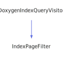

<h1>IndexPageFilter</h1>

<a href="https://github.com/CharlesCarley/MdDox#~">~</a>
<a href="index.md#index">MdDox</a>
/
<a href="a01838.md#mddox">MdDox</a>
::
<b>IndexPageFilter</b>
 
 

<h4>Derived From</h4>

<a href="a02271.md#doxygenindexqueryvisitor">MdDox::Doxygen::Visitors::DoxygenIndexQueryVisitor</a>

 

<h2>Public Members</h2>
<a href="#classes" class="icon-list-item">classes
</a>

 
<a href="#directories" class="icon-list-item">directories
</a>

 
<a href="#dirpaths" class="icon-list-item">dirPaths
</a>

 
<a href="#hasmainpage" class="icon-list-item">hasMainPage
</a>

 
<a href="#namespaces" class="icon-list-item">namespaces
</a>

 
<a href="#pages" class="icon-list-item">pages
</a>

 

<h2>Public Methods</h2>
<a href="#adddirectory" class="icon-list-item">addDirectory
</a>

 
<a href="#addpage" class="icon-list-item">addPage
</a>

 
<a href="#filterreference" class="icon-list-item">filterReference
</a>

 
<a href="#visitedcompound" class="icon-list-item">visitedCompound
</a>

 

<h4>Defined in</h4>
<a href="https://github.com/CharlesCarley/MdDox/blob/master/Source/MdDoxTree/IndexPageWriter.cpp#L44" class="icon-list-item">IndexPageWriter.cpp
</a>

 
<a href="#indexpagefilter" class="icon-list-item">top
</a>

<h2>classes</h2>
<a href="a01838.md#referencelist">ReferenceList</a>
<b>classes</b>
 

<h4>Defined in</h4>
<a href="https://github.com/CharlesCarley/MdDox/blob/master/Source/MdDoxTree/IndexPageWriter.cpp#L47" class="icon-list-item">IndexPageWriter.cpp
</a>

 
<a href="#indexpagefilter" class="icon-list-item">top
</a>

 

<h2>directories</h2>
<a href="a01838.md#referencelist">ReferenceList</a>
<b>directories</b>
 

<h4>Defined in</h4>
<a href="https://github.com/CharlesCarley/MdDox/blob/master/Source/MdDoxTree/IndexPageWriter.cpp#L49" class="icon-list-item">IndexPageWriter.cpp
</a>

 
<a href="#indexpagefilter" class="icon-list-item">top
</a>

 

<h2>dirPaths</h2>
<a href="a01838.md#referencelist">ReferenceList</a>
<b>dirPaths</b>
 

<h4>Defined in</h4>
<a href="https://github.com/CharlesCarley/MdDox/blob/master/Source/MdDoxTree/IndexPageWriter.cpp#L50" class="icon-list-item">IndexPageWriter.cpp
</a>

 
<a href="#indexpagefilter" class="icon-list-item">top
</a>

 

<h2>hasMainPage</h2>
bool
<b>hasMainPage</b>
 

<h4>Defined in</h4>
<a href="https://github.com/CharlesCarley/MdDox/blob/master/Source/MdDoxTree/IndexPageWriter.cpp#L51" class="icon-list-item">IndexPageWriter.cpp
</a>

 
<a href="#indexpagefilter" class="icon-list-item">top
</a>

 

<h2>namespaces</h2>
<a href="a01838.md#referencelist">ReferenceList</a>
<b>namespaces</b>
 

<h4>Defined in</h4>
<a href="https://github.com/CharlesCarley/MdDox/blob/master/Source/MdDoxTree/IndexPageWriter.cpp#L48" class="icon-list-item">IndexPageWriter.cpp
</a>

 
<a href="#indexpagefilter" class="icon-list-item">top
</a>

 

<h2>pages</h2>
<a href="a01838.md#referencelist">ReferenceList</a>
<b>pages</b>
 

<h4>Defined in</h4>
<a href="https://github.com/CharlesCarley/MdDox/blob/master/Source/MdDoxTree/IndexPageWriter.cpp#L46" class="icon-list-item">IndexPageWriter.cpp
</a>

 
<a href="#indexpagefilter" class="icon-list-item">top
</a>

 

<h2>addDirectory</h2>
void
<b>addDirectory</b>
<i>(</i>

const 
<a href="a01979.md#reference">Reference</a>
 &amp;
compoundRef

<i>)</i>

<h4>References</h4>

<a href="a01979.md#getname">getName</a>

<a href="a02099.md#split">split</a>

<a href="a01915.md#dirpaths">dirPaths</a>

<a href="a01915.md#directories">directories</a>

<h4>Defined in</h4>
<a href="https://github.com/CharlesCarley/MdDox/blob/master/Source/MdDoxTree/IndexPageWriter.cpp#L62" class="icon-list-item">IndexPageWriter.cpp
</a>

 
<a href="#indexpagefilter" class="icon-list-item">top
</a>

 

<h2>addPage</h2>
void
<b>addPage</b>
<i>(</i>

const 
<a href="a01979.md#reference">Reference</a>
 &amp;
compoundRef

<i>)</i>

<h4>References</h4>

<a href="a01979.md#getid">getId</a>

<a href="a01915.md#pages">pages</a>

<a href="a01915.md#hasmainpage">hasMainPage</a>

<h4>Defined in</h4>
<a href="https://github.com/CharlesCarley/MdDox/blob/master/Source/MdDoxTree/IndexPageWriter.cpp#L54" class="icon-list-item">IndexPageWriter.cpp
</a>

 
<a href="#indexpagefilter" class="icon-list-item">top
</a>

 

<h2>filterReference</h2>
void
<b>filterReference</b>
<i>(</i>

const 
<a href="a02171.md#compoundindexquery">Doxygen::CompoundIndexQuery</a>
 &amp;
query

const 
<a href="a01979.md#reference">Reference</a>
 &amp;
compoundRef

<i>)</i>

<h4>References</h4>

<a href="a02171.md#getkind">getKind</a>

<a href="a01843.md#dck_group">DCK_GROUP</a>

<a href="a01843.md#dck_example">DCK_EXAMPLE</a>

<a href="a01843.md#dck_page">DCK_PAGE</a>

<a href="a01915.md#addpage">addPage</a>

<a href="a01843.md#dck_module">DCK_MODULE</a>

<a href="a01843.md#dck_namespace">DCK_NAMESPACE</a>

<a href="a01915.md#namespaces">namespaces</a>

<a href="a01843.md#dck_struct">DCK_STRUCT</a>

<a href="a01843.md#dck_union">DCK_UNION</a>

<a href="a01843.md#dck_class">DCK_CLASS</a>

<a href="a01915.md#classes">classes</a>

<a href="a01843.md#dck_dir">DCK_DIR</a>

<a href="a01915.md#adddirectory">addDirectory</a>

<a href="a01843.md#dck_interface">DCK_INTERFACE</a>

<a href="a01843.md#dck_service">DCK_SERVICE</a>

<a href="a01843.md#dck_protocol">DCK_PROTOCOL</a>

<a href="a01843.md#dck_category">DCK_CATEGORY</a>

<a href="a01843.md#dck_exception">DCK_EXCEPTION</a>

<a href="a01843.md#dck_singleton">DCK_SINGLETON</a>

<a href="a01843.md#dck_type">DCK_TYPE</a>

<a href="a01843.md#dck_file">DCK_FILE</a>

<a href="a01843.md#dck_invalid">DCK_INVALID</a>

<a href="a01843.md#dck_max">DCK_MAX</a>

<h4>Defined in</h4>
<a href="https://github.com/CharlesCarley/MdDox/blob/master/Source/MdDoxTree/IndexPageWriter.cpp#L76" class="icon-list-item">IndexPageWriter.cpp
</a>

 
<a href="#indexpagefilter" class="icon-list-item">top
</a>

 

<h2>visitedCompound</h2>
void
<b>visitedCompound</b>
<i>(</i>

const 
<a href="a02171.md#compoundindexquery">Doxygen::CompoundIndexQuery</a>
 &amp;
query

<i>)</i>
 
 
Called when the element 
<b>compound</b>
 is found. 
 
 
<ul>
<li><i>query</i>
: 
Const reference to the CompoundIndexQuery class. 
</li>
</ul>

<h4>References</h4>

<a href="a01979.md#setname">setName</a>

<a href="a02171.md#getname">getName</a>

<a href="a01979.md#setid">setId</a>

<a href="a02171.md#getrefid">getRefId</a>

<a href="a01915.md#filterreference">filterReference</a>

<a href="a02019.md#get">get</a>

<a href="a02019.md#insertcompound">insertCompound</a>

<a href="a02171.md#getkind">getKind</a>

<a href="a02171.md#foreachmember">foreachMember</a>

<a href="a02019.md#insertmember">insertMember</a>

<a href="a02471.md#getkind">getKind</a>

<a href="a02471.md#getname">getName</a>

<a href="a02471.md#getrefid">getRefId</a>

<h4>Defined in</h4>
<a href="https://github.com/CharlesCarley/MdDox/blob/master/Source/MdDoxTree/IndexPageWriter.cpp#L112" class="icon-list-item">IndexPageWriter.cpp
</a>

 
<a href="#indexpagefilter" class="icon-list-item">top
</a>

 

</body>
</html>
