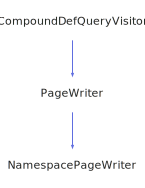

<h1>MemberDefWriter</h1>

<a href="https://github.com/CharlesCarley/MdDox#~">~</a>
<a href="index.md#index">MdDox</a>
/
<a href="a01838.md#mddox">MdDox</a>
::
<b>MemberDefWriter</b>
 
 

<h4>Derived From</h4>

<a href="a02463.md#memberdefqueryvisitor">MdDox::Doxygen::Visitors::MemberDefQueryVisitor</a>

 

<h2>Private Members</h2>
<a href="#_name" class="icon-list-item">_name
</a>

 
<a href="#_out" class="icon-list-item">_out
</a>

 
<a href="#_stream" class="icon-list-item">_stream
</a>

 
<a href="#_writer" class="icon-list-item">_writer
</a>

 

<h2>Private Methods</h2>
<a href="#visitedbriefdescription" class="icon-list-item">visitedBriefDescription
</a>

 
<a href="#visiteddetaileddescription" class="icon-list-item">visitedDetailedDescription
</a>

 
<a href="#visitedenumvalue" class="icon-list-item">visitedEnumValue
</a>

 
<a href="#visitedexceptions" class="icon-list-item">visitedExceptions
</a>

 
<a href="#visitedinitializer" class="icon-list-item">visitedInitializer
</a>

 
<a href="#visitedlocation" class="icon-list-item">visitedLocation
</a>

 
<a href="#visitedname" class="icon-list-item">visitedName
</a>

 
<a href="#visitedparameter" class="icon-list-item">visitedParameter
</a>

 
<a href="#visitedreferencedby" class="icon-list-item">visitedReferencedBy
</a>

 
<a href="#visitedreferences" class="icon-list-item">visitedReferences
</a>

 
<a href="#visitedreimplementedby" class="icon-list-item">visitedReImplementedBy
</a>

 
<a href="#visitedreimplements" class="icon-list-item">visitedReImplements
</a>

 
<a href="#visitedtemplateparamlist" class="icon-list-item">visitedTemplateParamList
</a>

 
<a href="#visitedtype" class="icon-list-item">visitedType
</a>

 
<a href="#visitedwrite" class="icon-list-item">visitedWrite
</a>

 

<h2>Public Methods</h2>
<a href="#memberdefwriter" class="icon-list-item">MemberDefWriter
</a>

 
<a href="#write" class="icon-list-item">write
</a>

 

<h4>Defined in</h4>
<a href="https://github.com/CharlesCarley/MdDox/blob/master/Source/MdDoxTree/MemberDefWriter.h#L31" class="icon-list-item">MemberDefWriter.h
</a>

 
<a href="#memberdefwriter" class="icon-list-item">top
</a>

<h2>_name</h2>
<a href="a01838.md#string">String</a>
<b>_name</b>
 

<h4>Defined in</h4>
<a href="https://github.com/CharlesCarley/MdDox/blob/master/Source/MdDoxTree/MemberDefWriter.h#L36" class="icon-list-item">MemberDefWriter.h
</a>

 
<a href="#memberdefwriter" class="icon-list-item">top
</a>

 

<h2>_out</h2>
<a href="a01838.md#outputstringstream">OutputStringStream</a>
<b>_out</b>
 

<h4>Defined in</h4>
<a href="https://github.com/CharlesCarley/MdDox/blob/master/Source/MdDoxTree/MemberDefWriter.h#L35" class="icon-list-item">MemberDefWriter.h
</a>

 
<a href="#memberdefwriter" class="icon-list-item">top
</a>

 

<h2>_stream</h2>
<a href="a01838.md#ostream">OStream</a>
 *
<b>_stream</b>
 

<h4>Defined in</h4>
<a href="https://github.com/CharlesCarley/MdDox/blob/master/Source/MdDoxTree/MemberDefWriter.h#L34" class="icon-list-item">MemberDefWriter.h
</a>

 
<a href="#memberdefwriter" class="icon-list-item">top
</a>

 

<h2>_writer</h2>
<a href="a01871.md#documentwriter">DocumentWriter</a>
 *
<b>_writer</b>
 

<h4>Defined in</h4>
<a href="https://github.com/CharlesCarley/MdDox/blob/master/Source/MdDoxTree/MemberDefWriter.h#L33" class="icon-list-item">MemberDefWriter.h
</a>

 
<a href="#memberdefwriter" class="icon-list-item">top
</a>

 

<h2>visitedBriefDescription</h2>
void
<b>visitedBriefDescription</b>
<i>(</i>

const 
<a href="a02191.md#descriptionquery">Doxygen::DescriptionQuery</a>
 &amp;
query

<i>)</i>
 
 
Called when the element 
<b>briefdescription</b>
 is found. 
 
 
<ul>
<li><i>query</i>
: 
Const reference to the DescriptionQuery class. 
</li>
</ul>

<h4>Defined in</h4>
<a href="https://github.com/CharlesCarley/MdDox/blob/master/Source/MdDoxTree/MemberDefWriter.h#L54" class="icon-list-item">MemberDefWriter.h
</a>

 
<a href="https://github.com/CharlesCarley/MdDox/blob/master/Source/MdDoxTree/MemberDefWriter.cpp#L94" class="icon-list-item">MemberDefWriter.cpp
</a>

 
<a href="#memberdefwriter" class="icon-list-item">top
</a>

 

<h2>visitedDetailedDescription</h2>
void
<b>visitedDetailedDescription</b>
<i>(</i>

const 
<a href="a02191.md#descriptionquery">Doxygen::DescriptionQuery</a>
 &amp;
query

<i>)</i>
 
 
Called when the element 
<b>detaileddescription</b>
 is found. 
 
 
<ul>
<li><i>query</i>
: 
Const reference to the DescriptionQuery class. 
</li>
</ul>

<h4>Defined in</h4>
<a href="https://github.com/CharlesCarley/MdDox/blob/master/Source/MdDoxTree/MemberDefWriter.h#L62" class="icon-list-item">MemberDefWriter.h
</a>

 
<a href="https://github.com/CharlesCarley/MdDox/blob/master/Source/MdDoxTree/MemberDefWriter.cpp#L130" class="icon-list-item">MemberDefWriter.cpp
</a>

 
<a href="#memberdefwriter" class="icon-list-item">top
</a>

 

<h2>visitedEnumValue</h2>
void
<b>visitedEnumValue</b>
<i>(</i>

const 
<a href="a02303.md#enumvaluequery">Doxygen::EnumValueQuery</a>
 &amp;
query

<i>)</i>
 
 
Called when the element 
<b>enumvalue</b>
 is found. 
 
 
<ul>
<li><i>query</i>
: 
Const reference to the EnumValueQuery class. 
</li>
</ul>

<h4>Defined in</h4>
<a href="https://github.com/CharlesCarley/MdDox/blob/master/Source/MdDoxTree/MemberDefWriter.h#L42" class="icon-list-item">MemberDefWriter.h
</a>

 
<a href="https://github.com/CharlesCarley/MdDox/blob/master/Source/MdDoxTree/MemberDefWriter.cpp#L56" class="icon-list-item">MemberDefWriter.cpp
</a>

 
<a href="#memberdefwriter" class="icon-list-item">top
</a>

 

<h2>visitedExceptions</h2>
void
<b>visitedExceptions</b>
<i>(</i>

const 
<a href="a02411.md#linkedtextquery">Doxygen::LinkedTextQuery</a>
 &amp;
query

<i>)</i>
 
 
Called when the element 
<b>exceptions</b>
 is found. 
 
 
<ul>
<li><i>query</i>
: 
Const reference to the LinkedTextQuery class. 
</li>
</ul>

<h4>Defined in</h4>
<a href="https://github.com/CharlesCarley/MdDox/blob/master/Source/MdDoxTree/MemberDefWriter.h#L52" class="icon-list-item">MemberDefWriter.h
</a>

 
<a href="https://github.com/CharlesCarley/MdDox/blob/master/Source/MdDoxTree/MemberDefWriter.cpp#L89" class="icon-list-item">MemberDefWriter.cpp
</a>

 
<a href="#memberdefwriter" class="icon-list-item">top
</a>

 

<h2>visitedInitializer</h2>
void
<b>visitedInitializer</b>
<i>(</i>

const 
<a href="a02411.md#linkedtextquery">Doxygen::LinkedTextQuery</a>
 &amp;
query

<i>)</i>
 
 
Called when the element 
<b>initializer</b>
 is found. 
 
 
<ul>
<li><i>query</i>
: 
Const reference to the LinkedTextQuery class. 
</li>
</ul>

<h4>Defined in</h4>
<a href="https://github.com/CharlesCarley/MdDox/blob/master/Source/MdDoxTree/MemberDefWriter.h#L50" class="icon-list-item">MemberDefWriter.h
</a>

 
<a href="https://github.com/CharlesCarley/MdDox/blob/master/Source/MdDoxTree/MemberDefWriter.cpp#L81" class="icon-list-item">MemberDefWriter.cpp
</a>

 
<a href="#memberdefwriter" class="icon-list-item">top
</a>

 

<h2>visitedLocation</h2>
void
<b>visitedLocation</b>
<i>(</i>

const 
<a href="a02451.md#locationquery">Doxygen::LocationQuery</a>
 &amp;
query

<i>)</i>
 
 
Called when the element 
<b>location</b>
 is found. 
 
 
<ul>
<li><i>query</i>
: 
Const reference to the LocationQuery class. 
</li>
</ul>

<h4>Defined in</h4>
<a href="https://github.com/CharlesCarley/MdDox/blob/master/Source/MdDoxTree/MemberDefWriter.h#L64" class="icon-list-item">MemberDefWriter.h
</a>

 
<a href="https://github.com/CharlesCarley/MdDox/blob/master/Source/MdDoxTree/MemberDefWriter.cpp#L137" class="icon-list-item">MemberDefWriter.cpp
</a>

 
<a href="#memberdefwriter" class="icon-list-item">top
</a>

 

<h2>visitedName</h2>
void
<b>visitedName</b>
<i>(</i>

const 
<a href="a01838.md#string">String</a>
 &amp;
text

<i>)</i>
 
 
Called when the element 
<b>name</b>
 is found. 
 
 
<ul>
<li><i>text</i>
: 
Const reference to the internal text. 
</li>
</ul>

<h4>Defined in</h4>
<a href="https://github.com/CharlesCarley/MdDox/blob/master/Source/MdDoxTree/MemberDefWriter.h#L58" class="icon-list-item">MemberDefWriter.h
</a>

 
<a href="https://github.com/CharlesCarley/MdDox/blob/master/Source/MdDoxTree/MemberDefWriter.cpp#L109" class="icon-list-item">MemberDefWriter.cpp
</a>

 
<a href="#memberdefwriter" class="icon-list-item">top
</a>

 

<h2>visitedParameter</h2>
void
<b>visitedParameter</b>
<i>(</i>

const 
<a href="a02523.md#paramquery">Doxygen::ParamQuery</a>
 &amp;
query

<i>)</i>
 
 
Called when the element 
<b>param</b>
 is found. 
 
 
<ul>
<li><i>query</i>
: 
Const reference to the ParamQuery class. 
</li>
</ul>

<h4>Defined in</h4>
<a href="https://github.com/CharlesCarley/MdDox/blob/master/Source/MdDoxTree/MemberDefWriter.h#L60" class="icon-list-item">MemberDefWriter.h
</a>

 
<a href="https://github.com/CharlesCarley/MdDox/blob/master/Source/MdDoxTree/MemberDefWriter.cpp#L116" class="icon-list-item">MemberDefWriter.cpp
</a>

 
<a href="#memberdefwriter" class="icon-list-item">top
</a>

 

<h2>visitedReferencedBy</h2>
void
<b>visitedReferencedBy</b>
<i>(</i>

const 
<a href="a02551.md#referencequery">Doxygen::ReferenceQuery</a>
 &amp;
query

<i>)</i>
 
 
Called when the element 
<b>referencedby</b>
 is found. 
 
 
<ul>
<li><i>query</i>
: 
Const reference to the ReferenceQuery class. 
</li>
</ul>

<h4>Defined in</h4>
<a href="https://github.com/CharlesCarley/MdDox/blob/master/Source/MdDoxTree/MemberDefWriter.h#L46" class="icon-list-item">MemberDefWriter.h
</a>

 
<a href="https://github.com/CharlesCarley/MdDox/blob/master/Source/MdDoxTree/MemberDefWriter.cpp#L71" class="icon-list-item">MemberDefWriter.cpp
</a>

 
<a href="#memberdefwriter" class="icon-list-item">top
</a>

 

<h2>visitedReferences</h2>
void
<b>visitedReferences</b>
<i>(</i>

const 
<a href="a02551.md#referencequery">Doxygen::ReferenceQuery</a>
 &amp;
query

<i>)</i>
 
 
Called when the element 
<b>references</b>
 is found. 
 
 
<ul>
<li><i>query</i>
: 
Const reference to the ReferenceQuery class. 
</li>
</ul>

<h4>Defined in</h4>
<a href="https://github.com/CharlesCarley/MdDox/blob/master/Source/MdDoxTree/MemberDefWriter.h#L44" class="icon-list-item">MemberDefWriter.h
</a>

 
<a href="https://github.com/CharlesCarley/MdDox/blob/master/Source/MdDoxTree/MemberDefWriter.cpp#L62" class="icon-list-item">MemberDefWriter.cpp
</a>

 
<a href="#memberdefwriter" class="icon-list-item">top
</a>

 

<h2>visitedReImplementedBy</h2>
void
<b>visitedReImplementedBy</b>
<i>(</i>

const 
<a href="a02563.md#reimplementquery">Doxygen::ReimplementQuery</a>
 &amp;
query

<i>)</i>
 
 
Called when the element 
<b>reimplementedby</b>
 is found. 
 
 
<ul>
<li><i>query</i>
: 
Const reference to the ReimplementQuery class. 
</li>
</ul>

<h4>Defined in</h4>
<a href="https://github.com/CharlesCarley/MdDox/blob/master/Source/MdDoxTree/MemberDefWriter.h#L40" class="icon-list-item">MemberDefWriter.h
</a>

 
<a href="https://github.com/CharlesCarley/MdDox/blob/master/Source/MdDoxTree/MemberDefWriter.cpp#L51" class="icon-list-item">MemberDefWriter.cpp
</a>

 
<a href="#memberdefwriter" class="icon-list-item">top
</a>

 

<h2>visitedReImplements</h2>
void
<b>visitedReImplements</b>
<i>(</i>

const 
<a href="a02563.md#reimplementquery">Doxygen::ReimplementQuery</a>
 &amp;
query

<i>)</i>
 
 
Called when the element 
<b>reimplements</b>
 is found. 
 
 
<ul>
<li><i>query</i>
: 
Const reference to the ReimplementQuery class. 
</li>
</ul>

<h4>Defined in</h4>
<a href="https://github.com/CharlesCarley/MdDox/blob/master/Source/MdDoxTree/MemberDefWriter.h#L38" class="icon-list-item">MemberDefWriter.h
</a>

 
<a href="https://github.com/CharlesCarley/MdDox/blob/master/Source/MdDoxTree/MemberDefWriter.cpp#L46" class="icon-list-item">MemberDefWriter.cpp
</a>

 
<a href="#memberdefwriter" class="icon-list-item">top
</a>

 

<h2>visitedTemplateParamList</h2>
void
<b>visitedTemplateParamList</b>
<i>(</i>

const 
<a href="a02639.md#templateparamlistquery">Doxygen::TemplateParamListQuery</a>
 &amp;
query

<i>)</i>
 
 
Called when the element 
<b>templateparamlist</b>
 is found. 
 
 
<ul>
<li><i>query</i>
: 
Const reference to the TemplateParamListQuery class. 
</li>
</ul>

<h4>Defined in</h4>
<a href="https://github.com/CharlesCarley/MdDox/blob/master/Source/MdDoxTree/MemberDefWriter.h#L48" class="icon-list-item">MemberDefWriter.h
</a>

 
<a href="https://github.com/CharlesCarley/MdDox/blob/master/Source/MdDoxTree/MemberDefWriter.cpp#L76" class="icon-list-item">MemberDefWriter.cpp
</a>

 
<a href="#memberdefwriter" class="icon-list-item">top
</a>

 

<h2>visitedType</h2>
void
<b>visitedType</b>
<i>(</i>

const 
<a href="a02411.md#linkedtextquery">Doxygen::LinkedTextQuery</a>
 &amp;
query

<i>)</i>
 
 
Called when the element 
<b>type</b>
 is found. 
 
 
<ul>
<li><i>query</i>
: 
Const reference to the LinkedTextQuery class. 
</li>
</ul>

<h4>Defined in</h4>
<a href="https://github.com/CharlesCarley/MdDox/blob/master/Source/MdDoxTree/MemberDefWriter.h#L56" class="icon-list-item">MemberDefWriter.h
</a>

 
<a href="https://github.com/CharlesCarley/MdDox/blob/master/Source/MdDoxTree/MemberDefWriter.cpp#L103" class="icon-list-item">MemberDefWriter.cpp
</a>

 
<a href="#memberdefwriter" class="icon-list-item">top
</a>

 

<h2>visitedWrite</h2>
void
<b>visitedWrite</b>
<i>(</i>

const 
<a href="a01838.md#string">String</a>
 &amp;
text

<i>)</i>
 
 
Called when the element 
<b>write</b>
 is found. 
 
 
<ul>
<li><i>text</i>
: 
Const reference to the internal text. 
</li>
</ul>

<h4>Defined in</h4>
<a href="https://github.com/CharlesCarley/MdDox/blob/master/Source/MdDoxTree/MemberDefWriter.h#L66" class="icon-list-item">MemberDefWriter.h
</a>

 
<a href="https://github.com/CharlesCarley/MdDox/blob/master/Source/MdDoxTree/MemberDefWriter.cpp#L146" class="icon-list-item">MemberDefWriter.cpp
</a>

 
<a href="#memberdefwriter" class="icon-list-item">top
</a>

 

<h2>MemberDefWriter</h2>
<b>MemberDefWriter</b>
<i>(</i>

<a href="a01871.md#documentwriter">DocumentWriter</a>
 *
writer

<a href="a01838.md#ostream">OStream</a>
 *
out

<i>)</i>

<h4>Defined in</h4>
<a href="https://github.com/CharlesCarley/MdDox/blob/master/Source/MdDoxTree/MemberDefWriter.h#L69" class="icon-list-item">MemberDefWriter.h
</a>

 
<a href="https://github.com/CharlesCarley/MdDox/blob/master/Source/MdDoxTree/MemberDefWriter.cpp#L40" class="icon-list-item">MemberDefWriter.cpp
</a>

 
<a href="#memberdefwriter" class="icon-list-item">top
</a>

 

<h2>write</h2>
bool
<b>write</b>
<i>(</i>

const 
<a href="a02467.md#memberdefquery">Doxygen::MemberDefQuery</a>
 &amp;
mdq

<i>)</i>

<h4>References</h4>

<a href="a02267.md#isvalid">isValid</a>

<a href="a02467.md#getkind">getKind</a>

<a href="a01843.md#dmk_function">DMK_FUNCTION</a>

<a href="a01887.md#write">write</a>

<a href="a01843.md#dmk_enum">DMK_ENUM</a>

<a href="a01883.md#write">write</a>

<a href="a01843.md#doxenumvalue">DoxEnumValue</a>

<a href="a01843.md#doxtype">DoxType</a>

<a href="a01843.md#doxname">DoxName</a>

<a href="a01843.md#doxparam">DoxParam</a>

<a href="a01843.md#doxbriefdescription">DoxBriefDescription</a>

<a href="a01843.md#doxdetaileddescription">DoxDetailedDescription</a>

<a href="a01843.md#doxdefinition">DoxDefinition</a>

<a href="a01843.md#doxlocation">DoxLocation</a>

<a href="a02267.md#sort">sort</a>

<a href="a01871.md#addsection">addSection</a>

<a href="a02467.md#getname">getName</a>

<a href="a02467.md#visit">visit</a>

<a href="a01838.md#syncstream">syncStream</a>

<h4>Defined in</h4>
<a href="https://github.com/CharlesCarley/MdDox/blob/master/Source/MdDoxTree/MemberDefWriter.h#L71" class="icon-list-item">MemberDefWriter.h
</a>

 
<a href="https://github.com/CharlesCarley/MdDox/blob/master/Source/MdDoxTree/MemberDefWriter.cpp#L151" class="icon-list-item">MemberDefWriter.cpp
</a>

 
<a href="#memberdefwriter" class="icon-list-item">top
</a>

 

</body>
</html>
