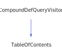

<h1>TableOfContents</h1>

<a href="https://github.com/CharlesCarley/MdDox#~">~</a>
<a href="index.md#index">MdDox</a>
/
<a href="a01838.md#mddox">MdDox</a>
::
<b>TableOfContents</b>
 
 

<h4>Derived From</h4>

<a href="a02159.md#compounddefqueryvisitor">MdDox::Doxygen::Visitors::CompoundDefQueryVisitor</a>

 

<h2>Public Members</h2>
<a href="#hasclasses" class="icon-list-item">hasClasses
</a>

 
<a href="#hasenums" class="icon-list-item">hasEnums
</a>

 
<a href="#hasfunctions" class="icon-list-item">hasFunctions
</a>

 
<a href="#hasnamespaces" class="icon-list-item">hasNamespaces
</a>

 
<a href="#hastypes" class="icon-list-item">hasTypes
</a>

 
<a href="#hasvariables" class="icon-list-item">hasVariables
</a>

 

<h2>Public Methods</h2>
<a href="#hasany" class="icon-list-item">hasAny
</a>

 
<a href="#visitedinnerclass" class="icon-list-item">visitedInnerClass
</a>

 
<a href="#visitedinnernamespace" class="icon-list-item">visitedInnerNamespace
</a>

 
<a href="#visitedsectiondef" class="icon-list-item">visitedSectionDef
</a>

 

<h4>Defined in</h4>
<a href="https://github.com/CharlesCarley/MdDox/blob/master/Source/MdDoxTree/NamespacePageWriter.cpp#L38" class="icon-list-item">NamespacePageWriter.cpp
</a>

 
<a href="#tableofcontents" class="icon-list-item">top
</a>

<h2>hasClasses</h2>
bool
<b>hasClasses</b>
 

<h4>Defined in</h4>
<a href="https://github.com/CharlesCarley/MdDox/blob/master/Source/MdDoxTree/NamespacePageWriter.cpp#L41" class="icon-list-item">NamespacePageWriter.cpp
</a>

 
<a href="#tableofcontents" class="icon-list-item">top
</a>

 

<h2>hasEnums</h2>
bool
<b>hasEnums</b>
 

<h4>Defined in</h4>
<a href="https://github.com/CharlesCarley/MdDox/blob/master/Source/MdDoxTree/NamespacePageWriter.cpp#L42" class="icon-list-item">NamespacePageWriter.cpp
</a>

 
<a href="#tableofcontents" class="icon-list-item">top
</a>

 

<h2>hasFunctions</h2>
bool
<b>hasFunctions</b>
 

<h4>Defined in</h4>
<a href="https://github.com/CharlesCarley/MdDox/blob/master/Source/MdDoxTree/NamespacePageWriter.cpp#L45" class="icon-list-item">NamespacePageWriter.cpp
</a>

 
<a href="#tableofcontents" class="icon-list-item">top
</a>

 

<h2>hasNamespaces</h2>
bool
<b>hasNamespaces</b>
 

<h4>Defined in</h4>
<a href="https://github.com/CharlesCarley/MdDox/blob/master/Source/MdDoxTree/NamespacePageWriter.cpp#L40" class="icon-list-item">NamespacePageWriter.cpp
</a>

 
<a href="#tableofcontents" class="icon-list-item">top
</a>

 

<h2>hasTypes</h2>
bool
<b>hasTypes</b>
 

<h4>Defined in</h4>
<a href="https://github.com/CharlesCarley/MdDox/blob/master/Source/MdDoxTree/NamespacePageWriter.cpp#L43" class="icon-list-item">NamespacePageWriter.cpp
</a>

 
<a href="#tableofcontents" class="icon-list-item">top
</a>

 

<h2>hasVariables</h2>
bool
<b>hasVariables</b>
 

<h4>Defined in</h4>
<a href="https://github.com/CharlesCarley/MdDox/blob/master/Source/MdDoxTree/NamespacePageWriter.cpp#L44" class="icon-list-item">NamespacePageWriter.cpp
</a>

 
<a href="#tableofcontents" class="icon-list-item">top
</a>

 

<h2>hasAny</h2>
bool
<b>hasAny</b>
<i>(</i>
<i>)</i>

<h4>References</h4>

<a href="a01947.md#hasnamespaces">hasNamespaces</a>

<a href="a01947.md#hasclasses">hasClasses</a>

<a href="a01947.md#hasenums">hasEnums</a>

<a href="a01947.md#hastypes">hasTypes</a>

<a href="a01947.md#hasvariables">hasVariables</a>

<a href="a01947.md#hasfunctions">hasFunctions</a>

<h4>Defined in</h4>
<a href="https://github.com/CharlesCarley/MdDox/blob/master/Source/MdDoxTree/NamespacePageWriter.cpp#L48" class="icon-list-item">NamespacePageWriter.cpp
</a>

 
<a href="#tableofcontents" class="icon-list-item">top
</a>

 

<h2>visitedInnerClass</h2>
void
<b>visitedInnerClass</b>
<i>(</i>

const 
<a href="a02555.md#refquery">Doxygen::RefQuery</a>
 &amp;
query

<i>)</i>
 
 
Called when the element 
<b>innerclass</b>
 is found. 
 
 
<ul>
<li><i>query</i>
: 
Const reference to the RefQuery class. 
</li>
</ul>

<h4>References</h4>

<a href="a01947.md#hasclasses">hasClasses</a>

<h4>Defined in</h4>
<a href="https://github.com/CharlesCarley/MdDox/blob/master/Source/MdDoxTree/NamespacePageWriter.cpp#L58" class="icon-list-item">NamespacePageWriter.cpp
</a>

 
<a href="#tableofcontents" class="icon-list-item">top
</a>

 

<h2>visitedInnerNamespace</h2>
void
<b>visitedInnerNamespace</b>
<i>(</i>

const 
<a href="a02555.md#refquery">Doxygen::RefQuery</a>
 &amp;
query

<i>)</i>
 
 
Called when the element 
<b>innernamespace</b>
 is found. 
 
 
<ul>
<li><i>query</i>
: 
Const reference to the RefQuery class. 
</li>
</ul>

<h4>References</h4>

<a href="a01947.md#hasnamespaces">hasNamespaces</a>

<h4>Defined in</h4>
<a href="https://github.com/CharlesCarley/MdDox/blob/master/Source/MdDoxTree/NamespacePageWriter.cpp#L53" class="icon-list-item">NamespacePageWriter.cpp
</a>

 
<a href="#tableofcontents" class="icon-list-item">top
</a>

 

<h2>visitedSectionDef</h2>
void
<b>visitedSectionDef</b>
<i>(</i>

const 
<a href="a02611.md#sectiondefquery">Doxygen::SectionDefQuery</a>
 &amp;
query

<i>)</i>
 
 
Called when the element 
<b>sectiondef</b>
 is found. 
 
 
<ul>
<li><i>query</i>
: 
Const reference to the SectionDefQuery class. 
</li>
</ul>

<h4>References</h4>

<a href="a02611.md#getkind">getKind</a>

<a href="a01843.md#dsk_enum">DSK_ENUM</a>

<a href="a01947.md#hasenums">hasEnums</a>

<a href="a01843.md#dsk_var">DSK_VAR</a>

<a href="a01947.md#hasvariables">hasVariables</a>

<a href="a01843.md#dsk_func">DSK_FUNC</a>

<a href="a01947.md#hasfunctions">hasFunctions</a>

<a href="a01843.md#dsk_typedef">DSK_TYPEDEF</a>

<a href="a01947.md#hastypes">hasTypes</a>

<a href="a01843.md#dsk_define">DSK_DEFINE</a>

<a href="a01843.md#dsk_private_func">DSK_PRIVATE_FUNC</a>

<a href="a01843.md#dsk_package_func">DSK_PACKAGE_FUNC</a>

<a href="a01843.md#dsk_public_static_func">DSK_PUBLIC_STATIC_FUNC</a>

<a href="a01843.md#dsk_private_static_func">DSK_PRIVATE_STATIC_FUNC</a>

<a href="a01843.md#dsk_protected_func">DSK_PROTECTED_FUNC</a>

<a href="a01843.md#dsk_package_static_func">DSK_PACKAGE_STATIC_FUNC</a>

<a href="a01843.md#dsk_public_func">DSK_PUBLIC_FUNC</a>

<a href="a01843.md#dsk_dcop_func">DSK_DCOP_FUNC</a>

<a href="a01843.md#dsk_package_type">DSK_PACKAGE_TYPE</a>

<a href="a01843.md#dsk_protected_type">DSK_PROTECTED_TYPE</a>

<a href="a01843.md#dsk_protected_static_func">DSK_PROTECTED_STATIC_FUNC</a>

<a href="a01843.md#dsk_user_defined">DSK_USER_DEFINED</a>

<a href="a01843.md#dsk_private_type">DSK_PRIVATE_TYPE</a>

<a href="a01843.md#dsk_public_type">DSK_PUBLIC_TYPE</a>

<a href="a01843.md#dsk_protected_slot">DSK_PROTECTED_SLOT</a>

<a href="a01843.md#dsk_private_slot">DSK_PRIVATE_SLOT</a>

<a href="a01843.md#dsk_public_slot">DSK_PUBLIC_SLOT</a>

<a href="a01843.md#dsk_signal">DSK_SIGNAL</a>

<a href="a01843.md#dsk_event">DSK_EVENT</a>

<a href="a01843.md#dsk_property">DSK_PROPERTY</a>

<a href="a01843.md#dsk_package_static_attrib">DSK_PACKAGE_STATIC_ATTRIB</a>

<a href="a01843.md#dsk_public_attrib">DSK_PUBLIC_ATTRIB</a>

<a href="a01843.md#dsk_package_attrib">DSK_PACKAGE_ATTRIB</a>

<a href="a01843.md#dsk_private_attrib">DSK_PRIVATE_ATTRIB</a>

<a href="a01843.md#dsk_private_static_attrib">DSK_PRIVATE_STATIC_ATTRIB</a>

<a href="a01843.md#dsk_public_static_attrib">DSK_PUBLIC_STATIC_ATTRIB</a>

<a href="a01843.md#dsk_related">DSK_RELATED</a>

<a href="a01843.md#dsk_protected_static_attrib">DSK_PROTECTED_STATIC_ATTRIB</a>

<a href="a01843.md#dsk_protected_attrib">DSK_PROTECTED_ATTRIB</a>

<a href="a01843.md#dsk_friend">DSK_FRIEND</a>

<a href="a01843.md#dsk_prototype">DSK_PROTOTYPE</a>

<a href="a01843.md#dsk_invalid">DSK_INVALID</a>

<a href="a01843.md#dsk_max">DSK_MAX</a>

<h4>Defined in</h4>
<a href="https://github.com/CharlesCarley/MdDox/blob/master/Source/MdDoxTree/NamespacePageWriter.cpp#L63" class="icon-list-item">NamespacePageWriter.cpp
</a>

 
<a href="#tableofcontents" class="icon-list-item">top
</a>

 

</body>
</html>
