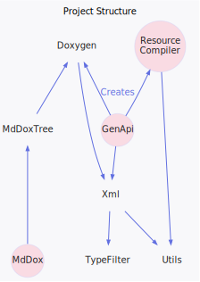

<h1>Project Structure</h1>

<a href="https://github.com/CharlesCarley/MdDox#~">~</a>
<a href="index.md#index">MdDox</a>
/
<b>MD001</b>
 
 
Illustrates the project&apos;s library and executable dependency structure.

<h2>Project Structure</h2>
The following diagram shows the overall library and executable dependency structure. 
 
 
 
 
 

<h3>Markdown Doxygen</h3>
<a href="a01003.md#application">MdDox::Application</a>
 Application is the entry point of this project.

<h3>GenApi</h3>
<a href="a01859.md#application">MdDox::GenApi::Application</a>
 Provides the entry point for the GenApi executable. 

</body>
</html>
