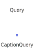

<a id="captionquery"></a>
<h1>CaptionQuery</h1>
<a id="a02143"></a>
<a href="https://github.com/CharlesCarley/MdDox#~">~</a>
<a href="index.md#index">MdDox</a>
<span class="inline-text">/</span>
<a href="a01838.md#mddox">MdDox</a>
<span class="inline-text">::</span>
<a href="a01843.md#doxygen">Doxygen</a>
<span class="inline-text">::</span>
<span class="bold-text"><b>CaptionQuery</b></span>
<br/>
<br/>
<span class="inline-text">Implements the </span>
<code class="typewriter">docCaptionType</code>
<span class="inline-text"> scaffolding. </span>
<br/>
<br/>
<span class="inline-text">The following xml provides the source for the </span>
<span class="bold-text"><b>docCaptionType</b></span>
<span class="inline-text"> scaffolding. </span>
<br/>
<br/>

```xml
<xsd:complexType name="docCaptionType" mixed="true">
  <xsd:group ref="docTitleCmdGroup" minOccurs="0" maxOccurs="unbounded"/>
</xsd:complexType>
```
<br/>
<a id="derived-from"></a>
<h4>Derived From</h4>
<div class="icon-link">
<a href="a02267.md#query">MdDox::Doxygen::Query</a>
</div>
<br/>
<a id="public-methods"></a>
<h2>Public Methods</h2>
<span class="icon-list-item"><a href="#captionquery" class="icon-list-item"><span class="icon-list-item">CaptionQuery</span>
</a>
</span>
<br/>
<span class="icon-list-item"><a href="#captionquery" class="icon-list-item"><span class="icon-list-item">CaptionQuery</span>
</a>
</span>
<br/>
<span class="icon-list-item"><a href="#captionquery" class="icon-list-item"><span class="icon-list-item">CaptionQuery</span>
</a>
</span>
<br/>
<span class="icon-list-item"><a href="#getanchor" class="icon-list-item"><span class="icon-list-item">getAnchor</span>
</a>
</span>
<br/>
<span class="icon-list-item"><a href="#getanchor" class="icon-list-item"><span class="icon-list-item">getAnchor</span>
</a>
</span>
<br/>
<span class="icon-list-item"><a href="#getbold" class="icon-list-item"><span class="icon-list-item">getBold</span>
</a>
</span>
<br/>
<span class="icon-list-item"><a href="#getbold" class="icon-list-item"><span class="icon-list-item">getBold</span>
</a>
</span>
<br/>
<span class="icon-list-item"><a href="#getcenter" class="icon-list-item"><span class="icon-list-item">getCenter</span>
</a>
</span>
<br/>
<span class="icon-list-item"><a href="#getcenter" class="icon-list-item"><span class="icon-list-item">getCenter</span>
</a>
</span>
<br/>
<span class="icon-list-item"><a href="#getcomputeroutput" class="icon-list-item"><span class="icon-list-item">getComputerOutput</span>
</a>
</span>
<br/>
<span class="icon-list-item"><a href="#getcomputeroutput" class="icon-list-item"><span class="icon-list-item">getComputerOutput</span>
</a>
</span>
<br/>
<span class="icon-list-item"><a href="#getdot" class="icon-list-item"><span class="icon-list-item">getDot</span>
</a>
</span>
<br/>
<span class="icon-list-item"><a href="#getemphasis" class="icon-list-item"><span class="icon-list-item">getEmphasis</span>
</a>
</span>
<br/>
<span class="icon-list-item"><a href="#getemphasis" class="icon-list-item"><span class="icon-list-item">getEmphasis</span>
</a>
</span>
<br/>
<span class="icon-list-item"><a href="#getlang" class="icon-list-item"><span class="icon-list-item">getLang</span>
</a>
</span>
<br/>
<span class="icon-list-item"><a href="#getlang" class="icon-list-item"><span class="icon-list-item">getLang</span>
</a>
</span>
<br/>
<span class="icon-list-item"><a href="#getparagraph" class="icon-list-item"><span class="icon-list-item">getParagraph</span>
</a>
</span>
<br/>
<span class="icon-list-item"><a href="#getparagraph" class="icon-list-item"><span class="icon-list-item">getParagraph</span>
</a>
</span>
<br/>
<span class="icon-list-item"><a href="#getpart" class="icon-list-item"><span class="icon-list-item">getPart</span>
</a>
</span>
<br/>
<span class="icon-list-item"><a href="#getpart" class="icon-list-item"><span class="icon-list-item">getPart</span>
</a>
</span>
<br/>
<span class="icon-list-item"><a href="#getprop" class="icon-list-item"><span class="icon-list-item">getProp</span>
</a>
</span>
<br/>
<span class="icon-list-item"><a href="#getprop" class="icon-list-item"><span class="icon-list-item">getProp</span>
</a>
</span>
<br/>
<span class="icon-list-item"><a href="#getref" class="icon-list-item"><span class="icon-list-item">getRef</span>
</a>
</span>
<br/>
<span class="icon-list-item"><a href="#getref" class="icon-list-item"><span class="icon-list-item">getRef</span>
</a>
</span>
<br/>
<span class="icon-list-item"><a href="#getregistered" class="icon-list-item"><span class="icon-list-item">getRegistered</span>
</a>
</span>
<br/>
<span class="icon-list-item"><a href="#getregistered" class="icon-list-item"><span class="icon-list-item">getRegistered</span>
</a>
</span>
<br/>
<span class="icon-list-item"><a href="#getsect" class="icon-list-item"><span class="icon-list-item">getSect</span>
</a>
</span>
<br/>
<span class="icon-list-item"><a href="#getsect" class="icon-list-item"><span class="icon-list-item">getSect</span>
</a>
</span>
<br/>
<span class="icon-list-item"><a href="#getsmall" class="icon-list-item"><span class="icon-list-item">getSmall</span>
</a>
</span>
<br/>
<span class="icon-list-item"><a href="#getsmall" class="icon-list-item"><span class="icon-list-item">getSmall</span>
</a>
</span>
<br/>
<span class="icon-list-item"><a href="#getulink" class="icon-list-item"><span class="icon-list-item">getULink</span>
</a>
</span>
<br/>
<span class="icon-list-item"><a href="#getulink" class="icon-list-item"><span class="icon-list-item">getULink</span>
</a>
</span>
<br/>
<span class="icon-list-item"><a href="#visit" class="icon-list-item"><span class="icon-list-item">visit</span>
</a>
</span>
<br/>
<a id="defined-in"></a>
<h4>Defined in</h4>
<span class="icon-list-item"><a href="https://github.com/CharlesCarley/MdDox/blob/master/Tools/Doxygen/CaptionQuery.h#L130" class="icon-list-item"><span class="icon-list-item">CaptionQuery.h</span>
</a>
</span>
<br/>
<span class="icon-list-item"><a href="#captionquery" class="icon-list-item"><span class="icon-list-item">top</span>
</a>
</span>
<a id="captionquery"></a>
<h2>CaptionQuery</h2>
<span class="bold-text"><b>CaptionQuery</b></span>
<span class="italic-text"><i>(</i></span>
<span class="italic-text"><i>)</i></span>
<a id="defined-in"></a>
<h4>Defined in</h4>
<span class="icon-list-item"><a href="https://github.com/CharlesCarley/MdDox/blob/master/Tools/Doxygen/CaptionQuery.h#L132" class="icon-list-item"><span class="icon-list-item">CaptionQuery.h</span>
</a>
</span>
<br/>
<span class="icon-list-item"><a href="#captionquery" class="icon-list-item"><span class="icon-list-item">top</span>
</a>
</span>
<br/>
<a id="captionquery"></a>
<h2>CaptionQuery</h2>
<span class="bold-text"><b>CaptionQuery</b></span>
<span class="italic-text"><i>(</i></span>
<div class="paragraph">
<span class="paragraph"><span class="inline-text">const </span>
<a href="a02143.md#captionquery">CaptionQuery</a>
<span class="inline-text"> &amp;</span>
<span class="inline-text">other</span>
</span>
</div>
<span class="italic-text"><i>)</i></span>
<a id="defined-in"></a>
<h4>Defined in</h4>
<span class="icon-list-item"><a href="https://github.com/CharlesCarley/MdDox/blob/master/Tools/Doxygen/CaptionQuery.h#L133" class="icon-list-item"><span class="icon-list-item">CaptionQuery.h</span>
</a>
</span>
<br/>
<span class="icon-list-item"><a href="#captionquery" class="icon-list-item"><span class="icon-list-item">top</span>
</a>
</span>
<br/>
<a id="captionquery"></a>
<h2>CaptionQuery</h2>
<span class="bold-text"><b>CaptionQuery</b></span>
<span class="italic-text"><i>(</i></span>
<div class="paragraph">
<span class="paragraph"><a href="a02111.md#node">Xml::Node</a>
<span class="inline-text"> *</span>
<span class="inline-text">node</span>
</span>
</div>
<span class="italic-text"><i>)</i></span>
<a id="defined-in"></a>
<h4>Defined in</h4>
<span class="icon-list-item"><a href="https://github.com/CharlesCarley/MdDox/blob/master/Tools/Doxygen/CaptionQuery.h#L135" class="icon-list-item"><span class="icon-list-item">CaptionQuery.h</span>
</a>
</span>
<br/>
<span class="icon-list-item"><a href="#captionquery" class="icon-list-item"><span class="icon-list-item">top</span>
</a>
</span>
<br/>
<a id="getanchor"></a>
<h2>getAnchor</h2>
<span class="inline-text">void</span>
<span class="bold-text"><b>getAnchor</b></span>
<span class="italic-text"><i>(</i></span>
<div class="paragraph">
<span class="paragraph"><a href="a02127.md#anchorquery">AnchorQuery</a>
<span class="inline-text"> &amp;</span>
<span class="inline-text">dest</span>
</span>
</div>
<span class="italic-text"><i>)</i></span>
<br/>
<br/>
<span class="inline-text">Provides access to the </span>
<span class="bold-text"><b>anchor</b></span>
<span class="inline-text"> attribute. </span>
<br/>
<a id="references"></a>
<h4>References</h4>
<div class="paragraph">
<span class="paragraph"><a href="a02267.md#_node">_node</a>
</span>
</div>
<div class="paragraph">
<span class="paragraph"><a href="a02267.md#node">node</a>
</span>
</div>
<div class="paragraph">
<span class="paragraph"><a href="a02111.md#firstchildof">firstChildOf</a>
</span>
</div>
<div class="paragraph">
<span class="paragraph"><a href="a02267.md#reset">reset</a>
</span>
</div>
<a id="defined-in"></a>
<h4>Defined in</h4>
<span class="icon-list-item"><a href="https://github.com/CharlesCarley/MdDox/blob/master/Tools/Doxygen/CaptionQuery.h#L211" class="icon-list-item"><span class="icon-list-item">CaptionQuery.h</span>
</a>
</span>
<br/>
<span class="icon-list-item"><a href="https://github.com/CharlesCarley/MdDox/blob/master/Tools/Doxygen/CaptionQuery.cpp#L213" class="icon-list-item"><span class="icon-list-item">CaptionQuery.cpp</span>
</a>
</span>
<br/>
<span class="icon-list-item"><a href="#captionquery" class="icon-list-item"><span class="icon-list-item">top</span>
</a>
</span>
<br/>
<a id="getanchor"></a>
<h2>getAnchor</h2>
<a href="a02127.md#anchorquery">AnchorQuery</a>
<span class="bold-text"><b>getAnchor</b></span>
<span class="italic-text"><i>(</i></span>
<span class="italic-text"><i>)</i></span>
<br/>
<br/>
<span class="inline-text">Provides access to the </span>
<span class="bold-text"><b>anchor</b></span>
<span class="inline-text"> attribute. </span>
<br/>
<a id="defined-in"></a>
<h4>Defined in</h4>
<span class="icon-list-item"><a href="https://github.com/CharlesCarley/MdDox/blob/master/Tools/Doxygen/CaptionQuery.h#L216" class="icon-list-item"><span class="icon-list-item">CaptionQuery.h</span>
</a>
</span>
<br/>
<span class="icon-list-item"><a href="https://github.com/CharlesCarley/MdDox/blob/master/Tools/Doxygen/CaptionQuery.cpp#L224" class="icon-list-item"><span class="icon-list-item">CaptionQuery.cpp</span>
</a>
</span>
<br/>
<span class="icon-list-item"><a href="#captionquery" class="icon-list-item"><span class="icon-list-item">top</span>
</a>
</span>
<br/>
<a id="getbold"></a>
<h2>getBold</h2>
<span class="inline-text">void</span>
<span class="bold-text"><b>getBold</b></span>
<span class="italic-text"><i>(</i></span>
<div class="paragraph">
<span class="paragraph"><a href="a02459.md#markupquery">MarkupQuery</a>
<span class="inline-text"> &amp;</span>
<span class="inline-text">dest</span>
</span>
</div>
<span class="italic-text"><i>)</i></span>
<br/>
<br/>
<span class="inline-text">Provides access to the </span>
<span class="bold-text"><b>bold</b></span>
<span class="inline-text"> attribute. </span>
<br/>
<a id="references"></a>
<h4>References</h4>
<div class="paragraph">
<span class="paragraph"><a href="a02267.md#_node">_node</a>
</span>
</div>
<div class="paragraph">
<span class="paragraph"><a href="a02267.md#node">node</a>
</span>
</div>
<div class="paragraph">
<span class="paragraph"><a href="a02111.md#firstchildof">firstChildOf</a>
</span>
</div>
<div class="paragraph">
<span class="paragraph"><a href="a02267.md#reset">reset</a>
</span>
</div>
<a id="defined-in"></a>
<h4>Defined in</h4>
<span class="icon-list-item"><a href="https://github.com/CharlesCarley/MdDox/blob/master/Tools/Doxygen/CaptionQuery.h#L161" class="icon-list-item"><span class="icon-list-item">CaptionQuery.h</span>
</a>
</span>
<br/>
<span class="icon-list-item"><a href="https://github.com/CharlesCarley/MdDox/blob/master/Tools/Doxygen/CaptionQuery.cpp#L123" class="icon-list-item"><span class="icon-list-item">CaptionQuery.cpp</span>
</a>
</span>
<br/>
<span class="icon-list-item"><a href="#captionquery" class="icon-list-item"><span class="icon-list-item">top</span>
</a>
</span>
<br/>
<a id="getbold"></a>
<h2>getBold</h2>
<a href="a02459.md#markupquery">MarkupQuery</a>
<span class="bold-text"><b>getBold</b></span>
<span class="italic-text"><i>(</i></span>
<span class="italic-text"><i>)</i></span>
<br/>
<br/>
<span class="inline-text">Provides access to the </span>
<span class="bold-text"><b>bold</b></span>
<span class="inline-text"> attribute. </span>
<br/>
<a id="defined-in"></a>
<h4>Defined in</h4>
<span class="icon-list-item"><a href="https://github.com/CharlesCarley/MdDox/blob/master/Tools/Doxygen/CaptionQuery.h#L166" class="icon-list-item"><span class="icon-list-item">CaptionQuery.h</span>
</a>
</span>
<br/>
<span class="icon-list-item"><a href="https://github.com/CharlesCarley/MdDox/blob/master/Tools/Doxygen/CaptionQuery.cpp#L134" class="icon-list-item"><span class="icon-list-item">CaptionQuery.cpp</span>
</a>
</span>
<br/>
<span class="icon-list-item"><a href="#captionquery" class="icon-list-item"><span class="icon-list-item">top</span>
</a>
</span>
<br/>
<a id="getcenter"></a>
<h2>getCenter</h2>
<span class="inline-text">void</span>
<span class="bold-text"><b>getCenter</b></span>
<span class="italic-text"><i>(</i></span>
<div class="paragraph">
<span class="paragraph"><a href="a02459.md#markupquery">MarkupQuery</a>
<span class="inline-text"> &amp;</span>
<span class="inline-text">dest</span>
</span>
</div>
<span class="italic-text"><i>)</i></span>
<br/>
<br/>
<span class="inline-text">Provides access to the </span>
<span class="bold-text"><b>center</b></span>
<span class="inline-text"> attribute. </span>
<br/>
<a id="references"></a>
<h4>References</h4>
<div class="paragraph">
<span class="paragraph"><a href="a02267.md#_node">_node</a>
</span>
</div>
<div class="paragraph">
<span class="paragraph"><a href="a02267.md#node">node</a>
</span>
</div>
<div class="paragraph">
<span class="paragraph"><a href="a02111.md#firstchildof">firstChildOf</a>
</span>
</div>
<div class="paragraph">
<span class="paragraph"><a href="a02267.md#reset">reset</a>
</span>
</div>
<a id="defined-in"></a>
<h4>Defined in</h4>
<span class="icon-list-item"><a href="https://github.com/CharlesCarley/MdDox/blob/master/Tools/Doxygen/CaptionQuery.h#L191" class="icon-list-item"><span class="icon-list-item">CaptionQuery.h</span>
</a>
</span>
<br/>
<span class="icon-list-item"><a href="https://github.com/CharlesCarley/MdDox/blob/master/Tools/Doxygen/CaptionQuery.cpp#L177" class="icon-list-item"><span class="icon-list-item">CaptionQuery.cpp</span>
</a>
</span>
<br/>
<span class="icon-list-item"><a href="#captionquery" class="icon-list-item"><span class="icon-list-item">top</span>
</a>
</span>
<br/>
<a id="getcenter"></a>
<h2>getCenter</h2>
<a href="a02459.md#markupquery">MarkupQuery</a>
<span class="bold-text"><b>getCenter</b></span>
<span class="italic-text"><i>(</i></span>
<span class="italic-text"><i>)</i></span>
<br/>
<br/>
<span class="inline-text">Provides access to the </span>
<span class="bold-text"><b>center</b></span>
<span class="inline-text"> attribute. </span>
<br/>
<a id="defined-in"></a>
<h4>Defined in</h4>
<span class="icon-list-item"><a href="https://github.com/CharlesCarley/MdDox/blob/master/Tools/Doxygen/CaptionQuery.h#L196" class="icon-list-item"><span class="icon-list-item">CaptionQuery.h</span>
</a>
</span>
<br/>
<span class="icon-list-item"><a href="https://github.com/CharlesCarley/MdDox/blob/master/Tools/Doxygen/CaptionQuery.cpp#L188" class="icon-list-item"><span class="icon-list-item">CaptionQuery.cpp</span>
</a>
</span>
<br/>
<span class="icon-list-item"><a href="#captionquery" class="icon-list-item"><span class="icon-list-item">top</span>
</a>
</span>
<br/>
<a id="getcomputeroutput"></a>
<h2>getComputerOutput</h2>
<span class="inline-text">void</span>
<span class="bold-text"><b>getComputerOutput</b></span>
<span class="italic-text"><i>(</i></span>
<div class="paragraph">
<span class="paragraph"><a href="a02459.md#markupquery">MarkupQuery</a>
<span class="inline-text"> &amp;</span>
<span class="inline-text">dest</span>
</span>
</div>
<span class="italic-text"><i>)</i></span>
<br/>
<br/>
<span class="inline-text">Provides access to the </span>
<span class="bold-text"><b>computeroutput</b></span>
<span class="inline-text"> attribute. </span>
<br/>
<a id="references"></a>
<h4>References</h4>
<div class="paragraph">
<span class="paragraph"><a href="a02267.md#_node">_node</a>
</span>
</div>
<div class="paragraph">
<span class="paragraph"><a href="a02267.md#node">node</a>
</span>
</div>
<div class="paragraph">
<span class="paragraph"><a href="a02111.md#firstchildof">firstChildOf</a>
</span>
</div>
<div class="paragraph">
<span class="paragraph"><a href="a02267.md#reset">reset</a>
</span>
</div>
<a id="defined-in"></a>
<h4>Defined in</h4>
<span class="icon-list-item"><a href="https://github.com/CharlesCarley/MdDox/blob/master/Tools/Doxygen/CaptionQuery.h#L181" class="icon-list-item"><span class="icon-list-item">CaptionQuery.h</span>
</a>
</span>
<br/>
<span class="icon-list-item"><a href="https://github.com/CharlesCarley/MdDox/blob/master/Tools/Doxygen/CaptionQuery.cpp#L159" class="icon-list-item"><span class="icon-list-item">CaptionQuery.cpp</span>
</a>
</span>
<br/>
<span class="icon-list-item"><a href="#captionquery" class="icon-list-item"><span class="icon-list-item">top</span>
</a>
</span>
<br/>
<a id="getcomputeroutput"></a>
<h2>getComputerOutput</h2>
<a href="a02459.md#markupquery">MarkupQuery</a>
<span class="bold-text"><b>getComputerOutput</b></span>
<span class="italic-text"><i>(</i></span>
<span class="italic-text"><i>)</i></span>
<br/>
<br/>
<span class="inline-text">Provides access to the </span>
<span class="bold-text"><b>computeroutput</b></span>
<span class="inline-text"> attribute. </span>
<br/>
<a id="defined-in"></a>
<h4>Defined in</h4>
<span class="icon-list-item"><a href="https://github.com/CharlesCarley/MdDox/blob/master/Tools/Doxygen/CaptionQuery.h#L186" class="icon-list-item"><span class="icon-list-item">CaptionQuery.h</span>
</a>
</span>
<br/>
<span class="icon-list-item"><a href="https://github.com/CharlesCarley/MdDox/blob/master/Tools/Doxygen/CaptionQuery.cpp#L170" class="icon-list-item"><span class="icon-list-item">CaptionQuery.cpp</span>
</a>
</span>
<br/>
<span class="icon-list-item"><a href="#captionquery" class="icon-list-item"><span class="icon-list-item">top</span>
</a>
</span>
<br/>
<a id="getdot"></a>
<h2>getDot</h2>
<span class="inline-text">const </span>
<a href="a01838.md#string">String</a>
<span class="inline-text"> &amp;</span>
<span class="bold-text"><b>getDot</b></span>
<span class="italic-text"><i>(</i></span>
<div class="paragraph">
<span class="paragraph"><span class="inline-text">const </span>
<a href="a01838.md#string">String</a>
<span class="inline-text"> &amp;</span>
<span class="inline-text">notFound</span>
<span class="inline-text"> = </span>
<span class="inline-text">&quot;&quot;</span>
</span>
</div>
<span class="italic-text"><i>)</i></span>
<br/>
<br/>
<span class="inline-text">Provides access to the </span>
<span class="bold-text"><b>dot</b></span>
<span class="inline-text"> tag&apos;s inner text. </span>
<br/>
<a id="returns"></a>
<h4>Returns</h4>
<span class="inline-text">The </span>
<span class="bold-text"><b>dot&apos;s</b></span>
<span class="inline-text"> text or the default value if the node is invalid. </span>
<br/>
<a id="references"></a>
<h4>References</h4>
<div class="paragraph">
<span class="paragraph"><a href="a02267.md#_node">_node</a>
</span>
</div>
<div class="paragraph">
<span class="paragraph"><a href="a02267.md#node">node</a>
</span>
</div>
<div class="paragraph">
<span class="paragraph"><a href="a02111.md#firstchildof">firstChildOf</a>
</span>
</div>
<div class="paragraph">
<span class="paragraph"><a href="a02111.md#text">text</a>
</span>
</div>
<a id="defined-in"></a>
<h4>Defined in</h4>
<span class="icon-list-item"><a href="https://github.com/CharlesCarley/MdDox/blob/master/Tools/Doxygen/CaptionQuery.h#L146" class="icon-list-item"><span class="icon-list-item">CaptionQuery.h</span>
</a>
</span>
<br/>
<span class="icon-list-item"><a href="https://github.com/CharlesCarley/MdDox/blob/master/Tools/Doxygen/CaptionQuery.cpp#L96" class="icon-list-item"><span class="icon-list-item">CaptionQuery.cpp</span>
</a>
</span>
<br/>
<span class="icon-list-item"><a href="#captionquery" class="icon-list-item"><span class="icon-list-item">top</span>
</a>
</span>
<br/>
<a id="getemphasis"></a>
<h2>getEmphasis</h2>
<span class="inline-text">void</span>
<span class="bold-text"><b>getEmphasis</b></span>
<span class="italic-text"><i>(</i></span>
<div class="paragraph">
<span class="paragraph"><a href="a02459.md#markupquery">MarkupQuery</a>
<span class="inline-text"> &amp;</span>
<span class="inline-text">dest</span>
</span>
</div>
<span class="italic-text"><i>)</i></span>
<br/>
<br/>
<span class="inline-text">Provides access to the </span>
<span class="bold-text"><b>emphasis</b></span>
<span class="inline-text"> attribute. </span>
<br/>
<a id="references"></a>
<h4>References</h4>
<div class="paragraph">
<span class="paragraph"><a href="a02267.md#_node">_node</a>
</span>
</div>
<div class="paragraph">
<span class="paragraph"><a href="a02267.md#node">node</a>
</span>
</div>
<div class="paragraph">
<span class="paragraph"><a href="a02111.md#firstchildof">firstChildOf</a>
</span>
</div>
<div class="paragraph">
<span class="paragraph"><a href="a02267.md#reset">reset</a>
</span>
</div>
<a id="defined-in"></a>
<h4>Defined in</h4>
<span class="icon-list-item"><a href="https://github.com/CharlesCarley/MdDox/blob/master/Tools/Doxygen/CaptionQuery.h#L171" class="icon-list-item"><span class="icon-list-item">CaptionQuery.h</span>
</a>
</span>
<br/>
<span class="icon-list-item"><a href="https://github.com/CharlesCarley/MdDox/blob/master/Tools/Doxygen/CaptionQuery.cpp#L141" class="icon-list-item"><span class="icon-list-item">CaptionQuery.cpp</span>
</a>
</span>
<br/>
<span class="icon-list-item"><a href="#captionquery" class="icon-list-item"><span class="icon-list-item">top</span>
</a>
</span>
<br/>
<a id="getemphasis"></a>
<h2>getEmphasis</h2>
<a href="a02459.md#markupquery">MarkupQuery</a>
<span class="bold-text"><b>getEmphasis</b></span>
<span class="italic-text"><i>(</i></span>
<span class="italic-text"><i>)</i></span>
<br/>
<br/>
<span class="inline-text">Provides access to the </span>
<span class="bold-text"><b>emphasis</b></span>
<span class="inline-text"> attribute. </span>
<br/>
<a id="defined-in"></a>
<h4>Defined in</h4>
<span class="icon-list-item"><a href="https://github.com/CharlesCarley/MdDox/blob/master/Tools/Doxygen/CaptionQuery.h#L176" class="icon-list-item"><span class="icon-list-item">CaptionQuery.h</span>
</a>
</span>
<br/>
<span class="icon-list-item"><a href="https://github.com/CharlesCarley/MdDox/blob/master/Tools/Doxygen/CaptionQuery.cpp#L152" class="icon-list-item"><span class="icon-list-item">CaptionQuery.cpp</span>
</a>
</span>
<br/>
<span class="icon-list-item"><a href="#captionquery" class="icon-list-item"><span class="icon-list-item">top</span>
</a>
</span>
<br/>
<a id="getlang"></a>
<h2>getLang</h2>
<span class="inline-text">void</span>
<span class="bold-text"><b>getLang</b></span>
<span class="italic-text"><i>(</i></span>
<div class="paragraph">
<span class="paragraph"><a href="a02287.md#emptyquery">EmptyQuery</a>
<span class="inline-text"> &amp;</span>
<span class="inline-text">dest</span>
</span>
</div>
<span class="italic-text"><i>)</i></span>
<br/>
<br/>
<span class="inline-text">Provides access to the </span>
<span class="bold-text"><b>lang</b></span>
<span class="inline-text"> attribute. </span>
<br/>
<a id="references"></a>
<h4>References</h4>
<div class="paragraph">
<span class="paragraph"><a href="a02267.md#_node">_node</a>
</span>
</div>
<div class="paragraph">
<span class="paragraph"><a href="a02267.md#node">node</a>
</span>
</div>
<div class="paragraph">
<span class="paragraph"><a href="a02111.md#firstchildof">firstChildOf</a>
</span>
</div>
<div class="paragraph">
<span class="paragraph"><a href="a02267.md#reset">reset</a>
</span>
</div>
<a id="defined-in"></a>
<h4>Defined in</h4>
<span class="icon-list-item"><a href="https://github.com/CharlesCarley/MdDox/blob/master/Tools/Doxygen/CaptionQuery.h#L281" class="icon-list-item"><span class="icon-list-item">CaptionQuery.h</span>
</a>
</span>
<br/>
<span class="icon-list-item"><a href="https://github.com/CharlesCarley/MdDox/blob/master/Tools/Doxygen/CaptionQuery.cpp#L339" class="icon-list-item"><span class="icon-list-item">CaptionQuery.cpp</span>
</a>
</span>
<br/>
<span class="icon-list-item"><a href="#captionquery" class="icon-list-item"><span class="icon-list-item">top</span>
</a>
</span>
<br/>
<a id="getlang"></a>
<h2>getLang</h2>
<a href="a02287.md#emptyquery">EmptyQuery</a>
<span class="bold-text"><b>getLang</b></span>
<span class="italic-text"><i>(</i></span>
<span class="italic-text"><i>)</i></span>
<br/>
<br/>
<span class="inline-text">Provides access to the </span>
<span class="bold-text"><b>lang</b></span>
<span class="inline-text"> attribute. </span>
<br/>
<a id="defined-in"></a>
<h4>Defined in</h4>
<span class="icon-list-item"><a href="https://github.com/CharlesCarley/MdDox/blob/master/Tools/Doxygen/CaptionQuery.h#L286" class="icon-list-item"><span class="icon-list-item">CaptionQuery.h</span>
</a>
</span>
<br/>
<span class="icon-list-item"><a href="https://github.com/CharlesCarley/MdDox/blob/master/Tools/Doxygen/CaptionQuery.cpp#L350" class="icon-list-item"><span class="icon-list-item">CaptionQuery.cpp</span>
</a>
</span>
<br/>
<span class="icon-list-item"><a href="#captionquery" class="icon-list-item"><span class="icon-list-item">top</span>
</a>
</span>
<br/>
<a id="getparagraph"></a>
<h2>getParagraph</h2>
<span class="inline-text">void</span>
<span class="bold-text"><b>getParagraph</b></span>
<span class="italic-text"><i>(</i></span>
<div class="paragraph">
<span class="paragraph"><a href="a02539.md#paraquery">ParaQuery</a>
<span class="inline-text"> &amp;</span>
<span class="inline-text">dest</span>
</span>
</div>
<span class="italic-text"><i>)</i></span>
<br/>
<br/>
<span class="inline-text">Provides access to the </span>
<span class="bold-text"><b>para</b></span>
<span class="inline-text"> attribute. </span>
<br/>
<a id="references"></a>
<h4>References</h4>
<div class="paragraph">
<span class="paragraph"><a href="a02267.md#_node">_node</a>
</span>
</div>
<div class="paragraph">
<span class="paragraph"><a href="a02267.md#node">node</a>
</span>
</div>
<div class="paragraph">
<span class="paragraph"><a href="a02111.md#firstchildof">firstChildOf</a>
</span>
</div>
<div class="paragraph">
<span class="paragraph"><a href="a02267.md#reset">reset</a>
</span>
</div>
<a id="defined-in"></a>
<h4>Defined in</h4>
<span class="icon-list-item"><a href="https://github.com/CharlesCarley/MdDox/blob/master/Tools/Doxygen/CaptionQuery.h#L251" class="icon-list-item"><span class="icon-list-item">CaptionQuery.h</span>
</a>
</span>
<br/>
<span class="icon-list-item"><a href="https://github.com/CharlesCarley/MdDox/blob/master/Tools/Doxygen/CaptionQuery.cpp#L285" class="icon-list-item"><span class="icon-list-item">CaptionQuery.cpp</span>
</a>
</span>
<br/>
<span class="icon-list-item"><a href="#captionquery" class="icon-list-item"><span class="icon-list-item">top</span>
</a>
</span>
<br/>
<a id="getparagraph"></a>
<h2>getParagraph</h2>
<a href="a02539.md#paraquery">ParaQuery</a>
<span class="bold-text"><b>getParagraph</b></span>
<span class="italic-text"><i>(</i></span>
<span class="italic-text"><i>)</i></span>
<br/>
<br/>
<span class="inline-text">Provides access to the </span>
<span class="bold-text"><b>para</b></span>
<span class="inline-text"> attribute. </span>
<br/>
<a id="defined-in"></a>
<h4>Defined in</h4>
<span class="icon-list-item"><a href="https://github.com/CharlesCarley/MdDox/blob/master/Tools/Doxygen/CaptionQuery.h#L256" class="icon-list-item"><span class="icon-list-item">CaptionQuery.h</span>
</a>
</span>
<br/>
<span class="icon-list-item"><a href="https://github.com/CharlesCarley/MdDox/blob/master/Tools/Doxygen/CaptionQuery.cpp#L296" class="icon-list-item"><span class="icon-list-item">CaptionQuery.cpp</span>
</a>
</span>
<br/>
<span class="icon-list-item"><a href="#captionquery" class="icon-list-item"><span class="icon-list-item">top</span>
</a>
</span>
<br/>
<a id="getpart"></a>
<h2>getPart</h2>
<span class="inline-text">void</span>
<span class="bold-text"><b>getPart</b></span>
<span class="italic-text"><i>(</i></span>
<div class="paragraph">
<span class="paragraph"><a href="a02287.md#emptyquery">EmptyQuery</a>
<span class="inline-text"> &amp;</span>
<span class="inline-text">dest</span>
</span>
</div>
<span class="italic-text"><i>)</i></span>
<br/>
<br/>
<span class="inline-text">Provides access to the </span>
<span class="bold-text"><b>part</b></span>
<span class="inline-text"> attribute. </span>
<br/>
<a id="references"></a>
<h4>References</h4>
<div class="paragraph">
<span class="paragraph"><a href="a02267.md#_node">_node</a>
</span>
</div>
<div class="paragraph">
<span class="paragraph"><a href="a02267.md#node">node</a>
</span>
</div>
<div class="paragraph">
<span class="paragraph"><a href="a02111.md#firstchildof">firstChildOf</a>
</span>
</div>
<div class="paragraph">
<span class="paragraph"><a href="a02267.md#reset">reset</a>
</span>
</div>
<a id="defined-in"></a>
<h4>Defined in</h4>
<span class="icon-list-item"><a href="https://github.com/CharlesCarley/MdDox/blob/master/Tools/Doxygen/CaptionQuery.h#L261" class="icon-list-item"><span class="icon-list-item">CaptionQuery.h</span>
</a>
</span>
<br/>
<span class="icon-list-item"><a href="https://github.com/CharlesCarley/MdDox/blob/master/Tools/Doxygen/CaptionQuery.cpp#L303" class="icon-list-item"><span class="icon-list-item">CaptionQuery.cpp</span>
</a>
</span>
<br/>
<span class="icon-list-item"><a href="#captionquery" class="icon-list-item"><span class="icon-list-item">top</span>
</a>
</span>
<br/>
<a id="getpart"></a>
<h2>getPart</h2>
<a href="a02287.md#emptyquery">EmptyQuery</a>
<span class="bold-text"><b>getPart</b></span>
<span class="italic-text"><i>(</i></span>
<span class="italic-text"><i>)</i></span>
<br/>
<br/>
<span class="inline-text">Provides access to the </span>
<span class="bold-text"><b>part</b></span>
<span class="inline-text"> attribute. </span>
<br/>
<a id="defined-in"></a>
<h4>Defined in</h4>
<span class="icon-list-item"><a href="https://github.com/CharlesCarley/MdDox/blob/master/Tools/Doxygen/CaptionQuery.h#L266" class="icon-list-item"><span class="icon-list-item">CaptionQuery.h</span>
</a>
</span>
<br/>
<span class="icon-list-item"><a href="https://github.com/CharlesCarley/MdDox/blob/master/Tools/Doxygen/CaptionQuery.cpp#L314" class="icon-list-item"><span class="icon-list-item">CaptionQuery.cpp</span>
</a>
</span>
<br/>
<span class="icon-list-item"><a href="#captionquery" class="icon-list-item"><span class="icon-list-item">top</span>
</a>
</span>
<br/>
<a id="getprop"></a>
<h2>getProp</h2>
<span class="inline-text">void</span>
<span class="bold-text"><b>getProp</b></span>
<span class="italic-text"><i>(</i></span>
<div class="paragraph">
<span class="paragraph"><a href="a02287.md#emptyquery">EmptyQuery</a>
<span class="inline-text"> &amp;</span>
<span class="inline-text">dest</span>
</span>
</div>
<span class="italic-text"><i>)</i></span>
<br/>
<br/>
<span class="inline-text">Provides access to the </span>
<span class="bold-text"><b>prop</b></span>
<span class="inline-text"> attribute. </span>
<br/>
<a id="references"></a>
<h4>References</h4>
<div class="paragraph">
<span class="paragraph"><a href="a02267.md#_node">_node</a>
</span>
</div>
<div class="paragraph">
<span class="paragraph"><a href="a02267.md#node">node</a>
</span>
</div>
<div class="paragraph">
<span class="paragraph"><a href="a02111.md#firstchildof">firstChildOf</a>
</span>
</div>
<div class="paragraph">
<span class="paragraph"><a href="a02267.md#reset">reset</a>
</span>
</div>
<a id="defined-in"></a>
<h4>Defined in</h4>
<span class="icon-list-item"><a href="https://github.com/CharlesCarley/MdDox/blob/master/Tools/Doxygen/CaptionQuery.h#L271" class="icon-list-item"><span class="icon-list-item">CaptionQuery.h</span>
</a>
</span>
<br/>
<span class="icon-list-item"><a href="https://github.com/CharlesCarley/MdDox/blob/master/Tools/Doxygen/CaptionQuery.cpp#L321" class="icon-list-item"><span class="icon-list-item">CaptionQuery.cpp</span>
</a>
</span>
<br/>
<span class="icon-list-item"><a href="#captionquery" class="icon-list-item"><span class="icon-list-item">top</span>
</a>
</span>
<br/>
<a id="getprop"></a>
<h2>getProp</h2>
<a href="a02287.md#emptyquery">EmptyQuery</a>
<span class="bold-text"><b>getProp</b></span>
<span class="italic-text"><i>(</i></span>
<span class="italic-text"><i>)</i></span>
<br/>
<br/>
<span class="inline-text">Provides access to the </span>
<span class="bold-text"><b>prop</b></span>
<span class="inline-text"> attribute. </span>
<br/>
<a id="defined-in"></a>
<h4>Defined in</h4>
<span class="icon-list-item"><a href="https://github.com/CharlesCarley/MdDox/blob/master/Tools/Doxygen/CaptionQuery.h#L276" class="icon-list-item"><span class="icon-list-item">CaptionQuery.h</span>
</a>
</span>
<br/>
<span class="icon-list-item"><a href="https://github.com/CharlesCarley/MdDox/blob/master/Tools/Doxygen/CaptionQuery.cpp#L332" class="icon-list-item"><span class="icon-list-item">CaptionQuery.cpp</span>
</a>
</span>
<br/>
<span class="icon-list-item"><a href="#captionquery" class="icon-list-item"><span class="icon-list-item">top</span>
</a>
</span>
<br/>
<a id="getref"></a>
<h2>getRef</h2>
<span class="inline-text">void</span>
<span class="bold-text"><b>getRef</b></span>
<span class="italic-text"><i>(</i></span>
<div class="paragraph">
<span class="paragraph"><a href="a02559.md#reftextquery">RefTextQuery</a>
<span class="inline-text"> &amp;</span>
<span class="inline-text">dest</span>
</span>
</div>
<span class="italic-text"><i>)</i></span>
<br/>
<br/>
<span class="inline-text">Provides access to the </span>
<span class="bold-text"><b>ref</b></span>
<span class="inline-text"> attribute. </span>
<br/>
<a id="references"></a>
<h4>References</h4>
<div class="paragraph">
<span class="paragraph"><a href="a02267.md#_node">_node</a>
</span>
</div>
<div class="paragraph">
<span class="paragraph"><a href="a02267.md#node">node</a>
</span>
</div>
<div class="paragraph">
<span class="paragraph"><a href="a02111.md#firstchildof">firstChildOf</a>
</span>
</div>
<div class="paragraph">
<span class="paragraph"><a href="a02267.md#reset">reset</a>
</span>
</div>
<a id="defined-in"></a>
<h4>Defined in</h4>
<span class="icon-list-item"><a href="https://github.com/CharlesCarley/MdDox/blob/master/Tools/Doxygen/CaptionQuery.h#L221" class="icon-list-item"><span class="icon-list-item">CaptionQuery.h</span>
</a>
</span>
<br/>
<span class="icon-list-item"><a href="https://github.com/CharlesCarley/MdDox/blob/master/Tools/Doxygen/CaptionQuery.cpp#L231" class="icon-list-item"><span class="icon-list-item">CaptionQuery.cpp</span>
</a>
</span>
<br/>
<span class="icon-list-item"><a href="#captionquery" class="icon-list-item"><span class="icon-list-item">top</span>
</a>
</span>
<br/>
<a id="getref"></a>
<h2>getRef</h2>
<a href="a02559.md#reftextquery">RefTextQuery</a>
<span class="bold-text"><b>getRef</b></span>
<span class="italic-text"><i>(</i></span>
<span class="italic-text"><i>)</i></span>
<br/>
<br/>
<span class="inline-text">Provides access to the </span>
<span class="bold-text"><b>ref</b></span>
<span class="inline-text"> attribute. </span>
<br/>
<a id="defined-in"></a>
<h4>Defined in</h4>
<span class="icon-list-item"><a href="https://github.com/CharlesCarley/MdDox/blob/master/Tools/Doxygen/CaptionQuery.h#L226" class="icon-list-item"><span class="icon-list-item">CaptionQuery.h</span>
</a>
</span>
<br/>
<span class="icon-list-item"><a href="https://github.com/CharlesCarley/MdDox/blob/master/Tools/Doxygen/CaptionQuery.cpp#L242" class="icon-list-item"><span class="icon-list-item">CaptionQuery.cpp</span>
</a>
</span>
<br/>
<span class="icon-list-item"><a href="#captionquery" class="icon-list-item"><span class="icon-list-item">top</span>
</a>
</span>
<br/>
<a id="getregistered"></a>
<h2>getRegistered</h2>
<span class="inline-text">void</span>
<span class="bold-text"><b>getRegistered</b></span>
<span class="italic-text"><i>(</i></span>
<div class="paragraph">
<span class="paragraph"><a href="a02287.md#emptyquery">EmptyQuery</a>
<span class="inline-text"> &amp;</span>
<span class="inline-text">dest</span>
</span>
</div>
<span class="italic-text"><i>)</i></span>
<br/>
<br/>
<span class="inline-text">Provides access to the </span>
<span class="bold-text"><b>registered</b></span>
<span class="inline-text"> attribute. </span>
<br/>
<a id="references"></a>
<h4>References</h4>
<div class="paragraph">
<span class="paragraph"><a href="a02267.md#_node">_node</a>
</span>
</div>
<div class="paragraph">
<span class="paragraph"><a href="a02267.md#node">node</a>
</span>
</div>
<div class="paragraph">
<span class="paragraph"><a href="a02111.md#firstchildof">firstChildOf</a>
</span>
</div>
<div class="paragraph">
<span class="paragraph"><a href="a02267.md#reset">reset</a>
</span>
</div>
<a id="defined-in"></a>
<h4>Defined in</h4>
<span class="icon-list-item"><a href="https://github.com/CharlesCarley/MdDox/blob/master/Tools/Doxygen/CaptionQuery.h#L241" class="icon-list-item"><span class="icon-list-item">CaptionQuery.h</span>
</a>
</span>
<br/>
<span class="icon-list-item"><a href="https://github.com/CharlesCarley/MdDox/blob/master/Tools/Doxygen/CaptionQuery.cpp#L267" class="icon-list-item"><span class="icon-list-item">CaptionQuery.cpp</span>
</a>
</span>
<br/>
<span class="icon-list-item"><a href="#captionquery" class="icon-list-item"><span class="icon-list-item">top</span>
</a>
</span>
<br/>
<a id="getregistered"></a>
<h2>getRegistered</h2>
<a href="a02287.md#emptyquery">EmptyQuery</a>
<span class="bold-text"><b>getRegistered</b></span>
<span class="italic-text"><i>(</i></span>
<span class="italic-text"><i>)</i></span>
<br/>
<br/>
<span class="inline-text">Provides access to the </span>
<span class="bold-text"><b>registered</b></span>
<span class="inline-text"> attribute. </span>
<br/>
<a id="defined-in"></a>
<h4>Defined in</h4>
<span class="icon-list-item"><a href="https://github.com/CharlesCarley/MdDox/blob/master/Tools/Doxygen/CaptionQuery.h#L246" class="icon-list-item"><span class="icon-list-item">CaptionQuery.h</span>
</a>
</span>
<br/>
<span class="icon-list-item"><a href="https://github.com/CharlesCarley/MdDox/blob/master/Tools/Doxygen/CaptionQuery.cpp#L278" class="icon-list-item"><span class="icon-list-item">CaptionQuery.cpp</span>
</a>
</span>
<br/>
<span class="icon-list-item"><a href="#captionquery" class="icon-list-item"><span class="icon-list-item">top</span>
</a>
</span>
<br/>
<a id="getsect"></a>
<h2>getSect</h2>
<span class="inline-text">void</span>
<span class="bold-text"><b>getSect</b></span>
<span class="italic-text"><i>(</i></span>
<div class="paragraph">
<span class="paragraph"><a href="a02287.md#emptyquery">EmptyQuery</a>
<span class="inline-text"> &amp;</span>
<span class="inline-text">dest</span>
</span>
</div>
<span class="italic-text"><i>)</i></span>
<br/>
<br/>
<span class="inline-text">Provides access to the </span>
<span class="bold-text"><b>sect</b></span>
<span class="inline-text"> attribute. </span>
<br/>
<a id="references"></a>
<h4>References</h4>
<div class="paragraph">
<span class="paragraph"><a href="a02267.md#_node">_node</a>
</span>
</div>
<div class="paragraph">
<span class="paragraph"><a href="a02267.md#node">node</a>
</span>
</div>
<div class="paragraph">
<span class="paragraph"><a href="a02111.md#firstchildof">firstChildOf</a>
</span>
</div>
<div class="paragraph">
<span class="paragraph"><a href="a02267.md#reset">reset</a>
</span>
</div>
<a id="defined-in"></a>
<h4>Defined in</h4>
<span class="icon-list-item"><a href="https://github.com/CharlesCarley/MdDox/blob/master/Tools/Doxygen/CaptionQuery.h#L231" class="icon-list-item"><span class="icon-list-item">CaptionQuery.h</span>
</a>
</span>
<br/>
<span class="icon-list-item"><a href="https://github.com/CharlesCarley/MdDox/blob/master/Tools/Doxygen/CaptionQuery.cpp#L249" class="icon-list-item"><span class="icon-list-item">CaptionQuery.cpp</span>
</a>
</span>
<br/>
<span class="icon-list-item"><a href="#captionquery" class="icon-list-item"><span class="icon-list-item">top</span>
</a>
</span>
<br/>
<a id="getsect"></a>
<h2>getSect</h2>
<a href="a02287.md#emptyquery">EmptyQuery</a>
<span class="bold-text"><b>getSect</b></span>
<span class="italic-text"><i>(</i></span>
<span class="italic-text"><i>)</i></span>
<br/>
<br/>
<span class="inline-text">Provides access to the </span>
<span class="bold-text"><b>sect</b></span>
<span class="inline-text"> attribute. </span>
<br/>
<a id="defined-in"></a>
<h4>Defined in</h4>
<span class="icon-list-item"><a href="https://github.com/CharlesCarley/MdDox/blob/master/Tools/Doxygen/CaptionQuery.h#L236" class="icon-list-item"><span class="icon-list-item">CaptionQuery.h</span>
</a>
</span>
<br/>
<span class="icon-list-item"><a href="https://github.com/CharlesCarley/MdDox/blob/master/Tools/Doxygen/CaptionQuery.cpp#L260" class="icon-list-item"><span class="icon-list-item">CaptionQuery.cpp</span>
</a>
</span>
<br/>
<span class="icon-list-item"><a href="#captionquery" class="icon-list-item"><span class="icon-list-item">top</span>
</a>
</span>
<br/>
<a id="getsmall"></a>
<h2>getSmall</h2>
<span class="inline-text">void</span>
<span class="bold-text"><b>getSmall</b></span>
<span class="italic-text"><i>(</i></span>
<div class="paragraph">
<span class="paragraph"><a href="a02459.md#markupquery">MarkupQuery</a>
<span class="inline-text"> &amp;</span>
<span class="inline-text">dest</span>
</span>
</div>
<span class="italic-text"><i>)</i></span>
<br/>
<br/>
<span class="inline-text">Provides access to the </span>
<span class="bold-text"><b>small</b></span>
<span class="inline-text"> attribute. </span>
<br/>
<a id="references"></a>
<h4>References</h4>
<div class="paragraph">
<span class="paragraph"><a href="a02267.md#_node">_node</a>
</span>
</div>
<div class="paragraph">
<span class="paragraph"><a href="a02267.md#node">node</a>
</span>
</div>
<div class="paragraph">
<span class="paragraph"><a href="a02111.md#firstchildof">firstChildOf</a>
</span>
</div>
<div class="paragraph">
<span class="paragraph"><a href="a02267.md#reset">reset</a>
</span>
</div>
<a id="defined-in"></a>
<h4>Defined in</h4>
<span class="icon-list-item"><a href="https://github.com/CharlesCarley/MdDox/blob/master/Tools/Doxygen/CaptionQuery.h#L201" class="icon-list-item"><span class="icon-list-item">CaptionQuery.h</span>
</a>
</span>
<br/>
<span class="icon-list-item"><a href="https://github.com/CharlesCarley/MdDox/blob/master/Tools/Doxygen/CaptionQuery.cpp#L195" class="icon-list-item"><span class="icon-list-item">CaptionQuery.cpp</span>
</a>
</span>
<br/>
<span class="icon-list-item"><a href="#captionquery" class="icon-list-item"><span class="icon-list-item">top</span>
</a>
</span>
<br/>
<a id="getsmall"></a>
<h2>getSmall</h2>
<a href="a02459.md#markupquery">MarkupQuery</a>
<span class="bold-text"><b>getSmall</b></span>
<span class="italic-text"><i>(</i></span>
<span class="italic-text"><i>)</i></span>
<br/>
<br/>
<span class="inline-text">Provides access to the </span>
<span class="bold-text"><b>small</b></span>
<span class="inline-text"> attribute. </span>
<br/>
<a id="defined-in"></a>
<h4>Defined in</h4>
<span class="icon-list-item"><a href="https://github.com/CharlesCarley/MdDox/blob/master/Tools/Doxygen/CaptionQuery.h#L206" class="icon-list-item"><span class="icon-list-item">CaptionQuery.h</span>
</a>
</span>
<br/>
<span class="icon-list-item"><a href="https://github.com/CharlesCarley/MdDox/blob/master/Tools/Doxygen/CaptionQuery.cpp#L206" class="icon-list-item"><span class="icon-list-item">CaptionQuery.cpp</span>
</a>
</span>
<br/>
<span class="icon-list-item"><a href="#captionquery" class="icon-list-item"><span class="icon-list-item">top</span>
</a>
</span>
<br/>
<a id="getulink"></a>
<h2>getULink</h2>
<span class="inline-text">void</span>
<span class="bold-text"><b>getULink</b></span>
<span class="italic-text"><i>(</i></span>
<div class="paragraph">
<span class="paragraph"><a href="a02671.md#urllinkquery">UrlLinkQuery</a>
<span class="inline-text"> &amp;</span>
<span class="inline-text">dest</span>
</span>
</div>
<span class="italic-text"><i>)</i></span>
<br/>
<br/>
<span class="inline-text">Provides access to the </span>
<span class="bold-text"><b>ulink</b></span>
<span class="inline-text"> attribute. </span>
<br/>
<a id="references"></a>
<h4>References</h4>
<div class="paragraph">
<span class="paragraph"><a href="a02267.md#_node">_node</a>
</span>
</div>
<div class="paragraph">
<span class="paragraph"><a href="a02267.md#node">node</a>
</span>
</div>
<div class="paragraph">
<span class="paragraph"><a href="a02111.md#firstchildof">firstChildOf</a>
</span>
</div>
<div class="paragraph">
<span class="paragraph"><a href="a02267.md#reset">reset</a>
</span>
</div>
<a id="defined-in"></a>
<h4>Defined in</h4>
<span class="icon-list-item"><a href="https://github.com/CharlesCarley/MdDox/blob/master/Tools/Doxygen/CaptionQuery.h#L151" class="icon-list-item"><span class="icon-list-item">CaptionQuery.h</span>
</a>
</span>
<br/>
<span class="icon-list-item"><a href="https://github.com/CharlesCarley/MdDox/blob/master/Tools/Doxygen/CaptionQuery.cpp#L105" class="icon-list-item"><span class="icon-list-item">CaptionQuery.cpp</span>
</a>
</span>
<br/>
<span class="icon-list-item"><a href="#captionquery" class="icon-list-item"><span class="icon-list-item">top</span>
</a>
</span>
<br/>
<a id="getulink"></a>
<h2>getULink</h2>
<a href="a02671.md#urllinkquery">UrlLinkQuery</a>
<span class="bold-text"><b>getULink</b></span>
<span class="italic-text"><i>(</i></span>
<span class="italic-text"><i>)</i></span>
<br/>
<br/>
<span class="inline-text">Provides access to the </span>
<span class="bold-text"><b>ulink</b></span>
<span class="inline-text"> attribute. </span>
<br/>
<a id="defined-in"></a>
<h4>Defined in</h4>
<span class="icon-list-item"><a href="https://github.com/CharlesCarley/MdDox/blob/master/Tools/Doxygen/CaptionQuery.h#L156" class="icon-list-item"><span class="icon-list-item">CaptionQuery.h</span>
</a>
</span>
<br/>
<span class="icon-list-item"><a href="https://github.com/CharlesCarley/MdDox/blob/master/Tools/Doxygen/CaptionQuery.cpp#L116" class="icon-list-item"><span class="icon-list-item">CaptionQuery.cpp</span>
</a>
</span>
<br/>
<span class="icon-list-item"><a href="#captionquery" class="icon-list-item"><span class="icon-list-item">top</span>
</a>
</span>
<br/>
<a id="visit"></a>
<h2>visit</h2>
<span class="inline-text">void</span>
<span class="bold-text"><b>visit</b></span>
<span class="italic-text"><i>(</i></span>
<div class="paragraph">
<span class="paragraph"><a href="a02139.md#captionqueryvisitor">Visitors::CaptionQueryVisitor</a>
<span class="inline-text"> *</span>
<span class="inline-text"> = </span>
<span class="inline-text">visitor</span>
</span>
</div>
<span class="italic-text"><i>)</i></span>
<a id="references"></a>
<h4>References</h4>
<div class="paragraph">
<span class="paragraph"><a href="a02267.md#_node">_node</a>
</span>
</div>
<div class="paragraph">
<span class="paragraph"><a href="a02111.md#children">children</a>
</span>
</div>
<div class="paragraph">
<span class="paragraph"><a href="a01843.md#doxtextnode">DoxTextNode</a>
</span>
</div>
<div class="paragraph">
<span class="paragraph"><a href="a02139.md#visitedtext">visitedText</a>
</span>
</div>
<div class="paragraph">
<span class="paragraph"><a href="a02139.md#visitedulink">visitedULink</a>
</span>
</div>
<div class="paragraph">
<span class="paragraph"><a href="a02139.md#visitedbold">visitedBold</a>
</span>
</div>
<div class="paragraph">
<span class="paragraph"><a href="a02139.md#visitedemphasis">visitedEmphasis</a>
</span>
</div>
<div class="paragraph">
<span class="paragraph"><a href="a02139.md#visitedcomputeroutput">visitedComputerOutput</a>
</span>
</div>
<div class="paragraph">
<span class="paragraph"><a href="a02139.md#visitedcenter">visitedCenter</a>
</span>
</div>
<div class="paragraph">
<span class="paragraph"><a href="a02139.md#visitedsmall">visitedSmall</a>
</span>
</div>
<div class="paragraph">
<span class="paragraph"><a href="a02139.md#visitedanchor">visitedAnchor</a>
</span>
</div>
<div class="paragraph">
<span class="paragraph"><a href="a02139.md#visitedref">visitedRef</a>
</span>
</div>
<div class="paragraph">
<span class="paragraph"><a href="a02139.md#visitedsect">visitedSect</a>
</span>
</div>
<div class="paragraph">
<span class="paragraph"><a href="a02139.md#visitedregistered">visitedRegistered</a>
</span>
</div>
<div class="paragraph">
<span class="paragraph"><a href="a02139.md#visitedparagraph">visitedParagraph</a>
</span>
</div>
<div class="paragraph">
<span class="paragraph"><a href="a02139.md#visitedpart">visitedPart</a>
</span>
</div>
<div class="paragraph">
<span class="paragraph"><a href="a02139.md#visitedprop">visitedProp</a>
</span>
</div>
<div class="paragraph">
<span class="paragraph"><a href="a02139.md#visitedlang">visitedLang</a>
</span>
</div>
<div class="paragraph">
<span class="paragraph"><a href="a02139.md#visiteddot">visitedDot</a>
</span>
</div>
<a id="defined-in"></a>
<h4>Defined in</h4>
<span class="icon-list-item"><a href="https://github.com/CharlesCarley/MdDox/blob/master/Tools/Doxygen/CaptionQuery.h#L140" class="icon-list-item"><span class="icon-list-item">CaptionQuery.h</span>
</a>
</span>
<br/>
<span class="icon-list-item"><a href="https://github.com/CharlesCarley/MdDox/blob/master/Tools/Doxygen/CaptionQuery.cpp#L34" class="icon-list-item"><span class="icon-list-item">CaptionQuery.cpp</span>
</a>
</span>
<br/>
<span class="icon-list-item"><a href="#captionquery" class="icon-list-item"><span class="icon-list-item">top</span>
</a>
</span>
<br/>
</div>
</div>
</body>
</html>
