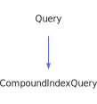

<a id="compoundindexquery"></a>
<h1>CompoundIndexQuery</h1>
<a id="a02171"></a>
<a href="https://github.com/CharlesCarley/MdDox#~">~</a>
<a href="index.md#index">MdDox</a>
<span class="inline-text">/</span>
<a href="a01838.md#mddox">MdDox</a>
<span class="inline-text">::</span>
<a href="a01843.md#doxygen">Doxygen</a>
<span class="inline-text">::</span>
<span class="bold-text"><b>CompoundIndexQuery</b></span>
<br/>
<br/>
<span class="inline-text">Implements the </span>
<code class="typewriter">CompoundIndexType</code>
<span class="inline-text"> scaffolding. </span>
<br/>
<br/>
<span class="inline-text">The following xml provides the source for the </span>
<span class="bold-text"><b>CompoundIndexType</b></span>
<span class="inline-text"> scaffolding. </span>
<br/>
<br/>

```xml
<xsd:complexType name="CompoundIndexType">
  <xsd:sequence>
    <xsd:element name="name" type="xsd:string"/>
    <xsd:element minOccurs="0" name="member" type="MemberIndexType" maxOccurs="unbounded"/>
  </xsd:sequence>
  <xsd:attribute name="refid" type="xsd:string" use="required"/>
  <xsd:attribute name="kind" type="CompoundKind" use="required"/>
</xsd:complexType>
```
<br/>
<a id="derived-from"></a>
<h4>Derived From</h4>
<div class="icon-link">
<a href="a02267.md#query">MdDox::Doxygen::Query</a>
</div>
<br/>
<a id="public-methods"></a>
<h2>Public Methods</h2>
<span class="icon-list-item"><a href="#compoundindexquery" class="icon-list-item"><span class="icon-list-item">CompoundIndexQuery</span>
</a>
</span>
<br/>
<span class="icon-list-item"><a href="#compoundindexquery" class="icon-list-item"><span class="icon-list-item">CompoundIndexQuery</span>
</a>
</span>
<br/>
<span class="icon-list-item"><a href="#compoundindexquery" class="icon-list-item"><span class="icon-list-item">CompoundIndexQuery</span>
</a>
</span>
<br/>
<span class="icon-list-item"><a href="#foreachmember" class="icon-list-item"><span class="icon-list-item">foreachMember</span>
</a>
</span>
<br/>
<span class="icon-list-item"><a href="#getkind" class="icon-list-item"><span class="icon-list-item">getKind</span>
</a>
</span>
<br/>
<span class="icon-list-item"><a href="#getname" class="icon-list-item"><span class="icon-list-item">getName</span>
</a>
</span>
<br/>
<span class="icon-list-item"><a href="#getrefid" class="icon-list-item"><span class="icon-list-item">getRefId</span>
</a>
</span>
<br/>
<span class="icon-list-item"><a href="#visit" class="icon-list-item"><span class="icon-list-item">visit</span>
</a>
</span>
<br/>
<a id="defined-in"></a>
<h4>Defined in</h4>
<span class="icon-list-item"><a href="https://github.com/CharlesCarley/MdDox/blob/master/Tools/Doxygen/CompoundIndexQuery.h#L71" class="icon-list-item"><span class="icon-list-item">CompoundIndexQuery.h</span>
</a>
</span>
<br/>
<span class="icon-list-item"><a href="#compoundindexquery" class="icon-list-item"><span class="icon-list-item">top</span>
</a>
</span>
<a id="compoundindexquery"></a>
<h2>CompoundIndexQuery</h2>
<span class="bold-text"><b>CompoundIndexQuery</b></span>
<span class="italic-text"><i>(</i></span>
<span class="italic-text"><i>)</i></span>
<a id="defined-in"></a>
<h4>Defined in</h4>
<span class="icon-list-item"><a href="https://github.com/CharlesCarley/MdDox/blob/master/Tools/Doxygen/CompoundIndexQuery.h#L73" class="icon-list-item"><span class="icon-list-item">CompoundIndexQuery.h</span>
</a>
</span>
<br/>
<span class="icon-list-item"><a href="#compoundindexquery" class="icon-list-item"><span class="icon-list-item">top</span>
</a>
</span>
<br/>
<a id="compoundindexquery"></a>
<h2>CompoundIndexQuery</h2>
<span class="bold-text"><b>CompoundIndexQuery</b></span>
<span class="italic-text"><i>(</i></span>
<div class="paragraph">
<span class="paragraph"><span class="inline-text">const </span>
<a href="a02171.md#compoundindexquery">CompoundIndexQuery</a>
<span class="inline-text"> &amp;</span>
<span class="inline-text">other</span>
</span>
</div>
<span class="italic-text"><i>)</i></span>
<a id="defined-in"></a>
<h4>Defined in</h4>
<span class="icon-list-item"><a href="https://github.com/CharlesCarley/MdDox/blob/master/Tools/Doxygen/CompoundIndexQuery.h#L74" class="icon-list-item"><span class="icon-list-item">CompoundIndexQuery.h</span>
</a>
</span>
<br/>
<span class="icon-list-item"><a href="#compoundindexquery" class="icon-list-item"><span class="icon-list-item">top</span>
</a>
</span>
<br/>
<a id="compoundindexquery"></a>
<h2>CompoundIndexQuery</h2>
<span class="bold-text"><b>CompoundIndexQuery</b></span>
<span class="italic-text"><i>(</i></span>
<div class="paragraph">
<span class="paragraph"><a href="a02111.md#node">Xml::Node</a>
<span class="inline-text"> *</span>
<span class="inline-text">node</span>
</span>
</div>
<span class="italic-text"><i>)</i></span>
<a id="defined-in"></a>
<h4>Defined in</h4>
<span class="icon-list-item"><a href="https://github.com/CharlesCarley/MdDox/blob/master/Tools/Doxygen/CompoundIndexQuery.h#L76" class="icon-list-item"><span class="icon-list-item">CompoundIndexQuery.h</span>
</a>
</span>
<br/>
<span class="icon-list-item"><a href="#compoundindexquery" class="icon-list-item"><span class="icon-list-item">top</span>
</a>
</span>
<br/>
<a id="foreachmember"></a>
<h2>foreachMember</h2>
<span class="inline-text">void</span>
<span class="bold-text"><b>foreachMember</b></span>
<span class="italic-text"><i>(</i></span>
<div class="paragraph">
<span class="paragraph"><span class="inline-text">const </span>
<a href="a01843.md#memberindexqueryfunction">MemberIndexQueryFunction</a>
<span class="inline-text"> &amp;</span>
<span class="inline-text">invoke</span>
</span>
</div>
<span class="italic-text"><i>)</i></span>
<br/>
<br/>
<span class="inline-text">Invokes the supplied callback on </span>
<span class="bold-text"><b>member</b></span>
<span class="inline-text"> elements. </span>
<br/>
<a id="references"></a>
<h4>References</h4>
<div class="paragraph">
<span class="paragraph"><a href="a02267.md#_node">_node</a>
</span>
</div>
<a id="defined-in"></a>
<h4>Defined in</h4>
<span class="icon-list-item"><a href="https://github.com/CharlesCarley/MdDox/blob/master/Tools/Doxygen/CompoundIndexQuery.h#L107" class="icon-list-item"><span class="icon-list-item">CompoundIndexQuery.h</span>
</a>
</span>
<br/>
<span class="icon-list-item"><a href="https://github.com/CharlesCarley/MdDox/blob/master/Tools/Doxygen/CompoundIndexQuery.cpp#L75" class="icon-list-item"><span class="icon-list-item">CompoundIndexQuery.cpp</span>
</a>
</span>
<br/>
<span class="icon-list-item"><a href="#compoundindexquery" class="icon-list-item"><span class="icon-list-item">top</span>
</a>
</span>
<br/>
<a id="getkind"></a>
<h2>getKind</h2>
<a href="a01843.md#doxcompoundkindenum">DoxCompoundKindEnum</a>
<span class="bold-text"><b>getKind</b></span>
<span class="italic-text"><i>(</i></span>
<span class="italic-text"><i>)</i></span>
<br/>
<br/>
<span class="inline-text">Provides access to the </span>
<span class="bold-text"><b>kind</b></span>
<span class="inline-text"> element. </span>
<br/>
<a id="returns"></a>
<h4>Returns</h4>
<span class="inline-text">The </span>
<span class="bold-text"><b>kind</b></span>
<span class="inline-text"> enumerated value or -1 if the value is not found. </span>
<br/>
<a id="references"></a>
<h4>References</h4>
<div class="paragraph">
<span class="paragraph"><a href="a02267.md#_node">_node</a>
</span>
</div>
<div class="paragraph">
<span class="paragraph"><a href="a02207.md#get">get</a>
</span>
</div>
<div class="paragraph">
<span class="paragraph"><a href="a02111.md#attribute">attribute</a>
</span>
</div>
<a id="defined-in"></a>
<h4>Defined in</h4>
<span class="icon-list-item"><a href="https://github.com/CharlesCarley/MdDox/blob/master/Tools/Doxygen/CompoundIndexQuery.h#L87" class="icon-list-item"><span class="icon-list-item">CompoundIndexQuery.h</span>
</a>
</span>
<br/>
<span class="icon-list-item"><a href="https://github.com/CharlesCarley/MdDox/blob/master/Tools/Doxygen/CompoundIndexQuery.cpp#L59" class="icon-list-item"><span class="icon-list-item">CompoundIndexQuery.cpp</span>
</a>
</span>
<br/>
<span class="icon-list-item"><a href="#compoundindexquery" class="icon-list-item"><span class="icon-list-item">top</span>
</a>
</span>
<br/>
<a id="getname"></a>
<h2>getName</h2>
<span class="inline-text">const </span>
<a href="a01838.md#string">String</a>
<span class="inline-text"> &amp;</span>
<span class="bold-text"><b>getName</b></span>
<span class="italic-text"><i>(</i></span>
<div class="paragraph">
<span class="paragraph"><span class="inline-text">const </span>
<a href="a01838.md#string">String</a>
<span class="inline-text"> &amp;</span>
<span class="inline-text">notFound</span>
<span class="inline-text"> = </span>
<span class="inline-text">&quot;&quot;</span>
</span>
</div>
<span class="italic-text"><i>)</i></span>
<br/>
<br/>
<span class="inline-text">Provides access to the </span>
<span class="bold-text"><b>name</b></span>
<span class="inline-text"> tag&apos;s inner text. </span>
<br/>
<a id="returns"></a>
<h4>Returns</h4>
<span class="inline-text">The </span>
<span class="bold-text"><b>name&apos;s</b></span>
<span class="inline-text"> text or the default value if the node is invalid. </span>
<br/>
<a id="references"></a>
<h4>References</h4>
<div class="paragraph">
<span class="paragraph"><a href="a02267.md#_node">_node</a>
</span>
</div>
<div class="paragraph">
<span class="paragraph"><a href="a02267.md#node">node</a>
</span>
</div>
<div class="paragraph">
<span class="paragraph"><a href="a02111.md#firstchildof">firstChildOf</a>
</span>
</div>
<div class="paragraph">
<span class="paragraph"><a href="a02111.md#text">text</a>
</span>
</div>
<a id="defined-in"></a>
<h4>Defined in</h4>
<span class="icon-list-item"><a href="https://github.com/CharlesCarley/MdDox/blob/master/Tools/Doxygen/CompoundIndexQuery.h#L102" class="icon-list-item"><span class="icon-list-item">CompoundIndexQuery.h</span>
</a>
</span>
<br/>
<span class="icon-list-item"><a href="https://github.com/CharlesCarley/MdDox/blob/master/Tools/Doxygen/CompoundIndexQuery.cpp#L66" class="icon-list-item"><span class="icon-list-item">CompoundIndexQuery.cpp</span>
</a>
</span>
<br/>
<span class="icon-list-item"><a href="#compoundindexquery" class="icon-list-item"><span class="icon-list-item">top</span>
</a>
</span>
<br/>
<a id="getrefid"></a>
<h2>getRefId</h2>
<span class="inline-text">const </span>
<a href="a01838.md#string">String</a>
<span class="inline-text"> &amp;</span>
<span class="bold-text"><b>getRefId</b></span>
<span class="italic-text"><i>(</i></span>
<div class="paragraph">
<span class="paragraph"><span class="inline-text">const </span>
<a href="a01838.md#string">String</a>
<span class="inline-text"> &amp;</span>
<span class="inline-text">notFound</span>
<span class="inline-text"> = </span>
<span class="inline-text">&quot;&quot;</span>
</span>
</div>
<span class="italic-text"><i>)</i></span>
<br/>
<br/>
<span class="inline-text">Provides access to the </span>
<span class="bold-text"><b>refid</b></span>
<span class="inline-text"> attribute. </span>
<br/>
<a id="returns"></a>
<h4>Returns</h4>
<span class="inline-text">The </span>
<span class="bold-text"><b>refid</b></span>
<span class="inline-text"> enumerated value or an empty string the value is not found. </span>
<br/>
<a id="references"></a>
<h4>References</h4>
<div class="paragraph">
<span class="paragraph"><a href="a02267.md#_node">_node</a>
</span>
</div>
<div class="paragraph">
<span class="paragraph"><a href="a02111.md#attribute">attribute</a>
</span>
</div>
<a id="defined-in"></a>
<h4>Defined in</h4>
<span class="icon-list-item"><a href="https://github.com/CharlesCarley/MdDox/blob/master/Tools/Doxygen/CompoundIndexQuery.h#L95" class="icon-list-item"><span class="icon-list-item">CompoundIndexQuery.h</span>
</a>
</span>
<br/>
<span class="icon-list-item"><a href="https://github.com/CharlesCarley/MdDox/blob/master/Tools/Doxygen/CompoundIndexQuery.cpp#L52" class="icon-list-item"><span class="icon-list-item">CompoundIndexQuery.cpp</span>
</a>
</span>
<br/>
<span class="icon-list-item"><a href="#compoundindexquery" class="icon-list-item"><span class="icon-list-item">top</span>
</a>
</span>
<br/>
<a id="visit"></a>
<h2>visit</h2>
<span class="inline-text">void</span>
<span class="bold-text"><b>visit</b></span>
<span class="italic-text"><i>(</i></span>
<div class="paragraph">
<span class="paragraph"><a href="a02167.md#compoundindexqueryvisitor">Visitors::CompoundIndexQueryVisitor</a>
<span class="inline-text"> *</span>
<span class="inline-text"> = </span>
<span class="inline-text">visitor</span>
</span>
</div>
<span class="italic-text"><i>)</i></span>
<a id="references"></a>
<h4>References</h4>
<div class="paragraph">
<span class="paragraph"><a href="a02267.md#_node">_node</a>
</span>
</div>
<div class="paragraph">
<span class="paragraph"><a href="a02111.md#children">children</a>
</span>
</div>
<div class="paragraph">
<span class="paragraph"><a href="a01843.md#doxtextnode">DoxTextNode</a>
</span>
</div>
<div class="paragraph">
<span class="paragraph"><a href="a02167.md#visitedtext">visitedText</a>
</span>
</div>
<div class="paragraph">
<span class="paragraph"><a href="a02167.md#visitedmember">visitedMember</a>
</span>
</div>
<div class="paragraph">
<span class="paragraph"><a href="a02167.md#visitedname">visitedName</a>
</span>
</div>
<a id="defined-in"></a>
<h4>Defined in</h4>
<span class="icon-list-item"><a href="https://github.com/CharlesCarley/MdDox/blob/master/Tools/Doxygen/CompoundIndexQuery.h#L81" class="icon-list-item"><span class="icon-list-item">CompoundIndexQuery.h</span>
</a>
</span>
<br/>
<span class="icon-list-item"><a href="https://github.com/CharlesCarley/MdDox/blob/master/Tools/Doxygen/CompoundIndexQuery.cpp#L29" class="icon-list-item"><span class="icon-list-item">CompoundIndexQuery.cpp</span>
</a>
</span>
<br/>
<span class="icon-list-item"><a href="#compoundindexquery" class="icon-list-item"><span class="icon-list-item">top</span>
</a>
</span>
<br/>
</div>
</div>
</body>
</html>
