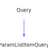

<a id="paramlistitemquery"></a>
<h1>ParamListItemQuery</h1>
<a id="a02491"></a>
<a href="https://github.com/CharlesCarley/MdDox#~">~</a>
<a href="index.md#index">MdDox</a>
<span class="inline-text">/</span>
<a href="a01838.md#mddox">MdDox</a>
<span class="inline-text">::</span>
<a href="a01843.md#doxygen">Doxygen</a>
<span class="inline-text">::</span>
<span class="bold-text"><b>ParamListItemQuery</b></span>
<br/>
<br/>
<span class="inline-text">Implements the </span>
<code class="typewriter">docParamListItem</code>
<span class="inline-text"> scaffolding. </span>
<br/>
<br/>
<span class="inline-text">The following xml provides the source for the </span>
<span class="bold-text"><b>docParamListItem</b></span>
<span class="inline-text"> scaffolding. </span>
<br/>
<br/>

```xml
<xsd:complexType name="docParamListItem">
  <xsd:sequence>
    <xsd:element minOccurs="0" name="parameternamelist" type="docParamNameList" maxOccurs="unbounded"/>
    <xsd:element name="parameterdescription" type="descriptionType"/>
  </xsd:sequence>
</xsd:complexType>
```
<br/>
<a id="derived-from"></a>
<h4>Derived From</h4>
<div class="icon-link">
<a href="a02267.md#query">MdDox::Doxygen::Query</a>
</div>
<br/>
<a id="public-methods"></a>
<h2>Public Methods</h2>
<span class="icon-list-item"><a href="#paramlistitemquery" class="icon-list-item"><span class="icon-list-item">ParamListItemQuery</span>
</a>
</span>
<br/>
<span class="icon-list-item"><a href="#paramlistitemquery" class="icon-list-item"><span class="icon-list-item">ParamListItemQuery</span>
</a>
</span>
<br/>
<span class="icon-list-item"><a href="#paramlistitemquery" class="icon-list-item"><span class="icon-list-item">ParamListItemQuery</span>
</a>
</span>
<br/>
<span class="icon-list-item"><a href="#foreachparameternamelist" class="icon-list-item"><span class="icon-list-item">foreachParameterNameList</span>
</a>
</span>
<br/>
<span class="icon-list-item"><a href="#getparameterdescription" class="icon-list-item"><span class="icon-list-item">getParameterDescription</span>
</a>
</span>
<br/>
<span class="icon-list-item"><a href="#getparameterdescription" class="icon-list-item"><span class="icon-list-item">getParameterDescription</span>
</a>
</span>
<br/>
<span class="icon-list-item"><a href="#visit" class="icon-list-item"><span class="icon-list-item">visit</span>
</a>
</span>
<br/>
<a id="defined-in"></a>
<h4>Defined in</h4>
<span class="icon-list-item"><a href="https://github.com/CharlesCarley/MdDox/blob/master/Tools/Doxygen/ParamListItemQuery.h#L68" class="icon-list-item"><span class="icon-list-item">ParamListItemQuery.h</span>
</a>
</span>
<br/>
<span class="icon-list-item"><a href="#paramlistitemquery" class="icon-list-item"><span class="icon-list-item">top</span>
</a>
</span>
<a id="paramlistitemquery"></a>
<h2>ParamListItemQuery</h2>
<span class="bold-text"><b>ParamListItemQuery</b></span>
<span class="italic-text"><i>(</i></span>
<span class="italic-text"><i>)</i></span>
<a id="defined-in"></a>
<h4>Defined in</h4>
<span class="icon-list-item"><a href="https://github.com/CharlesCarley/MdDox/blob/master/Tools/Doxygen/ParamListItemQuery.h#L70" class="icon-list-item"><span class="icon-list-item">ParamListItemQuery.h</span>
</a>
</span>
<br/>
<span class="icon-list-item"><a href="#paramlistitemquery" class="icon-list-item"><span class="icon-list-item">top</span>
</a>
</span>
<br/>
<a id="paramlistitemquery"></a>
<h2>ParamListItemQuery</h2>
<span class="bold-text"><b>ParamListItemQuery</b></span>
<span class="italic-text"><i>(</i></span>
<div class="paragraph">
<span class="paragraph"><span class="inline-text">const </span>
<a href="a02491.md#paramlistitemquery">ParamListItemQuery</a>
<span class="inline-text"> &amp;</span>
<span class="inline-text">other</span>
</span>
</div>
<span class="italic-text"><i>)</i></span>
<a id="defined-in"></a>
<h4>Defined in</h4>
<span class="icon-list-item"><a href="https://github.com/CharlesCarley/MdDox/blob/master/Tools/Doxygen/ParamListItemQuery.h#L71" class="icon-list-item"><span class="icon-list-item">ParamListItemQuery.h</span>
</a>
</span>
<br/>
<span class="icon-list-item"><a href="#paramlistitemquery" class="icon-list-item"><span class="icon-list-item">top</span>
</a>
</span>
<br/>
<a id="paramlistitemquery"></a>
<h2>ParamListItemQuery</h2>
<span class="bold-text"><b>ParamListItemQuery</b></span>
<span class="italic-text"><i>(</i></span>
<div class="paragraph">
<span class="paragraph"><a href="a02111.md#node">Xml::Node</a>
<span class="inline-text"> *</span>
<span class="inline-text">node</span>
</span>
</div>
<span class="italic-text"><i>)</i></span>
<a id="defined-in"></a>
<h4>Defined in</h4>
<span class="icon-list-item"><a href="https://github.com/CharlesCarley/MdDox/blob/master/Tools/Doxygen/ParamListItemQuery.h#L73" class="icon-list-item"><span class="icon-list-item">ParamListItemQuery.h</span>
</a>
</span>
<br/>
<span class="icon-list-item"><a href="#paramlistitemquery" class="icon-list-item"><span class="icon-list-item">top</span>
</a>
</span>
<br/>
<a id="foreachparameternamelist"></a>
<h2>foreachParameterNameList</h2>
<span class="inline-text">void</span>
<span class="bold-text"><b>foreachParameterNameList</b></span>
<span class="italic-text"><i>(</i></span>
<div class="paragraph">
<span class="paragraph"><span class="inline-text">const </span>
<a href="a01843.md#paramnamelistqueryfunction">ParamNameListQueryFunction</a>
<span class="inline-text"> &amp;</span>
<span class="inline-text">invoke</span>
</span>
</div>
<span class="italic-text"><i>)</i></span>
<br/>
<br/>
<span class="inline-text">Invokes the supplied callback on </span>
<span class="bold-text"><b>parameternamelist</b></span>
<span class="inline-text"> elements. </span>
<br/>
<a id="references"></a>
<h4>References</h4>
<div class="paragraph">
<span class="paragraph"><a href="a02267.md#_node">_node</a>
</span>
</div>
<a id="defined-in"></a>
<h4>Defined in</h4>
<span class="icon-list-item"><a href="https://github.com/CharlesCarley/MdDox/blob/master/Tools/Doxygen/ParamListItemQuery.h#L92" class="icon-list-item"><span class="icon-list-item">ParamListItemQuery.h</span>
</a>
</span>
<br/>
<span class="icon-list-item"><a href="https://github.com/CharlesCarley/MdDox/blob/master/Tools/Doxygen/ParamListItemQuery.cpp#L71" class="icon-list-item"><span class="icon-list-item">ParamListItemQuery.cpp</span>
</a>
</span>
<br/>
<span class="icon-list-item"><a href="#paramlistitemquery" class="icon-list-item"><span class="icon-list-item">top</span>
</a>
</span>
<br/>
<a id="getparameterdescription"></a>
<h2>getParameterDescription</h2>
<span class="inline-text">void</span>
<span class="bold-text"><b>getParameterDescription</b></span>
<span class="italic-text"><i>(</i></span>
<div class="paragraph">
<span class="paragraph"><a href="a02191.md#descriptionquery">DescriptionQuery</a>
<span class="inline-text"> &amp;</span>
<span class="inline-text">dest</span>
</span>
</div>
<span class="italic-text"><i>)</i></span>
<br/>
<br/>
<span class="inline-text">Provides access to the </span>
<span class="bold-text"><b>parameterdescription</b></span>
<span class="inline-text"> attribute. </span>
<br/>
<a id="references"></a>
<h4>References</h4>
<div class="paragraph">
<span class="paragraph"><a href="a02267.md#_node">_node</a>
</span>
</div>
<div class="paragraph">
<span class="paragraph"><a href="a02267.md#node">node</a>
</span>
</div>
<div class="paragraph">
<span class="paragraph"><a href="a02111.md#firstchildof">firstChildOf</a>
</span>
</div>
<div class="paragraph">
<span class="paragraph"><a href="a02267.md#reset">reset</a>
</span>
</div>
<a id="defined-in"></a>
<h4>Defined in</h4>
<span class="icon-list-item"><a href="https://github.com/CharlesCarley/MdDox/blob/master/Tools/Doxygen/ParamListItemQuery.h#L82" class="icon-list-item"><span class="icon-list-item">ParamListItemQuery.h</span>
</a>
</span>
<br/>
<span class="icon-list-item"><a href="https://github.com/CharlesCarley/MdDox/blob/master/Tools/Doxygen/ParamListItemQuery.cpp#L53" class="icon-list-item"><span class="icon-list-item">ParamListItemQuery.cpp</span>
</a>
</span>
<br/>
<span class="icon-list-item"><a href="#paramlistitemquery" class="icon-list-item"><span class="icon-list-item">top</span>
</a>
</span>
<br/>
<a id="getparameterdescription"></a>
<h2>getParameterDescription</h2>
<a href="a02191.md#descriptionquery">DescriptionQuery</a>
<span class="bold-text"><b>getParameterDescription</b></span>
<span class="italic-text"><i>(</i></span>
<span class="italic-text"><i>)</i></span>
<br/>
<br/>
<span class="inline-text">Provides access to the </span>
<span class="bold-text"><b>parameterdescription</b></span>
<span class="inline-text"> attribute. </span>
<br/>
<a id="defined-in"></a>
<h4>Defined in</h4>
<span class="icon-list-item"><a href="https://github.com/CharlesCarley/MdDox/blob/master/Tools/Doxygen/ParamListItemQuery.h#L87" class="icon-list-item"><span class="icon-list-item">ParamListItemQuery.h</span>
</a>
</span>
<br/>
<span class="icon-list-item"><a href="https://github.com/CharlesCarley/MdDox/blob/master/Tools/Doxygen/ParamListItemQuery.cpp#L64" class="icon-list-item"><span class="icon-list-item">ParamListItemQuery.cpp</span>
</a>
</span>
<br/>
<span class="icon-list-item"><a href="#paramlistitemquery" class="icon-list-item"><span class="icon-list-item">top</span>
</a>
</span>
<br/>
<a id="visit"></a>
<h2>visit</h2>
<span class="inline-text">void</span>
<span class="bold-text"><b>visit</b></span>
<span class="italic-text"><i>(</i></span>
<div class="paragraph">
<span class="paragraph"><a href="a02487.md#paramlistitemqueryvisitor">Visitors::ParamListItemQueryVisitor</a>
<span class="inline-text"> *</span>
<span class="inline-text"> = </span>
<span class="inline-text">visitor</span>
</span>
</div>
<span class="italic-text"><i>)</i></span>
<a id="references"></a>
<h4>References</h4>
<div class="paragraph">
<span class="paragraph"><a href="a02267.md#_node">_node</a>
</span>
</div>
<div class="paragraph">
<span class="paragraph"><a href="a02111.md#children">children</a>
</span>
</div>
<div class="paragraph">
<span class="paragraph"><a href="a01843.md#doxtextnode">DoxTextNode</a>
</span>
</div>
<div class="paragraph">
<span class="paragraph"><a href="a02487.md#visitedtext">visitedText</a>
</span>
</div>
<div class="paragraph">
<span class="paragraph"><a href="a02487.md#visitedparameternamelist">visitedParameterNameList</a>
</span>
</div>
<div class="paragraph">
<span class="paragraph"><a href="a02487.md#visitedparameterdescription">visitedParameterDescription</a>
</span>
</div>
<a id="defined-in"></a>
<h4>Defined in</h4>
<span class="icon-list-item"><a href="https://github.com/CharlesCarley/MdDox/blob/master/Tools/Doxygen/ParamListItemQuery.h#L78" class="icon-list-item"><span class="icon-list-item">ParamListItemQuery.h</span>
</a>
</span>
<br/>
<span class="icon-list-item"><a href="https://github.com/CharlesCarley/MdDox/blob/master/Tools/Doxygen/ParamListItemQuery.cpp#L30" class="icon-list-item"><span class="icon-list-item">ParamListItemQuery.cpp</span>
</a>
</span>
<br/>
<span class="icon-list-item"><a href="#paramlistitemquery" class="icon-list-item"><span class="icon-list-item">top</span>
</a>
</span>
<br/>
</div>
</div>
</body>
</html>
