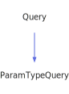

<a id="paramtypequery"></a>
<h1>ParamTypeQuery</h1>
<a id="a02531"></a>
<a href="https://github.com/CharlesCarley/MdDox#~">~</a>
<a href="index.md#index">MdDox</a>
<span class="inline-text">/</span>
<a href="a01838.md#mddox">MdDox</a>
<span class="inline-text">::</span>
<a href="a01843.md#doxygen">Doxygen</a>
<span class="inline-text">::</span>
<span class="bold-text"><b>ParamTypeQuery</b></span>
<br/>
<br/>
<span class="inline-text">Implements the </span>
<code class="typewriter">docParamType</code>
<span class="inline-text"> scaffolding. </span>
<br/>
<br/>
<span class="inline-text">The following xml provides the source for the </span>
<span class="bold-text"><b>docParamType</b></span>
<span class="inline-text"> scaffolding. </span>
<br/>
<br/>

```xml
<xsd:complexType name="docParamType" mixed="true">
  <xsd:sequence>
    <xsd:element minOccurs="0" name="ref" type="refTextType" maxOccurs="1"/>
  </xsd:sequence>
</xsd:complexType>
```
<br/>
<a id="derived-from"></a>
<h4>Derived From</h4>
<div class="icon-link">
<a href="a02267.md#query">MdDox::Doxygen::Query</a>
</div>
<br/>
<a id="public-methods"></a>
<h2>Public Methods</h2>
<span class="icon-list-item"><a href="#paramtypequery" class="icon-list-item"><span class="icon-list-item">ParamTypeQuery</span>
</a>
</span>
<br/>
<span class="icon-list-item"><a href="#paramtypequery" class="icon-list-item"><span class="icon-list-item">ParamTypeQuery</span>
</a>
</span>
<br/>
<span class="icon-list-item"><a href="#paramtypequery" class="icon-list-item"><span class="icon-list-item">ParamTypeQuery</span>
</a>
</span>
<br/>
<span class="icon-list-item"><a href="#getref" class="icon-list-item"><span class="icon-list-item">getRef</span>
</a>
</span>
<br/>
<span class="icon-list-item"><a href="#getref" class="icon-list-item"><span class="icon-list-item">getRef</span>
</a>
</span>
<br/>
<span class="icon-list-item"><a href="#visit" class="icon-list-item"><span class="icon-list-item">visit</span>
</a>
</span>
<br/>
<a id="defined-in"></a>
<h4>Defined in</h4>
<span class="icon-list-item"><a href="https://github.com/CharlesCarley/MdDox/blob/master/Tools/Doxygen/ParamTypeQuery.h#L62" class="icon-list-item"><span class="icon-list-item">ParamTypeQuery.h</span>
</a>
</span>
<br/>
<span class="icon-list-item"><a href="#paramtypequery" class="icon-list-item"><span class="icon-list-item">top</span>
</a>
</span>
<a id="paramtypequery"></a>
<h2>ParamTypeQuery</h2>
<span class="bold-text"><b>ParamTypeQuery</b></span>
<span class="italic-text"><i>(</i></span>
<span class="italic-text"><i>)</i></span>
<a id="defined-in"></a>
<h4>Defined in</h4>
<span class="icon-list-item"><a href="https://github.com/CharlesCarley/MdDox/blob/master/Tools/Doxygen/ParamTypeQuery.h#L64" class="icon-list-item"><span class="icon-list-item">ParamTypeQuery.h</span>
</a>
</span>
<br/>
<span class="icon-list-item"><a href="#paramtypequery" class="icon-list-item"><span class="icon-list-item">top</span>
</a>
</span>
<br/>
<a id="paramtypequery"></a>
<h2>ParamTypeQuery</h2>
<span class="bold-text"><b>ParamTypeQuery</b></span>
<span class="italic-text"><i>(</i></span>
<div class="paragraph">
<span class="paragraph"><span class="inline-text">const </span>
<a href="a02531.md#paramtypequery">ParamTypeQuery</a>
<span class="inline-text"> &amp;</span>
<span class="inline-text">other</span>
</span>
</div>
<span class="italic-text"><i>)</i></span>
<a id="defined-in"></a>
<h4>Defined in</h4>
<span class="icon-list-item"><a href="https://github.com/CharlesCarley/MdDox/blob/master/Tools/Doxygen/ParamTypeQuery.h#L65" class="icon-list-item"><span class="icon-list-item">ParamTypeQuery.h</span>
</a>
</span>
<br/>
<span class="icon-list-item"><a href="#paramtypequery" class="icon-list-item"><span class="icon-list-item">top</span>
</a>
</span>
<br/>
<a id="paramtypequery"></a>
<h2>ParamTypeQuery</h2>
<span class="bold-text"><b>ParamTypeQuery</b></span>
<span class="italic-text"><i>(</i></span>
<div class="paragraph">
<span class="paragraph"><a href="a02111.md#node">Xml::Node</a>
<span class="inline-text"> *</span>
<span class="inline-text">node</span>
</span>
</div>
<span class="italic-text"><i>)</i></span>
<a id="defined-in"></a>
<h4>Defined in</h4>
<span class="icon-list-item"><a href="https://github.com/CharlesCarley/MdDox/blob/master/Tools/Doxygen/ParamTypeQuery.h#L67" class="icon-list-item"><span class="icon-list-item">ParamTypeQuery.h</span>
</a>
</span>
<br/>
<span class="icon-list-item"><a href="#paramtypequery" class="icon-list-item"><span class="icon-list-item">top</span>
</a>
</span>
<br/>
<a id="getref"></a>
<h2>getRef</h2>
<span class="inline-text">void</span>
<span class="bold-text"><b>getRef</b></span>
<span class="italic-text"><i>(</i></span>
<div class="paragraph">
<span class="paragraph"><a href="a02559.md#reftextquery">RefTextQuery</a>
<span class="inline-text"> &amp;</span>
<span class="inline-text">dest</span>
</span>
</div>
<span class="italic-text"><i>)</i></span>
<br/>
<br/>
<span class="inline-text">Provides access to the </span>
<span class="bold-text"><b>ref</b></span>
<span class="inline-text"> attribute. </span>
<br/>
<a id="references"></a>
<h4>References</h4>
<div class="paragraph">
<span class="paragraph"><a href="a02267.md#_node">_node</a>
</span>
</div>
<div class="paragraph">
<span class="paragraph"><a href="a02267.md#node">node</a>
</span>
</div>
<div class="paragraph">
<span class="paragraph"><a href="a02111.md#firstchildof">firstChildOf</a>
</span>
</div>
<div class="paragraph">
<span class="paragraph"><a href="a02267.md#reset">reset</a>
</span>
</div>
<a id="defined-in"></a>
<h4>Defined in</h4>
<span class="icon-list-item"><a href="https://github.com/CharlesCarley/MdDox/blob/master/Tools/Doxygen/ParamTypeQuery.h#L76" class="icon-list-item"><span class="icon-list-item">ParamTypeQuery.h</span>
</a>
</span>
<br/>
<span class="icon-list-item"><a href="https://github.com/CharlesCarley/MdDox/blob/master/Tools/Doxygen/ParamTypeQuery.cpp#L49" class="icon-list-item"><span class="icon-list-item">ParamTypeQuery.cpp</span>
</a>
</span>
<br/>
<span class="icon-list-item"><a href="#paramtypequery" class="icon-list-item"><span class="icon-list-item">top</span>
</a>
</span>
<br/>
<a id="getref"></a>
<h2>getRef</h2>
<a href="a02559.md#reftextquery">RefTextQuery</a>
<span class="bold-text"><b>getRef</b></span>
<span class="italic-text"><i>(</i></span>
<span class="italic-text"><i>)</i></span>
<br/>
<br/>
<span class="inline-text">Provides access to the </span>
<span class="bold-text"><b>ref</b></span>
<span class="inline-text"> attribute. </span>
<br/>
<a id="defined-in"></a>
<h4>Defined in</h4>
<span class="icon-list-item"><a href="https://github.com/CharlesCarley/MdDox/blob/master/Tools/Doxygen/ParamTypeQuery.h#L81" class="icon-list-item"><span class="icon-list-item">ParamTypeQuery.h</span>
</a>
</span>
<br/>
<span class="icon-list-item"><a href="https://github.com/CharlesCarley/MdDox/blob/master/Tools/Doxygen/ParamTypeQuery.cpp#L60" class="icon-list-item"><span class="icon-list-item">ParamTypeQuery.cpp</span>
</a>
</span>
<br/>
<span class="icon-list-item"><a href="#paramtypequery" class="icon-list-item"><span class="icon-list-item">top</span>
</a>
</span>
<br/>
<a id="visit"></a>
<h2>visit</h2>
<span class="inline-text">void</span>
<span class="bold-text"><b>visit</b></span>
<span class="italic-text"><i>(</i></span>
<div class="paragraph">
<span class="paragraph"><a href="a02527.md#paramtypequeryvisitor">Visitors::ParamTypeQueryVisitor</a>
<span class="inline-text"> *</span>
<span class="inline-text"> = </span>
<span class="inline-text">visitor</span>
</span>
</div>
<span class="italic-text"><i>)</i></span>
<a id="references"></a>
<h4>References</h4>
<div class="paragraph">
<span class="paragraph"><a href="a02267.md#_node">_node</a>
</span>
</div>
<div class="paragraph">
<span class="paragraph"><a href="a02111.md#children">children</a>
</span>
</div>
<div class="paragraph">
<span class="paragraph"><a href="a01843.md#doxtextnode">DoxTextNode</a>
</span>
</div>
<div class="paragraph">
<span class="paragraph"><a href="a02527.md#visitedtext">visitedText</a>
</span>
</div>
<div class="paragraph">
<span class="paragraph"><a href="a02527.md#visitedref">visitedRef</a>
</span>
</div>
<a id="defined-in"></a>
<h4>Defined in</h4>
<span class="icon-list-item"><a href="https://github.com/CharlesCarley/MdDox/blob/master/Tools/Doxygen/ParamTypeQuery.h#L72" class="icon-list-item"><span class="icon-list-item">ParamTypeQuery.h</span>
</a>
</span>
<br/>
<span class="icon-list-item"><a href="https://github.com/CharlesCarley/MdDox/blob/master/Tools/Doxygen/ParamTypeQuery.cpp#L29" class="icon-list-item"><span class="icon-list-item">ParamTypeQuery.cpp</span>
</a>
</span>
<br/>
<span class="icon-list-item"><a href="#paramtypequery" class="icon-list-item"><span class="icon-list-item">top</span>
</a>
</span>
<br/>
</div>
</div>
</body>
</html>
