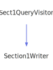

<h1>Sect1QueryVisitor</h1>

<a href="https://github.com/CharlesCarley/MdDox#~">~</a>
<a href="index.md#index">MdDox</a>
/
<a href="a01838.md#mddox">MdDox</a>
::
<a href="a01843.md#doxygen">Doxygen</a>
::
<a href="a01847.md#visitors">Visitors</a>
::
<b>Sect1QueryVisitor</b>
 
 

<h4>Derived By</h4>

<a href="a01995.md#section1writer">MdDox::Section1Writer</a>

 

<h2>Public Methods</h2>
<a href="#~sect1queryvisitor" class="icon-list-item">~Sect1QueryVisitor
</a>

 
<a href="#visitedinternal" class="icon-list-item">visitedInternal
</a>

 
<a href="#visitedparagraph" class="icon-list-item">visitedParagraph
</a>

 
<a href="#visitedsect2" class="icon-list-item">visitedSect2
</a>

 
<a href="#visitedtext" class="icon-list-item">visitedText
</a>

 
<a href="#visitedtitle" class="icon-list-item">visitedTitle
</a>

 

<h4>Defined in</h4>
<a href="https://github.com/CharlesCarley/MdDox/blob/master/Tools/Doxygen/Sect1Query.h#L31" class="icon-list-item">Sect1Query.h
</a>

 
<a href="#sect1queryvisitor" class="icon-list-item">top
</a>

<h2>~Sect1QueryVisitor</h2>
<b>~Sect1QueryVisitor</b>
<i>(</i>
<i>)</i>

<h4>Defined in</h4>
<a href="https://github.com/CharlesCarley/MdDox/blob/master/Tools/Doxygen/Sect1Query.h#L33" class="icon-list-item">Sect1Query.h
</a>

 
<a href="#sect1queryvisitor" class="icon-list-item">top
</a>

 

<h2>visitedInternal</h2>
void
<b>visitedInternal</b>
<i>(</i>

const 
<a href="a02371.md#internals1query">InternalS1Query</a>
 &amp;
query

<i>)</i>
 
 
Called when the element 
<b>internal</b>
 is found. 
 
 
<ul>
<li><i>query</i>
: 
Const reference to the 
<a href="a02371.md#internals1query">InternalS1Query</a>
 class. 
</li>
</ul>

<h4>Defined in</h4>
<a href="https://github.com/CharlesCarley/MdDox/blob/master/Tools/Doxygen/Sect1Query.h#L53" class="icon-list-item">Sect1Query.h
</a>

 
<a href="#sect1queryvisitor" class="icon-list-item">top
</a>

 

<h2>visitedParagraph</h2>
void
<b>visitedParagraph</b>
<i>(</i>

const 
<a href="a02539.md#paraquery">ParaQuery</a>
 &amp;
query

<i>)</i>
 
 
Called when the element 
<b>para</b>
 is found. 
 
 
<ul>
<li><i>query</i>
: 
Const reference to the 
<a href="a02539.md#paraquery">ParaQuery</a>
 class. 
</li>
</ul>

<h4>Defined in</h4>
<a href="https://github.com/CharlesCarley/MdDox/blob/master/Tools/Doxygen/Sect1Query.h#L43" class="icon-list-item">Sect1Query.h
</a>

 
<a href="#sect1queryvisitor" class="icon-list-item">top
</a>

 

<h2>visitedSect2</h2>
void
<b>visitedSect2</b>
<i>(</i>

const 
<a href="a02587.md#sect2query">Sect2Query</a>
 &amp;
query

<i>)</i>
 
 
Called when the element 
<b>sect2</b>
 is found. 
 
 
<ul>
<li><i>query</i>
: 
Const reference to the 
<a href="a02587.md#sect2query">Sect2Query</a>
 class. 
</li>
</ul>

<h4>Defined in</h4>
<a href="https://github.com/CharlesCarley/MdDox/blob/master/Tools/Doxygen/Sect1Query.h#L48" class="icon-list-item">Sect1Query.h
</a>

 
<a href="#sect1queryvisitor" class="icon-list-item">top
</a>

 

<h2>visitedText</h2>
void
<b>visitedText</b>
<i>(</i>

const 
<a href="a01838.md#string">String</a>
 &amp;

<i>)</i>
 
 
Callback for every _text_node. 
 

<h4>Defined in</h4>
<a href="https://github.com/CharlesCarley/MdDox/blob/master/Tools/Doxygen/Sect1Query.h#L38" class="icon-list-item">Sect1Query.h
</a>

 
<a href="#sect1queryvisitor" class="icon-list-item">top
</a>

 

<h2>visitedTitle</h2>
void
<b>visitedTitle</b>
<i>(</i>

const 
<a href="a01838.md#string">String</a>
 &amp;
text

<i>)</i>
 
 
Called when the element 
<b>title</b>
 is found. 
 
 
<ul>
<li><i>text</i>
: 
Const reference to the internal text. 
</li>
</ul>

<h4>Defined in</h4>
<a href="https://github.com/CharlesCarley/MdDox/blob/master/Tools/Doxygen/Sect1Query.h#L58" class="icon-list-item">Sect1Query.h
</a>

 
<a href="#sect1queryvisitor" class="icon-list-item">top
</a>

 

</body>
</html>
