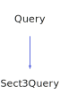

<a id="sect3query"></a>
<h1>Sect3Query</h1>
<a id="a02595"></a>
<a href="https://github.com/CharlesCarley/MdDox#~">~</a>
<a href="index.md#index">MdDox</a>
<span class="inline-text">/</span>
<a href="a01838.md#mddox">MdDox</a>
<span class="inline-text">::</span>
<a href="a01843.md#doxygen">Doxygen</a>
<span class="inline-text">::</span>
<span class="bold-text"><b>Sect3Query</b></span>
<br/>
<br/>
<span class="inline-text">Implements the </span>
<code class="typewriter">docSect3Type</code>
<span class="inline-text"> scaffolding. </span>
<br/>
<br/>
<span class="inline-text">The following xml provides the source for the </span>
<span class="bold-text"><b>docSect3Type</b></span>
<span class="inline-text"> scaffolding. </span>
<br/>
<br/>

```xml
<xsd:complexType name="docSect3Type" mixed="true">
  <xsd:sequence>
    <xsd:element name="title" type="xsd:string"/>
    <xsd:element minOccurs="0" name="para" type="docParaType" maxOccurs="unbounded"/>
    <xsd:element minOccurs="0" name="sect4" type="docSect4Type" maxOccurs="unbounded"/>
    <xsd:element minOccurs="0" name="internal" type="docInternalS3Type"/>
  </xsd:sequence>
  <xsd:attribute name="id" type="xsd:string"/>
</xsd:complexType>
```
<br/>
<a id="derived-from"></a>
<h4>Derived From</h4>
<div class="icon-link">
<a href="a02267.md#query">MdDox::Doxygen::Query</a>
</div>
<br/>
<a id="public-methods"></a>
<h2>Public Methods</h2>
<span class="icon-list-item"><a href="#sect3query" class="icon-list-item"><span class="icon-list-item">Sect3Query</span>
</a>
</span>
<br/>
<span class="icon-list-item"><a href="#sect3query" class="icon-list-item"><span class="icon-list-item">Sect3Query</span>
</a>
</span>
<br/>
<span class="icon-list-item"><a href="#sect3query" class="icon-list-item"><span class="icon-list-item">Sect3Query</span>
</a>
</span>
<br/>
<span class="icon-list-item"><a href="#foreachparagraph" class="icon-list-item"><span class="icon-list-item">foreachParagraph</span>
</a>
</span>
<br/>
<span class="icon-list-item"><a href="#foreachsect4" class="icon-list-item"><span class="icon-list-item">foreachSect4</span>
</a>
</span>
<br/>
<span class="icon-list-item"><a href="#getid" class="icon-list-item"><span class="icon-list-item">getId</span>
</a>
</span>
<br/>
<span class="icon-list-item"><a href="#getinternal" class="icon-list-item"><span class="icon-list-item">getInternal</span>
</a>
</span>
<br/>
<span class="icon-list-item"><a href="#getinternal" class="icon-list-item"><span class="icon-list-item">getInternal</span>
</a>
</span>
<br/>
<span class="icon-list-item"><a href="#gettitle" class="icon-list-item"><span class="icon-list-item">getTitle</span>
</a>
</span>
<br/>
<span class="icon-list-item"><a href="#visit" class="icon-list-item"><span class="icon-list-item">visit</span>
</a>
</span>
<br/>
<a id="defined-in"></a>
<h4>Defined in</h4>
<span class="icon-list-item"><a href="https://github.com/CharlesCarley/MdDox/blob/master/Tools/Doxygen/Sect3Query.h#L81" class="icon-list-item"><span class="icon-list-item">Sect3Query.h</span>
</a>
</span>
<br/>
<span class="icon-list-item"><a href="#sect3query" class="icon-list-item"><span class="icon-list-item">top</span>
</a>
</span>
<a id="sect3query"></a>
<h2>Sect3Query</h2>
<span class="bold-text"><b>Sect3Query</b></span>
<span class="italic-text"><i>(</i></span>
<span class="italic-text"><i>)</i></span>
<a id="defined-in"></a>
<h4>Defined in</h4>
<span class="icon-list-item"><a href="https://github.com/CharlesCarley/MdDox/blob/master/Tools/Doxygen/Sect3Query.h#L83" class="icon-list-item"><span class="icon-list-item">Sect3Query.h</span>
</a>
</span>
<br/>
<span class="icon-list-item"><a href="#sect3query" class="icon-list-item"><span class="icon-list-item">top</span>
</a>
</span>
<br/>
<a id="sect3query"></a>
<h2>Sect3Query</h2>
<span class="bold-text"><b>Sect3Query</b></span>
<span class="italic-text"><i>(</i></span>
<div class="paragraph">
<span class="paragraph"><span class="inline-text">const </span>
<a href="a02595.md#sect3query">Sect3Query</a>
<span class="inline-text"> &amp;</span>
<span class="inline-text">other</span>
</span>
</div>
<span class="italic-text"><i>)</i></span>
<a id="defined-in"></a>
<h4>Defined in</h4>
<span class="icon-list-item"><a href="https://github.com/CharlesCarley/MdDox/blob/master/Tools/Doxygen/Sect3Query.h#L84" class="icon-list-item"><span class="icon-list-item">Sect3Query.h</span>
</a>
</span>
<br/>
<span class="icon-list-item"><a href="#sect3query" class="icon-list-item"><span class="icon-list-item">top</span>
</a>
</span>
<br/>
<a id="sect3query"></a>
<h2>Sect3Query</h2>
<span class="bold-text"><b>Sect3Query</b></span>
<span class="italic-text"><i>(</i></span>
<div class="paragraph">
<span class="paragraph"><a href="a02111.md#node">Xml::Node</a>
<span class="inline-text"> *</span>
<span class="inline-text">node</span>
</span>
</div>
<span class="italic-text"><i>)</i></span>
<a id="defined-in"></a>
<h4>Defined in</h4>
<span class="icon-list-item"><a href="https://github.com/CharlesCarley/MdDox/blob/master/Tools/Doxygen/Sect3Query.h#L86" class="icon-list-item"><span class="icon-list-item">Sect3Query.h</span>
</a>
</span>
<br/>
<span class="icon-list-item"><a href="#sect3query" class="icon-list-item"><span class="icon-list-item">top</span>
</a>
</span>
<br/>
<a id="foreachparagraph"></a>
<h2>foreachParagraph</h2>
<span class="inline-text">void</span>
<span class="bold-text"><b>foreachParagraph</b></span>
<span class="italic-text"><i>(</i></span>
<div class="paragraph">
<span class="paragraph"><span class="inline-text">const </span>
<a href="a01843.md#paraqueryfunction">ParaQueryFunction</a>
<span class="inline-text"> &amp;</span>
<span class="inline-text">invoke</span>
</span>
</div>
<span class="italic-text"><i>)</i></span>
<br/>
<br/>
<span class="inline-text">Invokes the supplied callback on </span>
<span class="bold-text"><b>para</b></span>
<span class="inline-text"> elements. </span>
<br/>
<a id="references"></a>
<h4>References</h4>
<div class="paragraph">
<span class="paragraph"><a href="a02267.md#_node">_node</a>
</span>
</div>
<a id="defined-in"></a>
<h4>Defined in</h4>
<span class="icon-list-item"><a href="https://github.com/CharlesCarley/MdDox/blob/master/Tools/Doxygen/Sect3Query.h#L120" class="icon-list-item"><span class="icon-list-item">Sect3Query.h</span>
</a>
</span>
<br/>
<span class="icon-list-item"><a href="https://github.com/CharlesCarley/MdDox/blob/master/Tools/Doxygen/Sect3Query.cpp#L94" class="icon-list-item"><span class="icon-list-item">Sect3Query.cpp</span>
</a>
</span>
<br/>
<span class="icon-list-item"><a href="#sect3query" class="icon-list-item"><span class="icon-list-item">top</span>
</a>
</span>
<br/>
<a id="foreachsect4"></a>
<h2>foreachSect4</h2>
<span class="inline-text">void</span>
<span class="bold-text"><b>foreachSect4</b></span>
<span class="italic-text"><i>(</i></span>
<div class="paragraph">
<span class="paragraph"><span class="inline-text">const </span>
<a href="a01843.md#sect4queryfunction">Sect4QueryFunction</a>
<span class="inline-text"> &amp;</span>
<span class="inline-text">invoke</span>
</span>
</div>
<span class="italic-text"><i>)</i></span>
<br/>
<br/>
<span class="inline-text">Invokes the supplied callback on </span>
<span class="bold-text"><b>sect4</b></span>
<span class="inline-text"> elements. </span>
<br/>
<a id="references"></a>
<h4>References</h4>
<div class="paragraph">
<span class="paragraph"><a href="a02267.md#_node">_node</a>
</span>
</div>
<a id="defined-in"></a>
<h4>Defined in</h4>
<span class="icon-list-item"><a href="https://github.com/CharlesCarley/MdDox/blob/master/Tools/Doxygen/Sect3Query.h#L125" class="icon-list-item"><span class="icon-list-item">Sect3Query.h</span>
</a>
</span>
<br/>
<span class="icon-list-item"><a href="https://github.com/CharlesCarley/MdDox/blob/master/Tools/Doxygen/Sect3Query.cpp#L99" class="icon-list-item"><span class="icon-list-item">Sect3Query.cpp</span>
</a>
</span>
<br/>
<span class="icon-list-item"><a href="#sect3query" class="icon-list-item"><span class="icon-list-item">top</span>
</a>
</span>
<br/>
<a id="getid"></a>
<h2>getId</h2>
<span class="inline-text">const </span>
<a href="a01838.md#string">String</a>
<span class="inline-text"> &amp;</span>
<span class="bold-text"><b>getId</b></span>
<span class="italic-text"><i>(</i></span>
<div class="paragraph">
<span class="paragraph"><span class="inline-text">const </span>
<a href="a01838.md#string">String</a>
<span class="inline-text"> &amp;</span>
<span class="inline-text">notFound</span>
<span class="inline-text"> = </span>
<span class="inline-text">&quot;&quot;</span>
</span>
</div>
<span class="italic-text"><i>)</i></span>
<br/>
<br/>
<span class="inline-text">Provides access to the </span>
<span class="bold-text"><b>id</b></span>
<span class="inline-text"> attribute. </span>
<br/>
<a id="returns"></a>
<h4>Returns</h4>
<span class="inline-text">The </span>
<span class="bold-text"><b>id</b></span>
<span class="inline-text"> enumerated value or an empty string the value is not found. </span>
<br/>
<a id="references"></a>
<h4>References</h4>
<div class="paragraph">
<span class="paragraph"><a href="a02267.md#_node">_node</a>
</span>
</div>
<div class="paragraph">
<span class="paragraph"><a href="a02111.md#attribute">attribute</a>
</span>
</div>
<a id="defined-in"></a>
<h4>Defined in</h4>
<span class="icon-list-item"><a href="https://github.com/CharlesCarley/MdDox/blob/master/Tools/Doxygen/Sect3Query.h#L98" class="icon-list-item"><span class="icon-list-item">Sect3Query.h</span>
</a>
</span>
<br/>
<span class="icon-list-item"><a href="https://github.com/CharlesCarley/MdDox/blob/master/Tools/Doxygen/Sect3Query.cpp#L60" class="icon-list-item"><span class="icon-list-item">Sect3Query.cpp</span>
</a>
</span>
<br/>
<span class="icon-list-item"><a href="#sect3query" class="icon-list-item"><span class="icon-list-item">top</span>
</a>
</span>
<br/>
<a id="getinternal"></a>
<h2>getInternal</h2>
<span class="inline-text">void</span>
<span class="bold-text"><b>getInternal</b></span>
<span class="italic-text"><i>(</i></span>
<div class="paragraph">
<span class="paragraph"><a href="a02387.md#internals3query">InternalS3Query</a>
<span class="inline-text"> &amp;</span>
<span class="inline-text">dest</span>
</span>
</div>
<span class="italic-text"><i>)</i></span>
<br/>
<br/>
<span class="inline-text">Provides access to the </span>
<span class="bold-text"><b>internal</b></span>
<span class="inline-text"> attribute. </span>
<br/>
<a id="references"></a>
<h4>References</h4>
<div class="paragraph">
<span class="paragraph"><a href="a02267.md#_node">_node</a>
</span>
</div>
<div class="paragraph">
<span class="paragraph"><a href="a02267.md#node">node</a>
</span>
</div>
<div class="paragraph">
<span class="paragraph"><a href="a02111.md#firstchildof">firstChildOf</a>
</span>
</div>
<div class="paragraph">
<span class="paragraph"><a href="a02267.md#reset">reset</a>
</span>
</div>
<a id="defined-in"></a>
<h4>Defined in</h4>
<span class="icon-list-item"><a href="https://github.com/CharlesCarley/MdDox/blob/master/Tools/Doxygen/Sect3Query.h#L110" class="icon-list-item"><span class="icon-list-item">Sect3Query.h</span>
</a>
</span>
<br/>
<span class="icon-list-item"><a href="https://github.com/CharlesCarley/MdDox/blob/master/Tools/Doxygen/Sect3Query.cpp#L76" class="icon-list-item"><span class="icon-list-item">Sect3Query.cpp</span>
</a>
</span>
<br/>
<span class="icon-list-item"><a href="#sect3query" class="icon-list-item"><span class="icon-list-item">top</span>
</a>
</span>
<br/>
<a id="getinternal"></a>
<h2>getInternal</h2>
<a href="a02387.md#internals3query">InternalS3Query</a>
<span class="bold-text"><b>getInternal</b></span>
<span class="italic-text"><i>(</i></span>
<span class="italic-text"><i>)</i></span>
<br/>
<br/>
<span class="inline-text">Provides access to the </span>
<span class="bold-text"><b>internal</b></span>
<span class="inline-text"> attribute. </span>
<br/>
<a id="defined-in"></a>
<h4>Defined in</h4>
<span class="icon-list-item"><a href="https://github.com/CharlesCarley/MdDox/blob/master/Tools/Doxygen/Sect3Query.h#L115" class="icon-list-item"><span class="icon-list-item">Sect3Query.h</span>
</a>
</span>
<br/>
<span class="icon-list-item"><a href="https://github.com/CharlesCarley/MdDox/blob/master/Tools/Doxygen/Sect3Query.cpp#L87" class="icon-list-item"><span class="icon-list-item">Sect3Query.cpp</span>
</a>
</span>
<br/>
<span class="icon-list-item"><a href="#sect3query" class="icon-list-item"><span class="icon-list-item">top</span>
</a>
</span>
<br/>
<a id="gettitle"></a>
<h2>getTitle</h2>
<span class="inline-text">const </span>
<a href="a01838.md#string">String</a>
<span class="inline-text"> &amp;</span>
<span class="bold-text"><b>getTitle</b></span>
<span class="italic-text"><i>(</i></span>
<div class="paragraph">
<span class="paragraph"><span class="inline-text">const </span>
<a href="a01838.md#string">String</a>
<span class="inline-text"> &amp;</span>
<span class="inline-text">notFound</span>
<span class="inline-text"> = </span>
<span class="inline-text">&quot;&quot;</span>
</span>
</div>
<span class="italic-text"><i>)</i></span>
<br/>
<br/>
<span class="inline-text">Provides access to the </span>
<span class="bold-text"><b>title</b></span>
<span class="inline-text"> tag&apos;s inner text. </span>
<br/>
<a id="returns"></a>
<h4>Returns</h4>
<span class="inline-text">The </span>
<span class="bold-text"><b>title&apos;s</b></span>
<span class="inline-text"> text or the default value if the node is invalid. </span>
<br/>
<a id="references"></a>
<h4>References</h4>
<div class="paragraph">
<span class="paragraph"><a href="a02267.md#_node">_node</a>
</span>
</div>
<div class="paragraph">
<span class="paragraph"><a href="a02267.md#node">node</a>
</span>
</div>
<div class="paragraph">
<span class="paragraph"><a href="a02111.md#firstchildof">firstChildOf</a>
</span>
</div>
<div class="paragraph">
<span class="paragraph"><a href="a02111.md#text">text</a>
</span>
</div>
<a id="defined-in"></a>
<h4>Defined in</h4>
<span class="icon-list-item"><a href="https://github.com/CharlesCarley/MdDox/blob/master/Tools/Doxygen/Sect3Query.h#L105" class="icon-list-item"><span class="icon-list-item">Sect3Query.h</span>
</a>
</span>
<br/>
<span class="icon-list-item"><a href="https://github.com/CharlesCarley/MdDox/blob/master/Tools/Doxygen/Sect3Query.cpp#L67" class="icon-list-item"><span class="icon-list-item">Sect3Query.cpp</span>
</a>
</span>
<br/>
<span class="icon-list-item"><a href="#sect3query" class="icon-list-item"><span class="icon-list-item">top</span>
</a>
</span>
<br/>
<a id="visit"></a>
<h2>visit</h2>
<span class="inline-text">void</span>
<span class="bold-text"><b>visit</b></span>
<span class="italic-text"><i>(</i></span>
<div class="paragraph">
<span class="paragraph"><a href="a02591.md#sect3queryvisitor">Visitors::Sect3QueryVisitor</a>
<span class="inline-text"> *</span>
<span class="inline-text"> = </span>
<span class="inline-text">visitor</span>
</span>
</div>
<span class="italic-text"><i>)</i></span>
<a id="references"></a>
<h4>References</h4>
<div class="paragraph">
<span class="paragraph"><a href="a02267.md#_node">_node</a>
</span>
</div>
<div class="paragraph">
<span class="paragraph"><a href="a02111.md#children">children</a>
</span>
</div>
<div class="paragraph">
<span class="paragraph"><a href="a01843.md#doxtextnode">DoxTextNode</a>
</span>
</div>
<div class="paragraph">
<span class="paragraph"><a href="a02591.md#visitedtext">visitedText</a>
</span>
</div>
<div class="paragraph">
<span class="paragraph"><a href="a02591.md#visitedparagraph">visitedParagraph</a>
</span>
</div>
<div class="paragraph">
<span class="paragraph"><a href="a02591.md#visitedsect4">visitedSect4</a>
</span>
</div>
<div class="paragraph">
<span class="paragraph"><a href="a02591.md#visitedinternal">visitedInternal</a>
</span>
</div>
<div class="paragraph">
<span class="paragraph"><a href="a02591.md#visitedtitle">visitedTitle</a>
</span>
</div>
<a id="defined-in"></a>
<h4>Defined in</h4>
<span class="icon-list-item"><a href="https://github.com/CharlesCarley/MdDox/blob/master/Tools/Doxygen/Sect3Query.h#L91" class="icon-list-item"><span class="icon-list-item">Sect3Query.h</span>
</a>
</span>
<br/>
<span class="icon-list-item"><a href="https://github.com/CharlesCarley/MdDox/blob/master/Tools/Doxygen/Sect3Query.cpp#L31" class="icon-list-item"><span class="icon-list-item">Sect3Query.cpp</span>
</a>
</span>
<br/>
<span class="icon-list-item"><a href="#sect3query" class="icon-list-item"><span class="icon-list-item">top</span>
</a>
</span>
<br/>
</div>
</div>
</body>
</html>
