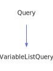

<a id="variablelistquery"></a>
<h1>VariableListQuery</h1>
<a id="a02675"></a>
<a href="https://github.com/CharlesCarley/MdDox#~">~</a>
<a href="index.md#index">MdDox</a>
<span class="inline-text">/</span>
<a href="a01838.md#mddox">MdDox</a>
<span class="inline-text">::</span>
<a href="a01843.md#doxygen">Doxygen</a>
<span class="inline-text">::</span>
<span class="bold-text"><b>VariableListQuery</b></span>
<br/>
<br/>
<span class="inline-text">Implements the </span>
<code class="typewriter">docVariableListType</code>
<span class="inline-text"> scaffolding. </span>
<br/>
<br/>
<span class="inline-text">The following xml provides the source for the </span>
<span class="bold-text"><b>docVariableListType</b></span>
<span class="inline-text"> scaffolding. </span>
<br/>
<br/>

```xml
<xsd:complexType name="docVariableListType">
  <xsd:sequence>
    <xsd:group ref="docVariableListGroup" maxOccurs="unbounded"/>
  </xsd:sequence>
</xsd:complexType>
```
<br/>
<a id="derived-from"></a>
<h4>Derived From</h4>
<div class="icon-link">
<a href="a02267.md#query">MdDox::Doxygen::Query</a>
</div>
<br/>
<a id="public-methods"></a>
<h2>Public Methods</h2>
<span class="icon-list-item"><a href="#variablelistquery" class="icon-list-item"><span class="icon-list-item">VariableListQuery</span>
</a>
</span>
<br/>
<span class="icon-list-item"><a href="#variablelistquery" class="icon-list-item"><span class="icon-list-item">VariableListQuery</span>
</a>
</span>
<br/>
<span class="icon-list-item"><a href="#variablelistquery" class="icon-list-item"><span class="icon-list-item">VariableListQuery</span>
</a>
</span>
<br/>
<a id="defined-in"></a>
<h4>Defined in</h4>
<span class="icon-list-item"><a href="https://github.com/CharlesCarley/MdDox/blob/master/Tools/Doxygen/VariableListQuery.h#L44" class="icon-list-item"><span class="icon-list-item">VariableListQuery.h</span>
</a>
</span>
<br/>
<span class="icon-list-item"><a href="#variablelistquery" class="icon-list-item"><span class="icon-list-item">top</span>
</a>
</span>
<a id="variablelistquery"></a>
<h2>VariableListQuery</h2>
<span class="bold-text"><b>VariableListQuery</b></span>
<span class="italic-text"><i>(</i></span>
<span class="italic-text"><i>)</i></span>
<a id="defined-in"></a>
<h4>Defined in</h4>
<span class="icon-list-item"><a href="https://github.com/CharlesCarley/MdDox/blob/master/Tools/Doxygen/VariableListQuery.h#L46" class="icon-list-item"><span class="icon-list-item">VariableListQuery.h</span>
</a>
</span>
<br/>
<span class="icon-list-item"><a href="#variablelistquery" class="icon-list-item"><span class="icon-list-item">top</span>
</a>
</span>
<br/>
<a id="variablelistquery"></a>
<h2>VariableListQuery</h2>
<span class="bold-text"><b>VariableListQuery</b></span>
<span class="italic-text"><i>(</i></span>
<div class="paragraph">
<span class="paragraph"><span class="inline-text">const </span>
<a href="a02675.md#variablelistquery">VariableListQuery</a>
<span class="inline-text"> &amp;</span>
<span class="inline-text">other</span>
</span>
</div>
<span class="italic-text"><i>)</i></span>
<a id="defined-in"></a>
<h4>Defined in</h4>
<span class="icon-list-item"><a href="https://github.com/CharlesCarley/MdDox/blob/master/Tools/Doxygen/VariableListQuery.h#L47" class="icon-list-item"><span class="icon-list-item">VariableListQuery.h</span>
</a>
</span>
<br/>
<span class="icon-list-item"><a href="#variablelistquery" class="icon-list-item"><span class="icon-list-item">top</span>
</a>
</span>
<br/>
<a id="variablelistquery"></a>
<h2>VariableListQuery</h2>
<span class="bold-text"><b>VariableListQuery</b></span>
<span class="italic-text"><i>(</i></span>
<div class="paragraph">
<span class="paragraph"><a href="a02111.md#node">Xml::Node</a>
<span class="inline-text"> *</span>
<span class="inline-text">node</span>
</span>
</div>
<span class="italic-text"><i>)</i></span>
<a id="defined-in"></a>
<h4>Defined in</h4>
<span class="icon-list-item"><a href="https://github.com/CharlesCarley/MdDox/blob/master/Tools/Doxygen/VariableListQuery.h#L49" class="icon-list-item"><span class="icon-list-item">VariableListQuery.h</span>
</a>
</span>
<br/>
<span class="icon-list-item"><a href="#variablelistquery" class="icon-list-item"><span class="icon-list-item">top</span>
</a>
</span>
<br/>
</div>
</div>
</body>
</html>
