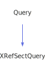

<a id="xrefsectquery"></a>
<h1>XRefSectQuery</h1>
<a id="a02683"></a>
<a href="https://github.com/CharlesCarley/MdDox#~">~</a>
<a href="index.md#index">MdDox</a>
<span class="inline-text">/</span>
<a href="a01838.md#mddox">MdDox</a>
<span class="inline-text">::</span>
<a href="a01843.md#doxygen">Doxygen</a>
<span class="inline-text">::</span>
<span class="bold-text"><b>XRefSectQuery</b></span>
<br/>
<br/>
<span class="inline-text">Implements the </span>
<code class="typewriter">docXRefSectType</code>
<span class="inline-text"> scaffolding. </span>
<br/>
<br/>
<span class="inline-text">The following xml provides the source for the </span>
<span class="bold-text"><b>docXRefSectType</b></span>
<span class="inline-text"> scaffolding. </span>
<br/>
<br/>

```xml
<xsd:complexType name="docXRefSectType">
  <xsd:sequence>
    <xsd:element minOccurs="0" name="xreftitle" type="xsd:string" maxOccurs="unbounded"/>
    <xsd:element name="xrefdescription" type="descriptionType"/>
  </xsd:sequence>
  <xsd:attribute name="id" type="xsd:string"/>
</xsd:complexType>
```
<br/>
<a id="derived-from"></a>
<h4>Derived From</h4>
<div class="icon-link">
<a href="a02267.md#query">MdDox::Doxygen::Query</a>
</div>
<br/>
<a id="public-methods"></a>
<h2>Public Methods</h2>
<span class="icon-list-item"><a href="#xrefsectquery" class="icon-list-item"><span class="icon-list-item">XRefSectQuery</span>
</a>
</span>
<br/>
<span class="icon-list-item"><a href="#xrefsectquery" class="icon-list-item"><span class="icon-list-item">XRefSectQuery</span>
</a>
</span>
<br/>
<span class="icon-list-item"><a href="#xrefsectquery" class="icon-list-item"><span class="icon-list-item">XRefSectQuery</span>
</a>
</span>
<br/>
<span class="icon-list-item"><a href="#getid" class="icon-list-item"><span class="icon-list-item">getId</span>
</a>
</span>
<br/>
<a id="defined-in"></a>
<h4>Defined in</h4>
<span class="icon-list-item"><a href="https://github.com/CharlesCarley/MdDox/blob/master/Tools/Doxygen/XRefSectQuery.h#L46" class="icon-list-item"><span class="icon-list-item">XRefSectQuery.h</span>
</a>
</span>
<br/>
<span class="icon-list-item"><a href="#xrefsectquery" class="icon-list-item"><span class="icon-list-item">top</span>
</a>
</span>
<a id="xrefsectquery"></a>
<h2>XRefSectQuery</h2>
<span class="bold-text"><b>XRefSectQuery</b></span>
<span class="italic-text"><i>(</i></span>
<span class="italic-text"><i>)</i></span>
<a id="defined-in"></a>
<h4>Defined in</h4>
<span class="icon-list-item"><a href="https://github.com/CharlesCarley/MdDox/blob/master/Tools/Doxygen/XRefSectQuery.h#L48" class="icon-list-item"><span class="icon-list-item">XRefSectQuery.h</span>
</a>
</span>
<br/>
<span class="icon-list-item"><a href="#xrefsectquery" class="icon-list-item"><span class="icon-list-item">top</span>
</a>
</span>
<br/>
<a id="xrefsectquery"></a>
<h2>XRefSectQuery</h2>
<span class="bold-text"><b>XRefSectQuery</b></span>
<span class="italic-text"><i>(</i></span>
<div class="paragraph">
<span class="paragraph"><span class="inline-text">const </span>
<a href="a02683.md#xrefsectquery">XRefSectQuery</a>
<span class="inline-text"> &amp;</span>
<span class="inline-text">other</span>
</span>
</div>
<span class="italic-text"><i>)</i></span>
<a id="defined-in"></a>
<h4>Defined in</h4>
<span class="icon-list-item"><a href="https://github.com/CharlesCarley/MdDox/blob/master/Tools/Doxygen/XRefSectQuery.h#L49" class="icon-list-item"><span class="icon-list-item">XRefSectQuery.h</span>
</a>
</span>
<br/>
<span class="icon-list-item"><a href="#xrefsectquery" class="icon-list-item"><span class="icon-list-item">top</span>
</a>
</span>
<br/>
<a id="xrefsectquery"></a>
<h2>XRefSectQuery</h2>
<span class="bold-text"><b>XRefSectQuery</b></span>
<span class="italic-text"><i>(</i></span>
<div class="paragraph">
<span class="paragraph"><a href="a02111.md#node">Xml::Node</a>
<span class="inline-text"> *</span>
<span class="inline-text">node</span>
</span>
</div>
<span class="italic-text"><i>)</i></span>
<a id="defined-in"></a>
<h4>Defined in</h4>
<span class="icon-list-item"><a href="https://github.com/CharlesCarley/MdDox/blob/master/Tools/Doxygen/XRefSectQuery.h#L51" class="icon-list-item"><span class="icon-list-item">XRefSectQuery.h</span>
</a>
</span>
<br/>
<span class="icon-list-item"><a href="#xrefsectquery" class="icon-list-item"><span class="icon-list-item">top</span>
</a>
</span>
<br/>
<a id="getid"></a>
<h2>getId</h2>
<span class="inline-text">const </span>
<a href="a01838.md#string">String</a>
<span class="inline-text"> &amp;</span>
<span class="bold-text"><b>getId</b></span>
<span class="italic-text"><i>(</i></span>
<div class="paragraph">
<span class="paragraph"><span class="inline-text">const </span>
<a href="a01838.md#string">String</a>
<span class="inline-text"> &amp;</span>
<span class="inline-text">notFound</span>
<span class="inline-text"> = </span>
<span class="inline-text">&quot;&quot;</span>
</span>
</div>
<span class="italic-text"><i>)</i></span>
<br/>
<br/>
<span class="inline-text">Provides access to the </span>
<span class="bold-text"><b>id</b></span>
<span class="inline-text"> attribute. </span>
<br/>
<a id="returns"></a>
<h4>Returns</h4>
<span class="inline-text">The </span>
<span class="bold-text"><b>id</b></span>
<span class="inline-text"> enumerated value or an empty string the value is not found. </span>
<br/>
<a id="references"></a>
<h4>References</h4>
<div class="paragraph">
<span class="paragraph"><a href="a02267.md#_node">_node</a>
</span>
</div>
<div class="paragraph">
<span class="paragraph"><a href="a02111.md#attribute">attribute</a>
</span>
</div>
<a id="defined-in"></a>
<h4>Defined in</h4>
<span class="icon-list-item"><a href="https://github.com/CharlesCarley/MdDox/blob/master/Tools/Doxygen/XRefSectQuery.h#L61" class="icon-list-item"><span class="icon-list-item">XRefSectQuery.h</span>
</a>
</span>
<br/>
<span class="icon-list-item"><a href="https://github.com/CharlesCarley/MdDox/blob/master/Tools/Doxygen/XRefSectQuery.cpp#L28" class="icon-list-item"><span class="icon-list-item">XRefSectQuery.cpp</span>
</a>
</span>
<br/>
<span class="icon-list-item"><a href="#xrefsectquery" class="icon-list-item"><span class="icon-list-item">top</span>
</a>
</span>
<br/>
</div>
</div>
</body>
</html>
