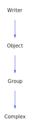

<h1>Complex</h1>

<a href="https://github.com/CharlesCarley/MdDox#~">~</a>
<a href="index.md#index">MdDox</a>
/
<a href="a01838.md#mddox">MdDox</a>
::
<a href="a01848.md#genapi">GenApi</a>
::
<b>Complex</b>
 
 

<h4>Derived From</h4>

<a href="a02707.md#group">MdDox::GenApi::Group</a>

 

<h2>Public Methods</h2>
<a href="#complex" class="icon-list-item">Complex
</a>

 
<a href="#~complex" class="icon-list-item">~Complex
</a>

 
<a href="#write" class="icon-list-item">write
</a>

 

<h4>Defined in</h4>
<a href="https://github.com/CharlesCarley/MdDox/blob/master/Tools/GenApi/Complex.h#L40" class="icon-list-item">Complex.h
</a>

 
<a href="#complex" class="icon-list-item">top
</a>

<h2>Complex</h2>
<b>Complex</b>
<i>(</i>

<a href="a02111.md#node">Xml::Node</a>
 *
node

<a href="a01838.md#string">String</a>
name

<a href="a01838.md#string">String</a>
type

<i>)</i>

<h4>Defined in</h4>
<a href="https://github.com/CharlesCarley/MdDox/blob/master/Tools/GenApi/Complex.h#L42" class="icon-list-item">Complex.h
</a>

 
<a href="https://github.com/CharlesCarley/MdDox/blob/master/Tools/GenApi/Complex.cpp#L30" class="icon-list-item">Complex.cpp
</a>

 
<a href="#complex" class="icon-list-item">top
</a>

 

<h2>~Complex</h2>
<b>~Complex</b>
<i>(</i>
<i>)</i>

<h4>Defined in</h4>
<a href="https://github.com/CharlesCarley/MdDox/blob/master/Tools/GenApi/Complex.h#L43" class="icon-list-item">Complex.h
</a>

 
<a href="#complex" class="icon-list-item">top
</a>

 

<h2>write</h2>
void
<b>write</b>
<i>(</i>

const 
<a href="a01838.md#string">String</a>
 &amp;
output

<i>)</i>

<h4>References</h4>

<a href="a01838.md#stringcombine">StringCombine</a>

<a href="a02091.md#rooteddir">rootedDir</a>

<a href="a02091.md#stem">stem</a>

<a href="a02707.md#writeheader">writeHeader</a>

<a href="a02707.md#writesource">writeSource</a>

<h4>Defined in</h4>
<a href="https://github.com/CharlesCarley/MdDox/blob/master/Tools/GenApi/Complex.h#L45" class="icon-list-item">Complex.h
</a>

 
<a href="https://github.com/CharlesCarley/MdDox/blob/master/Tools/GenApi/Complex.cpp#L37" class="icon-list-item">Complex.cpp
</a>

 
<a href="#complex" class="icon-list-item">top
</a>

 

</body>
</html>
