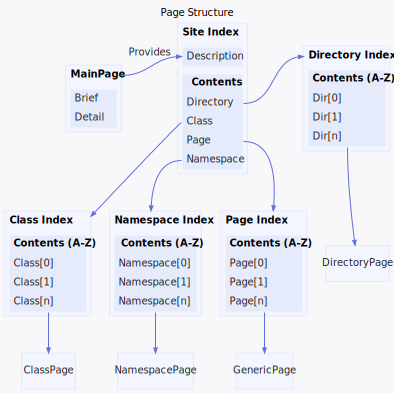

<h1>Site Layout</h1>

<a href="https://github.com/CharlesCarley/MdDox#~">~</a>
<a href="index.md#index">MdDox</a>
/
<b>MD002</b>
 
 
Illustrates the structure of the generated site.
 
 

<h2>Page Link Structure</h2>
 

 The following graph outlines the generated page structure. 
 
 
 

<h4>Main Page</h4>
Main page is generated by Doxygen as indexpage.xml. It needs to be defined somewhere in the project&apos;s source code with the Doxygen special command 
<code class="typewriter">\mainpage</code>

<h4>Index</h4>
Index implements a project wide table of contents. It is sorted by page, directory, namespace, and then class index.

<h4>Namespace Index</h4>
The namespace index is defined in the 
<code class="typewriter">namespace_index</code>
<code class="typewriter">.{outputFileEx}</code>
. It contains a list of all namespaces defined in the current project source.

<h4>Class Index</h4>
The class index is defined in 
<code class="typewriter">class_index</code>
<code class="typewriter">.{outputFileEx}</code>
. It contains a list of all classes defined in the current project source.

<h4>Page Index</h4>
The page index is defined in 
<code class="typewriter">page_index</code>
<code class="typewriter">.{outputFileEx}</code>
. It contains a list of all pages defined in the current project source.

<h4>Directory Index</h4>
The directory index is defined in 
<code class="typewriter">directory_index</code>
<code class="typewriter">.{outputFileEx}</code>
. It contains a list of all top level directories in the current project. 

</body>
</html>
