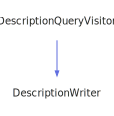

<h1>DirectoryPageWriter</h1>

<a href="https://github.com/CharlesCarley/MdDox#~">~</a>
<a href="index.md#index">MdDox</a>
/
<a href="namespaceMdDox.md#mddox">MdDox</a>
::
<b>DirectoryPageWriter</b>
 
 

<h4>Derived From</h4>

<a href="classMdDox_1_1PageWriter.md#pagewriter">MdDox::PageWriter</a>

 

<h2>Private Members</h2>
<a href="#_hascontent" class="icon-list-item">_hasContent
</a>

 
<a href="#_internaldir" class="icon-list-item">_internalDir
</a>

 

<h2>Private Methods</h2>
<a href="#begindirectoryheading" class="icon-list-item">beginDirectoryHeading
</a>

 
<a href="#presortquery" class="icon-list-item">preSortQuery
</a>

 
<a href="#visitedbasecompoundref" class="icon-list-item">visitedBaseCompoundRef
</a>

 
<a href="#visitedcollaborationgraph" class="icon-list-item">visitedCollaborationGraph
</a>

 
<a href="#visitedcompoundname" class="icon-list-item">visitedCompoundName
</a>

 
<a href="#visitedderivedcompoundref" class="icon-list-item">visitedDerivedCompoundRef
</a>

 
<a href="#visitedincdepgraph" class="icon-list-item">visitedIncDepGraph
</a>

 
<a href="#visitedincludedby" class="icon-list-item">visitedIncludedBy
</a>

 
<a href="#visitedincludes" class="icon-list-item">visitedIncludes
</a>

 
<a href="#visitedinheritancegraph" class="icon-list-item">visitedInheritanceGraph
</a>

 
<a href="#visitedinnerclass" class="icon-list-item">visitedInnerClass
</a>

 
<a href="#visitedinnerdir" class="icon-list-item">visitedInnerDir
</a>

 
<a href="#visitedinnerfile" class="icon-list-item">visitedInnerFile
</a>

 
<a href="#visitedinnergroup" class="icon-list-item">visitedInnerGroup
</a>

 
<a href="#visitedinnernamespace" class="icon-list-item">visitedInnerNamespace
</a>

 
<a href="#visitedinnerpage" class="icon-list-item">visitedInnerPage
</a>

 
<a href="#visitedinvincdepgraph" class="icon-list-item">visitedInvIncDepGraph
</a>

 
<a href="#visitedlistofallmembers" class="icon-list-item">visitedListOfAllMembers
</a>

 
<a href="#visitedlocation" class="icon-list-item">visitedLocation
</a>

 
<a href="#visitedprogramlisting" class="icon-list-item">visitedProgramListing
</a>

 
<a href="#visitedtableofcontents" class="icon-list-item">visitedTableOfContents
</a>

 
<a href="#visitedtemplateparamlist" class="icon-list-item">visitedTemplateParamList
</a>

 
<a href="#visitedtitle" class="icon-list-item">visitedTitle
</a>

 

<h2>Public Methods</h2>
<a href="#directorypagewriter" class="icon-list-item">DirectoryPageWriter
</a>

 
<a href="#~directorypagewriter" class="icon-list-item">~DirectoryPageWriter
</a>

 

<h4>Defined in</h4>
<a href="https://github.com/CharlesCarley/MdDox/blob/master/Source/MdDoxTree/DirectoryPageWriter.h#L34" class="icon-list-item">DirectoryPageWriter.h
</a>

 
 
<a href="#directorypagewriter" class="icon-list-item">top
</a>

<h2>_hasContent</h2>
bool
<b>_hasContent</b>
 

<h4>Defined in</h4>
<a href="https://github.com/CharlesCarley/MdDox/blob/master/Source/MdDoxTree/DirectoryPageWriter.h#L37" class="icon-list-item">DirectoryPageWriter.h
</a>

 
 
<a href="#directorypagewriter" class="icon-list-item">top
</a>

 

<h2>_internalDir</h2>
<a href="classMdDox_1_1Reference.md#reference">Reference</a>
<b>_internalDir</b>
 

<h4>Defined in</h4>
<a href="https://github.com/CharlesCarley/MdDox/blob/master/Source/MdDoxTree/DirectoryPageWriter.h#L36" class="icon-list-item">DirectoryPageWriter.h
</a>

 
 
<a href="#directorypagewriter" class="icon-list-item">top
</a>

 

<h2>beginDirectoryHeading</h2>
void
<b>beginDirectoryHeading</b>
<i>(</i>
<i>)</i>

<h4>Defined in</h4>
<a href="https://github.com/CharlesCarley/MdDox/blob/master/Source/MdDoxTree/DirectoryPageWriter.h#L39" class="icon-list-item">DirectoryPageWriter.h
</a>

 
<a href="https://github.com/CharlesCarley/MdDox/blob/master/Source/MdDoxTree/DirectoryPageWriter.cpp#L43" class="icon-list-item">DirectoryPageWriter.cpp
</a>

 
 
<a href="#directorypagewriter" class="icon-list-item">top
</a>

 

<h2>preSortQuery</h2>
void
<b>preSortQuery</b>
<i>(</i>

const 
<a href="classMdDox_1_1Doxygen_1_1CompoundDefQuery.md#compounddefquery">Doxygen::CompoundDefQuery</a>
 &amp;
query

<i>)</i>

<h4>Defined in</h4>
<a href="https://github.com/CharlesCarley/MdDox/blob/master/Source/MdDoxTree/DirectoryPageWriter.h#L83" class="icon-list-item">DirectoryPageWriter.h
</a>

 
<a href="https://github.com/CharlesCarley/MdDox/blob/master/Source/MdDoxTree/DirectoryPageWriter.cpp#L174" class="icon-list-item">DirectoryPageWriter.cpp
</a>

 
 
<a href="#directorypagewriter" class="icon-list-item">top
</a>

 

<h2>visitedBaseCompoundRef</h2>
void
<b>visitedBaseCompoundRef</b>
<i>(</i>

const 
<a href="classMdDox_1_1Doxygen_1_1CompoundRefQuery.md#compoundrefquery">Doxygen::CompoundRefQuery</a>
 &amp;
query

<i>)</i>

<h4>Details</h4>
Called when the element 
<b>basecompoundref</b>
 is found. 
 
 
<ul>
<li><b>query</b>
 - 
Const reference to the CompoundRefQuery class. 
</li>
</ul>
 

<h4>Defined in</h4>
<a href="https://github.com/CharlesCarley/MdDox/blob/master/Source/MdDoxTree/DirectoryPageWriter.h#L43" class="icon-list-item">DirectoryPageWriter.h
</a>

 
<a href="https://github.com/CharlesCarley/MdDox/blob/master/Source/MdDoxTree/DirectoryPageWriter.cpp#L89" class="icon-list-item">DirectoryPageWriter.cpp
</a>

 
 
<a href="#directorypagewriter" class="icon-list-item">top
</a>

 

<h2>visitedCollaborationGraph</h2>
void
<b>visitedCollaborationGraph</b>
<i>(</i>

const 
<a href="classMdDox_1_1Doxygen_1_1GraphQuery.md#graphquery">Doxygen::GraphQuery</a>
 &amp;
query

<i>)</i>

<h4>Details</h4>
Called when the element 
<b>collaborationgraph</b>
 is found. 
 
 
<ul>
<li><b>query</b>
 - 
Const reference to the GraphQuery class. 
</li>
</ul>
 

<h4>Defined in</h4>
<a href="https://github.com/CharlesCarley/MdDox/blob/master/Source/MdDoxTree/DirectoryPageWriter.h#L71" class="icon-list-item">DirectoryPageWriter.h
</a>

 
<a href="https://github.com/CharlesCarley/MdDox/blob/master/Source/MdDoxTree/DirectoryPageWriter.cpp#L149" class="icon-list-item">DirectoryPageWriter.cpp
</a>

 
 
<a href="#directorypagewriter" class="icon-list-item">top
</a>

 

<h2>visitedCompoundName</h2>
void
<b>visitedCompoundName</b>
<i>(</i>

const 
<a href="namespaceMdDox.md#string">String</a>
 &amp;
text

<i>)</i>

<h4>Details</h4>
Called when the element 
<b>compoundname</b>
 is found. 
 
 
<ul>
<li><b>text</b>
 - 
Const reference to the internal text. 
</li>
</ul>
 

<h4>Defined in</h4>
<a href="https://github.com/CharlesCarley/MdDox/blob/master/Source/MdDoxTree/DirectoryPageWriter.h#L77" class="icon-list-item">DirectoryPageWriter.h
</a>

 
<a href="https://github.com/CharlesCarley/MdDox/blob/master/Source/MdDoxTree/DirectoryPageWriter.cpp#L55" class="icon-list-item">DirectoryPageWriter.cpp
</a>

 
 
<a href="#directorypagewriter" class="icon-list-item">top
</a>

 

<h2>visitedDerivedCompoundRef</h2>
void
<b>visitedDerivedCompoundRef</b>
<i>(</i>

const 
<a href="classMdDox_1_1Doxygen_1_1CompoundRefQuery.md#compoundrefquery">Doxygen::CompoundRefQuery</a>
 &amp;
query

<i>)</i>

<h4>Details</h4>
Called when the element 
<b>derivedcompoundref</b>
 is found. 
 
 
<ul>
<li><b>query</b>
 - 
Const reference to the CompoundRefQuery class. 
</li>
</ul>
 

<h4>Defined in</h4>
<a href="https://github.com/CharlesCarley/MdDox/blob/master/Source/MdDoxTree/DirectoryPageWriter.h#L45" class="icon-list-item">DirectoryPageWriter.h
</a>

 
<a href="https://github.com/CharlesCarley/MdDox/blob/master/Source/MdDoxTree/DirectoryPageWriter.cpp#L94" class="icon-list-item">DirectoryPageWriter.cpp
</a>

 
 
<a href="#directorypagewriter" class="icon-list-item">top
</a>

 

<h2>visitedIncDepGraph</h2>
void
<b>visitedIncDepGraph</b>
<i>(</i>

const 
<a href="classMdDox_1_1Doxygen_1_1GraphQuery.md#graphquery">Doxygen::GraphQuery</a>
 &amp;
query

<i>)</i>

<h4>Details</h4>
Called when the element 
<b>incdepgraph</b>
 is found. 
 
 
<ul>
<li><b>query</b>
 - 
Const reference to the GraphQuery class. 
</li>
</ul>
 

<h4>Defined in</h4>
<a href="https://github.com/CharlesCarley/MdDox/blob/master/Source/MdDoxTree/DirectoryPageWriter.h#L63" class="icon-list-item">DirectoryPageWriter.h
</a>

 
<a href="https://github.com/CharlesCarley/MdDox/blob/master/Source/MdDoxTree/DirectoryPageWriter.cpp#L129" class="icon-list-item">DirectoryPageWriter.cpp
</a>

 
 
<a href="#directorypagewriter" class="icon-list-item">top
</a>

 

<h2>visitedIncludedBy</h2>
void
<b>visitedIncludedBy</b>
<i>(</i>

const 
<a href="classMdDox_1_1Doxygen_1_1IncQuery.md#incquery">Doxygen::IncQuery</a>
 &amp;
query

<i>)</i>

<h4>Details</h4>
Called when the element 
<b>includedby</b>
 is found. 
 
 
<ul>
<li><b>query</b>
 - 
Const reference to the IncQuery class. 
</li>
</ul>
 

<h4>Defined in</h4>
<a href="https://github.com/CharlesCarley/MdDox/blob/master/Source/MdDoxTree/DirectoryPageWriter.h#L49" class="icon-list-item">DirectoryPageWriter.h
</a>

 
<a href="https://github.com/CharlesCarley/MdDox/blob/master/Source/MdDoxTree/DirectoryPageWriter.cpp#L104" class="icon-list-item">DirectoryPageWriter.cpp
</a>

 
 
<a href="#directorypagewriter" class="icon-list-item">top
</a>

 

<h2>visitedIncludes</h2>
void
<b>visitedIncludes</b>
<i>(</i>

const 
<a href="classMdDox_1_1Doxygen_1_1IncQuery.md#incquery">Doxygen::IncQuery</a>
 &amp;
query

<i>)</i>

<h4>Details</h4>
Called when the element 
<b>includes</b>
 is found. 
 
 
<ul>
<li><b>query</b>
 - 
Const reference to the IncQuery class. 
</li>
</ul>
 

<h4>Defined in</h4>
<a href="https://github.com/CharlesCarley/MdDox/blob/master/Source/MdDoxTree/DirectoryPageWriter.h#L47" class="icon-list-item">DirectoryPageWriter.h
</a>

 
<a href="https://github.com/CharlesCarley/MdDox/blob/master/Source/MdDoxTree/DirectoryPageWriter.cpp#L99" class="icon-list-item">DirectoryPageWriter.cpp
</a>

 
 
<a href="#directorypagewriter" class="icon-list-item">top
</a>

 

<h2>visitedInheritanceGraph</h2>
void
<b>visitedInheritanceGraph</b>
<i>(</i>

const 
<a href="classMdDox_1_1Doxygen_1_1GraphQuery.md#graphquery">Doxygen::GraphQuery</a>
 &amp;
query

<i>)</i>

<h4>Details</h4>
Called when the element 
<b>inheritancegraph</b>
 is found. 
 
 
<ul>
<li><b>query</b>
 - 
Const reference to the GraphQuery class. 
</li>
</ul>
 

<h4>Defined in</h4>
<a href="https://github.com/CharlesCarley/MdDox/blob/master/Source/MdDoxTree/DirectoryPageWriter.h#L69" class="icon-list-item">DirectoryPageWriter.h
</a>

 
<a href="https://github.com/CharlesCarley/MdDox/blob/master/Source/MdDoxTree/DirectoryPageWriter.cpp#L144" class="icon-list-item">DirectoryPageWriter.cpp
</a>

 
 
<a href="#directorypagewriter" class="icon-list-item">top
</a>

 

<h2>visitedInnerClass</h2>
void
<b>visitedInnerClass</b>
<i>(</i>

const 
<a href="classMdDox_1_1Doxygen_1_1RefQuery.md#refquery">Doxygen::RefQuery</a>
 &amp;
query

<i>)</i>

<h4>Details</h4>
Called when the element 
<b>innerclass</b>
 is found. 
 
 
<ul>
<li><b>query</b>
 - 
Const reference to the RefQuery class. 
</li>
</ul>
 

<h4>Defined in</h4>
<a href="https://github.com/CharlesCarley/MdDox/blob/master/Source/MdDoxTree/DirectoryPageWriter.h#L55" class="icon-list-item">DirectoryPageWriter.h
</a>

 
<a href="https://github.com/CharlesCarley/MdDox/blob/master/Source/MdDoxTree/DirectoryPageWriter.cpp#L109" class="icon-list-item">DirectoryPageWriter.cpp
</a>

 
 
<a href="#directorypagewriter" class="icon-list-item">top
</a>

 

<h2>visitedInnerDir</h2>
void
<b>visitedInnerDir</b>
<i>(</i>

const 
<a href="classMdDox_1_1Doxygen_1_1RefQuery.md#refquery">Doxygen::RefQuery</a>
 &amp;
query

<i>)</i>

<h4>Details</h4>
Called when the element 
<b>innerdir</b>
 is found. 
 
 
<ul>
<li><b>query</b>
 - 
Const reference to the RefQuery class. 
</li>
</ul>
 

<h4>Defined in</h4>
<a href="https://github.com/CharlesCarley/MdDox/blob/master/Source/MdDoxTree/DirectoryPageWriter.h#L51" class="icon-list-item">DirectoryPageWriter.h
</a>

 
<a href="https://github.com/CharlesCarley/MdDox/blob/master/Source/MdDoxTree/DirectoryPageWriter.cpp#L60" class="icon-list-item">DirectoryPageWriter.cpp
</a>

 
 
<a href="#directorypagewriter" class="icon-list-item">top
</a>

 

<h2>visitedInnerFile</h2>
void
<b>visitedInnerFile</b>
<i>(</i>

const 
<a href="classMdDox_1_1Doxygen_1_1RefQuery.md#refquery">Doxygen::RefQuery</a>
 &amp;
query

<i>)</i>

<h4>Details</h4>
Called when the element 
<b>innerfile</b>
 is found. 
 
 
<ul>
<li><b>query</b>
 - 
Const reference to the RefQuery class. 
</li>
</ul>
 

<h4>Defined in</h4>
<a href="https://github.com/CharlesCarley/MdDox/blob/master/Source/MdDoxTree/DirectoryPageWriter.h#L53" class="icon-list-item">DirectoryPageWriter.h
</a>

 
<a href="https://github.com/CharlesCarley/MdDox/blob/master/Source/MdDoxTree/DirectoryPageWriter.cpp#L72" class="icon-list-item">DirectoryPageWriter.cpp
</a>

 
 
<a href="#directorypagewriter" class="icon-list-item">top
</a>

 

<h2>visitedInnerGroup</h2>
void
<b>visitedInnerGroup</b>
<i>(</i>

const 
<a href="classMdDox_1_1Doxygen_1_1RefQuery.md#refquery">Doxygen::RefQuery</a>
 &amp;
query

<i>)</i>

<h4>Details</h4>
Called when the element 
<b>innergroup</b>
 is found. 
 
 
<ul>
<li><b>query</b>
 - 
Const reference to the RefQuery class. 
</li>
</ul>
 

<h4>Defined in</h4>
<a href="https://github.com/CharlesCarley/MdDox/blob/master/Source/MdDoxTree/DirectoryPageWriter.h#L61" class="icon-list-item">DirectoryPageWriter.h
</a>

 
<a href="https://github.com/CharlesCarley/MdDox/blob/master/Source/MdDoxTree/DirectoryPageWriter.cpp#L124" class="icon-list-item">DirectoryPageWriter.cpp
</a>

 
 
<a href="#directorypagewriter" class="icon-list-item">top
</a>

 

<h2>visitedInnerNamespace</h2>
void
<b>visitedInnerNamespace</b>
<i>(</i>

const 
<a href="classMdDox_1_1Doxygen_1_1RefQuery.md#refquery">Doxygen::RefQuery</a>
 &amp;
query

<i>)</i>

<h4>Details</h4>
Called when the element 
<b>innernamespace</b>
 is found. 
 
 
<ul>
<li><b>query</b>
 - 
Const reference to the RefQuery class. 
</li>
</ul>
 

<h4>Defined in</h4>
<a href="https://github.com/CharlesCarley/MdDox/blob/master/Source/MdDoxTree/DirectoryPageWriter.h#L57" class="icon-list-item">DirectoryPageWriter.h
</a>

 
<a href="https://github.com/CharlesCarley/MdDox/blob/master/Source/MdDoxTree/DirectoryPageWriter.cpp#L114" class="icon-list-item">DirectoryPageWriter.cpp
</a>

 
 
<a href="#directorypagewriter" class="icon-list-item">top
</a>

 

<h2>visitedInnerPage</h2>
void
<b>visitedInnerPage</b>
<i>(</i>

const 
<a href="classMdDox_1_1Doxygen_1_1RefQuery.md#refquery">Doxygen::RefQuery</a>
 &amp;
query

<i>)</i>

<h4>Details</h4>
Called when the element 
<b>innerpage</b>
 is found. 
 
 
<ul>
<li><b>query</b>
 - 
Const reference to the RefQuery class. 
</li>
</ul>
 

<h4>Defined in</h4>
<a href="https://github.com/CharlesCarley/MdDox/blob/master/Source/MdDoxTree/DirectoryPageWriter.h#L59" class="icon-list-item">DirectoryPageWriter.h
</a>

 
<a href="https://github.com/CharlesCarley/MdDox/blob/master/Source/MdDoxTree/DirectoryPageWriter.cpp#L119" class="icon-list-item">DirectoryPageWriter.cpp
</a>

 
 
<a href="#directorypagewriter" class="icon-list-item">top
</a>

 

<h2>visitedInvIncDepGraph</h2>
void
<b>visitedInvIncDepGraph</b>
<i>(</i>

const 
<a href="classMdDox_1_1Doxygen_1_1GraphQuery.md#graphquery">Doxygen::GraphQuery</a>
 &amp;
query

<i>)</i>

<h4>Details</h4>
Called when the element 
<b>invincdepgraph</b>
 is found. 
 
 
<ul>
<li><b>query</b>
 - 
Const reference to the GraphQuery class. 
</li>
</ul>
 

<h4>Defined in</h4>
<a href="https://github.com/CharlesCarley/MdDox/blob/master/Source/MdDoxTree/DirectoryPageWriter.h#L65" class="icon-list-item">DirectoryPageWriter.h
</a>

 
<a href="https://github.com/CharlesCarley/MdDox/blob/master/Source/MdDoxTree/DirectoryPageWriter.cpp#L134" class="icon-list-item">DirectoryPageWriter.cpp
</a>

 
 
<a href="#directorypagewriter" class="icon-list-item">top
</a>

 

<h2>visitedListOfAllMembers</h2>
void
<b>visitedListOfAllMembers</b>
<i>(</i>

const 
<a href="classMdDox_1_1Doxygen_1_1ListOfAllMembersQuery.md#listofallmembersquery">Doxygen::ListOfAllMembersQuery</a>
 &amp;
query

<i>)</i>

<h4>Details</h4>
Called when the element 
<b>listofallmembers</b>
 is found. 
 
 
<ul>
<li><b>query</b>
 - 
Const reference to the ListOfAllMembersQuery class. 
</li>
</ul>
 

<h4>Defined in</h4>
<a href="https://github.com/CharlesCarley/MdDox/blob/master/Source/MdDoxTree/DirectoryPageWriter.h#L75" class="icon-list-item">DirectoryPageWriter.h
</a>

 
<a href="https://github.com/CharlesCarley/MdDox/blob/master/Source/MdDoxTree/DirectoryPageWriter.cpp#L159" class="icon-list-item">DirectoryPageWriter.cpp
</a>

 
 
<a href="#directorypagewriter" class="icon-list-item">top
</a>

 

<h2>visitedLocation</h2>
void
<b>visitedLocation</b>
<i>(</i>

const 
<a href="classMdDox_1_1Doxygen_1_1LocationQuery.md#locationquery">Doxygen::LocationQuery</a>
 &amp;
query

<i>)</i>

<h4>Details</h4>
Called when the element 
<b>location</b>
 is found. 
 
 
<ul>
<li><b>query</b>
 - 
Const reference to the LocationQuery class. 
</li>
</ul>
 

<h4>Defined in</h4>
<a href="https://github.com/CharlesCarley/MdDox/blob/master/Source/MdDoxTree/DirectoryPageWriter.h#L41" class="icon-list-item">DirectoryPageWriter.h
</a>

 
<a href="https://github.com/CharlesCarley/MdDox/blob/master/Source/MdDoxTree/DirectoryPageWriter.cpp#L49" class="icon-list-item">DirectoryPageWriter.cpp
</a>

 
 
<a href="#directorypagewriter" class="icon-list-item">top
</a>

 

<h2>visitedProgramListing</h2>
void
<b>visitedProgramListing</b>
<i>(</i>

const 
<a href="classMdDox_1_1Doxygen_1_1ListingQuery.md#listingquery">Doxygen::ListingQuery</a>
 &amp;
query

<i>)</i>

<h4>Details</h4>
Called when the element 
<b>programlisting</b>
 is found. 
 
 
<ul>
<li><b>query</b>
 - 
Const reference to the ListingQuery class. 
</li>
</ul>
 

<h4>Defined in</h4>
<a href="https://github.com/CharlesCarley/MdDox/blob/master/Source/MdDoxTree/DirectoryPageWriter.h#L73" class="icon-list-item">DirectoryPageWriter.h
</a>

 
<a href="https://github.com/CharlesCarley/MdDox/blob/master/Source/MdDoxTree/DirectoryPageWriter.cpp#L154" class="icon-list-item">DirectoryPageWriter.cpp
</a>

 
 
<a href="#directorypagewriter" class="icon-list-item">top
</a>

 

<h2>visitedTableOfContents</h2>
void
<b>visitedTableOfContents</b>
<i>(</i>

const 
<a href="namespaceMdDox.md#string">String</a>
 &amp;
text

<i>)</i>

<h4>Details</h4>
Called when the element 
<b>tableofcontents</b>
 is found. 
 
 
<ul>
<li><b>text</b>
 - 
Const reference to the internal text. 
</li>
</ul>
 

<h4>Defined in</h4>
<a href="https://github.com/CharlesCarley/MdDox/blob/master/Source/MdDoxTree/DirectoryPageWriter.h#L81" class="icon-list-item">DirectoryPageWriter.h
</a>

 
<a href="https://github.com/CharlesCarley/MdDox/blob/master/Source/MdDoxTree/DirectoryPageWriter.cpp#L169" class="icon-list-item">DirectoryPageWriter.cpp
</a>

 
 
<a href="#directorypagewriter" class="icon-list-item">top
</a>

 

<h2>visitedTemplateParamList</h2>
void
<b>visitedTemplateParamList</b>
<i>(</i>

const 
<a href="classMdDox_1_1Doxygen_1_1TemplateParamListQuery.md#templateparamlistquery">Doxygen::TemplateParamListQuery</a>
 &amp;
query

<i>)</i>

<h4>Details</h4>
Called when the element 
<b>templateparamlist</b>
 is found. 
 
 
<ul>
<li><b>query</b>
 - 
Const reference to the TemplateParamListQuery class. 
</li>
</ul>
 

<h4>Defined in</h4>
<a href="https://github.com/CharlesCarley/MdDox/blob/master/Source/MdDoxTree/DirectoryPageWriter.h#L67" class="icon-list-item">DirectoryPageWriter.h
</a>

 
<a href="https://github.com/CharlesCarley/MdDox/blob/master/Source/MdDoxTree/DirectoryPageWriter.cpp#L139" class="icon-list-item">DirectoryPageWriter.cpp
</a>

 
 
<a href="#directorypagewriter" class="icon-list-item">top
</a>

 

<h2>visitedTitle</h2>
void
<b>visitedTitle</b>
<i>(</i>

const 
<a href="namespaceMdDox.md#string">String</a>
 &amp;
text

<i>)</i>

<h4>Details</h4>
Called when the element 
<b>title</b>
 is found. 
 
 
<ul>
<li><b>text</b>
 - 
Const reference to the internal text. 
</li>
</ul>
 

<h4>Defined in</h4>
<a href="https://github.com/CharlesCarley/MdDox/blob/master/Source/MdDoxTree/DirectoryPageWriter.h#L79" class="icon-list-item">DirectoryPageWriter.h
</a>

 
<a href="https://github.com/CharlesCarley/MdDox/blob/master/Source/MdDoxTree/DirectoryPageWriter.cpp#L164" class="icon-list-item">DirectoryPageWriter.cpp
</a>

 
 
<a href="#directorypagewriter" class="icon-list-item">top
</a>

 

<h2>DirectoryPageWriter</h2>
<b>DirectoryPageWriter</b>
<i>(</i>

<a href="classMdDox_1_1DocumentWriter.md#documentwriter">DocumentWriter</a>
 *
writer

const 
<a href="classMdDox_1_1Reference.md#reference">Reference</a>
 &amp;
ref

const 
<a href="classMdDox_1_1PathUtil.md#pathutil">PathUtil</a>
 &amp;
out

<i>)</i>

<h4>Defined in</h4>
<a href="https://github.com/CharlesCarley/MdDox/blob/master/Source/MdDoxTree/DirectoryPageWriter.h#L86" class="icon-list-item">DirectoryPageWriter.h
</a>

 
<a href="https://github.com/CharlesCarley/MdDox/blob/master/Source/MdDoxTree/DirectoryPageWriter.cpp#L35" class="icon-list-item">DirectoryPageWriter.cpp
</a>

 
 
<a href="#directorypagewriter" class="icon-list-item">top
</a>

 

<h2>~DirectoryPageWriter</h2>
<b>~DirectoryPageWriter</b>
<i>(</i>
<i>)</i>

<h4>Defined in</h4>
<a href="https://github.com/CharlesCarley/MdDox/blob/master/Source/MdDoxTree/DirectoryPageWriter.h#L88" class="icon-list-item">DirectoryPageWriter.h
</a>

 
 
<a href="#directorypagewriter" class="icon-list-item">top
</a>

 

</body>
</html>
