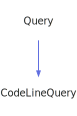

<a id="codelinequery"></a>
<h1>CodeLineQuery</h1>
<a id="classmddox_1_1doxygen_1_1codelinequery"></a>
<a href="https://github.com/CharlesCarley/MdDox#~">~</a>
<a href="indexpage.md#mddox">MdDox</a>
<span class="inline-text">/</span>
<a href="index.md#index">Index</a>
<span class="inline-text">/</span>
<a href="namespaceMdDox.md#mddox">MdDox</a>
<span class="inline-text">::</span>
<a href="namespaceMdDox_1_1Doxygen.md#doxygen">Doxygen</a>
<span class="inline-text">::</span>
<span class="bold-text"><b>CodeLineQuery</b></span>
<br/>
<br/>
<span class="inline-text">Implements the </span>
<code class="typewriter">codelineType</code>
<span class="inline-text"> scaffolding. </span>
<br/>
<a id="derived-from"></a>
<h4>Derived From</h4>
<div class="icon-link">
<a href="classMdDox_1_1Doxygen_1_1Query.md#query">MdDox::Doxygen::Query</a>
</div>
<br/>
<a id="public-methods"></a>
<h2>Public Methods</h2>
<span class="icon-list-item"><a href="#codelinequery" class="icon-list-item"><span class="icon-list-item">CodeLineQuery</span>
</a>
</span>
<br/>
<span class="icon-list-item"><a href="#codelinequery" class="icon-list-item"><span class="icon-list-item">CodeLineQuery</span>
</a>
</span>
<br/>
<span class="icon-list-item"><a href="#codelinequery" class="icon-list-item"><span class="icon-list-item">CodeLineQuery</span>
</a>
</span>
<br/>
<span class="icon-list-item"><a href="#foreachhighlight" class="icon-list-item"><span class="icon-list-item">foreachHighlight</span>
</a>
</span>
<br/>
<span class="icon-list-item"><a href="#getexternal" class="icon-list-item"><span class="icon-list-item">getExternal</span>
</a>
</span>
<br/>
<span class="icon-list-item"><a href="#getlineno" class="icon-list-item"><span class="icon-list-item">getLineNo</span>
</a>
</span>
<br/>
<span class="icon-list-item"><a href="#getrefid" class="icon-list-item"><span class="icon-list-item">getRefId</span>
</a>
</span>
<br/>
<span class="icon-list-item"><a href="#getrefkind" class="icon-list-item"><span class="icon-list-item">getRefKind</span>
</a>
</span>
<br/>
<span class="icon-list-item"><a href="#visit" class="icon-list-item"><span class="icon-list-item">visit</span>
</a>
</span>
<br/>
<a id="details"></a>
<h2>Details</h2>
<span class="inline-text">The following xml provides the source for the </span>
<span class="bold-text"><b>codelineType</b></span>
<span class="inline-text"> scaffolding.</span>

```xml
<xsd:complexType name="codelineType">
  <xsd:sequence>
    <xsd:element minOccurs="0" name="highlight" type="highlightType" maxOccurs="unbounded"/>
  </xsd:sequence>
  <xsd:attribute name="lineno" type="xsd:integer"/>
  <xsd:attribute name="refid" type="xsd:string"/>
  <xsd:attribute name="refkind" type="DoxRefKind"/>
  <xsd:attribute name="external" type="DoxBool"/>
</xsd:complexType>
```
<br/>
<a id="defined-in"></a>
<h4>Defined in</h4>
<span class="icon-list-item"><a href="https://github.com/CharlesCarley/MdDox/blob/master/Tools/Doxygen/CodeLineQuery.h#L68" class="icon-list-item"><span class="icon-list-item">CodeLineQuery.h</span>
</a>
</span>
<br/>
<br/>
<blockquote>
<span class="icon-list-item"><a href="#codelinequery" class="icon-list-item"><span class="icon-list-item">top</span>
</a>
</span>
</blockquote>
<a id="codelinequery"></a>
<h2>CodeLineQuery</h2>
<span class="bold-text"><b>CodeLineQuery</b></span>
<span class="italic-text"><i>(</i></span>
<span class="italic-text"><i>)</i></span>
<a id="defined-in"></a>
<h4>Defined in</h4>
<span class="icon-list-item"><a href="https://github.com/CharlesCarley/MdDox/blob/master/Tools/Doxygen/CodeLineQuery.h#L70" class="icon-list-item"><span class="icon-list-item">CodeLineQuery.h</span>
</a>
</span>
<br/>
<br/>
<blockquote>
<span class="icon-list-item"><a href="#codelinequery" class="icon-list-item"><span class="icon-list-item">top</span>
</a>
</span>
</blockquote>
<br/>
<a id="codelinequery"></a>
<h2>CodeLineQuery</h2>
<span class="bold-text"><b>CodeLineQuery</b></span>
<span class="italic-text"><i>(</i></span>
<div class="paragraph">
<span class="paragraph"><span class="inline-text">const </span>
<a href="classMdDox_1_1Doxygen_1_1CodeLineQuery.md#codelinequery">CodeLineQuery</a>
<span class="inline-text"> &amp;</span>
<span class="inline-text">other</span>
</span>
</div>
<span class="italic-text"><i>)</i></span>
<a id="defined-in"></a>
<h4>Defined in</h4>
<span class="icon-list-item"><a href="https://github.com/CharlesCarley/MdDox/blob/master/Tools/Doxygen/CodeLineQuery.h#L71" class="icon-list-item"><span class="icon-list-item">CodeLineQuery.h</span>
</a>
</span>
<br/>
<br/>
<blockquote>
<span class="icon-list-item"><a href="#codelinequery" class="icon-list-item"><span class="icon-list-item">top</span>
</a>
</span>
</blockquote>
<br/>
<a id="codelinequery"></a>
<h2>CodeLineQuery</h2>
<span class="bold-text"><b>CodeLineQuery</b></span>
<span class="italic-text"><i>(</i></span>
<div class="paragraph">
<span class="paragraph"><a href="classMdDox_1_1Xml_1_1Node.md#node">Xml::Node</a>
<span class="inline-text"> *</span>
<span class="inline-text">node</span>
</span>
</div>
<span class="italic-text"><i>)</i></span>
<a id="defined-in"></a>
<h4>Defined in</h4>
<span class="icon-list-item"><a href="https://github.com/CharlesCarley/MdDox/blob/master/Tools/Doxygen/CodeLineQuery.h#L73" class="icon-list-item"><span class="icon-list-item">CodeLineQuery.h</span>
</a>
</span>
<br/>
<br/>
<blockquote>
<span class="icon-list-item"><a href="#codelinequery" class="icon-list-item"><span class="icon-list-item">top</span>
</a>
</span>
</blockquote>
<br/>
<a id="foreachhighlight"></a>
<h2>foreachHighlight</h2>
<span class="inline-text">void</span>
<span class="bold-text"><b>foreachHighlight</b></span>
<span class="italic-text"><i>(</i></span>
<div class="paragraph">
<span class="paragraph"><span class="inline-text">const </span>
<a href="namespaceMdDox_1_1Doxygen.md#highlightqueryfunction">HighlightQueryFunction</a>
<span class="inline-text"> &amp;</span>
<span class="inline-text">invoke</span>
</span>
</div>
<span class="italic-text"><i>)</i></span>
<a id="details"></a>
<h4>Details</h4>
<span class="inline-text">Invokes the supplied callback on </span>
<span class="bold-text"><b>highlight</b></span>
<span class="inline-text"> elements. </span>
<br/>
<br/>
<a id="references"></a>
<h4>References</h4>
<div class="paragraph">
<span class="paragraph"><a href="classMdDox_1_1Doxygen_1_1Query.md#_node">_node</a>
</span>
</div>
<a id="defined-in"></a>
<h4>Defined in</h4>
<span class="icon-list-item"><a href="https://github.com/CharlesCarley/MdDox/blob/master/Tools/Doxygen/CodeLineQuery.h#L109" class="icon-list-item"><span class="icon-list-item">CodeLineQuery.h</span>
</a>
</span>
<br/>
<span class="icon-list-item"><a href="https://github.com/CharlesCarley/MdDox/blob/master/Tools/Doxygen/CodeLineQuery.cpp#L75" class="icon-list-item"><span class="icon-list-item">CodeLineQuery.cpp</span>
</a>
</span>
<br/>
<br/>
<blockquote>
<span class="icon-list-item"><a href="#codelinequery" class="icon-list-item"><span class="icon-list-item">top</span>
</a>
</span>
</blockquote>
<br/>
<a id="getexternal"></a>
<h2>getExternal</h2>
<a href="namespaceMdDox_1_1Doxygen.md#doxboolenum">DoxBoolEnum</a>
<span class="bold-text"><b>getExternal</b></span>
<span class="italic-text"><i>(</i></span>
<span class="italic-text"><i>)</i></span>
<a id="details"></a>
<h4>Details</h4>
<span class="inline-text">Provides access to the </span>
<span class="bold-text"><b>external</b></span>
<span class="inline-text"> element. </span>
<br/>
<br/>
<a id="returns"></a>
<h4>Returns</h4>
<span class="inline-text">The </span>
<span class="bold-text"><b>external</b></span>
<span class="inline-text"> enumerated value or -1 if the value is not found. </span>
<br/>
<br/>
<a id="references"></a>
<h4>References</h4>
<div class="paragraph">
<span class="paragraph"><a href="classMdDox_1_1Doxygen_1_1Query.md#_node">_node</a>
</span>
</div>
<div class="paragraph">
<span class="paragraph"><a href="classMdDox_1_1Doxygen_1_1DoxBool.md#get">get</a>
</span>
</div>
<div class="paragraph">
<span class="paragraph"><a href="classMdDox_1_1Xml_1_1Node.md#attribute">attribute</a>
</span>
</div>
<a id="defined-in"></a>
<h4>Defined in</h4>
<span class="icon-list-item"><a href="https://github.com/CharlesCarley/MdDox/blob/master/Tools/Doxygen/CodeLineQuery.h#L91" class="icon-list-item"><span class="icon-list-item">CodeLineQuery.h</span>
</a>
</span>
<br/>
<span class="icon-list-item"><a href="https://github.com/CharlesCarley/MdDox/blob/master/Tools/Doxygen/CodeLineQuery.cpp#L68" class="icon-list-item"><span class="icon-list-item">CodeLineQuery.cpp</span>
</a>
</span>
<br/>
<br/>
<blockquote>
<span class="icon-list-item"><a href="#codelinequery" class="icon-list-item"><span class="icon-list-item">top</span>
</a>
</span>
</blockquote>
<br/>
<a id="getlineno"></a>
<h2>getLineNo</h2>
<span class="inline-text">int64_t</span>
<span class="bold-text"><b>getLineNo</b></span>
<span class="italic-text"><i>(</i></span>
<div class="paragraph">
<span class="paragraph"><span class="inline-text">int64_t</span>
<span class="inline-text">def</span>
<span class="inline-text"> = </span>
<span class="inline-text">-1</span>
</span>
</div>
<span class="italic-text"><i>)</i></span>
<a id="details"></a>
<h4>Details</h4>
<span class="inline-text">Provides access to the </span>
<span class="bold-text"><b>lineno</b></span>
<span class="inline-text"> attribute. </span>
<br/>
<br/>
<a id="references"></a>
<h4>References</h4>
<div class="paragraph">
<span class="paragraph"><a href="classMdDox_1_1Doxygen_1_1Query.md#_node">_node</a>
</span>
</div>
<div class="paragraph">
<span class="paragraph"><a href="classMdDox_1_1Xml_1_1Node.md#integer">integer</a>
</span>
</div>
<a id="defined-in"></a>
<h4>Defined in</h4>
<span class="icon-list-item"><a href="https://github.com/CharlesCarley/MdDox/blob/master/Tools/Doxygen/CodeLineQuery.h#L104" class="icon-list-item"><span class="icon-list-item">CodeLineQuery.h</span>
</a>
</span>
<br/>
<span class="icon-list-item"><a href="https://github.com/CharlesCarley/MdDox/blob/master/Tools/Doxygen/CodeLineQuery.cpp#L56" class="icon-list-item"><span class="icon-list-item">CodeLineQuery.cpp</span>
</a>
</span>
<br/>
<br/>
<blockquote>
<span class="icon-list-item"><a href="#codelinequery" class="icon-list-item"><span class="icon-list-item">top</span>
</a>
</span>
</blockquote>
<br/>
<a id="getrefid"></a>
<h2>getRefId</h2>
<span class="inline-text">const </span>
<a href="namespaceMdDox.md#string">String</a>
<span class="inline-text"> &amp;</span>
<span class="bold-text"><b>getRefId</b></span>
<span class="italic-text"><i>(</i></span>
<div class="paragraph">
<span class="paragraph"><span class="inline-text">const </span>
<a href="namespaceMdDox.md#string">String</a>
<span class="inline-text"> &amp;</span>
<span class="inline-text">notFound</span>
<span class="inline-text"> = </span>
<span class="inline-text">&quot;&quot;</span>
</span>
</div>
<span class="italic-text"><i>)</i></span>
<a id="details"></a>
<h4>Details</h4>
<span class="inline-text">Provides access to the </span>
<span class="bold-text"><b>refid</b></span>
<span class="inline-text"> attribute. </span>
<br/>
<br/>
<a id="returns"></a>
<h4>Returns</h4>
<span class="inline-text">The </span>
<span class="bold-text"><b>refid</b></span>
<span class="inline-text"> enumerated value or an empty string the value is not found. </span>
<br/>
<br/>
<a id="references"></a>
<h4>References</h4>
<div class="paragraph">
<span class="paragraph"><a href="classMdDox_1_1Doxygen_1_1Query.md#_node">_node</a>
</span>
</div>
<div class="paragraph">
<span class="paragraph"><a href="classMdDox_1_1Xml_1_1Node.md#attribute">attribute</a>
</span>
</div>
<a id="defined-in"></a>
<h4>Defined in</h4>
<span class="icon-list-item"><a href="https://github.com/CharlesCarley/MdDox/blob/master/Tools/Doxygen/CodeLineQuery.h#L99" class="icon-list-item"><span class="icon-list-item">CodeLineQuery.h</span>
</a>
</span>
<br/>
<span class="icon-list-item"><a href="https://github.com/CharlesCarley/MdDox/blob/master/Tools/Doxygen/CodeLineQuery.cpp#L49" class="icon-list-item"><span class="icon-list-item">CodeLineQuery.cpp</span>
</a>
</span>
<br/>
<br/>
<blockquote>
<span class="icon-list-item"><a href="#codelinequery" class="icon-list-item"><span class="icon-list-item">top</span>
</a>
</span>
</blockquote>
<br/>
<a id="getrefkind"></a>
<h2>getRefKind</h2>
<a href="namespaceMdDox_1_1Doxygen.md#doxrefkindenum">DoxRefKindEnum</a>
<span class="bold-text"><b>getRefKind</b></span>
<span class="italic-text"><i>(</i></span>
<span class="italic-text"><i>)</i></span>
<a id="details"></a>
<h4>Details</h4>
<span class="inline-text">Provides access to the </span>
<span class="bold-text"><b>refkind</b></span>
<span class="inline-text"> element. </span>
<br/>
<br/>
<a id="returns"></a>
<h4>Returns</h4>
<span class="inline-text">The </span>
<span class="bold-text"><b>refkind</b></span>
<span class="inline-text"> enumerated value or -1 if the value is not found. </span>
<br/>
<br/>
<a id="references"></a>
<h4>References</h4>
<div class="paragraph">
<span class="paragraph"><a href="classMdDox_1_1Doxygen_1_1Query.md#_node">_node</a>
</span>
</div>
<div class="paragraph">
<span class="paragraph"><a href="classMdDox_1_1Doxygen_1_1DoxRefKind.md#get">get</a>
</span>
</div>
<div class="paragraph">
<span class="paragraph"><a href="classMdDox_1_1Xml_1_1Node.md#attribute">attribute</a>
</span>
</div>
<a id="defined-in"></a>
<h4>Defined in</h4>
<span class="icon-list-item"><a href="https://github.com/CharlesCarley/MdDox/blob/master/Tools/Doxygen/CodeLineQuery.h#L84" class="icon-list-item"><span class="icon-list-item">CodeLineQuery.h</span>
</a>
</span>
<br/>
<span class="icon-list-item"><a href="https://github.com/CharlesCarley/MdDox/blob/master/Tools/Doxygen/CodeLineQuery.cpp#L61" class="icon-list-item"><span class="icon-list-item">CodeLineQuery.cpp</span>
</a>
</span>
<br/>
<br/>
<blockquote>
<span class="icon-list-item"><a href="#codelinequery" class="icon-list-item"><span class="icon-list-item">top</span>
</a>
</span>
</blockquote>
<br/>
<a id="visit"></a>
<h2>visit</h2>
<span class="inline-text">void</span>
<span class="bold-text"><b>visit</b></span>
<span class="italic-text"><i>(</i></span>
<div class="paragraph">
<span class="paragraph"><a href="classMdDox_1_1Doxygen_1_1Visitors_1_1CodeLineQueryVisitor.md#codelinequeryvisitor">Visitors::CodeLineQueryVisitor</a>
<span class="inline-text"> *</span>
<span class="inline-text"> = </span>
<span class="inline-text">visitor</span>
</span>
</div>
<span class="italic-text"><i>)</i></span>
<a id="references"></a>
<h4>References</h4>
<div class="paragraph">
<span class="paragraph"><a href="classMdDox_1_1Doxygen_1_1Query.md#_node">_node</a>
</span>
</div>
<div class="paragraph">
<span class="paragraph"><a href="classMdDox_1_1Xml_1_1Node.md#children">children</a>
</span>
</div>
<div class="paragraph">
<span class="paragraph"><a href="namespaceMdDox_1_1Doxygen.md#doxtextnode">DoxTextNode</a>
</span>
</div>
<div class="paragraph">
<span class="paragraph"><a href="classMdDox_1_1Doxygen_1_1Visitors_1_1CodeLineQueryVisitor.md#visitedtext">visitedText</a>
</span>
</div>
<div class="paragraph">
<span class="paragraph"><a href="classMdDox_1_1Doxygen_1_1Visitors_1_1CodeLineQueryVisitor.md#visitedhighlight">visitedHighlight</a>
</span>
</div>
<a id="defined-in"></a>
<h4>Defined in</h4>
<span class="icon-list-item"><a href="https://github.com/CharlesCarley/MdDox/blob/master/Tools/Doxygen/CodeLineQuery.h#L78" class="icon-list-item"><span class="icon-list-item">CodeLineQuery.h</span>
</a>
</span>
<br/>
<span class="icon-list-item"><a href="https://github.com/CharlesCarley/MdDox/blob/master/Tools/Doxygen/CodeLineQuery.cpp#L29" class="icon-list-item"><span class="icon-list-item">CodeLineQuery.cpp</span>
</a>
</span>
<br/>
<br/>
<blockquote>
<span class="icon-list-item"><a href="#codelinequery" class="icon-list-item"><span class="icon-list-item">top</span>
</a>
</span>
</blockquote>
<br/>
</div>
</div>
</body>
</html>
