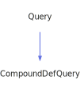

<a id="compounddefquery"></a>
<h1>CompoundDefQuery</h1>
<a id="classMdDox_1_1Doxygen_1_1CompoundDefQuery"></a>
<a href="https://github.com/CharlesCarley/MdDox#~">~</a>
<a href="indexpage.md#mddox">MdDox</a>
<span class="inline-text">/</span>
<a href="index.md#index">Index</a>
<span class="inline-text">/</span>
<a href="namespaceMdDox.md#mddox">MdDox</a>
<span class="inline-text">::</span>
<a href="namespaceMdDox_1_1Doxygen.md#doxygen">Doxygen</a>
<span class="inline-text">::</span>
<span class="bold-text"><b>CompoundDefQuery</b></span>
<br/>
<br/>
<span class="inline-text">Implements the </span>
<code class="typewriter">compounddefType</code>
<span class="inline-text"> scaffolding. </span>
<br/>
<a id="derived-from"></a>
<h4>Derived From</h4>
<div class="icon-link">
<a href="classMdDox_1_1Doxygen_1_1Query.md#query">MdDox::Doxygen::Query</a>
</div>
<br/>
<a id="public-methods"></a>
<h2>Public Methods</h2>
<span class="icon-list-item"><a href="#compounddefquery" class="icon-list-item"><span class="icon-list-item">CompoundDefQuery</span>
</a>
</span>
<br/>
<span class="icon-list-item"><a href="#compounddefquery" class="icon-list-item"><span class="icon-list-item">CompoundDefQuery</span>
</a>
</span>
<br/>
<span class="icon-list-item"><a href="#compounddefquery" class="icon-list-item"><span class="icon-list-item">CompoundDefQuery</span>
</a>
</span>
<br/>
<span class="icon-list-item"><a href="#foreachbasecompoundref" class="icon-list-item"><span class="icon-list-item">foreachBaseCompoundRef</span>
</a>
</span>
<br/>
<span class="icon-list-item"><a href="#foreachderivedcompoundref" class="icon-list-item"><span class="icon-list-item">foreachDerivedCompoundRef</span>
</a>
</span>
<br/>
<span class="icon-list-item"><a href="#foreachincludedby" class="icon-list-item"><span class="icon-list-item">foreachIncludedBy</span>
</a>
</span>
<br/>
<span class="icon-list-item"><a href="#foreachincludes" class="icon-list-item"><span class="icon-list-item">foreachIncludes</span>
</a>
</span>
<br/>
<span class="icon-list-item"><a href="#foreachinnerclass" class="icon-list-item"><span class="icon-list-item">foreachInnerClass</span>
</a>
</span>
<br/>
<span class="icon-list-item"><a href="#foreachinnerdir" class="icon-list-item"><span class="icon-list-item">foreachInnerDir</span>
</a>
</span>
<br/>
<span class="icon-list-item"><a href="#foreachinnerfile" class="icon-list-item"><span class="icon-list-item">foreachInnerFile</span>
</a>
</span>
<br/>
<span class="icon-list-item"><a href="#foreachinnergroup" class="icon-list-item"><span class="icon-list-item">foreachInnerGroup</span>
</a>
</span>
<br/>
<span class="icon-list-item"><a href="#foreachinnernamespace" class="icon-list-item"><span class="icon-list-item">foreachInnerNamespace</span>
</a>
</span>
<br/>
<span class="icon-list-item"><a href="#foreachinnerpage" class="icon-list-item"><span class="icon-list-item">foreachInnerPage</span>
</a>
</span>
<br/>
<span class="icon-list-item"><a href="#foreachsectiondef" class="icon-list-item"><span class="icon-list-item">foreachSectionDef</span>
</a>
</span>
<br/>
<span class="icon-list-item"><a href="#getabstract" class="icon-list-item"><span class="icon-list-item">getAbstract</span>
</a>
</span>
<br/>
<span class="icon-list-item"><a href="#getbriefdescription" class="icon-list-item"><span class="icon-list-item">getBriefDescription</span>
</a>
</span>
<br/>
<span class="icon-list-item"><a href="#getbriefdescription" class="icon-list-item"><span class="icon-list-item">getBriefDescription</span>
</a>
</span>
<br/>
<span class="icon-list-item"><a href="#getcollaborationgraph" class="icon-list-item"><span class="icon-list-item">getCollaborationGraph</span>
</a>
</span>
<br/>
<span class="icon-list-item"><a href="#getcollaborationgraph" class="icon-list-item"><span class="icon-list-item">getCollaborationGraph</span>
</a>
</span>
<br/>
<span class="icon-list-item"><a href="#getcompoundname" class="icon-list-item"><span class="icon-list-item">getCompoundName</span>
</a>
</span>
<br/>
<span class="icon-list-item"><a href="#getdetaileddescription" class="icon-list-item"><span class="icon-list-item">getDetailedDescription</span>
</a>
</span>
<br/>
<span class="icon-list-item"><a href="#getdetaileddescription" class="icon-list-item"><span class="icon-list-item">getDetailedDescription</span>
</a>
</span>
<br/>
<span class="icon-list-item"><a href="#getfinal" class="icon-list-item"><span class="icon-list-item">getFinal</span>
</a>
</span>
<br/>
<span class="icon-list-item"><a href="#getid" class="icon-list-item"><span class="icon-list-item">getId</span>
</a>
</span>
<br/>
<span class="icon-list-item"><a href="#getincdepgraph" class="icon-list-item"><span class="icon-list-item">getIncDepGraph</span>
</a>
</span>
<br/>
<span class="icon-list-item"><a href="#getincdepgraph" class="icon-list-item"><span class="icon-list-item">getIncDepGraph</span>
</a>
</span>
<br/>
<span class="icon-list-item"><a href="#getinheritancegraph" class="icon-list-item"><span class="icon-list-item">getInheritanceGraph</span>
</a>
</span>
<br/>
<span class="icon-list-item"><a href="#getinheritancegraph" class="icon-list-item"><span class="icon-list-item">getInheritanceGraph</span>
</a>
</span>
<br/>
<span class="icon-list-item"><a href="#getinvincdepgraph" class="icon-list-item"><span class="icon-list-item">getInvIncDepGraph</span>
</a>
</span>
<br/>
<span class="icon-list-item"><a href="#getinvincdepgraph" class="icon-list-item"><span class="icon-list-item">getInvIncDepGraph</span>
</a>
</span>
<br/>
<span class="icon-list-item"><a href="#getkind" class="icon-list-item"><span class="icon-list-item">getKind</span>
</a>
</span>
<br/>
<span class="icon-list-item"><a href="#getlanguage" class="icon-list-item"><span class="icon-list-item">getLanguage</span>
</a>
</span>
<br/>
<span class="icon-list-item"><a href="#getlistofallmembers" class="icon-list-item"><span class="icon-list-item">getListOfAllMembers</span>
</a>
</span>
<br/>
<span class="icon-list-item"><a href="#getlistofallmembers" class="icon-list-item"><span class="icon-list-item">getListOfAllMembers</span>
</a>
</span>
<br/>
<span class="icon-list-item"><a href="#getlocation" class="icon-list-item"><span class="icon-list-item">getLocation</span>
</a>
</span>
<br/>
<span class="icon-list-item"><a href="#getlocation" class="icon-list-item"><span class="icon-list-item">getLocation</span>
</a>
</span>
<br/>
<span class="icon-list-item"><a href="#getprogramlisting" class="icon-list-item"><span class="icon-list-item">getProgramListing</span>
</a>
</span>
<br/>
<span class="icon-list-item"><a href="#getprogramlisting" class="icon-list-item"><span class="icon-list-item">getProgramListing</span>
</a>
</span>
<br/>
<span class="icon-list-item"><a href="#getprot" class="icon-list-item"><span class="icon-list-item">getProt</span>
</a>
</span>
<br/>
<span class="icon-list-item"><a href="#getsealed" class="icon-list-item"><span class="icon-list-item">getSealed</span>
</a>
</span>
<br/>
<span class="icon-list-item"><a href="#gettableofcontents" class="icon-list-item"><span class="icon-list-item">getTableOfContents</span>
</a>
</span>
<br/>
<span class="icon-list-item"><a href="#gettemplateparamlist" class="icon-list-item"><span class="icon-list-item">getTemplateParamList</span>
</a>
</span>
<br/>
<span class="icon-list-item"><a href="#gettemplateparamlist" class="icon-list-item"><span class="icon-list-item">getTemplateParamList</span>
</a>
</span>
<br/>
<span class="icon-list-item"><a href="#gettitle" class="icon-list-item"><span class="icon-list-item">getTitle</span>
</a>
</span>
<br/>
<span class="icon-list-item"><a href="#visit" class="icon-list-item"><span class="icon-list-item">visit</span>
</a>
</span>
<br/>
<a id="details"></a>
<h2>Details</h2>
<span class="inline-text">The following xml provides the source for the </span>
<span class="bold-text"><b>compounddefType</b></span>
<span class="inline-text"> scaffolding.</span>

```xml
<xsd:complexType name="compounddefType">
  <xsd:sequence>
    <xsd:element name="compoundname" type="xsd:string"/>
    <xsd:element minOccurs="0" name="title" type="xsd:string"/>
    <xsd:element minOccurs="0" name="basecompoundref" type="compoundRefType" maxOccurs="unbounded"/>
    <xsd:element minOccurs="0" name="derivedcompoundref" type="compoundRefType" maxOccurs="unbounded"/>
    <xsd:element minOccurs="0" name="includes" type="incType" maxOccurs="unbounded"/>
    <xsd:element minOccurs="0" name="includedby" type="incType" maxOccurs="unbounded"/>
    <xsd:element minOccurs="0" name="incdepgraph" type="graphType"/>
    <xsd:element minOccurs="0" name="invincdepgraph" type="graphType"/>
    <xsd:element minOccurs="0" name="innerdir" type="refType" maxOccurs="unbounded"/>
    <xsd:element minOccurs="0" name="innerfile" type="refType" maxOccurs="unbounded"/>
    <xsd:element minOccurs="0" name="innerclass" type="refType" maxOccurs="unbounded"/>
    <xsd:element minOccurs="0" name="innernamespace" type="refType" maxOccurs="unbounded"/>
    <xsd:element minOccurs="0" name="innerpage" type="refType" maxOccurs="unbounded"/>
    <xsd:element minOccurs="0" name="innergroup" type="refType" maxOccurs="unbounded"/>
    <xsd:element minOccurs="0" name="templateparamlist" type="templateparamlistType"/>
    <xsd:element minOccurs="0" name="sectiondef" type="sectiondefType" maxOccurs="unbounded"/>
    <xsd:element minOccurs="0" name="tableofcontents" maxOccurs="1"/>
    <xsd:element minOccurs="0" name="briefdescription" type="descriptionType"/>
    <xsd:element minOccurs="0" name="detaileddescription" type="descriptionType"/>
    <xsd:element minOccurs="0" name="inheritancegraph" type="graphType"/>
    <xsd:element minOccurs="0" name="collaborationgraph" type="graphType"/>
    <xsd:element minOccurs="0" name="programlisting" type="listingType"/>
    <xsd:element minOccurs="0" name="location" type="locationType"/>
    <xsd:element minOccurs="0" name="listofallmembers" type="listofallmembersType"/>
  </xsd:sequence>
  <xsd:attribute name="id" type="xsd:string"/>
  <xsd:attribute name="kind" type="DoxCompoundKind"/>
  <xsd:attribute name="language" type="DoxLanguage" use="optional"/>
  <xsd:attribute name="prot" type="DoxProtectionKind"/>
  <xsd:attribute name="final" type="DoxBool" use="optional"/>
  <xsd:attribute name="sealed" type="DoxBool" use="optional"/>
  <xsd:attribute name="abstract" type="DoxBool" use="optional"/>
</xsd:complexType>
```
<br/>
<a id="defined-in"></a>
<h4>Defined in</h4>
<span class="icon-list-item"><a href="https://github.com/CharlesCarley/MdDox/blob/master/Tools/Doxygen/CompoundDefQuery.h#L211" class="icon-list-item"><span class="icon-list-item">CompoundDefQuery.h</span>
</a>
</span>
<a id="compounddefquery"></a>
<h2>CompoundDefQuery</h2>
<span class="bold-text"><b>CompoundDefQuery</b></span>
<span class="italic-text"><i>(</i></span>
<span class="italic-text"><i>)</i></span>
<a id="defined-in"></a>
<h4>Defined in</h4>
<span class="icon-list-item"><a href="https://github.com/CharlesCarley/MdDox/blob/master/Tools/Doxygen/CompoundDefQuery.h#L213" class="icon-list-item"><span class="icon-list-item">CompoundDefQuery.h</span>
</a>
</span>
<br/>
<a id="compounddefquery"></a>
<h2>CompoundDefQuery</h2>
<span class="bold-text"><b>CompoundDefQuery</b></span>
<span class="italic-text"><i>(</i></span>
<div class="paragraph">
<span class="paragraph"><span class="inline-text">const </span>
<a href="classMdDox_1_1Doxygen_1_1CompoundDefQuery.md#compounddefquery">CompoundDefQuery</a>
<span class="inline-text"> &amp;</span>
<span class="inline-text">other</span>
</span>
</div>
<span class="italic-text"><i>)</i></span>
<a id="defined-in"></a>
<h4>Defined in</h4>
<span class="icon-list-item"><a href="https://github.com/CharlesCarley/MdDox/blob/master/Tools/Doxygen/CompoundDefQuery.h#L214" class="icon-list-item"><span class="icon-list-item">CompoundDefQuery.h</span>
</a>
</span>
<br/>
<a id="compounddefquery"></a>
<h2>CompoundDefQuery</h2>
<span class="bold-text"><b>CompoundDefQuery</b></span>
<span class="italic-text"><i>(</i></span>
<div class="paragraph">
<span class="paragraph"><a href="classMdDox_1_1Xml_1_1Node.md#node">Xml::Node</a>
<span class="inline-text"> *</span>
<span class="inline-text">node</span>
</span>
</div>
<span class="italic-text"><i>)</i></span>
<a id="defined-in"></a>
<h4>Defined in</h4>
<span class="icon-list-item"><a href="https://github.com/CharlesCarley/MdDox/blob/master/Tools/Doxygen/CompoundDefQuery.h#L216" class="icon-list-item"><span class="icon-list-item">CompoundDefQuery.h</span>
</a>
</span>
<br/>
<a id="foreachbasecompoundref"></a>
<h2>foreachBaseCompoundRef</h2>
<span class="inline-text">void</span>
<span class="bold-text"><b>foreachBaseCompoundRef</b></span>
<span class="italic-text"><i>(</i></span>
<div class="paragraph">
<span class="paragraph"><span class="inline-text">const </span>
<a href="namespaceMdDox_1_1Doxygen.md#compoundrefqueryfunction">CompoundRefQueryFunction</a>
<span class="inline-text"> &amp;</span>
<span class="inline-text">invoke</span>
</span>
</div>
<span class="italic-text"><i>)</i></span>
<a id="details"></a>
<h4>Details</h4>
<span class="inline-text">Invokes the supplied callback on </span>
<span class="bold-text"><b>basecompoundref</b></span>
<span class="inline-text"> elements. </span>
<br/>
<br/>
<a id="references"></a>
<h4>References</h4>
<div class="paragraph">
<span class="paragraph"><a href="classMdDox_1_1Doxygen_1_1Query.md#_node">_node</a>
</span>
</div>
<a id="defined-in"></a>
<h4>Defined in</h4>
<span class="icon-list-item"><a href="https://github.com/CharlesCarley/MdDox/blob/master/Tools/Doxygen/CompoundDefQuery.h#L396" class="icon-list-item"><span class="icon-list-item">CompoundDefQuery.h</span>
</a>
</span>
<br/>
<span class="icon-list-item"><a href="https://github.com/CharlesCarley/MdDox/blob/master/Tools/Doxygen/CompoundDefQuery.cpp#L383" class="icon-list-item"><span class="icon-list-item">CompoundDefQuery.cpp</span>
</a>
</span>
<br/>
<a id="foreachderivedcompoundref"></a>
<h2>foreachDerivedCompoundRef</h2>
<span class="inline-text">void</span>
<span class="bold-text"><b>foreachDerivedCompoundRef</b></span>
<span class="italic-text"><i>(</i></span>
<div class="paragraph">
<span class="paragraph"><span class="inline-text">const </span>
<a href="namespaceMdDox_1_1Doxygen.md#compoundrefqueryfunction">CompoundRefQueryFunction</a>
<span class="inline-text"> &amp;</span>
<span class="inline-text">invoke</span>
</span>
</div>
<span class="italic-text"><i>)</i></span>
<a id="details"></a>
<h4>Details</h4>
<span class="inline-text">Invokes the supplied callback on </span>
<span class="bold-text"><b>derivedcompoundref</b></span>
<span class="inline-text"> elements. </span>
<br/>
<br/>
<a id="references"></a>
<h4>References</h4>
<div class="paragraph">
<span class="paragraph"><a href="classMdDox_1_1Doxygen_1_1Query.md#_node">_node</a>
</span>
</div>
<a id="defined-in"></a>
<h4>Defined in</h4>
<span class="icon-list-item"><a href="https://github.com/CharlesCarley/MdDox/blob/master/Tools/Doxygen/CompoundDefQuery.h#L401" class="icon-list-item"><span class="icon-list-item">CompoundDefQuery.h</span>
</a>
</span>
<br/>
<span class="icon-list-item"><a href="https://github.com/CharlesCarley/MdDox/blob/master/Tools/Doxygen/CompoundDefQuery.cpp#L388" class="icon-list-item"><span class="icon-list-item">CompoundDefQuery.cpp</span>
</a>
</span>
<br/>
<a id="foreachincludedby"></a>
<h2>foreachIncludedBy</h2>
<span class="inline-text">void</span>
<span class="bold-text"><b>foreachIncludedBy</b></span>
<span class="italic-text"><i>(</i></span>
<div class="paragraph">
<span class="paragraph"><span class="inline-text">const </span>
<a href="namespaceMdDox_1_1Doxygen.md#incqueryfunction">IncQueryFunction</a>
<span class="inline-text"> &amp;</span>
<span class="inline-text">invoke</span>
</span>
</div>
<span class="italic-text"><i>)</i></span>
<a id="details"></a>
<h4>Details</h4>
<span class="inline-text">Invokes the supplied callback on </span>
<span class="bold-text"><b>includedby</b></span>
<span class="inline-text"> elements. </span>
<br/>
<br/>
<a id="references"></a>
<h4>References</h4>
<div class="paragraph">
<span class="paragraph"><a href="classMdDox_1_1Doxygen_1_1Query.md#_node">_node</a>
</span>
</div>
<a id="defined-in"></a>
<h4>Defined in</h4>
<span class="icon-list-item"><a href="https://github.com/CharlesCarley/MdDox/blob/master/Tools/Doxygen/CompoundDefQuery.h#L411" class="icon-list-item"><span class="icon-list-item">CompoundDefQuery.h</span>
</a>
</span>
<br/>
<span class="icon-list-item"><a href="https://github.com/CharlesCarley/MdDox/blob/master/Tools/Doxygen/CompoundDefQuery.cpp#L398" class="icon-list-item"><span class="icon-list-item">CompoundDefQuery.cpp</span>
</a>
</span>
<br/>
<a id="foreachincludes"></a>
<h2>foreachIncludes</h2>
<span class="inline-text">void</span>
<span class="bold-text"><b>foreachIncludes</b></span>
<span class="italic-text"><i>(</i></span>
<div class="paragraph">
<span class="paragraph"><span class="inline-text">const </span>
<a href="namespaceMdDox_1_1Doxygen.md#incqueryfunction">IncQueryFunction</a>
<span class="inline-text"> &amp;</span>
<span class="inline-text">invoke</span>
</span>
</div>
<span class="italic-text"><i>)</i></span>
<a id="details"></a>
<h4>Details</h4>
<span class="inline-text">Invokes the supplied callback on </span>
<span class="bold-text"><b>includes</b></span>
<span class="inline-text"> elements. </span>
<br/>
<br/>
<a id="references"></a>
<h4>References</h4>
<div class="paragraph">
<span class="paragraph"><a href="classMdDox_1_1Doxygen_1_1Query.md#_node">_node</a>
</span>
</div>
<a id="defined-in"></a>
<h4>Defined in</h4>
<span class="icon-list-item"><a href="https://github.com/CharlesCarley/MdDox/blob/master/Tools/Doxygen/CompoundDefQuery.h#L406" class="icon-list-item"><span class="icon-list-item">CompoundDefQuery.h</span>
</a>
</span>
<br/>
<span class="icon-list-item"><a href="https://github.com/CharlesCarley/MdDox/blob/master/Tools/Doxygen/CompoundDefQuery.cpp#L393" class="icon-list-item"><span class="icon-list-item">CompoundDefQuery.cpp</span>
</a>
</span>
<br/>
<a id="foreachinnerclass"></a>
<h2>foreachInnerClass</h2>
<span class="inline-text">void</span>
<span class="bold-text"><b>foreachInnerClass</b></span>
<span class="italic-text"><i>(</i></span>
<div class="paragraph">
<span class="paragraph"><span class="inline-text">const </span>
<a href="namespaceMdDox_1_1Doxygen.md#refqueryfunction">RefQueryFunction</a>
<span class="inline-text"> &amp;</span>
<span class="inline-text">invoke</span>
</span>
</div>
<span class="italic-text"><i>)</i></span>
<a id="details"></a>
<h4>Details</h4>
<span class="inline-text">Invokes the supplied callback on </span>
<span class="bold-text"><b>innerclass</b></span>
<span class="inline-text"> elements. </span>
<br/>
<br/>
<a id="references"></a>
<h4>References</h4>
<div class="paragraph">
<span class="paragraph"><a href="classMdDox_1_1Doxygen_1_1Query.md#_node">_node</a>
</span>
</div>
<a id="defined-in"></a>
<h4>Defined in</h4>
<span class="icon-list-item"><a href="https://github.com/CharlesCarley/MdDox/blob/master/Tools/Doxygen/CompoundDefQuery.h#L426" class="icon-list-item"><span class="icon-list-item">CompoundDefQuery.h</span>
</a>
</span>
<br/>
<span class="icon-list-item"><a href="https://github.com/CharlesCarley/MdDox/blob/master/Tools/Doxygen/CompoundDefQuery.cpp#L413" class="icon-list-item"><span class="icon-list-item">CompoundDefQuery.cpp</span>
</a>
</span>
<br/>
<a id="foreachinnerdir"></a>
<h2>foreachInnerDir</h2>
<span class="inline-text">void</span>
<span class="bold-text"><b>foreachInnerDir</b></span>
<span class="italic-text"><i>(</i></span>
<div class="paragraph">
<span class="paragraph"><span class="inline-text">const </span>
<a href="namespaceMdDox_1_1Doxygen.md#refqueryfunction">RefQueryFunction</a>
<span class="inline-text"> &amp;</span>
<span class="inline-text">invoke</span>
</span>
</div>
<span class="italic-text"><i>)</i></span>
<a id="details"></a>
<h4>Details</h4>
<span class="inline-text">Invokes the supplied callback on </span>
<span class="bold-text"><b>innerdir</b></span>
<span class="inline-text"> elements. </span>
<br/>
<br/>
<a id="references"></a>
<h4>References</h4>
<div class="paragraph">
<span class="paragraph"><a href="classMdDox_1_1Doxygen_1_1Query.md#_node">_node</a>
</span>
</div>
<a id="defined-in"></a>
<h4>Defined in</h4>
<span class="icon-list-item"><a href="https://github.com/CharlesCarley/MdDox/blob/master/Tools/Doxygen/CompoundDefQuery.h#L416" class="icon-list-item"><span class="icon-list-item">CompoundDefQuery.h</span>
</a>
</span>
<br/>
<span class="icon-list-item"><a href="https://github.com/CharlesCarley/MdDox/blob/master/Tools/Doxygen/CompoundDefQuery.cpp#L403" class="icon-list-item"><span class="icon-list-item">CompoundDefQuery.cpp</span>
</a>
</span>
<br/>
<a id="foreachinnerfile"></a>
<h2>foreachInnerFile</h2>
<span class="inline-text">void</span>
<span class="bold-text"><b>foreachInnerFile</b></span>
<span class="italic-text"><i>(</i></span>
<div class="paragraph">
<span class="paragraph"><span class="inline-text">const </span>
<a href="namespaceMdDox_1_1Doxygen.md#refqueryfunction">RefQueryFunction</a>
<span class="inline-text"> &amp;</span>
<span class="inline-text">invoke</span>
</span>
</div>
<span class="italic-text"><i>)</i></span>
<a id="details"></a>
<h4>Details</h4>
<span class="inline-text">Invokes the supplied callback on </span>
<span class="bold-text"><b>innerfile</b></span>
<span class="inline-text"> elements. </span>
<br/>
<br/>
<a id="references"></a>
<h4>References</h4>
<div class="paragraph">
<span class="paragraph"><a href="classMdDox_1_1Doxygen_1_1Query.md#_node">_node</a>
</span>
</div>
<a id="defined-in"></a>
<h4>Defined in</h4>
<span class="icon-list-item"><a href="https://github.com/CharlesCarley/MdDox/blob/master/Tools/Doxygen/CompoundDefQuery.h#L421" class="icon-list-item"><span class="icon-list-item">CompoundDefQuery.h</span>
</a>
</span>
<br/>
<span class="icon-list-item"><a href="https://github.com/CharlesCarley/MdDox/blob/master/Tools/Doxygen/CompoundDefQuery.cpp#L408" class="icon-list-item"><span class="icon-list-item">CompoundDefQuery.cpp</span>
</a>
</span>
<br/>
<a id="foreachinnergroup"></a>
<h2>foreachInnerGroup</h2>
<span class="inline-text">void</span>
<span class="bold-text"><b>foreachInnerGroup</b></span>
<span class="italic-text"><i>(</i></span>
<div class="paragraph">
<span class="paragraph"><span class="inline-text">const </span>
<a href="namespaceMdDox_1_1Doxygen.md#refqueryfunction">RefQueryFunction</a>
<span class="inline-text"> &amp;</span>
<span class="inline-text">invoke</span>
</span>
</div>
<span class="italic-text"><i>)</i></span>
<a id="details"></a>
<h4>Details</h4>
<span class="inline-text">Invokes the supplied callback on </span>
<span class="bold-text"><b>innergroup</b></span>
<span class="inline-text"> elements. </span>
<br/>
<br/>
<a id="references"></a>
<h4>References</h4>
<div class="paragraph">
<span class="paragraph"><a href="classMdDox_1_1Doxygen_1_1Query.md#_node">_node</a>
</span>
</div>
<a id="defined-in"></a>
<h4>Defined in</h4>
<span class="icon-list-item"><a href="https://github.com/CharlesCarley/MdDox/blob/master/Tools/Doxygen/CompoundDefQuery.h#L441" class="icon-list-item"><span class="icon-list-item">CompoundDefQuery.h</span>
</a>
</span>
<br/>
<span class="icon-list-item"><a href="https://github.com/CharlesCarley/MdDox/blob/master/Tools/Doxygen/CompoundDefQuery.cpp#L428" class="icon-list-item"><span class="icon-list-item">CompoundDefQuery.cpp</span>
</a>
</span>
<br/>
<a id="foreachinnernamespace"></a>
<h2>foreachInnerNamespace</h2>
<span class="inline-text">void</span>
<span class="bold-text"><b>foreachInnerNamespace</b></span>
<span class="italic-text"><i>(</i></span>
<div class="paragraph">
<span class="paragraph"><span class="inline-text">const </span>
<a href="namespaceMdDox_1_1Doxygen.md#refqueryfunction">RefQueryFunction</a>
<span class="inline-text"> &amp;</span>
<span class="inline-text">invoke</span>
</span>
</div>
<span class="italic-text"><i>)</i></span>
<a id="details"></a>
<h4>Details</h4>
<span class="inline-text">Invokes the supplied callback on </span>
<span class="bold-text"><b>innernamespace</b></span>
<span class="inline-text"> elements. </span>
<br/>
<br/>
<a id="references"></a>
<h4>References</h4>
<div class="paragraph">
<span class="paragraph"><a href="classMdDox_1_1Doxygen_1_1Query.md#_node">_node</a>
</span>
</div>
<a id="defined-in"></a>
<h4>Defined in</h4>
<span class="icon-list-item"><a href="https://github.com/CharlesCarley/MdDox/blob/master/Tools/Doxygen/CompoundDefQuery.h#L431" class="icon-list-item"><span class="icon-list-item">CompoundDefQuery.h</span>
</a>
</span>
<br/>
<span class="icon-list-item"><a href="https://github.com/CharlesCarley/MdDox/blob/master/Tools/Doxygen/CompoundDefQuery.cpp#L418" class="icon-list-item"><span class="icon-list-item">CompoundDefQuery.cpp</span>
</a>
</span>
<br/>
<a id="foreachinnerpage"></a>
<h2>foreachInnerPage</h2>
<span class="inline-text">void</span>
<span class="bold-text"><b>foreachInnerPage</b></span>
<span class="italic-text"><i>(</i></span>
<div class="paragraph">
<span class="paragraph"><span class="inline-text">const </span>
<a href="namespaceMdDox_1_1Doxygen.md#refqueryfunction">RefQueryFunction</a>
<span class="inline-text"> &amp;</span>
<span class="inline-text">invoke</span>
</span>
</div>
<span class="italic-text"><i>)</i></span>
<a id="details"></a>
<h4>Details</h4>
<span class="inline-text">Invokes the supplied callback on </span>
<span class="bold-text"><b>innerpage</b></span>
<span class="inline-text"> elements. </span>
<br/>
<br/>
<a id="references"></a>
<h4>References</h4>
<div class="paragraph">
<span class="paragraph"><a href="classMdDox_1_1Doxygen_1_1Query.md#_node">_node</a>
</span>
</div>
<a id="defined-in"></a>
<h4>Defined in</h4>
<span class="icon-list-item"><a href="https://github.com/CharlesCarley/MdDox/blob/master/Tools/Doxygen/CompoundDefQuery.h#L436" class="icon-list-item"><span class="icon-list-item">CompoundDefQuery.h</span>
</a>
</span>
<br/>
<span class="icon-list-item"><a href="https://github.com/CharlesCarley/MdDox/blob/master/Tools/Doxygen/CompoundDefQuery.cpp#L423" class="icon-list-item"><span class="icon-list-item">CompoundDefQuery.cpp</span>
</a>
</span>
<br/>
<a id="foreachsectiondef"></a>
<h2>foreachSectionDef</h2>
<span class="inline-text">void</span>
<span class="bold-text"><b>foreachSectionDef</b></span>
<span class="italic-text"><i>(</i></span>
<div class="paragraph">
<span class="paragraph"><span class="inline-text">const </span>
<a href="namespaceMdDox_1_1Doxygen.md#sectiondefqueryfunction">SectionDefQueryFunction</a>
<span class="inline-text"> &amp;</span>
<span class="inline-text">invoke</span>
</span>
</div>
<span class="italic-text"><i>)</i></span>
<a id="details"></a>
<h4>Details</h4>
<span class="inline-text">Invokes the supplied callback on </span>
<span class="bold-text"><b>sectiondef</b></span>
<span class="inline-text"> elements. </span>
<br/>
<br/>
<a id="references"></a>
<h4>References</h4>
<div class="paragraph">
<span class="paragraph"><a href="classMdDox_1_1Doxygen_1_1Query.md#_node">_node</a>
</span>
</div>
<a id="defined-in"></a>
<h4>Defined in</h4>
<span class="icon-list-item"><a href="https://github.com/CharlesCarley/MdDox/blob/master/Tools/Doxygen/CompoundDefQuery.h#L446" class="icon-list-item"><span class="icon-list-item">CompoundDefQuery.h</span>
</a>
</span>
<br/>
<span class="icon-list-item"><a href="https://github.com/CharlesCarley/MdDox/blob/master/Tools/Doxygen/CompoundDefQuery.cpp#L433" class="icon-list-item"><span class="icon-list-item">CompoundDefQuery.cpp</span>
</a>
</span>
<br/>
<a id="getabstract"></a>
<h2>getAbstract</h2>
<a href="namespaceMdDox_1_1Doxygen.md#doxboolenum">DoxBoolEnum</a>
<span class="bold-text"><b>getAbstract</b></span>
<span class="italic-text"><i>(</i></span>
<span class="italic-text"><i>)</i></span>
<a id="details"></a>
<h4>Details</h4>
<span class="inline-text">Provides access to the </span>
<span class="bold-text"><b>abstract</b></span>
<span class="inline-text"> element. </span>
<br/>
<br/>
<a id="returns"></a>
<h4>Returns</h4>
<span class="inline-text">The </span>
<span class="bold-text"><b>abstract</b></span>
<span class="inline-text"> enumerated value or -1 if the value is not found. </span>
<br/>
<br/>
<a id="references"></a>
<h4>References</h4>
<div class="paragraph">
<span class="paragraph"><a href="classMdDox_1_1Doxygen_1_1Query.md#_node">_node</a>
</span>
</div>
<div class="paragraph">
<span class="paragraph"><a href="classMdDox_1_1Doxygen_1_1DoxBool.md#get">get</a>
</span>
</div>
<div class="paragraph">
<span class="paragraph"><a href="classMdDox_1_1Xml_1_1Node.md#attribute">attribute</a>
</span>
</div>
<a id="defined-in"></a>
<h4>Defined in</h4>
<span class="icon-list-item"><a href="https://github.com/CharlesCarley/MdDox/blob/master/Tools/Doxygen/CompoundDefQuery.h#L227" class="icon-list-item"><span class="icon-list-item">CompoundDefQuery.h</span>
</a>
</span>
<br/>
<span class="icon-list-item"><a href="https://github.com/CharlesCarley/MdDox/blob/master/Tools/Doxygen/CompoundDefQuery.cpp#L134" class="icon-list-item"><span class="icon-list-item">CompoundDefQuery.cpp</span>
</a>
</span>
<br/>
<a id="getbriefdescription"></a>
<h2>getBriefDescription</h2>
<span class="inline-text">void</span>
<span class="bold-text"><b>getBriefDescription</b></span>
<span class="italic-text"><i>(</i></span>
<div class="paragraph">
<span class="paragraph"><a href="classMdDox_1_1Doxygen_1_1DescriptionQuery.md#descriptionquery">DescriptionQuery</a>
<span class="inline-text"> &amp;</span>
<span class="inline-text">dest</span>
</span>
</div>
<span class="italic-text"><i>)</i></span>
<a id="details"></a>
<h4>Details</h4>
<span class="inline-text">Provides access to the </span>
<span class="bold-text"><b>briefdescription</b></span>
<span class="inline-text"> attribute. </span>
<br/>
<br/>
<a id="references"></a>
<h4>References</h4>
<div class="paragraph">
<span class="paragraph"><a href="classMdDox_1_1Doxygen_1_1Query.md#_node">_node</a>
</span>
</div>
<div class="paragraph">
<span class="paragraph"><a href="classMdDox_1_1Doxygen_1_1Query.md#node">node</a>
</span>
</div>
<div class="paragraph">
<span class="paragraph"><a href="classMdDox_1_1Xml_1_1Node.md#firstchildof">firstChildOf</a>
</span>
</div>
<div class="paragraph">
<span class="paragraph"><a href="classMdDox_1_1Doxygen_1_1Query.md#reset">reset</a>
</span>
</div>
<a id="defined-in"></a>
<h4>Defined in</h4>
<span class="icon-list-item"><a href="https://github.com/CharlesCarley/MdDox/blob/master/Tools/Doxygen/CompoundDefQuery.h#L326" class="icon-list-item"><span class="icon-list-item">CompoundDefQuery.h</span>
</a>
</span>
<br/>
<span class="icon-list-item"><a href="https://github.com/CharlesCarley/MdDox/blob/master/Tools/Doxygen/CompoundDefQuery.cpp#L257" class="icon-list-item"><span class="icon-list-item">CompoundDefQuery.cpp</span>
</a>
</span>
<br/>
<a id="getbriefdescription"></a>
<h2>getBriefDescription</h2>
<a href="classMdDox_1_1Doxygen_1_1DescriptionQuery.md#descriptionquery">DescriptionQuery</a>
<span class="bold-text"><b>getBriefDescription</b></span>
<span class="italic-text"><i>(</i></span>
<span class="italic-text"><i>)</i></span>
<a id="details"></a>
<h4>Details</h4>
<span class="inline-text">Provides access to the </span>
<span class="bold-text"><b>briefdescription</b></span>
<span class="inline-text"> attribute. </span>
<br/>
<br/>
<a id="defined-in"></a>
<h4>Defined in</h4>
<span class="icon-list-item"><a href="https://github.com/CharlesCarley/MdDox/blob/master/Tools/Doxygen/CompoundDefQuery.h#L331" class="icon-list-item"><span class="icon-list-item">CompoundDefQuery.h</span>
</a>
</span>
<br/>
<span class="icon-list-item"><a href="https://github.com/CharlesCarley/MdDox/blob/master/Tools/Doxygen/CompoundDefQuery.cpp#L268" class="icon-list-item"><span class="icon-list-item">CompoundDefQuery.cpp</span>
</a>
</span>
<br/>
<a id="getcollaborationgraph"></a>
<h2>getCollaborationGraph</h2>
<span class="inline-text">void</span>
<span class="bold-text"><b>getCollaborationGraph</b></span>
<span class="italic-text"><i>(</i></span>
<div class="paragraph">
<span class="paragraph"><a href="classMdDox_1_1Doxygen_1_1GraphQuery.md#graphquery">GraphQuery</a>
<span class="inline-text"> &amp;</span>
<span class="inline-text">dest</span>
</span>
</div>
<span class="italic-text"><i>)</i></span>
<a id="details"></a>
<h4>Details</h4>
<span class="inline-text">Provides access to the </span>
<span class="bold-text"><b>collaborationgraph</b></span>
<span class="inline-text"> attribute. </span>
<br/>
<br/>
<a id="references"></a>
<h4>References</h4>
<div class="paragraph">
<span class="paragraph"><a href="classMdDox_1_1Doxygen_1_1Query.md#_node">_node</a>
</span>
</div>
<div class="paragraph">
<span class="paragraph"><a href="classMdDox_1_1Doxygen_1_1Query.md#node">node</a>
</span>
</div>
<div class="paragraph">
<span class="paragraph"><a href="classMdDox_1_1Xml_1_1Node.md#firstchildof">firstChildOf</a>
</span>
</div>
<div class="paragraph">
<span class="paragraph"><a href="classMdDox_1_1Doxygen_1_1Query.md#reset">reset</a>
</span>
</div>
<a id="defined-in"></a>
<h4>Defined in</h4>
<span class="icon-list-item"><a href="https://github.com/CharlesCarley/MdDox/blob/master/Tools/Doxygen/CompoundDefQuery.h#L356" class="icon-list-item"><span class="icon-list-item">CompoundDefQuery.h</span>
</a>
</span>
<br/>
<span class="icon-list-item"><a href="https://github.com/CharlesCarley/MdDox/blob/master/Tools/Doxygen/CompoundDefQuery.cpp#L311" class="icon-list-item"><span class="icon-list-item">CompoundDefQuery.cpp</span>
</a>
</span>
<br/>
<a id="getcollaborationgraph"></a>
<h2>getCollaborationGraph</h2>
<a href="classMdDox_1_1Doxygen_1_1GraphQuery.md#graphquery">GraphQuery</a>
<span class="bold-text"><b>getCollaborationGraph</b></span>
<span class="italic-text"><i>(</i></span>
<span class="italic-text"><i>)</i></span>
<a id="details"></a>
<h4>Details</h4>
<span class="inline-text">Provides access to the </span>
<span class="bold-text"><b>collaborationgraph</b></span>
<span class="inline-text"> attribute. </span>
<br/>
<br/>
<a id="defined-in"></a>
<h4>Defined in</h4>
<span class="icon-list-item"><a href="https://github.com/CharlesCarley/MdDox/blob/master/Tools/Doxygen/CompoundDefQuery.h#L361" class="icon-list-item"><span class="icon-list-item">CompoundDefQuery.h</span>
</a>
</span>
<br/>
<span class="icon-list-item"><a href="https://github.com/CharlesCarley/MdDox/blob/master/Tools/Doxygen/CompoundDefQuery.cpp#L322" class="icon-list-item"><span class="icon-list-item">CompoundDefQuery.cpp</span>
</a>
</span>
<br/>
<a id="getcompoundname"></a>
<h2>getCompoundName</h2>
<span class="inline-text">const </span>
<a href="namespaceMdDox.md#string">String</a>
<span class="inline-text"> &amp;</span>
<span class="bold-text"><b>getCompoundName</b></span>
<span class="italic-text"><i>(</i></span>
<div class="paragraph">
<span class="paragraph"><span class="inline-text">const </span>
<a href="namespaceMdDox.md#string">String</a>
<span class="inline-text"> &amp;</span>
<span class="inline-text">notFound</span>
<span class="inline-text"> = </span>
<span class="inline-text">&quot;&quot;</span>
</span>
</div>
<span class="italic-text"><i>)</i></span>
<a id="details"></a>
<h4>Details</h4>
<span class="inline-text">Provides access to the </span>
<span class="bold-text"><b>compoundname</b></span>
<span class="inline-text"> tag&apos;s inner text. </span>
<br/>
<br/>
<a id="returns"></a>
<h4>Returns</h4>
<span class="inline-text">The </span>
<span class="bold-text"><b>compoundname&apos;s</b></span>
<span class="inline-text"> text or the default value if the node is invalid. </span>
<br/>
<br/>
<a id="references"></a>
<h4>References</h4>
<div class="paragraph">
<span class="paragraph"><a href="classMdDox_1_1Doxygen_1_1Query.md#_node">_node</a>
</span>
</div>
<div class="paragraph">
<span class="paragraph"><a href="classMdDox_1_1Doxygen_1_1Query.md#node">node</a>
</span>
</div>
<div class="paragraph">
<span class="paragraph"><a href="classMdDox_1_1Xml_1_1Node.md#firstchildof">firstChildOf</a>
</span>
</div>
<div class="paragraph">
<span class="paragraph"><a href="classMdDox_1_1Xml_1_1Node.md#text">text</a>
</span>
</div>
<a id="defined-in"></a>
<h4>Defined in</h4>
<span class="icon-list-item"><a href="https://github.com/CharlesCarley/MdDox/blob/master/Tools/Doxygen/CompoundDefQuery.h#L277" class="icon-list-item"><span class="icon-list-item">CompoundDefQuery.h</span>
</a>
</span>
<br/>
<span class="icon-list-item"><a href="https://github.com/CharlesCarley/MdDox/blob/master/Tools/Doxygen/CompoundDefQuery.cpp#L176" class="icon-list-item"><span class="icon-list-item">CompoundDefQuery.cpp</span>
</a>
</span>
<br/>
<a id="getdetaileddescription"></a>
<h2>getDetailedDescription</h2>
<span class="inline-text">void</span>
<span class="bold-text"><b>getDetailedDescription</b></span>
<span class="italic-text"><i>(</i></span>
<div class="paragraph">
<span class="paragraph"><a href="classMdDox_1_1Doxygen_1_1DescriptionQuery.md#descriptionquery">DescriptionQuery</a>
<span class="inline-text"> &amp;</span>
<span class="inline-text">dest</span>
</span>
</div>
<span class="italic-text"><i>)</i></span>
<a id="details"></a>
<h4>Details</h4>
<span class="inline-text">Provides access to the </span>
<span class="bold-text"><b>detaileddescription</b></span>
<span class="inline-text"> attribute. </span>
<br/>
<br/>
<a id="references"></a>
<h4>References</h4>
<div class="paragraph">
<span class="paragraph"><a href="classMdDox_1_1Doxygen_1_1Query.md#_node">_node</a>
</span>
</div>
<div class="paragraph">
<span class="paragraph"><a href="classMdDox_1_1Doxygen_1_1Query.md#node">node</a>
</span>
</div>
<div class="paragraph">
<span class="paragraph"><a href="classMdDox_1_1Xml_1_1Node.md#firstchildof">firstChildOf</a>
</span>
</div>
<div class="paragraph">
<span class="paragraph"><a href="classMdDox_1_1Doxygen_1_1Query.md#reset">reset</a>
</span>
</div>
<a id="defined-in"></a>
<h4>Defined in</h4>
<span class="icon-list-item"><a href="https://github.com/CharlesCarley/MdDox/blob/master/Tools/Doxygen/CompoundDefQuery.h#L336" class="icon-list-item"><span class="icon-list-item">CompoundDefQuery.h</span>
</a>
</span>
<br/>
<span class="icon-list-item"><a href="https://github.com/CharlesCarley/MdDox/blob/master/Tools/Doxygen/CompoundDefQuery.cpp#L275" class="icon-list-item"><span class="icon-list-item">CompoundDefQuery.cpp</span>
</a>
</span>
<br/>
<a id="getdetaileddescription"></a>
<h2>getDetailedDescription</h2>
<a href="classMdDox_1_1Doxygen_1_1DescriptionQuery.md#descriptionquery">DescriptionQuery</a>
<span class="bold-text"><b>getDetailedDescription</b></span>
<span class="italic-text"><i>(</i></span>
<span class="italic-text"><i>)</i></span>
<a id="details"></a>
<h4>Details</h4>
<span class="inline-text">Provides access to the </span>
<span class="bold-text"><b>detaileddescription</b></span>
<span class="inline-text"> attribute. </span>
<br/>
<br/>
<a id="defined-in"></a>
<h4>Defined in</h4>
<span class="icon-list-item"><a href="https://github.com/CharlesCarley/MdDox/blob/master/Tools/Doxygen/CompoundDefQuery.h#L341" class="icon-list-item"><span class="icon-list-item">CompoundDefQuery.h</span>
</a>
</span>
<br/>
<span class="icon-list-item"><a href="https://github.com/CharlesCarley/MdDox/blob/master/Tools/Doxygen/CompoundDefQuery.cpp#L286" class="icon-list-item"><span class="icon-list-item">CompoundDefQuery.cpp</span>
</a>
</span>
<br/>
<a id="getfinal"></a>
<h2>getFinal</h2>
<a href="namespaceMdDox_1_1Doxygen.md#doxboolenum">DoxBoolEnum</a>
<span class="bold-text"><b>getFinal</b></span>
<span class="italic-text"><i>(</i></span>
<span class="italic-text"><i>)</i></span>
<a id="details"></a>
<h4>Details</h4>
<span class="inline-text">Provides access to the </span>
<span class="bold-text"><b>final</b></span>
<span class="inline-text"> element. </span>
<br/>
<br/>
<a id="returns"></a>
<h4>Returns</h4>
<span class="inline-text">The </span>
<span class="bold-text"><b>final</b></span>
<span class="inline-text"> enumerated value or -1 if the value is not found. </span>
<br/>
<br/>
<a id="references"></a>
<h4>References</h4>
<div class="paragraph">
<span class="paragraph"><a href="classMdDox_1_1Doxygen_1_1Query.md#_node">_node</a>
</span>
</div>
<div class="paragraph">
<span class="paragraph"><a href="classMdDox_1_1Doxygen_1_1DoxBool.md#get">get</a>
</span>
</div>
<div class="paragraph">
<span class="paragraph"><a href="classMdDox_1_1Xml_1_1Node.md#attribute">attribute</a>
</span>
</div>
<a id="defined-in"></a>
<h4>Defined in</h4>
<span class="icon-list-item"><a href="https://github.com/CharlesCarley/MdDox/blob/master/Tools/Doxygen/CompoundDefQuery.h#L255" class="icon-list-item"><span class="icon-list-item">CompoundDefQuery.h</span>
</a>
</span>
<br/>
<span class="icon-list-item"><a href="https://github.com/CharlesCarley/MdDox/blob/master/Tools/Doxygen/CompoundDefQuery.cpp#L162" class="icon-list-item"><span class="icon-list-item">CompoundDefQuery.cpp</span>
</a>
</span>
<br/>
<a id="getid"></a>
<h2>getId</h2>
<span class="inline-text">const </span>
<a href="namespaceMdDox.md#string">String</a>
<span class="inline-text"> &amp;</span>
<span class="bold-text"><b>getId</b></span>
<span class="italic-text"><i>(</i></span>
<div class="paragraph">
<span class="paragraph"><span class="inline-text">const </span>
<a href="namespaceMdDox.md#string">String</a>
<span class="inline-text"> &amp;</span>
<span class="inline-text">notFound</span>
<span class="inline-text"> = </span>
<span class="inline-text">&quot;&quot;</span>
</span>
</div>
<span class="italic-text"><i>)</i></span>
<a id="details"></a>
<h4>Details</h4>
<span class="inline-text">Provides access to the </span>
<span class="bold-text"><b>id</b></span>
<span class="inline-text"> attribute. </span>
<br/>
<br/>
<a id="returns"></a>
<h4>Returns</h4>
<span class="inline-text">The </span>
<span class="bold-text"><b>id</b></span>
<span class="inline-text"> enumerated value or an empty string the value is not found. </span>
<br/>
<br/>
<a id="references"></a>
<h4>References</h4>
<div class="paragraph">
<span class="paragraph"><a href="classMdDox_1_1Doxygen_1_1Query.md#_node">_node</a>
</span>
</div>
<div class="paragraph">
<span class="paragraph"><a href="classMdDox_1_1Xml_1_1Node.md#attribute">attribute</a>
</span>
</div>
<a id="defined-in"></a>
<h4>Defined in</h4>
<span class="icon-list-item"><a href="https://github.com/CharlesCarley/MdDox/blob/master/Tools/Doxygen/CompoundDefQuery.h#L270" class="icon-list-item"><span class="icon-list-item">CompoundDefQuery.h</span>
</a>
</span>
<br/>
<span class="icon-list-item"><a href="https://github.com/CharlesCarley/MdDox/blob/master/Tools/Doxygen/CompoundDefQuery.cpp#L127" class="icon-list-item"><span class="icon-list-item">CompoundDefQuery.cpp</span>
</a>
</span>
<br/>
<a id="getincdepgraph"></a>
<h2>getIncDepGraph</h2>
<span class="inline-text">void</span>
<span class="bold-text"><b>getIncDepGraph</b></span>
<span class="italic-text"><i>(</i></span>
<div class="paragraph">
<span class="paragraph"><a href="classMdDox_1_1Doxygen_1_1GraphQuery.md#graphquery">GraphQuery</a>
<span class="inline-text"> &amp;</span>
<span class="inline-text">dest</span>
</span>
</div>
<span class="italic-text"><i>)</i></span>
<a id="details"></a>
<h4>Details</h4>
<span class="inline-text">Provides access to the </span>
<span class="bold-text"><b>incdepgraph</b></span>
<span class="inline-text"> attribute. </span>
<br/>
<br/>
<a id="references"></a>
<h4>References</h4>
<div class="paragraph">
<span class="paragraph"><a href="classMdDox_1_1Doxygen_1_1Query.md#_node">_node</a>
</span>
</div>
<div class="paragraph">
<span class="paragraph"><a href="classMdDox_1_1Doxygen_1_1Query.md#node">node</a>
</span>
</div>
<div class="paragraph">
<span class="paragraph"><a href="classMdDox_1_1Xml_1_1Node.md#firstchildof">firstChildOf</a>
</span>
</div>
<div class="paragraph">
<span class="paragraph"><a href="classMdDox_1_1Doxygen_1_1Query.md#reset">reset</a>
</span>
</div>
<a id="defined-in"></a>
<h4>Defined in</h4>
<span class="icon-list-item"><a href="https://github.com/CharlesCarley/MdDox/blob/master/Tools/Doxygen/CompoundDefQuery.h#L296" class="icon-list-item"><span class="icon-list-item">CompoundDefQuery.h</span>
</a>
</span>
<br/>
<span class="icon-list-item"><a href="https://github.com/CharlesCarley/MdDox/blob/master/Tools/Doxygen/CompoundDefQuery.cpp#L203" class="icon-list-item"><span class="icon-list-item">CompoundDefQuery.cpp</span>
</a>
</span>
<br/>
<a id="getincdepgraph"></a>
<h2>getIncDepGraph</h2>
<a href="classMdDox_1_1Doxygen_1_1GraphQuery.md#graphquery">GraphQuery</a>
<span class="bold-text"><b>getIncDepGraph</b></span>
<span class="italic-text"><i>(</i></span>
<span class="italic-text"><i>)</i></span>
<a id="details"></a>
<h4>Details</h4>
<span class="inline-text">Provides access to the </span>
<span class="bold-text"><b>incdepgraph</b></span>
<span class="inline-text"> attribute. </span>
<br/>
<br/>
<a id="defined-in"></a>
<h4>Defined in</h4>
<span class="icon-list-item"><a href="https://github.com/CharlesCarley/MdDox/blob/master/Tools/Doxygen/CompoundDefQuery.h#L301" class="icon-list-item"><span class="icon-list-item">CompoundDefQuery.h</span>
</a>
</span>
<br/>
<span class="icon-list-item"><a href="https://github.com/CharlesCarley/MdDox/blob/master/Tools/Doxygen/CompoundDefQuery.cpp#L214" class="icon-list-item"><span class="icon-list-item">CompoundDefQuery.cpp</span>
</a>
</span>
<br/>
<a id="getinheritancegraph"></a>
<h2>getInheritanceGraph</h2>
<span class="inline-text">void</span>
<span class="bold-text"><b>getInheritanceGraph</b></span>
<span class="italic-text"><i>(</i></span>
<div class="paragraph">
<span class="paragraph"><a href="classMdDox_1_1Doxygen_1_1GraphQuery.md#graphquery">GraphQuery</a>
<span class="inline-text"> &amp;</span>
<span class="inline-text">dest</span>
</span>
</div>
<span class="italic-text"><i>)</i></span>
<a id="details"></a>
<h4>Details</h4>
<span class="inline-text">Provides access to the </span>
<span class="bold-text"><b>inheritancegraph</b></span>
<span class="inline-text"> attribute. </span>
<br/>
<br/>
<a id="references"></a>
<h4>References</h4>
<div class="paragraph">
<span class="paragraph"><a href="classMdDox_1_1Doxygen_1_1Query.md#_node">_node</a>
</span>
</div>
<div class="paragraph">
<span class="paragraph"><a href="classMdDox_1_1Doxygen_1_1Query.md#node">node</a>
</span>
</div>
<div class="paragraph">
<span class="paragraph"><a href="classMdDox_1_1Xml_1_1Node.md#firstchildof">firstChildOf</a>
</span>
</div>
<div class="paragraph">
<span class="paragraph"><a href="classMdDox_1_1Doxygen_1_1Query.md#reset">reset</a>
</span>
</div>
<a id="defined-in"></a>
<h4>Defined in</h4>
<span class="icon-list-item"><a href="https://github.com/CharlesCarley/MdDox/blob/master/Tools/Doxygen/CompoundDefQuery.h#L346" class="icon-list-item"><span class="icon-list-item">CompoundDefQuery.h</span>
</a>
</span>
<br/>
<span class="icon-list-item"><a href="https://github.com/CharlesCarley/MdDox/blob/master/Tools/Doxygen/CompoundDefQuery.cpp#L293" class="icon-list-item"><span class="icon-list-item">CompoundDefQuery.cpp</span>
</a>
</span>
<br/>
<a id="getinheritancegraph"></a>
<h2>getInheritanceGraph</h2>
<a href="classMdDox_1_1Doxygen_1_1GraphQuery.md#graphquery">GraphQuery</a>
<span class="bold-text"><b>getInheritanceGraph</b></span>
<span class="italic-text"><i>(</i></span>
<span class="italic-text"><i>)</i></span>
<a id="details"></a>
<h4>Details</h4>
<span class="inline-text">Provides access to the </span>
<span class="bold-text"><b>inheritancegraph</b></span>
<span class="inline-text"> attribute. </span>
<br/>
<br/>
<a id="defined-in"></a>
<h4>Defined in</h4>
<span class="icon-list-item"><a href="https://github.com/CharlesCarley/MdDox/blob/master/Tools/Doxygen/CompoundDefQuery.h#L351" class="icon-list-item"><span class="icon-list-item">CompoundDefQuery.h</span>
</a>
</span>
<br/>
<span class="icon-list-item"><a href="https://github.com/CharlesCarley/MdDox/blob/master/Tools/Doxygen/CompoundDefQuery.cpp#L304" class="icon-list-item"><span class="icon-list-item">CompoundDefQuery.cpp</span>
</a>
</span>
<br/>
<a id="getinvincdepgraph"></a>
<h2>getInvIncDepGraph</h2>
<span class="inline-text">void</span>
<span class="bold-text"><b>getInvIncDepGraph</b></span>
<span class="italic-text"><i>(</i></span>
<div class="paragraph">
<span class="paragraph"><a href="classMdDox_1_1Doxygen_1_1GraphQuery.md#graphquery">GraphQuery</a>
<span class="inline-text"> &amp;</span>
<span class="inline-text">dest</span>
</span>
</div>
<span class="italic-text"><i>)</i></span>
<a id="details"></a>
<h4>Details</h4>
<span class="inline-text">Provides access to the </span>
<span class="bold-text"><b>invincdepgraph</b></span>
<span class="inline-text"> attribute. </span>
<br/>
<br/>
<a id="references"></a>
<h4>References</h4>
<div class="paragraph">
<span class="paragraph"><a href="classMdDox_1_1Doxygen_1_1Query.md#_node">_node</a>
</span>
</div>
<div class="paragraph">
<span class="paragraph"><a href="classMdDox_1_1Doxygen_1_1Query.md#node">node</a>
</span>
</div>
<div class="paragraph">
<span class="paragraph"><a href="classMdDox_1_1Xml_1_1Node.md#firstchildof">firstChildOf</a>
</span>
</div>
<div class="paragraph">
<span class="paragraph"><a href="classMdDox_1_1Doxygen_1_1Query.md#reset">reset</a>
</span>
</div>
<a id="defined-in"></a>
<h4>Defined in</h4>
<span class="icon-list-item"><a href="https://github.com/CharlesCarley/MdDox/blob/master/Tools/Doxygen/CompoundDefQuery.h#L306" class="icon-list-item"><span class="icon-list-item">CompoundDefQuery.h</span>
</a>
</span>
<br/>
<span class="icon-list-item"><a href="https://github.com/CharlesCarley/MdDox/blob/master/Tools/Doxygen/CompoundDefQuery.cpp#L221" class="icon-list-item"><span class="icon-list-item">CompoundDefQuery.cpp</span>
</a>
</span>
<br/>
<a id="getinvincdepgraph"></a>
<h2>getInvIncDepGraph</h2>
<a href="classMdDox_1_1Doxygen_1_1GraphQuery.md#graphquery">GraphQuery</a>
<span class="bold-text"><b>getInvIncDepGraph</b></span>
<span class="italic-text"><i>(</i></span>
<span class="italic-text"><i>)</i></span>
<a id="details"></a>
<h4>Details</h4>
<span class="inline-text">Provides access to the </span>
<span class="bold-text"><b>invincdepgraph</b></span>
<span class="inline-text"> attribute. </span>
<br/>
<br/>
<a id="defined-in"></a>
<h4>Defined in</h4>
<span class="icon-list-item"><a href="https://github.com/CharlesCarley/MdDox/blob/master/Tools/Doxygen/CompoundDefQuery.h#L311" class="icon-list-item"><span class="icon-list-item">CompoundDefQuery.h</span>
</a>
</span>
<br/>
<span class="icon-list-item"><a href="https://github.com/CharlesCarley/MdDox/blob/master/Tools/Doxygen/CompoundDefQuery.cpp#L232" class="icon-list-item"><span class="icon-list-item">CompoundDefQuery.cpp</span>
</a>
</span>
<br/>
<a id="getkind"></a>
<h2>getKind</h2>
<a href="namespaceMdDox_1_1Doxygen.md#doxcompoundkindenum">DoxCompoundKindEnum</a>
<span class="bold-text"><b>getKind</b></span>
<span class="italic-text"><i>(</i></span>
<span class="italic-text"><i>)</i></span>
<a id="details"></a>
<h4>Details</h4>
<span class="inline-text">Provides access to the </span>
<span class="bold-text"><b>kind</b></span>
<span class="inline-text"> element. </span>
<br/>
<br/>
<a id="returns"></a>
<h4>Returns</h4>
<span class="inline-text">The </span>
<span class="bold-text"><b>kind</b></span>
<span class="inline-text"> enumerated value or -1 if the value is not found. </span>
<br/>
<br/>
<a id="references"></a>
<h4>References</h4>
<div class="paragraph">
<span class="paragraph"><a href="classMdDox_1_1Doxygen_1_1Query.md#_node">_node</a>
</span>
</div>
<div class="paragraph">
<span class="paragraph"><a href="classMdDox_1_1Doxygen_1_1DoxCompoundKind.md#get">get</a>
</span>
</div>
<div class="paragraph">
<span class="paragraph"><a href="classMdDox_1_1Xml_1_1Node.md#attribute">attribute</a>
</span>
</div>
<a id="defined-in"></a>
<h4>Defined in</h4>
<span class="icon-list-item"><a href="https://github.com/CharlesCarley/MdDox/blob/master/Tools/Doxygen/CompoundDefQuery.h#L241" class="icon-list-item"><span class="icon-list-item">CompoundDefQuery.h</span>
</a>
</span>
<br/>
<span class="icon-list-item"><a href="https://github.com/CharlesCarley/MdDox/blob/master/Tools/Doxygen/CompoundDefQuery.cpp#L148" class="icon-list-item"><span class="icon-list-item">CompoundDefQuery.cpp</span>
</a>
</span>
<br/>
<a id="getlanguage"></a>
<h2>getLanguage</h2>
<a href="namespaceMdDox_1_1Doxygen.md#doxlanguageenum">DoxLanguageEnum</a>
<span class="bold-text"><b>getLanguage</b></span>
<span class="italic-text"><i>(</i></span>
<span class="italic-text"><i>)</i></span>
<a id="details"></a>
<h4>Details</h4>
<span class="inline-text">Provides access to the </span>
<span class="bold-text"><b>language</b></span>
<span class="inline-text"> element. </span>
<br/>
<br/>
<a id="returns"></a>
<h4>Returns</h4>
<span class="inline-text">The </span>
<span class="bold-text"><b>language</b></span>
<span class="inline-text"> enumerated value or -1 if the value is not found. </span>
<br/>
<br/>
<a id="references"></a>
<h4>References</h4>
<div class="paragraph">
<span class="paragraph"><a href="classMdDox_1_1Doxygen_1_1Query.md#_node">_node</a>
</span>
</div>
<div class="paragraph">
<span class="paragraph"><a href="classMdDox_1_1Doxygen_1_1DoxLanguage.md#get">get</a>
</span>
</div>
<div class="paragraph">
<span class="paragraph"><a href="classMdDox_1_1Xml_1_1Node.md#attribute">attribute</a>
</span>
</div>
<a id="defined-in"></a>
<h4>Defined in</h4>
<span class="icon-list-item"><a href="https://github.com/CharlesCarley/MdDox/blob/master/Tools/Doxygen/CompoundDefQuery.h#L234" class="icon-list-item"><span class="icon-list-item">CompoundDefQuery.h</span>
</a>
</span>
<br/>
<span class="icon-list-item"><a href="https://github.com/CharlesCarley/MdDox/blob/master/Tools/Doxygen/CompoundDefQuery.cpp#L141" class="icon-list-item"><span class="icon-list-item">CompoundDefQuery.cpp</span>
</a>
</span>
<br/>
<a id="getlistofallmembers"></a>
<h2>getListOfAllMembers</h2>
<span class="inline-text">void</span>
<span class="bold-text"><b>getListOfAllMembers</b></span>
<span class="italic-text"><i>(</i></span>
<div class="paragraph">
<span class="paragraph"><a href="classMdDox_1_1Doxygen_1_1ListOfAllMembersQuery.md#listofallmembersquery">ListOfAllMembersQuery</a>
<span class="inline-text"> &amp;</span>
<span class="inline-text">dest</span>
</span>
</div>
<span class="italic-text"><i>)</i></span>
<a id="details"></a>
<h4>Details</h4>
<span class="inline-text">Provides access to the </span>
<span class="bold-text"><b>listofallmembers</b></span>
<span class="inline-text"> attribute. </span>
<br/>
<br/>
<a id="references"></a>
<h4>References</h4>
<div class="paragraph">
<span class="paragraph"><a href="classMdDox_1_1Doxygen_1_1Query.md#_node">_node</a>
</span>
</div>
<div class="paragraph">
<span class="paragraph"><a href="classMdDox_1_1Doxygen_1_1Query.md#node">node</a>
</span>
</div>
<div class="paragraph">
<span class="paragraph"><a href="classMdDox_1_1Xml_1_1Node.md#firstchildof">firstChildOf</a>
</span>
</div>
<div class="paragraph">
<span class="paragraph"><a href="classMdDox_1_1Doxygen_1_1Query.md#reset">reset</a>
</span>
</div>
<a id="defined-in"></a>
<h4>Defined in</h4>
<span class="icon-list-item"><a href="https://github.com/CharlesCarley/MdDox/blob/master/Tools/Doxygen/CompoundDefQuery.h#L386" class="icon-list-item"><span class="icon-list-item">CompoundDefQuery.h</span>
</a>
</span>
<br/>
<span class="icon-list-item"><a href="https://github.com/CharlesCarley/MdDox/blob/master/Tools/Doxygen/CompoundDefQuery.cpp#L365" class="icon-list-item"><span class="icon-list-item">CompoundDefQuery.cpp</span>
</a>
</span>
<br/>
<a id="getlistofallmembers"></a>
<h2>getListOfAllMembers</h2>
<a href="classMdDox_1_1Doxygen_1_1ListOfAllMembersQuery.md#listofallmembersquery">ListOfAllMembersQuery</a>
<span class="bold-text"><b>getListOfAllMembers</b></span>
<span class="italic-text"><i>(</i></span>
<span class="italic-text"><i>)</i></span>
<a id="details"></a>
<h4>Details</h4>
<span class="inline-text">Provides access to the </span>
<span class="bold-text"><b>listofallmembers</b></span>
<span class="inline-text"> attribute. </span>
<br/>
<br/>
<a id="defined-in"></a>
<h4>Defined in</h4>
<span class="icon-list-item"><a href="https://github.com/CharlesCarley/MdDox/blob/master/Tools/Doxygen/CompoundDefQuery.h#L391" class="icon-list-item"><span class="icon-list-item">CompoundDefQuery.h</span>
</a>
</span>
<br/>
<span class="icon-list-item"><a href="https://github.com/CharlesCarley/MdDox/blob/master/Tools/Doxygen/CompoundDefQuery.cpp#L376" class="icon-list-item"><span class="icon-list-item">CompoundDefQuery.cpp</span>
</a>
</span>
<br/>
<a id="getlocation"></a>
<h2>getLocation</h2>
<span class="inline-text">void</span>
<span class="bold-text"><b>getLocation</b></span>
<span class="italic-text"><i>(</i></span>
<div class="paragraph">
<span class="paragraph"><a href="classMdDox_1_1Doxygen_1_1LocationQuery.md#locationquery">LocationQuery</a>
<span class="inline-text"> &amp;</span>
<span class="inline-text">dest</span>
</span>
</div>
<span class="italic-text"><i>)</i></span>
<a id="details"></a>
<h4>Details</h4>
<span class="inline-text">Provides access to the </span>
<span class="bold-text"><b>location</b></span>
<span class="inline-text"> attribute. </span>
<br/>
<br/>
<a id="references"></a>
<h4>References</h4>
<div class="paragraph">
<span class="paragraph"><a href="classMdDox_1_1Doxygen_1_1Query.md#_node">_node</a>
</span>
</div>
<div class="paragraph">
<span class="paragraph"><a href="classMdDox_1_1Doxygen_1_1Query.md#node">node</a>
</span>
</div>
<div class="paragraph">
<span class="paragraph"><a href="classMdDox_1_1Xml_1_1Node.md#firstchildof">firstChildOf</a>
</span>
</div>
<div class="paragraph">
<span class="paragraph"><a href="classMdDox_1_1Doxygen_1_1Query.md#reset">reset</a>
</span>
</div>
<a id="defined-in"></a>
<h4>Defined in</h4>
<span class="icon-list-item"><a href="https://github.com/CharlesCarley/MdDox/blob/master/Tools/Doxygen/CompoundDefQuery.h#L376" class="icon-list-item"><span class="icon-list-item">CompoundDefQuery.h</span>
</a>
</span>
<br/>
<span class="icon-list-item"><a href="https://github.com/CharlesCarley/MdDox/blob/master/Tools/Doxygen/CompoundDefQuery.cpp#L347" class="icon-list-item"><span class="icon-list-item">CompoundDefQuery.cpp</span>
</a>
</span>
<br/>
<a id="getlocation"></a>
<h2>getLocation</h2>
<a href="classMdDox_1_1Doxygen_1_1LocationQuery.md#locationquery">LocationQuery</a>
<span class="bold-text"><b>getLocation</b></span>
<span class="italic-text"><i>(</i></span>
<span class="italic-text"><i>)</i></span>
<a id="details"></a>
<h4>Details</h4>
<span class="inline-text">Provides access to the </span>
<span class="bold-text"><b>location</b></span>
<span class="inline-text"> attribute. </span>
<br/>
<br/>
<a id="defined-in"></a>
<h4>Defined in</h4>
<span class="icon-list-item"><a href="https://github.com/CharlesCarley/MdDox/blob/master/Tools/Doxygen/CompoundDefQuery.h#L381" class="icon-list-item"><span class="icon-list-item">CompoundDefQuery.h</span>
</a>
</span>
<br/>
<span class="icon-list-item"><a href="https://github.com/CharlesCarley/MdDox/blob/master/Tools/Doxygen/CompoundDefQuery.cpp#L358" class="icon-list-item"><span class="icon-list-item">CompoundDefQuery.cpp</span>
</a>
</span>
<br/>
<a id="getprogramlisting"></a>
<h2>getProgramListing</h2>
<span class="inline-text">void</span>
<span class="bold-text"><b>getProgramListing</b></span>
<span class="italic-text"><i>(</i></span>
<div class="paragraph">
<span class="paragraph"><a href="classMdDox_1_1Doxygen_1_1ListingQuery.md#listingquery">ListingQuery</a>
<span class="inline-text"> &amp;</span>
<span class="inline-text">dest</span>
</span>
</div>
<span class="italic-text"><i>)</i></span>
<a id="details"></a>
<h4>Details</h4>
<span class="inline-text">Provides access to the </span>
<span class="bold-text"><b>programlisting</b></span>
<span class="inline-text"> attribute. </span>
<br/>
<br/>
<a id="references"></a>
<h4>References</h4>
<div class="paragraph">
<span class="paragraph"><a href="classMdDox_1_1Doxygen_1_1Query.md#_node">_node</a>
</span>
</div>
<div class="paragraph">
<span class="paragraph"><a href="classMdDox_1_1Doxygen_1_1Query.md#node">node</a>
</span>
</div>
<div class="paragraph">
<span class="paragraph"><a href="classMdDox_1_1Xml_1_1Node.md#firstchildof">firstChildOf</a>
</span>
</div>
<div class="paragraph">
<span class="paragraph"><a href="classMdDox_1_1Doxygen_1_1Query.md#reset">reset</a>
</span>
</div>
<a id="defined-in"></a>
<h4>Defined in</h4>
<span class="icon-list-item"><a href="https://github.com/CharlesCarley/MdDox/blob/master/Tools/Doxygen/CompoundDefQuery.h#L366" class="icon-list-item"><span class="icon-list-item">CompoundDefQuery.h</span>
</a>
</span>
<br/>
<span class="icon-list-item"><a href="https://github.com/CharlesCarley/MdDox/blob/master/Tools/Doxygen/CompoundDefQuery.cpp#L329" class="icon-list-item"><span class="icon-list-item">CompoundDefQuery.cpp</span>
</a>
</span>
<br/>
<a id="getprogramlisting"></a>
<h2>getProgramListing</h2>
<a href="classMdDox_1_1Doxygen_1_1ListingQuery.md#listingquery">ListingQuery</a>
<span class="bold-text"><b>getProgramListing</b></span>
<span class="italic-text"><i>(</i></span>
<span class="italic-text"><i>)</i></span>
<a id="details"></a>
<h4>Details</h4>
<span class="inline-text">Provides access to the </span>
<span class="bold-text"><b>programlisting</b></span>
<span class="inline-text"> attribute. </span>
<br/>
<br/>
<a id="defined-in"></a>
<h4>Defined in</h4>
<span class="icon-list-item"><a href="https://github.com/CharlesCarley/MdDox/blob/master/Tools/Doxygen/CompoundDefQuery.h#L371" class="icon-list-item"><span class="icon-list-item">CompoundDefQuery.h</span>
</a>
</span>
<br/>
<span class="icon-list-item"><a href="https://github.com/CharlesCarley/MdDox/blob/master/Tools/Doxygen/CompoundDefQuery.cpp#L340" class="icon-list-item"><span class="icon-list-item">CompoundDefQuery.cpp</span>
</a>
</span>
<br/>
<a id="getprot"></a>
<h2>getProt</h2>
<a href="namespaceMdDox_1_1Doxygen.md#doxprotectionkindenum">DoxProtectionKindEnum</a>
<span class="bold-text"><b>getProt</b></span>
<span class="italic-text"><i>(</i></span>
<span class="italic-text"><i>)</i></span>
<a id="details"></a>
<h4>Details</h4>
<span class="inline-text">Provides access to the </span>
<span class="bold-text"><b>prot</b></span>
<span class="inline-text"> element. </span>
<br/>
<br/>
<a id="returns"></a>
<h4>Returns</h4>
<span class="inline-text">The </span>
<span class="bold-text"><b>prot</b></span>
<span class="inline-text"> enumerated value or -1 if the value is not found. </span>
<br/>
<br/>
<a id="references"></a>
<h4>References</h4>
<div class="paragraph">
<span class="paragraph"><a href="classMdDox_1_1Doxygen_1_1Query.md#_node">_node</a>
</span>
</div>
<div class="paragraph">
<span class="paragraph"><a href="classMdDox_1_1Doxygen_1_1DoxProtectionKind.md#get">get</a>
</span>
</div>
<div class="paragraph">
<span class="paragraph"><a href="classMdDox_1_1Xml_1_1Node.md#attribute">attribute</a>
</span>
</div>
<a id="defined-in"></a>
<h4>Defined in</h4>
<span class="icon-list-item"><a href="https://github.com/CharlesCarley/MdDox/blob/master/Tools/Doxygen/CompoundDefQuery.h#L248" class="icon-list-item"><span class="icon-list-item">CompoundDefQuery.h</span>
</a>
</span>
<br/>
<span class="icon-list-item"><a href="https://github.com/CharlesCarley/MdDox/blob/master/Tools/Doxygen/CompoundDefQuery.cpp#L155" class="icon-list-item"><span class="icon-list-item">CompoundDefQuery.cpp</span>
</a>
</span>
<br/>
<a id="getsealed"></a>
<h2>getSealed</h2>
<a href="namespaceMdDox_1_1Doxygen.md#doxboolenum">DoxBoolEnum</a>
<span class="bold-text"><b>getSealed</b></span>
<span class="italic-text"><i>(</i></span>
<span class="italic-text"><i>)</i></span>
<a id="details"></a>
<h4>Details</h4>
<span class="inline-text">Provides access to the </span>
<span class="bold-text"><b>sealed</b></span>
<span class="inline-text"> element. </span>
<br/>
<br/>
<a id="returns"></a>
<h4>Returns</h4>
<span class="inline-text">The </span>
<span class="bold-text"><b>sealed</b></span>
<span class="inline-text"> enumerated value or -1 if the value is not found. </span>
<br/>
<br/>
<a id="references"></a>
<h4>References</h4>
<div class="paragraph">
<span class="paragraph"><a href="classMdDox_1_1Doxygen_1_1Query.md#_node">_node</a>
</span>
</div>
<div class="paragraph">
<span class="paragraph"><a href="classMdDox_1_1Doxygen_1_1DoxBool.md#get">get</a>
</span>
</div>
<div class="paragraph">
<span class="paragraph"><a href="classMdDox_1_1Xml_1_1Node.md#attribute">attribute</a>
</span>
</div>
<a id="defined-in"></a>
<h4>Defined in</h4>
<span class="icon-list-item"><a href="https://github.com/CharlesCarley/MdDox/blob/master/Tools/Doxygen/CompoundDefQuery.h#L262" class="icon-list-item"><span class="icon-list-item">CompoundDefQuery.h</span>
</a>
</span>
<br/>
<span class="icon-list-item"><a href="https://github.com/CharlesCarley/MdDox/blob/master/Tools/Doxygen/CompoundDefQuery.cpp#L169" class="icon-list-item"><span class="icon-list-item">CompoundDefQuery.cpp</span>
</a>
</span>
<br/>
<a id="gettableofcontents"></a>
<h2>getTableOfContents</h2>
<span class="inline-text">const </span>
<a href="namespaceMdDox.md#string">String</a>
<span class="inline-text"> &amp;</span>
<span class="bold-text"><b>getTableOfContents</b></span>
<span class="italic-text"><i>(</i></span>
<div class="paragraph">
<span class="paragraph"><span class="inline-text">const </span>
<a href="namespaceMdDox.md#string">String</a>
<span class="inline-text"> &amp;</span>
<span class="inline-text">notFound</span>
<span class="inline-text"> = </span>
<span class="inline-text">&quot;&quot;</span>
</span>
</div>
<span class="italic-text"><i>)</i></span>
<a id="details"></a>
<h4>Details</h4>
<span class="inline-text">Provides access to the </span>
<span class="bold-text"><b>tableofcontents</b></span>
<span class="inline-text"> tag&apos;s inner text. </span>
<br/>
<br/>
<a id="returns"></a>
<h4>Returns</h4>
<span class="inline-text">The </span>
<span class="bold-text"><b>tableofcontents&apos;s</b></span>
<span class="inline-text"> text or the default value if the node is invalid. </span>
<br/>
<br/>
<a id="references"></a>
<h4>References</h4>
<div class="paragraph">
<span class="paragraph"><a href="classMdDox_1_1Doxygen_1_1Query.md#_node">_node</a>
</span>
</div>
<div class="paragraph">
<span class="paragraph"><a href="classMdDox_1_1Doxygen_1_1Query.md#node">node</a>
</span>
</div>
<div class="paragraph">
<span class="paragraph"><a href="classMdDox_1_1Xml_1_1Node.md#firstchildof">firstChildOf</a>
</span>
</div>
<div class="paragraph">
<span class="paragraph"><a href="classMdDox_1_1Xml_1_1Node.md#text">text</a>
</span>
</div>
<a id="defined-in"></a>
<h4>Defined in</h4>
<span class="icon-list-item"><a href="https://github.com/CharlesCarley/MdDox/blob/master/Tools/Doxygen/CompoundDefQuery.h#L291" class="icon-list-item"><span class="icon-list-item">CompoundDefQuery.h</span>
</a>
</span>
<br/>
<span class="icon-list-item"><a href="https://github.com/CharlesCarley/MdDox/blob/master/Tools/Doxygen/CompoundDefQuery.cpp#L194" class="icon-list-item"><span class="icon-list-item">CompoundDefQuery.cpp</span>
</a>
</span>
<br/>
<a id="gettemplateparamlist"></a>
<h2>getTemplateParamList</h2>
<span class="inline-text">void</span>
<span class="bold-text"><b>getTemplateParamList</b></span>
<span class="italic-text"><i>(</i></span>
<div class="paragraph">
<span class="paragraph"><a href="classMdDox_1_1Doxygen_1_1TemplateParamListQuery.md#templateparamlistquery">TemplateParamListQuery</a>
<span class="inline-text"> &amp;</span>
<span class="inline-text">dest</span>
</span>
</div>
<span class="italic-text"><i>)</i></span>
<a id="details"></a>
<h4>Details</h4>
<span class="inline-text">Provides access to the </span>
<span class="bold-text"><b>templateparamlist</b></span>
<span class="inline-text"> attribute. </span>
<br/>
<br/>
<a id="references"></a>
<h4>References</h4>
<div class="paragraph">
<span class="paragraph"><a href="classMdDox_1_1Doxygen_1_1Query.md#_node">_node</a>
</span>
</div>
<div class="paragraph">
<span class="paragraph"><a href="classMdDox_1_1Doxygen_1_1Query.md#node">node</a>
</span>
</div>
<div class="paragraph">
<span class="paragraph"><a href="classMdDox_1_1Xml_1_1Node.md#firstchildof">firstChildOf</a>
</span>
</div>
<div class="paragraph">
<span class="paragraph"><a href="classMdDox_1_1Doxygen_1_1Query.md#reset">reset</a>
</span>
</div>
<a id="defined-in"></a>
<h4>Defined in</h4>
<span class="icon-list-item"><a href="https://github.com/CharlesCarley/MdDox/blob/master/Tools/Doxygen/CompoundDefQuery.h#L316" class="icon-list-item"><span class="icon-list-item">CompoundDefQuery.h</span>
</a>
</span>
<br/>
<span class="icon-list-item"><a href="https://github.com/CharlesCarley/MdDox/blob/master/Tools/Doxygen/CompoundDefQuery.cpp#L239" class="icon-list-item"><span class="icon-list-item">CompoundDefQuery.cpp</span>
</a>
</span>
<br/>
<a id="gettemplateparamlist"></a>
<h2>getTemplateParamList</h2>
<a href="classMdDox_1_1Doxygen_1_1TemplateParamListQuery.md#templateparamlistquery">TemplateParamListQuery</a>
<span class="bold-text"><b>getTemplateParamList</b></span>
<span class="italic-text"><i>(</i></span>
<span class="italic-text"><i>)</i></span>
<a id="details"></a>
<h4>Details</h4>
<span class="inline-text">Provides access to the </span>
<span class="bold-text"><b>templateparamlist</b></span>
<span class="inline-text"> attribute. </span>
<br/>
<br/>
<a id="defined-in"></a>
<h4>Defined in</h4>
<span class="icon-list-item"><a href="https://github.com/CharlesCarley/MdDox/blob/master/Tools/Doxygen/CompoundDefQuery.h#L321" class="icon-list-item"><span class="icon-list-item">CompoundDefQuery.h</span>
</a>
</span>
<br/>
<span class="icon-list-item"><a href="https://github.com/CharlesCarley/MdDox/blob/master/Tools/Doxygen/CompoundDefQuery.cpp#L250" class="icon-list-item"><span class="icon-list-item">CompoundDefQuery.cpp</span>
</a>
</span>
<br/>
<a id="gettitle"></a>
<h2>getTitle</h2>
<span class="inline-text">const </span>
<a href="namespaceMdDox.md#string">String</a>
<span class="inline-text"> &amp;</span>
<span class="bold-text"><b>getTitle</b></span>
<span class="italic-text"><i>(</i></span>
<div class="paragraph">
<span class="paragraph"><span class="inline-text">const </span>
<a href="namespaceMdDox.md#string">String</a>
<span class="inline-text"> &amp;</span>
<span class="inline-text">notFound</span>
<span class="inline-text"> = </span>
<span class="inline-text">&quot;&quot;</span>
</span>
</div>
<span class="italic-text"><i>)</i></span>
<a id="details"></a>
<h4>Details</h4>
<span class="inline-text">Provides access to the </span>
<span class="bold-text"><b>title</b></span>
<span class="inline-text"> tag&apos;s inner text. </span>
<br/>
<br/>
<a id="returns"></a>
<h4>Returns</h4>
<span class="inline-text">The </span>
<span class="bold-text"><b>title&apos;s</b></span>
<span class="inline-text"> text or the default value if the node is invalid. </span>
<br/>
<br/>
<a id="references"></a>
<h4>References</h4>
<div class="paragraph">
<span class="paragraph"><a href="classMdDox_1_1Doxygen_1_1Query.md#_node">_node</a>
</span>
</div>
<div class="paragraph">
<span class="paragraph"><a href="classMdDox_1_1Doxygen_1_1Query.md#node">node</a>
</span>
</div>
<div class="paragraph">
<span class="paragraph"><a href="classMdDox_1_1Xml_1_1Node.md#firstchildof">firstChildOf</a>
</span>
</div>
<div class="paragraph">
<span class="paragraph"><a href="classMdDox_1_1Xml_1_1Node.md#text">text</a>
</span>
</div>
<a id="defined-in"></a>
<h4>Defined in</h4>
<span class="icon-list-item"><a href="https://github.com/CharlesCarley/MdDox/blob/master/Tools/Doxygen/CompoundDefQuery.h#L284" class="icon-list-item"><span class="icon-list-item">CompoundDefQuery.h</span>
</a>
</span>
<br/>
<span class="icon-list-item"><a href="https://github.com/CharlesCarley/MdDox/blob/master/Tools/Doxygen/CompoundDefQuery.cpp#L185" class="icon-list-item"><span class="icon-list-item">CompoundDefQuery.cpp</span>
</a>
</span>
<br/>
<a id="visit"></a>
<h2>visit</h2>
<span class="inline-text">void</span>
<span class="bold-text"><b>visit</b></span>
<span class="italic-text"><i>(</i></span>
<div class="paragraph">
<span class="paragraph"><a href="classMdDox_1_1Doxygen_1_1Visitors_1_1CompoundDefQueryVisitor.md#compounddefqueryvisitor">Visitors::CompoundDefQueryVisitor</a>
<span class="inline-text"> *</span>
<span class="inline-text"> = </span>
<span class="inline-text">visitor</span>
</span>
</div>
<span class="italic-text"><i>)</i></span>
<a id="references"></a>
<h4>References</h4>
<div class="paragraph">
<span class="paragraph"><a href="classMdDox_1_1Doxygen_1_1Query.md#_node">_node</a>
</span>
</div>
<div class="paragraph">
<span class="paragraph"><a href="classMdDox_1_1Xml_1_1Node.md#children">children</a>
</span>
</div>
<div class="paragraph">
<span class="paragraph"><a href="namespaceMdDox_1_1Doxygen.md#doxtextnode">DoxTextNode</a>
</span>
</div>
<div class="paragraph">
<span class="paragraph"><a href="classMdDox_1_1Doxygen_1_1Visitors_1_1CompoundDefQueryVisitor.md#visitedtext">visitedText</a>
</span>
</div>
<div class="paragraph">
<span class="paragraph"><a href="classMdDox_1_1Doxygen_1_1Visitors_1_1CompoundDefQueryVisitor.md#visitedbasecompoundref">visitedBaseCompoundRef</a>
</span>
</div>
<div class="paragraph">
<span class="paragraph"><a href="classMdDox_1_1Doxygen_1_1Visitors_1_1CompoundDefQueryVisitor.md#visitedderivedcompoundref">visitedDerivedCompoundRef</a>
</span>
</div>
<div class="paragraph">
<span class="paragraph"><a href="classMdDox_1_1Doxygen_1_1Visitors_1_1CompoundDefQueryVisitor.md#visitedincludes">visitedIncludes</a>
</span>
</div>
<div class="paragraph">
<span class="paragraph"><a href="classMdDox_1_1Doxygen_1_1Visitors_1_1CompoundDefQueryVisitor.md#visitedincludedby">visitedIncludedBy</a>
</span>
</div>
<div class="paragraph">
<span class="paragraph"><a href="classMdDox_1_1Doxygen_1_1Visitors_1_1CompoundDefQueryVisitor.md#visitedinnerdir">visitedInnerDir</a>
</span>
</div>
<div class="paragraph">
<span class="paragraph"><a href="classMdDox_1_1Doxygen_1_1Visitors_1_1CompoundDefQueryVisitor.md#visitedinnerfile">visitedInnerFile</a>
</span>
</div>
<div class="paragraph">
<span class="paragraph"><a href="classMdDox_1_1Doxygen_1_1Visitors_1_1CompoundDefQueryVisitor.md#visitedinnerclass">visitedInnerClass</a>
</span>
</div>
<div class="paragraph">
<span class="paragraph"><a href="classMdDox_1_1Doxygen_1_1Visitors_1_1CompoundDefQueryVisitor.md#visitedinnernamespace">visitedInnerNamespace</a>
</span>
</div>
<div class="paragraph">
<span class="paragraph"><a href="classMdDox_1_1Doxygen_1_1Visitors_1_1CompoundDefQueryVisitor.md#visitedinnerpage">visitedInnerPage</a>
</span>
</div>
<div class="paragraph">
<span class="paragraph"><a href="classMdDox_1_1Doxygen_1_1Visitors_1_1CompoundDefQueryVisitor.md#visitedinnergroup">visitedInnerGroup</a>
</span>
</div>
<div class="paragraph">
<span class="paragraph"><a href="classMdDox_1_1Doxygen_1_1Visitors_1_1CompoundDefQueryVisitor.md#visitedsectiondef">visitedSectionDef</a>
</span>
</div>
<div class="paragraph">
<span class="paragraph"><a href="classMdDox_1_1Doxygen_1_1Visitors_1_1CompoundDefQueryVisitor.md#visitedincdepgraph">visitedIncDepGraph</a>
</span>
</div>
<div class="paragraph">
<span class="paragraph"><a href="classMdDox_1_1Doxygen_1_1Visitors_1_1CompoundDefQueryVisitor.md#visitedinvincdepgraph">visitedInvIncDepGraph</a>
</span>
</div>
<div class="paragraph">
<span class="paragraph"><a href="classMdDox_1_1Doxygen_1_1Visitors_1_1CompoundDefQueryVisitor.md#visitedtemplateparamlist">visitedTemplateParamList</a>
</span>
</div>
<div class="paragraph">
<span class="paragraph"><a href="classMdDox_1_1Doxygen_1_1Visitors_1_1CompoundDefQueryVisitor.md#visitedbriefdescription">visitedBriefDescription</a>
</span>
</div>
<div class="paragraph">
<span class="paragraph"><a href="classMdDox_1_1Doxygen_1_1Visitors_1_1CompoundDefQueryVisitor.md#visiteddetaileddescription">visitedDetailedDescription</a>
</span>
</div>
<div class="paragraph">
<span class="paragraph"><a href="classMdDox_1_1Doxygen_1_1Visitors_1_1CompoundDefQueryVisitor.md#visitedinheritancegraph">visitedInheritanceGraph</a>
</span>
</div>
<div class="paragraph">
<span class="paragraph"><a href="classMdDox_1_1Doxygen_1_1Visitors_1_1CompoundDefQueryVisitor.md#visitedcollaborationgraph">visitedCollaborationGraph</a>
</span>
</div>
<div class="paragraph">
<span class="paragraph"><a href="classMdDox_1_1Doxygen_1_1Visitors_1_1CompoundDefQueryVisitor.md#visitedprogramlisting">visitedProgramListing</a>
</span>
</div>
<div class="paragraph">
<span class="paragraph"><a href="classMdDox_1_1Doxygen_1_1Visitors_1_1CompoundDefQueryVisitor.md#visitedlocation">visitedLocation</a>
</span>
</div>
<div class="paragraph">
<span class="paragraph"><a href="classMdDox_1_1Doxygen_1_1Visitors_1_1CompoundDefQueryVisitor.md#visitedlistofallmembers">visitedListOfAllMembers</a>
</span>
</div>
<div class="paragraph">
<span class="paragraph"><a href="classMdDox_1_1Doxygen_1_1Visitors_1_1CompoundDefQueryVisitor.md#visitedcompoundname">visitedCompoundName</a>
</span>
</div>
<div class="paragraph">
<span class="paragraph"><a href="classMdDox_1_1Doxygen_1_1Visitors_1_1CompoundDefQueryVisitor.md#visitedtitle">visitedTitle</a>
</span>
</div>
<div class="paragraph">
<span class="paragraph"><a href="classMdDox_1_1Doxygen_1_1Visitors_1_1CompoundDefQueryVisitor.md#visitedtableofcontents">visitedTableOfContents</a>
</span>
</div>
<a id="defined-in"></a>
<h4>Defined in</h4>
<span class="icon-list-item"><a href="https://github.com/CharlesCarley/MdDox/blob/master/Tools/Doxygen/CompoundDefQuery.h#L221" class="icon-list-item"><span class="icon-list-item">CompoundDefQuery.h</span>
</a>
</span>
<br/>
<span class="icon-list-item"><a href="https://github.com/CharlesCarley/MdDox/blob/master/Tools/Doxygen/CompoundDefQuery.cpp#L38" class="icon-list-item"><span class="icon-list-item">CompoundDefQuery.cpp</span>
</a>
</span>
<br/>
</div>
</div>
</body>
</html>
