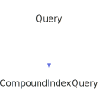

<a id="descriptionquery"></a>
<h1>DescriptionQuery</h1>
<a id="classMdDox_1_1Doxygen_1_1DescriptionQuery"></a>
<a href="https://github.com/CharlesCarley/MdDox">~</a>
<a href="indexpage.md#main">Main</a>
<span class="inline-text">/</span>
<a href="index.md#index">Index</a>
<span class="inline-text">::</span>
<a href="namespaceMdDox.md#mddox">MdDox</a>
<span class="inline-text">::</span>
<a href="namespaceMdDox_1_1Doxygen.md#doxygen">Doxygen</a>
<span class="inline-text">::</span>
<span class="bold-text"><b>DescriptionQuery</b></span>
<br/>
<br/>
<span class="inline-text">Implements the </span>
<code class="typewriter">descriptionType</code>
<span class="inline-text"> scaffolding. </span>
<br/>
<br/>
<a id="derived-from"></a>
<h4>Derived From</h4>
<span class="icon-list-item"><a href="classMdDox_1_1Doxygen_1_1Query.md#query" class="icon-list-item"><span class="icon-list-item">Query</span>
</a>
</span>
<br/>
<br/>
<a id="public-methods"></a>
<h2>Public Methods</h2>
<span class="icon-list-item"><a href="#descriptionquery" class="icon-list-item"><span class="icon-list-item">DescriptionQuery</span>
</a>
</span>
<br/>
<span class="icon-list-item"><a href="#descriptionquery" class="icon-list-item"><span class="icon-list-item">DescriptionQuery</span>
</a>
</span>
<br/>
<span class="icon-list-item"><a href="#descriptionquery" class="icon-list-item"><span class="icon-list-item">DescriptionQuery</span>
</a>
</span>
<br/>
<span class="icon-list-item"><a href="#foreachparagraph" class="icon-list-item"><span class="icon-list-item">foreachParagraph</span>
</a>
</span>
<br/>
<span class="icon-list-item"><a href="#foreachsect1" class="icon-list-item"><span class="icon-list-item">foreachSect1</span>
</a>
</span>
<br/>
<span class="icon-list-item"><a href="#getinternal" class="icon-list-item"><span class="icon-list-item">getInternal</span>
</a>
</span>
<br/>
<span class="icon-list-item"><a href="#getinternal" class="icon-list-item"><span class="icon-list-item">getInternal</span>
</a>
</span>
<br/>
<span class="icon-list-item"><a href="#gettitle" class="icon-list-item"><span class="icon-list-item">getTitle</span>
</a>
</span>
<br/>
<span class="icon-list-item"><a href="#visit" class="icon-list-item"><span class="icon-list-item">visit</span>
</a>
</span>
<br/>
<a id="details"></a>
<h2>Details</h2>
<span class="inline-text">The following xml provides the source for the </span>
<span class="bold-text"><b>descriptionType</b></span>
<span class="inline-text"> scaffolding.</span>

```xml
<xsd:complexType name="descriptionType" mixed="true">
  <xsd:sequence>
    <xsd:element minOccurs="0" name="title" type="xsd:string"/>
    <xsd:element minOccurs="0" name="para" type="docParaType" maxOccurs="unbounded"/>
    <xsd:element minOccurs="0" name="sect1" type="docSect1Type" maxOccurs="unbounded"/>
    <xsd:element minOccurs="0" name="internal" type="docInternalType"/>
  </xsd:sequence>
</xsd:complexType>
```
<br/>
<br/>
<a id="defined-in"></a>
<h4>Defined in</h4>
<span class="icon-list-item"><a href="https://github.com/CharlesCarley/MdDox/blob/master//Tools/Doxygen/DescriptionQuery.h#L80" class="icon-list-item"><span class="icon-list-item">DescriptionQuery.h</span>
</a>
</span>
<br/>
<blockquote>
<span class="bold-text"><b>MdDox::ClassPageWriter::visitedIncludes</b></span>
</blockquote>
<blockquote>
<span class="bold-text"><b>MdDox::ClassPageWriter::visitedCollaborationGraph</b></span>
</blockquote>
<a id="descriptionquery"></a>
<h2>DescriptionQuery</h2>
<span class="bold-text"><b>DescriptionQuery</b></span>
<span class="italic-text"><i>(</i></span>
<span class="italic-text"><i>)</i></span>
<a id="defined-in"></a>
<h4>Defined in</h4>
<span class="icon-list-item"><a href="https://github.com/CharlesCarley/MdDox/blob/master//Tools/Doxygen/DescriptionQuery.h#L82" class="icon-list-item"><span class="icon-list-item">DescriptionQuery.h</span>
</a>
</span>
<br/>
<br/>
<a id="descriptionquery"></a>
<h2>DescriptionQuery</h2>
<span class="bold-text"><b>DescriptionQuery</b></span>
<span class="italic-text"><i>(</i></span>
<div class="paragraph">
<span class="paragraph"><span class="inline-text">const </span>
<a href="classMdDox_1_1Doxygen_1_1DescriptionQuery.md#descriptionquery">DescriptionQuery</a>
<span class="inline-text"> &amp;</span>
<span class="inline-text">other</span>
</span>
</div>
<span class="italic-text"><i>)</i></span>
<a id="defined-in"></a>
<h4>Defined in</h4>
<span class="icon-list-item"><a href="https://github.com/CharlesCarley/MdDox/blob/master//Tools/Doxygen/DescriptionQuery.h#L83" class="icon-list-item"><span class="icon-list-item">DescriptionQuery.h</span>
</a>
</span>
<br/>
<br/>
<a id="descriptionquery"></a>
<h2>DescriptionQuery</h2>
<span class="bold-text"><b>DescriptionQuery</b></span>
<span class="italic-text"><i>(</i></span>
<div class="paragraph">
<span class="paragraph"><a href="classMdDox_1_1Xml_1_1Node.md#xmlnode">Xml::Node</a>
<span class="inline-text"> *</span>
<span class="inline-text">node</span>
</span>
</div>
<span class="italic-text"><i>)</i></span>
<a id="defined-in"></a>
<h4>Defined in</h4>
<span class="icon-list-item"><a href="https://github.com/CharlesCarley/MdDox/blob/master//Tools/Doxygen/DescriptionQuery.h#L85" class="icon-list-item"><span class="icon-list-item">DescriptionQuery.h</span>
</a>
</span>
<br/>
<br/>
<a id="foreachparagraph"></a>
<h2>foreachParagraph</h2>
<span class="inline-text">void</span>
<span class="bold-text"><b>foreachParagraph</b></span>
<span class="italic-text"><i>(</i></span>
<div class="paragraph">
<span class="paragraph"><span class="inline-text">const </span>
<a href="namespaceMdDox_1_1Doxygen.md#paraqueryfunction">ParaQueryFunction</a>
<span class="inline-text"> &amp;</span>
<span class="inline-text">invoke</span>
</span>
</div>
<span class="italic-text"><i>)</i></span>
<a id="details"></a>
<h4>Details</h4>
<span class="inline-text">Invokes the supplied callback on </span>
<span class="bold-text"><b>para</b></span>
<span class="inline-text"> elements. </span>
<br/>
<br/>
<a id="references"></a>
<h4>References</h4>
<span class="icon-list-item"><a href="classMdDox_1_1Doxygen_1_1Query.md#_node" class="icon-list-item"><span class="icon-list-item">_node</span>
</a>
</span>
<br/>
<a id="defined-in"></a>
<h4>Defined in</h4>
<span class="icon-list-item"><a href="https://github.com/CharlesCarley/MdDox/blob/master//Tools/Doxygen/DescriptionQuery.h#L111" class="icon-list-item"><span class="icon-list-item">DescriptionQuery.h</span>
</a>
</span>
<br/>
<span class="icon-list-item"><a href="https://github.com/CharlesCarley/MdDox/blob/master//Tools/Doxygen/DescriptionQuery.cpp#L87" class="icon-list-item"><span class="icon-list-item">DescriptionQuery.cpp</span>
</a>
</span>
<br/>
<br/>
<a id="foreachsect1"></a>
<h2>foreachSect1</h2>
<span class="inline-text">void</span>
<span class="bold-text"><b>foreachSect1</b></span>
<span class="italic-text"><i>(</i></span>
<div class="paragraph">
<span class="paragraph"><span class="inline-text">const </span>
<a href="namespaceMdDox_1_1Doxygen.md#sect1queryfunction">Sect1QueryFunction</a>
<span class="inline-text"> &amp;</span>
<span class="inline-text">invoke</span>
</span>
</div>
<span class="italic-text"><i>)</i></span>
<a id="details"></a>
<h4>Details</h4>
<span class="inline-text">Invokes the supplied callback on </span>
<span class="bold-text"><b>sect1</b></span>
<span class="inline-text"> elements. </span>
<br/>
<br/>
<a id="references"></a>
<h4>References</h4>
<span class="icon-list-item"><a href="classMdDox_1_1Doxygen_1_1Query.md#_node" class="icon-list-item"><span class="icon-list-item">_node</span>
</a>
</span>
<br/>
<a id="defined-in"></a>
<h4>Defined in</h4>
<span class="icon-list-item"><a href="https://github.com/CharlesCarley/MdDox/blob/master//Tools/Doxygen/DescriptionQuery.h#L116" class="icon-list-item"><span class="icon-list-item">DescriptionQuery.h</span>
</a>
</span>
<br/>
<span class="icon-list-item"><a href="https://github.com/CharlesCarley/MdDox/blob/master//Tools/Doxygen/DescriptionQuery.cpp#L92" class="icon-list-item"><span class="icon-list-item">DescriptionQuery.cpp</span>
</a>
</span>
<br/>
<br/>
<a id="getinternal"></a>
<h2>getInternal</h2>
<span class="inline-text">void</span>
<span class="bold-text"><b>getInternal</b></span>
<span class="italic-text"><i>(</i></span>
<div class="paragraph">
<span class="paragraph"><a href="classMdDox_1_1Doxygen_1_1InternalQuery.md#internalquery">InternalQuery</a>
<span class="inline-text"> &amp;</span>
<span class="inline-text">dest</span>
</span>
</div>
<span class="italic-text"><i>)</i></span>
<a id="details"></a>
<h4>Details</h4>
<span class="inline-text">Provides access to the </span>
<span class="bold-text"><b>internal</b></span>
<span class="inline-text"> attribute. </span>
<br/>
<br/>
<a id="references"></a>
<h4>References</h4>
<span class="icon-list-item"><a href="classMdDox_1_1Doxygen_1_1Query.md#_node" class="icon-list-item"><span class="icon-list-item">_node</span>
</a>
</span>
<br/>
<span class="icon-list-item"><a href="classMdDox_1_1Doxygen_1_1Query.md#node" class="icon-list-item"><span class="icon-list-item">node</span>
</a>
</span>
<br/>
<span class="icon-list-item"><a href="classMdDox_1_1Xml_1_1Node.md#firstchildof" class="icon-list-item"><span class="icon-list-item">firstChildOf</span>
</a>
</span>
<br/>
<span class="icon-list-item"><a href="classMdDox_1_1Doxygen_1_1Query.md#reset" class="icon-list-item"><span class="icon-list-item">reset</span>
</a>
</span>
<br/>
<a id="defined-in"></a>
<h4>Defined in</h4>
<span class="icon-list-item"><a href="https://github.com/CharlesCarley/MdDox/blob/master//Tools/Doxygen/DescriptionQuery.h#L101" class="icon-list-item"><span class="icon-list-item">DescriptionQuery.h</span>
</a>
</span>
<br/>
<span class="icon-list-item"><a href="https://github.com/CharlesCarley/MdDox/blob/master//Tools/Doxygen/DescriptionQuery.cpp#L69" class="icon-list-item"><span class="icon-list-item">DescriptionQuery.cpp</span>
</a>
</span>
<br/>
<br/>
<a id="getinternal"></a>
<h2>getInternal</h2>
<a href="classMdDox_1_1Doxygen_1_1InternalQuery.md#internalquery">InternalQuery</a>
<span class="bold-text"><b>getInternal</b></span>
<span class="italic-text"><i>(</i></span>
<span class="italic-text"><i>)</i></span>
<a id="details"></a>
<h4>Details</h4>
<span class="inline-text">Provides access to the </span>
<span class="bold-text"><b>internal</b></span>
<span class="inline-text"> attribute. </span>
<br/>
<br/>
<a id="defined-in"></a>
<h4>Defined in</h4>
<span class="icon-list-item"><a href="https://github.com/CharlesCarley/MdDox/blob/master//Tools/Doxygen/DescriptionQuery.h#L106" class="icon-list-item"><span class="icon-list-item">DescriptionQuery.h</span>
</a>
</span>
<br/>
<span class="icon-list-item"><a href="https://github.com/CharlesCarley/MdDox/blob/master//Tools/Doxygen/DescriptionQuery.cpp#L80" class="icon-list-item"><span class="icon-list-item">DescriptionQuery.cpp</span>
</a>
</span>
<br/>
<br/>
<a id="gettitle"></a>
<h2>getTitle</h2>
<span class="inline-text">const </span>
<a href="namespaceMdDox.md#string">String</a>
<span class="inline-text"> &amp;</span>
<span class="bold-text"><b>getTitle</b></span>
<span class="italic-text"><i>(</i></span>
<div class="paragraph">
<span class="paragraph"><span class="inline-text">const </span>
<a href="namespaceMdDox.md#string">String</a>
<span class="inline-text"> &amp;</span>
<span class="inline-text">notFound</span>
<span class="inline-text"> = </span>
<span class="inline-text">&quot;&quot;</span>
</span>
</div>
<span class="italic-text"><i>)</i></span>
<a id="details"></a>
<h4>Details</h4>
<span class="inline-text">Provides access to the </span>
<span class="bold-text"><b>title</b></span>
<span class="inline-text"> tag&apos;s inner text. </span>
<br/>
<br/>
<a id="returns"></a>
<h4>Returns</h4>
<span class="inline-text">The </span>
<span class="bold-text"><b>title&apos;s</b></span>
<span class="inline-text"> text or the default value if the node is invalid. </span>
<br/>
<a id="references"></a>
<h4>References</h4>
<span class="icon-list-item"><a href="classMdDox_1_1Doxygen_1_1Query.md#_node" class="icon-list-item"><span class="icon-list-item">_node</span>
</a>
</span>
<br/>
<span class="icon-list-item"><a href="classMdDox_1_1Doxygen_1_1Query.md#node" class="icon-list-item"><span class="icon-list-item">node</span>
</a>
</span>
<br/>
<span class="icon-list-item"><a href="classMdDox_1_1Xml_1_1Node.md#firstchildof" class="icon-list-item"><span class="icon-list-item">firstChildOf</span>
</a>
</span>
<br/>
<span class="icon-list-item"><a href="classMdDox_1_1Xml_1_1Node.md#text" class="icon-list-item"><span class="icon-list-item">text</span>
</a>
</span>
<br/>
<a id="defined-in"></a>
<h4>Defined in</h4>
<span class="icon-list-item"><a href="https://github.com/CharlesCarley/MdDox/blob/master//Tools/Doxygen/DescriptionQuery.h#L96" class="icon-list-item"><span class="icon-list-item">DescriptionQuery.h</span>
</a>
</span>
<br/>
<span class="icon-list-item"><a href="https://github.com/CharlesCarley/MdDox/blob/master//Tools/Doxygen/DescriptionQuery.cpp#L60" class="icon-list-item"><span class="icon-list-item">DescriptionQuery.cpp</span>
</a>
</span>
<br/>
<br/>
<a id="visit"></a>
<h2>visit</h2>
<span class="inline-text">void</span>
<span class="bold-text"><b>visit</b></span>
<span class="italic-text"><i>(</i></span>
<div class="paragraph">
<span class="paragraph"><a href="classMdDox_1_1Doxygen_1_1Visitors_1_1DescriptionQueryVisitor.md#visitorsdescriptionqueryvisitor">Visitors::DescriptionQueryVisitor</a>
<span class="inline-text"> *</span>
<span class="inline-text"> = </span>
<span class="inline-text">visitor</span>
</span>
</div>
<span class="italic-text"><i>)</i></span>
<a id="references"></a>
<h4>References</h4>
<span class="icon-list-item"><a href="classMdDox_1_1Doxygen_1_1Query.md#_node" class="icon-list-item"><span class="icon-list-item">_node</span>
</a>
</span>
<br/>
<span class="icon-list-item"><a href="classMdDox_1_1Xml_1_1Node.md#children" class="icon-list-item"><span class="icon-list-item">children</span>
</a>
</span>
<br/>
<span class="icon-list-item"><a href="namespaceMdDox_1_1Doxygen.md#doxtextnode" class="icon-list-item"><span class="icon-list-item">DoxTextNode</span>
</a>
</span>
<br/>
<span class="icon-list-item"><a href="classMdDox_1_1Doxygen_1_1Visitors_1_1DescriptionQueryVisitor.md#visitedtext" class="icon-list-item"><span class="icon-list-item">visitedText</span>
</a>
</span>
<br/>
<span class="icon-list-item"><a href="classMdDox_1_1Doxygen_1_1Visitors_1_1DescriptionQueryVisitor.md#visitedparagraph" class="icon-list-item"><span class="icon-list-item">visitedParagraph</span>
</a>
</span>
<br/>
<span class="icon-list-item"><a href="classMdDox_1_1Doxygen_1_1Visitors_1_1DescriptionQueryVisitor.md#visitedsect1" class="icon-list-item"><span class="icon-list-item">visitedSect1</span>
</a>
</span>
<br/>
<span class="icon-list-item"><a href="classMdDox_1_1Doxygen_1_1Visitors_1_1DescriptionQueryVisitor.md#visitedinternal" class="icon-list-item"><span class="icon-list-item">visitedInternal</span>
</a>
</span>
<br/>
<span class="icon-list-item"><a href="classMdDox_1_1Doxygen_1_1Visitors_1_1DescriptionQueryVisitor.md#visitedtitle" class="icon-list-item"><span class="icon-list-item">visitedTitle</span>
</a>
</span>
<br/>
<a id="defined-in"></a>
<h4>Defined in</h4>
<span class="icon-list-item"><a href="https://github.com/CharlesCarley/MdDox/blob/master//Tools/Doxygen/DescriptionQuery.h#L90" class="icon-list-item"><span class="icon-list-item">DescriptionQuery.h</span>
</a>
</span>
<br/>
<span class="icon-list-item"><a href="https://github.com/CharlesCarley/MdDox/blob/master//Tools/Doxygen/DescriptionQuery.cpp#L31" class="icon-list-item"><span class="icon-list-item">DescriptionQuery.cpp</span>
</a>
</span>
<br/>
<br/>
</div>
</div>
</body>
</html>
