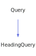

<a id="incquery"></a>
<h1>IncQuery</h1>
<a id="classMdDox_1_1Doxygen_1_1IncQuery"></a>
<a href="https://github.com/CharlesCarley/MdDox">~</a>
<a href="indexpage.md#main">Main</a>
<span class="inline-text">/</span>
<a href="index.md#index">Index</a>
<span class="inline-text">::</span>
<a href="namespaceMdDox.md#mddox">MdDox</a>
<span class="inline-text">::</span>
<a href="namespaceMdDox_1_1Doxygen.md#doxygen">Doxygen</a>
<span class="inline-text">::</span>
<span class="bold-text"><b>IncQuery</b></span>
<br/>
<br/>
<span class="inline-text">Implements the </span>
<code class="typewriter">incType</code>
<span class="inline-text"> scaffolding. </span>
<br/>
<br/>
<a id="derived-from"></a>
<h4>Derived From</h4>
<span class="icon-list-item"><a href="classMdDox_1_1Doxygen_1_1Query.md#query" class="icon-list-item"><span class="icon-list-item">Query</span>
</a>
</span>
<br/>
<br/>
<a id="public-methods"></a>
<h2>Public Methods</h2>
<span class="icon-list-item"><a href="#incquery" class="icon-list-item"><span class="icon-list-item">IncQuery</span>
</a>
</span>
<br/>
<span class="icon-list-item"><a href="#incquery" class="icon-list-item"><span class="icon-list-item">IncQuery</span>
</a>
</span>
<br/>
<span class="icon-list-item"><a href="#incquery" class="icon-list-item"><span class="icon-list-item">IncQuery</span>
</a>
</span>
<br/>
<span class="icon-list-item"><a href="#getlocal" class="icon-list-item"><span class="icon-list-item">getLocal</span>
</a>
</span>
<br/>
<span class="icon-list-item"><a href="#getrefid" class="icon-list-item"><span class="icon-list-item">getRefId</span>
</a>
</span>
<br/>
<a id="details"></a>
<h2>Details</h2>
<span class="inline-text">The following xml provides the source for the </span>
<span class="bold-text"><b>incType</b></span>
<span class="inline-text"> scaffolding.</span>

```xml
<xsd:complexType name="incType">
  <xsd:simpleContent>
    <xsd:extension base="xsd:string">
      <xsd:attribute name="refid" type="xsd:string"/>
      <xsd:attribute name="local" type="DoxBool"/>
    </xsd:extension>
  </xsd:simpleContent>
</xsd:complexType>
```
<br/>
<br/>
<a id="defined-in"></a>
<h4>Defined in</h4>
<span class="icon-list-item"><a href="https://github.com/CharlesCarley/MdDox/blob/master//Tools/Doxygen/IncQuery.h#L48" class="icon-list-item"><span class="icon-list-item">IncQuery.h</span>
</a>
</span>
<br/>
<a id="incquery"></a>
<h2>IncQuery</h2>
<span class="bold-text"><b>IncQuery</b></span>
<span class="italic-text"><i>(</i></span>
<span class="italic-text"><i>)</i></span>
<a id="defined-in"></a>
<h4>Defined in</h4>
<span class="icon-list-item"><a href="https://github.com/CharlesCarley/MdDox/blob/master//Tools/Doxygen/IncQuery.h#L50" class="icon-list-item"><span class="icon-list-item">IncQuery.h</span>
</a>
</span>
<br/>
<br/>
<a id="incquery"></a>
<h2>IncQuery</h2>
<span class="bold-text"><b>IncQuery</b></span>
<span class="italic-text"><i>(</i></span>
<div class="paragraph">
<span class="paragraph"><span class="inline-text">const </span>
<a href="classMdDox_1_1Doxygen_1_1IncQuery.md#incquery">IncQuery</a>
<span class="inline-text"> &amp;</span>
<span class="inline-text">other</span>
</span>
</div>
<span class="italic-text"><i>)</i></span>
<a id="defined-in"></a>
<h4>Defined in</h4>
<span class="icon-list-item"><a href="https://github.com/CharlesCarley/MdDox/blob/master//Tools/Doxygen/IncQuery.h#L51" class="icon-list-item"><span class="icon-list-item">IncQuery.h</span>
</a>
</span>
<br/>
<br/>
<a id="incquery"></a>
<h2>IncQuery</h2>
<span class="bold-text"><b>IncQuery</b></span>
<span class="italic-text"><i>(</i></span>
<div class="paragraph">
<span class="paragraph"><a href="classMdDox_1_1Xml_1_1Node.md#xmlnode">Xml::Node</a>
<span class="inline-text"> *</span>
<span class="inline-text">node</span>
</span>
</div>
<span class="italic-text"><i>)</i></span>
<a id="defined-in"></a>
<h4>Defined in</h4>
<span class="icon-list-item"><a href="https://github.com/CharlesCarley/MdDox/blob/master//Tools/Doxygen/IncQuery.h#L53" class="icon-list-item"><span class="icon-list-item">IncQuery.h</span>
</a>
</span>
<br/>
<br/>
<a id="getlocal"></a>
<h2>getLocal</h2>
<a href="namespaceMdDox_1_1Doxygen.md#doxboolenum">DoxBoolEnum</a>
<span class="bold-text"><b>getLocal</b></span>
<span class="italic-text"><i>(</i></span>
<span class="italic-text"><i>)</i></span>
<a id="details"></a>
<h4>Details</h4>
<span class="inline-text">Provides access to the </span>
<span class="bold-text"><b>local</b></span>
<span class="inline-text"> element. </span>
<br/>
<br/>
<a id="returns"></a>
<h4>Returns</h4>
<span class="inline-text">The </span>
<span class="bold-text"><b>local</b></span>
<span class="inline-text"> enumerated value or -1 if the value is not found. </span>
<br/>
<a id="references"></a>
<h4>References</h4>
<span class="icon-list-item"><a href="classMdDox_1_1Doxygen_1_1Query.md#_node" class="icon-list-item"><span class="icon-list-item">_node</span>
</a>
</span>
<br/>
<span class="icon-list-item"><a href="classMdDox_1_1Doxygen_1_1DoxBool.md#get" class="icon-list-item"><span class="icon-list-item">get</span>
</a>
</span>
<br/>
<span class="icon-list-item"><a href="classMdDox_1_1Xml_1_1Node.md#attribute" class="icon-list-item"><span class="icon-list-item">attribute</span>
</a>
</span>
<br/>
<a id="defined-in"></a>
<h4>Defined in</h4>
<span class="icon-list-item"><a href="https://github.com/CharlesCarley/MdDox/blob/master//Tools/Doxygen/IncQuery.h#L62" class="icon-list-item"><span class="icon-list-item">IncQuery.h</span>
</a>
</span>
<br/>
<span class="icon-list-item"><a href="https://github.com/CharlesCarley/MdDox/blob/master//Tools/Doxygen/IncQuery.cpp#L35" class="icon-list-item"><span class="icon-list-item">IncQuery.cpp</span>
</a>
</span>
<br/>
<br/>
<a id="getrefid"></a>
<h2>getRefId</h2>
<span class="inline-text">const </span>
<a href="namespaceMdDox.md#string">String</a>
<span class="inline-text"> &amp;</span>
<span class="bold-text"><b>getRefId</b></span>
<span class="italic-text"><i>(</i></span>
<div class="paragraph">
<span class="paragraph"><span class="inline-text">const </span>
<a href="namespaceMdDox.md#string">String</a>
<span class="inline-text"> &amp;</span>
<span class="inline-text">notFound</span>
<span class="inline-text"> = </span>
<span class="inline-text">&quot;&quot;</span>
</span>
</div>
<span class="italic-text"><i>)</i></span>
<a id="details"></a>
<h4>Details</h4>
<span class="inline-text">Provides access to the </span>
<span class="bold-text"><b>refid</b></span>
<span class="inline-text"> attribute. </span>
<br/>
<br/>
<a id="returns"></a>
<h4>Returns</h4>
<span class="inline-text">The </span>
<span class="bold-text"><b>refid</b></span>
<span class="inline-text"> enumerated value or an empty string the value is not found. </span>
<br/>
<a id="references"></a>
<h4>References</h4>
<span class="icon-list-item"><a href="classMdDox_1_1Doxygen_1_1Query.md#_node" class="icon-list-item"><span class="icon-list-item">_node</span>
</a>
</span>
<br/>
<span class="icon-list-item"><a href="classMdDox_1_1Xml_1_1Node.md#attribute" class="icon-list-item"><span class="icon-list-item">attribute</span>
</a>
</span>
<br/>
<a id="defined-in"></a>
<h4>Defined in</h4>
<span class="icon-list-item"><a href="https://github.com/CharlesCarley/MdDox/blob/master//Tools/Doxygen/IncQuery.h#L70" class="icon-list-item"><span class="icon-list-item">IncQuery.h</span>
</a>
</span>
<br/>
<span class="icon-list-item"><a href="https://github.com/CharlesCarley/MdDox/blob/master//Tools/Doxygen/IncQuery.cpp#L28" class="icon-list-item"><span class="icon-list-item">IncQuery.cpp</span>
</a>
</span>
<br/>
<br/>
</div>
</div>
</body>
</html>
