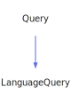

<a id="linkedtextquery"></a>
<h1>LinkedTextQuery</h1>
<a id="classmddox_1_1doxygen_1_1linkedtextquery"></a>
<a href="https://github.com/CharlesCarley/MdDox#~">~</a>
<a href="indexpage.md#mddox">MdDox</a>
<span class="inline-text">/</span>
<a href="index.md#index">Index</a>
<span class="inline-text">/</span>
<a href="namespaceMdDox.md#mddox">MdDox</a>
<span class="inline-text">::</span>
<a href="namespaceMdDox_1_1Doxygen.md#doxygen">Doxygen</a>
<span class="inline-text">::</span>
<span class="bold-text"><b>LinkedTextQuery</b></span>
<br/>
<br/>
<span class="inline-text">Implements the </span>
<code class="typewriter">linkedTextType</code>
<span class="inline-text"> scaffolding. </span>
<br/>
<a id="derived-from"></a>
<h4>Derived From</h4>
<div class="icon-link">
<a href="classMdDox_1_1Doxygen_1_1Query.md#query">MdDox::Doxygen::Query</a>
</div>
<br/>
<a id="public-methods"></a>
<h2>Public Methods</h2>
<span class="icon-list-item"><a href="#linkedtextquery" class="icon-list-item"><span class="icon-list-item">LinkedTextQuery</span>
</a>
</span>
<br/>
<span class="icon-list-item"><a href="#linkedtextquery" class="icon-list-item"><span class="icon-list-item">LinkedTextQuery</span>
</a>
</span>
<br/>
<span class="icon-list-item"><a href="#linkedtextquery" class="icon-list-item"><span class="icon-list-item">LinkedTextQuery</span>
</a>
</span>
<br/>
<span class="icon-list-item"><a href="#foreachref" class="icon-list-item"><span class="icon-list-item">foreachRef</span>
</a>
</span>
<br/>
<span class="icon-list-item"><a href="#visit" class="icon-list-item"><span class="icon-list-item">visit</span>
</a>
</span>
<br/>
<a id="details"></a>
<h2>Details</h2>
<span class="inline-text">The following xml provides the source for the </span>
<span class="bold-text"><b>linkedTextType</b></span>
<span class="inline-text"> scaffolding.</span>

```xml
<xsd:complexType name="linkedTextType" mixed="true">
  <xsd:sequence>
    <xsd:element minOccurs="0" name="ref" type="refTextType" maxOccurs="unbounded"/>
  </xsd:sequence>
</xsd:complexType>
```
<br/>
<a id="defined-in"></a>
<h4>Defined in</h4>
<span class="icon-list-item"><a href="https://github.com/CharlesCarley/MdDox/blob/master/Tools/Doxygen/LinkedTextQuery.h#L62" class="icon-list-item"><span class="icon-list-item">LinkedTextQuery.h</span>
</a>
</span>
<br/>
<br/>
<span class="icon-list-item"><a href="#linkedtextquery" class="icon-list-item"><span class="icon-list-item">top</span>
</a>
</span>
<a id="linkedtextquery"></a>
<h2>LinkedTextQuery</h2>
<span class="bold-text"><b>LinkedTextQuery</b></span>
<span class="italic-text"><i>(</i></span>
<span class="italic-text"><i>)</i></span>
<a id="defined-in"></a>
<h4>Defined in</h4>
<span class="icon-list-item"><a href="https://github.com/CharlesCarley/MdDox/blob/master/Tools/Doxygen/LinkedTextQuery.h#L64" class="icon-list-item"><span class="icon-list-item">LinkedTextQuery.h</span>
</a>
</span>
<br/>
<br/>
<span class="icon-list-item"><a href="#linkedtextquery" class="icon-list-item"><span class="icon-list-item">top</span>
</a>
</span>
<br/>
<a id="linkedtextquery"></a>
<h2>LinkedTextQuery</h2>
<span class="bold-text"><b>LinkedTextQuery</b></span>
<span class="italic-text"><i>(</i></span>
<div class="paragraph">
<span class="paragraph"><span class="inline-text">const </span>
<a href="classMdDox_1_1Doxygen_1_1LinkedTextQuery.md#linkedtextquery">LinkedTextQuery</a>
<span class="inline-text"> &amp;</span>
<span class="inline-text">other</span>
</span>
</div>
<span class="italic-text"><i>)</i></span>
<a id="defined-in"></a>
<h4>Defined in</h4>
<span class="icon-list-item"><a href="https://github.com/CharlesCarley/MdDox/blob/master/Tools/Doxygen/LinkedTextQuery.h#L65" class="icon-list-item"><span class="icon-list-item">LinkedTextQuery.h</span>
</a>
</span>
<br/>
<br/>
<span class="icon-list-item"><a href="#linkedtextquery" class="icon-list-item"><span class="icon-list-item">top</span>
</a>
</span>
<br/>
<a id="linkedtextquery"></a>
<h2>LinkedTextQuery</h2>
<span class="bold-text"><b>LinkedTextQuery</b></span>
<span class="italic-text"><i>(</i></span>
<div class="paragraph">
<span class="paragraph"><a href="classMdDox_1_1Xml_1_1Node.md#node">Xml::Node</a>
<span class="inline-text"> *</span>
<span class="inline-text">node</span>
</span>
</div>
<span class="italic-text"><i>)</i></span>
<a id="defined-in"></a>
<h4>Defined in</h4>
<span class="icon-list-item"><a href="https://github.com/CharlesCarley/MdDox/blob/master/Tools/Doxygen/LinkedTextQuery.h#L67" class="icon-list-item"><span class="icon-list-item">LinkedTextQuery.h</span>
</a>
</span>
<br/>
<br/>
<span class="icon-list-item"><a href="#linkedtextquery" class="icon-list-item"><span class="icon-list-item">top</span>
</a>
</span>
<br/>
<a id="foreachref"></a>
<h2>foreachRef</h2>
<span class="inline-text">void</span>
<span class="bold-text"><b>foreachRef</b></span>
<span class="italic-text"><i>(</i></span>
<div class="paragraph">
<span class="paragraph"><span class="inline-text">const </span>
<a href="namespaceMdDox_1_1Doxygen.md#reftextqueryfunction">RefTextQueryFunction</a>
<span class="inline-text"> &amp;</span>
<span class="inline-text">invoke</span>
</span>
</div>
<span class="italic-text"><i>)</i></span>
<a id="details"></a>
<h4>Details</h4>
<span class="inline-text">Invokes the supplied callback on </span>
<span class="bold-text"><b>ref</b></span>
<span class="inline-text"> elements. </span>
<br/>
<br/>
<a id="references"></a>
<h4>References</h4>
<div class="paragraph">
<span class="paragraph"><a href="classMdDox_1_1Doxygen_1_1Query.md#_node">_node</a>
</span>
</div>
<a id="defined-in"></a>
<h4>Defined in</h4>
<span class="icon-list-item"><a href="https://github.com/CharlesCarley/MdDox/blob/master/Tools/Doxygen/LinkedTextQuery.h#L76" class="icon-list-item"><span class="icon-list-item">LinkedTextQuery.h</span>
</a>
</span>
<br/>
<span class="icon-list-item"><a href="https://github.com/CharlesCarley/MdDox/blob/master/Tools/Doxygen/LinkedTextQuery.cpp#L49" class="icon-list-item"><span class="icon-list-item">LinkedTextQuery.cpp</span>
</a>
</span>
<br/>
<br/>
<span class="icon-list-item"><a href="#linkedtextquery" class="icon-list-item"><span class="icon-list-item">top</span>
</a>
</span>
<br/>
<a id="visit"></a>
<h2>visit</h2>
<span class="inline-text">void</span>
<span class="bold-text"><b>visit</b></span>
<span class="italic-text"><i>(</i></span>
<div class="paragraph">
<span class="paragraph"><a href="classMdDox_1_1Doxygen_1_1Visitors_1_1LinkedTextQueryVisitor.md#linkedtextqueryvisitor">Visitors::LinkedTextQueryVisitor</a>
<span class="inline-text"> *</span>
<span class="inline-text"> = </span>
<span class="inline-text">visitor</span>
</span>
</div>
<span class="italic-text"><i>)</i></span>
<a id="references"></a>
<h4>References</h4>
<div class="paragraph">
<span class="paragraph"><a href="classMdDox_1_1Doxygen_1_1Query.md#_node">_node</a>
</span>
</div>
<div class="paragraph">
<span class="paragraph"><a href="classMdDox_1_1Xml_1_1Node.md#children">children</a>
</span>
</div>
<div class="paragraph">
<span class="paragraph"><a href="namespaceMdDox_1_1Doxygen.md#doxtextnode">DoxTextNode</a>
</span>
</div>
<div class="paragraph">
<span class="paragraph"><a href="classMdDox_1_1Doxygen_1_1Visitors_1_1LinkedTextQueryVisitor.md#visitedtext">visitedText</a>
</span>
</div>
<div class="paragraph">
<span class="paragraph"><a href="classMdDox_1_1Doxygen_1_1Visitors_1_1LinkedTextQueryVisitor.md#visitedref">visitedRef</a>
</span>
</div>
<a id="defined-in"></a>
<h4>Defined in</h4>
<span class="icon-list-item"><a href="https://github.com/CharlesCarley/MdDox/blob/master/Tools/Doxygen/LinkedTextQuery.h#L72" class="icon-list-item"><span class="icon-list-item">LinkedTextQuery.h</span>
</a>
</span>
<br/>
<span class="icon-list-item"><a href="https://github.com/CharlesCarley/MdDox/blob/master/Tools/Doxygen/LinkedTextQuery.cpp#L29" class="icon-list-item"><span class="icon-list-item">LinkedTextQuery.cpp</span>
</a>
</span>
<br/>
<br/>
<span class="icon-list-item"><a href="#linkedtextquery" class="icon-list-item"><span class="icon-list-item">top</span>
</a>
</span>
<br/>
</div>
</div>
</body>
</html>
