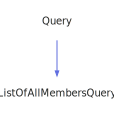

<a id="locationquery"></a>
<h1>LocationQuery</h1>
<a id="classMdDox_1_1Doxygen_1_1LocationQuery"></a>
<a href="https://github.com/CharlesCarley/MdDox">~</a>
<a href="indexpage.md#index">Index</a>
<span class="inline-text">/</span>
<a href="index.md#mddox">MdDox</a>
<span class="inline-text">/</span>
<a href="namespaceMdDox.md#">MdDox</a>
<span class="inline-text">::</span>
<a href="dir_b7487e7b43f0278857c63f4e9ad683a3.md#">Tools/Doxygen</a>
<span class="inline-text">::</span>
<span class="bold-text"><b>LocationQuery</b></span>
<br/>
<br/>
<span class="inline-text">Implements the </span>
<code class="typewriter">locationType</code>
<span class="inline-text"> scaffolding. </span>
<br/>
<br/>
<a id="derived-from"></a>
<h4>Derived From</h4>
<span class="icon-list-item"><a href="classMdDox_1_1Doxygen_1_1Query.md#query" class="icon-list-item"><span class="icon-list-item">Query</span>
</a>
</span>
<br/>
<br/>
<a id="public-methods"></a>
<h2>Public Methods</h2>
<span class="icon-list-item"><a href="#locationquery" class="icon-list-item"><span class="icon-list-item">LocationQuery</span>
</a>
</span>
<br/>
<span class="icon-list-item"><a href="#locationquery" class="icon-list-item"><span class="icon-list-item">LocationQuery</span>
</a>
</span>
<br/>
<span class="icon-list-item"><a href="#locationquery" class="icon-list-item"><span class="icon-list-item">LocationQuery</span>
</a>
</span>
<br/>
<span class="icon-list-item"><a href="#getbodyend" class="icon-list-item"><span class="icon-list-item">getBodyEnd</span>
</a>
</span>
<br/>
<span class="icon-list-item"><a href="#getbodyfile" class="icon-list-item"><span class="icon-list-item">getBodyFile</span>
</a>
</span>
<br/>
<span class="icon-list-item"><a href="#getbodystart" class="icon-list-item"><span class="icon-list-item">getBodyStart</span>
</a>
</span>
<br/>
<span class="icon-list-item"><a href="#getcolumn" class="icon-list-item"><span class="icon-list-item">getColumn</span>
</a>
</span>
<br/>
<span class="icon-list-item"><a href="#getfile" class="icon-list-item"><span class="icon-list-item">getFile</span>
</a>
</span>
<br/>
<span class="icon-list-item"><a href="#getline" class="icon-list-item"><span class="icon-list-item">getLine</span>
</a>
</span>
<br/>
<a id="details"></a>
<h2>Details</h2>
<span class="inline-text">The following xml provides the source for the </span>
<span class="bold-text"><b>locationType</b></span>
<span class="inline-text"> scaffolding.</span>

```xml
<xsd:complexType name="locationType">
  <xsd:attribute name="file" type="xsd:string"/>
  <xsd:attribute name="line" type="xsd:integer"/>
  <xsd:attribute name="column" type="xsd:integer" use="optional"/>
  <xsd:attribute name="bodyfile" type="xsd:string"/>
  <xsd:attribute name="bodystart" type="xsd:integer"/>
  <xsd:attribute name="bodyend" type="xsd:integer"/>
</xsd:complexType>
```
<br/>
<br/>
<a id="defined-in"></a>
<h4>Defined in</h4>
<span class="icon-list-item"><a href="https://github.com/CharlesCarley/MdDox/blob/master//Tools/Doxygen/LocationQuery.h#L47" class="icon-list-item"><span class="icon-list-item">LocationQuery.h</span>
</a>
</span>
<br/>
<a id="locationquery"></a>
<h2>LocationQuery</h2>
<span class="bold-text"><b>LocationQuery</b></span>
<span class="italic-text"><i>(</i></span>
<span class="italic-text"><i>)</i></span>
<a id="defined-in"></a>
<h4>Defined in</h4>
<span class="icon-list-item"><a href="https://github.com/CharlesCarley/MdDox/blob/master//Tools/Doxygen/LocationQuery.h#L49" class="icon-list-item"><span class="icon-list-item">LocationQuery.h</span>
</a>
</span>
<br/>
<br/>
<a id="locationquery"></a>
<h2>LocationQuery</h2>
<span class="bold-text"><b>LocationQuery</b></span>
<span class="italic-text"><i>(</i></span>
<div class="paragraph">
<span class="paragraph"><span class="inline-text">const </span>
<a href="classMdDox_1_1Doxygen_1_1LocationQuery.md#locationquery">LocationQuery</a>
<span class="inline-text"> &amp;</span>
<span class="inline-text">other</span>
</span>
</div>
<span class="italic-text"><i>)</i></span>
<a id="defined-in"></a>
<h4>Defined in</h4>
<span class="icon-list-item"><a href="https://github.com/CharlesCarley/MdDox/blob/master//Tools/Doxygen/LocationQuery.h#L50" class="icon-list-item"><span class="icon-list-item">LocationQuery.h</span>
</a>
</span>
<br/>
<br/>
<a id="locationquery"></a>
<h2>LocationQuery</h2>
<span class="bold-text"><b>LocationQuery</b></span>
<span class="italic-text"><i>(</i></span>
<div class="paragraph">
<span class="paragraph"><a href="classMdDox_1_1Xml_1_1Node.md#xmlnode">Xml::Node</a>
<span class="inline-text"> *</span>
<span class="inline-text">node</span>
</span>
</div>
<span class="italic-text"><i>)</i></span>
<a id="defined-in"></a>
<h4>Defined in</h4>
<span class="icon-list-item"><a href="https://github.com/CharlesCarley/MdDox/blob/master//Tools/Doxygen/LocationQuery.h#L52" class="icon-list-item"><span class="icon-list-item">LocationQuery.h</span>
</a>
</span>
<br/>
<br/>
<a id="getbodyend"></a>
<h2>getBodyEnd</h2>
<span class="inline-text">int64_t</span>
<span class="bold-text"><b>getBodyEnd</b></span>
<span class="italic-text"><i>(</i></span>
<div class="paragraph">
<span class="paragraph"><span class="inline-text">int64_t</span>
<span class="inline-text">def</span>
<span class="inline-text"> = </span>
<span class="inline-text">-1</span>
</span>
</div>
<span class="italic-text"><i>)</i></span>
<a id="details"></a>
<h4>Details</h4>
<span class="inline-text">Provides access to the </span>
<span class="bold-text"><b>bodyend</b></span>
<span class="inline-text"> attribute. </span>
<br/>
<br/>
<a id="references"></a>
<h4>References</h4>
<span class="icon-list-item"><a href="classMdDox_1_1Doxygen_1_1Query.md#_node" class="icon-list-item"><span class="icon-list-item">_node</span>
</a>
</span>
<br/>
<span class="icon-list-item"><a href="classMdDox_1_1Xml_1_1Node.md#integer" class="icon-list-item"><span class="icon-list-item">integer</span>
</a>
</span>
<br/>
<a id="defined-in"></a>
<h4>Defined in</h4>
<span class="icon-list-item"><a href="https://github.com/CharlesCarley/MdDox/blob/master//Tools/Doxygen/LocationQuery.h#L90" class="icon-list-item"><span class="icon-list-item">LocationQuery.h</span>
</a>
</span>
<br/>
<span class="icon-list-item"><a href="https://github.com/CharlesCarley/MdDox/blob/master//Tools/Doxygen/LocationQuery.cpp#L57" class="icon-list-item"><span class="icon-list-item">LocationQuery.cpp</span>
</a>
</span>
<br/>
<br/>
<a id="getbodyfile"></a>
<h2>getBodyFile</h2>
<span class="inline-text">const </span>
<a href="namespaceMdDox.md#string">String</a>
<span class="inline-text"> &amp;</span>
<span class="bold-text"><b>getBodyFile</b></span>
<span class="italic-text"><i>(</i></span>
<div class="paragraph">
<span class="paragraph"><span class="inline-text">const </span>
<a href="namespaceMdDox.md#string">String</a>
<span class="inline-text"> &amp;</span>
<span class="inline-text">notFound</span>
<span class="inline-text"> = </span>
<span class="inline-text">&quot;&quot;</span>
</span>
</div>
<span class="italic-text"><i>)</i></span>
<a id="details"></a>
<h4>Details</h4>
<span class="inline-text">Provides access to the </span>
<span class="bold-text"><b>bodyfile</b></span>
<span class="inline-text"> attribute. </span>
<br/>
<br/>
<a id="returns"></a>
<h4>Returns</h4>
<span class="inline-text">The </span>
<span class="bold-text"><b>bodyfile</b></span>
<span class="inline-text"> enumerated value or an empty string the value is not found. </span>
<br/>
<br/>
<a id="references"></a>
<h4>References</h4>
<span class="icon-list-item"><a href="classMdDox_1_1Doxygen_1_1Query.md#_node" class="icon-list-item"><span class="icon-list-item">_node</span>
</a>
</span>
<br/>
<span class="icon-list-item"><a href="classMdDox_1_1Xml_1_1Node.md#attribute" class="icon-list-item"><span class="icon-list-item">attribute</span>
</a>
</span>
<br/>
<a id="defined-in"></a>
<h4>Defined in</h4>
<span class="icon-list-item"><a href="https://github.com/CharlesCarley/MdDox/blob/master//Tools/Doxygen/LocationQuery.h#L62" class="icon-list-item"><span class="icon-list-item">LocationQuery.h</span>
</a>
</span>
<br/>
<span class="icon-list-item"><a href="https://github.com/CharlesCarley/MdDox/blob/master//Tools/Doxygen/LocationQuery.cpp#L28" class="icon-list-item"><span class="icon-list-item">LocationQuery.cpp</span>
</a>
</span>
<br/>
<br/>
<a id="getbodystart"></a>
<h2>getBodyStart</h2>
<span class="inline-text">int64_t</span>
<span class="bold-text"><b>getBodyStart</b></span>
<span class="italic-text"><i>(</i></span>
<div class="paragraph">
<span class="paragraph"><span class="inline-text">int64_t</span>
<span class="inline-text">def</span>
<span class="inline-text"> = </span>
<span class="inline-text">-1</span>
</span>
</div>
<span class="italic-text"><i>)</i></span>
<a id="details"></a>
<h4>Details</h4>
<span class="inline-text">Provides access to the </span>
<span class="bold-text"><b>bodystart</b></span>
<span class="inline-text"> attribute. </span>
<br/>
<br/>
<a id="references"></a>
<h4>References</h4>
<span class="icon-list-item"><a href="classMdDox_1_1Doxygen_1_1Query.md#_node" class="icon-list-item"><span class="icon-list-item">_node</span>
</a>
</span>
<br/>
<span class="icon-list-item"><a href="classMdDox_1_1Xml_1_1Node.md#integer" class="icon-list-item"><span class="icon-list-item">integer</span>
</a>
</span>
<br/>
<a id="defined-in"></a>
<h4>Defined in</h4>
<span class="icon-list-item"><a href="https://github.com/CharlesCarley/MdDox/blob/master//Tools/Doxygen/LocationQuery.h#L75" class="icon-list-item"><span class="icon-list-item">LocationQuery.h</span>
</a>
</span>
<br/>
<span class="icon-list-item"><a href="https://github.com/CharlesCarley/MdDox/blob/master//Tools/Doxygen/LocationQuery.cpp#L42" class="icon-list-item"><span class="icon-list-item">LocationQuery.cpp</span>
</a>
</span>
<br/>
<br/>
<a id="getcolumn"></a>
<h2>getColumn</h2>
<span class="inline-text">int64_t</span>
<span class="bold-text"><b>getColumn</b></span>
<span class="italic-text"><i>(</i></span>
<div class="paragraph">
<span class="paragraph"><span class="inline-text">int64_t</span>
<span class="inline-text">def</span>
<span class="inline-text"> = </span>
<span class="inline-text">-1</span>
</span>
</div>
<span class="italic-text"><i>)</i></span>
<a id="details"></a>
<h4>Details</h4>
<span class="inline-text">Provides access to the </span>
<span class="bold-text"><b>column</b></span>
<span class="inline-text"> attribute. </span>
<br/>
<br/>
<a id="references"></a>
<h4>References</h4>
<span class="icon-list-item"><a href="classMdDox_1_1Doxygen_1_1Query.md#_node" class="icon-list-item"><span class="icon-list-item">_node</span>
</a>
</span>
<br/>
<span class="icon-list-item"><a href="classMdDox_1_1Xml_1_1Node.md#integer" class="icon-list-item"><span class="icon-list-item">integer</span>
</a>
</span>
<br/>
<a id="defined-in"></a>
<h4>Defined in</h4>
<span class="icon-list-item"><a href="https://github.com/CharlesCarley/MdDox/blob/master//Tools/Doxygen/LocationQuery.h#L80" class="icon-list-item"><span class="icon-list-item">LocationQuery.h</span>
</a>
</span>
<br/>
<span class="icon-list-item"><a href="https://github.com/CharlesCarley/MdDox/blob/master//Tools/Doxygen/LocationQuery.cpp#L47" class="icon-list-item"><span class="icon-list-item">LocationQuery.cpp</span>
</a>
</span>
<br/>
<br/>
<a id="getfile"></a>
<h2>getFile</h2>
<span class="inline-text">const </span>
<a href="namespaceMdDox.md#string">String</a>
<span class="inline-text"> &amp;</span>
<span class="bold-text"><b>getFile</b></span>
<span class="italic-text"><i>(</i></span>
<div class="paragraph">
<span class="paragraph"><span class="inline-text">const </span>
<a href="namespaceMdDox.md#string">String</a>
<span class="inline-text"> &amp;</span>
<span class="inline-text">notFound</span>
<span class="inline-text"> = </span>
<span class="inline-text">&quot;&quot;</span>
</span>
</div>
<span class="italic-text"><i>)</i></span>
<a id="details"></a>
<h4>Details</h4>
<span class="inline-text">Provides access to the </span>
<span class="bold-text"><b>file</b></span>
<span class="inline-text"> attribute. </span>
<br/>
<br/>
<a id="returns"></a>
<h4>Returns</h4>
<span class="inline-text">The </span>
<span class="bold-text"><b>file</b></span>
<span class="inline-text"> enumerated value or an empty string the value is not found. </span>
<br/>
<br/>
<a id="references"></a>
<h4>References</h4>
<span class="icon-list-item"><a href="classMdDox_1_1Doxygen_1_1Query.md#_node" class="icon-list-item"><span class="icon-list-item">_node</span>
</a>
</span>
<br/>
<span class="icon-list-item"><a href="classMdDox_1_1Xml_1_1Node.md#attribute" class="icon-list-item"><span class="icon-list-item">attribute</span>
</a>
</span>
<br/>
<a id="defined-in"></a>
<h4>Defined in</h4>
<span class="icon-list-item"><a href="https://github.com/CharlesCarley/MdDox/blob/master//Tools/Doxygen/LocationQuery.h#L70" class="icon-list-item"><span class="icon-list-item">LocationQuery.h</span>
</a>
</span>
<br/>
<span class="icon-list-item"><a href="https://github.com/CharlesCarley/MdDox/blob/master//Tools/Doxygen/LocationQuery.cpp#L35" class="icon-list-item"><span class="icon-list-item">LocationQuery.cpp</span>
</a>
</span>
<br/>
<br/>
<a id="getline"></a>
<h2>getLine</h2>
<span class="inline-text">int64_t</span>
<span class="bold-text"><b>getLine</b></span>
<span class="italic-text"><i>(</i></span>
<div class="paragraph">
<span class="paragraph"><span class="inline-text">int64_t</span>
<span class="inline-text">def</span>
<span class="inline-text"> = </span>
<span class="inline-text">-1</span>
</span>
</div>
<span class="italic-text"><i>)</i></span>
<a id="details"></a>
<h4>Details</h4>
<span class="inline-text">Provides access to the </span>
<span class="bold-text"><b>line</b></span>
<span class="inline-text"> attribute. </span>
<br/>
<br/>
<a id="references"></a>
<h4>References</h4>
<span class="icon-list-item"><a href="classMdDox_1_1Doxygen_1_1Query.md#_node" class="icon-list-item"><span class="icon-list-item">_node</span>
</a>
</span>
<br/>
<span class="icon-list-item"><a href="classMdDox_1_1Xml_1_1Node.md#integer" class="icon-list-item"><span class="icon-list-item">integer</span>
</a>
</span>
<br/>
<a id="defined-in"></a>
<h4>Defined in</h4>
<span class="icon-list-item"><a href="https://github.com/CharlesCarley/MdDox/blob/master//Tools/Doxygen/LocationQuery.h#L85" class="icon-list-item"><span class="icon-list-item">LocationQuery.h</span>
</a>
</span>
<br/>
<span class="icon-list-item"><a href="https://github.com/CharlesCarley/MdDox/blob/master//Tools/Doxygen/LocationQuery.cpp#L52" class="icon-list-item"><span class="icon-list-item">LocationQuery.cpp</span>
</a>
</span>
<br/>
<br/>
<br/>
<blockquote>
<span class="inline-text">The following sources were used to generate this page.</span>
<br/>
<span class="icon-list-item"><a href="../xml/classMdDox_1_1Doxygen_1_1LocationQuery.xml#L1" class="icon-list-item"><span class="icon-list-item">classMdDox_1_1Doxygen_1_1LocationQuery.xml</span>
</a>
</span>
<br/>
<span class="icon-list-item"><a href="../xml/compound.xsd#L1" class="icon-list-item"><span class="icon-list-item">compound.xsd</span>
</a>
</span>
</blockquote>
</div>
</div>
</body>
</html>
