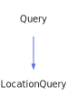

<a id="markupquery"></a>
<h1>MarkupQuery</h1>
<a id="classmddox_1_1doxygen_1_1markupquery"></a>
<a href="https://github.com/CharlesCarley/MdDox#~">~</a>
<a href="indexpage.md#mddox">MdDox</a>
<span class="inline-text">/</span>
<a href="index.md#index">Index</a>
<span class="inline-text">/</span>
<a href="namespaceMdDox.md#mddox">MdDox</a>
<span class="inline-text">::</span>
<a href="namespaceMdDox_1_1Doxygen.md#doxygen">Doxygen</a>
<span class="inline-text">::</span>
<span class="bold-text"><b>MarkupQuery</b></span>
<br/>
<br/>
<span class="inline-text">Implements the </span>
<code class="typewriter">docMarkupType</code>
<span class="inline-text"> scaffolding. </span>
<br/>
<a id="derived-from"></a>
<h4>Derived From</h4>
<div class="icon-link">
<a href="classMdDox_1_1Doxygen_1_1Query.md#query">MdDox::Doxygen::Query</a>
</div>
<br/>
<a id="public-methods"></a>
<h2>Public Methods</h2>
<span class="icon-list-item"><a href="#markupquery" class="icon-list-item"><span class="icon-list-item">MarkupQuery</span>
</a>
</span>
<br/>
<span class="icon-list-item"><a href="#markupquery" class="icon-list-item"><span class="icon-list-item">MarkupQuery</span>
</a>
</span>
<br/>
<span class="icon-list-item"><a href="#markupquery" class="icon-list-item"><span class="icon-list-item">MarkupQuery</span>
</a>
</span>
<br/>
<span class="icon-list-item"><a href="#getanchor" class="icon-list-item"><span class="icon-list-item">getAnchor</span>
</a>
</span>
<br/>
<span class="icon-list-item"><a href="#getanchor" class="icon-list-item"><span class="icon-list-item">getAnchor</span>
</a>
</span>
<br/>
<span class="icon-list-item"><a href="#getblockquote" class="icon-list-item"><span class="icon-list-item">getBlockQuote</span>
</a>
</span>
<br/>
<span class="icon-list-item"><a href="#getblockquote" class="icon-list-item"><span class="icon-list-item">getBlockQuote</span>
</a>
</span>
<br/>
<span class="icon-list-item"><a href="#getbold" class="icon-list-item"><span class="icon-list-item">getBold</span>
</a>
</span>
<br/>
<span class="icon-list-item"><a href="#getbold" class="icon-list-item"><span class="icon-list-item">getBold</span>
</a>
</span>
<br/>
<span class="icon-list-item"><a href="#getcenter" class="icon-list-item"><span class="icon-list-item">getCenter</span>
</a>
</span>
<br/>
<span class="icon-list-item"><a href="#getcenter" class="icon-list-item"><span class="icon-list-item">getCenter</span>
</a>
</span>
<br/>
<span class="icon-list-item"><a href="#getcomputeroutput" class="icon-list-item"><span class="icon-list-item">getComputerOutput</span>
</a>
</span>
<br/>
<span class="icon-list-item"><a href="#getcomputeroutput" class="icon-list-item"><span class="icon-list-item">getComputerOutput</span>
</a>
</span>
<br/>
<span class="icon-list-item"><a href="#getdot" class="icon-list-item"><span class="icon-list-item">getDot</span>
</a>
</span>
<br/>
<span class="icon-list-item"><a href="#getdotfile" class="icon-list-item"><span class="icon-list-item">getDotFile</span>
</a>
</span>
<br/>
<span class="icon-list-item"><a href="#getdotfile" class="icon-list-item"><span class="icon-list-item">getDotFile</span>
</a>
</span>
<br/>
<span class="icon-list-item"><a href="#getemphasis" class="icon-list-item"><span class="icon-list-item">getEmphasis</span>
</a>
</span>
<br/>
<span class="icon-list-item"><a href="#getemphasis" class="icon-list-item"><span class="icon-list-item">getEmphasis</span>
</a>
</span>
<br/>
<span class="icon-list-item"><a href="#getheading" class="icon-list-item"><span class="icon-list-item">getHeading</span>
</a>
</span>
<br/>
<span class="icon-list-item"><a href="#getheading" class="icon-list-item"><span class="icon-list-item">getHeading</span>
</a>
</span>
<br/>
<span class="icon-list-item"><a href="#gethruler" class="icon-list-item"><span class="icon-list-item">getHRuler</span>
</a>
</span>
<br/>
<span class="icon-list-item"><a href="#gethruler" class="icon-list-item"><span class="icon-list-item">getHRuler</span>
</a>
</span>
<br/>
<span class="icon-list-item"><a href="#getimage" class="icon-list-item"><span class="icon-list-item">getImage</span>
</a>
</span>
<br/>
<span class="icon-list-item"><a href="#getimage" class="icon-list-item"><span class="icon-list-item">getImage</span>
</a>
</span>
<br/>
<span class="icon-list-item"><a href="#getindexentry" class="icon-list-item"><span class="icon-list-item">getIndexEntry</span>
</a>
</span>
<br/>
<span class="icon-list-item"><a href="#getindexentry" class="icon-list-item"><span class="icon-list-item">getIndexEntry</span>
</a>
</span>
<br/>
<span class="icon-list-item"><a href="#getitemizedlist" class="icon-list-item"><span class="icon-list-item">getItemizedList</span>
</a>
</span>
<br/>
<span class="icon-list-item"><a href="#getitemizedlist" class="icon-list-item"><span class="icon-list-item">getItemizedList</span>
</a>
</span>
<br/>
<span class="icon-list-item"><a href="#getlang" class="icon-list-item"><span class="icon-list-item">getLang</span>
</a>
</span>
<br/>
<span class="icon-list-item"><a href="#getlang" class="icon-list-item"><span class="icon-list-item">getLang</span>
</a>
</span>
<br/>
<span class="icon-list-item"><a href="#getlanguage" class="icon-list-item"><span class="icon-list-item">getLanguage</span>
</a>
</span>
<br/>
<span class="icon-list-item"><a href="#getlanguage" class="icon-list-item"><span class="icon-list-item">getLanguage</span>
</a>
</span>
<br/>
<span class="icon-list-item"><a href="#getlinebreak" class="icon-list-item"><span class="icon-list-item">getLineBreak</span>
</a>
</span>
<br/>
<span class="icon-list-item"><a href="#getlinebreak" class="icon-list-item"><span class="icon-list-item">getLineBreak</span>
</a>
</span>
<br/>
<span class="icon-list-item"><a href="#getorderedlist" class="icon-list-item"><span class="icon-list-item">getOrderedList</span>
</a>
</span>
<br/>
<span class="icon-list-item"><a href="#getorderedlist" class="icon-list-item"><span class="icon-list-item">getOrderedList</span>
</a>
</span>
<br/>
<span class="icon-list-item"><a href="#getparagraph" class="icon-list-item"><span class="icon-list-item">getParagraph</span>
</a>
</span>
<br/>
<span class="icon-list-item"><a href="#getparagraph" class="icon-list-item"><span class="icon-list-item">getParagraph</span>
</a>
</span>
<br/>
<span class="icon-list-item"><a href="#getparameterlist" class="icon-list-item"><span class="icon-list-item">getParameterList</span>
</a>
</span>
<br/>
<span class="icon-list-item"><a href="#getparameterlist" class="icon-list-item"><span class="icon-list-item">getParameterList</span>
</a>
</span>
<br/>
<span class="icon-list-item"><a href="#getparblock" class="icon-list-item"><span class="icon-list-item">getParBlock</span>
</a>
</span>
<br/>
<span class="icon-list-item"><a href="#getparblock" class="icon-list-item"><span class="icon-list-item">getParBlock</span>
</a>
</span>
<br/>
<span class="icon-list-item"><a href="#getpart" class="icon-list-item"><span class="icon-list-item">getPart</span>
</a>
</span>
<br/>
<span class="icon-list-item"><a href="#getpart" class="icon-list-item"><span class="icon-list-item">getPart</span>
</a>
</span>
<br/>
<span class="icon-list-item"><a href="#getpreformatted" class="icon-list-item"><span class="icon-list-item">getPreFormatted</span>
</a>
</span>
<br/>
<span class="icon-list-item"><a href="#getpreformatted" class="icon-list-item"><span class="icon-list-item">getPreFormatted</span>
</a>
</span>
<br/>
<span class="icon-list-item"><a href="#getprogramlisting" class="icon-list-item"><span class="icon-list-item">getProgramListing</span>
</a>
</span>
<br/>
<span class="icon-list-item"><a href="#getprogramlisting" class="icon-list-item"><span class="icon-list-item">getProgramListing</span>
</a>
</span>
<br/>
<span class="icon-list-item"><a href="#getprop" class="icon-list-item"><span class="icon-list-item">getProp</span>
</a>
</span>
<br/>
<span class="icon-list-item"><a href="#getprop" class="icon-list-item"><span class="icon-list-item">getProp</span>
</a>
</span>
<br/>
<span class="icon-list-item"><a href="#getref" class="icon-list-item"><span class="icon-list-item">getRef</span>
</a>
</span>
<br/>
<span class="icon-list-item"><a href="#getref" class="icon-list-item"><span class="icon-list-item">getRef</span>
</a>
</span>
<br/>
<span class="icon-list-item"><a href="#getregistered" class="icon-list-item"><span class="icon-list-item">getRegistered</span>
</a>
</span>
<br/>
<span class="icon-list-item"><a href="#getregistered" class="icon-list-item"><span class="icon-list-item">getRegistered</span>
</a>
</span>
<br/>
<span class="icon-list-item"><a href="#getsect" class="icon-list-item"><span class="icon-list-item">getSect</span>
</a>
</span>
<br/>
<span class="icon-list-item"><a href="#getsect" class="icon-list-item"><span class="icon-list-item">getSect</span>
</a>
</span>
<br/>
<span class="icon-list-item"><a href="#getsimplesect" class="icon-list-item"><span class="icon-list-item">getSimpleSect</span>
</a>
</span>
<br/>
<span class="icon-list-item"><a href="#getsimplesect" class="icon-list-item"><span class="icon-list-item">getSimpleSect</span>
</a>
</span>
<br/>
<span class="icon-list-item"><a href="#getsmall" class="icon-list-item"><span class="icon-list-item">getSmall</span>
</a>
</span>
<br/>
<span class="icon-list-item"><a href="#getsmall" class="icon-list-item"><span class="icon-list-item">getSmall</span>
</a>
</span>
<br/>
<span class="icon-list-item"><a href="#gettable" class="icon-list-item"><span class="icon-list-item">getTable</span>
</a>
</span>
<br/>
<span class="icon-list-item"><a href="#gettable" class="icon-list-item"><span class="icon-list-item">getTable</span>
</a>
</span>
<br/>
<span class="icon-list-item"><a href="#gettitle" class="icon-list-item"><span class="icon-list-item">getTitle</span>
</a>
</span>
<br/>
<span class="icon-list-item"><a href="#gettitle" class="icon-list-item"><span class="icon-list-item">getTitle</span>
</a>
</span>
<br/>
<span class="icon-list-item"><a href="#gettoclist" class="icon-list-item"><span class="icon-list-item">getTocList</span>
</a>
</span>
<br/>
<span class="icon-list-item"><a href="#gettoclist" class="icon-list-item"><span class="icon-list-item">getTocList</span>
</a>
</span>
<br/>
<span class="icon-list-item"><a href="#getulink" class="icon-list-item"><span class="icon-list-item">getULink</span>
</a>
</span>
<br/>
<span class="icon-list-item"><a href="#getulink" class="icon-list-item"><span class="icon-list-item">getULink</span>
</a>
</span>
<br/>
<span class="icon-list-item"><a href="#getvariablelist" class="icon-list-item"><span class="icon-list-item">getVariableList</span>
</a>
</span>
<br/>
<span class="icon-list-item"><a href="#getvariablelist" class="icon-list-item"><span class="icon-list-item">getVariableList</span>
</a>
</span>
<br/>
<span class="icon-list-item"><a href="#getverbatim" class="icon-list-item"><span class="icon-list-item">getVerbatim</span>
</a>
</span>
<br/>
<span class="icon-list-item"><a href="#visit" class="icon-list-item"><span class="icon-list-item">visit</span>
</a>
</span>
<br/>
<a id="details"></a>
<h2>Details</h2>
<span class="inline-text">The following xml provides the source for the </span>
<span class="bold-text"><b>docMarkupType</b></span>
<span class="inline-text"> scaffolding.</span>

```xml
<xsd:complexType name="docMarkupType" mixed="true">
  <xsd:group ref="docCmdGroup" minOccurs="0" maxOccurs="unbounded"/>
</xsd:complexType>
```
<br/>
<a id="defined-in"></a>
<h4>Defined in</h4>
<span class="icon-list-item"><a href="https://github.com/CharlesCarley/MdDox/blob/master/Tools/Doxygen/MarkupQuery.h#L230" class="icon-list-item"><span class="icon-list-item">MarkupQuery.h</span>
</a>
</span>
<br/>
<br/>
<span class="icon-list-item"><a href="#markupquery" class="icon-list-item"><span class="icon-list-item">top</span>
</a>
</span>
<a id="markupquery"></a>
<h2>MarkupQuery</h2>
<span class="bold-text"><b>MarkupQuery</b></span>
<span class="italic-text"><i>(</i></span>
<span class="italic-text"><i>)</i></span>
<a id="defined-in"></a>
<h4>Defined in</h4>
<span class="icon-list-item"><a href="https://github.com/CharlesCarley/MdDox/blob/master/Tools/Doxygen/MarkupQuery.h#L232" class="icon-list-item"><span class="icon-list-item">MarkupQuery.h</span>
</a>
</span>
<br/>
<br/>
<span class="icon-list-item"><a href="#markupquery" class="icon-list-item"><span class="icon-list-item">top</span>
</a>
</span>
<br/>
<a id="markupquery"></a>
<h2>MarkupQuery</h2>
<span class="bold-text"><b>MarkupQuery</b></span>
<span class="italic-text"><i>(</i></span>
<div class="paragraph">
<span class="paragraph"><span class="inline-text">const </span>
<a href="classMdDox_1_1Doxygen_1_1MarkupQuery.md#markupquery">MarkupQuery</a>
<span class="inline-text"> &amp;</span>
<span class="inline-text">other</span>
</span>
</div>
<span class="italic-text"><i>)</i></span>
<a id="defined-in"></a>
<h4>Defined in</h4>
<span class="icon-list-item"><a href="https://github.com/CharlesCarley/MdDox/blob/master/Tools/Doxygen/MarkupQuery.h#L233" class="icon-list-item"><span class="icon-list-item">MarkupQuery.h</span>
</a>
</span>
<br/>
<br/>
<span class="icon-list-item"><a href="#markupquery" class="icon-list-item"><span class="icon-list-item">top</span>
</a>
</span>
<br/>
<a id="markupquery"></a>
<h2>MarkupQuery</h2>
<span class="bold-text"><b>MarkupQuery</b></span>
<span class="italic-text"><i>(</i></span>
<div class="paragraph">
<span class="paragraph"><a href="classMdDox_1_1Xml_1_1Node.md#node">Xml::Node</a>
<span class="inline-text"> *</span>
<span class="inline-text">node</span>
</span>
</div>
<span class="italic-text"><i>)</i></span>
<a id="defined-in"></a>
<h4>Defined in</h4>
<span class="icon-list-item"><a href="https://github.com/CharlesCarley/MdDox/blob/master/Tools/Doxygen/MarkupQuery.h#L235" class="icon-list-item"><span class="icon-list-item">MarkupQuery.h</span>
</a>
</span>
<br/>
<br/>
<span class="icon-list-item"><a href="#markupquery" class="icon-list-item"><span class="icon-list-item">top</span>
</a>
</span>
<br/>
<a id="getanchor"></a>
<h2>getAnchor</h2>
<span class="inline-text">void</span>
<span class="bold-text"><b>getAnchor</b></span>
<span class="italic-text"><i>(</i></span>
<div class="paragraph">
<span class="paragraph"><a href="classMdDox_1_1Doxygen_1_1AnchorQuery.md#anchorquery">AnchorQuery</a>
<span class="inline-text"> &amp;</span>
<span class="inline-text">dest</span>
</span>
</div>
<span class="italic-text"><i>)</i></span>
<a id="details"></a>
<h4>Details</h4>
<span class="inline-text">Provides access to the </span>
<span class="bold-text"><b>anchor</b></span>
<span class="inline-text"> attribute. </span>
<br/>
<br/>
<a id="references"></a>
<h4>References</h4>
<div class="paragraph">
<span class="paragraph"><a href="classMdDox_1_1Doxygen_1_1Query.md#_node">_node</a>
</span>
</div>
<div class="paragraph">
<span class="paragraph"><a href="classMdDox_1_1Doxygen_1_1Query.md#node">node</a>
</span>
</div>
<div class="paragraph">
<span class="paragraph"><a href="classMdDox_1_1Xml_1_1Node.md#firstchildof">firstChildOf</a>
</span>
</div>
<div class="paragraph">
<span class="paragraph"><a href="classMdDox_1_1Doxygen_1_1Query.md#reset">reset</a>
</span>
</div>
<a id="defined-in"></a>
<h4>Defined in</h4>
<span class="icon-list-item"><a href="https://github.com/CharlesCarley/MdDox/blob/master/Tools/Doxygen/MarkupQuery.h#L508" class="icon-list-item"><span class="icon-list-item">MarkupQuery.h</span>
</a>
</span>
<br/>
<span class="icon-list-item"><a href="https://github.com/CharlesCarley/MdDox/blob/master/Tools/Doxygen/MarkupQuery.cpp#L639" class="icon-list-item"><span class="icon-list-item">MarkupQuery.cpp</span>
</a>
</span>
<br/>
<br/>
<span class="icon-list-item"><a href="#markupquery" class="icon-list-item"><span class="icon-list-item">top</span>
</a>
</span>
<br/>
<a id="getanchor"></a>
<h2>getAnchor</h2>
<a href="classMdDox_1_1Doxygen_1_1AnchorQuery.md#anchorquery">AnchorQuery</a>
<span class="bold-text"><b>getAnchor</b></span>
<span class="italic-text"><i>(</i></span>
<span class="italic-text"><i>)</i></span>
<a id="details"></a>
<h4>Details</h4>
<span class="inline-text">Provides access to the </span>
<span class="bold-text"><b>anchor</b></span>
<span class="inline-text"> attribute. </span>
<br/>
<br/>
<a id="defined-in"></a>
<h4>Defined in</h4>
<span class="icon-list-item"><a href="https://github.com/CharlesCarley/MdDox/blob/master/Tools/Doxygen/MarkupQuery.h#L513" class="icon-list-item"><span class="icon-list-item">MarkupQuery.h</span>
</a>
</span>
<br/>
<span class="icon-list-item"><a href="https://github.com/CharlesCarley/MdDox/blob/master/Tools/Doxygen/MarkupQuery.cpp#L650" class="icon-list-item"><span class="icon-list-item">MarkupQuery.cpp</span>
</a>
</span>
<br/>
<br/>
<span class="icon-list-item"><a href="#markupquery" class="icon-list-item"><span class="icon-list-item">top</span>
</a>
</span>
<br/>
<a id="getblockquote"></a>
<h2>getBlockQuote</h2>
<span class="inline-text">void</span>
<span class="bold-text"><b>getBlockQuote</b></span>
<span class="italic-text"><i>(</i></span>
<div class="paragraph">
<span class="paragraph"><a href="classMdDox_1_1Doxygen_1_1BlockQuoteQuery.md#blockquotequery">BlockQuoteQuery</a>
<span class="inline-text"> &amp;</span>
<span class="inline-text">dest</span>
</span>
</div>
<span class="italic-text"><i>)</i></span>
<a id="details"></a>
<h4>Details</h4>
<span class="inline-text">Provides access to the </span>
<span class="bold-text"><b>blockquote</b></span>
<span class="inline-text"> attribute. </span>
<br/>
<br/>
<a id="references"></a>
<h4>References</h4>
<div class="paragraph">
<span class="paragraph"><a href="classMdDox_1_1Doxygen_1_1Query.md#_node">_node</a>
</span>
</div>
<div class="paragraph">
<span class="paragraph"><a href="classMdDox_1_1Doxygen_1_1Query.md#node">node</a>
</span>
</div>
<div class="paragraph">
<span class="paragraph"><a href="classMdDox_1_1Xml_1_1Node.md#firstchildof">firstChildOf</a>
</span>
</div>
<div class="paragraph">
<span class="paragraph"><a href="classMdDox_1_1Doxygen_1_1Query.md#reset">reset</a>
</span>
</div>
<a id="defined-in"></a>
<h4>Defined in</h4>
<span class="icon-list-item"><a href="https://github.com/CharlesCarley/MdDox/blob/master/Tools/Doxygen/MarkupQuery.h#L421" class="icon-list-item"><span class="icon-list-item">MarkupQuery.h</span>
</a>
</span>
<br/>
<span class="icon-list-item"><a href="https://github.com/CharlesCarley/MdDox/blob/master/Tools/Doxygen/MarkupQuery.cpp#L486" class="icon-list-item"><span class="icon-list-item">MarkupQuery.cpp</span>
</a>
</span>
<br/>
<br/>
<span class="icon-list-item"><a href="#markupquery" class="icon-list-item"><span class="icon-list-item">top</span>
</a>
</span>
<br/>
<a id="getblockquote"></a>
<h2>getBlockQuote</h2>
<a href="classMdDox_1_1Doxygen_1_1BlockQuoteQuery.md#blockquotequery">BlockQuoteQuery</a>
<span class="bold-text"><b>getBlockQuote</b></span>
<span class="italic-text"><i>(</i></span>
<span class="italic-text"><i>)</i></span>
<a id="details"></a>
<h4>Details</h4>
<span class="inline-text">Provides access to the </span>
<span class="bold-text"><b>blockquote</b></span>
<span class="inline-text"> attribute. </span>
<br/>
<br/>
<a id="defined-in"></a>
<h4>Defined in</h4>
<span class="icon-list-item"><a href="https://github.com/CharlesCarley/MdDox/blob/master/Tools/Doxygen/MarkupQuery.h#L426" class="icon-list-item"><span class="icon-list-item">MarkupQuery.h</span>
</a>
</span>
<br/>
<span class="icon-list-item"><a href="https://github.com/CharlesCarley/MdDox/blob/master/Tools/Doxygen/MarkupQuery.cpp#L497" class="icon-list-item"><span class="icon-list-item">MarkupQuery.cpp</span>
</a>
</span>
<br/>
<br/>
<span class="icon-list-item"><a href="#markupquery" class="icon-list-item"><span class="icon-list-item">top</span>
</a>
</span>
<br/>
<a id="getbold"></a>
<h2>getBold</h2>
<span class="inline-text">void</span>
<span class="bold-text"><b>getBold</b></span>
<span class="italic-text"><i>(</i></span>
<div class="paragraph">
<span class="paragraph"><a href="classMdDox_1_1Doxygen_1_1MarkupQuery.md#markupquery">MarkupQuery</a>
<span class="inline-text"> &amp;</span>
<span class="inline-text">dest</span>
</span>
</div>
<span class="italic-text"><i>)</i></span>
<a id="details"></a>
<h4>Details</h4>
<span class="inline-text">Provides access to the </span>
<span class="bold-text"><b>bold</b></span>
<span class="inline-text"> attribute. </span>
<br/>
<br/>
<a id="references"></a>
<h4>References</h4>
<div class="paragraph">
<span class="paragraph"><a href="classMdDox_1_1Doxygen_1_1Query.md#_node">_node</a>
</span>
</div>
<div class="paragraph">
<span class="paragraph"><a href="classMdDox_1_1Doxygen_1_1Query.md#node">node</a>
</span>
</div>
<div class="paragraph">
<span class="paragraph"><a href="classMdDox_1_1Xml_1_1Node.md#firstchildof">firstChildOf</a>
</span>
</div>
<div class="paragraph">
<span class="paragraph"><a href="classMdDox_1_1Doxygen_1_1MarkupQuery.md#markupquery">MarkupQuery</a>
</span>
</div>
<div class="paragraph">
<span class="paragraph"><a href="classMdDox_1_1Doxygen_1_1Query.md#reset">reset</a>
</span>
</div>
<a id="defined-in"></a>
<h4>Defined in</h4>
<span class="icon-list-item"><a href="https://github.com/CharlesCarley/MdDox/blob/master/Tools/Doxygen/MarkupQuery.h#L458" class="icon-list-item"><span class="icon-list-item">MarkupQuery.h</span>
</a>
</span>
<br/>
<span class="icon-list-item"><a href="https://github.com/CharlesCarley/MdDox/blob/master/Tools/Doxygen/MarkupQuery.cpp#L549" class="icon-list-item"><span class="icon-list-item">MarkupQuery.cpp</span>
</a>
</span>
<br/>
<br/>
<span class="icon-list-item"><a href="#markupquery" class="icon-list-item"><span class="icon-list-item">top</span>
</a>
</span>
<br/>
<a id="getbold"></a>
<h2>getBold</h2>
<a href="classMdDox_1_1Doxygen_1_1MarkupQuery.md#markupquery">MarkupQuery</a>
<span class="bold-text"><b>getBold</b></span>
<span class="italic-text"><i>(</i></span>
<span class="italic-text"><i>)</i></span>
<a id="details"></a>
<h4>Details</h4>
<span class="inline-text">Provides access to the </span>
<span class="bold-text"><b>bold</b></span>
<span class="inline-text"> attribute. </span>
<br/>
<br/>
<a id="defined-in"></a>
<h4>Defined in</h4>
<span class="icon-list-item"><a href="https://github.com/CharlesCarley/MdDox/blob/master/Tools/Doxygen/MarkupQuery.h#L463" class="icon-list-item"><span class="icon-list-item">MarkupQuery.h</span>
</a>
</span>
<br/>
<span class="icon-list-item"><a href="https://github.com/CharlesCarley/MdDox/blob/master/Tools/Doxygen/MarkupQuery.cpp#L560" class="icon-list-item"><span class="icon-list-item">MarkupQuery.cpp</span>
</a>
</span>
<br/>
<br/>
<span class="icon-list-item"><a href="#markupquery" class="icon-list-item"><span class="icon-list-item">top</span>
</a>
</span>
<br/>
<a id="getcenter"></a>
<h2>getCenter</h2>
<span class="inline-text">void</span>
<span class="bold-text"><b>getCenter</b></span>
<span class="italic-text"><i>(</i></span>
<div class="paragraph">
<span class="paragraph"><a href="classMdDox_1_1Doxygen_1_1MarkupQuery.md#markupquery">MarkupQuery</a>
<span class="inline-text"> &amp;</span>
<span class="inline-text">dest</span>
</span>
</div>
<span class="italic-text"><i>)</i></span>
<a id="details"></a>
<h4>Details</h4>
<span class="inline-text">Provides access to the </span>
<span class="bold-text"><b>center</b></span>
<span class="inline-text"> attribute. </span>
<br/>
<br/>
<a id="references"></a>
<h4>References</h4>
<div class="paragraph">
<span class="paragraph"><a href="classMdDox_1_1Doxygen_1_1Query.md#_node">_node</a>
</span>
</div>
<div class="paragraph">
<span class="paragraph"><a href="classMdDox_1_1Doxygen_1_1Query.md#node">node</a>
</span>
</div>
<div class="paragraph">
<span class="paragraph"><a href="classMdDox_1_1Xml_1_1Node.md#firstchildof">firstChildOf</a>
</span>
</div>
<div class="paragraph">
<span class="paragraph"><a href="classMdDox_1_1Doxygen_1_1MarkupQuery.md#markupquery">MarkupQuery</a>
</span>
</div>
<div class="paragraph">
<span class="paragraph"><a href="classMdDox_1_1Doxygen_1_1Query.md#reset">reset</a>
</span>
</div>
<a id="defined-in"></a>
<h4>Defined in</h4>
<span class="icon-list-item"><a href="https://github.com/CharlesCarley/MdDox/blob/master/Tools/Doxygen/MarkupQuery.h#L488" class="icon-list-item"><span class="icon-list-item">MarkupQuery.h</span>
</a>
</span>
<br/>
<span class="icon-list-item"><a href="https://github.com/CharlesCarley/MdDox/blob/master/Tools/Doxygen/MarkupQuery.cpp#L603" class="icon-list-item"><span class="icon-list-item">MarkupQuery.cpp</span>
</a>
</span>
<br/>
<br/>
<span class="icon-list-item"><a href="#markupquery" class="icon-list-item"><span class="icon-list-item">top</span>
</a>
</span>
<br/>
<a id="getcenter"></a>
<h2>getCenter</h2>
<a href="classMdDox_1_1Doxygen_1_1MarkupQuery.md#markupquery">MarkupQuery</a>
<span class="bold-text"><b>getCenter</b></span>
<span class="italic-text"><i>(</i></span>
<span class="italic-text"><i>)</i></span>
<a id="details"></a>
<h4>Details</h4>
<span class="inline-text">Provides access to the </span>
<span class="bold-text"><b>center</b></span>
<span class="inline-text"> attribute. </span>
<br/>
<br/>
<a id="defined-in"></a>
<h4>Defined in</h4>
<span class="icon-list-item"><a href="https://github.com/CharlesCarley/MdDox/blob/master/Tools/Doxygen/MarkupQuery.h#L493" class="icon-list-item"><span class="icon-list-item">MarkupQuery.h</span>
</a>
</span>
<br/>
<span class="icon-list-item"><a href="https://github.com/CharlesCarley/MdDox/blob/master/Tools/Doxygen/MarkupQuery.cpp#L614" class="icon-list-item"><span class="icon-list-item">MarkupQuery.cpp</span>
</a>
</span>
<br/>
<br/>
<span class="icon-list-item"><a href="#markupquery" class="icon-list-item"><span class="icon-list-item">top</span>
</a>
</span>
<br/>
<a id="getcomputeroutput"></a>
<h2>getComputerOutput</h2>
<span class="inline-text">void</span>
<span class="bold-text"><b>getComputerOutput</b></span>
<span class="italic-text"><i>(</i></span>
<div class="paragraph">
<span class="paragraph"><a href="classMdDox_1_1Doxygen_1_1MarkupQuery.md#markupquery">MarkupQuery</a>
<span class="inline-text"> &amp;</span>
<span class="inline-text">dest</span>
</span>
</div>
<span class="italic-text"><i>)</i></span>
<a id="details"></a>
<h4>Details</h4>
<span class="inline-text">Provides access to the </span>
<span class="bold-text"><b>computeroutput</b></span>
<span class="inline-text"> attribute. </span>
<br/>
<br/>
<a id="references"></a>
<h4>References</h4>
<div class="paragraph">
<span class="paragraph"><a href="classMdDox_1_1Doxygen_1_1Query.md#_node">_node</a>
</span>
</div>
<div class="paragraph">
<span class="paragraph"><a href="classMdDox_1_1Doxygen_1_1Query.md#node">node</a>
</span>
</div>
<div class="paragraph">
<span class="paragraph"><a href="classMdDox_1_1Xml_1_1Node.md#firstchildof">firstChildOf</a>
</span>
</div>
<div class="paragraph">
<span class="paragraph"><a href="classMdDox_1_1Doxygen_1_1MarkupQuery.md#markupquery">MarkupQuery</a>
</span>
</div>
<div class="paragraph">
<span class="paragraph"><a href="classMdDox_1_1Doxygen_1_1Query.md#reset">reset</a>
</span>
</div>
<a id="defined-in"></a>
<h4>Defined in</h4>
<span class="icon-list-item"><a href="https://github.com/CharlesCarley/MdDox/blob/master/Tools/Doxygen/MarkupQuery.h#L478" class="icon-list-item"><span class="icon-list-item">MarkupQuery.h</span>
</a>
</span>
<br/>
<span class="icon-list-item"><a href="https://github.com/CharlesCarley/MdDox/blob/master/Tools/Doxygen/MarkupQuery.cpp#L585" class="icon-list-item"><span class="icon-list-item">MarkupQuery.cpp</span>
</a>
</span>
<br/>
<br/>
<span class="icon-list-item"><a href="#markupquery" class="icon-list-item"><span class="icon-list-item">top</span>
</a>
</span>
<br/>
<a id="getcomputeroutput"></a>
<h2>getComputerOutput</h2>
<a href="classMdDox_1_1Doxygen_1_1MarkupQuery.md#markupquery">MarkupQuery</a>
<span class="bold-text"><b>getComputerOutput</b></span>
<span class="italic-text"><i>(</i></span>
<span class="italic-text"><i>)</i></span>
<a id="details"></a>
<h4>Details</h4>
<span class="inline-text">Provides access to the </span>
<span class="bold-text"><b>computeroutput</b></span>
<span class="inline-text"> attribute. </span>
<br/>
<br/>
<a id="defined-in"></a>
<h4>Defined in</h4>
<span class="icon-list-item"><a href="https://github.com/CharlesCarley/MdDox/blob/master/Tools/Doxygen/MarkupQuery.h#L483" class="icon-list-item"><span class="icon-list-item">MarkupQuery.h</span>
</a>
</span>
<br/>
<span class="icon-list-item"><a href="https://github.com/CharlesCarley/MdDox/blob/master/Tools/Doxygen/MarkupQuery.cpp#L596" class="icon-list-item"><span class="icon-list-item">MarkupQuery.cpp</span>
</a>
</span>
<br/>
<br/>
<span class="icon-list-item"><a href="#markupquery" class="icon-list-item"><span class="icon-list-item">top</span>
</a>
</span>
<br/>
<a id="getdot"></a>
<h2>getDot</h2>
<span class="inline-text">const </span>
<a href="namespaceMdDox.md#string">String</a>
<span class="inline-text"> &amp;</span>
<span class="bold-text"><b>getDot</b></span>
<span class="italic-text"><i>(</i></span>
<div class="paragraph">
<span class="paragraph"><span class="inline-text">const </span>
<a href="namespaceMdDox.md#string">String</a>
<span class="inline-text"> &amp;</span>
<span class="inline-text">notFound</span>
<span class="inline-text"> = </span>
<span class="inline-text">&quot;&quot;</span>
</span>
</div>
<span class="italic-text"><i>)</i></span>
<a id="details"></a>
<h4>Details</h4>
<span class="inline-text">Provides access to the </span>
<span class="bold-text"><b>dot</b></span>
<span class="inline-text"> tag&apos;s inner text. </span>
<br/>
<br/>
<a id="returns"></a>
<h4>Returns</h4>
<span class="inline-text">The </span>
<span class="bold-text"><b>dot&apos;s</b></span>
<span class="inline-text"> text or the default value if the node is invalid. </span>
<br/>
<br/>
<a id="references"></a>
<h4>References</h4>
<div class="paragraph">
<span class="paragraph"><a href="classMdDox_1_1Doxygen_1_1Query.md#_node">_node</a>
</span>
</div>
<div class="paragraph">
<span class="paragraph"><a href="classMdDox_1_1Doxygen_1_1Query.md#node">node</a>
</span>
</div>
<div class="paragraph">
<span class="paragraph"><a href="classMdDox_1_1Xml_1_1Node.md#firstchildof">firstChildOf</a>
</span>
</div>
<div class="paragraph">
<span class="paragraph"><a href="classMdDox_1_1Xml_1_1Node.md#text">text</a>
</span>
</div>
<a id="defined-in"></a>
<h4>Defined in</h4>
<span class="icon-list-item"><a href="https://github.com/CharlesCarley/MdDox/blob/master/Tools/Doxygen/MarkupQuery.h#L443" class="icon-list-item"><span class="icon-list-item">MarkupQuery.h</span>
</a>
</span>
<br/>
<span class="icon-list-item"><a href="https://github.com/CharlesCarley/MdDox/blob/master/Tools/Doxygen/MarkupQuery.cpp#L522" class="icon-list-item"><span class="icon-list-item">MarkupQuery.cpp</span>
</a>
</span>
<br/>
<br/>
<span class="icon-list-item"><a href="#markupquery" class="icon-list-item"><span class="icon-list-item">top</span>
</a>
</span>
<br/>
<a id="getdotfile"></a>
<h2>getDotFile</h2>
<span class="inline-text">void</span>
<span class="bold-text"><b>getDotFile</b></span>
<span class="italic-text"><i>(</i></span>
<div class="paragraph">
<span class="paragraph"><a href="classMdDox_1_1Doxygen_1_1FileQuery.md#filequery">FileQuery</a>
<span class="inline-text"> &amp;</span>
<span class="inline-text">dest</span>
</span>
</div>
<span class="italic-text"><i>)</i></span>
<a id="details"></a>
<h4>Details</h4>
<span class="inline-text">Provides access to the </span>
<span class="bold-text"><b>dotfile</b></span>
<span class="inline-text"> attribute. </span>
<br/>
<br/>
<a id="references"></a>
<h4>References</h4>
<div class="paragraph">
<span class="paragraph"><a href="classMdDox_1_1Doxygen_1_1Query.md#_node">_node</a>
</span>
</div>
<div class="paragraph">
<span class="paragraph"><a href="classMdDox_1_1Doxygen_1_1Query.md#node">node</a>
</span>
</div>
<div class="paragraph">
<span class="paragraph"><a href="classMdDox_1_1Xml_1_1Node.md#firstchildof">firstChildOf</a>
</span>
</div>
<div class="paragraph">
<span class="paragraph"><a href="classMdDox_1_1Doxygen_1_1Query.md#reset">reset</a>
</span>
</div>
<a id="defined-in"></a>
<h4>Defined in</h4>
<span class="icon-list-item"><a href="https://github.com/CharlesCarley/MdDox/blob/master/Tools/Doxygen/MarkupQuery.h#L381" class="icon-list-item"><span class="icon-list-item">MarkupQuery.h</span>
</a>
</span>
<br/>
<span class="icon-list-item"><a href="https://github.com/CharlesCarley/MdDox/blob/master/Tools/Doxygen/MarkupQuery.cpp#L414" class="icon-list-item"><span class="icon-list-item">MarkupQuery.cpp</span>
</a>
</span>
<br/>
<br/>
<span class="icon-list-item"><a href="#markupquery" class="icon-list-item"><span class="icon-list-item">top</span>
</a>
</span>
<br/>
<a id="getdotfile"></a>
<h2>getDotFile</h2>
<a href="classMdDox_1_1Doxygen_1_1FileQuery.md#filequery">FileQuery</a>
<span class="bold-text"><b>getDotFile</b></span>
<span class="italic-text"><i>(</i></span>
<span class="italic-text"><i>)</i></span>
<a id="details"></a>
<h4>Details</h4>
<span class="inline-text">Provides access to the </span>
<span class="bold-text"><b>dotfile</b></span>
<span class="inline-text"> attribute. </span>
<br/>
<br/>
<a id="defined-in"></a>
<h4>Defined in</h4>
<span class="icon-list-item"><a href="https://github.com/CharlesCarley/MdDox/blob/master/Tools/Doxygen/MarkupQuery.h#L386" class="icon-list-item"><span class="icon-list-item">MarkupQuery.h</span>
</a>
</span>
<br/>
<span class="icon-list-item"><a href="https://github.com/CharlesCarley/MdDox/blob/master/Tools/Doxygen/MarkupQuery.cpp#L425" class="icon-list-item"><span class="icon-list-item">MarkupQuery.cpp</span>
</a>
</span>
<br/>
<br/>
<span class="icon-list-item"><a href="#markupquery" class="icon-list-item"><span class="icon-list-item">top</span>
</a>
</span>
<br/>
<a id="getemphasis"></a>
<h2>getEmphasis</h2>
<span class="inline-text">void</span>
<span class="bold-text"><b>getEmphasis</b></span>
<span class="italic-text"><i>(</i></span>
<div class="paragraph">
<span class="paragraph"><a href="classMdDox_1_1Doxygen_1_1MarkupQuery.md#markupquery">MarkupQuery</a>
<span class="inline-text"> &amp;</span>
<span class="inline-text">dest</span>
</span>
</div>
<span class="italic-text"><i>)</i></span>
<a id="details"></a>
<h4>Details</h4>
<span class="inline-text">Provides access to the </span>
<span class="bold-text"><b>emphasis</b></span>
<span class="inline-text"> attribute. </span>
<br/>
<br/>
<a id="references"></a>
<h4>References</h4>
<div class="paragraph">
<span class="paragraph"><a href="classMdDox_1_1Doxygen_1_1Query.md#_node">_node</a>
</span>
</div>
<div class="paragraph">
<span class="paragraph"><a href="classMdDox_1_1Doxygen_1_1Query.md#node">node</a>
</span>
</div>
<div class="paragraph">
<span class="paragraph"><a href="classMdDox_1_1Xml_1_1Node.md#firstchildof">firstChildOf</a>
</span>
</div>
<div class="paragraph">
<span class="paragraph"><a href="classMdDox_1_1Doxygen_1_1MarkupQuery.md#markupquery">MarkupQuery</a>
</span>
</div>
<div class="paragraph">
<span class="paragraph"><a href="classMdDox_1_1Doxygen_1_1Query.md#reset">reset</a>
</span>
</div>
<a id="defined-in"></a>
<h4>Defined in</h4>
<span class="icon-list-item"><a href="https://github.com/CharlesCarley/MdDox/blob/master/Tools/Doxygen/MarkupQuery.h#L468" class="icon-list-item"><span class="icon-list-item">MarkupQuery.h</span>
</a>
</span>
<br/>
<span class="icon-list-item"><a href="https://github.com/CharlesCarley/MdDox/blob/master/Tools/Doxygen/MarkupQuery.cpp#L567" class="icon-list-item"><span class="icon-list-item">MarkupQuery.cpp</span>
</a>
</span>
<br/>
<br/>
<span class="icon-list-item"><a href="#markupquery" class="icon-list-item"><span class="icon-list-item">top</span>
</a>
</span>
<br/>
<a id="getemphasis"></a>
<h2>getEmphasis</h2>
<a href="classMdDox_1_1Doxygen_1_1MarkupQuery.md#markupquery">MarkupQuery</a>
<span class="bold-text"><b>getEmphasis</b></span>
<span class="italic-text"><i>(</i></span>
<span class="italic-text"><i>)</i></span>
<a id="details"></a>
<h4>Details</h4>
<span class="inline-text">Provides access to the </span>
<span class="bold-text"><b>emphasis</b></span>
<span class="inline-text"> attribute. </span>
<br/>
<br/>
<a id="defined-in"></a>
<h4>Defined in</h4>
<span class="icon-list-item"><a href="https://github.com/CharlesCarley/MdDox/blob/master/Tools/Doxygen/MarkupQuery.h#L473" class="icon-list-item"><span class="icon-list-item">MarkupQuery.h</span>
</a>
</span>
<br/>
<span class="icon-list-item"><a href="https://github.com/CharlesCarley/MdDox/blob/master/Tools/Doxygen/MarkupQuery.cpp#L578" class="icon-list-item"><span class="icon-list-item">MarkupQuery.cpp</span>
</a>
</span>
<br/>
<br/>
<span class="icon-list-item"><a href="#markupquery" class="icon-list-item"><span class="icon-list-item">top</span>
</a>
</span>
<br/>
<a id="getheading"></a>
<h2>getHeading</h2>
<span class="inline-text">void</span>
<span class="bold-text"><b>getHeading</b></span>
<span class="italic-text"><i>(</i></span>
<div class="paragraph">
<span class="paragraph"><a href="classMdDox_1_1Doxygen_1_1HeadingQuery.md#headingquery">HeadingQuery</a>
<span class="inline-text"> &amp;</span>
<span class="inline-text">dest</span>
</span>
</div>
<span class="italic-text"><i>)</i></span>
<a id="details"></a>
<h4>Details</h4>
<span class="inline-text">Provides access to the </span>
<span class="bold-text"><b>heading</b></span>
<span class="inline-text"> attribute. </span>
<br/>
<br/>
<a id="references"></a>
<h4>References</h4>
<div class="paragraph">
<span class="paragraph"><a href="classMdDox_1_1Doxygen_1_1Query.md#_node">_node</a>
</span>
</div>
<div class="paragraph">
<span class="paragraph"><a href="classMdDox_1_1Doxygen_1_1Query.md#node">node</a>
</span>
</div>
<div class="paragraph">
<span class="paragraph"><a href="classMdDox_1_1Xml_1_1Node.md#firstchildof">firstChildOf</a>
</span>
</div>
<div class="paragraph">
<span class="paragraph"><a href="classMdDox_1_1Doxygen_1_1Query.md#reset">reset</a>
</span>
</div>
<a id="defined-in"></a>
<h4>Defined in</h4>
<span class="icon-list-item"><a href="https://github.com/CharlesCarley/MdDox/blob/master/Tools/Doxygen/MarkupQuery.h#L361" class="icon-list-item"><span class="icon-list-item">MarkupQuery.h</span>
</a>
</span>
<br/>
<span class="icon-list-item"><a href="https://github.com/CharlesCarley/MdDox/blob/master/Tools/Doxygen/MarkupQuery.cpp#L378" class="icon-list-item"><span class="icon-list-item">MarkupQuery.cpp</span>
</a>
</span>
<br/>
<br/>
<span class="icon-list-item"><a href="#markupquery" class="icon-list-item"><span class="icon-list-item">top</span>
</a>
</span>
<br/>
<a id="getheading"></a>
<h2>getHeading</h2>
<a href="classMdDox_1_1Doxygen_1_1HeadingQuery.md#headingquery">HeadingQuery</a>
<span class="bold-text"><b>getHeading</b></span>
<span class="italic-text"><i>(</i></span>
<span class="italic-text"><i>)</i></span>
<a id="details"></a>
<h4>Details</h4>
<span class="inline-text">Provides access to the </span>
<span class="bold-text"><b>heading</b></span>
<span class="inline-text"> attribute. </span>
<br/>
<br/>
<a id="defined-in"></a>
<h4>Defined in</h4>
<span class="icon-list-item"><a href="https://github.com/CharlesCarley/MdDox/blob/master/Tools/Doxygen/MarkupQuery.h#L366" class="icon-list-item"><span class="icon-list-item">MarkupQuery.h</span>
</a>
</span>
<br/>
<span class="icon-list-item"><a href="https://github.com/CharlesCarley/MdDox/blob/master/Tools/Doxygen/MarkupQuery.cpp#L389" class="icon-list-item"><span class="icon-list-item">MarkupQuery.cpp</span>
</a>
</span>
<br/>
<br/>
<span class="icon-list-item"><a href="#markupquery" class="icon-list-item"><span class="icon-list-item">top</span>
</a>
</span>
<br/>
<a id="gethruler"></a>
<h2>getHRuler</h2>
<span class="inline-text">void</span>
<span class="bold-text"><b>getHRuler</b></span>
<span class="italic-text"><i>(</i></span>
<div class="paragraph">
<span class="paragraph"><a href="classMdDox_1_1Doxygen_1_1EmptyQuery.md#emptyquery">EmptyQuery</a>
<span class="inline-text"> &amp;</span>
<span class="inline-text">dest</span>
</span>
</div>
<span class="italic-text"><i>)</i></span>
<a id="details"></a>
<h4>Details</h4>
<span class="inline-text">Provides access to the </span>
<span class="bold-text"><b>hruler</b></span>
<span class="inline-text"> attribute. </span>
<br/>
<br/>
<a id="references"></a>
<h4>References</h4>
<div class="paragraph">
<span class="paragraph"><a href="classMdDox_1_1Doxygen_1_1Query.md#_node">_node</a>
</span>
</div>
<div class="paragraph">
<span class="paragraph"><a href="classMdDox_1_1Doxygen_1_1Query.md#node">node</a>
</span>
</div>
<div class="paragraph">
<span class="paragraph"><a href="classMdDox_1_1Xml_1_1Node.md#firstchildof">firstChildOf</a>
</span>
</div>
<div class="paragraph">
<span class="paragraph"><a href="classMdDox_1_1Doxygen_1_1Query.md#reset">reset</a>
</span>
</div>
<a id="defined-in"></a>
<h4>Defined in</h4>
<span class="icon-list-item"><a href="https://github.com/CharlesCarley/MdDox/blob/master/Tools/Doxygen/MarkupQuery.h#L261" class="icon-list-item"><span class="icon-list-item">MarkupQuery.h</span>
</a>
</span>
<br/>
<span class="icon-list-item"><a href="https://github.com/CharlesCarley/MdDox/blob/master/Tools/Doxygen/MarkupQuery.cpp#L198" class="icon-list-item"><span class="icon-list-item">MarkupQuery.cpp</span>
</a>
</span>
<br/>
<br/>
<span class="icon-list-item"><a href="#markupquery" class="icon-list-item"><span class="icon-list-item">top</span>
</a>
</span>
<br/>
<a id="gethruler"></a>
<h2>getHRuler</h2>
<a href="classMdDox_1_1Doxygen_1_1EmptyQuery.md#emptyquery">EmptyQuery</a>
<span class="bold-text"><b>getHRuler</b></span>
<span class="italic-text"><i>(</i></span>
<span class="italic-text"><i>)</i></span>
<a id="details"></a>
<h4>Details</h4>
<span class="inline-text">Provides access to the </span>
<span class="bold-text"><b>hruler</b></span>
<span class="inline-text"> attribute. </span>
<br/>
<br/>
<a id="defined-in"></a>
<h4>Defined in</h4>
<span class="icon-list-item"><a href="https://github.com/CharlesCarley/MdDox/blob/master/Tools/Doxygen/MarkupQuery.h#L266" class="icon-list-item"><span class="icon-list-item">MarkupQuery.h</span>
</a>
</span>
<br/>
<span class="icon-list-item"><a href="https://github.com/CharlesCarley/MdDox/blob/master/Tools/Doxygen/MarkupQuery.cpp#L209" class="icon-list-item"><span class="icon-list-item">MarkupQuery.cpp</span>
</a>
</span>
<br/>
<br/>
<span class="icon-list-item"><a href="#markupquery" class="icon-list-item"><span class="icon-list-item">top</span>
</a>
</span>
<br/>
<a id="getimage"></a>
<h2>getImage</h2>
<span class="inline-text">void</span>
<span class="bold-text"><b>getImage</b></span>
<span class="italic-text"><i>(</i></span>
<div class="paragraph">
<span class="paragraph"><a href="classMdDox_1_1Doxygen_1_1ImageQuery.md#imagequery">ImageQuery</a>
<span class="inline-text"> &amp;</span>
<span class="inline-text">dest</span>
</span>
</div>
<span class="italic-text"><i>)</i></span>
<a id="details"></a>
<h4>Details</h4>
<span class="inline-text">Provides access to the </span>
<span class="bold-text"><b>image</b></span>
<span class="inline-text"> attribute. </span>
<br/>
<br/>
<a id="references"></a>
<h4>References</h4>
<div class="paragraph">
<span class="paragraph"><a href="classMdDox_1_1Doxygen_1_1Query.md#_node">_node</a>
</span>
</div>
<div class="paragraph">
<span class="paragraph"><a href="classMdDox_1_1Doxygen_1_1Query.md#node">node</a>
</span>
</div>
<div class="paragraph">
<span class="paragraph"><a href="classMdDox_1_1Xml_1_1Node.md#firstchildof">firstChildOf</a>
</span>
</div>
<div class="paragraph">
<span class="paragraph"><a href="classMdDox_1_1Doxygen_1_1Query.md#reset">reset</a>
</span>
</div>
<a id="defined-in"></a>
<h4>Defined in</h4>
<span class="icon-list-item"><a href="https://github.com/CharlesCarley/MdDox/blob/master/Tools/Doxygen/MarkupQuery.h#L371" class="icon-list-item"><span class="icon-list-item">MarkupQuery.h</span>
</a>
</span>
<br/>
<span class="icon-list-item"><a href="https://github.com/CharlesCarley/MdDox/blob/master/Tools/Doxygen/MarkupQuery.cpp#L396" class="icon-list-item"><span class="icon-list-item">MarkupQuery.cpp</span>
</a>
</span>
<br/>
<br/>
<span class="icon-list-item"><a href="#markupquery" class="icon-list-item"><span class="icon-list-item">top</span>
</a>
</span>
<br/>
<a id="getimage"></a>
<h2>getImage</h2>
<a href="classMdDox_1_1Doxygen_1_1ImageQuery.md#imagequery">ImageQuery</a>
<span class="bold-text"><b>getImage</b></span>
<span class="italic-text"><i>(</i></span>
<span class="italic-text"><i>)</i></span>
<a id="details"></a>
<h4>Details</h4>
<span class="inline-text">Provides access to the </span>
<span class="bold-text"><b>image</b></span>
<span class="inline-text"> attribute. </span>
<br/>
<br/>
<a id="defined-in"></a>
<h4>Defined in</h4>
<span class="icon-list-item"><a href="https://github.com/CharlesCarley/MdDox/blob/master/Tools/Doxygen/MarkupQuery.h#L376" class="icon-list-item"><span class="icon-list-item">MarkupQuery.h</span>
</a>
</span>
<br/>
<span class="icon-list-item"><a href="https://github.com/CharlesCarley/MdDox/blob/master/Tools/Doxygen/MarkupQuery.cpp#L407" class="icon-list-item"><span class="icon-list-item">MarkupQuery.cpp</span>
</a>
</span>
<br/>
<br/>
<span class="icon-list-item"><a href="#markupquery" class="icon-list-item"><span class="icon-list-item">top</span>
</a>
</span>
<br/>
<a id="getindexentry"></a>
<h2>getIndexEntry</h2>
<span class="inline-text">void</span>
<span class="bold-text"><b>getIndexEntry</b></span>
<span class="italic-text"><i>(</i></span>
<div class="paragraph">
<span class="paragraph"><a href="classMdDox_1_1Doxygen_1_1IndexEntryQuery.md#indexentryquery">IndexEntryQuery</a>
<span class="inline-text"> &amp;</span>
<span class="inline-text">dest</span>
</span>
</div>
<span class="italic-text"><i>)</i></span>
<a id="details"></a>
<h4>Details</h4>
<span class="inline-text">Provides access to the </span>
<span class="bold-text"><b>indexentry</b></span>
<span class="inline-text"> attribute. </span>
<br/>
<br/>
<a id="references"></a>
<h4>References</h4>
<div class="paragraph">
<span class="paragraph"><a href="classMdDox_1_1Doxygen_1_1Query.md#_node">_node</a>
</span>
</div>
<div class="paragraph">
<span class="paragraph"><a href="classMdDox_1_1Doxygen_1_1Query.md#node">node</a>
</span>
</div>
<div class="paragraph">
<span class="paragraph"><a href="classMdDox_1_1Xml_1_1Node.md#firstchildof">firstChildOf</a>
</span>
</div>
<div class="paragraph">
<span class="paragraph"><a href="classMdDox_1_1Doxygen_1_1Query.md#reset">reset</a>
</span>
</div>
<a id="defined-in"></a>
<h4>Defined in</h4>
<span class="icon-list-item"><a href="https://github.com/CharlesCarley/MdDox/blob/master/Tools/Doxygen/MarkupQuery.h#L291" class="icon-list-item"><span class="icon-list-item">MarkupQuery.h</span>
</a>
</span>
<br/>
<span class="icon-list-item"><a href="https://github.com/CharlesCarley/MdDox/blob/master/Tools/Doxygen/MarkupQuery.cpp#L252" class="icon-list-item"><span class="icon-list-item">MarkupQuery.cpp</span>
</a>
</span>
<br/>
<br/>
<span class="icon-list-item"><a href="#markupquery" class="icon-list-item"><span class="icon-list-item">top</span>
</a>
</span>
<br/>
<a id="getindexentry"></a>
<h2>getIndexEntry</h2>
<a href="classMdDox_1_1Doxygen_1_1IndexEntryQuery.md#indexentryquery">IndexEntryQuery</a>
<span class="bold-text"><b>getIndexEntry</b></span>
<span class="italic-text"><i>(</i></span>
<span class="italic-text"><i>)</i></span>
<a id="details"></a>
<h4>Details</h4>
<span class="inline-text">Provides access to the </span>
<span class="bold-text"><b>indexentry</b></span>
<span class="inline-text"> attribute. </span>
<br/>
<br/>
<a id="defined-in"></a>
<h4>Defined in</h4>
<span class="icon-list-item"><a href="https://github.com/CharlesCarley/MdDox/blob/master/Tools/Doxygen/MarkupQuery.h#L296" class="icon-list-item"><span class="icon-list-item">MarkupQuery.h</span>
</a>
</span>
<br/>
<span class="icon-list-item"><a href="https://github.com/CharlesCarley/MdDox/blob/master/Tools/Doxygen/MarkupQuery.cpp#L263" class="icon-list-item"><span class="icon-list-item">MarkupQuery.cpp</span>
</a>
</span>
<br/>
<br/>
<span class="icon-list-item"><a href="#markupquery" class="icon-list-item"><span class="icon-list-item">top</span>
</a>
</span>
<br/>
<a id="getitemizedlist"></a>
<h2>getItemizedList</h2>
<span class="inline-text">void</span>
<span class="bold-text"><b>getItemizedList</b></span>
<span class="italic-text"><i>(</i></span>
<div class="paragraph">
<span class="paragraph"><a href="classMdDox_1_1Doxygen_1_1ListQuery.md#listquery">ListQuery</a>
<span class="inline-text"> &amp;</span>
<span class="inline-text">dest</span>
</span>
</div>
<span class="italic-text"><i>)</i></span>
<a id="details"></a>
<h4>Details</h4>
<span class="inline-text">Provides access to the </span>
<span class="bold-text"><b>itemizedlist</b></span>
<span class="inline-text"> attribute. </span>
<br/>
<br/>
<a id="references"></a>
<h4>References</h4>
<div class="paragraph">
<span class="paragraph"><a href="classMdDox_1_1Doxygen_1_1Query.md#_node">_node</a>
</span>
</div>
<div class="paragraph">
<span class="paragraph"><a href="classMdDox_1_1Doxygen_1_1Query.md#node">node</a>
</span>
</div>
<div class="paragraph">
<span class="paragraph"><a href="classMdDox_1_1Xml_1_1Node.md#firstchildof">firstChildOf</a>
</span>
</div>
<div class="paragraph">
<span class="paragraph"><a href="classMdDox_1_1Doxygen_1_1Query.md#reset">reset</a>
</span>
</div>
<a id="defined-in"></a>
<h4>Defined in</h4>
<span class="icon-list-item"><a href="https://github.com/CharlesCarley/MdDox/blob/master/Tools/Doxygen/MarkupQuery.h#L311" class="icon-list-item"><span class="icon-list-item">MarkupQuery.h</span>
</a>
</span>
<br/>
<span class="icon-list-item"><a href="https://github.com/CharlesCarley/MdDox/blob/master/Tools/Doxygen/MarkupQuery.cpp#L288" class="icon-list-item"><span class="icon-list-item">MarkupQuery.cpp</span>
</a>
</span>
<br/>
<br/>
<span class="icon-list-item"><a href="#markupquery" class="icon-list-item"><span class="icon-list-item">top</span>
</a>
</span>
<br/>
<a id="getitemizedlist"></a>
<h2>getItemizedList</h2>
<a href="classMdDox_1_1Doxygen_1_1ListQuery.md#listquery">ListQuery</a>
<span class="bold-text"><b>getItemizedList</b></span>
<span class="italic-text"><i>(</i></span>
<span class="italic-text"><i>)</i></span>
<a id="details"></a>
<h4>Details</h4>
<span class="inline-text">Provides access to the </span>
<span class="bold-text"><b>itemizedlist</b></span>
<span class="inline-text"> attribute. </span>
<br/>
<br/>
<a id="defined-in"></a>
<h4>Defined in</h4>
<span class="icon-list-item"><a href="https://github.com/CharlesCarley/MdDox/blob/master/Tools/Doxygen/MarkupQuery.h#L316" class="icon-list-item"><span class="icon-list-item">MarkupQuery.h</span>
</a>
</span>
<br/>
<span class="icon-list-item"><a href="https://github.com/CharlesCarley/MdDox/blob/master/Tools/Doxygen/MarkupQuery.cpp#L299" class="icon-list-item"><span class="icon-list-item">MarkupQuery.cpp</span>
</a>
</span>
<br/>
<br/>
<span class="icon-list-item"><a href="#markupquery" class="icon-list-item"><span class="icon-list-item">top</span>
</a>
</span>
<br/>
<a id="getlang"></a>
<h2>getLang</h2>
<span class="inline-text">void</span>
<span class="bold-text"><b>getLang</b></span>
<span class="italic-text"><i>(</i></span>
<div class="paragraph">
<span class="paragraph"><a href="classMdDox_1_1Doxygen_1_1EmptyQuery.md#emptyquery">EmptyQuery</a>
<span class="inline-text"> &amp;</span>
<span class="inline-text">dest</span>
</span>
</div>
<span class="italic-text"><i>)</i></span>
<a id="details"></a>
<h4>Details</h4>
<span class="inline-text">Provides access to the </span>
<span class="bold-text"><b>lang</b></span>
<span class="inline-text"> attribute. </span>
<br/>
<br/>
<a id="references"></a>
<h4>References</h4>
<div class="paragraph">
<span class="paragraph"><a href="classMdDox_1_1Doxygen_1_1Query.md#_node">_node</a>
</span>
</div>
<div class="paragraph">
<span class="paragraph"><a href="classMdDox_1_1Doxygen_1_1Query.md#node">node</a>
</span>
</div>
<div class="paragraph">
<span class="paragraph"><a href="classMdDox_1_1Xml_1_1Node.md#firstchildof">firstChildOf</a>
</span>
</div>
<div class="paragraph">
<span class="paragraph"><a href="classMdDox_1_1Doxygen_1_1Query.md#reset">reset</a>
</span>
</div>
<a id="defined-in"></a>
<h4>Defined in</h4>
<span class="icon-list-item"><a href="https://github.com/CharlesCarley/MdDox/blob/master/Tools/Doxygen/MarkupQuery.h#L578" class="icon-list-item"><span class="icon-list-item">MarkupQuery.h</span>
</a>
</span>
<br/>
<span class="icon-list-item"><a href="https://github.com/CharlesCarley/MdDox/blob/master/Tools/Doxygen/MarkupQuery.cpp#L765" class="icon-list-item"><span class="icon-list-item">MarkupQuery.cpp</span>
</a>
</span>
<br/>
<br/>
<span class="icon-list-item"><a href="#markupquery" class="icon-list-item"><span class="icon-list-item">top</span>
</a>
</span>
<br/>
<a id="getlang"></a>
<h2>getLang</h2>
<a href="classMdDox_1_1Doxygen_1_1EmptyQuery.md#emptyquery">EmptyQuery</a>
<span class="bold-text"><b>getLang</b></span>
<span class="italic-text"><i>(</i></span>
<span class="italic-text"><i>)</i></span>
<a id="details"></a>
<h4>Details</h4>
<span class="inline-text">Provides access to the </span>
<span class="bold-text"><b>lang</b></span>
<span class="inline-text"> attribute. </span>
<br/>
<br/>
<a id="defined-in"></a>
<h4>Defined in</h4>
<span class="icon-list-item"><a href="https://github.com/CharlesCarley/MdDox/blob/master/Tools/Doxygen/MarkupQuery.h#L583" class="icon-list-item"><span class="icon-list-item">MarkupQuery.h</span>
</a>
</span>
<br/>
<span class="icon-list-item"><a href="https://github.com/CharlesCarley/MdDox/blob/master/Tools/Doxygen/MarkupQuery.cpp#L776" class="icon-list-item"><span class="icon-list-item">MarkupQuery.cpp</span>
</a>
</span>
<br/>
<br/>
<span class="icon-list-item"><a href="#markupquery" class="icon-list-item"><span class="icon-list-item">top</span>
</a>
</span>
<br/>
<a id="getlanguage"></a>
<h2>getLanguage</h2>
<span class="inline-text">void</span>
<span class="bold-text"><b>getLanguage</b></span>
<span class="italic-text"><i>(</i></span>
<div class="paragraph">
<span class="paragraph"><a href="classMdDox_1_1Doxygen_1_1LanguageQuery.md#languagequery">LanguageQuery</a>
<span class="inline-text"> &amp;</span>
<span class="inline-text">dest</span>
</span>
</div>
<span class="italic-text"><i>)</i></span>
<a id="details"></a>
<h4>Details</h4>
<span class="inline-text">Provides access to the </span>
<span class="bold-text"><b>language</b></span>
<span class="inline-text"> attribute. </span>
<br/>
<br/>
<a id="references"></a>
<h4>References</h4>
<div class="paragraph">
<span class="paragraph"><a href="classMdDox_1_1Doxygen_1_1Query.md#_node">_node</a>
</span>
</div>
<div class="paragraph">
<span class="paragraph"><a href="classMdDox_1_1Doxygen_1_1Query.md#node">node</a>
</span>
</div>
<div class="paragraph">
<span class="paragraph"><a href="classMdDox_1_1Xml_1_1Node.md#firstchildof">firstChildOf</a>
</span>
</div>
<div class="paragraph">
<span class="paragraph"><a href="classMdDox_1_1Doxygen_1_1Query.md#reset">reset</a>
</span>
</div>
<a id="defined-in"></a>
<h4>Defined in</h4>
<span class="icon-list-item"><a href="https://github.com/CharlesCarley/MdDox/blob/master/Tools/Doxygen/MarkupQuery.h#L401" class="icon-list-item"><span class="icon-list-item">MarkupQuery.h</span>
</a>
</span>
<br/>
<span class="icon-list-item"><a href="https://github.com/CharlesCarley/MdDox/blob/master/Tools/Doxygen/MarkupQuery.cpp#L450" class="icon-list-item"><span class="icon-list-item">MarkupQuery.cpp</span>
</a>
</span>
<br/>
<br/>
<span class="icon-list-item"><a href="#markupquery" class="icon-list-item"><span class="icon-list-item">top</span>
</a>
</span>
<br/>
<a id="getlanguage"></a>
<h2>getLanguage</h2>
<a href="classMdDox_1_1Doxygen_1_1LanguageQuery.md#languagequery">LanguageQuery</a>
<span class="bold-text"><b>getLanguage</b></span>
<span class="italic-text"><i>(</i></span>
<span class="italic-text"><i>)</i></span>
<a id="details"></a>
<h4>Details</h4>
<span class="inline-text">Provides access to the </span>
<span class="bold-text"><b>language</b></span>
<span class="inline-text"> attribute. </span>
<br/>
<br/>
<a id="defined-in"></a>
<h4>Defined in</h4>
<span class="icon-list-item"><a href="https://github.com/CharlesCarley/MdDox/blob/master/Tools/Doxygen/MarkupQuery.h#L406" class="icon-list-item"><span class="icon-list-item">MarkupQuery.h</span>
</a>
</span>
<br/>
<span class="icon-list-item"><a href="https://github.com/CharlesCarley/MdDox/blob/master/Tools/Doxygen/MarkupQuery.cpp#L461" class="icon-list-item"><span class="icon-list-item">MarkupQuery.cpp</span>
</a>
</span>
<br/>
<br/>
<span class="icon-list-item"><a href="#markupquery" class="icon-list-item"><span class="icon-list-item">top</span>
</a>
</span>
<br/>
<a id="getlinebreak"></a>
<h2>getLineBreak</h2>
<span class="inline-text">void</span>
<span class="bold-text"><b>getLineBreak</b></span>
<span class="italic-text"><i>(</i></span>
<div class="paragraph">
<span class="paragraph"><a href="classMdDox_1_1Doxygen_1_1EmptyQuery.md#emptyquery">EmptyQuery</a>
<span class="inline-text"> &amp;</span>
<span class="inline-text">dest</span>
</span>
</div>
<span class="italic-text"><i>)</i></span>
<a id="details"></a>
<h4>Details</h4>
<span class="inline-text">Provides access to the </span>
<span class="bold-text"><b>linebreak</b></span>
<span class="inline-text"> attribute. </span>
<br/>
<br/>
<a id="references"></a>
<h4>References</h4>
<div class="paragraph">
<span class="paragraph"><a href="classMdDox_1_1Doxygen_1_1Query.md#_node">_node</a>
</span>
</div>
<div class="paragraph">
<span class="paragraph"><a href="classMdDox_1_1Doxygen_1_1Query.md#node">node</a>
</span>
</div>
<div class="paragraph">
<span class="paragraph"><a href="classMdDox_1_1Xml_1_1Node.md#firstchildof">firstChildOf</a>
</span>
</div>
<div class="paragraph">
<span class="paragraph"><a href="classMdDox_1_1Doxygen_1_1Query.md#reset">reset</a>
</span>
</div>
<a id="defined-in"></a>
<h4>Defined in</h4>
<span class="icon-list-item"><a href="https://github.com/CharlesCarley/MdDox/blob/master/Tools/Doxygen/MarkupQuery.h#L251" class="icon-list-item"><span class="icon-list-item">MarkupQuery.h</span>
</a>
</span>
<br/>
<span class="icon-list-item"><a href="https://github.com/CharlesCarley/MdDox/blob/master/Tools/Doxygen/MarkupQuery.cpp#L180" class="icon-list-item"><span class="icon-list-item">MarkupQuery.cpp</span>
</a>
</span>
<br/>
<br/>
<span class="icon-list-item"><a href="#markupquery" class="icon-list-item"><span class="icon-list-item">top</span>
</a>
</span>
<br/>
<a id="getlinebreak"></a>
<h2>getLineBreak</h2>
<a href="classMdDox_1_1Doxygen_1_1EmptyQuery.md#emptyquery">EmptyQuery</a>
<span class="bold-text"><b>getLineBreak</b></span>
<span class="italic-text"><i>(</i></span>
<span class="italic-text"><i>)</i></span>
<a id="details"></a>
<h4>Details</h4>
<span class="inline-text">Provides access to the </span>
<span class="bold-text"><b>linebreak</b></span>
<span class="inline-text"> attribute. </span>
<br/>
<br/>
<a id="defined-in"></a>
<h4>Defined in</h4>
<span class="icon-list-item"><a href="https://github.com/CharlesCarley/MdDox/blob/master/Tools/Doxygen/MarkupQuery.h#L256" class="icon-list-item"><span class="icon-list-item">MarkupQuery.h</span>
</a>
</span>
<br/>
<span class="icon-list-item"><a href="https://github.com/CharlesCarley/MdDox/blob/master/Tools/Doxygen/MarkupQuery.cpp#L191" class="icon-list-item"><span class="icon-list-item">MarkupQuery.cpp</span>
</a>
</span>
<br/>
<br/>
<span class="icon-list-item"><a href="#markupquery" class="icon-list-item"><span class="icon-list-item">top</span>
</a>
</span>
<br/>
<a id="getorderedlist"></a>
<h2>getOrderedList</h2>
<span class="inline-text">void</span>
<span class="bold-text"><b>getOrderedList</b></span>
<span class="italic-text"><i>(</i></span>
<div class="paragraph">
<span class="paragraph"><a href="classMdDox_1_1Doxygen_1_1ListQuery.md#listquery">ListQuery</a>
<span class="inline-text"> &amp;</span>
<span class="inline-text">dest</span>
</span>
</div>
<span class="italic-text"><i>)</i></span>
<a id="details"></a>
<h4>Details</h4>
<span class="inline-text">Provides access to the </span>
<span class="bold-text"><b>orderedlist</b></span>
<span class="inline-text"> attribute. </span>
<br/>
<br/>
<a id="references"></a>
<h4>References</h4>
<div class="paragraph">
<span class="paragraph"><a href="classMdDox_1_1Doxygen_1_1Query.md#_node">_node</a>
</span>
</div>
<div class="paragraph">
<span class="paragraph"><a href="classMdDox_1_1Doxygen_1_1Query.md#node">node</a>
</span>
</div>
<div class="paragraph">
<span class="paragraph"><a href="classMdDox_1_1Xml_1_1Node.md#firstchildof">firstChildOf</a>
</span>
</div>
<div class="paragraph">
<span class="paragraph"><a href="classMdDox_1_1Doxygen_1_1Query.md#reset">reset</a>
</span>
</div>
<a id="defined-in"></a>
<h4>Defined in</h4>
<span class="icon-list-item"><a href="https://github.com/CharlesCarley/MdDox/blob/master/Tools/Doxygen/MarkupQuery.h#L301" class="icon-list-item"><span class="icon-list-item">MarkupQuery.h</span>
</a>
</span>
<br/>
<span class="icon-list-item"><a href="https://github.com/CharlesCarley/MdDox/blob/master/Tools/Doxygen/MarkupQuery.cpp#L270" class="icon-list-item"><span class="icon-list-item">MarkupQuery.cpp</span>
</a>
</span>
<br/>
<br/>
<span class="icon-list-item"><a href="#markupquery" class="icon-list-item"><span class="icon-list-item">top</span>
</a>
</span>
<br/>
<a id="getorderedlist"></a>
<h2>getOrderedList</h2>
<a href="classMdDox_1_1Doxygen_1_1ListQuery.md#listquery">ListQuery</a>
<span class="bold-text"><b>getOrderedList</b></span>
<span class="italic-text"><i>(</i></span>
<span class="italic-text"><i>)</i></span>
<a id="details"></a>
<h4>Details</h4>
<span class="inline-text">Provides access to the </span>
<span class="bold-text"><b>orderedlist</b></span>
<span class="inline-text"> attribute. </span>
<br/>
<br/>
<a id="defined-in"></a>
<h4>Defined in</h4>
<span class="icon-list-item"><a href="https://github.com/CharlesCarley/MdDox/blob/master/Tools/Doxygen/MarkupQuery.h#L306" class="icon-list-item"><span class="icon-list-item">MarkupQuery.h</span>
</a>
</span>
<br/>
<span class="icon-list-item"><a href="https://github.com/CharlesCarley/MdDox/blob/master/Tools/Doxygen/MarkupQuery.cpp#L281" class="icon-list-item"><span class="icon-list-item">MarkupQuery.cpp</span>
</a>
</span>
<br/>
<br/>
<span class="icon-list-item"><a href="#markupquery" class="icon-list-item"><span class="icon-list-item">top</span>
</a>
</span>
<br/>
<a id="getparagraph"></a>
<h2>getParagraph</h2>
<span class="inline-text">void</span>
<span class="bold-text"><b>getParagraph</b></span>
<span class="italic-text"><i>(</i></span>
<div class="paragraph">
<span class="paragraph"><a href="classMdDox_1_1Doxygen_1_1ParaQuery.md#paraquery">ParaQuery</a>
<span class="inline-text"> &amp;</span>
<span class="inline-text">dest</span>
</span>
</div>
<span class="italic-text"><i>)</i></span>
<a id="details"></a>
<h4>Details</h4>
<span class="inline-text">Provides access to the </span>
<span class="bold-text"><b>para</b></span>
<span class="inline-text"> attribute. </span>
<br/>
<br/>
<a id="references"></a>
<h4>References</h4>
<div class="paragraph">
<span class="paragraph"><a href="classMdDox_1_1Doxygen_1_1Query.md#_node">_node</a>
</span>
</div>
<div class="paragraph">
<span class="paragraph"><a href="classMdDox_1_1Doxygen_1_1Query.md#node">node</a>
</span>
</div>
<div class="paragraph">
<span class="paragraph"><a href="classMdDox_1_1Xml_1_1Node.md#firstchildof">firstChildOf</a>
</span>
</div>
<div class="paragraph">
<span class="paragraph"><a href="classMdDox_1_1Doxygen_1_1Query.md#reset">reset</a>
</span>
</div>
<a id="defined-in"></a>
<h4>Defined in</h4>
<span class="icon-list-item"><a href="https://github.com/CharlesCarley/MdDox/blob/master/Tools/Doxygen/MarkupQuery.h#L548" class="icon-list-item"><span class="icon-list-item">MarkupQuery.h</span>
</a>
</span>
<br/>
<span class="icon-list-item"><a href="https://github.com/CharlesCarley/MdDox/blob/master/Tools/Doxygen/MarkupQuery.cpp#L711" class="icon-list-item"><span class="icon-list-item">MarkupQuery.cpp</span>
</a>
</span>
<br/>
<br/>
<span class="icon-list-item"><a href="#markupquery" class="icon-list-item"><span class="icon-list-item">top</span>
</a>
</span>
<br/>
<a id="getparagraph"></a>
<h2>getParagraph</h2>
<a href="classMdDox_1_1Doxygen_1_1ParaQuery.md#paraquery">ParaQuery</a>
<span class="bold-text"><b>getParagraph</b></span>
<span class="italic-text"><i>(</i></span>
<span class="italic-text"><i>)</i></span>
<a id="details"></a>
<h4>Details</h4>
<span class="inline-text">Provides access to the </span>
<span class="bold-text"><b>para</b></span>
<span class="inline-text"> attribute. </span>
<br/>
<br/>
<a id="defined-in"></a>
<h4>Defined in</h4>
<span class="icon-list-item"><a href="https://github.com/CharlesCarley/MdDox/blob/master/Tools/Doxygen/MarkupQuery.h#L553" class="icon-list-item"><span class="icon-list-item">MarkupQuery.h</span>
</a>
</span>
<br/>
<span class="icon-list-item"><a href="https://github.com/CharlesCarley/MdDox/blob/master/Tools/Doxygen/MarkupQuery.cpp#L722" class="icon-list-item"><span class="icon-list-item">MarkupQuery.cpp</span>
</a>
</span>
<br/>
<br/>
<span class="icon-list-item"><a href="#markupquery" class="icon-list-item"><span class="icon-list-item">top</span>
</a>
</span>
<br/>
<a id="getparameterlist"></a>
<h2>getParameterList</h2>
<span class="inline-text">void</span>
<span class="bold-text"><b>getParameterList</b></span>
<span class="italic-text"><i>(</i></span>
<div class="paragraph">
<span class="paragraph"><a href="classMdDox_1_1Doxygen_1_1ParamListQuery.md#paramlistquery">ParamListQuery</a>
<span class="inline-text"> &amp;</span>
<span class="inline-text">dest</span>
</span>
</div>
<span class="italic-text"><i>)</i></span>
<a id="details"></a>
<h4>Details</h4>
<span class="inline-text">Provides access to the </span>
<span class="bold-text"><b>parameterlist</b></span>
<span class="inline-text"> attribute. </span>
<br/>
<br/>
<a id="references"></a>
<h4>References</h4>
<div class="paragraph">
<span class="paragraph"><a href="classMdDox_1_1Doxygen_1_1Query.md#_node">_node</a>
</span>
</div>
<div class="paragraph">
<span class="paragraph"><a href="classMdDox_1_1Doxygen_1_1Query.md#node">node</a>
</span>
</div>
<div class="paragraph">
<span class="paragraph"><a href="classMdDox_1_1Xml_1_1Node.md#firstchildof">firstChildOf</a>
</span>
</div>
<div class="paragraph">
<span class="paragraph"><a href="classMdDox_1_1Doxygen_1_1Query.md#reset">reset</a>
</span>
</div>
<a id="defined-in"></a>
<h4>Defined in</h4>
<span class="icon-list-item"><a href="https://github.com/CharlesCarley/MdDox/blob/master/Tools/Doxygen/MarkupQuery.h#L411" class="icon-list-item"><span class="icon-list-item">MarkupQuery.h</span>
</a>
</span>
<br/>
<span class="icon-list-item"><a href="https://github.com/CharlesCarley/MdDox/blob/master/Tools/Doxygen/MarkupQuery.cpp#L468" class="icon-list-item"><span class="icon-list-item">MarkupQuery.cpp</span>
</a>
</span>
<br/>
<br/>
<span class="icon-list-item"><a href="#markupquery" class="icon-list-item"><span class="icon-list-item">top</span>
</a>
</span>
<br/>
<a id="getparameterlist"></a>
<h2>getParameterList</h2>
<a href="classMdDox_1_1Doxygen_1_1ParamListQuery.md#paramlistquery">ParamListQuery</a>
<span class="bold-text"><b>getParameterList</b></span>
<span class="italic-text"><i>(</i></span>
<span class="italic-text"><i>)</i></span>
<a id="details"></a>
<h4>Details</h4>
<span class="inline-text">Provides access to the </span>
<span class="bold-text"><b>parameterlist</b></span>
<span class="inline-text"> attribute. </span>
<br/>
<br/>
<a id="defined-in"></a>
<h4>Defined in</h4>
<span class="icon-list-item"><a href="https://github.com/CharlesCarley/MdDox/blob/master/Tools/Doxygen/MarkupQuery.h#L416" class="icon-list-item"><span class="icon-list-item">MarkupQuery.h</span>
</a>
</span>
<br/>
<span class="icon-list-item"><a href="https://github.com/CharlesCarley/MdDox/blob/master/Tools/Doxygen/MarkupQuery.cpp#L479" class="icon-list-item"><span class="icon-list-item">MarkupQuery.cpp</span>
</a>
</span>
<br/>
<br/>
<span class="icon-list-item"><a href="#markupquery" class="icon-list-item"><span class="icon-list-item">top</span>
</a>
</span>
<br/>
<a id="getparblock"></a>
<h2>getParBlock</h2>
<span class="inline-text">void</span>
<span class="bold-text"><b>getParBlock</b></span>
<span class="italic-text"><i>(</i></span>
<div class="paragraph">
<span class="paragraph"><a href="classMdDox_1_1Doxygen_1_1ParBlockQuery.md#parblockquery">ParBlockQuery</a>
<span class="inline-text"> &amp;</span>
<span class="inline-text">dest</span>
</span>
</div>
<span class="italic-text"><i>)</i></span>
<a id="details"></a>
<h4>Details</h4>
<span class="inline-text">Provides access to the </span>
<span class="bold-text"><b>parblock</b></span>
<span class="inline-text"> attribute. </span>
<br/>
<br/>
<a id="references"></a>
<h4>References</h4>
<div class="paragraph">
<span class="paragraph"><a href="classMdDox_1_1Doxygen_1_1Query.md#_node">_node</a>
</span>
</div>
<div class="paragraph">
<span class="paragraph"><a href="classMdDox_1_1Doxygen_1_1Query.md#node">node</a>
</span>
</div>
<div class="paragraph">
<span class="paragraph"><a href="classMdDox_1_1Xml_1_1Node.md#firstchildof">firstChildOf</a>
</span>
</div>
<div class="paragraph">
<span class="paragraph"><a href="classMdDox_1_1Doxygen_1_1Query.md#reset">reset</a>
</span>
</div>
<a id="defined-in"></a>
<h4>Defined in</h4>
<span class="icon-list-item"><a href="https://github.com/CharlesCarley/MdDox/blob/master/Tools/Doxygen/MarkupQuery.h#L431" class="icon-list-item"><span class="icon-list-item">MarkupQuery.h</span>
</a>
</span>
<br/>
<span class="icon-list-item"><a href="https://github.com/CharlesCarley/MdDox/blob/master/Tools/Doxygen/MarkupQuery.cpp#L504" class="icon-list-item"><span class="icon-list-item">MarkupQuery.cpp</span>
</a>
</span>
<br/>
<br/>
<span class="icon-list-item"><a href="#markupquery" class="icon-list-item"><span class="icon-list-item">top</span>
</a>
</span>
<br/>
<a id="getparblock"></a>
<h2>getParBlock</h2>
<a href="classMdDox_1_1Doxygen_1_1ParBlockQuery.md#parblockquery">ParBlockQuery</a>
<span class="bold-text"><b>getParBlock</b></span>
<span class="italic-text"><i>(</i></span>
<span class="italic-text"><i>)</i></span>
<a id="details"></a>
<h4>Details</h4>
<span class="inline-text">Provides access to the </span>
<span class="bold-text"><b>parblock</b></span>
<span class="inline-text"> attribute. </span>
<br/>
<br/>
<a id="defined-in"></a>
<h4>Defined in</h4>
<span class="icon-list-item"><a href="https://github.com/CharlesCarley/MdDox/blob/master/Tools/Doxygen/MarkupQuery.h#L436" class="icon-list-item"><span class="icon-list-item">MarkupQuery.h</span>
</a>
</span>
<br/>
<span class="icon-list-item"><a href="https://github.com/CharlesCarley/MdDox/blob/master/Tools/Doxygen/MarkupQuery.cpp#L515" class="icon-list-item"><span class="icon-list-item">MarkupQuery.cpp</span>
</a>
</span>
<br/>
<br/>
<span class="icon-list-item"><a href="#markupquery" class="icon-list-item"><span class="icon-list-item">top</span>
</a>
</span>
<br/>
<a id="getpart"></a>
<h2>getPart</h2>
<span class="inline-text">void</span>
<span class="bold-text"><b>getPart</b></span>
<span class="italic-text"><i>(</i></span>
<div class="paragraph">
<span class="paragraph"><a href="classMdDox_1_1Doxygen_1_1EmptyQuery.md#emptyquery">EmptyQuery</a>
<span class="inline-text"> &amp;</span>
<span class="inline-text">dest</span>
</span>
</div>
<span class="italic-text"><i>)</i></span>
<a id="details"></a>
<h4>Details</h4>
<span class="inline-text">Provides access to the </span>
<span class="bold-text"><b>part</b></span>
<span class="inline-text"> attribute. </span>
<br/>
<br/>
<a id="references"></a>
<h4>References</h4>
<div class="paragraph">
<span class="paragraph"><a href="classMdDox_1_1Doxygen_1_1Query.md#_node">_node</a>
</span>
</div>
<div class="paragraph">
<span class="paragraph"><a href="classMdDox_1_1Doxygen_1_1Query.md#node">node</a>
</span>
</div>
<div class="paragraph">
<span class="paragraph"><a href="classMdDox_1_1Xml_1_1Node.md#firstchildof">firstChildOf</a>
</span>
</div>
<div class="paragraph">
<span class="paragraph"><a href="classMdDox_1_1Doxygen_1_1Query.md#reset">reset</a>
</span>
</div>
<a id="defined-in"></a>
<h4>Defined in</h4>
<span class="icon-list-item"><a href="https://github.com/CharlesCarley/MdDox/blob/master/Tools/Doxygen/MarkupQuery.h#L558" class="icon-list-item"><span class="icon-list-item">MarkupQuery.h</span>
</a>
</span>
<br/>
<span class="icon-list-item"><a href="https://github.com/CharlesCarley/MdDox/blob/master/Tools/Doxygen/MarkupQuery.cpp#L729" class="icon-list-item"><span class="icon-list-item">MarkupQuery.cpp</span>
</a>
</span>
<br/>
<br/>
<span class="icon-list-item"><a href="#markupquery" class="icon-list-item"><span class="icon-list-item">top</span>
</a>
</span>
<br/>
<a id="getpart"></a>
<h2>getPart</h2>
<a href="classMdDox_1_1Doxygen_1_1EmptyQuery.md#emptyquery">EmptyQuery</a>
<span class="bold-text"><b>getPart</b></span>
<span class="italic-text"><i>(</i></span>
<span class="italic-text"><i>)</i></span>
<a id="details"></a>
<h4>Details</h4>
<span class="inline-text">Provides access to the </span>
<span class="bold-text"><b>part</b></span>
<span class="inline-text"> attribute. </span>
<br/>
<br/>
<a id="defined-in"></a>
<h4>Defined in</h4>
<span class="icon-list-item"><a href="https://github.com/CharlesCarley/MdDox/blob/master/Tools/Doxygen/MarkupQuery.h#L563" class="icon-list-item"><span class="icon-list-item">MarkupQuery.h</span>
</a>
</span>
<br/>
<span class="icon-list-item"><a href="https://github.com/CharlesCarley/MdDox/blob/master/Tools/Doxygen/MarkupQuery.cpp#L740" class="icon-list-item"><span class="icon-list-item">MarkupQuery.cpp</span>
</a>
</span>
<br/>
<br/>
<span class="icon-list-item"><a href="#markupquery" class="icon-list-item"><span class="icon-list-item">top</span>
</a>
</span>
<br/>
<a id="getpreformatted"></a>
<h2>getPreFormatted</h2>
<span class="inline-text">void</span>
<span class="bold-text"><b>getPreFormatted</b></span>
<span class="italic-text"><i>(</i></span>
<div class="paragraph">
<span class="paragraph"><a href="classMdDox_1_1Doxygen_1_1MarkupQuery.md#markupquery">MarkupQuery</a>
<span class="inline-text"> &amp;</span>
<span class="inline-text">dest</span>
</span>
</div>
<span class="italic-text"><i>)</i></span>
<a id="details"></a>
<h4>Details</h4>
<span class="inline-text">Provides access to the </span>
<span class="bold-text"><b>preformatted</b></span>
<span class="inline-text"> attribute. </span>
<br/>
<br/>
<a id="references"></a>
<h4>References</h4>
<div class="paragraph">
<span class="paragraph"><a href="classMdDox_1_1Doxygen_1_1Query.md#_node">_node</a>
</span>
</div>
<div class="paragraph">
<span class="paragraph"><a href="classMdDox_1_1Doxygen_1_1Query.md#node">node</a>
</span>
</div>
<div class="paragraph">
<span class="paragraph"><a href="classMdDox_1_1Xml_1_1Node.md#firstchildof">firstChildOf</a>
</span>
</div>
<div class="paragraph">
<span class="paragraph"><a href="classMdDox_1_1Doxygen_1_1MarkupQuery.md#markupquery">MarkupQuery</a>
</span>
</div>
<div class="paragraph">
<span class="paragraph"><a href="classMdDox_1_1Doxygen_1_1Query.md#reset">reset</a>
</span>
</div>
<a id="defined-in"></a>
<h4>Defined in</h4>
<span class="icon-list-item"><a href="https://github.com/CharlesCarley/MdDox/blob/master/Tools/Doxygen/MarkupQuery.h#L271" class="icon-list-item"><span class="icon-list-item">MarkupQuery.h</span>
</a>
</span>
<br/>
<span class="icon-list-item"><a href="https://github.com/CharlesCarley/MdDox/blob/master/Tools/Doxygen/MarkupQuery.cpp#L216" class="icon-list-item"><span class="icon-list-item">MarkupQuery.cpp</span>
</a>
</span>
<br/>
<br/>
<span class="icon-list-item"><a href="#markupquery" class="icon-list-item"><span class="icon-list-item">top</span>
</a>
</span>
<br/>
<a id="getpreformatted"></a>
<h2>getPreFormatted</h2>
<a href="classMdDox_1_1Doxygen_1_1MarkupQuery.md#markupquery">MarkupQuery</a>
<span class="bold-text"><b>getPreFormatted</b></span>
<span class="italic-text"><i>(</i></span>
<span class="italic-text"><i>)</i></span>
<a id="details"></a>
<h4>Details</h4>
<span class="inline-text">Provides access to the </span>
<span class="bold-text"><b>preformatted</b></span>
<span class="inline-text"> attribute. </span>
<br/>
<br/>
<a id="defined-in"></a>
<h4>Defined in</h4>
<span class="icon-list-item"><a href="https://github.com/CharlesCarley/MdDox/blob/master/Tools/Doxygen/MarkupQuery.h#L276" class="icon-list-item"><span class="icon-list-item">MarkupQuery.h</span>
</a>
</span>
<br/>
<span class="icon-list-item"><a href="https://github.com/CharlesCarley/MdDox/blob/master/Tools/Doxygen/MarkupQuery.cpp#L227" class="icon-list-item"><span class="icon-list-item">MarkupQuery.cpp</span>
</a>
</span>
<br/>
<br/>
<span class="icon-list-item"><a href="#markupquery" class="icon-list-item"><span class="icon-list-item">top</span>
</a>
</span>
<br/>
<a id="getprogramlisting"></a>
<h2>getProgramListing</h2>
<span class="inline-text">void</span>
<span class="bold-text"><b>getProgramListing</b></span>
<span class="italic-text"><i>(</i></span>
<div class="paragraph">
<span class="paragraph"><a href="classMdDox_1_1Doxygen_1_1ListingQuery.md#listingquery">ListingQuery</a>
<span class="inline-text"> &amp;</span>
<span class="inline-text">dest</span>
</span>
</div>
<span class="italic-text"><i>)</i></span>
<a id="details"></a>
<h4>Details</h4>
<span class="inline-text">Provides access to the </span>
<span class="bold-text"><b>programlisting</b></span>
<span class="inline-text"> attribute. </span>
<br/>
<br/>
<a id="references"></a>
<h4>References</h4>
<div class="paragraph">
<span class="paragraph"><a href="classMdDox_1_1Doxygen_1_1Query.md#_node">_node</a>
</span>
</div>
<div class="paragraph">
<span class="paragraph"><a href="classMdDox_1_1Doxygen_1_1Query.md#node">node</a>
</span>
</div>
<div class="paragraph">
<span class="paragraph"><a href="classMdDox_1_1Xml_1_1Node.md#firstchildof">firstChildOf</a>
</span>
</div>
<div class="paragraph">
<span class="paragraph"><a href="classMdDox_1_1Doxygen_1_1Query.md#reset">reset</a>
</span>
</div>
<a id="defined-in"></a>
<h4>Defined in</h4>
<span class="icon-list-item"><a href="https://github.com/CharlesCarley/MdDox/blob/master/Tools/Doxygen/MarkupQuery.h#L281" class="icon-list-item"><span class="icon-list-item">MarkupQuery.h</span>
</a>
</span>
<br/>
<span class="icon-list-item"><a href="https://github.com/CharlesCarley/MdDox/blob/master/Tools/Doxygen/MarkupQuery.cpp#L234" class="icon-list-item"><span class="icon-list-item">MarkupQuery.cpp</span>
</a>
</span>
<br/>
<br/>
<span class="icon-list-item"><a href="#markupquery" class="icon-list-item"><span class="icon-list-item">top</span>
</a>
</span>
<br/>
<a id="getprogramlisting"></a>
<h2>getProgramListing</h2>
<a href="classMdDox_1_1Doxygen_1_1ListingQuery.md#listingquery">ListingQuery</a>
<span class="bold-text"><b>getProgramListing</b></span>
<span class="italic-text"><i>(</i></span>
<span class="italic-text"><i>)</i></span>
<a id="details"></a>
<h4>Details</h4>
<span class="inline-text">Provides access to the </span>
<span class="bold-text"><b>programlisting</b></span>
<span class="inline-text"> attribute. </span>
<br/>
<br/>
<a id="defined-in"></a>
<h4>Defined in</h4>
<span class="icon-list-item"><a href="https://github.com/CharlesCarley/MdDox/blob/master/Tools/Doxygen/MarkupQuery.h#L286" class="icon-list-item"><span class="icon-list-item">MarkupQuery.h</span>
</a>
</span>
<br/>
<span class="icon-list-item"><a href="https://github.com/CharlesCarley/MdDox/blob/master/Tools/Doxygen/MarkupQuery.cpp#L245" class="icon-list-item"><span class="icon-list-item">MarkupQuery.cpp</span>
</a>
</span>
<br/>
<br/>
<span class="icon-list-item"><a href="#markupquery" class="icon-list-item"><span class="icon-list-item">top</span>
</a>
</span>
<br/>
<a id="getprop"></a>
<h2>getProp</h2>
<span class="inline-text">void</span>
<span class="bold-text"><b>getProp</b></span>
<span class="italic-text"><i>(</i></span>
<div class="paragraph">
<span class="paragraph"><a href="classMdDox_1_1Doxygen_1_1EmptyQuery.md#emptyquery">EmptyQuery</a>
<span class="inline-text"> &amp;</span>
<span class="inline-text">dest</span>
</span>
</div>
<span class="italic-text"><i>)</i></span>
<a id="details"></a>
<h4>Details</h4>
<span class="inline-text">Provides access to the </span>
<span class="bold-text"><b>prop</b></span>
<span class="inline-text"> attribute. </span>
<br/>
<br/>
<a id="references"></a>
<h4>References</h4>
<div class="paragraph">
<span class="paragraph"><a href="classMdDox_1_1Doxygen_1_1Query.md#_node">_node</a>
</span>
</div>
<div class="paragraph">
<span class="paragraph"><a href="classMdDox_1_1Doxygen_1_1Query.md#node">node</a>
</span>
</div>
<div class="paragraph">
<span class="paragraph"><a href="classMdDox_1_1Xml_1_1Node.md#firstchildof">firstChildOf</a>
</span>
</div>
<div class="paragraph">
<span class="paragraph"><a href="classMdDox_1_1Doxygen_1_1Query.md#reset">reset</a>
</span>
</div>
<a id="defined-in"></a>
<h4>Defined in</h4>
<span class="icon-list-item"><a href="https://github.com/CharlesCarley/MdDox/blob/master/Tools/Doxygen/MarkupQuery.h#L568" class="icon-list-item"><span class="icon-list-item">MarkupQuery.h</span>
</a>
</span>
<br/>
<span class="icon-list-item"><a href="https://github.com/CharlesCarley/MdDox/blob/master/Tools/Doxygen/MarkupQuery.cpp#L747" class="icon-list-item"><span class="icon-list-item">MarkupQuery.cpp</span>
</a>
</span>
<br/>
<br/>
<span class="icon-list-item"><a href="#markupquery" class="icon-list-item"><span class="icon-list-item">top</span>
</a>
</span>
<br/>
<a id="getprop"></a>
<h2>getProp</h2>
<a href="classMdDox_1_1Doxygen_1_1EmptyQuery.md#emptyquery">EmptyQuery</a>
<span class="bold-text"><b>getProp</b></span>
<span class="italic-text"><i>(</i></span>
<span class="italic-text"><i>)</i></span>
<a id="details"></a>
<h4>Details</h4>
<span class="inline-text">Provides access to the </span>
<span class="bold-text"><b>prop</b></span>
<span class="inline-text"> attribute. </span>
<br/>
<br/>
<a id="defined-in"></a>
<h4>Defined in</h4>
<span class="icon-list-item"><a href="https://github.com/CharlesCarley/MdDox/blob/master/Tools/Doxygen/MarkupQuery.h#L573" class="icon-list-item"><span class="icon-list-item">MarkupQuery.h</span>
</a>
</span>
<br/>
<span class="icon-list-item"><a href="https://github.com/CharlesCarley/MdDox/blob/master/Tools/Doxygen/MarkupQuery.cpp#L758" class="icon-list-item"><span class="icon-list-item">MarkupQuery.cpp</span>
</a>
</span>
<br/>
<br/>
<span class="icon-list-item"><a href="#markupquery" class="icon-list-item"><span class="icon-list-item">top</span>
</a>
</span>
<br/>
<a id="getref"></a>
<h2>getRef</h2>
<span class="inline-text">void</span>
<span class="bold-text"><b>getRef</b></span>
<span class="italic-text"><i>(</i></span>
<div class="paragraph">
<span class="paragraph"><a href="classMdDox_1_1Doxygen_1_1RefTextQuery.md#reftextquery">RefTextQuery</a>
<span class="inline-text"> &amp;</span>
<span class="inline-text">dest</span>
</span>
</div>
<span class="italic-text"><i>)</i></span>
<a id="details"></a>
<h4>Details</h4>
<span class="inline-text">Provides access to the </span>
<span class="bold-text"><b>ref</b></span>
<span class="inline-text"> attribute. </span>
<br/>
<br/>
<a id="references"></a>
<h4>References</h4>
<div class="paragraph">
<span class="paragraph"><a href="classMdDox_1_1Doxygen_1_1Query.md#_node">_node</a>
</span>
</div>
<div class="paragraph">
<span class="paragraph"><a href="classMdDox_1_1Doxygen_1_1Query.md#node">node</a>
</span>
</div>
<div class="paragraph">
<span class="paragraph"><a href="classMdDox_1_1Xml_1_1Node.md#firstchildof">firstChildOf</a>
</span>
</div>
<div class="paragraph">
<span class="paragraph"><a href="classMdDox_1_1Doxygen_1_1Query.md#reset">reset</a>
</span>
</div>
<a id="defined-in"></a>
<h4>Defined in</h4>
<span class="icon-list-item"><a href="https://github.com/CharlesCarley/MdDox/blob/master/Tools/Doxygen/MarkupQuery.h#L518" class="icon-list-item"><span class="icon-list-item">MarkupQuery.h</span>
</a>
</span>
<br/>
<span class="icon-list-item"><a href="https://github.com/CharlesCarley/MdDox/blob/master/Tools/Doxygen/MarkupQuery.cpp#L657" class="icon-list-item"><span class="icon-list-item">MarkupQuery.cpp</span>
</a>
</span>
<br/>
<br/>
<span class="icon-list-item"><a href="#markupquery" class="icon-list-item"><span class="icon-list-item">top</span>
</a>
</span>
<br/>
<a id="getref"></a>
<h2>getRef</h2>
<a href="classMdDox_1_1Doxygen_1_1RefTextQuery.md#reftextquery">RefTextQuery</a>
<span class="bold-text"><b>getRef</b></span>
<span class="italic-text"><i>(</i></span>
<span class="italic-text"><i>)</i></span>
<a id="details"></a>
<h4>Details</h4>
<span class="inline-text">Provides access to the </span>
<span class="bold-text"><b>ref</b></span>
<span class="inline-text"> attribute. </span>
<br/>
<br/>
<a id="defined-in"></a>
<h4>Defined in</h4>
<span class="icon-list-item"><a href="https://github.com/CharlesCarley/MdDox/blob/master/Tools/Doxygen/MarkupQuery.h#L523" class="icon-list-item"><span class="icon-list-item">MarkupQuery.h</span>
</a>
</span>
<br/>
<span class="icon-list-item"><a href="https://github.com/CharlesCarley/MdDox/blob/master/Tools/Doxygen/MarkupQuery.cpp#L668" class="icon-list-item"><span class="icon-list-item">MarkupQuery.cpp</span>
</a>
</span>
<br/>
<br/>
<span class="icon-list-item"><a href="#markupquery" class="icon-list-item"><span class="icon-list-item">top</span>
</a>
</span>
<br/>
<a id="getregistered"></a>
<h2>getRegistered</h2>
<span class="inline-text">void</span>
<span class="bold-text"><b>getRegistered</b></span>
<span class="italic-text"><i>(</i></span>
<div class="paragraph">
<span class="paragraph"><a href="classMdDox_1_1Doxygen_1_1EmptyQuery.md#emptyquery">EmptyQuery</a>
<span class="inline-text"> &amp;</span>
<span class="inline-text">dest</span>
</span>
</div>
<span class="italic-text"><i>)</i></span>
<a id="details"></a>
<h4>Details</h4>
<span class="inline-text">Provides access to the </span>
<span class="bold-text"><b>registered</b></span>
<span class="inline-text"> attribute. </span>
<br/>
<br/>
<a id="references"></a>
<h4>References</h4>
<div class="paragraph">
<span class="paragraph"><a href="classMdDox_1_1Doxygen_1_1Query.md#_node">_node</a>
</span>
</div>
<div class="paragraph">
<span class="paragraph"><a href="classMdDox_1_1Doxygen_1_1Query.md#node">node</a>
</span>
</div>
<div class="paragraph">
<span class="paragraph"><a href="classMdDox_1_1Xml_1_1Node.md#firstchildof">firstChildOf</a>
</span>
</div>
<div class="paragraph">
<span class="paragraph"><a href="classMdDox_1_1Doxygen_1_1Query.md#reset">reset</a>
</span>
</div>
<a id="defined-in"></a>
<h4>Defined in</h4>
<span class="icon-list-item"><a href="https://github.com/CharlesCarley/MdDox/blob/master/Tools/Doxygen/MarkupQuery.h#L538" class="icon-list-item"><span class="icon-list-item">MarkupQuery.h</span>
</a>
</span>
<br/>
<span class="icon-list-item"><a href="https://github.com/CharlesCarley/MdDox/blob/master/Tools/Doxygen/MarkupQuery.cpp#L693" class="icon-list-item"><span class="icon-list-item">MarkupQuery.cpp</span>
</a>
</span>
<br/>
<br/>
<span class="icon-list-item"><a href="#markupquery" class="icon-list-item"><span class="icon-list-item">top</span>
</a>
</span>
<br/>
<a id="getregistered"></a>
<h2>getRegistered</h2>
<a href="classMdDox_1_1Doxygen_1_1EmptyQuery.md#emptyquery">EmptyQuery</a>
<span class="bold-text"><b>getRegistered</b></span>
<span class="italic-text"><i>(</i></span>
<span class="italic-text"><i>)</i></span>
<a id="details"></a>
<h4>Details</h4>
<span class="inline-text">Provides access to the </span>
<span class="bold-text"><b>registered</b></span>
<span class="inline-text"> attribute. </span>
<br/>
<br/>
<a id="defined-in"></a>
<h4>Defined in</h4>
<span class="icon-list-item"><a href="https://github.com/CharlesCarley/MdDox/blob/master/Tools/Doxygen/MarkupQuery.h#L543" class="icon-list-item"><span class="icon-list-item">MarkupQuery.h</span>
</a>
</span>
<br/>
<span class="icon-list-item"><a href="https://github.com/CharlesCarley/MdDox/blob/master/Tools/Doxygen/MarkupQuery.cpp#L704" class="icon-list-item"><span class="icon-list-item">MarkupQuery.cpp</span>
</a>
</span>
<br/>
<br/>
<span class="icon-list-item"><a href="#markupquery" class="icon-list-item"><span class="icon-list-item">top</span>
</a>
</span>
<br/>
<a id="getsect"></a>
<h2>getSect</h2>
<span class="inline-text">void</span>
<span class="bold-text"><b>getSect</b></span>
<span class="italic-text"><i>(</i></span>
<div class="paragraph">
<span class="paragraph"><a href="classMdDox_1_1Doxygen_1_1EmptyQuery.md#emptyquery">EmptyQuery</a>
<span class="inline-text"> &amp;</span>
<span class="inline-text">dest</span>
</span>
</div>
<span class="italic-text"><i>)</i></span>
<a id="details"></a>
<h4>Details</h4>
<span class="inline-text">Provides access to the </span>
<span class="bold-text"><b>sect</b></span>
<span class="inline-text"> attribute. </span>
<br/>
<br/>
<a id="references"></a>
<h4>References</h4>
<div class="paragraph">
<span class="paragraph"><a href="classMdDox_1_1Doxygen_1_1Query.md#_node">_node</a>
</span>
</div>
<div class="paragraph">
<span class="paragraph"><a href="classMdDox_1_1Doxygen_1_1Query.md#node">node</a>
</span>
</div>
<div class="paragraph">
<span class="paragraph"><a href="classMdDox_1_1Xml_1_1Node.md#firstchildof">firstChildOf</a>
</span>
</div>
<div class="paragraph">
<span class="paragraph"><a href="classMdDox_1_1Doxygen_1_1Query.md#reset">reset</a>
</span>
</div>
<a id="defined-in"></a>
<h4>Defined in</h4>
<span class="icon-list-item"><a href="https://github.com/CharlesCarley/MdDox/blob/master/Tools/Doxygen/MarkupQuery.h#L528" class="icon-list-item"><span class="icon-list-item">MarkupQuery.h</span>
</a>
</span>
<br/>
<span class="icon-list-item"><a href="https://github.com/CharlesCarley/MdDox/blob/master/Tools/Doxygen/MarkupQuery.cpp#L675" class="icon-list-item"><span class="icon-list-item">MarkupQuery.cpp</span>
</a>
</span>
<br/>
<br/>
<span class="icon-list-item"><a href="#markupquery" class="icon-list-item"><span class="icon-list-item">top</span>
</a>
</span>
<br/>
<a id="getsect"></a>
<h2>getSect</h2>
<a href="classMdDox_1_1Doxygen_1_1EmptyQuery.md#emptyquery">EmptyQuery</a>
<span class="bold-text"><b>getSect</b></span>
<span class="italic-text"><i>(</i></span>
<span class="italic-text"><i>)</i></span>
<a id="details"></a>
<h4>Details</h4>
<span class="inline-text">Provides access to the </span>
<span class="bold-text"><b>sect</b></span>
<span class="inline-text"> attribute. </span>
<br/>
<br/>
<a id="defined-in"></a>
<h4>Defined in</h4>
<span class="icon-list-item"><a href="https://github.com/CharlesCarley/MdDox/blob/master/Tools/Doxygen/MarkupQuery.h#L533" class="icon-list-item"><span class="icon-list-item">MarkupQuery.h</span>
</a>
</span>
<br/>
<span class="icon-list-item"><a href="https://github.com/CharlesCarley/MdDox/blob/master/Tools/Doxygen/MarkupQuery.cpp#L686" class="icon-list-item"><span class="icon-list-item">MarkupQuery.cpp</span>
</a>
</span>
<br/>
<br/>
<span class="icon-list-item"><a href="#markupquery" class="icon-list-item"><span class="icon-list-item">top</span>
</a>
</span>
<br/>
<a id="getsimplesect"></a>
<h2>getSimpleSect</h2>
<span class="inline-text">void</span>
<span class="bold-text"><b>getSimpleSect</b></span>
<span class="italic-text"><i>(</i></span>
<div class="paragraph">
<span class="paragraph"><a href="classMdDox_1_1Doxygen_1_1SimpleSectQuery.md#simplesectquery">SimpleSectQuery</a>
<span class="inline-text"> &amp;</span>
<span class="inline-text">dest</span>
</span>
</div>
<span class="italic-text"><i>)</i></span>
<a id="details"></a>
<h4>Details</h4>
<span class="inline-text">Provides access to the </span>
<span class="bold-text"><b>simplesect</b></span>
<span class="inline-text"> attribute. </span>
<br/>
<br/>
<a id="references"></a>
<h4>References</h4>
<div class="paragraph">
<span class="paragraph"><a href="classMdDox_1_1Doxygen_1_1Query.md#_node">_node</a>
</span>
</div>
<div class="paragraph">
<span class="paragraph"><a href="classMdDox_1_1Doxygen_1_1Query.md#node">node</a>
</span>
</div>
<div class="paragraph">
<span class="paragraph"><a href="classMdDox_1_1Xml_1_1Node.md#firstchildof">firstChildOf</a>
</span>
</div>
<div class="paragraph">
<span class="paragraph"><a href="classMdDox_1_1Doxygen_1_1Query.md#reset">reset</a>
</span>
</div>
<a id="defined-in"></a>
<h4>Defined in</h4>
<span class="icon-list-item"><a href="https://github.com/CharlesCarley/MdDox/blob/master/Tools/Doxygen/MarkupQuery.h#L321" class="icon-list-item"><span class="icon-list-item">MarkupQuery.h</span>
</a>
</span>
<br/>
<span class="icon-list-item"><a href="https://github.com/CharlesCarley/MdDox/blob/master/Tools/Doxygen/MarkupQuery.cpp#L306" class="icon-list-item"><span class="icon-list-item">MarkupQuery.cpp</span>
</a>
</span>
<br/>
<br/>
<span class="icon-list-item"><a href="#markupquery" class="icon-list-item"><span class="icon-list-item">top</span>
</a>
</span>
<br/>
<a id="getsimplesect"></a>
<h2>getSimpleSect</h2>
<a href="classMdDox_1_1Doxygen_1_1SimpleSectQuery.md#simplesectquery">SimpleSectQuery</a>
<span class="bold-text"><b>getSimpleSect</b></span>
<span class="italic-text"><i>(</i></span>
<span class="italic-text"><i>)</i></span>
<a id="details"></a>
<h4>Details</h4>
<span class="inline-text">Provides access to the </span>
<span class="bold-text"><b>simplesect</b></span>
<span class="inline-text"> attribute. </span>
<br/>
<br/>
<a id="defined-in"></a>
<h4>Defined in</h4>
<span class="icon-list-item"><a href="https://github.com/CharlesCarley/MdDox/blob/master/Tools/Doxygen/MarkupQuery.h#L326" class="icon-list-item"><span class="icon-list-item">MarkupQuery.h</span>
</a>
</span>
<br/>
<span class="icon-list-item"><a href="https://github.com/CharlesCarley/MdDox/blob/master/Tools/Doxygen/MarkupQuery.cpp#L317" class="icon-list-item"><span class="icon-list-item">MarkupQuery.cpp</span>
</a>
</span>
<br/>
<br/>
<span class="icon-list-item"><a href="#markupquery" class="icon-list-item"><span class="icon-list-item">top</span>
</a>
</span>
<br/>
<a id="getsmall"></a>
<h2>getSmall</h2>
<span class="inline-text">void</span>
<span class="bold-text"><b>getSmall</b></span>
<span class="italic-text"><i>(</i></span>
<div class="paragraph">
<span class="paragraph"><a href="classMdDox_1_1Doxygen_1_1MarkupQuery.md#markupquery">MarkupQuery</a>
<span class="inline-text"> &amp;</span>
<span class="inline-text">dest</span>
</span>
</div>
<span class="italic-text"><i>)</i></span>
<a id="details"></a>
<h4>Details</h4>
<span class="inline-text">Provides access to the </span>
<span class="bold-text"><b>small</b></span>
<span class="inline-text"> attribute. </span>
<br/>
<br/>
<a id="references"></a>
<h4>References</h4>
<div class="paragraph">
<span class="paragraph"><a href="classMdDox_1_1Doxygen_1_1Query.md#_node">_node</a>
</span>
</div>
<div class="paragraph">
<span class="paragraph"><a href="classMdDox_1_1Doxygen_1_1Query.md#node">node</a>
</span>
</div>
<div class="paragraph">
<span class="paragraph"><a href="classMdDox_1_1Xml_1_1Node.md#firstchildof">firstChildOf</a>
</span>
</div>
<div class="paragraph">
<span class="paragraph"><a href="classMdDox_1_1Doxygen_1_1MarkupQuery.md#markupquery">MarkupQuery</a>
</span>
</div>
<div class="paragraph">
<span class="paragraph"><a href="classMdDox_1_1Doxygen_1_1Query.md#reset">reset</a>
</span>
</div>
<a id="defined-in"></a>
<h4>Defined in</h4>
<span class="icon-list-item"><a href="https://github.com/CharlesCarley/MdDox/blob/master/Tools/Doxygen/MarkupQuery.h#L498" class="icon-list-item"><span class="icon-list-item">MarkupQuery.h</span>
</a>
</span>
<br/>
<span class="icon-list-item"><a href="https://github.com/CharlesCarley/MdDox/blob/master/Tools/Doxygen/MarkupQuery.cpp#L621" class="icon-list-item"><span class="icon-list-item">MarkupQuery.cpp</span>
</a>
</span>
<br/>
<br/>
<span class="icon-list-item"><a href="#markupquery" class="icon-list-item"><span class="icon-list-item">top</span>
</a>
</span>
<br/>
<a id="getsmall"></a>
<h2>getSmall</h2>
<a href="classMdDox_1_1Doxygen_1_1MarkupQuery.md#markupquery">MarkupQuery</a>
<span class="bold-text"><b>getSmall</b></span>
<span class="italic-text"><i>(</i></span>
<span class="italic-text"><i>)</i></span>
<a id="details"></a>
<h4>Details</h4>
<span class="inline-text">Provides access to the </span>
<span class="bold-text"><b>small</b></span>
<span class="inline-text"> attribute. </span>
<br/>
<br/>
<a id="defined-in"></a>
<h4>Defined in</h4>
<span class="icon-list-item"><a href="https://github.com/CharlesCarley/MdDox/blob/master/Tools/Doxygen/MarkupQuery.h#L503" class="icon-list-item"><span class="icon-list-item">MarkupQuery.h</span>
</a>
</span>
<br/>
<span class="icon-list-item"><a href="https://github.com/CharlesCarley/MdDox/blob/master/Tools/Doxygen/MarkupQuery.cpp#L632" class="icon-list-item"><span class="icon-list-item">MarkupQuery.cpp</span>
</a>
</span>
<br/>
<br/>
<span class="icon-list-item"><a href="#markupquery" class="icon-list-item"><span class="icon-list-item">top</span>
</a>
</span>
<br/>
<a id="gettable"></a>
<h2>getTable</h2>
<span class="inline-text">void</span>
<span class="bold-text"><b>getTable</b></span>
<span class="italic-text"><i>(</i></span>
<div class="paragraph">
<span class="paragraph"><a href="classMdDox_1_1Doxygen_1_1TableQuery.md#tablequery">TableQuery</a>
<span class="inline-text"> &amp;</span>
<span class="inline-text">dest</span>
</span>
</div>
<span class="italic-text"><i>)</i></span>
<a id="details"></a>
<h4>Details</h4>
<span class="inline-text">Provides access to the </span>
<span class="bold-text"><b>table</b></span>
<span class="inline-text"> attribute. </span>
<br/>
<br/>
<a id="references"></a>
<h4>References</h4>
<div class="paragraph">
<span class="paragraph"><a href="classMdDox_1_1Doxygen_1_1Query.md#_node">_node</a>
</span>
</div>
<div class="paragraph">
<span class="paragraph"><a href="classMdDox_1_1Doxygen_1_1Query.md#node">node</a>
</span>
</div>
<div class="paragraph">
<span class="paragraph"><a href="classMdDox_1_1Xml_1_1Node.md#firstchildof">firstChildOf</a>
</span>
</div>
<div class="paragraph">
<span class="paragraph"><a href="classMdDox_1_1Doxygen_1_1Query.md#reset">reset</a>
</span>
</div>
<a id="defined-in"></a>
<h4>Defined in</h4>
<span class="icon-list-item"><a href="https://github.com/CharlesCarley/MdDox/blob/master/Tools/Doxygen/MarkupQuery.h#L351" class="icon-list-item"><span class="icon-list-item">MarkupQuery.h</span>
</a>
</span>
<br/>
<span class="icon-list-item"><a href="https://github.com/CharlesCarley/MdDox/blob/master/Tools/Doxygen/MarkupQuery.cpp#L360" class="icon-list-item"><span class="icon-list-item">MarkupQuery.cpp</span>
</a>
</span>
<br/>
<br/>
<span class="icon-list-item"><a href="#markupquery" class="icon-list-item"><span class="icon-list-item">top</span>
</a>
</span>
<br/>
<a id="gettable"></a>
<h2>getTable</h2>
<a href="classMdDox_1_1Doxygen_1_1TableQuery.md#tablequery">TableQuery</a>
<span class="bold-text"><b>getTable</b></span>
<span class="italic-text"><i>(</i></span>
<span class="italic-text"><i>)</i></span>
<a id="details"></a>
<h4>Details</h4>
<span class="inline-text">Provides access to the </span>
<span class="bold-text"><b>table</b></span>
<span class="inline-text"> attribute. </span>
<br/>
<br/>
<a id="defined-in"></a>
<h4>Defined in</h4>
<span class="icon-list-item"><a href="https://github.com/CharlesCarley/MdDox/blob/master/Tools/Doxygen/MarkupQuery.h#L356" class="icon-list-item"><span class="icon-list-item">MarkupQuery.h</span>
</a>
</span>
<br/>
<span class="icon-list-item"><a href="https://github.com/CharlesCarley/MdDox/blob/master/Tools/Doxygen/MarkupQuery.cpp#L371" class="icon-list-item"><span class="icon-list-item">MarkupQuery.cpp</span>
</a>
</span>
<br/>
<br/>
<span class="icon-list-item"><a href="#markupquery" class="icon-list-item"><span class="icon-list-item">top</span>
</a>
</span>
<br/>
<a id="gettitle"></a>
<h2>getTitle</h2>
<span class="inline-text">void</span>
<span class="bold-text"><b>getTitle</b></span>
<span class="italic-text"><i>(</i></span>
<div class="paragraph">
<span class="paragraph"><a href="classMdDox_1_1Doxygen_1_1TitleQuery.md#titlequery">TitleQuery</a>
<span class="inline-text"> &amp;</span>
<span class="inline-text">dest</span>
</span>
</div>
<span class="italic-text"><i>)</i></span>
<a id="details"></a>
<h4>Details</h4>
<span class="inline-text">Provides access to the </span>
<span class="bold-text"><b>title</b></span>
<span class="inline-text"> attribute. </span>
<br/>
<br/>
<a id="references"></a>
<h4>References</h4>
<div class="paragraph">
<span class="paragraph"><a href="classMdDox_1_1Doxygen_1_1Query.md#_node">_node</a>
</span>
</div>
<div class="paragraph">
<span class="paragraph"><a href="classMdDox_1_1Doxygen_1_1Query.md#node">node</a>
</span>
</div>
<div class="paragraph">
<span class="paragraph"><a href="classMdDox_1_1Xml_1_1Node.md#firstchildof">firstChildOf</a>
</span>
</div>
<div class="paragraph">
<span class="paragraph"><a href="classMdDox_1_1Doxygen_1_1Query.md#reset">reset</a>
</span>
</div>
<a id="defined-in"></a>
<h4>Defined in</h4>
<span class="icon-list-item"><a href="https://github.com/CharlesCarley/MdDox/blob/master/Tools/Doxygen/MarkupQuery.h#L331" class="icon-list-item"><span class="icon-list-item">MarkupQuery.h</span>
</a>
</span>
<br/>
<span class="icon-list-item"><a href="https://github.com/CharlesCarley/MdDox/blob/master/Tools/Doxygen/MarkupQuery.cpp#L324" class="icon-list-item"><span class="icon-list-item">MarkupQuery.cpp</span>
</a>
</span>
<br/>
<br/>
<span class="icon-list-item"><a href="#markupquery" class="icon-list-item"><span class="icon-list-item">top</span>
</a>
</span>
<br/>
<a id="gettitle"></a>
<h2>getTitle</h2>
<a href="classMdDox_1_1Doxygen_1_1TitleQuery.md#titlequery">TitleQuery</a>
<span class="bold-text"><b>getTitle</b></span>
<span class="italic-text"><i>(</i></span>
<span class="italic-text"><i>)</i></span>
<a id="details"></a>
<h4>Details</h4>
<span class="inline-text">Provides access to the </span>
<span class="bold-text"><b>title</b></span>
<span class="inline-text"> attribute. </span>
<br/>
<br/>
<a id="defined-in"></a>
<h4>Defined in</h4>
<span class="icon-list-item"><a href="https://github.com/CharlesCarley/MdDox/blob/master/Tools/Doxygen/MarkupQuery.h#L336" class="icon-list-item"><span class="icon-list-item">MarkupQuery.h</span>
</a>
</span>
<br/>
<span class="icon-list-item"><a href="https://github.com/CharlesCarley/MdDox/blob/master/Tools/Doxygen/MarkupQuery.cpp#L335" class="icon-list-item"><span class="icon-list-item">MarkupQuery.cpp</span>
</a>
</span>
<br/>
<br/>
<span class="icon-list-item"><a href="#markupquery" class="icon-list-item"><span class="icon-list-item">top</span>
</a>
</span>
<br/>
<a id="gettoclist"></a>
<h2>getTocList</h2>
<span class="inline-text">void</span>
<span class="bold-text"><b>getTocList</b></span>
<span class="italic-text"><i>(</i></span>
<div class="paragraph">
<span class="paragraph"><a href="classMdDox_1_1Doxygen_1_1TocListQuery.md#toclistquery">TocListQuery</a>
<span class="inline-text"> &amp;</span>
<span class="inline-text">dest</span>
</span>
</div>
<span class="italic-text"><i>)</i></span>
<a id="details"></a>
<h4>Details</h4>
<span class="inline-text">Provides access to the </span>
<span class="bold-text"><b>toclist</b></span>
<span class="inline-text"> attribute. </span>
<br/>
<br/>
<a id="references"></a>
<h4>References</h4>
<div class="paragraph">
<span class="paragraph"><a href="classMdDox_1_1Doxygen_1_1Query.md#_node">_node</a>
</span>
</div>
<div class="paragraph">
<span class="paragraph"><a href="classMdDox_1_1Doxygen_1_1Query.md#node">node</a>
</span>
</div>
<div class="paragraph">
<span class="paragraph"><a href="classMdDox_1_1Xml_1_1Node.md#firstchildof">firstChildOf</a>
</span>
</div>
<div class="paragraph">
<span class="paragraph"><a href="classMdDox_1_1Doxygen_1_1Query.md#reset">reset</a>
</span>
</div>
<a id="defined-in"></a>
<h4>Defined in</h4>
<span class="icon-list-item"><a href="https://github.com/CharlesCarley/MdDox/blob/master/Tools/Doxygen/MarkupQuery.h#L391" class="icon-list-item"><span class="icon-list-item">MarkupQuery.h</span>
</a>
</span>
<br/>
<span class="icon-list-item"><a href="https://github.com/CharlesCarley/MdDox/blob/master/Tools/Doxygen/MarkupQuery.cpp#L432" class="icon-list-item"><span class="icon-list-item">MarkupQuery.cpp</span>
</a>
</span>
<br/>
<br/>
<span class="icon-list-item"><a href="#markupquery" class="icon-list-item"><span class="icon-list-item">top</span>
</a>
</span>
<br/>
<a id="gettoclist"></a>
<h2>getTocList</h2>
<a href="classMdDox_1_1Doxygen_1_1TocListQuery.md#toclistquery">TocListQuery</a>
<span class="bold-text"><b>getTocList</b></span>
<span class="italic-text"><i>(</i></span>
<span class="italic-text"><i>)</i></span>
<a id="details"></a>
<h4>Details</h4>
<span class="inline-text">Provides access to the </span>
<span class="bold-text"><b>toclist</b></span>
<span class="inline-text"> attribute. </span>
<br/>
<br/>
<a id="defined-in"></a>
<h4>Defined in</h4>
<span class="icon-list-item"><a href="https://github.com/CharlesCarley/MdDox/blob/master/Tools/Doxygen/MarkupQuery.h#L396" class="icon-list-item"><span class="icon-list-item">MarkupQuery.h</span>
</a>
</span>
<br/>
<span class="icon-list-item"><a href="https://github.com/CharlesCarley/MdDox/blob/master/Tools/Doxygen/MarkupQuery.cpp#L443" class="icon-list-item"><span class="icon-list-item">MarkupQuery.cpp</span>
</a>
</span>
<br/>
<br/>
<span class="icon-list-item"><a href="#markupquery" class="icon-list-item"><span class="icon-list-item">top</span>
</a>
</span>
<br/>
<a id="getulink"></a>
<h2>getULink</h2>
<span class="inline-text">void</span>
<span class="bold-text"><b>getULink</b></span>
<span class="italic-text"><i>(</i></span>
<div class="paragraph">
<span class="paragraph"><a href="classMdDox_1_1Doxygen_1_1UrlLinkQuery.md#urllinkquery">UrlLinkQuery</a>
<span class="inline-text"> &amp;</span>
<span class="inline-text">dest</span>
</span>
</div>
<span class="italic-text"><i>)</i></span>
<a id="details"></a>
<h4>Details</h4>
<span class="inline-text">Provides access to the </span>
<span class="bold-text"><b>ulink</b></span>
<span class="inline-text"> attribute. </span>
<br/>
<br/>
<a id="references"></a>
<h4>References</h4>
<div class="paragraph">
<span class="paragraph"><a href="classMdDox_1_1Doxygen_1_1Query.md#_node">_node</a>
</span>
</div>
<div class="paragraph">
<span class="paragraph"><a href="classMdDox_1_1Doxygen_1_1Query.md#node">node</a>
</span>
</div>
<div class="paragraph">
<span class="paragraph"><a href="classMdDox_1_1Xml_1_1Node.md#firstchildof">firstChildOf</a>
</span>
</div>
<div class="paragraph">
<span class="paragraph"><a href="classMdDox_1_1Doxygen_1_1Query.md#reset">reset</a>
</span>
</div>
<a id="defined-in"></a>
<h4>Defined in</h4>
<span class="icon-list-item"><a href="https://github.com/CharlesCarley/MdDox/blob/master/Tools/Doxygen/MarkupQuery.h#L448" class="icon-list-item"><span class="icon-list-item">MarkupQuery.h</span>
</a>
</span>
<br/>
<span class="icon-list-item"><a href="https://github.com/CharlesCarley/MdDox/blob/master/Tools/Doxygen/MarkupQuery.cpp#L531" class="icon-list-item"><span class="icon-list-item">MarkupQuery.cpp</span>
</a>
</span>
<br/>
<br/>
<span class="icon-list-item"><a href="#markupquery" class="icon-list-item"><span class="icon-list-item">top</span>
</a>
</span>
<br/>
<a id="getulink"></a>
<h2>getULink</h2>
<a href="classMdDox_1_1Doxygen_1_1UrlLinkQuery.md#urllinkquery">UrlLinkQuery</a>
<span class="bold-text"><b>getULink</b></span>
<span class="italic-text"><i>(</i></span>
<span class="italic-text"><i>)</i></span>
<a id="details"></a>
<h4>Details</h4>
<span class="inline-text">Provides access to the </span>
<span class="bold-text"><b>ulink</b></span>
<span class="inline-text"> attribute. </span>
<br/>
<br/>
<a id="defined-in"></a>
<h4>Defined in</h4>
<span class="icon-list-item"><a href="https://github.com/CharlesCarley/MdDox/blob/master/Tools/Doxygen/MarkupQuery.h#L453" class="icon-list-item"><span class="icon-list-item">MarkupQuery.h</span>
</a>
</span>
<br/>
<span class="icon-list-item"><a href="https://github.com/CharlesCarley/MdDox/blob/master/Tools/Doxygen/MarkupQuery.cpp#L542" class="icon-list-item"><span class="icon-list-item">MarkupQuery.cpp</span>
</a>
</span>
<br/>
<br/>
<span class="icon-list-item"><a href="#markupquery" class="icon-list-item"><span class="icon-list-item">top</span>
</a>
</span>
<br/>
<a id="getvariablelist"></a>
<h2>getVariableList</h2>
<span class="inline-text">void</span>
<span class="bold-text"><b>getVariableList</b></span>
<span class="italic-text"><i>(</i></span>
<div class="paragraph">
<span class="paragraph"><a href="classMdDox_1_1Doxygen_1_1VariableListQuery.md#variablelistquery">VariableListQuery</a>
<span class="inline-text"> &amp;</span>
<span class="inline-text">dest</span>
</span>
</div>
<span class="italic-text"><i>)</i></span>
<a id="details"></a>
<h4>Details</h4>
<span class="inline-text">Provides access to the </span>
<span class="bold-text"><b>variablelist</b></span>
<span class="inline-text"> attribute. </span>
<br/>
<br/>
<a id="references"></a>
<h4>References</h4>
<div class="paragraph">
<span class="paragraph"><a href="classMdDox_1_1Doxygen_1_1Query.md#_node">_node</a>
</span>
</div>
<div class="paragraph">
<span class="paragraph"><a href="classMdDox_1_1Doxygen_1_1Query.md#node">node</a>
</span>
</div>
<div class="paragraph">
<span class="paragraph"><a href="classMdDox_1_1Xml_1_1Node.md#firstchildof">firstChildOf</a>
</span>
</div>
<div class="paragraph">
<span class="paragraph"><a href="classMdDox_1_1Doxygen_1_1Query.md#reset">reset</a>
</span>
</div>
<a id="defined-in"></a>
<h4>Defined in</h4>
<span class="icon-list-item"><a href="https://github.com/CharlesCarley/MdDox/blob/master/Tools/Doxygen/MarkupQuery.h#L341" class="icon-list-item"><span class="icon-list-item">MarkupQuery.h</span>
</a>
</span>
<br/>
<span class="icon-list-item"><a href="https://github.com/CharlesCarley/MdDox/blob/master/Tools/Doxygen/MarkupQuery.cpp#L342" class="icon-list-item"><span class="icon-list-item">MarkupQuery.cpp</span>
</a>
</span>
<br/>
<br/>
<span class="icon-list-item"><a href="#markupquery" class="icon-list-item"><span class="icon-list-item">top</span>
</a>
</span>
<br/>
<a id="getvariablelist"></a>
<h2>getVariableList</h2>
<a href="classMdDox_1_1Doxygen_1_1VariableListQuery.md#variablelistquery">VariableListQuery</a>
<span class="bold-text"><b>getVariableList</b></span>
<span class="italic-text"><i>(</i></span>
<span class="italic-text"><i>)</i></span>
<a id="details"></a>
<h4>Details</h4>
<span class="inline-text">Provides access to the </span>
<span class="bold-text"><b>variablelist</b></span>
<span class="inline-text"> attribute. </span>
<br/>
<br/>
<a id="defined-in"></a>
<h4>Defined in</h4>
<span class="icon-list-item"><a href="https://github.com/CharlesCarley/MdDox/blob/master/Tools/Doxygen/MarkupQuery.h#L346" class="icon-list-item"><span class="icon-list-item">MarkupQuery.h</span>
</a>
</span>
<br/>
<span class="icon-list-item"><a href="https://github.com/CharlesCarley/MdDox/blob/master/Tools/Doxygen/MarkupQuery.cpp#L353" class="icon-list-item"><span class="icon-list-item">MarkupQuery.cpp</span>
</a>
</span>
<br/>
<br/>
<span class="icon-list-item"><a href="#markupquery" class="icon-list-item"><span class="icon-list-item">top</span>
</a>
</span>
<br/>
<a id="getverbatim"></a>
<h2>getVerbatim</h2>
<span class="inline-text">const </span>
<a href="namespaceMdDox.md#string">String</a>
<span class="inline-text"> &amp;</span>
<span class="bold-text"><b>getVerbatim</b></span>
<span class="italic-text"><i>(</i></span>
<div class="paragraph">
<span class="paragraph"><span class="inline-text">const </span>
<a href="namespaceMdDox.md#string">String</a>
<span class="inline-text"> &amp;</span>
<span class="inline-text">notFound</span>
<span class="inline-text"> = </span>
<span class="inline-text">&quot;&quot;</span>
</span>
</div>
<span class="italic-text"><i>)</i></span>
<a id="details"></a>
<h4>Details</h4>
<span class="inline-text">Provides access to the </span>
<span class="bold-text"><b>verbatim</b></span>
<span class="inline-text"> tag&apos;s inner text. </span>
<br/>
<br/>
<a id="returns"></a>
<h4>Returns</h4>
<span class="inline-text">The </span>
<span class="bold-text"><b>verbatim&apos;s</b></span>
<span class="inline-text"> text or the default value if the node is invalid. </span>
<br/>
<br/>
<a id="references"></a>
<h4>References</h4>
<div class="paragraph">
<span class="paragraph"><a href="classMdDox_1_1Doxygen_1_1Query.md#_node">_node</a>
</span>
</div>
<div class="paragraph">
<span class="paragraph"><a href="classMdDox_1_1Doxygen_1_1Query.md#node">node</a>
</span>
</div>
<div class="paragraph">
<span class="paragraph"><a href="classMdDox_1_1Xml_1_1Node.md#firstchildof">firstChildOf</a>
</span>
</div>
<div class="paragraph">
<span class="paragraph"><a href="classMdDox_1_1Xml_1_1Node.md#text">text</a>
</span>
</div>
<a id="defined-in"></a>
<h4>Defined in</h4>
<span class="icon-list-item"><a href="https://github.com/CharlesCarley/MdDox/blob/master/Tools/Doxygen/MarkupQuery.h#L246" class="icon-list-item"><span class="icon-list-item">MarkupQuery.h</span>
</a>
</span>
<br/>
<span class="icon-list-item"><a href="https://github.com/CharlesCarley/MdDox/blob/master/Tools/Doxygen/MarkupQuery.cpp#L171" class="icon-list-item"><span class="icon-list-item">MarkupQuery.cpp</span>
</a>
</span>
<br/>
<br/>
<span class="icon-list-item"><a href="#markupquery" class="icon-list-item"><span class="icon-list-item">top</span>
</a>
</span>
<br/>
<a id="visit"></a>
<h2>visit</h2>
<span class="inline-text">void</span>
<span class="bold-text"><b>visit</b></span>
<span class="italic-text"><i>(</i></span>
<div class="paragraph">
<span class="paragraph"><a href="classMdDox_1_1Doxygen_1_1Visitors_1_1MarkupQueryVisitor.md#markupqueryvisitor">Visitors::MarkupQueryVisitor</a>
<span class="inline-text"> *</span>
<span class="inline-text"> = </span>
<span class="inline-text">visitor</span>
</span>
</div>
<span class="italic-text"><i>)</i></span>
<a id="references"></a>
<h4>References</h4>
<div class="paragraph">
<span class="paragraph"><a href="classMdDox_1_1Doxygen_1_1Query.md#_node">_node</a>
</span>
</div>
<div class="paragraph">
<span class="paragraph"><a href="classMdDox_1_1Xml_1_1Node.md#children">children</a>
</span>
</div>
<div class="paragraph">
<span class="paragraph"><a href="namespaceMdDox_1_1Doxygen.md#doxtextnode">DoxTextNode</a>
</span>
</div>
<div class="paragraph">
<span class="paragraph"><a href="classMdDox_1_1Doxygen_1_1Visitors_1_1MarkupQueryVisitor.md#visitedtext">visitedText</a>
</span>
</div>
<div class="paragraph">
<span class="paragraph"><a href="classMdDox_1_1Doxygen_1_1Visitors_1_1MarkupQueryVisitor.md#visitedlinebreak">visitedLineBreak</a>
</span>
</div>
<div class="paragraph">
<span class="paragraph"><a href="classMdDox_1_1Doxygen_1_1Visitors_1_1MarkupQueryVisitor.md#visitedhruler">visitedHRuler</a>
</span>
</div>
<div class="paragraph">
<span class="paragraph"><a href="classMdDox_1_1Doxygen_1_1Visitors_1_1MarkupQueryVisitor.md#visitedpreformatted">visitedPreFormatted</a>
</span>
</div>
<div class="paragraph">
<span class="paragraph"><a href="classMdDox_1_1Doxygen_1_1MarkupQuery.md#markupquery">MarkupQuery</a>
</span>
</div>
<div class="paragraph">
<span class="paragraph"><a href="classMdDox_1_1Doxygen_1_1Visitors_1_1MarkupQueryVisitor.md#visitedprogramlisting">visitedProgramListing</a>
</span>
</div>
<div class="paragraph">
<span class="paragraph"><a href="classMdDox_1_1Doxygen_1_1Visitors_1_1MarkupQueryVisitor.md#visitedindexentry">visitedIndexEntry</a>
</span>
</div>
<div class="paragraph">
<span class="paragraph"><a href="classMdDox_1_1Doxygen_1_1Visitors_1_1MarkupQueryVisitor.md#visitedorderedlist">visitedOrderedList</a>
</span>
</div>
<div class="paragraph">
<span class="paragraph"><a href="classMdDox_1_1Doxygen_1_1Visitors_1_1MarkupQueryVisitor.md#visiteditemizedlist">visitedItemizedList</a>
</span>
</div>
<div class="paragraph">
<span class="paragraph"><a href="classMdDox_1_1Doxygen_1_1Visitors_1_1MarkupQueryVisitor.md#visitedsimplesect">visitedSimpleSect</a>
</span>
</div>
<div class="paragraph">
<span class="paragraph"><a href="classMdDox_1_1Doxygen_1_1Visitors_1_1MarkupQueryVisitor.md#visitedtitle">visitedTitle</a>
</span>
</div>
<div class="paragraph">
<span class="paragraph"><a href="classMdDox_1_1Doxygen_1_1Visitors_1_1MarkupQueryVisitor.md#visitedvariablelist">visitedVariableList</a>
</span>
</div>
<div class="paragraph">
<span class="paragraph"><a href="classMdDox_1_1Doxygen_1_1Visitors_1_1MarkupQueryVisitor.md#visitedtable">visitedTable</a>
</span>
</div>
<div class="paragraph">
<span class="paragraph"><a href="classMdDox_1_1Doxygen_1_1Visitors_1_1MarkupQueryVisitor.md#visitedheading">visitedHeading</a>
</span>
</div>
<div class="paragraph">
<span class="paragraph"><a href="classMdDox_1_1Doxygen_1_1Visitors_1_1MarkupQueryVisitor.md#visitedimage">visitedImage</a>
</span>
</div>
<div class="paragraph">
<span class="paragraph"><a href="classMdDox_1_1Doxygen_1_1Visitors_1_1MarkupQueryVisitor.md#visiteddotfile">visitedDotFile</a>
</span>
</div>
<div class="paragraph">
<span class="paragraph"><a href="classMdDox_1_1Doxygen_1_1Visitors_1_1MarkupQueryVisitor.md#visitedtoclist">visitedTocList</a>
</span>
</div>
<div class="paragraph">
<span class="paragraph"><a href="classMdDox_1_1Doxygen_1_1Visitors_1_1MarkupQueryVisitor.md#visitedlanguage">visitedLanguage</a>
</span>
</div>
<div class="paragraph">
<span class="paragraph"><a href="classMdDox_1_1Doxygen_1_1Visitors_1_1MarkupQueryVisitor.md#visitedparameterlist">visitedParameterList</a>
</span>
</div>
<div class="paragraph">
<span class="paragraph"><a href="classMdDox_1_1Doxygen_1_1Visitors_1_1MarkupQueryVisitor.md#visitedblockquote">visitedBlockQuote</a>
</span>
</div>
<div class="paragraph">
<span class="paragraph"><a href="classMdDox_1_1Doxygen_1_1Visitors_1_1MarkupQueryVisitor.md#visitedparblock">visitedParBlock</a>
</span>
</div>
<div class="paragraph">
<span class="paragraph"><a href="classMdDox_1_1Doxygen_1_1Visitors_1_1MarkupQueryVisitor.md#visitedverbatim">visitedVerbatim</a>
</span>
</div>
<div class="paragraph">
<span class="paragraph"><a href="classMdDox_1_1Doxygen_1_1Visitors_1_1MarkupQueryVisitor.md#visitedulink">visitedULink</a>
</span>
</div>
<div class="paragraph">
<span class="paragraph"><a href="classMdDox_1_1Doxygen_1_1Visitors_1_1MarkupQueryVisitor.md#visitedbold">visitedBold</a>
</span>
</div>
<div class="paragraph">
<span class="paragraph"><a href="classMdDox_1_1Doxygen_1_1Visitors_1_1MarkupQueryVisitor.md#visitedemphasis">visitedEmphasis</a>
</span>
</div>
<div class="paragraph">
<span class="paragraph"><a href="classMdDox_1_1Doxygen_1_1Visitors_1_1MarkupQueryVisitor.md#visitedcomputeroutput">visitedComputerOutput</a>
</span>
</div>
<div class="paragraph">
<span class="paragraph"><a href="classMdDox_1_1Doxygen_1_1Visitors_1_1MarkupQueryVisitor.md#visitedcenter">visitedCenter</a>
</span>
</div>
<div class="paragraph">
<span class="paragraph"><a href="classMdDox_1_1Doxygen_1_1Visitors_1_1MarkupQueryVisitor.md#visitedsmall">visitedSmall</a>
</span>
</div>
<div class="paragraph">
<span class="paragraph"><a href="classMdDox_1_1Doxygen_1_1Visitors_1_1MarkupQueryVisitor.md#visitedanchor">visitedAnchor</a>
</span>
</div>
<div class="paragraph">
<span class="paragraph"><a href="classMdDox_1_1Doxygen_1_1Visitors_1_1MarkupQueryVisitor.md#visitedref">visitedRef</a>
</span>
</div>
<div class="paragraph">
<span class="paragraph"><a href="classMdDox_1_1Doxygen_1_1Visitors_1_1MarkupQueryVisitor.md#visitedsect">visitedSect</a>
</span>
</div>
<div class="paragraph">
<span class="paragraph"><a href="classMdDox_1_1Doxygen_1_1Visitors_1_1MarkupQueryVisitor.md#visitedregistered">visitedRegistered</a>
</span>
</div>
<div class="paragraph">
<span class="paragraph"><a href="classMdDox_1_1Doxygen_1_1Visitors_1_1MarkupQueryVisitor.md#visitedparagraph">visitedParagraph</a>
</span>
</div>
<div class="paragraph">
<span class="paragraph"><a href="classMdDox_1_1Doxygen_1_1Visitors_1_1MarkupQueryVisitor.md#visitedpart">visitedPart</a>
</span>
</div>
<div class="paragraph">
<span class="paragraph"><a href="classMdDox_1_1Doxygen_1_1Visitors_1_1MarkupQueryVisitor.md#visitedprop">visitedProp</a>
</span>
</div>
<div class="paragraph">
<span class="paragraph"><a href="classMdDox_1_1Doxygen_1_1Visitors_1_1MarkupQueryVisitor.md#visitedlang">visitedLang</a>
</span>
</div>
<div class="paragraph">
<span class="paragraph"><a href="classMdDox_1_1Doxygen_1_1Visitors_1_1MarkupQueryVisitor.md#visiteddot">visitedDot</a>
</span>
</div>
<a id="defined-in"></a>
<h4>Defined in</h4>
<span class="icon-list-item"><a href="https://github.com/CharlesCarley/MdDox/blob/master/Tools/Doxygen/MarkupQuery.h#L240" class="icon-list-item"><span class="icon-list-item">MarkupQuery.h</span>
</a>
</span>
<br/>
<span class="icon-list-item"><a href="https://github.com/CharlesCarley/MdDox/blob/master/Tools/Doxygen/MarkupQuery.cpp#L49" class="icon-list-item"><span class="icon-list-item">MarkupQuery.cpp</span>
</a>
</span>
<br/>
<br/>
<span class="icon-list-item"><a href="#markupquery" class="icon-list-item"><span class="icon-list-item">top</span>
</a>
</span>
<br/>
</div>
</div>
</body>
</html>
