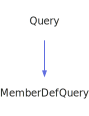

<a id="nodequery"></a>
<h1>NodeQuery</h1>
<a id="classMdDox_1_1Doxygen_1_1NodeQuery"></a>
<a href="https://github.com/CharlesCarley/MdDox">~</a>
<a href="indexpage.md#main">Main</a>
<span class="inline-text">/</span>
<a href="index.md#index">Index</a>
<span class="inline-text">::</span>
<a href="namespaceMdDox.md#mddox">MdDox</a>
<span class="inline-text">::</span>
<a href="namespaceMdDox_1_1Doxygen.md#doxygen">Doxygen</a>
<span class="inline-text">::</span>
<span class="bold-text"><b>NodeQuery</b></span>
<br/>
<br/>
<span class="inline-text">Implements the </span>
<code class="typewriter">nodeType</code>
<span class="inline-text"> scaffolding. </span>
<br/>
<br/>
<a id="derived-from"></a>
<h4>Derived From</h4>
<span class="icon-list-item"><a href="classMdDox_1_1Doxygen_1_1Query.md#query" class="icon-list-item"><span class="icon-list-item">Query</span>
</a>
</span>
<br/>
<br/>
<a id="public-methods"></a>
<h2>Public Methods</h2>
<span class="icon-list-item"><a href="#nodequery" class="icon-list-item"><span class="icon-list-item">NodeQuery</span>
</a>
</span>
<br/>
<span class="icon-list-item"><a href="#nodequery" class="icon-list-item"><span class="icon-list-item">NodeQuery</span>
</a>
</span>
<br/>
<span class="icon-list-item"><a href="#nodequery" class="icon-list-item"><span class="icon-list-item">NodeQuery</span>
</a>
</span>
<br/>
<span class="icon-list-item"><a href="#foreachchildnode" class="icon-list-item"><span class="icon-list-item">foreachChildNode</span>
</a>
</span>
<br/>
<span class="icon-list-item"><a href="#getid" class="icon-list-item"><span class="icon-list-item">getId</span>
</a>
</span>
<br/>
<span class="icon-list-item"><a href="#getlabel" class="icon-list-item"><span class="icon-list-item">getLabel</span>
</a>
</span>
<br/>
<span class="icon-list-item"><a href="#getlink" class="icon-list-item"><span class="icon-list-item">getLink</span>
</a>
</span>
<br/>
<span class="icon-list-item"><a href="#getlink" class="icon-list-item"><span class="icon-list-item">getLink</span>
</a>
</span>
<br/>
<span class="icon-list-item"><a href="#visit" class="icon-list-item"><span class="icon-list-item">visit</span>
</a>
</span>
<br/>
<a id="details"></a>
<h2>Details</h2>
<span class="inline-text">The following xml provides the source for the </span>
<span class="bold-text"><b>nodeType</b></span>
<span class="inline-text"> scaffolding.</span>

```xml
<xsd:complexType name="nodeType">
  <xsd:sequence>
    <xsd:element name="label"/>
    <xsd:element minOccurs="0" name="link" type="linkType"/>
    <xsd:element minOccurs="0" name="childnode" type="childnodeType" maxOccurs="unbounded"/>
  </xsd:sequence>
  <xsd:attribute name="id" type="xsd:string"/>
</xsd:complexType>
```
<br/>
<br/>
<a id="defined-in"></a>
<h4>Defined in</h4>
<span class="icon-list-item"><a href="https://github.com/CharlesCarley/MdDox/blob/master//Tools/Doxygen/NodeQuery.h#L75" class="icon-list-item"><span class="icon-list-item">NodeQuery.h</span>
</a>
</span>
<br/>
<a id="nodequery"></a>
<h2>NodeQuery</h2>
<span class="bold-text"><b>NodeQuery</b></span>
<span class="italic-text"><i>(</i></span>
<span class="italic-text"><i>)</i></span>
<a id="defined-in"></a>
<h4>Defined in</h4>
<span class="icon-list-item"><a href="https://github.com/CharlesCarley/MdDox/blob/master//Tools/Doxygen/NodeQuery.h#L77" class="icon-list-item"><span class="icon-list-item">NodeQuery.h</span>
</a>
</span>
<br/>
<br/>
<a id="nodequery"></a>
<h2>NodeQuery</h2>
<span class="bold-text"><b>NodeQuery</b></span>
<span class="italic-text"><i>(</i></span>
<div class="paragraph">
<span class="paragraph"><span class="inline-text">const </span>
<a href="classMdDox_1_1Doxygen_1_1NodeQuery.md#nodequery">NodeQuery</a>
<span class="inline-text"> &amp;</span>
<span class="inline-text">other</span>
</span>
</div>
<span class="italic-text"><i>)</i></span>
<a id="defined-in"></a>
<h4>Defined in</h4>
<span class="icon-list-item"><a href="https://github.com/CharlesCarley/MdDox/blob/master//Tools/Doxygen/NodeQuery.h#L78" class="icon-list-item"><span class="icon-list-item">NodeQuery.h</span>
</a>
</span>
<br/>
<br/>
<a id="nodequery"></a>
<h2>NodeQuery</h2>
<span class="bold-text"><b>NodeQuery</b></span>
<span class="italic-text"><i>(</i></span>
<div class="paragraph">
<span class="paragraph"><a href="classMdDox_1_1Xml_1_1Node.md#xmlnode">Xml::Node</a>
<span class="inline-text"> *</span>
<span class="inline-text">node</span>
</span>
</div>
<span class="italic-text"><i>)</i></span>
<a id="defined-in"></a>
<h4>Defined in</h4>
<span class="icon-list-item"><a href="https://github.com/CharlesCarley/MdDox/blob/master//Tools/Doxygen/NodeQuery.h#L80" class="icon-list-item"><span class="icon-list-item">NodeQuery.h</span>
</a>
</span>
<br/>
<br/>
<a id="foreachchildnode"></a>
<h2>foreachChildNode</h2>
<span class="inline-text">void</span>
<span class="bold-text"><b>foreachChildNode</b></span>
<span class="italic-text"><i>(</i></span>
<div class="paragraph">
<span class="paragraph"><span class="inline-text">const </span>
<a href="namespaceMdDox_1_1Doxygen.md#childnodequeryfunction">ChildNodeQueryFunction</a>
<span class="inline-text"> &amp;</span>
<span class="inline-text">invoke</span>
</span>
</div>
<span class="italic-text"><i>)</i></span>
<a id="details"></a>
<h4>Details</h4>
<span class="inline-text">Invokes the supplied callback on </span>
<span class="bold-text"><b>childnode</b></span>
<span class="inline-text"> elements. </span>
<br/>
<br/>
<a id="references"></a>
<h4>References</h4>
<span class="icon-list-item"><a href="classMdDox_1_1Doxygen_1_1Query.md#_node" class="icon-list-item"><span class="icon-list-item">_node</span>
</a>
</span>
<br/>
<a id="defined-in"></a>
<h4>Defined in</h4>
<span class="icon-list-item"><a href="https://github.com/CharlesCarley/MdDox/blob/master//Tools/Doxygen/NodeQuery.h#L114" class="icon-list-item"><span class="icon-list-item">NodeQuery.h</span>
</a>
</span>
<br/>
<span class="icon-list-item"><a href="https://github.com/CharlesCarley/MdDox/blob/master//Tools/Doxygen/NodeQuery.cpp#L90" class="icon-list-item"><span class="icon-list-item">NodeQuery.cpp</span>
</a>
</span>
<br/>
<br/>
<a id="getid"></a>
<h2>getId</h2>
<span class="inline-text">const </span>
<a href="namespaceMdDox.md#string">String</a>
<span class="inline-text"> &amp;</span>
<span class="bold-text"><b>getId</b></span>
<span class="italic-text"><i>(</i></span>
<div class="paragraph">
<span class="paragraph"><span class="inline-text">const </span>
<a href="namespaceMdDox.md#string">String</a>
<span class="inline-text"> &amp;</span>
<span class="inline-text">notFound</span>
<span class="inline-text"> = </span>
<span class="inline-text">&quot;&quot;</span>
</span>
</div>
<span class="italic-text"><i>)</i></span>
<a id="details"></a>
<h4>Details</h4>
<span class="inline-text">Provides access to the </span>
<span class="bold-text"><b>id</b></span>
<span class="inline-text"> attribute. </span>
<br/>
<br/>
<a id="returns"></a>
<h4>Returns</h4>
<span class="inline-text">The </span>
<span class="bold-text"><b>id</b></span>
<span class="inline-text"> enumerated value or an empty string the value is not found. </span>
<br/>
<br/>
<a id="references"></a>
<h4>References</h4>
<span class="icon-list-item"><a href="classMdDox_1_1Doxygen_1_1Query.md#_node" class="icon-list-item"><span class="icon-list-item">_node</span>
</a>
</span>
<br/>
<span class="icon-list-item"><a href="classMdDox_1_1Xml_1_1Node.md#attribute" class="icon-list-item"><span class="icon-list-item">attribute</span>
</a>
</span>
<br/>
<a id="defined-in"></a>
<h4>Defined in</h4>
<span class="icon-list-item"><a href="https://github.com/CharlesCarley/MdDox/blob/master//Tools/Doxygen/NodeQuery.h#L92" class="icon-list-item"><span class="icon-list-item">NodeQuery.h</span>
</a>
</span>
<br/>
<span class="icon-list-item"><a href="https://github.com/CharlesCarley/MdDox/blob/master//Tools/Doxygen/NodeQuery.cpp#L56" class="icon-list-item"><span class="icon-list-item">NodeQuery.cpp</span>
</a>
</span>
<br/>
<br/>
<a id="getlabel"></a>
<h2>getLabel</h2>
<span class="inline-text">const </span>
<a href="namespaceMdDox.md#string">String</a>
<span class="inline-text"> &amp;</span>
<span class="bold-text"><b>getLabel</b></span>
<span class="italic-text"><i>(</i></span>
<div class="paragraph">
<span class="paragraph"><span class="inline-text">const </span>
<a href="namespaceMdDox.md#string">String</a>
<span class="inline-text"> &amp;</span>
<span class="inline-text">notFound</span>
<span class="inline-text"> = </span>
<span class="inline-text">&quot;&quot;</span>
</span>
</div>
<span class="italic-text"><i>)</i></span>
<a id="details"></a>
<h4>Details</h4>
<span class="inline-text">Provides access to the </span>
<span class="bold-text"><b>label</b></span>
<span class="inline-text"> tag&apos;s inner text. </span>
<br/>
<br/>
<a id="returns"></a>
<h4>Returns</h4>
<span class="inline-text">The </span>
<span class="bold-text"><b>label&apos;s</b></span>
<span class="inline-text"> text or the default value if the node is invalid. </span>
<br/>
<br/>
<a id="references"></a>
<h4>References</h4>
<span class="icon-list-item"><a href="classMdDox_1_1Doxygen_1_1Query.md#_node" class="icon-list-item"><span class="icon-list-item">_node</span>
</a>
</span>
<br/>
<span class="icon-list-item"><a href="classMdDox_1_1Doxygen_1_1Query.md#node" class="icon-list-item"><span class="icon-list-item">node</span>
</a>
</span>
<br/>
<span class="icon-list-item"><a href="classMdDox_1_1Xml_1_1Node.md#firstchildof" class="icon-list-item"><span class="icon-list-item">firstChildOf</span>
</a>
</span>
<br/>
<span class="icon-list-item"><a href="classMdDox_1_1Xml_1_1Node.md#text" class="icon-list-item"><span class="icon-list-item">text</span>
</a>
</span>
<br/>
<a id="defined-in"></a>
<h4>Defined in</h4>
<span class="icon-list-item"><a href="https://github.com/CharlesCarley/MdDox/blob/master//Tools/Doxygen/NodeQuery.h#L99" class="icon-list-item"><span class="icon-list-item">NodeQuery.h</span>
</a>
</span>
<br/>
<span class="icon-list-item"><a href="https://github.com/CharlesCarley/MdDox/blob/master//Tools/Doxygen/NodeQuery.cpp#L63" class="icon-list-item"><span class="icon-list-item">NodeQuery.cpp</span>
</a>
</span>
<br/>
<br/>
<a id="getlink"></a>
<h2>getLink</h2>
<span class="inline-text">void</span>
<span class="bold-text"><b>getLink</b></span>
<span class="italic-text"><i>(</i></span>
<div class="paragraph">
<span class="paragraph"><a href="classMdDox_1_1Doxygen_1_1LinkQuery.md#linkquery">LinkQuery</a>
<span class="inline-text"> &amp;</span>
<span class="inline-text">dest</span>
</span>
</div>
<span class="italic-text"><i>)</i></span>
<a id="details"></a>
<h4>Details</h4>
<span class="inline-text">Provides access to the </span>
<span class="bold-text"><b>link</b></span>
<span class="inline-text"> attribute. </span>
<br/>
<br/>
<a id="references"></a>
<h4>References</h4>
<span class="icon-list-item"><a href="classMdDox_1_1Doxygen_1_1Query.md#_node" class="icon-list-item"><span class="icon-list-item">_node</span>
</a>
</span>
<br/>
<span class="icon-list-item"><a href="classMdDox_1_1Doxygen_1_1Query.md#node" class="icon-list-item"><span class="icon-list-item">node</span>
</a>
</span>
<br/>
<span class="icon-list-item"><a href="classMdDox_1_1Xml_1_1Node.md#firstchildof" class="icon-list-item"><span class="icon-list-item">firstChildOf</span>
</a>
</span>
<br/>
<span class="icon-list-item"><a href="classMdDox_1_1Doxygen_1_1Query.md#reset" class="icon-list-item"><span class="icon-list-item">reset</span>
</a>
</span>
<br/>
<a id="defined-in"></a>
<h4>Defined in</h4>
<span class="icon-list-item"><a href="https://github.com/CharlesCarley/MdDox/blob/master//Tools/Doxygen/NodeQuery.h#L104" class="icon-list-item"><span class="icon-list-item">NodeQuery.h</span>
</a>
</span>
<br/>
<span class="icon-list-item"><a href="https://github.com/CharlesCarley/MdDox/blob/master//Tools/Doxygen/NodeQuery.cpp#L72" class="icon-list-item"><span class="icon-list-item">NodeQuery.cpp</span>
</a>
</span>
<br/>
<br/>
<a id="getlink"></a>
<h2>getLink</h2>
<a href="classMdDox_1_1Doxygen_1_1LinkQuery.md#linkquery">LinkQuery</a>
<span class="bold-text"><b>getLink</b></span>
<span class="italic-text"><i>(</i></span>
<span class="italic-text"><i>)</i></span>
<a id="details"></a>
<h4>Details</h4>
<span class="inline-text">Provides access to the </span>
<span class="bold-text"><b>link</b></span>
<span class="inline-text"> attribute. </span>
<br/>
<br/>
<a id="defined-in"></a>
<h4>Defined in</h4>
<span class="icon-list-item"><a href="https://github.com/CharlesCarley/MdDox/blob/master//Tools/Doxygen/NodeQuery.h#L109" class="icon-list-item"><span class="icon-list-item">NodeQuery.h</span>
</a>
</span>
<br/>
<span class="icon-list-item"><a href="https://github.com/CharlesCarley/MdDox/blob/master//Tools/Doxygen/NodeQuery.cpp#L83" class="icon-list-item"><span class="icon-list-item">NodeQuery.cpp</span>
</a>
</span>
<br/>
<br/>
<a id="visit"></a>
<h2>visit</h2>
<span class="inline-text">void</span>
<span class="bold-text"><b>visit</b></span>
<span class="italic-text"><i>(</i></span>
<div class="paragraph">
<span class="paragraph"><a href="classMdDox_1_1Doxygen_1_1Visitors_1_1NodeQueryVisitor.md#visitorsnodequeryvisitor">Visitors::NodeQueryVisitor</a>
<span class="inline-text"> *</span>
<span class="inline-text"> = </span>
<span class="inline-text">visitor</span>
</span>
</div>
<span class="italic-text"><i>)</i></span>
<a id="references"></a>
<h4>References</h4>
<span class="icon-list-item"><a href="classMdDox_1_1Doxygen_1_1Query.md#_node" class="icon-list-item"><span class="icon-list-item">_node</span>
</a>
</span>
<br/>
<span class="icon-list-item"><a href="classMdDox_1_1Xml_1_1Node.md#children" class="icon-list-item"><span class="icon-list-item">children</span>
</a>
</span>
<br/>
<span class="icon-list-item"><a href="namespaceMdDox_1_1Doxygen.md#doxtextnode" class="icon-list-item"><span class="icon-list-item">DoxTextNode</span>
</a>
</span>
<br/>
<span class="icon-list-item"><a href="classMdDox_1_1Doxygen_1_1Visitors_1_1NodeQueryVisitor.md#visitedtext" class="icon-list-item"><span class="icon-list-item">visitedText</span>
</a>
</span>
<br/>
<span class="icon-list-item"><a href="classMdDox_1_1Doxygen_1_1Visitors_1_1NodeQueryVisitor.md#visitedchildnode" class="icon-list-item"><span class="icon-list-item">visitedChildNode</span>
</a>
</span>
<br/>
<span class="icon-list-item"><a href="classMdDox_1_1Doxygen_1_1Visitors_1_1NodeQueryVisitor.md#visitedlink" class="icon-list-item"><span class="icon-list-item">visitedLink</span>
</a>
</span>
<br/>
<span class="icon-list-item"><a href="classMdDox_1_1Doxygen_1_1Visitors_1_1NodeQueryVisitor.md#visitedlabel" class="icon-list-item"><span class="icon-list-item">visitedLabel</span>
</a>
</span>
<br/>
<a id="defined-in"></a>
<h4>Defined in</h4>
<span class="icon-list-item"><a href="https://github.com/CharlesCarley/MdDox/blob/master//Tools/Doxygen/NodeQuery.h#L85" class="icon-list-item"><span class="icon-list-item">NodeQuery.h</span>
</a>
</span>
<br/>
<span class="icon-list-item"><a href="https://github.com/CharlesCarley/MdDox/blob/master//Tools/Doxygen/NodeQuery.cpp#L30" class="icon-list-item"><span class="icon-list-item">NodeQuery.cpp</span>
</a>
</span>
<br/>
<br/>
</div>
</div>
</body>
</html>
