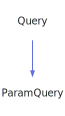

<a id="paramquery"></a>
<h1>ParamQuery</h1>
<a id="classMdDox_1_1Doxygen_1_1ParamQuery"></a>
<a href="https://github.com/CharlesCarley/MdDox.md">~</a>
<a href="indexpage.md#mddox">MdDox</a>
<span class="inline-text">/</span>
<a href="index.md#index">Index</a>
<span class="inline-text">/</span>
<a href="namespaceMdDox.md#mddox">MdDox</a>
<span class="inline-text">::</span>
<a href="namespaceMdDox_1_1Doxygen.md#doxygen">Doxygen</a>
<span class="inline-text">::</span>
<span class="bold-text"><b>ParamQuery</b></span>
<br/>
<br/>
<span class="inline-text">Implements the </span>
<code class="typewriter">paramType</code>
<span class="inline-text"> scaffolding. </span>
<br/>
<a id="derived-from"></a>
<h4>Derived From</h4>
<div class="icon-link">
<a href="classMdDox_1_1Doxygen_1_1Query.md#mddoxdoxygenquery">MdDox::Doxygen::Query</a>
</div>
<br/>
<a id="public-methods"></a>
<h2>Public Methods</h2>
<span class="icon-list-item"><a href="#paramquery" class="icon-list-item"><span class="icon-list-item">ParamQuery</span>
</a>
</span>
<br/>
<span class="icon-list-item"><a href="#paramquery" class="icon-list-item"><span class="icon-list-item">ParamQuery</span>
</a>
</span>
<br/>
<span class="icon-list-item"><a href="#paramquery" class="icon-list-item"><span class="icon-list-item">ParamQuery</span>
</a>
</span>
<br/>
<span class="icon-list-item"><a href="#getarray" class="icon-list-item"><span class="icon-list-item">getArray</span>
</a>
</span>
<br/>
<span class="icon-list-item"><a href="#getbriefdescription" class="icon-list-item"><span class="icon-list-item">getBriefDescription</span>
</a>
</span>
<br/>
<span class="icon-list-item"><a href="#getbriefdescription" class="icon-list-item"><span class="icon-list-item">getBriefDescription</span>
</a>
</span>
<br/>
<span class="icon-list-item"><a href="#getdeclname" class="icon-list-item"><span class="icon-list-item">getDeclName</span>
</a>
</span>
<br/>
<span class="icon-list-item"><a href="#getdefname" class="icon-list-item"><span class="icon-list-item">getDefName</span>
</a>
</span>
<br/>
<span class="icon-list-item"><a href="#getdefval" class="icon-list-item"><span class="icon-list-item">getDefVal</span>
</a>
</span>
<br/>
<span class="icon-list-item"><a href="#getdefval" class="icon-list-item"><span class="icon-list-item">getDefVal</span>
</a>
</span>
<br/>
<span class="icon-list-item"><a href="#gettype" class="icon-list-item"><span class="icon-list-item">getType</span>
</a>
</span>
<br/>
<span class="icon-list-item"><a href="#gettype" class="icon-list-item"><span class="icon-list-item">getType</span>
</a>
</span>
<br/>
<span class="icon-list-item"><a href="#visit" class="icon-list-item"><span class="icon-list-item">visit</span>
</a>
</span>
<br/>
<a id="details"></a>
<h2>Details</h2>
<span class="inline-text">The following xml provides the source for the </span>
<span class="bold-text"><b>paramType</b></span>
<span class="inline-text"> scaffolding.</span>

```xml
<xsd:complexType name="paramType">
  <xsd:sequence>
    <xsd:element minOccurs="0" name="type" type="linkedTextType"/>
    <xsd:element minOccurs="0" name="declname"/>
    <xsd:element minOccurs="0" name="defname"/>
    <xsd:element minOccurs="0" name="array"/>
    <xsd:element minOccurs="0" name="defval" type="linkedTextType"/>
    <xsd:element minOccurs="0" name="typeconstraint" type="linkedTextType"/>
    <xsd:element minOccurs="0" name="briefdescription" type="descriptionType"/>
  </xsd:sequence>
</xsd:complexType>
```
<br/>
<a id="defined-in"></a>
<h4>Defined in</h4>
<span class="icon-list-item"><a href="https://github.com/CharlesCarley/MdDox/blob/master//Tools/Doxygen/ParamQuery.h#L93" class="icon-list-item"><span class="icon-list-item">ParamQuery.h</span>
</a>
</span>
<a id="paramquery"></a>
<h2>ParamQuery</h2>
<span class="bold-text"><b>ParamQuery</b></span>
<span class="italic-text"><i>(</i></span>
<span class="italic-text"><i>)</i></span>
<a id="defined-in"></a>
<h4>Defined in</h4>
<span class="icon-list-item"><a href="https://github.com/CharlesCarley/MdDox/blob/master//Tools/Doxygen/ParamQuery.h#L95" class="icon-list-item"><span class="icon-list-item">ParamQuery.h</span>
</a>
</span>
<br/>
<a id="paramquery"></a>
<h2>ParamQuery</h2>
<span class="bold-text"><b>ParamQuery</b></span>
<span class="italic-text"><i>(</i></span>
<div class="paragraph">
<span class="paragraph"><span class="inline-text">const </span>
<a href="classMdDox_1_1Doxygen_1_1ParamQuery.md#paramquery">ParamQuery</a>
<span class="inline-text"> &amp;</span>
<span class="inline-text">other</span>
</span>
</div>
<span class="italic-text"><i>)</i></span>
<a id="defined-in"></a>
<h4>Defined in</h4>
<span class="icon-list-item"><a href="https://github.com/CharlesCarley/MdDox/blob/master//Tools/Doxygen/ParamQuery.h#L96" class="icon-list-item"><span class="icon-list-item">ParamQuery.h</span>
</a>
</span>
<br/>
<a id="paramquery"></a>
<h2>ParamQuery</h2>
<span class="bold-text"><b>ParamQuery</b></span>
<span class="italic-text"><i>(</i></span>
<div class="paragraph">
<span class="paragraph"><a href="classMdDox_1_1Xml_1_1Node.md#xmlnode">Xml::Node</a>
<span class="inline-text"> *</span>
<span class="inline-text">node</span>
</span>
</div>
<span class="italic-text"><i>)</i></span>
<a id="defined-in"></a>
<h4>Defined in</h4>
<span class="icon-list-item"><a href="https://github.com/CharlesCarley/MdDox/blob/master//Tools/Doxygen/ParamQuery.h#L98" class="icon-list-item"><span class="icon-list-item">ParamQuery.h</span>
</a>
</span>
<br/>
<a id="getarray"></a>
<h2>getArray</h2>
<span class="inline-text">const </span>
<a href="namespaceMdDox.md#string">String</a>
<span class="inline-text"> &amp;</span>
<span class="bold-text"><b>getArray</b></span>
<span class="italic-text"><i>(</i></span>
<div class="paragraph">
<span class="paragraph"><span class="inline-text">const </span>
<a href="namespaceMdDox.md#string">String</a>
<span class="inline-text"> &amp;</span>
<span class="inline-text">notFound</span>
<span class="inline-text"> = </span>
<span class="inline-text">&quot;&quot;</span>
</span>
</div>
<span class="italic-text"><i>)</i></span>
<a id="details"></a>
<h4>Details</h4>
<span class="inline-text">Provides access to the </span>
<span class="bold-text"><b>array</b></span>
<span class="inline-text"> tag&apos;s inner text. </span>
<br/>
<br/>
<a id="returns"></a>
<h4>Returns</h4>
<span class="inline-text">The </span>
<span class="bold-text"><b>array&apos;s</b></span>
<span class="inline-text"> text or the default value if the node is invalid. </span>
<br/>
<br/>
<a id="references"></a>
<h4>References</h4>
<div class="paragraph">
<span class="paragraph"><a href="classMdDox_1_1Doxygen_1_1Query.md#_node">_node</a>
</span>
</div>
<div class="paragraph">
<span class="paragraph"><a href="classMdDox_1_1Doxygen_1_1Query.md#node">node</a>
</span>
</div>
<div class="paragraph">
<span class="paragraph"><a href="classMdDox_1_1Xml_1_1Node.md#firstchildof">firstChildOf</a>
</span>
</div>
<div class="paragraph">
<span class="paragraph"><a href="classMdDox_1_1Xml_1_1Node.md#text">text</a>
</span>
</div>
<a id="defined-in"></a>
<h4>Defined in</h4>
<span class="icon-list-item"><a href="https://github.com/CharlesCarley/MdDox/blob/master//Tools/Doxygen/ParamQuery.h#L123" class="icon-list-item"><span class="icon-list-item">ParamQuery.h</span>
</a>
</span>
<br/>
<span class="icon-list-item"><a href="https://github.com/CharlesCarley/MdDox/blob/master//Tools/Doxygen/ParamQuery.cpp#L83" class="icon-list-item"><span class="icon-list-item">ParamQuery.cpp</span>
</a>
</span>
<br/>
<a id="getbriefdescription"></a>
<h2>getBriefDescription</h2>
<span class="inline-text">void</span>
<span class="bold-text"><b>getBriefDescription</b></span>
<span class="italic-text"><i>(</i></span>
<div class="paragraph">
<span class="paragraph"><a href="classMdDox_1_1Doxygen_1_1DescriptionQuery.md#descriptionquery">DescriptionQuery</a>
<span class="inline-text"> &amp;</span>
<span class="inline-text">dest</span>
</span>
</div>
<span class="italic-text"><i>)</i></span>
<a id="details"></a>
<h4>Details</h4>
<span class="inline-text">Provides access to the </span>
<span class="bold-text"><b>briefdescription</b></span>
<span class="inline-text"> attribute. </span>
<br/>
<br/>
<a id="references"></a>
<h4>References</h4>
<div class="paragraph">
<span class="paragraph"><a href="classMdDox_1_1Doxygen_1_1Query.md#_node">_node</a>
</span>
</div>
<div class="paragraph">
<span class="paragraph"><a href="classMdDox_1_1Doxygen_1_1Query.md#node">node</a>
</span>
</div>
<div class="paragraph">
<span class="paragraph"><a href="classMdDox_1_1Xml_1_1Node.md#firstchildof">firstChildOf</a>
</span>
</div>
<div class="paragraph">
<span class="paragraph"><a href="classMdDox_1_1Doxygen_1_1Query.md#reset">reset</a>
</span>
</div>
<a id="defined-in"></a>
<h4>Defined in</h4>
<span class="icon-list-item"><a href="https://github.com/CharlesCarley/MdDox/blob/master//Tools/Doxygen/ParamQuery.h#L148" class="icon-list-item"><span class="icon-list-item">ParamQuery.h</span>
</a>
</span>
<br/>
<span class="icon-list-item"><a href="https://github.com/CharlesCarley/MdDox/blob/master//Tools/Doxygen/ParamQuery.cpp#L128" class="icon-list-item"><span class="icon-list-item">ParamQuery.cpp</span>
</a>
</span>
<br/>
<a id="getbriefdescription"></a>
<h2>getBriefDescription</h2>
<a href="classMdDox_1_1Doxygen_1_1DescriptionQuery.md#descriptionquery">DescriptionQuery</a>
<span class="bold-text"><b>getBriefDescription</b></span>
<span class="italic-text"><i>(</i></span>
<span class="italic-text"><i>)</i></span>
<a id="details"></a>
<h4>Details</h4>
<span class="inline-text">Provides access to the </span>
<span class="bold-text"><b>briefdescription</b></span>
<span class="inline-text"> attribute. </span>
<br/>
<br/>
<a id="defined-in"></a>
<h4>Defined in</h4>
<span class="icon-list-item"><a href="https://github.com/CharlesCarley/MdDox/blob/master//Tools/Doxygen/ParamQuery.h#L153" class="icon-list-item"><span class="icon-list-item">ParamQuery.h</span>
</a>
</span>
<br/>
<span class="icon-list-item"><a href="https://github.com/CharlesCarley/MdDox/blob/master//Tools/Doxygen/ParamQuery.cpp#L139" class="icon-list-item"><span class="icon-list-item">ParamQuery.cpp</span>
</a>
</span>
<br/>
<a id="getdeclname"></a>
<h2>getDeclName</h2>
<span class="inline-text">const </span>
<a href="namespaceMdDox.md#string">String</a>
<span class="inline-text"> &amp;</span>
<span class="bold-text"><b>getDeclName</b></span>
<span class="italic-text"><i>(</i></span>
<div class="paragraph">
<span class="paragraph"><span class="inline-text">const </span>
<a href="namespaceMdDox.md#string">String</a>
<span class="inline-text"> &amp;</span>
<span class="inline-text">notFound</span>
<span class="inline-text"> = </span>
<span class="inline-text">&quot;&quot;</span>
</span>
</div>
<span class="italic-text"><i>)</i></span>
<a id="details"></a>
<h4>Details</h4>
<span class="inline-text">Provides access to the </span>
<span class="bold-text"><b>declname</b></span>
<span class="inline-text"> tag&apos;s inner text. </span>
<br/>
<br/>
<a id="returns"></a>
<h4>Returns</h4>
<span class="inline-text">The </span>
<span class="bold-text"><b>declname&apos;s</b></span>
<span class="inline-text"> text or the default value if the node is invalid. </span>
<br/>
<br/>
<a id="references"></a>
<h4>References</h4>
<div class="paragraph">
<span class="paragraph"><a href="classMdDox_1_1Doxygen_1_1Query.md#_node">_node</a>
</span>
</div>
<div class="paragraph">
<span class="paragraph"><a href="classMdDox_1_1Doxygen_1_1Query.md#node">node</a>
</span>
</div>
<div class="paragraph">
<span class="paragraph"><a href="classMdDox_1_1Xml_1_1Node.md#firstchildof">firstChildOf</a>
</span>
</div>
<div class="paragraph">
<span class="paragraph"><a href="classMdDox_1_1Xml_1_1Node.md#text">text</a>
</span>
</div>
<a id="defined-in"></a>
<h4>Defined in</h4>
<span class="icon-list-item"><a href="https://github.com/CharlesCarley/MdDox/blob/master//Tools/Doxygen/ParamQuery.h#L109" class="icon-list-item"><span class="icon-list-item">ParamQuery.h</span>
</a>
</span>
<br/>
<span class="icon-list-item"><a href="https://github.com/CharlesCarley/MdDox/blob/master//Tools/Doxygen/ParamQuery.cpp#L65" class="icon-list-item"><span class="icon-list-item">ParamQuery.cpp</span>
</a>
</span>
<br/>
<a id="getdefname"></a>
<h2>getDefName</h2>
<span class="inline-text">const </span>
<a href="namespaceMdDox.md#string">String</a>
<span class="inline-text"> &amp;</span>
<span class="bold-text"><b>getDefName</b></span>
<span class="italic-text"><i>(</i></span>
<div class="paragraph">
<span class="paragraph"><span class="inline-text">const </span>
<a href="namespaceMdDox.md#string">String</a>
<span class="inline-text"> &amp;</span>
<span class="inline-text">notFound</span>
<span class="inline-text"> = </span>
<span class="inline-text">&quot;&quot;</span>
</span>
</div>
<span class="italic-text"><i>)</i></span>
<a id="details"></a>
<h4>Details</h4>
<span class="inline-text">Provides access to the </span>
<span class="bold-text"><b>defname</b></span>
<span class="inline-text"> tag&apos;s inner text. </span>
<br/>
<br/>
<a id="returns"></a>
<h4>Returns</h4>
<span class="inline-text">The </span>
<span class="bold-text"><b>defname&apos;s</b></span>
<span class="inline-text"> text or the default value if the node is invalid. </span>
<br/>
<br/>
<a id="references"></a>
<h4>References</h4>
<div class="paragraph">
<span class="paragraph"><a href="classMdDox_1_1Doxygen_1_1Query.md#_node">_node</a>
</span>
</div>
<div class="paragraph">
<span class="paragraph"><a href="classMdDox_1_1Doxygen_1_1Query.md#node">node</a>
</span>
</div>
<div class="paragraph">
<span class="paragraph"><a href="classMdDox_1_1Xml_1_1Node.md#firstchildof">firstChildOf</a>
</span>
</div>
<div class="paragraph">
<span class="paragraph"><a href="classMdDox_1_1Xml_1_1Node.md#text">text</a>
</span>
</div>
<a id="defined-in"></a>
<h4>Defined in</h4>
<span class="icon-list-item"><a href="https://github.com/CharlesCarley/MdDox/blob/master//Tools/Doxygen/ParamQuery.h#L116" class="icon-list-item"><span class="icon-list-item">ParamQuery.h</span>
</a>
</span>
<br/>
<span class="icon-list-item"><a href="https://github.com/CharlesCarley/MdDox/blob/master//Tools/Doxygen/ParamQuery.cpp#L74" class="icon-list-item"><span class="icon-list-item">ParamQuery.cpp</span>
</a>
</span>
<br/>
<a id="getdefval"></a>
<h2>getDefVal</h2>
<span class="inline-text">void</span>
<span class="bold-text"><b>getDefVal</b></span>
<span class="italic-text"><i>(</i></span>
<div class="paragraph">
<span class="paragraph"><a href="classMdDox_1_1Doxygen_1_1LinkedTextQuery.md#linkedtextquery">LinkedTextQuery</a>
<span class="inline-text"> &amp;</span>
<span class="inline-text">dest</span>
</span>
</div>
<span class="italic-text"><i>)</i></span>
<a id="details"></a>
<h4>Details</h4>
<span class="inline-text">Provides access to the </span>
<span class="bold-text"><b>defval</b></span>
<span class="inline-text"> attribute. </span>
<br/>
<br/>
<a id="references"></a>
<h4>References</h4>
<div class="paragraph">
<span class="paragraph"><a href="classMdDox_1_1Doxygen_1_1Query.md#_node">_node</a>
</span>
</div>
<div class="paragraph">
<span class="paragraph"><a href="classMdDox_1_1Doxygen_1_1Query.md#node">node</a>
</span>
</div>
<div class="paragraph">
<span class="paragraph"><a href="classMdDox_1_1Xml_1_1Node.md#firstchildof">firstChildOf</a>
</span>
</div>
<div class="paragraph">
<span class="paragraph"><a href="classMdDox_1_1Doxygen_1_1Query.md#reset">reset</a>
</span>
</div>
<a id="defined-in"></a>
<h4>Defined in</h4>
<span class="icon-list-item"><a href="https://github.com/CharlesCarley/MdDox/blob/master//Tools/Doxygen/ParamQuery.h#L138" class="icon-list-item"><span class="icon-list-item">ParamQuery.h</span>
</a>
</span>
<br/>
<span class="icon-list-item"><a href="https://github.com/CharlesCarley/MdDox/blob/master//Tools/Doxygen/ParamQuery.cpp#L110" class="icon-list-item"><span class="icon-list-item">ParamQuery.cpp</span>
</a>
</span>
<br/>
<a id="getdefval"></a>
<h2>getDefVal</h2>
<a href="classMdDox_1_1Doxygen_1_1LinkedTextQuery.md#linkedtextquery">LinkedTextQuery</a>
<span class="bold-text"><b>getDefVal</b></span>
<span class="italic-text"><i>(</i></span>
<span class="italic-text"><i>)</i></span>
<a id="details"></a>
<h4>Details</h4>
<span class="inline-text">Provides access to the </span>
<span class="bold-text"><b>defval</b></span>
<span class="inline-text"> attribute. </span>
<br/>
<br/>
<a id="defined-in"></a>
<h4>Defined in</h4>
<span class="icon-list-item"><a href="https://github.com/CharlesCarley/MdDox/blob/master//Tools/Doxygen/ParamQuery.h#L143" class="icon-list-item"><span class="icon-list-item">ParamQuery.h</span>
</a>
</span>
<br/>
<span class="icon-list-item"><a href="https://github.com/CharlesCarley/MdDox/blob/master//Tools/Doxygen/ParamQuery.cpp#L121" class="icon-list-item"><span class="icon-list-item">ParamQuery.cpp</span>
</a>
</span>
<br/>
<a id="gettype"></a>
<h2>getType</h2>
<span class="inline-text">void</span>
<span class="bold-text"><b>getType</b></span>
<span class="italic-text"><i>(</i></span>
<div class="paragraph">
<span class="paragraph"><a href="classMdDox_1_1Doxygen_1_1LinkedTextQuery.md#linkedtextquery">LinkedTextQuery</a>
<span class="inline-text"> &amp;</span>
<span class="inline-text">dest</span>
</span>
</div>
<span class="italic-text"><i>)</i></span>
<a id="details"></a>
<h4>Details</h4>
<span class="inline-text">Provides access to the </span>
<span class="bold-text"><b>type</b></span>
<span class="inline-text"> attribute. </span>
<br/>
<br/>
<a id="references"></a>
<h4>References</h4>
<div class="paragraph">
<span class="paragraph"><a href="classMdDox_1_1Doxygen_1_1Query.md#_node">_node</a>
</span>
</div>
<div class="paragraph">
<span class="paragraph"><a href="classMdDox_1_1Doxygen_1_1Query.md#node">node</a>
</span>
</div>
<div class="paragraph">
<span class="paragraph"><a href="classMdDox_1_1Xml_1_1Node.md#firstchildof">firstChildOf</a>
</span>
</div>
<div class="paragraph">
<span class="paragraph"><a href="classMdDox_1_1Doxygen_1_1Query.md#reset">reset</a>
</span>
</div>
<a id="defined-in"></a>
<h4>Defined in</h4>
<span class="icon-list-item"><a href="https://github.com/CharlesCarley/MdDox/blob/master//Tools/Doxygen/ParamQuery.h#L128" class="icon-list-item"><span class="icon-list-item">ParamQuery.h</span>
</a>
</span>
<br/>
<span class="icon-list-item"><a href="https://github.com/CharlesCarley/MdDox/blob/master//Tools/Doxygen/ParamQuery.cpp#L92" class="icon-list-item"><span class="icon-list-item">ParamQuery.cpp</span>
</a>
</span>
<br/>
<a id="gettype"></a>
<h2>getType</h2>
<a href="classMdDox_1_1Doxygen_1_1LinkedTextQuery.md#linkedtextquery">LinkedTextQuery</a>
<span class="bold-text"><b>getType</b></span>
<span class="italic-text"><i>(</i></span>
<span class="italic-text"><i>)</i></span>
<a id="details"></a>
<h4>Details</h4>
<span class="inline-text">Provides access to the </span>
<span class="bold-text"><b>type</b></span>
<span class="inline-text"> attribute. </span>
<br/>
<br/>
<a id="defined-in"></a>
<h4>Defined in</h4>
<span class="icon-list-item"><a href="https://github.com/CharlesCarley/MdDox/blob/master//Tools/Doxygen/ParamQuery.h#L133" class="icon-list-item"><span class="icon-list-item">ParamQuery.h</span>
</a>
</span>
<br/>
<span class="icon-list-item"><a href="https://github.com/CharlesCarley/MdDox/blob/master//Tools/Doxygen/ParamQuery.cpp#L103" class="icon-list-item"><span class="icon-list-item">ParamQuery.cpp</span>
</a>
</span>
<br/>
<a id="visit"></a>
<h2>visit</h2>
<span class="inline-text">void</span>
<span class="bold-text"><b>visit</b></span>
<span class="italic-text"><i>(</i></span>
<div class="paragraph">
<span class="paragraph"><a href="classMdDox_1_1Doxygen_1_1Visitors_1_1ParamQueryVisitor.md#visitorsparamqueryvisitor">Visitors::ParamQueryVisitor</a>
<span class="inline-text"> *</span>
<span class="inline-text"> = </span>
<span class="inline-text">visitor</span>
</span>
</div>
<span class="italic-text"><i>)</i></span>
<a id="references"></a>
<h4>References</h4>
<div class="paragraph">
<span class="paragraph"><a href="classMdDox_1_1Doxygen_1_1Query.md#_node">_node</a>
</span>
</div>
<div class="paragraph">
<span class="paragraph"><a href="classMdDox_1_1Xml_1_1Node.md#children">children</a>
</span>
</div>
<div class="paragraph">
<span class="paragraph"><a href="namespaceMdDox_1_1Doxygen.md#doxtextnode">DoxTextNode</a>
</span>
</div>
<div class="paragraph">
<span class="paragraph"><a href="classMdDox_1_1Doxygen_1_1Visitors_1_1ParamQueryVisitor.md#visitedtext">visitedText</a>
</span>
</div>
<div class="paragraph">
<span class="paragraph"><a href="classMdDox_1_1Doxygen_1_1Visitors_1_1ParamQueryVisitor.md#visitedtype">visitedType</a>
</span>
</div>
<div class="paragraph">
<span class="paragraph"><a href="classMdDox_1_1Doxygen_1_1Visitors_1_1ParamQueryVisitor.md#visiteddefval">visitedDefVal</a>
</span>
</div>
<div class="paragraph">
<span class="paragraph"><a href="classMdDox_1_1Doxygen_1_1Visitors_1_1ParamQueryVisitor.md#visitedbriefdescription">visitedBriefDescription</a>
</span>
</div>
<div class="paragraph">
<span class="paragraph"><a href="classMdDox_1_1Doxygen_1_1Visitors_1_1ParamQueryVisitor.md#visiteddeclname">visitedDeclName</a>
</span>
</div>
<div class="paragraph">
<span class="paragraph"><a href="classMdDox_1_1Doxygen_1_1Visitors_1_1ParamQueryVisitor.md#visiteddefname">visitedDefName</a>
</span>
</div>
<div class="paragraph">
<span class="paragraph"><a href="classMdDox_1_1Doxygen_1_1Visitors_1_1ParamQueryVisitor.md#visitedarray">visitedArray</a>
</span>
</div>
<a id="defined-in"></a>
<h4>Defined in</h4>
<span class="icon-list-item"><a href="https://github.com/CharlesCarley/MdDox/blob/master//Tools/Doxygen/ParamQuery.h#L103" class="icon-list-item"><span class="icon-list-item">ParamQuery.h</span>
</a>
</span>
<br/>
<span class="icon-list-item"><a href="https://github.com/CharlesCarley/MdDox/blob/master//Tools/Doxygen/ParamQuery.cpp#L30" class="icon-list-item"><span class="icon-list-item">ParamQuery.cpp</span>
</a>
</span>
<br/>
</div>
</div>
</body>
</html>
