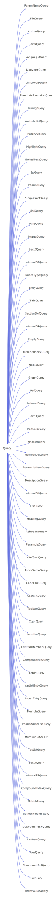

<h1>Query</h1>

<a href="https://github.com/CharlesCarley/MdDox.md">~</a>
<a href="indexpage.md#mddox">MdDox</a>
/
<a href="index.md#index">Index</a>
/
<a href="namespaceMdDox.md#mddox">MdDox</a>
::
<a href="namespaceMdDox_1_1Doxygen.md#doxygen">Doxygen</a>
::
<b>Query</b>
 
 

<h4>Derived By</h4>

<a href="classMdDox_1_1Doxygen_1_1AnchorQuery.md#mddoxdoxygenanchorquery">MdDox::Doxygen::AnchorQuery</a>

<a href="classMdDox_1_1Doxygen_1_1BlockQuoteQuery.md#mddoxdoxygenblockquotequery">MdDox::Doxygen::BlockQuoteQuery</a>

<a href="classMdDox_1_1Doxygen_1_1CaptionQuery.md#mddoxdoxygencaptionquery">MdDox::Doxygen::CaptionQuery</a>

<a href="classMdDox_1_1Doxygen_1_1ChildNodeQuery.md#mddoxdoxygenchildnodequery">MdDox::Doxygen::ChildNodeQuery</a>

<a href="classMdDox_1_1Doxygen_1_1CodeLineQuery.md#mddoxdoxygencodelinequery">MdDox::Doxygen::CodeLineQuery</a>

<a href="classMdDox_1_1Doxygen_1_1CompoundDefQuery.md#mddoxdoxygencompounddefquery">MdDox::Doxygen::CompoundDefQuery</a>

<a href="classMdDox_1_1Doxygen_1_1CompoundIndexQuery.md#mddoxdoxygencompoundindexquery">MdDox::Doxygen::CompoundIndexQuery</a>

<a href="classMdDox_1_1Doxygen_1_1CompoundRefQuery.md#mddoxdoxygencompoundrefquery">MdDox::Doxygen::CompoundRefQuery</a>

<a href="classMdDox_1_1Doxygen_1_1CopyQuery.md#mddoxdoxygencopyquery">MdDox::Doxygen::CopyQuery</a>

<a href="classMdDox_1_1Doxygen_1_1DescriptionQuery.md#mddoxdoxygendescriptionquery">MdDox::Doxygen::DescriptionQuery</a>

<a href="classMdDox_1_1Doxygen_1_1DoxygenIndexQuery.md#mddoxdoxygendoxygenindexquery">MdDox::Doxygen::DoxygenIndexQuery</a>

<a href="classMdDox_1_1Doxygen_1_1DoxygenQuery.md#mddoxdoxygendoxygenquery">MdDox::Doxygen::DoxygenQuery</a>

<a href="classMdDox_1_1Doxygen_1_1EmptyQuery.md#mddoxdoxygenemptyquery">MdDox::Doxygen::EmptyQuery</a>

<a href="classMdDox_1_1Doxygen_1_1EntryQuery.md#mddoxdoxygenentryquery">MdDox::Doxygen::EntryQuery</a>

<a href="classMdDox_1_1Doxygen_1_1EnumValueQuery.md#mddoxdoxygenenumvaluequery">MdDox::Doxygen::EnumValueQuery</a>

<a href="classMdDox_1_1Doxygen_1_1FileQuery.md#mddoxdoxygenfilequery">MdDox::Doxygen::FileQuery</a>

<a href="classMdDox_1_1Doxygen_1_1FormulaQuery.md#mddoxdoxygenformulaquery">MdDox::Doxygen::FormulaQuery</a>

<a href="classMdDox_1_1Doxygen_1_1GraphQuery.md#mddoxdoxygengraphquery">MdDox::Doxygen::GraphQuery</a>

<a href="classMdDox_1_1Doxygen_1_1HeadingQuery.md#mddoxdoxygenheadingquery">MdDox::Doxygen::HeadingQuery</a>

<a href="classMdDox_1_1Doxygen_1_1HighlightQuery.md#mddoxdoxygenhighlightquery">MdDox::Doxygen::HighlightQuery</a>

<a href="classMdDox_1_1Doxygen_1_1ImageQuery.md#mddoxdoxygenimagequery">MdDox::Doxygen::ImageQuery</a>

<a href="classMdDox_1_1Doxygen_1_1IncQuery.md#mddoxdoxygenincquery">MdDox::Doxygen::IncQuery</a>

<a href="classMdDox_1_1Doxygen_1_1IndexEntryQuery.md#mddoxdoxygenindexentryquery">MdDox::Doxygen::IndexEntryQuery</a>

<a href="classMdDox_1_1Doxygen_1_1InternalQuery.md#mddoxdoxygeninternalquery">MdDox::Doxygen::InternalQuery</a>

<a href="classMdDox_1_1Doxygen_1_1InternalS1Query.md#mddoxdoxygeninternals1query">MdDox::Doxygen::InternalS1Query</a>

<a href="classMdDox_1_1Doxygen_1_1InternalS2Query.md#mddoxdoxygeninternals2query">MdDox::Doxygen::InternalS2Query</a>

<a href="classMdDox_1_1Doxygen_1_1InternalS3Query.md#mddoxdoxygeninternals3query">MdDox::Doxygen::InternalS3Query</a>

<a href="classMdDox_1_1Doxygen_1_1InternalS4Query.md#mddoxdoxygeninternals4query">MdDox::Doxygen::InternalS4Query</a>

<a href="classMdDox_1_1Doxygen_1_1LanguageQuery.md#mddoxdoxygenlanguagequery">MdDox::Doxygen::LanguageQuery</a>

<a href="classMdDox_1_1Doxygen_1_1LinkedTextQuery.md#mddoxdoxygenlinkedtextquery">MdDox::Doxygen::LinkedTextQuery</a>

<a href="classMdDox_1_1Doxygen_1_1LinkQuery.md#mddoxdoxygenlinkquery">MdDox::Doxygen::LinkQuery</a>

<a href="classMdDox_1_1Doxygen_1_1ListingQuery.md#mddoxdoxygenlistingquery">MdDox::Doxygen::ListingQuery</a>

<a href="classMdDox_1_1Doxygen_1_1ListItemQuery.md#mddoxdoxygenlistitemquery">MdDox::Doxygen::ListItemQuery</a>

<a href="classMdDox_1_1Doxygen_1_1ListOfAllMembersQuery.md#mddoxdoxygenlistofallmembersquery">MdDox::Doxygen::ListOfAllMembersQuery</a>

<a href="classMdDox_1_1Doxygen_1_1ListQuery.md#mddoxdoxygenlistquery">MdDox::Doxygen::ListQuery</a>

<a href="classMdDox_1_1Doxygen_1_1LocationQuery.md#mddoxdoxygenlocationquery">MdDox::Doxygen::LocationQuery</a>

<a href="classMdDox_1_1Doxygen_1_1MarkupQuery.md#mddoxdoxygenmarkupquery">MdDox::Doxygen::MarkupQuery</a>

<a href="classMdDox_1_1Doxygen_1_1MemberDefQuery.md#mddoxdoxygenmemberdefquery">MdDox::Doxygen::MemberDefQuery</a>

<a href="classMdDox_1_1Doxygen_1_1MemberIndexQuery.md#mddoxdoxygenmemberindexquery">MdDox::Doxygen::MemberIndexQuery</a>

<a href="classMdDox_1_1Doxygen_1_1MemberRefQuery.md#mddoxdoxygenmemberrefquery">MdDox::Doxygen::MemberRefQuery</a>

<a href="classMdDox_1_1Doxygen_1_1NodeQuery.md#mddoxdoxygennodequery">MdDox::Doxygen::NodeQuery</a>

<a href="classMdDox_1_1Doxygen_1_1ParamListItemQuery.md#mddoxdoxygenparamlistitemquery">MdDox::Doxygen::ParamListItemQuery</a>

<a href="classMdDox_1_1Doxygen_1_1ParamListQuery.md#mddoxdoxygenparamlistquery">MdDox::Doxygen::ParamListQuery</a>

<a href="classMdDox_1_1Doxygen_1_1ParamNameListQuery.md#mddoxdoxygenparamnamelistquery">MdDox::Doxygen::ParamNameListQuery</a>

<a href="classMdDox_1_1Doxygen_1_1ParamNameQuery.md#mddoxdoxygenparamnamequery">MdDox::Doxygen::ParamNameQuery</a>

<a href="classMdDox_1_1Doxygen_1_1ParamQuery.md#mddoxdoxygenparamquery">MdDox::Doxygen::ParamQuery</a>

<a href="classMdDox_1_1Doxygen_1_1ParamTypeQuery.md#mddoxdoxygenparamtypequery">MdDox::Doxygen::ParamTypeQuery</a>

<a href="classMdDox_1_1Doxygen_1_1ParaQuery.md#mddoxdoxygenparaquery">MdDox::Doxygen::ParaQuery</a>

<a href="classMdDox_1_1Doxygen_1_1ParBlockQuery.md#mddoxdoxygenparblockquery">MdDox::Doxygen::ParBlockQuery</a>

<a href="classMdDox_1_1Doxygen_1_1ReferenceQuery.md#mddoxdoxygenreferencequery">MdDox::Doxygen::ReferenceQuery</a>

<a href="classMdDox_1_1Doxygen_1_1RefQuery.md#mddoxdoxygenrefquery">MdDox::Doxygen::RefQuery</a>

<a href="classMdDox_1_1Doxygen_1_1RefTextQuery.md#mddoxdoxygenreftextquery">MdDox::Doxygen::RefTextQuery</a>

<a href="classMdDox_1_1Doxygen_1_1ReimplementQuery.md#mddoxdoxygenreimplementquery">MdDox::Doxygen::ReimplementQuery</a>

<a href="classMdDox_1_1Doxygen_1_1RowQuery.md#mddoxdoxygenrowquery">MdDox::Doxygen::RowQuery</a>

<a href="classMdDox_1_1Doxygen_1_1Sect1Query.md#mddoxdoxygensect1query">MdDox::Doxygen::Sect1Query</a>

<a href="classMdDox_1_1Doxygen_1_1Sect2Query.md#mddoxdoxygensect2query">MdDox::Doxygen::Sect2Query</a>

<a href="classMdDox_1_1Doxygen_1_1Sect3Query.md#mddoxdoxygensect3query">MdDox::Doxygen::Sect3Query</a>

<a href="classMdDox_1_1Doxygen_1_1Sect4Query.md#mddoxdoxygensect4query">MdDox::Doxygen::Sect4Query</a>

<a href="classMdDox_1_1Doxygen_1_1SectionDefQuery.md#mddoxdoxygensectiondefquery">MdDox::Doxygen::SectionDefQuery</a>

<a href="classMdDox_1_1Doxygen_1_1SimpleSectQuery.md#mddoxdoxygensimplesectquery">MdDox::Doxygen::SimpleSectQuery</a>

<a href="classMdDox_1_1Doxygen_1_1SpQuery.md#mddoxdoxygenspquery">MdDox::Doxygen::SpQuery</a>

<a href="classMdDox_1_1Doxygen_1_1TableQuery.md#mddoxdoxygentablequery">MdDox::Doxygen::TableQuery</a>

<a href="classMdDox_1_1Doxygen_1_1TemplateParamListQuery.md#mddoxdoxygentemplateparamlistquery">MdDox::Doxygen::TemplateParamListQuery</a>

<a href="classMdDox_1_1Doxygen_1_1TitleQuery.md#mddoxdoxygentitlequery">MdDox::Doxygen::TitleQuery</a>

<a href="classMdDox_1_1Doxygen_1_1TocItemQuery.md#mddoxdoxygentocitemquery">MdDox::Doxygen::TocItemQuery</a>

<a href="classMdDox_1_1Doxygen_1_1TocListQuery.md#mddoxdoxygentoclistquery">MdDox::Doxygen::TocListQuery</a>

<a href="classMdDox_1_1Doxygen_1_1UrlLinkQuery.md#mddoxdoxygenurllinkquery">MdDox::Doxygen::UrlLinkQuery</a>

<a href="classMdDox_1_1Doxygen_1_1VariableListQuery.md#mddoxdoxygenvariablelistquery">MdDox::Doxygen::VariableListQuery</a>

<a href="classMdDox_1_1Doxygen_1_1VarListEntryQuery.md#mddoxdoxygenvarlistentryquery">MdDox::Doxygen::VarListEntryQuery</a>

<a href="classMdDox_1_1Doxygen_1_1XRefSectQuery.md#mddoxdoxygenxrefsectquery">MdDox::Doxygen::XRefSectQuery</a>

 

<h2>Protected Members</h2>
<a href="#_node" class="icon-list-item">_node
</a>

 

<h2>Public Methods</h2>
<a href="#query" class="icon-list-item">Query
</a>

 
<a href="#query" class="icon-list-item">Query
</a>

 
<a href="#empty" class="icon-list-item">empty
</a>

 
<a href="#isvalid" class="icon-list-item">isValid
</a>

 
<a href="#node" class="icon-list-item">node
</a>

 
<a href="#reset" class="icon-list-item">reset
</a>

 
<a href="#sort" class="icon-list-item">sort
</a>

 
<a href="#text" class="icon-list-item">text
</a>

 

<h4>Defined in</h4>
<a href="https://github.com/CharlesCarley/MdDox/blob/master//Tools/Doxygen/Doxygen.h#L196" class="icon-list-item">Doxygen.h
</a>

<h2>_node</h2>
<a href="classMdDox_1_1Xml_1_1Node.md#xmlnode">Xml::Node</a>
 *
<b>_node</b>
 

<h4>Defined in</h4>
<a href="https://github.com/CharlesCarley/MdDox/blob/master//Tools/Doxygen/Doxygen.h#L198" class="icon-list-item">Doxygen.h
</a>

 

<h2>Query</h2>
<b>Query</b>
<i>(</i>
<i>)</i>

<h4>Defined in</h4>
<a href="https://github.com/CharlesCarley/MdDox/blob/master//Tools/Doxygen/Doxygen.h#L201" class="icon-list-item">Doxygen.h
</a>

 

<h2>Query</h2>
<b>Query</b>
<i>(</i>

<a href="classMdDox_1_1Xml_1_1Node.md#xmlnode">Xml::Node</a>
 *
node

<i>)</i>

<h4>Defined in</h4>
<a href="https://github.com/CharlesCarley/MdDox/blob/master//Tools/Doxygen/Doxygen.h#L206" class="icon-list-item">Doxygen.h
</a>

 

<h2>empty</h2>
bool
<b>empty</b>
<i>(</i>
<i>)</i>

<h4>Details</h4>
Checks to see if the internal node has children. 
 
 

<h4>References</h4>

<a href="classMdDox_1_1Doxygen_1_1Query.md#_node">_node</a>

<a href="classMdDox_1_1Xml_1_1Node.md#haschildren">hasChildren</a>

<h4>Defined in</h4>
<a href="https://github.com/CharlesCarley/MdDox/blob/master//Tools/Doxygen/Doxygen.h#L222" class="icon-list-item">Doxygen.h
</a>

 

<h2>isValid</h2>
bool
<b>isValid</b>
<i>(</i>
<i>)</i>

<h4>Details</h4>
Checks to see if the internal node is usable. 
 
 

<h4>References</h4>

<a href="classMdDox_1_1Doxygen_1_1Query.md#_node">_node</a>

<h4>Defined in</h4>
<a href="https://github.com/CharlesCarley/MdDox/blob/master//Tools/Doxygen/Doxygen.h#L214" class="icon-list-item">Doxygen.h
</a>

 

<h2>node</h2>
<a href="classMdDox_1_1Xml_1_1Node.md#xmlnode">Xml::Node</a>
 *
<b>node</b>
<i>(</i>
<i>)</i>

<h4>Details</h4>
Returns the wrapped node pointer. 
 
 

<h4>References</h4>

<a href="classMdDox_1_1Doxygen_1_1Query.md#_node">_node</a>

<h4>Defined in</h4>
<a href="https://github.com/CharlesCarley/MdDox/blob/master//Tools/Doxygen/Doxygen.h#L238" class="icon-list-item">Doxygen.h
</a>

 

<h2>reset</h2>
void
<b>reset</b>
<i>(</i>
<i>)</i>

<h4>Details</h4>
Resets the internal node pointer to null. 
 
 

<h4>References</h4>

<a href="classMdDox_1_1Doxygen_1_1Query.md#_node">_node</a>

<h4>Defined in</h4>
<a href="https://github.com/CharlesCarley/MdDox/blob/master//Tools/Doxygen/Doxygen.h#L230" class="icon-list-item">Doxygen.h
</a>

 

<h2>sort</h2>
void
<b>sort</b>
<i>(</i>

const 
<a href="namespaceMdDox_1_1Doxygen.md#sortmap">SortMap</a>
 &amp;
childOrder

<i>)</i>

<h4>Details</h4>
Sorts the nodes in the query based on priority of type. 
 
 

<h4>References</h4>

<a href="classMdDox_1_1Doxygen_1_1Query.md#_node">_node</a>

<a href="classMdDox_1_1Xml_1_1Node.md#sort">sort</a>

<a href="classMdDox_1_1Xml_1_1Node.md#gettypecode">getTypeCode</a>

<h4>Defined in</h4>
<a href="https://github.com/CharlesCarley/MdDox/blob/master//Tools/Doxygen/Doxygen.h#L246" class="icon-list-item">Doxygen.h
</a>

 

<h2>text</h2>
const 
<a href="namespaceMdDox.md#string">String</a>
 &amp;
<b>text</b>
<i>(</i>

const 
<a href="namespaceMdDox.md#string">String</a>
 &amp;
def
 = 
&quot;&quot;

<i>)</i>

<h4>Details</h4>
Provides access to the node&apos;s inner text. 
 
 

<h4>Returns</h4>
The text data associated with this node the default value. 
 
 

<h4>References</h4>

<a href="classMdDox_1_1Doxygen_1_1Query.md#_node">_node</a>

<a href="classMdDox_1_1Xml_1_1Node.md#text">text</a>

<h4>Defined in</h4>
<a href="https://github.com/CharlesCarley/MdDox/blob/master//Tools/Doxygen/Doxygen.h#L275" class="icon-list-item">Doxygen.h
</a>

 

</body>
</html>
