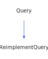

<a id="sect1query"></a>
<h1>Sect1Query</h1>
<a id="classMdDox_1_1Doxygen_1_1Sect1Query"></a>
<a href="https://github.com/CharlesCarley/MdDox">~</a>
<a href="indexpage.md#mddox">MdDox</a>
<span class="inline-text">/</span>
<a href="index.md#index">Index</a>
<span class="inline-text">/</span>
<a href="namespaceMdDox.md#mddox">MdDox</a>
<span class="inline-text">::</span>
<a href="namespaceMdDox_1_1Doxygen.md#doxygen">Doxygen</a>
<span class="inline-text">::</span>
<span class="bold-text"><b>Sect1Query</b></span>
<br/>
<br/>
<span class="inline-text">Implements the </span>
<code class="typewriter">docSect1Type</code>
<span class="inline-text"> scaffolding. </span>
<br/>
<br/>
<a id="derived-from"></a>
<h4>Derived From</h4>
<span class="icon-list-item"><a href="classMdDox_1_1Doxygen_1_1Query.md#query" class="icon-list-item"><span class="icon-list-item">Query</span>
</a>
</span>
<br/>
<br/>
<a id="public-methods"></a>
<h2>Public Methods</h2>
<span class="icon-list-item"><a href="#sect1query" class="icon-list-item"><span class="icon-list-item">Sect1Query</span>
</a>
</span>
<br/>
<span class="icon-list-item"><a href="#sect1query" class="icon-list-item"><span class="icon-list-item">Sect1Query</span>
</a>
</span>
<br/>
<span class="icon-list-item"><a href="#sect1query" class="icon-list-item"><span class="icon-list-item">Sect1Query</span>
</a>
</span>
<br/>
<span class="icon-list-item"><a href="#foreachparagraph" class="icon-list-item"><span class="icon-list-item">foreachParagraph</span>
</a>
</span>
<br/>
<span class="icon-list-item"><a href="#foreachsect2" class="icon-list-item"><span class="icon-list-item">foreachSect2</span>
</a>
</span>
<br/>
<span class="icon-list-item"><a href="#getid" class="icon-list-item"><span class="icon-list-item">getId</span>
</a>
</span>
<br/>
<span class="icon-list-item"><a href="#getinternal" class="icon-list-item"><span class="icon-list-item">getInternal</span>
</a>
</span>
<br/>
<span class="icon-list-item"><a href="#getinternal" class="icon-list-item"><span class="icon-list-item">getInternal</span>
</a>
</span>
<br/>
<span class="icon-list-item"><a href="#gettitle" class="icon-list-item"><span class="icon-list-item">getTitle</span>
</a>
</span>
<br/>
<span class="icon-list-item"><a href="#visit" class="icon-list-item"><span class="icon-list-item">visit</span>
</a>
</span>
<br/>
<a id="details"></a>
<h2>Details</h2>
<span class="inline-text">The following xml provides the source for the </span>
<span class="bold-text"><b>docSect1Type</b></span>
<span class="inline-text"> scaffolding.</span>

```xml
<xsd:complexType name="docSect1Type" mixed="true">
  <xsd:sequence>
    <xsd:element name="title" type="xsd:string"/>
    <xsd:element minOccurs="0" name="para" type="docParaType" maxOccurs="unbounded"/>
    <xsd:element minOccurs="0" name="sect2" type="docSect2Type" maxOccurs="unbounded"/>
    <xsd:element minOccurs="0" name="internal" type="docInternalS1Type"/>
  </xsd:sequence>
  <xsd:attribute name="id" type="xsd:string"/>
</xsd:complexType>
```
<br/>
<br/>
<a id="defined-in"></a>
<h4>Defined in</h4>
<span class="icon-list-item"><a href="https://github.com/CharlesCarley/MdDox/blob/master//Tools/Doxygen/Sect1Query.h#L81" class="icon-list-item"><span class="icon-list-item">Sect1Query.h</span>
</a>
</span>
<br/>
<a id="sect1query"></a>
<h2>Sect1Query</h2>
<span class="bold-text"><b>Sect1Query</b></span>
<span class="italic-text"><i>(</i></span>
<span class="italic-text"><i>)</i></span>
<a id="defined-in"></a>
<h4>Defined in</h4>
<span class="icon-list-item"><a href="https://github.com/CharlesCarley/MdDox/blob/master//Tools/Doxygen/Sect1Query.h#L83" class="icon-list-item"><span class="icon-list-item">Sect1Query.h</span>
</a>
</span>
<br/>
<br/>
<a id="sect1query"></a>
<h2>Sect1Query</h2>
<span class="bold-text"><b>Sect1Query</b></span>
<span class="italic-text"><i>(</i></span>
<div class="paragraph">
<span class="paragraph"><span class="inline-text">const </span>
<a href="classMdDox_1_1Doxygen_1_1Sect1Query.md#sect1query">Sect1Query</a>
<span class="inline-text"> &amp;</span>
<span class="inline-text">other</span>
</span>
</div>
<span class="italic-text"><i>)</i></span>
<a id="defined-in"></a>
<h4>Defined in</h4>
<span class="icon-list-item"><a href="https://github.com/CharlesCarley/MdDox/blob/master//Tools/Doxygen/Sect1Query.h#L84" class="icon-list-item"><span class="icon-list-item">Sect1Query.h</span>
</a>
</span>
<br/>
<br/>
<a id="sect1query"></a>
<h2>Sect1Query</h2>
<span class="bold-text"><b>Sect1Query</b></span>
<span class="italic-text"><i>(</i></span>
<div class="paragraph">
<span class="paragraph"><a href="classMdDox_1_1Xml_1_1Node.md#xmlnode">Xml::Node</a>
<span class="inline-text"> *</span>
<span class="inline-text">node</span>
</span>
</div>
<span class="italic-text"><i>)</i></span>
<a id="defined-in"></a>
<h4>Defined in</h4>
<span class="icon-list-item"><a href="https://github.com/CharlesCarley/MdDox/blob/master//Tools/Doxygen/Sect1Query.h#L86" class="icon-list-item"><span class="icon-list-item">Sect1Query.h</span>
</a>
</span>
<br/>
<br/>
<a id="foreachparagraph"></a>
<h2>foreachParagraph</h2>
<span class="inline-text">void</span>
<span class="bold-text"><b>foreachParagraph</b></span>
<span class="italic-text"><i>(</i></span>
<div class="paragraph">
<span class="paragraph"><span class="inline-text">const </span>
<a href="namespaceMdDox_1_1Doxygen.md#paraqueryfunction">ParaQueryFunction</a>
<span class="inline-text"> &amp;</span>
<span class="inline-text">invoke</span>
</span>
</div>
<span class="italic-text"><i>)</i></span>
<a id="details"></a>
<h4>Details</h4>
<span class="inline-text">Invokes the supplied callback on </span>
<span class="bold-text"><b>para</b></span>
<span class="inline-text"> elements. </span>
<br/>
<br/>
<a id="references"></a>
<h4>References</h4>
<span class="icon-list-item"><a href="classMdDox_1_1Doxygen_1_1Query.md#_node" class="icon-list-item"><span class="icon-list-item">_node</span>
</a>
</span>
<br/>
<a id="defined-in"></a>
<h4>Defined in</h4>
<span class="icon-list-item"><a href="https://github.com/CharlesCarley/MdDox/blob/master//Tools/Doxygen/Sect1Query.h#L120" class="icon-list-item"><span class="icon-list-item">Sect1Query.h</span>
</a>
</span>
<br/>
<span class="icon-list-item"><a href="https://github.com/CharlesCarley/MdDox/blob/master//Tools/Doxygen/Sect1Query.cpp#L94" class="icon-list-item"><span class="icon-list-item">Sect1Query.cpp</span>
</a>
</span>
<br/>
<br/>
<a id="foreachsect2"></a>
<h2>foreachSect2</h2>
<span class="inline-text">void</span>
<span class="bold-text"><b>foreachSect2</b></span>
<span class="italic-text"><i>(</i></span>
<div class="paragraph">
<span class="paragraph"><span class="inline-text">const </span>
<a href="namespaceMdDox_1_1Doxygen.md#sect2queryfunction">Sect2QueryFunction</a>
<span class="inline-text"> &amp;</span>
<span class="inline-text">invoke</span>
</span>
</div>
<span class="italic-text"><i>)</i></span>
<a id="details"></a>
<h4>Details</h4>
<span class="inline-text">Invokes the supplied callback on </span>
<span class="bold-text"><b>sect2</b></span>
<span class="inline-text"> elements. </span>
<br/>
<br/>
<a id="references"></a>
<h4>References</h4>
<span class="icon-list-item"><a href="classMdDox_1_1Doxygen_1_1Query.md#_node" class="icon-list-item"><span class="icon-list-item">_node</span>
</a>
</span>
<br/>
<a id="defined-in"></a>
<h4>Defined in</h4>
<span class="icon-list-item"><a href="https://github.com/CharlesCarley/MdDox/blob/master//Tools/Doxygen/Sect1Query.h#L125" class="icon-list-item"><span class="icon-list-item">Sect1Query.h</span>
</a>
</span>
<br/>
<span class="icon-list-item"><a href="https://github.com/CharlesCarley/MdDox/blob/master//Tools/Doxygen/Sect1Query.cpp#L99" class="icon-list-item"><span class="icon-list-item">Sect1Query.cpp</span>
</a>
</span>
<br/>
<br/>
<a id="getid"></a>
<h2>getId</h2>
<span class="inline-text">const </span>
<a href="namespaceMdDox.md#string">String</a>
<span class="inline-text"> &amp;</span>
<span class="bold-text"><b>getId</b></span>
<span class="italic-text"><i>(</i></span>
<div class="paragraph">
<span class="paragraph"><span class="inline-text">const </span>
<a href="namespaceMdDox.md#string">String</a>
<span class="inline-text"> &amp;</span>
<span class="inline-text">notFound</span>
<span class="inline-text"> = </span>
<span class="inline-text">&quot;&quot;</span>
</span>
</div>
<span class="italic-text"><i>)</i></span>
<a id="details"></a>
<h4>Details</h4>
<span class="inline-text">Provides access to the </span>
<span class="bold-text"><b>id</b></span>
<span class="inline-text"> attribute. </span>
<br/>
<br/>
<a id="returns"></a>
<h4>Returns</h4>
<span class="inline-text">The </span>
<span class="bold-text"><b>id</b></span>
<span class="inline-text"> enumerated value or an empty string the value is not found. </span>
<br/>
<br/>
<a id="references"></a>
<h4>References</h4>
<span class="icon-list-item"><a href="classMdDox_1_1Doxygen_1_1Query.md#_node" class="icon-list-item"><span class="icon-list-item">_node</span>
</a>
</span>
<br/>
<span class="icon-list-item"><a href="classMdDox_1_1Xml_1_1Node.md#attribute" class="icon-list-item"><span class="icon-list-item">attribute</span>
</a>
</span>
<br/>
<a id="defined-in"></a>
<h4>Defined in</h4>
<span class="icon-list-item"><a href="https://github.com/CharlesCarley/MdDox/blob/master//Tools/Doxygen/Sect1Query.h#L98" class="icon-list-item"><span class="icon-list-item">Sect1Query.h</span>
</a>
</span>
<br/>
<span class="icon-list-item"><a href="https://github.com/CharlesCarley/MdDox/blob/master//Tools/Doxygen/Sect1Query.cpp#L60" class="icon-list-item"><span class="icon-list-item">Sect1Query.cpp</span>
</a>
</span>
<br/>
<br/>
<a id="getinternal"></a>
<h2>getInternal</h2>
<span class="inline-text">void</span>
<span class="bold-text"><b>getInternal</b></span>
<span class="italic-text"><i>(</i></span>
<div class="paragraph">
<span class="paragraph"><a href="classMdDox_1_1Doxygen_1_1InternalS1Query.md#internals1query">InternalS1Query</a>
<span class="inline-text"> &amp;</span>
<span class="inline-text">dest</span>
</span>
</div>
<span class="italic-text"><i>)</i></span>
<a id="details"></a>
<h4>Details</h4>
<span class="inline-text">Provides access to the </span>
<span class="bold-text"><b>internal</b></span>
<span class="inline-text"> attribute. </span>
<br/>
<br/>
<a id="references"></a>
<h4>References</h4>
<span class="icon-list-item"><a href="classMdDox_1_1Doxygen_1_1Query.md#_node" class="icon-list-item"><span class="icon-list-item">_node</span>
</a>
</span>
<br/>
<span class="icon-list-item"><a href="classMdDox_1_1Doxygen_1_1Query.md#node" class="icon-list-item"><span class="icon-list-item">node</span>
</a>
</span>
<br/>
<span class="icon-list-item"><a href="classMdDox_1_1Xml_1_1Node.md#firstchildof" class="icon-list-item"><span class="icon-list-item">firstChildOf</span>
</a>
</span>
<br/>
<span class="icon-list-item"><a href="classMdDox_1_1Doxygen_1_1Query.md#reset" class="icon-list-item"><span class="icon-list-item">reset</span>
</a>
</span>
<br/>
<a id="defined-in"></a>
<h4>Defined in</h4>
<span class="icon-list-item"><a href="https://github.com/CharlesCarley/MdDox/blob/master//Tools/Doxygen/Sect1Query.h#L110" class="icon-list-item"><span class="icon-list-item">Sect1Query.h</span>
</a>
</span>
<br/>
<span class="icon-list-item"><a href="https://github.com/CharlesCarley/MdDox/blob/master//Tools/Doxygen/Sect1Query.cpp#L76" class="icon-list-item"><span class="icon-list-item">Sect1Query.cpp</span>
</a>
</span>
<br/>
<br/>
<a id="getinternal"></a>
<h2>getInternal</h2>
<a href="classMdDox_1_1Doxygen_1_1InternalS1Query.md#internals1query">InternalS1Query</a>
<span class="bold-text"><b>getInternal</b></span>
<span class="italic-text"><i>(</i></span>
<span class="italic-text"><i>)</i></span>
<a id="details"></a>
<h4>Details</h4>
<span class="inline-text">Provides access to the </span>
<span class="bold-text"><b>internal</b></span>
<span class="inline-text"> attribute. </span>
<br/>
<br/>
<a id="defined-in"></a>
<h4>Defined in</h4>
<span class="icon-list-item"><a href="https://github.com/CharlesCarley/MdDox/blob/master//Tools/Doxygen/Sect1Query.h#L115" class="icon-list-item"><span class="icon-list-item">Sect1Query.h</span>
</a>
</span>
<br/>
<span class="icon-list-item"><a href="https://github.com/CharlesCarley/MdDox/blob/master//Tools/Doxygen/Sect1Query.cpp#L87" class="icon-list-item"><span class="icon-list-item">Sect1Query.cpp</span>
</a>
</span>
<br/>
<br/>
<a id="gettitle"></a>
<h2>getTitle</h2>
<span class="inline-text">const </span>
<a href="namespaceMdDox.md#string">String</a>
<span class="inline-text"> &amp;</span>
<span class="bold-text"><b>getTitle</b></span>
<span class="italic-text"><i>(</i></span>
<div class="paragraph">
<span class="paragraph"><span class="inline-text">const </span>
<a href="namespaceMdDox.md#string">String</a>
<span class="inline-text"> &amp;</span>
<span class="inline-text">notFound</span>
<span class="inline-text"> = </span>
<span class="inline-text">&quot;&quot;</span>
</span>
</div>
<span class="italic-text"><i>)</i></span>
<a id="details"></a>
<h4>Details</h4>
<span class="inline-text">Provides access to the </span>
<span class="bold-text"><b>title</b></span>
<span class="inline-text"> tag&apos;s inner text. </span>
<br/>
<br/>
<a id="returns"></a>
<h4>Returns</h4>
<span class="inline-text">The </span>
<span class="bold-text"><b>title&apos;s</b></span>
<span class="inline-text"> text or the default value if the node is invalid. </span>
<br/>
<br/>
<a id="references"></a>
<h4>References</h4>
<span class="icon-list-item"><a href="classMdDox_1_1Doxygen_1_1Query.md#_node" class="icon-list-item"><span class="icon-list-item">_node</span>
</a>
</span>
<br/>
<span class="icon-list-item"><a href="classMdDox_1_1Doxygen_1_1Query.md#node" class="icon-list-item"><span class="icon-list-item">node</span>
</a>
</span>
<br/>
<span class="icon-list-item"><a href="classMdDox_1_1Xml_1_1Node.md#firstchildof" class="icon-list-item"><span class="icon-list-item">firstChildOf</span>
</a>
</span>
<br/>
<span class="icon-list-item"><a href="classMdDox_1_1Xml_1_1Node.md#text" class="icon-list-item"><span class="icon-list-item">text</span>
</a>
</span>
<br/>
<a id="defined-in"></a>
<h4>Defined in</h4>
<span class="icon-list-item"><a href="https://github.com/CharlesCarley/MdDox/blob/master//Tools/Doxygen/Sect1Query.h#L105" class="icon-list-item"><span class="icon-list-item">Sect1Query.h</span>
</a>
</span>
<br/>
<span class="icon-list-item"><a href="https://github.com/CharlesCarley/MdDox/blob/master//Tools/Doxygen/Sect1Query.cpp#L67" class="icon-list-item"><span class="icon-list-item">Sect1Query.cpp</span>
</a>
</span>
<br/>
<br/>
<a id="visit"></a>
<h2>visit</h2>
<span class="inline-text">void</span>
<span class="bold-text"><b>visit</b></span>
<span class="italic-text"><i>(</i></span>
<div class="paragraph">
<span class="paragraph"><a href="classMdDox_1_1Doxygen_1_1Visitors_1_1Sect1QueryVisitor.md#visitorssect1queryvisitor">Visitors::Sect1QueryVisitor</a>
<span class="inline-text"> *</span>
<span class="inline-text"> = </span>
<span class="inline-text">visitor</span>
</span>
</div>
<span class="italic-text"><i>)</i></span>
<a id="references"></a>
<h4>References</h4>
<span class="icon-list-item"><a href="classMdDox_1_1Doxygen_1_1Query.md#_node" class="icon-list-item"><span class="icon-list-item">_node</span>
</a>
</span>
<br/>
<span class="icon-list-item"><a href="classMdDox_1_1Xml_1_1Node.md#children" class="icon-list-item"><span class="icon-list-item">children</span>
</a>
</span>
<br/>
<span class="icon-list-item"><a href="namespaceMdDox_1_1Doxygen.md#doxtextnode" class="icon-list-item"><span class="icon-list-item">DoxTextNode</span>
</a>
</span>
<br/>
<span class="icon-list-item"><a href="classMdDox_1_1Doxygen_1_1Visitors_1_1Sect1QueryVisitor.md#visitedtext" class="icon-list-item"><span class="icon-list-item">visitedText</span>
</a>
</span>
<br/>
<span class="icon-list-item"><a href="classMdDox_1_1Doxygen_1_1Visitors_1_1Sect1QueryVisitor.md#visitedparagraph" class="icon-list-item"><span class="icon-list-item">visitedParagraph</span>
</a>
</span>
<br/>
<span class="icon-list-item"><a href="classMdDox_1_1Doxygen_1_1Visitors_1_1Sect1QueryVisitor.md#visitedsect2" class="icon-list-item"><span class="icon-list-item">visitedSect2</span>
</a>
</span>
<br/>
<span class="icon-list-item"><a href="classMdDox_1_1Doxygen_1_1Visitors_1_1Sect1QueryVisitor.md#visitedinternal" class="icon-list-item"><span class="icon-list-item">visitedInternal</span>
</a>
</span>
<br/>
<span class="icon-list-item"><a href="classMdDox_1_1Doxygen_1_1Visitors_1_1Sect1QueryVisitor.md#visitedtitle" class="icon-list-item"><span class="icon-list-item">visitedTitle</span>
</a>
</span>
<br/>
<a id="defined-in"></a>
<h4>Defined in</h4>
<span class="icon-list-item"><a href="https://github.com/CharlesCarley/MdDox/blob/master//Tools/Doxygen/Sect1Query.h#L91" class="icon-list-item"><span class="icon-list-item">Sect1Query.h</span>
</a>
</span>
<br/>
<span class="icon-list-item"><a href="https://github.com/CharlesCarley/MdDox/blob/master//Tools/Doxygen/Sect1Query.cpp#L31" class="icon-list-item"><span class="icon-list-item">Sect1Query.cpp</span>
</a>
</span>
<br/>
<br/>
<br/>
<blockquote>
<span class="inline-text">The following sources were used to generate this page.</span>
<br/>
<span class="icon-list-item"><a href="../xml/classMdDox_1_1Doxygen_1_1Sect1Query.xml#L1" class="icon-list-item"><span class="icon-list-item">classMdDox_1_1Doxygen_1_1Sect1Query.xml</span>
</a>
</span>
<br/>
<span class="icon-list-item"><a href="../xml/compound.xsd#L1" class="icon-list-item"><span class="icon-list-item">compound.xsd</span>
</a>
</span>
</blockquote>
</div>
</div>
</body>
</html>
