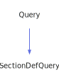

<a id="spquery"></a>
<h1>SpQuery</h1>
<a id="classMdDox_1_1Doxygen_1_1SpQuery"></a>
<a href="https://github.com/CharlesCarley/MdDox">~</a>
<a href="indexpage.md#mddox">MdDox</a>
<span class="inline-text">/</span>
<a href="index.md#index">Index</a>
<span class="inline-text">/</span>
<a href="namespaceMdDox.md#mddox">MdDox</a>
<span class="inline-text">::</span>
<a href="namespaceMdDox_1_1Doxygen.md#doxygen">Doxygen</a>
<span class="inline-text">::</span>
<span class="bold-text"><b>SpQuery</b></span>
<br/>
<br/>
<span class="inline-text">Implements the </span>
<code class="typewriter">spType</code>
<span class="inline-text"> scaffolding. </span>
<br/>
<br/>
<a id="derived-from"></a>
<h4>Derived From</h4>
<span class="icon-list-item"><a href="classMdDox_1_1Doxygen_1_1Query.md#query" class="icon-list-item"><span class="icon-list-item">Query</span>
</a>
</span>
<br/>
<br/>
<a id="public-methods"></a>
<h2>Public Methods</h2>
<span class="icon-list-item"><a href="#spquery" class="icon-list-item"><span class="icon-list-item">SpQuery</span>
</a>
</span>
<br/>
<span class="icon-list-item"><a href="#spquery" class="icon-list-item"><span class="icon-list-item">SpQuery</span>
</a>
</span>
<br/>
<span class="icon-list-item"><a href="#spquery" class="icon-list-item"><span class="icon-list-item">SpQuery</span>
</a>
</span>
<br/>
<span class="icon-list-item"><a href="#getvalue" class="icon-list-item"><span class="icon-list-item">getValue</span>
</a>
</span>
<br/>
<a id="details"></a>
<h2>Details</h2>
<span class="inline-text">The following xml provides the source for the </span>
<span class="bold-text"><b>spType</b></span>
<span class="inline-text"> scaffolding.</span>

```xml
<xsd:complexType name="spType" mixed="true">
  <xsd:attribute name="value" type="xsd:integer" use="optional"/>
</xsd:complexType>
```
<br/>
<br/>
<a id="defined-in"></a>
<h4>Defined in</h4>
<span class="icon-list-item"><a href="https://github.com/CharlesCarley/MdDox/blob/master//Tools/Doxygen/SpQuery.h#L42" class="icon-list-item"><span class="icon-list-item">SpQuery.h</span>
</a>
</span>
<br/>
<a id="spquery"></a>
<h2>SpQuery</h2>
<span class="bold-text"><b>SpQuery</b></span>
<span class="italic-text"><i>(</i></span>
<span class="italic-text"><i>)</i></span>
<a id="defined-in"></a>
<h4>Defined in</h4>
<span class="icon-list-item"><a href="https://github.com/CharlesCarley/MdDox/blob/master//Tools/Doxygen/SpQuery.h#L44" class="icon-list-item"><span class="icon-list-item">SpQuery.h</span>
</a>
</span>
<br/>
<br/>
<a id="spquery"></a>
<h2>SpQuery</h2>
<span class="bold-text"><b>SpQuery</b></span>
<span class="italic-text"><i>(</i></span>
<div class="paragraph">
<span class="paragraph"><span class="inline-text">const </span>
<a href="classMdDox_1_1Doxygen_1_1SpQuery.md#spquery">SpQuery</a>
<span class="inline-text"> &amp;</span>
<span class="inline-text">other</span>
</span>
</div>
<span class="italic-text"><i>)</i></span>
<a id="defined-in"></a>
<h4>Defined in</h4>
<span class="icon-list-item"><a href="https://github.com/CharlesCarley/MdDox/blob/master//Tools/Doxygen/SpQuery.h#L45" class="icon-list-item"><span class="icon-list-item">SpQuery.h</span>
</a>
</span>
<br/>
<br/>
<a id="spquery"></a>
<h2>SpQuery</h2>
<span class="bold-text"><b>SpQuery</b></span>
<span class="italic-text"><i>(</i></span>
<div class="paragraph">
<span class="paragraph"><a href="classMdDox_1_1Xml_1_1Node.md#xmlnode">Xml::Node</a>
<span class="inline-text"> *</span>
<span class="inline-text">node</span>
</span>
</div>
<span class="italic-text"><i>)</i></span>
<a id="defined-in"></a>
<h4>Defined in</h4>
<span class="icon-list-item"><a href="https://github.com/CharlesCarley/MdDox/blob/master//Tools/Doxygen/SpQuery.h#L47" class="icon-list-item"><span class="icon-list-item">SpQuery.h</span>
</a>
</span>
<br/>
<br/>
<a id="getvalue"></a>
<h2>getValue</h2>
<span class="inline-text">int64_t</span>
<span class="bold-text"><b>getValue</b></span>
<span class="italic-text"><i>(</i></span>
<div class="paragraph">
<span class="paragraph"><span class="inline-text">int64_t</span>
<span class="inline-text">def</span>
<span class="inline-text"> = </span>
<span class="inline-text">-1</span>
</span>
</div>
<span class="italic-text"><i>)</i></span>
<a id="details"></a>
<h4>Details</h4>
<span class="inline-text">Provides access to the </span>
<span class="bold-text"><b>value</b></span>
<span class="inline-text"> attribute. </span>
<br/>
<br/>
<a id="references"></a>
<h4>References</h4>
<span class="icon-list-item"><a href="classMdDox_1_1Doxygen_1_1Query.md#_node" class="icon-list-item"><span class="icon-list-item">_node</span>
</a>
</span>
<br/>
<span class="icon-list-item"><a href="classMdDox_1_1Xml_1_1Node.md#integer" class="icon-list-item"><span class="icon-list-item">integer</span>
</a>
</span>
<br/>
<a id="defined-in"></a>
<h4>Defined in</h4>
<span class="icon-list-item"><a href="https://github.com/CharlesCarley/MdDox/blob/master//Tools/Doxygen/SpQuery.h#L54" class="icon-list-item"><span class="icon-list-item">SpQuery.h</span>
</a>
</span>
<br/>
<span class="icon-list-item"><a href="https://github.com/CharlesCarley/MdDox/blob/master//Tools/Doxygen/SpQuery.cpp#L28" class="icon-list-item"><span class="icon-list-item">SpQuery.cpp</span>
</a>
</span>
<br/>
<br/>
<br/>
<blockquote>
<span class="inline-text">The following sources were used to generate this page.</span>
<br/>
<span class="icon-list-item"><a href="../xml/classMdDox_1_1Doxygen_1_1SpQuery.xml#L1" class="icon-list-item"><span class="icon-list-item">classMdDox_1_1Doxygen_1_1SpQuery.xml</span>
</a>
</span>
<br/>
<span class="icon-list-item"><a href="../xml/compound.xsd#L1" class="icon-list-item"><span class="icon-list-item">compound.xsd</span>
</a>
</span>
</blockquote>
</div>
</div>
</body>
</html>
