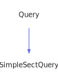

<a id="tablequery"></a>
<h1>TableQuery</h1>
<a id="classMdDox_1_1Doxygen_1_1TableQuery"></a>
<a href="https://github.com/CharlesCarley/MdDox">~</a>
<a href="indexpage.md#mddox">MdDox</a>
<span class="inline-text">/</span>
<a href="index.md#toc">TOC</a>
<span class="inline-text">/</span>
<a href="namespaceMdDox.md#mddox">MdDox</a>
<span class="inline-text">::</span>
<a href="namespaceMdDox_1_1Doxygen.md#doxygen">Doxygen</a>
<span class="inline-text">::</span>
<span class="bold-text"><b>TableQuery</b></span>
<br/>
<br/>
<span class="inline-text">Implements the </span>
<code class="typewriter">docTableType</code>
<span class="inline-text"> scaffolding. </span>
<br/>
<br/>
<a id="derived-from"></a>
<h4>Derived From</h4>
<span class="icon-list-item"><a href="classMdDox_1_1Doxygen_1_1Query.md#query" class="icon-list-item"><span class="icon-list-item">Query</span>
</a>
</span>
<br/>
<br/>
<a id="public-methods"></a>
<h2>Public Methods</h2>
<span class="icon-list-item"><a href="#tablequery" class="icon-list-item"><span class="icon-list-item">TableQuery</span>
</a>
</span>
<br/>
<span class="icon-list-item"><a href="#tablequery" class="icon-list-item"><span class="icon-list-item">TableQuery</span>
</a>
</span>
<br/>
<span class="icon-list-item"><a href="#tablequery" class="icon-list-item"><span class="icon-list-item">TableQuery</span>
</a>
</span>
<br/>
<span class="icon-list-item"><a href="#getcaption" class="icon-list-item"><span class="icon-list-item">getCaption</span>
</a>
</span>
<br/>
<span class="icon-list-item"><a href="#getcaption" class="icon-list-item"><span class="icon-list-item">getCaption</span>
</a>
</span>
<br/>
<span class="icon-list-item"><a href="#getcols" class="icon-list-item"><span class="icon-list-item">getCols</span>
</a>
</span>
<br/>
<span class="icon-list-item"><a href="#getrows" class="icon-list-item"><span class="icon-list-item">getRows</span>
</a>
</span>
<br/>
<span class="icon-list-item"><a href="#visit" class="icon-list-item"><span class="icon-list-item">visit</span>
</a>
</span>
<br/>
<a id="details"></a>
<h2>Details</h2>
<span class="inline-text">The following xml provides the source for the </span>
<span class="bold-text"><b>docTableType</b></span>
<span class="inline-text"> scaffolding.</span>

```xml
<xsd:complexType name="docTableType">
  <xsd:sequence>
    <xsd:element minOccurs="0" name="row" type="docRowType" maxOccurs="unbounded"/>
    <xsd:element minOccurs="0" name="caption" type="docCaptionType"/>
  </xsd:sequence>
  <xsd:attribute name="rows" type="xsd:integer"/>
  <xsd:attribute name="cols" type="xsd:integer"/>
</xsd:complexType>
```
<br/>
<br/>
<a id="defined-in"></a>
<h4>Defined in</h4>
<span class="icon-list-item"><a href="https://github.com/CharlesCarley/MdDox/blob/master//Tools/Doxygen/TableQuery.h#L65" class="icon-list-item"><span class="icon-list-item">TableQuery.h</span>
</a>
</span>
<br/>
<a id="tablequery"></a>
<h2>TableQuery</h2>
<span class="bold-text"><b>TableQuery</b></span>
<span class="italic-text"><i>(</i></span>
<span class="italic-text"><i>)</i></span>
<a id="defined-in"></a>
<h4>Defined in</h4>
<span class="icon-list-item"><a href="https://github.com/CharlesCarley/MdDox/blob/master//Tools/Doxygen/TableQuery.h#L67" class="icon-list-item"><span class="icon-list-item">TableQuery.h</span>
</a>
</span>
<br/>
<br/>
<a id="tablequery"></a>
<h2>TableQuery</h2>
<span class="bold-text"><b>TableQuery</b></span>
<span class="italic-text"><i>(</i></span>
<div class="paragraph">
<span class="paragraph"><span class="inline-text">const </span>
<a href="classMdDox_1_1Doxygen_1_1TableQuery.md#tablequery">TableQuery</a>
<span class="inline-text"> &amp;</span>
<span class="inline-text">other</span>
</span>
</div>
<span class="italic-text"><i>)</i></span>
<a id="defined-in"></a>
<h4>Defined in</h4>
<span class="icon-list-item"><a href="https://github.com/CharlesCarley/MdDox/blob/master//Tools/Doxygen/TableQuery.h#L68" class="icon-list-item"><span class="icon-list-item">TableQuery.h</span>
</a>
</span>
<br/>
<br/>
<a id="tablequery"></a>
<h2>TableQuery</h2>
<span class="bold-text"><b>TableQuery</b></span>
<span class="italic-text"><i>(</i></span>
<div class="paragraph">
<span class="paragraph"><a href="classMdDox_1_1Xml_1_1Node.md#xmlnode">Xml::Node</a>
<span class="inline-text"> *</span>
<span class="inline-text">node</span>
</span>
</div>
<span class="italic-text"><i>)</i></span>
<a id="defined-in"></a>
<h4>Defined in</h4>
<span class="icon-list-item"><a href="https://github.com/CharlesCarley/MdDox/blob/master//Tools/Doxygen/TableQuery.h#L70" class="icon-list-item"><span class="icon-list-item">TableQuery.h</span>
</a>
</span>
<br/>
<br/>
<a id="getcaption"></a>
<h2>getCaption</h2>
<span class="inline-text">void</span>
<span class="bold-text"><b>getCaption</b></span>
<span class="italic-text"><i>(</i></span>
<div class="paragraph">
<span class="paragraph"><a href="classMdDox_1_1Doxygen_1_1CaptionQuery.md#captionquery">CaptionQuery</a>
<span class="inline-text"> &amp;</span>
<span class="inline-text">dest</span>
</span>
</div>
<span class="italic-text"><i>)</i></span>
<a id="details"></a>
<h4>Details</h4>
<span class="inline-text">Provides access to the </span>
<span class="bold-text"><b>caption</b></span>
<span class="inline-text"> attribute. </span>
<br/>
<br/>
<a id="references"></a>
<h4>References</h4>
<span class="icon-list-item"><a href="classMdDox_1_1Doxygen_1_1Query.md#_node" class="icon-list-item"><span class="icon-list-item">_node</span>
</a>
</span>
<br/>
<span class="icon-list-item"><a href="classMdDox_1_1Doxygen_1_1Query.md#node" class="icon-list-item"><span class="icon-list-item">node</span>
</a>
</span>
<br/>
<span class="icon-list-item"><a href="classMdDox_1_1Xml_1_1Node.md#firstchildof" class="icon-list-item"><span class="icon-list-item">firstChildOf</span>
</a>
</span>
<br/>
<span class="icon-list-item"><a href="classMdDox_1_1Doxygen_1_1Query.md#reset" class="icon-list-item"><span class="icon-list-item">reset</span>
</a>
</span>
<br/>
<a id="defined-in"></a>
<h4>Defined in</h4>
<span class="icon-list-item"><a href="https://github.com/CharlesCarley/MdDox/blob/master//Tools/Doxygen/TableQuery.h#L79" class="icon-list-item"><span class="icon-list-item">TableQuery.h</span>
</a>
</span>
<br/>
<span class="icon-list-item"><a href="https://github.com/CharlesCarley/MdDox/blob/master//Tools/Doxygen/TableQuery.cpp#L59" class="icon-list-item"><span class="icon-list-item">TableQuery.cpp</span>
</a>
</span>
<br/>
<br/>
<a id="getcaption"></a>
<h2>getCaption</h2>
<a href="classMdDox_1_1Doxygen_1_1CaptionQuery.md#captionquery">CaptionQuery</a>
<span class="bold-text"><b>getCaption</b></span>
<span class="italic-text"><i>(</i></span>
<span class="italic-text"><i>)</i></span>
<a id="details"></a>
<h4>Details</h4>
<span class="inline-text">Provides access to the </span>
<span class="bold-text"><b>caption</b></span>
<span class="inline-text"> attribute. </span>
<br/>
<br/>
<a id="defined-in"></a>
<h4>Defined in</h4>
<span class="icon-list-item"><a href="https://github.com/CharlesCarley/MdDox/blob/master//Tools/Doxygen/TableQuery.h#L84" class="icon-list-item"><span class="icon-list-item">TableQuery.h</span>
</a>
</span>
<br/>
<span class="icon-list-item"><a href="https://github.com/CharlesCarley/MdDox/blob/master//Tools/Doxygen/TableQuery.cpp#L70" class="icon-list-item"><span class="icon-list-item">TableQuery.cpp</span>
</a>
</span>
<br/>
<br/>
<a id="getcols"></a>
<h2>getCols</h2>
<span class="inline-text">int64_t</span>
<span class="bold-text"><b>getCols</b></span>
<span class="italic-text"><i>(</i></span>
<div class="paragraph">
<span class="paragraph"><span class="inline-text">int64_t</span>
<span class="inline-text">def</span>
<span class="inline-text"> = </span>
<span class="inline-text">-1</span>
</span>
</div>
<span class="italic-text"><i>)</i></span>
<a id="details"></a>
<h4>Details</h4>
<span class="inline-text">Provides access to the </span>
<span class="bold-text"><b>cols</b></span>
<span class="inline-text"> attribute. </span>
<br/>
<br/>
<a id="references"></a>
<h4>References</h4>
<span class="icon-list-item"><a href="classMdDox_1_1Doxygen_1_1Query.md#_node" class="icon-list-item"><span class="icon-list-item">_node</span>
</a>
</span>
<br/>
<span class="icon-list-item"><a href="classMdDox_1_1Xml_1_1Node.md#integer" class="icon-list-item"><span class="icon-list-item">integer</span>
</a>
</span>
<br/>
<a id="defined-in"></a>
<h4>Defined in</h4>
<span class="icon-list-item"><a href="https://github.com/CharlesCarley/MdDox/blob/master//Tools/Doxygen/TableQuery.h#L94" class="icon-list-item"><span class="icon-list-item">TableQuery.h</span>
</a>
</span>
<br/>
<span class="icon-list-item"><a href="https://github.com/CharlesCarley/MdDox/blob/master//Tools/Doxygen/TableQuery.cpp#L54" class="icon-list-item"><span class="icon-list-item">TableQuery.cpp</span>
</a>
</span>
<br/>
<br/>
<a id="getrows"></a>
<h2>getRows</h2>
<span class="inline-text">int64_t</span>
<span class="bold-text"><b>getRows</b></span>
<span class="italic-text"><i>(</i></span>
<div class="paragraph">
<span class="paragraph"><span class="inline-text">int64_t</span>
<span class="inline-text">def</span>
<span class="inline-text"> = </span>
<span class="inline-text">-1</span>
</span>
</div>
<span class="italic-text"><i>)</i></span>
<a id="details"></a>
<h4>Details</h4>
<span class="inline-text">Provides access to the </span>
<span class="bold-text"><b>rows</b></span>
<span class="inline-text"> attribute. </span>
<br/>
<br/>
<a id="references"></a>
<h4>References</h4>
<span class="icon-list-item"><a href="classMdDox_1_1Doxygen_1_1Query.md#_node" class="icon-list-item"><span class="icon-list-item">_node</span>
</a>
</span>
<br/>
<span class="icon-list-item"><a href="classMdDox_1_1Xml_1_1Node.md#integer" class="icon-list-item"><span class="icon-list-item">integer</span>
</a>
</span>
<br/>
<a id="defined-in"></a>
<h4>Defined in</h4>
<span class="icon-list-item"><a href="https://github.com/CharlesCarley/MdDox/blob/master//Tools/Doxygen/TableQuery.h#L89" class="icon-list-item"><span class="icon-list-item">TableQuery.h</span>
</a>
</span>
<br/>
<span class="icon-list-item"><a href="https://github.com/CharlesCarley/MdDox/blob/master//Tools/Doxygen/TableQuery.cpp#L49" class="icon-list-item"><span class="icon-list-item">TableQuery.cpp</span>
</a>
</span>
<br/>
<br/>
<a id="visit"></a>
<h2>visit</h2>
<span class="inline-text">void</span>
<span class="bold-text"><b>visit</b></span>
<span class="italic-text"><i>(</i></span>
<div class="paragraph">
<span class="paragraph"><a href="classMdDox_1_1Doxygen_1_1Visitors_1_1TableQueryVisitor.md#visitorstablequeryvisitor">Visitors::TableQueryVisitor</a>
<span class="inline-text"> *</span>
<span class="inline-text"> = </span>
<span class="inline-text">visitor</span>
</span>
</div>
<span class="italic-text"><i>)</i></span>
<a id="references"></a>
<h4>References</h4>
<span class="icon-list-item"><a href="classMdDox_1_1Doxygen_1_1Query.md#_node" class="icon-list-item"><span class="icon-list-item">_node</span>
</a>
</span>
<br/>
<span class="icon-list-item"><a href="classMdDox_1_1Xml_1_1Node.md#children" class="icon-list-item"><span class="icon-list-item">children</span>
</a>
</span>
<br/>
<span class="icon-list-item"><a href="namespaceMdDox_1_1Doxygen.md#doxtextnode" class="icon-list-item"><span class="icon-list-item">DoxTextNode</span>
</a>
</span>
<br/>
<span class="icon-list-item"><a href="classMdDox_1_1Doxygen_1_1Visitors_1_1TableQueryVisitor.md#visitedtext" class="icon-list-item"><span class="icon-list-item">visitedText</span>
</a>
</span>
<br/>
<span class="icon-list-item"><a href="classMdDox_1_1Doxygen_1_1Visitors_1_1TableQueryVisitor.md#visitedcaption" class="icon-list-item"><span class="icon-list-item">visitedCaption</span>
</a>
</span>
<br/>
<a id="defined-in"></a>
<h4>Defined in</h4>
<span class="icon-list-item"><a href="https://github.com/CharlesCarley/MdDox/blob/master//Tools/Doxygen/TableQuery.h#L75" class="icon-list-item"><span class="icon-list-item">TableQuery.h</span>
</a>
</span>
<br/>
<span class="icon-list-item"><a href="https://github.com/CharlesCarley/MdDox/blob/master//Tools/Doxygen/TableQuery.cpp#L29" class="icon-list-item"><span class="icon-list-item">TableQuery.cpp</span>
</a>
</span>
<br/>
<br/>
<br/>
<blockquote>
<span class="inline-text">The following sources were used to generate this page.</span>
<br/>
<span class="icon-list-item"><a href="../xml/classMdDox_1_1Doxygen_1_1TableQuery.xml#L1" class="icon-list-item"><span class="icon-list-item">classMdDox_1_1Doxygen_1_1TableQuery.xml</span>
</a>
</span>
<br/>
<span class="icon-list-item"><a href="../xml/compound.xsd#L1" class="icon-list-item"><span class="icon-list-item">compound.xsd</span>
</a>
</span>
</blockquote>
</div>
</div>
</body>
</html>
