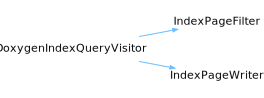

<h1>DescriptionQueryVisitor</h1>

<a href="https://github.com/CharlesCarley/MdDox">~</a>
<a href="indexpage.md#mddox">MdDox</a>
/
<a href="index.md#index">Index</a>
/
<a href="namespaceMdDox.md#mddox">MdDox</a>
::
<a href="namespaceMdDox_1_1Doxygen.md#doxygen">Doxygen</a>
::
<a href="namespaceMdDox_1_1Doxygen_1_1Visitors.md#visitors">Visitors</a>
::
<b>DescriptionQueryVisitor</b>
 
 

<h4>Derived By</h4>
<a href="classMdDox_1_1DescriptionWriter.md#descriptionwriter" class="icon-list-item">DescriptionWriter
</a>

 
 

<h2>Public Methods</h2>
<a href="#~descriptionqueryvisitor" class="icon-list-item">~DescriptionQueryVisitor
</a>

 
<a href="#visitedinternal" class="icon-list-item">visitedInternal
</a>

 
<a href="#visitedparagraph" class="icon-list-item">visitedParagraph
</a>

 
<a href="#visitedsect1" class="icon-list-item">visitedSect1
</a>

 
<a href="#visitedtext" class="icon-list-item">visitedText
</a>

 
<a href="#visitedtitle" class="icon-list-item">visitedTitle
</a>

 

<h4>Defined in</h4>
<a href="https://github.com/CharlesCarley/MdDox/blob/master//Tools/Doxygen/DescriptionQuery.h#L31" class="icon-list-item">DescriptionQuery.h
</a>

 

<h2>~DescriptionQueryVisitor</h2>
<b>~DescriptionQueryVisitor</b>
<i>(</i>
<i>)</i>

<h4>Defined in</h4>
<a href="https://github.com/CharlesCarley/MdDox/blob/master//Tools/Doxygen/DescriptionQuery.h#L33" class="icon-list-item">DescriptionQuery.h
</a>

 
 

<h2>visitedInternal</h2>
void
<b>visitedInternal</b>
<i>(</i>

const 
<a href="classMdDox_1_1Doxygen_1_1InternalQuery.md#internalquery">InternalQuery</a>
 &amp;
query

<i>)</i>

<h4>Details</h4>
Called when the element 
<b>internal</b>
 is found. 
 
 
<ul>
<li><b>query</b>
 - 
Const reference to the 
<a href="classMdDox_1_1Doxygen_1_1InternalQuery.md#internalquery">InternalQuery</a>
 class. 
</li>
</ul>
 

<h4>Defined in</h4>
<a href="https://github.com/CharlesCarley/MdDox/blob/master//Tools/Doxygen/DescriptionQuery.h#L53" class="icon-list-item">DescriptionQuery.h
</a>

 
 

<h2>visitedParagraph</h2>
void
<b>visitedParagraph</b>
<i>(</i>

const 
<a href="classMdDox_1_1Doxygen_1_1ParaQuery.md#paraquery">ParaQuery</a>
 &amp;
query

<i>)</i>

<h4>Details</h4>
Called when the element 
<b>para</b>
 is found. 
 
 
<ul>
<li><b>query</b>
 - 
Const reference to the 
<a href="classMdDox_1_1Doxygen_1_1ParaQuery.md#paraquery">ParaQuery</a>
 class. 
</li>
</ul>
 

<h4>Defined in</h4>
<a href="https://github.com/CharlesCarley/MdDox/blob/master//Tools/Doxygen/DescriptionQuery.h#L43" class="icon-list-item">DescriptionQuery.h
</a>

 
 

<h2>visitedSect1</h2>
void
<b>visitedSect1</b>
<i>(</i>

const 
<a href="classMdDox_1_1Doxygen_1_1Sect1Query.md#sect1query">Sect1Query</a>
 &amp;
query

<i>)</i>

<h4>Details</h4>
Called when the element 
<b>sect1</b>
 is found. 
 
 
<ul>
<li><b>query</b>
 - 
Const reference to the 
<a href="classMdDox_1_1Doxygen_1_1Sect1Query.md#sect1query">Sect1Query</a>
 class. 
</li>
</ul>
 

<h4>Defined in</h4>
<a href="https://github.com/CharlesCarley/MdDox/blob/master//Tools/Doxygen/DescriptionQuery.h#L48" class="icon-list-item">DescriptionQuery.h
</a>

 
 

<h2>visitedText</h2>
void
<b>visitedText</b>
<i>(</i>

const 
<a href="namespaceMdDox.md#string">String</a>
 &amp;

<i>)</i>

<h4>Details</h4>
Callback for every _text_node. 
 
 

<h4>Defined in</h4>
<a href="https://github.com/CharlesCarley/MdDox/blob/master//Tools/Doxygen/DescriptionQuery.h#L38" class="icon-list-item">DescriptionQuery.h
</a>

 
 

<h2>visitedTitle</h2>
void
<b>visitedTitle</b>
<i>(</i>

const 
<a href="namespaceMdDox.md#string">String</a>
 &amp;
text

<i>)</i>

<h4>Details</h4>
Called when the element 
<b>title</b>
 is found. 
 
 
<ul>
<li><b>text</b>
 - 
Const reference to the internal text. 
</li>
</ul>
 

<h4>Defined in</h4>
<a href="https://github.com/CharlesCarley/MdDox/blob/master//Tools/Doxygen/DescriptionQuery.h#L58" class="icon-list-item">DescriptionQuery.h
</a>

 
 
 
<blockquote>
The following sources were used to generate this page.
 
<a href="../xml/classMdDox_1_1Doxygen_1_1Visitors_1_1DescriptionQueryVisitor.xml#L1" class="icon-list-item">classMdDox_1_1Doxygen_1_1Visitors_1_1DescriptionQueryVisitor.xml
</a>

 
<a href="../xml/compound.xsd#L1" class="icon-list-item">compound.xsd
</a>

</blockquote>

</body>
</html>
