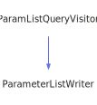

<h1>ParamNameListQueryVisitor</h1>

<a href="https://github.com/CharlesCarley/MdDox#~">~</a>
<a href="indexpage.md#mddox">MdDox</a>
/
<a href="index.md#index">Index</a>
/
<a href="namespaceMdDox.md#mddox">MdDox</a>
::
<a href="namespaceMdDox_1_1Doxygen.md#doxygen">Doxygen</a>
::
<a href="namespaceMdDox_1_1Doxygen_1_1Visitors.md#visitors">Visitors</a>
::
<b>ParamNameListQueryVisitor</b>
 
 

<h4>Derived By</h4>

<a href="classMdDox_1_1NameListVisitor.md#namelistvisitor">MdDox::NameListVisitor</a>

 

<h2>Public Methods</h2>
<a href="#~paramnamelistqueryvisitor" class="icon-list-item">~ParamNameListQueryVisitor
</a>

 
<a href="#visitedparametername" class="icon-list-item">visitedParameterName
</a>

 
<a href="#visitedtext" class="icon-list-item">visitedText
</a>

 

<h4>Defined in</h4>
<a href="https://github.com/CharlesCarley/MdDox/blob/master/Tools/Doxygen/ParamNameListQuery.h#L31" class="icon-list-item">ParamNameListQuery.h
</a>

 
 
<a href="#paramnamelistqueryvisitor" class="icon-list-item">top
</a>

<h2>~ParamNameListQueryVisitor</h2>
<b>~ParamNameListQueryVisitor</b>
<i>(</i>
<i>)</i>

<h4>Defined in</h4>
<a href="https://github.com/CharlesCarley/MdDox/blob/master/Tools/Doxygen/ParamNameListQuery.h#L33" class="icon-list-item">ParamNameListQuery.h
</a>

 
 
<a href="#paramnamelistqueryvisitor" class="icon-list-item">top
</a>

 

<h2>visitedParameterName</h2>
void
<b>visitedParameterName</b>
<i>(</i>

const 
<a href="classMdDox_1_1Doxygen_1_1ParamNameQuery.md#paramnamequery">ParamNameQuery</a>
 &amp;
query

<i>)</i>

<h4>Details</h4>
Called when the element 
<b>parametername</b>
 is found. 
 
 
<ul>
<li><b>query</b>
 - 
Const reference to the 
<a href="classMdDox_1_1Doxygen_1_1ParamNameQuery.md#paramnamequery">ParamNameQuery</a>
 class. 
</li>
</ul>
 

<h4>Defined in</h4>
<a href="https://github.com/CharlesCarley/MdDox/blob/master/Tools/Doxygen/ParamNameListQuery.h#L43" class="icon-list-item">ParamNameListQuery.h
</a>

 
 
<a href="#paramnamelistqueryvisitor" class="icon-list-item">top
</a>

 

<h2>visitedText</h2>
void
<b>visitedText</b>
<i>(</i>

const 
<a href="namespaceMdDox.md#string">String</a>
 &amp;

<i>)</i>

<h4>Details</h4>
Callback for every _text_node. 
 
 

<h4>Defined in</h4>
<a href="https://github.com/CharlesCarley/MdDox/blob/master/Tools/Doxygen/ParamNameListQuery.h#L38" class="icon-list-item">ParamNameListQuery.h
</a>

 
 
<a href="#paramnamelistqueryvisitor" class="icon-list-item">top
</a>

 

</body>
</html>
