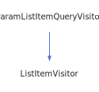

<h1>ParamQueryVisitor</h1>

<a href="https://github.com/CharlesCarley/MdDox">~</a>
<a href="indexpage.md#index">Index</a>
/
<a href="index.md#mddox">MdDox</a>
/
<a href="namespaceMdDox.md#">MdDox</a>
::
<a href="dir_b7487e7b43f0278857c63f4e9ad683a3.md#">Tools/Doxygen</a>
::
<b>ParamQueryVisitor</b>
 
 

<h4>Derived By</h4>
<a href="classMdDox_1_1ParameterWriter.md#parameterwriter" class="icon-list-item">ParameterWriter
</a>

 
 

<h2>Public Methods</h2>
<a href="#~paramqueryvisitor" class="icon-list-item">~ParamQueryVisitor
</a>

 
<a href="#visitedarray" class="icon-list-item">visitedArray
</a>

 
<a href="#visitedbriefdescription" class="icon-list-item">visitedBriefDescription
</a>

 
<a href="#visiteddeclname" class="icon-list-item">visitedDeclName
</a>

 
<a href="#visiteddefname" class="icon-list-item">visitedDefName
</a>

 
<a href="#visiteddefval" class="icon-list-item">visitedDefVal
</a>

 
<a href="#visitedtext" class="icon-list-item">visitedText
</a>

 
<a href="#visitedtype" class="icon-list-item">visitedType
</a>

 

<h4>Defined in</h4>
<a href="https://github.com/CharlesCarley/MdDox/blob/master//Tools/Doxygen/ParamQuery.h#L31" class="icon-list-item">ParamQuery.h
</a>

 

<h2>~ParamQueryVisitor</h2>
<b>~ParamQueryVisitor</b>
<i>(</i>
<i>)</i>

<h4>Defined in</h4>
<a href="https://github.com/CharlesCarley/MdDox/blob/master//Tools/Doxygen/ParamQuery.h#L33" class="icon-list-item">ParamQuery.h
</a>

 
 

<h2>visitedArray</h2>
void
<b>visitedArray</b>
<i>(</i>

const 
<a href="namespaceMdDox.md#string">String</a>
 &amp;
text

<i>)</i>

<h4>Details</h4>
Called when the element 
<b>array</b>
 is found. 
 
 
<ul>
<li><b>text</b>
 - 
Const reference to the internal text. 
</li>
</ul>
 

<h4>Defined in</h4>
<a href="https://github.com/CharlesCarley/MdDox/blob/master//Tools/Doxygen/ParamQuery.h#L68" class="icon-list-item">ParamQuery.h
</a>

 
 

<h2>visitedBriefDescription</h2>
void
<b>visitedBriefDescription</b>
<i>(</i>

const 
<a href="classMdDox_1_1Doxygen_1_1DescriptionQuery.md#descriptionquery">DescriptionQuery</a>
 &amp;
query

<i>)</i>

<h4>Details</h4>
Called when the element 
<b>briefdescription</b>
 is found. 
 
 
<ul>
<li><b>query</b>
 - 
Const reference to the 
<a href="classMdDox_1_1Doxygen_1_1DescriptionQuery.md#descriptionquery">DescriptionQuery</a>
 class. 
</li>
</ul>
 

<h4>Defined in</h4>
<a href="https://github.com/CharlesCarley/MdDox/blob/master//Tools/Doxygen/ParamQuery.h#L53" class="icon-list-item">ParamQuery.h
</a>

 
 

<h2>visitedDeclName</h2>
void
<b>visitedDeclName</b>
<i>(</i>

const 
<a href="namespaceMdDox.md#string">String</a>
 &amp;
text

<i>)</i>

<h4>Details</h4>
Called when the element 
<b>declname</b>
 is found. 
 
 
<ul>
<li><b>text</b>
 - 
Const reference to the internal text. 
</li>
</ul>
 

<h4>Defined in</h4>
<a href="https://github.com/CharlesCarley/MdDox/blob/master//Tools/Doxygen/ParamQuery.h#L58" class="icon-list-item">ParamQuery.h
</a>

 
 

<h2>visitedDefName</h2>
void
<b>visitedDefName</b>
<i>(</i>

const 
<a href="namespaceMdDox.md#string">String</a>
 &amp;
text

<i>)</i>

<h4>Details</h4>
Called when the element 
<b>defname</b>
 is found. 
 
 
<ul>
<li><b>text</b>
 - 
Const reference to the internal text. 
</li>
</ul>
 

<h4>Defined in</h4>
<a href="https://github.com/CharlesCarley/MdDox/blob/master//Tools/Doxygen/ParamQuery.h#L63" class="icon-list-item">ParamQuery.h
</a>

 
 

<h2>visitedDefVal</h2>
void
<b>visitedDefVal</b>
<i>(</i>

const 
<a href="classMdDox_1_1Doxygen_1_1LinkedTextQuery.md#linkedtextquery">LinkedTextQuery</a>
 &amp;
query

<i>)</i>

<h4>Details</h4>
Called when the element 
<b>defval</b>
 is found. 
 
 
<ul>
<li><b>query</b>
 - 
Const reference to the 
<a href="classMdDox_1_1Doxygen_1_1LinkedTextQuery.md#linkedtextquery">LinkedTextQuery</a>
 class. 
</li>
</ul>
 

<h4>Defined in</h4>
<a href="https://github.com/CharlesCarley/MdDox/blob/master//Tools/Doxygen/ParamQuery.h#L48" class="icon-list-item">ParamQuery.h
</a>

 
 

<h2>visitedText</h2>
void
<b>visitedText</b>
<i>(</i>

const 
<a href="namespaceMdDox.md#string">String</a>
 &amp;

<i>)</i>

<h4>Details</h4>
Callback for every _text_node. 
 
 

<h4>Defined in</h4>
<a href="https://github.com/CharlesCarley/MdDox/blob/master//Tools/Doxygen/ParamQuery.h#L38" class="icon-list-item">ParamQuery.h
</a>

 
 

<h2>visitedType</h2>
void
<b>visitedType</b>
<i>(</i>

const 
<a href="classMdDox_1_1Doxygen_1_1LinkedTextQuery.md#linkedtextquery">LinkedTextQuery</a>
 &amp;
query

<i>)</i>

<h4>Details</h4>
Called when the element 
<b>type</b>
 is found. 
 
 
<ul>
<li><b>query</b>
 - 
Const reference to the 
<a href="classMdDox_1_1Doxygen_1_1LinkedTextQuery.md#linkedtextquery">LinkedTextQuery</a>
 class. 
</li>
</ul>
 

<h4>Defined in</h4>
<a href="https://github.com/CharlesCarley/MdDox/blob/master//Tools/Doxygen/ParamQuery.h#L43" class="icon-list-item">ParamQuery.h
</a>

 
 
 
<blockquote>
The following sources were used to generate this page.
 
<a href="../xml/classMdDox_1_1Doxygen_1_1Visitors_1_1ParamQueryVisitor.xml#L1" class="icon-list-item">classMdDox_1_1Doxygen_1_1Visitors_1_1ParamQueryVisitor.xml
</a>

 
<a href="../xml/compound.xsd#L1" class="icon-list-item">compound.xsd
</a>

</blockquote>

</body>
</html>
