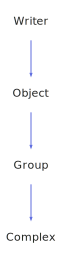

<h1>Object</h1>

<a href="https://github.com/CharlesCarley/MdDox">~</a>
<a href="indexpage.md#index">Index</a>
/
<a href="index.md#mddox">MdDox</a>
/
<a href="namespaceMdDox.md#">MdDox</a>
::
<a href="dir_f29546df2d60a62028851d3354c1d20f.md#">Tools/GenApi</a>
::
<b>Object</b>
 
 

<h4>Derived From</h4>
<a href="classMdDox_1_1Xml_1_1Writer.md#writer" class="icon-list-item">Writer
</a>

 

<h4>Derived By</h4>
<a href="classMdDox_1_1GenApi_1_1Group.md#group" class="icon-list-item">Group
</a>

 
<a href="classMdDox_1_1GenApi_1_1Simple.md#simple" class="icon-list-item">Simple
</a>

 
 

<h2>Protected Members</h2>
<a href="#_name" class="icon-list-item">_name
</a>

 

<h2>Public Methods</h2>
<a href="#object" class="icon-list-item">Object
</a>

 
<a href="#~object" class="icon-list-item">~Object
</a>

 

<h4>Defined in</h4>
<a href="https://github.com/CharlesCarley/MdDox/blob/master//Tools/GenApi/Object.h#L30" class="icon-list-item">Object.h
</a>

 

<h2>_name</h2>
<a href="namespaceMdDox.md#string">String</a>
<b>_name</b>
 

<h4>Defined in</h4>
<a href="https://github.com/CharlesCarley/MdDox/blob/master//Tools/GenApi/Object.h#L32" class="icon-list-item">Object.h
</a>

 
 

<h2>Object</h2>
<b>Object</b>
<i>(</i>

<a href="namespaceMdDox.md#string">String</a>
name

<i>)</i>

<h4>Defined in</h4>
<a href="https://github.com/CharlesCarley/MdDox/blob/master//Tools/GenApi/Object.h#L35" class="icon-list-item">Object.h
</a>

 
 

<h2>~Object</h2>
<b>~Object</b>
<i>(</i>
<i>)</i>

<h4>Defined in</h4>
<a href="https://github.com/CharlesCarley/MdDox/blob/master//Tools/GenApi/Object.h#L40" class="icon-list-item">Object.h
</a>

 
 
 
<blockquote>
The following sources were used to generate this page.
 
<a href="../xml/classMdDox_1_1GenApi_1_1Object.xml#L1" class="icon-list-item">classMdDox_1_1GenApi_1_1Object.xml
</a>

 
<a href="../xml/compound.xsd#L1" class="icon-list-item">compound.xsd
</a>

</blockquote>

</body>
</html>
